This file is a merged representation of a subset of the codebase, containing specifically included files, combined into a single document by Repomix.

# File Summary

## Purpose
This file contains a packed representation of the entire repository's contents.
It is designed to be easily consumable by AI systems for analysis, code review,
or other automated processes.

## File Format
The content is organized as follows:
1. This summary section
2. Repository information
3. Directory structure
4. Repository files (if enabled)
5. Multiple file entries, each consisting of:
  a. A header with the file path (## File: path/to/file)
  b. The full contents of the file in a code block

## Usage Guidelines
- This file should be treated as read-only. Any changes should be made to the
  original repository files, not this packed version.
- When processing this file, use the file path to distinguish
  between different files in the repository.
- Be aware that this file may contain sensitive information. Handle it with
  the same level of security as you would the original repository.

## Notes
- Some files may have been excluded based on .gitignore rules and Repomix's configuration
- Binary files are not included in this packed representation. Please refer to the Repository Structure section for a complete list of file paths, including binary files
- Only files matching these patterns are included: docs/**/*.{md,markdown,mdx,rmd,rst,rest,txt,adoc,asciidoc}
- Files matching patterns in .gitignore are excluded
- Files matching default ignore patterns are excluded
- Files are sorted by Git change count (files with more changes are at the bottom)

# Directory Structure
```
docs/
  about/
    index.md
  advanced/
    decimal.md
    index.md
    uuid.md
  learn/
    index.md
  resources/
    index.md
  tutorial/
    connect/
      create-connected-rows.md
      create-connected-tables.md
      index.md
      read-connected-data.md
      remove-data-connections.md
      update-data-connections.md
    fastapi/
      delete.md
      index.md
      limit-and-offset.md
      multiple-models.md
      read-one.md
      relationships.md
      response-model.md
      session-with-dependency.md
      simple-hero-api.md
      teams.md
      tests.md
      update-extra-data.md
      update.md
    many-to-many/
      create-data.md
      create-models-with-link.md
      index.md
      link-with-extra-fields.md
      update-remove-relationships.md
    relationship-attributes/
      back-populates.md
      cascade-delete-relationships.md
      create-and-update-relationships.md
      define-relationships-attributes.md
      index.md
      read-relationships.md
      remove-relationships.md
      type-annotation-strings.md
    automatic-id-none-refresh.md
    code-structure.md
    create-db-and-table-with-db-browser.md
    create-db-and-table.md
    delete.md
    index.md
    indexes.md
    insert.md
    limit-and-offset.md
    one.md
    select.md
    update.md
    where.md
  alternatives.md
  contributing.md
  databases.md
  db-to-code.md
  environment-variables.md
  features.md
  help.md
  index.md
  install.md
  management-tasks.md
  management.md
  release-notes.md
  virtual-environments.md
```

# Files

## File: docs/about/index.md
````markdown
# About

About **SQLModel**, its design, inspiration, and more. 🤓
````

## File: docs/advanced/decimal.md
````markdown
# Decimal Numbers

In some cases you might need to be able to store decimal numbers with guarantees about the precision.

This is particularly important if you are storing things like **currencies**, **prices**, **accounts**, and others, as you would want to know that you wouldn't have rounding errors.

As an example, if you open Python and sum `1.1` + `2.2` you would expect to see `3.3`, but you will actually get `3.3000000000000003`:

```Python
>>> 1.1 + 2.2
3.3000000000000003
```

This is because of the way numbers are stored in "ones and zeros" (binary). But Python has a module and some types to have strict decimal values. You can read more about it in the official <a href="https://docs.python.org/3/library/decimal.html" class="external-link" target="_blank">Python docs for Decimal</a>.

Because databases store data in the same ways as computers (in binary), they would have the same types of issues. And because of that, they also have a special **decimal** type.

In most cases this would probably not be a problem, for example measuring views in a video, or the life bar in a videogame. But as you can imagine, this is particularly important when dealing with **money** and **finances**.

## Decimal Types

Pydantic has special support for <a href="https://docs.pydantic.dev/latest/api/standard_library_types/#decimaldecimal" class="external-link" target="_blank">`Decimal` types</a>.

When you use `Decimal` you can specify the number of digits and decimal places to support in the `Field()` function. They will be validated by Pydantic (for example when using FastAPI) and the same information will also be used for the database columns.

/// info

For the database, **SQLModel** will use <a href="https://docs.sqlalchemy.org/en/20/core/type_basics.html#sqlalchemy.types.DECIMAL" class="external-link" target="_blank">SQLAlchemy's `DECIMAL` type</a>.

///

## Decimals in SQLModel

Let's say that each hero in the database will have an amount of money. We could make that field a `Decimal` type using the `condecimal()` function:

{* ./docs_src/advanced/decimal/tutorial001_py310.py ln[1:11] hl[11] *}

Here we are saying that `money` can have at most `5` digits with `max_digits`, **this includes the integers** (to the left of the decimal dot) **and the decimals** (to the right of the decimal dot).

We are also saying that the number of decimal places (to the right of the decimal dot) is `3`, so we can have **3 decimal digits** for these numbers in the `money` field. This means that we will have **2 digits for the integer part** and **3 digits for the decimal part**.

✅ So, for example, these are all valid numbers for the `money` field:

* `12.345`
* `12.3`
* `12`
* `1.2`
* `0.123`
* `0`

🚫 But these are all invalid numbers for that `money` field:

* `1.2345`
  * This number has more than 3 decimal places.
* `123.234`
  * This number has more than 5 digits in total (integer and decimal part).
* `123`
  * Even though this number doesn't have any decimals, we still have 3 places saved for them, which means that we can **only use 2 places** for the **integer part**, and this number has 3 integer digits. So, the allowed number of integer digits is `max_digits` - `decimal_places` = 2.

/// tip

Make sure you adjust the number of digits and decimal places for your own needs, in your own application. 🤓

///

## Create models with Decimals

When creating new models you can actually pass normal (`float`) numbers, Pydantic will automatically convert them to `Decimal` types, and **SQLModel** will store them as `Decimal` types in the database (using SQLAlchemy).

{* ./docs_src/advanced/decimal/tutorial001_py310.py ln[24:34] hl[25:27] *}

## Select Decimal data

Then, when working with Decimal types, you can confirm that they indeed avoid those rounding errors from floats:

{* ./docs_src/advanced/decimal/tutorial001_py310.py ln[37:50] hl[49:50] *}

## Review the results

Now if you run this, instead of printing the unexpected number `3.3000000000000003`, it prints `3.300`:

<div class="termy">

```console
$ python app.py

// Some boilerplate and previous output omitted 😉

// The type of money is Decimal('1.100')
Hero 1: id=1 secret_name='Dive Wilson' age=None name='Deadpond' money=Decimal('1.100')

// More output omitted here 🤓

// The type of money is Decimal('1.100')
Hero 2: id=3 secret_name='Tommy Sharp' age=48 name='Rusty-Man' money=Decimal('2.200')

// No rounding errors, just 3.3! 🎉
Total money: 3.300
```

</div>

/// warning

Although Decimal types are supported and used in the Python side, not all databases support it. In particular, SQLite doesn't support decimals, so it will convert them to the same floating `NUMERIC` type it supports.

But decimals are supported by most of the other SQL databases. 🎉

///
````

## File: docs/advanced/index.md
````markdown
# Advanced User Guide

The **Advanced User Guide** is gradually growing, you can already read about some advanced topics.

At some point it will include:

* How to use `async` and `await` with the async session.
* How to run migrations.
* How to combine **SQLModel** models with SQLAlchemy.
* ...and more. 🤓
````

## File: docs/advanced/uuid.md
````markdown
# UUID (Universally Unique Identifiers)

We have discussed some data types like `str`, `int`, etc.

There's another data type called `UUID` (Universally Unique Identifier).

You might have seen **UUIDs**, for example in URLs. They look something like this:

```
4ff2dab7-bffe-414d-88a5-1826b9fea8df
```

UUIDs can be particularly useful as an alternative to auto-incrementing integers for **primary keys**.

/// info

Official support for UUIDs was added in SQLModel version `0.0.20`.

///

## About UUIDs

UUIDs are numbers with 128 bits, that is, 16 bytes.

They are normally seen as 32 <abbr title="numbers in base 16 (instead of base 10), using letters from A to F to represent the numbers from 10 to 15">hexadecimal</abbr> characters separated by dashes.

There are several versions of UUID, some versions include the current time in the bytes, but **UUIDs version 4** are mainly random, the way they are generated makes them virtually **unique**.

### Distributed UUIDs

You could generate one UUID in one computer, and someone else could generate another UUID in another computer, and it would be almost **impossible** for both UUIDs to be the **same**.

This means that you don't have to wait for the DB to generate the ID for you, you can **generate it in code before sending it to the database**, because you can be quite certain it will be unique.

/// note | Technical Details

Because the number of possible UUIDs is so large (2^128), the probability of generating the same UUID version 4 (the random ones) twice is very low.

If you had 103 trillion version 4 UUIDs stored in the database, the probability of generating a duplicated new one is one in a billion. 🤓

///

For the same reason, if you decided to migrate your database, combine it with another database and mix records, etc. you would most probably be able to **just use the same UUIDs** you had originally.

/// warning

There's still a chance you could have a collision, but it's very low. In most cases you could assume you wouldn't have it, but it would be good to be prepared for it.

///

### UUIDs Prevent Information Leakage

Because UUIDs version 4 are **random**, you could give these IDs to the application users or to other systems, **without exposing information** about your application.

When using **auto-incremented integers** for primary keys, you could implicitly expose information about your system. For example, someone could create a new hero, and by getting the hero ID `20` **they would know that you have 20 heroes** in your system (or even less, if some heroes were already deleted).

### UUID Storage

Because UUIDs are 16 bytes, they would **consume more space** in the database than a smaller auto-incremented integer (commonly 4 bytes).

Depending on the database you use, UUIDs could have **better or worse performance**. If you are concerned about that, you should check the documentation for the specific database.

SQLite doesn't have a specific UUID type, so it will store the UUID as a string. Other databases like Postgres have a specific UUID type which would result in better performance and space usage than strings.

## Models with UUIDs

To use UUIDs as primary keys we need to import `uuid`, which is part of the Python standard library (we don't have to install anything) and use `uuid.UUID` as the **type** for the ID field.

We also want the Python code to **generate a new UUID** when creating a new instance, so we use `default_factory`.

The parameter `default_factory` takes a function (or in general, a "<abbr title="Something that can be called as a function.">callable</abbr>"). This function will be **called when creating a new instance** of the model and the value returned by the function will be used as the default value for the field.

For the function in `default_factory` we pass `uuid.uuid4`, which is a function that generates a **new UUID version 4**.

/// tip

We don't call `uuid.uuid4()` ourselves in the code (we don't put the parenthesis). Instead, we pass the function itself, just `uuid.uuid4`, so that SQLModel can call it every time we create a new instance.

///

This means that the UUID will be generated in the Python code, **before sending the data to the database**.

{* ./docs_src/advanced/uuid/tutorial001_py310.py ln[1:10] hl[1,7] *}

Pydantic has support for <a href="https://docs.pydantic.dev/latest/api/standard_library_types/#uuid" class="external-link" target="_blank">`UUID` types</a>.

For the database, **SQLModel** internally uses <a href="https://docs.sqlalchemy.org/en/20/core/type_basics.html#sqlalchemy.types.Uuid" class="external-link" target="_blank">SQLAlchemy's `Uuid` type</a>.

### Create a Record with a UUID

When creating a `Hero` record, the `id` field will be **automatically populated** with a new UUID because we set `default_factory=uuid.uuid4`.

As `uuid.uuid4` will be called when creating the model instance, even before sending it to the database, we can **access and use the ID right away**.

And that **same ID (a UUID)** will be saved in the database.

{* ./docs_src/advanced/uuid/tutorial001_py310.py ln[23:34] hl[25,27,29,34] *}

### Select a Hero

We can do the same operations we could do with other fields.

For example we can **select a hero by ID**:

{* ./docs_src/advanced/uuid/tutorial001_py310.py ln[37:54] hl[49] *}

/// tip

Even if a database like SQLite stores the UUID as a string, we can select and run comparisons using a Python UUID object and it will work.

SQLModel (actually SQLAlchemy) will take care of making it work. ✨

///

#### Select with `session.get()`

We could also select by ID with `session.get()`:

{* ./docs_src/advanced/uuid/tutorial002_py310.py ln[37:53] hl[49] *}

The same way as with other fields, we could update, delete, etc. 🚀

### Run the program

If you run the program, you will see the **UUID** generated in the Python code, and then the record **saved in the database with the same UUID**.

<div class="termy">

```console
$ python app.py

// Some boilerplate and previous output omitted 😉

// In SQLite, the UUID will be stored as a string
// other DBs like Postgres have a specific UUID type
CREATE TABLE hero (
        id CHAR(32) NOT NULL,
        name VARCHAR NOT NULL,
        secret_name VARCHAR NOT NULL,
        age INTEGER,
        PRIMARY KEY (id)
)

// Before saving in the DB we already have the UUID
The hero before saving in the DB
name='Deadpond' secret_name='Dive Wilson' id=UUID('0e44c1a6-88d3-4a35-8b8a-307faa2def28') age=None
The hero ID was already set
0e44c1a6-88d3-4a35-8b8a-307faa2def28

// The SQL statement to insert the record uses our UUID
INSERT INTO hero (id, name, secret_name, age) VALUES (?, ?, ?, ?)
('0e44c1a688d34a358b8a307faa2def28', 'Deadpond', 'Dive Wilson', None)

// And indeed, the record was saved with the UUID we created 😎
After saving in the DB
age=None id=UUID('0e44c1a6-88d3-4a35-8b8a-307faa2def28') name='Deadpond' secret_name='Dive Wilson'

// Now we create a new hero (to select it in a bit)
Created hero:
age=None id=UUID('9d90d186-85db-4eaa-891a-def7b4ae2dab') name='Spider-Boy' secret_name='Pedro Parqueador'
Created hero ID:
9d90d186-85db-4eaa-891a-def7b4ae2dab

// And now we select it
Selected hero:
age=None id=UUID('9d90d186-85db-4eaa-891a-def7b4ae2dab') name='Spider-Boy' secret_name='Pedro Parqueador'
Selected hero ID:
9d90d186-85db-4eaa-891a-def7b4ae2dab
```

</div>

## Learn More

You can learn more about **UUIDs** in:

* The official <a href="https://docs.python.org/3/library/uuid.html" class="external-link" target="_blank">Python docs for UUID</a>.
* The <a href="https://en.wikipedia.org/wiki/Universally_unique_identifier" class="external-link" target="_blank">Wikipedia for UUID</a>.
````

## File: docs/learn/index.md
````markdown
# Learn

Learn how to use **SQLModel** here.

This includes an introduction to **databases**, **SQL**, how to interact with databases from **code** and more.

You could consider this a **book**, a **course**, and the **official** recommended way to learn **SQLModel**. 😎
````

## File: docs/resources/index.md
````markdown
# Resources

Additional resources, how to **help** and get help, how to **contribute**, and more. ✈️
````

## File: docs/tutorial/connect/create-connected-rows.md
````markdown
# Create and Connect Rows

We will now **create rows** for each table. ✨

The `team` table will look like this:

<table>
<tr>
<th>id</th><th>name</th><th>headquarters</th>
</tr>
<tr>
<td>1</td><td>Preventers</td><td>Sharp Tower</td>
</tr>
<tr>
<td>2</td><td>Z-Force</td><td>Sister Margaret's Bar</td>
</tr>
</table>

And after we finish working with the data in this chapter, the `hero` table will look like this:

<table>
<tr>
<th>id</th><th>name</th><th>secret_name</th><th>age</th><th>team_id</th>
</tr>
<tr>
<td>1</td><td>Deadpond</td><td>Dive Wilson</td><td>null</td><td>2</td>
</tr>
<tr>
<td>2</td><td>Rusty-Man</td><td>Tommy Sharp</td><td>48</td><td>1</td>
</tr>
<tr>
<td>3</td><td>Spider-Boy</td><td>Pedro Parqueador</td><td>null</td><td>null</td>
</tr>
</table>

Each row in the table `hero` will point to a row in the table `team`:


/// info

We will later update **Spider-Boy** to add him to the **Preventers** team too, but not yet.

///

We will continue with the code in the previous example and we will add more things to it.

{* ./docs_src/tutorial/connect/create_tables/tutorial001_py310.py ln[0] *}

Make sure you remove the `database.db` file before running the examples to get the same results.

## Create Rows for Teams with **SQLModel**

Let's do the same we did before and define a `create_heroes()` function where we create our heroes.

And now we will also create the teams there. 🎉

Let's start by creating two teams:

{* ./docs_src/tutorial/connect/insert/tutorial001_py310.py ln[29:35] hl[29:35] *}

This would hopefully look already familiar.

We start a **session** in a `with` block using the same **engine** we created above.

Then we create two instances of the model class (in this case `Team`).

Next we add those objects to the **session**.

And finally we **commit** the session to save the changes to the database.

## Add It to Main

Let's not forget to add this function `create_heroes()` to the `main()` function so that we run it when calling the program from the command line:

{* ./docs_src/tutorial/connect/insert/tutorial001_py310.py ln[61:63] hl[63] *}

## Run it

If we run that code we have up to now, it will output:

<div class="termy">

```console
$ python app.py

// Previous output omitted 😉

// Automatically start a transaction
INFO Engine BEGIN (implicit)
// Add the teams to the database
INFO Engine INSERT INTO team (name, headquarters) VALUES (?, ?)
INFO Engine [generated in 0.00050s] ('Preventers', 'Sharp Tower')
INFO Engine INSERT INTO team (name, headquarters) VALUES (?, ?)
INFO Engine [cached since 0.002324s ago] ('Z-Force', 'Sister Margaret's Bar')
INFO Engine COMMIT
```

</div>

You can see in the output that it uses common SQL `INSERT` statements to create the rows.

## Create Rows for Heroes in Code

Now let's create one hero object to start.

As the `Hero` class model now has a field (column, attribute) `team_id`, we can set it by using the ID field from the `Team` objects we just created before:

{* ./docs_src/tutorial/connect/insert/tutorial001_py310.py ln[29:39] hl[38] *}

We haven't committed this hero to the database yet, but there are already a couple of things to pay **attention** to.

If the database already had some teams, we wouldn't even know **what is the ID** that is going to be automatically assigned to each team by the database, for example, we couldn't just guess `1` or `2`.

But once the team is created and committed to the database, we can access the object's `id` field to get that ID.

Accessing an attribute in a model that was just committed, for example with `team_z_force.id`, automatically **triggers a refresh** of the data from the DB in the object, and then exposes the value for that field.

So, even though we are not committing this hero yet, just because we are using `team_z_force.id`, that will trigger some SQL sent to the database to fetch the data for this team.

That line alone would generate an output of:

```
INFO Engine BEGIN (implicit)
INFO Engine SELECT team.id AS team_id, team.name AS team_name, team.headquarters AS team_headquarters
FROM team
WHERE team.id = ?
INFO Engine [generated in 0.00025s] (2,)
```

Let's now create two more heroes:

{* ./docs_src/tutorial/connect/insert/tutorial001_py310.py ln[29:50] hl[40:46] *}

When creating `hero_rusty_man`, we are accessing `team_preventers.id`, so that will also trigger a refresh of its data, generating an output of:

```
INFO Engine SELECT team.id AS team_id, team.name AS team_name, team.headquarters AS team_headquarters
FROM team
WHERE team.id = ?
INFO Engine [cached since 0.001795s ago] (1,)
```

There's something else to note. We marked `team_id` as `int | None`, meaning that this could be `NULL` on the database (and `None` in Python).

That means that a hero doesn't have to have a team. And in this case, **Spider-Boy** doesn't have one.

Next we just commit the changes to save them to the database, and that will generate the output:

```
INFO Engine INSERT INTO hero (name, secret_name, age, team_id) VALUES (?, ?, ?, ?)
INFO Engine [generated in 0.00022s] ('Deadpond', 'Dive Wilson', None, 2)
INFO Engine INSERT INTO hero (name, secret_name, age, team_id) VALUES (?, ?, ?, ?)
INFO Engine [cached since 0.0007987s ago] ('Rusty-Man', 'Tommy Sharp', 48, 1)
INFO Engine INSERT INTO hero (name, secret_name, age, team_id) VALUES (?, ?, ?, ?)
INFO Engine [cached since 0.001095s ago] ('Spider-Boy', 'Pedro Parqueador', None, None)
INFO Engine COMMIT
```

## Refresh and Print Heroes

Now let's refresh and print those new heroes to see their new ID pointing to their teams:

{* ./docs_src/tutorial/connect/insert/tutorial001_py310.py ln[29:58] hl[52:54,56:58] *}

If we execute that in the command line, it will output:

<div class="termy">

```console
$ python app.py

// Previous output omitted 😉

// Automatically start a transaction
INFO Engine BEGIN (implicit)

// Refresh the first hero
INFO Engine SELECT hero.id, hero.name, hero.secret_name, hero.age, hero.team_id
FROM hero
WHERE hero.id = ?
INFO Engine [generated in 0.00021s] (1,)
// Refresh the second hero
INFO Engine SELECT hero.id, hero.name, hero.secret_name, hero.age, hero.team_id
FROM hero
WHERE hero.id = ?
INFO Engine [cached since 0.001575s ago] (2,)
// Refresh the third hero
INFO Engine SELECT hero.id, hero.name, hero.secret_name, hero.age, hero.team_id
FROM hero
WHERE hero.id = ?
INFO Engine [cached since 0.002518s ago] (3,)

// Print the heroes
Created hero: id=1 secret_name='Dive Wilson' team_id=2 name='Deadpond' age=None
Created hero: id=2 secret_name='Tommy Sharp' team_id=1 name='Rusty-Man' age=48
Created hero: id=3 secret_name='Pedro Parqueador' team_id=None name='Spider-Boy' age=None
```

</div>

They now have their `team_id`s, nice!

## Relationships

Relationships in SQL databases are just made by having **columns in one table** referencing the values in **columns on other tables**.

And here we have treated them just like that, more **column fields**, which is what they actually are behind the scenes in the SQL database.

But later in this tutorial, in the next group of chapters, you will learn about **Relationship Attributes** to make it all a lot easier to work with in code. ✨
````

## File: docs/tutorial/connect/create-connected-tables.md
````markdown
# Create Connected Tables

Now we will deal with **connected** data put in different tables.

So, the first step is to create more than one table and connect them, so that each row in one table can reference another row in the other table.

We have been working with heroes in a single table `hero`. Let's now add a table `team`.

The team table will look like this:

<table>
<tr>
<th>id</th><th>name</th><th>headquarters</th>
</tr>
<tr>
<td>1</td><td>Preventers</td><td>Sharp Tower</td>
</tr>
<tr>
<td>2</td><td>Z-Force</td><td>Sister Margaret's Bar</td>
</tr>
</table>

To connect them, we will add another column to the hero table to point to each team by the ID with the `team_id`:

<table>
<tr>
<th>id</th><th>name</th><th>secret_name</th><th>age</th><th>team_id ✨</th>
</tr>
<tr>
<td>1</td><td>Deadpond</td><td>Dive Wilson</td><td>null</td><td>2 ✨</td>
</tr>
<tr>
<td>2</td><td>Spider-Boy</td><td>Pedro Parqueador</td><td>null</td><td>1 ✨</td>
</tr>
<tr>
<td>3</td><td>Rusty-Man</td><td>Tommy Sharp</td><td>48</td><td>1 ✨</td>
</tr>
</table>

This way each row in the table `hero` can point to a row in the table `team`:


## One-to-Many and Many-to-One

Here we are creating connected data in a relationship where **one** team could have **many** heroes. So it is commonly called a **one-to-many** or **many-to-one** relationship.

The **many-to-one** part can be seen if we start from the heroes, **many** heroes could be part of **one** team.

This is probably the most popular type of relationship, so we'll start with that. But there's also **many-to-many** and **one-to-one** relationships.

## Create Tables in Code

### Create the `team` Table

Let's start by creating the tables in code.

Import the things we need from `sqlmodel` and create a new `Team` model:

{* ./docs_src/tutorial/connect/create_tables/tutorial001_py310.py ln[1:7] hl[4:7] *}

This is very similar to what we have been doing with the `Hero` model.

The `Team` model will be in a table automatically named `"team"`, and it will have the columns:

* `id`, the primary key, automatically generated by the database
* `name`, the name of the team
    * We also tell **SQLModel** to create an index for this column
* `headquarters`, the headquarters of the team

And finally we mark it as a table in the config.

### Create the New `hero` Table

Now let's create the `hero` table.

This is the same model we have been using up to now, we are just adding the new column `team_id`:

{* ./docs_src/tutorial/connect/create_tables/tutorial001_py310.py ln[1:16] hl[16] *}

Most of that should look familiar:

The column will be named `team_id`. It will be an integer, and it could be `NULL` in the database (or `None` in Python), because there could be some heroes that don't belong to any team.

We add a default of `None` to the `Field()` so we don't have to explicitly pass `team_id=None` when creating a hero.

Now, here's the new part:

In `Field()` we pass the argument `foreign_key="team.id"`. This tells the database that this column `team_id` is a foreign key to the table `team`. A "**foreign key**" just means that this column will have the **key** to identify a row in a **foreign** table.

The value in this column `team_id` will be the same integer that is in some row in the `id` column on the `team` table. That is what connects the two tables.

#### The Value of `foreign_key`

Notice that the `foreign_key` is a string.

Inside it has the name of the **table**, then a dot, and then the name of the **column**.

This is the name of the **table** in the database, so it is `"team"`, not the name of the **model** class `Team` (with a capital `T`).

If you had a custom table name, you would use that custom table name.

/// info

You can learn about setting a custom table name for a model in the Advanced User Guide.

///

### Create the Tables

Now we can add the same code as before to create the engine and the function to create the tables:

{* ./docs_src/tutorial/connect/create_tables/tutorial001_py310.py ln[19:26] hl[19:20,22,25:26] *}

And as before, we'll call this function from another function `main()`, and we'll add that function `main()` to the main block of the file:

{* ./docs_src/tutorial/connect/create_tables/tutorial001_py310.py ln[29:34] hl[29:30,33:34] *}

## Run the Code

/// tip

Before running the code, make sure you delete the file `database.db` to make sure you start from scratch.

///

If we run the code we have up to now, it will go and create the database file `database.db` and the tables in it we just defined, `team` and `hero`:

<div class="termy">

```console
$ python app.py

// Automatically start a new transaction
INFO Engine BEGIN (implicit)

// Check if the tables exist already
INFO Engine PRAGMA main.table_info("team")
INFO Engine [raw sql] ()
INFO Engine PRAGMA temp.table_info("team")
INFO Engine [raw sql] ()
INFO Engine PRAGMA main.table_info("hero")
INFO Engine [raw sql] ()
INFO Engine PRAGMA temp.table_info("hero")
INFO Engine [raw sql] ()

// Create the tables
INFO Engine
CREATE TABLE team (
        id INTEGER,
        name VARCHAR NOT NULL,
        headquarters VARCHAR NOT NULL,
        PRIMARY KEY (id)
)


INFO Engine [no key 0.00010s] ()
INFO Engine
CREATE TABLE hero (
        id INTEGER,
        name VARCHAR NOT NULL,
        secret_name VARCHAR NOT NULL,
        age INTEGER,
        team_id INTEGER,
        PRIMARY KEY (id),
        FOREIGN KEY(team_id) REFERENCES team (id)
)


INFO Engine [no key 0.00026s] ()
INFO Engine COMMIT
```

</div>

## Create Tables in SQL

Let's see that same generated SQL code.

As we saw before, those `VARCHAR` columns are converted to `TEXT` in SQLite, which is the database we are using for these experiments.

So, the first SQL could also be written as:

```SQL
CREATE TABLE team (
    id INTEGER,
    name TEXT NOT NULL,
    headquarters TEXT NOT NULL,
    PRIMARY KEY (id)
)
```

And the second table could be written as:

```SQL hl_lines="8"
CREATE TABLE hero (
    id INTEGER,
    name TEXT NOT NULL,
    secret_name TEXT NOT NULL,
    age INTEGER,
    team_id INTEGER,
    PRIMARY KEY (id),
    FOREIGN KEY(team_id) REFERENCES team (id)
)
```

The only new  is the `FOREIGN KEY` line, and as you can see, it tells the database what column in this table is a foreign key (`team_id`), which other (foreign) table it references (`team`) and which column in that table is the key to define which row to connect (`id`).

Feel free to experiment with it in **DB Browser for SQLite**.

## Recap

Using **SQLModel**, in most of the cases you only need a field (column) with a `foreign_key` in the `Field()` with a string pointing to another table and column to connect two tables.

Now that we have the tables created and connected, let's create some rows in the next chapter. 🚀
````

## File: docs/tutorial/connect/index.md
````markdown
# Connect Tables - JOIN - Intro

By this point, you already know how to perform the main <abbr title="Create, read, update, delete.">CRUD</abbr> operations with **SQLModel** using a single table. 🎉

But the main advantage and feature of SQL databases is being able to handle related data, to **connect** or **"join"** different tables together. Connecting rows in one table to rows in another.

Let's see how to use **SQLModel** to manage connected data in the next chapters. 🤝

/// tip

We will extend this further in the next group of chapters making it even more convenient to work with in Python code, using **relationship attributes**.

But you should start in this group of chapters first. 🤓

///
````

## File: docs/tutorial/connect/read-connected-data.md
````markdown
# Read Connected Data

Now that we have some data in both tables, let's select the data that is connected together.

The `team` table has this data:

<table>
<tr>
<th>id</th><th>name</th><th>headquarters</th>
</tr>
<tr>
<td>1</td><td>Preventers</td><td>Sharp Tower</td>
</tr>
<tr>
<td>2</td><td>Z-Force</td><td>Sister Margaret's Bar</td>
</tr>
</table>

And the `hero` table has this data:

<table>
<tr>
<th>id</th><th>name</th><th>secret_name</th><th>age</th><th>team_id</th>
</tr>
<tr>
<td>1</td><td>Deadpond</td><td>Dive Wilson</td><td>null</td><td>2</td>
</tr>
<tr>
<td>2</td><td>Rusty-Man</td><td>Tommy Sharp</td><td>48</td><td>1</td>
</tr>
<tr>
<td>3</td><td>Spider-Boy</td><td>Pedro Parqueador</td><td>null</td><td>null</td>
</tr>
</table>

We will continue with the code in the previous example and we will add more things to it.

{* ./docs_src/tutorial/connect/insert/tutorial001_py310.py ln[0] *}

## `SELECT` Connected Data with SQL

Let's start seeing how SQL works when selecting connected data. This is where SQL databases actually shine.

If you don't have a `database.db` file, run that previous program we had written (or copy it from the preview above) to create it.

Now open **DB Browser for SQLite** and open the `database.db` file.

To `SELECT` connected data we use the same keywords we have used before, but now we combine the two tables.

Let's get each hero with the `id`, `name`, and the team `name`:

```SQL
SELECT hero.id, hero.name, team.name
FROM hero, team
WHERE hero.team_id = team.id
```

/// info

Because we have two columns called `name`, one for `hero` and one for `team`, we can specify them with the prefix of the table name and the dot to make it explicit what we refer to.

///

Notice that now in the `WHERE` part we are not comparing one column with a literal value (like `hero.name = "Deadpond"`), but we are comparing two columns.

It means, more or less:

> Hey SQL database 👋, please go and `SELECT` some data for me.
>
> I'll first tell you the columns I want:
>
> * `id` of the `hero` table
> * `name` of the `hero` table
> * `name` of the `team` table
>
> I want you to get that data `FROM` the tables `hero` and `team`.
>
> And I don't want you to combine each hero with each possible team. Instead, for each hero, go and check each possible team, but give me only the ones `WHERE` the `hero.team_id` is the same as the `team.id`.

If we execute that SQL, it will return the table:

<table>
<tr>
<th>id</th><th>name</th><th>name</th>
</tr>
<tr>
<td>1</td><td>Deadpond</td><td>Z-Force</td>
</tr>
<tr>
<td>2</td><td>Rusty-Man</td><td>Preventers</td>
</tr>
</table>

You can go ahead and try it in **DB Browser for SQLite**:


/// note

Wait, what about Spider-Boy? 😱

He doesn't have a team, so his `team_id` is `NULL` in the database. And this SQL is comparing that `NULL` from the `team_id` with all the `id` fields in the rows in the `team` table.

As there's no team with an ID of `NULL`, it doesn't find a match.

But we'll see how to fix that later with a `LEFT JOIN`.

///

## Select Related Data with **SQLModel**

Now let's use SQLModel to do the same select.

We'll create a function `select_heroes()` just as we did before, but now we'll work with two tables.

Remember SQLModel's `select()` function? It can take more than one argument.

So, we can pass the `Hero` and `Team` model classes. And we can also use both their columns in the `.where()` part:

{* ./docs_src/tutorial/connect/select/tutorial001_py310.py ln[61:63] hl[63] *}

Notice that in the comparison with `==` we are using the class attributes for both `Hero.team_id` and `Team.id`.

That will generate the appropriate **expression** object that will be converted to the right SQL, equivalent to the SQL example we saw above.

Now we can execute it and get the `results` object.

And as we used `select` with two models, we will receive tuples of instances of those two models, so we can iterate over them naturally in a `for` loop:

{* ./docs_src/tutorial/connect/select/tutorial001_py310.py ln[61:66] hl[65] *}

For each iteration in the `for` loop we get a a tuple with an instance of the class `Hero` and an instance of the class `Team`.

And in this `for` loop we assign them to the variable `hero` and the variable `team`.

/// info

There was a lot of research, design, and work behind **SQLModel** to make this provide the best possible developer experience.

And you should get autocompletion and inline errors in your editor for both `hero` and `team`. 🎉

///

## Add It to Main

As always, we must remember to add this new `select_heroes()` function to the `main()` function to make sure it is executed when we call this program from the command line.

{* ./docs_src/tutorial/connect/select/tutorial001_py310.py ln[69:72] hl[72] *}

## Run the Program

Now we can run the program and see how it shows us each hero with their corresponding team:

<div class="termy">

```console
$ python app.py

// Previous output omitted 😉

// Get the heroes with their teams
2021-08-09 08:55:50,682 INFO sqlalchemy.engine.Engine SELECT hero.id, hero.name, hero.secret_name, hero.age, hero.team_id, team.id AS id_1, team.name AS name_1, team.headquarters
FROM hero, team
WHERE hero.team_id = team.id
2021-08-09 08:55:50,682 INFO sqlalchemy.engine.Engine [no key 0.00015s] ()

// Print the first hero and team
Hero: id=1 secret_name='Dive Wilson' team_id=2 name='Deadpond' age=None Team: headquarters='Sister Margaret's Bar' id=2 name='Z-Force'

// Print the second hero and team
Hero: id=2 secret_name='Tommy Sharp' team_id=1 name='Rusty-Man' age=48 Team: headquarters='Sharp Tower' id=1 name='Preventers'
2021-08-09 08:55:50,682 INFO sqlalchemy.engine.Engine ROLLBACK
```

</div>

## `JOIN` Tables with SQL

There's an alternative syntax for that SQL query from above using the keyword `JOIN` instead of `WHERE`.

This is the same version from above, using `WHERE`:

```SQL
SELECT hero.id, hero.name, team.name
FROM hero, team
WHERE hero.team_id = team.id
```

And this is the alternative version using `JOIN`:

```SQL
SELECT hero.id, hero.name, team.name
FROM hero
JOIN team
ON hero.team_id = team.id
```

Both are equivalent. The differences in the SQL code are that instead of passing the `team` to the `FROM` part (also called `FROM` clause) we add a `JOIN` and put the `team` table there.

And then, instead of putting a `WHERE` with a condition, we put an `ON` keyword with the condition, because `ON` is the one that comes with `JOIN`. 🤷

So, this second version means, more or less:

> Hey SQL database 👋, please go and `SELECT` some data for me.
>
> I'll first tell you the columns I want:
>
> * `id` of the `hero` table
> * `name` of the `hero` table
> * `name` of the `team` table
>
> ...up to here it's the same as before, LOL.
>
> Now, I want you to get that data starting `FROM` the table `hero`.
>
> And to get the rest of the data, I want you to `JOIN` it with the table `team`.
>
> And I want you to join those two tables `ON` the combinations of rows that have the `hero.team_id` with the same value as the `team.id`.
>
> Did I say all this before already? I feel like I'm just repeating myself. 🤔

That will return the same table as before:

<table>
<tr>
<th>id</th><th>name</th><th>name</th>
</tr>
<tr>
<td>1</td><td>Deadpond</td><td>Z-Force</td>
</tr>
<tr>
<td>2</td><td>Rusty-Man</td><td>Preventers</td>
</tr>
</table>

Also in **DB Browser for SQLite**:


/// tip

Why bother with all this if the result is the same?

This `JOIN` will be useful in a bit to be able to also get Spider-Boy, even if he doesn't have a team.

///

## Join Tables in **SQLModel**

The same way there's a `.where()` available when using `select()`, there's also a `.join()`.

And in SQLModel (actually SQLAlchemy), when using the `.join()`, because we already declared what is the `foreign_key` when creating the models, we don't have to pass an `ON` part, it is inferred automatically:

{* ./docs_src/tutorial/connect/select/tutorial002_py310.py ln[61:66] hl[63] *}

Also notice that we are still including `Team` in the `select(Hero, Team)`, because we still want to access that data.

This is equivalent to the previous example.

And if we run it in the command line, it will output:

<div class="termy">

```console
$ python app.py

// Previous output omitted 😉

// Select using a JOIN with automatic ON
INFO Engine SELECT hero.id, hero.name, hero.secret_name, hero.age, hero.team_id, team.id AS id_1, team.name AS name_1, team.headquarters
FROM hero JOIN team ON team.id = hero.team_id
INFO Engine [no key 0.00032s] ()

// Print the first hero and team
Hero: id=1 secret_name='Dive Wilson' team_id=2 name='Deadpond' age=None Team: headquarters='Sister Margaret's Bar' id=2 name='Z-Force'

// Print the second hero and team
Hero: id=2 secret_name='Tommy Sharp' team_id=1 name='Rusty-Man' age=48 Team: headquarters='Sharp Tower' id=1 name='Preventers'

```

</div>

## `JOIN` Tables with SQL and `LEFT OUTER` (Maybe `JOIN`)

When working with a `JOIN`, you can imagine that you start with a table on the `FROM` part and put that table in an imaginary space on the **left** side.

And then you want another table to `JOIN` the result.

And you put that second table in the **right** side on that imaginary space.

And then you tell the database `ON` which condition it should join those two tables and give you the results back.

But by default, only the rows from both left and right that match the condition will be returned.


In this example of tables above 👆, it would return all the heroes, because every hero has a `team_id`, so every hero can be joined with the `team` table:

<table>
<tr>
<th>id</th><th>name</th><th>name</th>
</tr>
<tr>
<td>1</td><td>Deadpond</td><td>Z-Force</td>
</tr>
<tr>
<td>2</td><td>Rusty-Man</td><td>Preventers</td>
</tr>
<tr>
<td>3</td><td>Spider-Boy</td><td>Preventers</td>
</tr>
</table>

### Foreign Keys with `NULL`

But in the database that we are working with in the code above, **Spider-Boy** doesn't have any team, the value of `team_id` is `NULL` in the database.

So there's no way to join the **Spider-Boy** row with some row in the `team` table:


Running the same SQL we used above, the resulting table would not include **Spider-Boy** 😱:

<table>
<tr>
<th>id</th><th>name</th><th>name</th>
</tr>
<tr>
<td>1</td><td>Deadpond</td><td>Z-Force</td>
</tr>
<tr>
<td>2</td><td>Rusty-Man</td><td>Preventers</td>
</tr>
</table>

### Include Everything on the `LEFT OUTER`

In this case, that we want to include all heroes in the result even if they don't have a team, we can extend that same SQL using a `JOIN` from above and add a `LEFT OUTER` right before `JOIN`:

```SQL hl_lines="3"
SELECT hero.id, hero.name, team.name
FROM hero
LEFT OUTER JOIN team
ON hero.team_id = team.id
```

This `LEFT OUTER` part tells the database that we want to keep everything on the first table, the one on the `LEFT` in the imaginary space, even if those rows would be left **out**, so we want it to include the `OUTER` rows too. In this case, every hero with or without a team.

And that would return the following result, including **Spider-Boy** 🎉:

<table>
<tr>
<th>id</th><th>name</th><th>name</th>
</tr>
<tr>
<td>1</td><td>Deadpond</td><td>Z-Force</td>
</tr>
<tr>
<td>2</td><td>Rusty-Man</td><td>Preventers</td>
</tr>
<tr>
<td>3</td><td>Spider-Boy</td><td>null</td>
</tr>
</table>

/// tip

The only difference between this query and the previous is that extra `LEFT OUTER`.

///

And here's another of the SQL variations, you could write `LEFT OUTER JOIN` or just `LEFT JOIN`, it means the same.

## Join Tables in **SQLModel** with `LEFT OUTER`

Now let's replicate the same query in **SQLModel**.

`.join()` has a parameter we can use `isouter=True` to make the `JOIN` be a `LEFT OUTER JOIN`:

{* ./docs_src/tutorial/connect/select/tutorial003_py310.py ln[61:66] hl[63] *}

And if we run it, it will output:

<div class="termy">

```console
$ python app.py

// Previous output omitted 😉

// SELECT using LEFT OUTER JOIN
INFO Engine SELECT hero.id, hero.name, hero.secret_name, hero.age, hero.team_id, team.id AS id_1, team.name AS name_1, team.headquarters
FROM hero LEFT OUTER JOIN team ON team.id = hero.team_id

INFO Engine [no key 0.00051s] ()

// Print the first hero and team
Hero: id=1 secret_name='Dive Wilson' team_id=2 name='Deadpond' age=None Team: headquarters='Sister Margaret's Bar' id=2 name='Z-Force'
// Print the second hero and team
Hero: id=2 secret_name='Tommy Sharp' team_id=1 name='Rusty-Man' age=48 Team: headquarters='Sharp Tower' id=1 name='Preventers'
// Print the third hero and team, we included Spider-Boy 🎉
Hero: id=3 secret_name='Pedro Parqueador' team_id=None name='Spider-Boy' age=None Team: None
```

</div>

## What Goes in `select()`

You might be wondering why we put the `Team` in the `select()` and not just in the `.join()`.

And then why we didn't include `Hero` in the `.join()`. 🤔

In SQLModel (actually in SQLAlchemy), all these functions and tools try to **replicate** how it would be to work with the **SQL** language.

Remember that [`SELECT` defines the columns to get and `WHERE` how to filter them?](../where.md#select-and-where){.internal-link target=_blank}.

This also applies here, but with `JOIN` and `ON`.

### Select Only Heroes But Join with Teams

If we only put the `Team` in the `.join()` and not in the `select()` function, we would not get the `team` data.

But we would still be able to **filter** the rows with it. 🤓

We could even add some additional `.where()` after `.join()` to filter the data more, for example to return only the heroes from one team:

{* ./docs_src/tutorial/connect/select/tutorial004_py310.py ln[61:66] hl[63] *}

Here we are **filtering** with `.where()` to get only the heroes that belong to the **Preventers** team.

But we are still only requesting the data from the heroes, not their teams.

If we run that, it would output:

<div class="termy">

```console
$ python app.py

// Select only the hero data
INFO Engine SELECT hero.id, hero.name, hero.secret_name, hero.age, hero.team_id
// But still join with the team table
FROM hero JOIN team ON team.id = hero.team_id
// And filter with WHERE to get only the Preventers
WHERE team.name = ?
INFO Engine [no key 0.00066s] ('Preventers',)

// We filter with the team, but only get the hero
Preventer Hero: id=2 secret_name='Tommy Sharp' team_id=1 name='Rusty-Man' age=48
```

</div>

### Include the `Team`

By putting the `Team` in `select()` we tell **SQLModel** and the database that we want the team data too.

{* ./docs_src/tutorial/connect/select/tutorial005_py310.py ln[61:66] hl[63] *}

And if we run that, it will output:

<div class="termy">

```console
$ python app.py

// Select the hero and the team data
INFO Engine SELECT hero.id, hero.name, hero.secret_name, hero.age, hero.team_id, team.id AS id_1, team.name AS name_1, team.headquarters
// Join the hero with the team table
FROM hero JOIN team ON team.id = hero.team_id
// Filter with WHERE to get only Preventers
WHERE team.name = ?
INFO Engine [no key 0.00018s] ('Preventers',)

// Print the hero and the team
Preventer Hero: id=2 secret_name='Tommy Sharp' team_id=1 name='Rusty-Man' age=48 Team: headquarters='Sharp Tower' id=1 name='Preventers'
```

</div>

We still have to `.join()` because otherwise it would just compute all the possible combinations of heroes and teams, for example including **Rusty-Man** with **Preventers** and also **Rusty-Man** with **Z-Force**, which would be a mistake.

## Relationship Attributes

Here we have been using the pure class models directly, but in a future chapter we will also see how to use **Relationship Attributes** that let us interact with the database in a way much more close to the code with Python objects.

And we will also see how to load their data in a different, simpler way, achieving the same we achieved here. ✨
````

## File: docs/tutorial/connect/remove-data-connections.md
````markdown
# Remove Data Connections

We currently have a `team` table:

<table>
<tr>
<th>id</th><th>name</th><th>headquarters</th>
</tr>
<tr>
<td>1</td><td>Preventers</td><td>Sharp Tower</td>
</tr>
<tr>
<td>2</td><td>Z-Force</td><td>Sister Margaret's Bar</td>
</tr>
</table>

And a `hero` table:

<table>
<tr>
<th>id</th><th>name</th><th>secret_name</th><th>age</th><th>team_id</th>
</tr>
<tr>
<td>1</td><td>Deadpond</td><td>Dive Wilson</td><td>null</td><td>2</td>
</tr>
<tr>
<td>2</td><td>Rusty-Man</td><td>Tommy Sharp</td><td>48</td><td>1</td>
</tr>
<tr>
<td>3</td><td>Spider-Boy</td><td>Pedro Parqueador</td><td>null</td><td>1</td>
</tr>
</table>

Let's see how to **remove** connections between rows in tables.

We will continue with the code from the previous chapter.

{* ./docs_src/tutorial/connect/update/tutorial001_py310.py ln[0] *}

## Break a Connection

We don't really have to delete anything to break a connection. We can just assign `None` to the foreign key, in this case, to the `team_id`.

Let's say **Spider-Boy** is tired of the lack of friendly neighbors and wants to get out of the **Preventers**.

We can simply set the `team_id` to `None`, and now it doesn't have a connection with the team:

{* ./docs_src/tutorial/connect/delete/tutorial001_py310.py ln[29:30,66:70] hl[66] *}

Again, we just **assign** a value to that field attribute `team_id`, now the value is `None`, which means `NULL` in the database. Then we `add()` the hero to the session, and then `commit()`.

Next we `refresh()` it to get the recent data, and we print it.

Running that in the command line will output:

<div class="termy">

```console
$ python app.py

// Previous output omitted 😉

// Update the hero
INFO Engine UPDATE hero SET team_id=? WHERE hero.id = ?
INFO Engine [cached since 0.07753s ago] (None, 3)
// Commit the session
INFO Engine COMMIT
// Automatically start a new transaction
INFO Engine BEGIN (implicit)
// Refresh the hero
INFO Engine SELECT hero.id, hero.name, hero.secret_name, hero.age, hero.team_id
FROM hero
WHERE hero.id = ?
INFO Engine [cached since 0.1661s ago] (3,)

// Print the hero without a team
No longer Preventer: id=3 secret_name='Pedro Parqueador' team_id=None name='Spider-Boy' age=None
```

</div>

That's it, we now removed a connection between rows in different tables by unsetting the foreign key column. 💥
````

## File: docs/tutorial/connect/update-data-connections.md
````markdown
# Update Data Connections

At this point we have a `team` table:

<table>
<tr>
<th>id</th><th>name</th><th>headquarters</th>
</tr>
<tr>
<td>1</td><td>Preventers</td><td>Sharp Tower</td>
</tr>
<tr>
<td>2</td><td>Z-Force</td><td>Sister Margaret's Bar</td>
</tr>
</table>

And a `hero` table:

<table>
<tr>
<th>id</th><th>name</th><th>secret_name</th><th>age</th><th>team_id</th>
</tr>
<tr>
<td>1</td><td>Deadpond</td><td>Dive Wilson</td><td>null</td><td>2</td>
</tr>
<tr>
<td>2</td><td>Rusty-Man</td><td>Tommy Sharp</td><td>48</td><td>1</td>
</tr>
<tr>
<td>3</td><td>Spider-Boy</td><td>Pedro Parqueador</td><td>null</td><td>null</td>
</tr>
</table>

Some of these heroes are part of a team.

Now we'll see how to **update** those connections between rows tables.

We will continue with the code we used to create some heroes, and we'll update them.

{* ./docs_src/tutorial/connect/insert/tutorial001_py310.py ln[0] *}

## Assign a Team to a Hero

Let's say that **Tommy Sharp** uses his "rich uncle" charms to recruit **Spider-Boy** to join the team of the **Preventers**, now we need to update our Spider-Boy hero object to connect it to the Preventers team.

Doing it is just like updating any other field:

{* ./docs_src/tutorial/connect/update/tutorial001_py310.py ln[29:30,60:64] hl[60] *}

We can simply **assign** a value to that field attribute `team_id`, then `add()` the hero to the session, and then `commit()`.

Next we `refresh()` it to get the recent data, and we print it.

Running that in the command line will output:

<div class="termy">

```console
$ python app.py

// Previous output omitted 😉

// Update the hero
INFO Engine UPDATE hero SET team_id=? WHERE hero.id = ?
INFO Engine [generated in 0.00014s] (1, 3)
// Commit the session saving the changes
INFO Engine COMMIT
// Automatically start a new transaction
INFO Engine BEGIN (implicit)
// Refresh the hero data
INFO Engine SELECT hero.id, hero.name, hero.secret_name, hero.age, hero.team_id
FROM hero
WHERE hero.id = ?
INFO Engine [cached since 0.08837s ago] (3,)

// Print the updated hero
Updated hero: id=3 secret_name='Pedro Parqueador' team_id=1 name='Spider-Boy' age=None
```

</div>

And now **Spider-Boy** has the `team_id=1`, which is the ID of the Preventers. 🎉

Let's now see how to remove connections in the next chapter. 💥
````

## File: docs/tutorial/fastapi/delete.md
````markdown
# Delete Data with FastAPI

Let's now add a *path operation* to delete a hero.

This is quite straightforward. 😁

## Delete Path Operation

Because we want to **delete** data, we use an HTTP `DELETE` operation.

We get a `hero_id` from the path parameter and verify if it exists, just as we did when reading a single hero or when updating it, **possibly raising an error** with a `404` response.

And if we actually find a hero, we just delete it with the **session**.

{* ./docs_src/tutorial/fastapi/delete/tutorial001_py310.py ln[89:97] hl[89:97] *}

After deleting it successfully, we just return a response of:

```JSON
{
    "ok": true
}
```

## Recap

That's it, feel free to try it out in the interactive docs UI to delete some heroes. 💥

Using **FastAPI** to read data and combining it with **SQLModel** makes it quite straightforward to delete data from the database.
````

## File: docs/tutorial/fastapi/index.md
````markdown
# FastAPI and Pydantic - Intro

One of the use cases where **SQLModel** shines the most, and the main one why it was built, was to be combined with **FastAPI**. ✨

<a href="https://fastapi.tiangolo.com/" class="external-link" target="_blank">FastAPI</a> is a Python web framework for building web APIs created by the same <a href="https://twitter.com/tiangolo" class="external-link" target="_blank">author</a> of SQLModel. FastAPI is also built on top of **Pydantic**.

In this group of chapters we will see how to combine SQLModel **table models** representing tables in the SQL database as all the ones we have seen up to now, with **data models** that only represent data (which are actually just Pydantic models behind the scenes).

Being able to combine SQLModel **table** models with pure **data** models would be useful on its own, but to make all the examples more concrete, we will use them with **FastAPI**.

By the end we will have a **simple** but **complete** web **API** to interact with the data in the database. 🎉

## Learning FastAPI

If you have never used FastAPI, maybe a good idea would be to go and study it a bit before continuing.

Just reading and trying the examples on the <a href="https://fastapi.tiangolo.com/" class="external-link" target="_blank">FastAPI main page</a> should be enough, and it shouldn't take you more than **10 minutes**.
````

## File: docs/tutorial/fastapi/limit-and-offset.md
````markdown
# Read Heroes with Limit and Offset with FastAPI

When a client sends a request to get all the heroes, we have been returning them all.

But if we had **thousands** of heroes that could consume a lot of **computational resources**, network bandwidth, etc.

So, we probably want to limit it.

Let's use the same **offset** and **limit** we learned about in the previous tutorial chapters for the API.

/// info

In many cases, this is also called **pagination**.

///

## Add a Limit and Offset to the Query Parameters

Let's add `limit` and `offset` to the query parameters.

By default, we will return the first results from the database, so `offset` will have a default value of `0`.

And by default, we will return a maximum of `100` heroes, so `limit` will have a default value of `100`.

{* ./docs_src/tutorial/fastapi/limit_and_offset/tutorial001_py310.py ln[1:2,52:56] hl[1,53,55] *}

We want to allow clients to set different `offset` and `limit` values.

But we don't want them to be able to set a `limit` of something like `9999`, that's over `9000`! 😱

So, to prevent it, we add additional validation to the `limit` query parameter, declaring that it has to be **l**ess than or **e**qual to `100` with `le=100`.

This way, a client can decide to take fewer heroes if they want, but not more.

/// info

If you need to refresh how query parameters and their validation work, check out the docs in FastAPI:

* <a href="https://fastapi.tiangolo.com/tutorial/query-params/" class="external-link" target="_blank">Query Parameters</a>
* <a href="https://fastapi.tiangolo.com/tutorial/query-params-str-validations/" class="external-link" target="_blank">Query Parameters and String Validations</a>
* <a href="https://fastapi.tiangolo.com/tutorial/path-params-numeric-validations/" class="external-link" target="_blank">Path Parameters and Numeric Validations</a>

///

## Check the Docs UI

Now we can see that the docs UI shows the new parameters to control **limit** and **offset** of our data.


## Recap

You can use **FastAPI**'s automatic data validation to get the parameters for `limit` and `offset`, and then use them with the **session** to control ranges of data to be sent in responses.
````

## File: docs/tutorial/fastapi/multiple-models.md
````markdown
# Multiple Models with FastAPI

We have been using the same `Hero` model to declare the schema of the data we receive in the API, the table model in the database, and the schema of the data we send back in responses.

But in most of the cases, there are slight differences. Let's use multiple models to solve it.

Here you will see the main and biggest feature of **SQLModel**. 😎

## Review Creation Schema

Let's start by reviewing the automatically generated schemas from the docs UI.

For input, we have:


If we pay attention, it shows that the client *could* send an `id` in the JSON body of the request.

This means that the client could try to use the same ID that already exists in the database to create another hero.

That's not what we want.

We want the client only to send the data that is needed to create a new hero:

* `name`
* `secret_name`
* Optional `age`

And we want the `id` to be generated automatically by the database, so we don't want the client to send it.

We'll see how to fix it in a bit.

## Review Response Schema

Now let's review the schema of the response we send back to the client in the docs UI.

If you click the small tab <kbd>Schema</kbd> instead of the <kbd>Example Value</kbd>, you will see something like this:


Let's see the details.

The fields with a red asterisk (<span style="color: #ff0000;">*</span>) are "required".

This means that our API application is required to return those fields in the response:

* `name`
* `secret_name`

The `age` is optional, we don't have to return it, or it could be `None` (or `null` in JSON), but the `name` and the `secret_name` are required.

Here's the weird thing, the `id` currently seems also "optional". 🤔

This is because in our **SQLModel** class we declare the `id` with a default value of `= None`, because it could be `None` in memory until we save it in the database and we finally get the actual ID.

But in the responses, we always send a model from the database, so it **always has an ID**. So the `id` in the responses can be declared as required.

This means that our application is making the promise to the clients that if it sends a hero, it will for sure have an `id` with a value, it will not be `None`.

### Why Is it Important to Have a Contract for Responses

The ultimate goal of an API is for some **clients to use it**.

The clients could be a frontend application, a command line program, a graphical user interface, a mobile application, another backend application, etc.

And the code those clients write depends on what our API tells them they **need to send**, and what they can **expect to receive**.

Making both sides very clear will make it much easier to interact with the API.

And in most of the cases, the developer of the client for that API **will also be yourself**, so you are **doing your future self a favor** by declaring those schemas for requests and responses. 😉

### So Why is it Important to Have Required IDs

Now, what's the matter with having one **`id` field marked as "optional"** in a response when in reality it is always available (required)?

For example, **automatically generated clients** in other languages (or also in Python) would have some declaration that this field `id` is optional.

And then the developers using those clients in their languages would have to be checking all the time in all their code if the `id` is not `None` before using it anywhere.

That's a lot of unnecessary checks and **unnecessary code** that could have been saved by declaring the schema properly. 😔

It would be a lot simpler for that code to know that the `id` from a response is required and **will always have a value**.

Let's fix that too. 🤓

## Multiple Hero Schemas

So, we want to have our `Hero` model that declares the **data in the database**:

* `id`, optional on creation, required on database
* `name`, required
* `secret_name`, required
* `age`, optional

But we also want to have a `HeroCreate` for the data we want to receive when **creating** a new hero, which is almost all the same data as `Hero`, except for the `id`, because that is created automatically by the database:

* `name`, required
* `secret_name`, required
* `age`, optional

And we want to have a `HeroPublic` with the `id` field, but this time with a type of `id: int`, instead of `id: int | None`, to make it clear that it will always have an `int` in responses **read** from the clients:

* `id`, required
* `name`, required
* `secret_name`, required
* `age`, optional

## Multiple Models with Duplicated Fields

The simplest way to solve it could be to create **multiple models**, each one with all the corresponding fields:

{* ./docs_src/tutorial/fastapi/multiple_models/tutorial001_py310.py ln[5:22] hl[5:9,12:15,18:22] *}

Here's the important detail, and probably the most important feature of **SQLModel**: only `Hero` is declared with `table = True`.

This means that the class `Hero` represents a **table** in the database. It is both a **Pydantic** model and a **SQLAlchemy** model.

But `HeroCreate` and `HeroPublic` don't have `table = True`. They are only **data models**, they are only **Pydantic** models. They won't be used with the database, but only to declare data schemas for the API (or for other uses).

This also means that `SQLModel.metadata.create_all()` won't create tables in the database for `HeroCreate` and `HeroPublic`, because they don't have `table = True`, which is exactly what we want. 🚀

/// tip

We will improve this code to avoid duplicating the fields, but for now we can continue learning with these models.

///

## Use Multiple Models to Create a Hero

Let's now see how to use these new models in the FastAPI application.

Let's first check how is the process to create a hero now:

{* ./docs_src/tutorial/fastapi/multiple_models/tutorial001_py310.py ln[44:51] hl[44:45,47] *}

Let's check that in detail.

Now we use the type annotation `HeroCreate` for the request JSON data in the `hero` parameter of the **path operation function**.

{* ./docs_src/tutorial/fastapi/multiple_models/tutorial001_py310.py ln[45] hl[45] *}

Then we create a new `Hero` (this is the actual **table** model that saves things to the database) using `Hero.model_validate()`.

The method `.model_validate()` reads data from another object with attributes (or a dict) and creates a new instance of this class, in this case `Hero`.

In this case, we have a `HeroCreate` instance in the `hero` variable. This is an object with attributes, so we use `.model_validate()` to read those attributes.

/// tip
In versions of **SQLModel** before `0.0.14` you would use the method `.from_orm()`, but it is now deprecated and you should use `.model_validate()` instead.
///

We can now create a new `Hero` instance (the one for the database) and put it in the variable `db_hero` from the data in the `hero` variable that is the `HeroCreate` instance we received from the request.

{* ./docs_src/tutorial/fastapi/multiple_models/tutorial001_py310.py ln[47] hl[47] *}

Then we just `add` it to the **session**, `commit`, and `refresh` it, and finally, we return the same `db_hero` variable that has the just refreshed `Hero` instance.

Because it is just refreshed, it has the `id` field set with a new ID taken from the database.

And now that we return it, FastAPI will validate the data with the `response_model`, which is a `HeroPublic`:

{* ./docs_src/tutorial/fastapi/multiple_models/tutorial001_py310.py ln[44] hl[44] *}

This will validate that all the data that we promised is there and will remove any data we didn't declare.

/// tip

This filtering could be very important and could be a very good security feature, for example, to make sure you filter private data, hashed passwords, etc.

You can read more about it in the <a href="https://fastapi.tiangolo.com/tutorial/response-model/" class="external-link" target="_blank">FastAPI docs about Response Model</a>.

///

In particular, it will make sure that the `id` is there and that it is indeed an integer (and not `None`).

## Shared Fields

But looking closely, we could see that these models have a lot of **duplicated information**.

All **the 3 models** declare that they share some **common fields** that look exactly the same:

* `name`, required
* `secret_name`, required
* `age`, optional

And then they declare other fields with some differences (in this case, only about the `id`).

We want to **avoid duplicated information** if possible.

This is important if, for example, in the future, we decide to **refactor the code** and rename one field (column). For example, from `secret_name` to `secret_identity`.

If we have that duplicated in multiple models, we could easily forget to update one of them. But if we **avoid duplication**, there's only one place that would need updating. ✨

Let's now improve that. 🤓

## Multiple Models with Inheritance

And here it is, you found the biggest feature of **SQLModel**. 💎

Each of these models is only a **data model** or both a data model and a **table model**.

So, it's possible to create models with **SQLModel** that don't represent tables in the database.

On top of that, we can use inheritance to avoid duplicated information in these models.

We can see from above that they all share some **base** fields:

* `name`, required
* `secret_name`, required
* `age`, optional

So let's create a **base** model `HeroBase` that the others can inherit from:

{* ./docs_src/tutorial/fastapi/multiple_models/tutorial002_py310.py ln[5:8] hl[5:8] *}

As you can see, this is *not* a **table model**, it doesn't have the `table = True` config.

But now we can create the **other models inheriting from it**, they will all share these fields, just as if they had them declared.

### The `Hero` **Table Model**

Let's start with the only **table model**, the `Hero`:

{* ./docs_src/tutorial/fastapi/multiple_models/tutorial002_py310.py ln[5:12] hl[11:12] *}

Notice that `Hero` now doesn't inherit from `SQLModel`, but from `HeroBase`.

And now we only declare one single field directly, the `id`, that here is `int | None`, and is a `primary_key`.

And even though we don't declare the other fields **explicitly**, because they are inherited, they are also part of this `Hero` model.

And of course, all these fields will be in the columns for the resulting `hero` table in the database.

And those inherited fields will also be in the **autocompletion** and **inline errors** in editors, etc.

### Columns and Inheritance with Multiple Models

Notice that the parent model `HeroBase`  is not a **table model**, but still, we can declare `name` and `age` using `Field(index=True)`.

{* ./docs_src/tutorial/fastapi/multiple_models/tutorial002_py310.py ln[5:12] hl[6,8,11] *}

This won't affect this parent **data model** `HeroBase`.

But once the child model `Hero` (the actual **table model**) inherits those fields, it will use those field configurations to create the indexes when creating the tables in the database.

### The `HeroCreate` **Data Model**

Now let's see the `HeroCreate` model that will be used to define the data that we want to receive in the API when creating a new hero.

This is a fun one:

{* ./docs_src/tutorial/fastapi/multiple_models/tutorial002_py310.py ln[5:16] hl[15:16] *}

What's happening here?

The fields we need to create are **exactly the same** as the ones in the `HeroBase` model. So we don't have to add anything.

And because we can't leave the empty space when creating a new class, but we don't want to add any field, we just use `pass`.

This means that there's nothing else special in this class apart from the fact that it is named `HeroCreate` and that it inherits from `HeroBase`.

As an alternative, we could use `HeroBase` directly in the API code instead of `HeroCreate`, but it would show up in the automatic docs UI with that name "`HeroBase`" which could be **confusing** for clients. Instead, "`HeroCreate`" is a bit more explicit about what it is for.

On top of that, we could easily decide in the future that we want to receive **more data** when creating a new hero apart from the data in `HeroBase` (for example, a password), and now we already have the class to put those extra fields.

### The `HeroPublic` **Data Model**

Now let's check the `HeroPublic` model.

This one just declares that the `id` field is required when reading a hero from the API, because a hero read from the API will come from the database, and in the database it will always have an ID.

{* ./docs_src/tutorial/fastapi/multiple_models/tutorial002_py310.py ln[5:20] hl[19:20] *}

## Review the Updated Docs UI

The FastAPI code is still the same as above, we still use `Hero`, `HeroCreate`, and `HeroPublic`. But now, we define them in a smarter way with inheritance.

So, we can jump to the docs UI right away and see how they look with the updated data.

### Docs UI to Create a Hero

Let's see the new UI for creating a hero:


Nice! It now shows that to create a hero, we just pass the `name`, `secret_name`, and optionally `age`.

We no longer pass an `id`.

### Docs UI with Hero Responses

Now we can scroll down a bit to see the response schema:


We can now see that `id` is a required field, it has a red asterisk (<span style="color: #f00;">*</span>).

And if we check the schema for the **Read Heroes** *path operation* it will also show the updated schema.

## Inheritance and Table Models

We just saw how powerful the inheritance of these models could be.

This is a very simple example, and it might look a bit... meh. 😅

But now imagine that your table has **10 or 20 columns**. And that you have to duplicate all that information for all your **data models**... then it becomes more obvious why it's quite useful to be able to avoid all that information duplication with inheritance.

Now, this probably looks so flexible that it's not obvious **when to use inheritance** and for what.

Here are a couple of rules of thumb that can help you.

### Only Inherit from Data Models

Only inherit from **data models**, don't inherit from **table models**.

It will help you avoid confusion, and there won't be any reason for you to need to inherit from a **table model**.

If you feel like you need to inherit from a **table model**, then instead create a **base** class that is only a **data model** and has all those fields, like `HeroBase`.

And then inherit from that **base** class that is only a **data model** for any other **data model** and for the **table model**.

### Avoid Duplication - Keep it Simple

It could feel like you need to have a profound reason why to inherit from one model or another, because "in some mystical way" they separate different concepts... or something like that.

In some cases, there are **simple separations** that you can use, like the models to create data, read, update, etc. If that's quick and obvious, nice, use it. 💯

Otherwise, don't worry too much about profound conceptual reasons to separate models, just try to **avoid duplication** and **keep the code simple** enough to reason about it.

If you see you have a lot of **overlap** between two models, then you can probably **avoid some of that duplication** with a base model.

But if to avoid some duplication you end up with a crazy tree of models with inheritance, then it might be **simpler** to just duplicate some of those fields, and that might be easier to reason about and to maintain.

Do whatever is easier to **reason** about, to **program** with, to **maintain**, and to **refactor** in the future. 🤓

Remember that inheritance, the same as **SQLModel**, and anything else, are just tools to **help you be more productive**, that's one of their main objectives. If something is not helping with that (e.g. too much duplication, too much complexity), then change it. 🚀

## Recap

You can use **SQLModel** to declare multiple models:

* Some models can be only **data models**. They will also be **Pydantic** models.
* And some can *also* be **table models** (apart from already being **data models**) by having the config `table = True`. They will also be **Pydantic** models and **SQLAlchemy** models.

Only the **table models** will create tables in the database.

So, you can use all the other **data models** to validate, convert, filter, and document the schema of the data for your application. ✨

You can use inheritance to **avoid information and code duplication**. 😎

And you can use all these models directly with **FastAPI**. 🚀
````

## File: docs/tutorial/fastapi/read-one.md
````markdown
# Read One Model with FastAPI

Let's now add a *path operation* to read a single model to our **FastAPI** application.

## Path Operation for One Hero

Let's add a new *path operation* to read one single hero.

We want to get the hero based on the `id`, so we will use a **path parameter** `hero_id`.

/// info

If you need to refresh how *path parameters* work, including their data validation, check the <a href="https://fastapi.tiangolo.com/tutorial/path-params/" class="external-link" target="_blank">FastAPI docs about Path Parameters</a>.

///

{* ./docs_src/tutorial/fastapi/read_one/tutorial001_py310.py ln[1:2,59:65] hl[59] *}

For example, to get the hero with ID `2` we would send a `GET` request to:

```
/heroes/2
```

## Handling Errors

Then, because FastAPI already takes care of making sure that the `hero_id` is an actual integer, we can use it directly with `Hero.get()` to try and get one hero by that ID.

But if the integer is not the ID of any hero in the database, it will not find anything, and the variable `hero` will be `None`.

So, we check it in an `if` block, if it's `None`, we raise an `HTTPException` with a `404` status code.

And to use it, we first import `HTTPException` from `fastapi`.

This will let the client know that they probably made a mistake on their side and requested a hero that doesn't exist in the database.

{* ./docs_src/tutorial/fastapi/read_one/tutorial001_py310.py ln[1:2,59:65] hl[1,62:64] *}

## Return the Hero

Then, if the hero exists, we return it.

And because we are using the `response_model` with `HeroPublic`, it will be validated, documented, etc.

{* ./docs_src/tutorial/fastapi/read_one/tutorial001_py310.py ln[1:2,59:65] hl[59,65] *}

## Check the Docs UI

We can then go to the docs UI and see the new *path operation*.


## Recap

You can combine **FastAPI** features like automatic path parameter validation to get models by ID.
````

## File: docs/tutorial/fastapi/relationships.md
````markdown
# Models with Relationships in FastAPI

If we go right now and read a single **hero** by ID, we get the hero data with the team ID.

But we don't get any data about the particular team:


We get a response of:

```JSON hl_lines="5"
{
    "name": "Deadpond",
    "secret_name": "Dive Wilson",
    "age": null,
    "team_id": 1,
    "id": 1,
}
```

And the same way, if we get a **team** by ID, we get the team data, but we don't get any information about this team's heroes:


Here we get a response of:

```JSON
{
    "name": "Preventers",
    "headquarters": "Sharp Tower",
    "id": 2
}
```

...but no information about the heroes.

Let's update that. 🤓

## Why Aren't We Getting More Data

First, why is it that we are not getting the related data for each hero and for each team?

It's because we declared the `HeroPublic` with only the same base fields of the `HeroBase` plus the `id`. But it doesn't include a field `team` for the **relationship attribute**.

And the same way, we declared the `TeamPublic` with only the same base fields of the `TeamBase` plus the `id`. But it doesn't include a field `heroes` for the **relationship attribute**.

{* ./docs_src/tutorial/fastapi/teams/tutorial001_py310.py ln[5:7,20:21,29:34,43:44] hl[5:7,20:21,29:34,43:44] *}

Now, remember that <a href="https://fastapi.tiangolo.com/tutorial/response-model/" class="external-link" target="_blank">FastAPI uses the `response_model` to validate and **filter** the response data</a>?

In this case, we used `response_model=TeamPublic` and `response_model=HeroPublic`, so FastAPI will use them to filter the response data, even if we return a **table model** that includes **relationship attributes**:

{* ./docs_src/tutorial/fastapi/teams/tutorial001_py310.py ln[102:107,155:160] hl[102,107,155,160] *}

## Don't Include All the Data

Now let's stop for a second and think about it.

We cannot simply include *all* the data, including all the internal relationships, because each **hero** has an attribute `team` with their team, and then that **team** also has an attribute `heroes` with all the **heroes** in the team, including this one.

If we tried to include everything, we could make the server application **crash** trying to extract **infinite data**, going through the same hero and team over and over again internally, something like this:

```JSON hl_lines="2  13  24  34"
{
    "name": "Rusty-Man",
    "secret_name": "Tommy Sharp",
    "age": 48,
    "team_id": 1,
    "id": 1,
    "team": {
        "name": "Preventers",
        "headquarters": "Sharp Tower",
        "id": 2,
        "heroes": [
            {
                "name": "Rusty-Man",
                "secret_name": "Tommy Sharp",
                "age": 48,
                "team_id": 1,
                "id": 1,
                "team": {
                    "name": "Preventers",
                    "headquarters": "Sharp Tower",
                    "id": 2,
                    "heroes": [
                        {
                            "name": "Rusty-Man",
                            "secret_name": "Tommy Sharp",
                            "age": 48,
                            "team_id": 1,
                            "id": 1,
                            "team": {
                                "name": "Preventers",
                                "headquarters": "Sharp Tower",
                                "id": 2,
                                "heroes": [
                                    ...with infinite data here... 😱
                                ]
                            }
                        }
                    ]
                }
            }
        ]
    }
}
```

As you can see, in this example, we would get the hero **Rusty-Man**, and from this hero we would get the team **Preventers**, and then from this team we would get its heroes, of course, including **Rusty-Man**... 😱

So we start again, and in the end, the server would just crash trying to get all the data with a `"Maximum recursion error"`, we would not even get a response like the one above.

So, we need to carefully choose in which cases we want to include data and in which not.

## What Data to Include

This is a decision that will depend on **each application**.

In our case, let's say that if we get a **list of heroes**, we don't want to also include each of their teams in each one.

And if we get a **list of teams**, we don't want to get a list of the heroes for each one.

But if we get a **single hero**, we want to include the team data (without the team's heroes).

And if we get a **single team**, we want to include the list of heroes (without each hero's team).

Let's add a couple more **data models** that declare that data so we can use them in those two specific *path operations*.

## Models with Relationships

Let's add the models `HeroPublicWithTeam` and `TeamPublicWithHeroes`.

We'll add them **after** the other models so that we can easily reference the previous models.

{* ./docs_src/tutorial/fastapi/relationships/tutorial001_py310.py ln[59:64] hl[59:60,63:64] *}

These two models are very **simple in code**, but there's a lot happening here. Let's check it out.

### Inheritance and Type Annotations

The `HeroPublicWithTeam` **inherits** from `HeroPublic`, which means that it will have the **normal fields for reading**, including the required `id` that was declared in `HeroPublic`.

And then it adds the **new field** `team`, which could be `None`, and is declared with the type `TeamPublic` with the base fields for reading a team.

Then we do the same for the `TeamPublicWithHeroes`, it **inherits** from `TeamPublic`, and declares the **new field** `heroes`, which is a list of `HeroPublic`.

### Data Models Without Relationship Attributes

Now, notice that these new fields `team` and `heroes` are not declared with `Relationship()`, because these are not **table models**, they cannot have **relationship attributes** with the magic access to get that data from the database.

Instead, here these are only **data models** that will tell FastAPI **which attributes** to get data from and **which data** to get from them.

### Reference to Other Models

Also, notice that the field `team` is not declared with this new `TeamPublicWithHeroes`, because that would again create that infinite recursion of data. Instead, we declare it with the normal `TeamPublic` model.

And the same for `TeamPublicWithHeroes`, the model used for the new field `heroes` uses `HeroPublic` to get only each hero's data.

This also means that, even though we have these two new models, **we still need the previous ones**, `HeroPublic` and `TeamPublic`, because we need to reference them here (and we are also using them in the rest of the *path operations*).

## Update the Path Operations

Now we can update the *path operations* to use the new models.

This will tell **FastAPI** to take the object that we return from the *path operation function* (a **table model**) and **access the additional attributes** from them to extract their data.

In the case of the hero, this tells FastAPI to extract the `team` too. And in the case of the team, to extract the list of `heroes` too.

{* ./docs_src/tutorial/fastapi/relationships/tutorial001_py310.py ln[111:116,164:169] hl[111,116,164,169] *}

## Check It Out in the Docs UI

Now let's try it out again in the **docs UI**.

Let's try again with the same **hero** with ID `1`:


Now we get the **team** data included:

```JSON hl_lines="7-11"
{
    "name": "Deadpond",
    "secret_name": "Dive Wilson",
    "age": null,
    "team_id": 1,
    "id": 1,
    "team": {
        "name": "Z-Force",
        "headquarters": "Sister Margaret's Bar",
        "id": 1
    }
}
```

And if we get now the **team** with ID `2`:


Now we get the list of **heroes** included:

```JSON hl_lines="5-41"
{
    "name": "Preventers",
    "headquarters": "Sharp Tower",
    "id": 2,
    "heroes": [
        {
            "name": "Rusty-Man",
            "secret_name": "Tommy Sharp",
            "age": 48,
            "team_id": 2,
            "id": 2
        },
        {
            "name": "Spider-Boy",
            "secret_name": "Pedro Parqueador",
            "age": null,
            "team_id": 2,
            "id": 3
        },
        {
            "name": "Tarantula",
            "secret_name": "Natalia Roman-on",
            "age": 32,
            "team_id": 2,
            "id": 6
        },
        {
            "name": "Dr. Weird",
            "secret_name": "Steve Weird",
            "age": 36,
            "team_id": 2,
            "id": 7
        },
        {
            "name": "Captain North America",
            "secret_name": "Esteban Rogelios",
            "age": 93,
            "team_id": 2,
            "id": 8
        }
    ]
}
```

## Recap

Using the same techniques to declare additional **data models**, we can tell FastAPI what data to return in the responses, even when we return **table models**.

Here we almost **didn't have to change the FastAPI app** code, but of course, there will be cases where you need to get the data and process it in different ways in the *path operation function* before returning it.

But even in those cases, you will be able to define the **data models** to use in `response_model` to tell FastAPI how to validate and filter the data.

By this point, you already have a very robust API to handle data in a SQL database combining **SQLModel** with **FastAPI**, and implementing **best practices**, like data validation, conversion, filtering, and documentation. ✨

In the next chapter, I'll tell you how to implement automated **testing** for your application using FastAPI and SQLModel. ✅
````

## File: docs/tutorial/fastapi/response-model.md
````markdown
# FastAPI Response Model with SQLModel

Now I'll show you how to use FastAPI's `response_model` with **SQLModel**.

## Interactive API Docs

Up to now, with the code we have used, the API docs know the data the clients have to send:


This interactive docs UI is powered by <a href="https://github.com/swagger-api/swagger-ui" class="external-link" target="_blank">Swagger UI</a>, and what Swagger UI does is to read a big JSON content that defines the API with all the data schemas (data shapes) using the standard <a href="https://github.com/OAI/OpenAPI-Specification/blob/main/versions/3.0.3.md" class="external-link" target="_blank">OpenAPI</a>, and showing it in that nice <abbr title="User Interface">UI</abbr>.

FastAPI automatically **generates that OpenAPI** for Swagger UI to read it.

And it generates it **based on the code you write**, using the Pydantic models (in this case **SQLModel** models) and type annotations to know the schemas of the data that the API handles.

## Response Data

But up to now, the API docs UI doesn't know the schema of the *responses* our app sends back.

You can see that there's a possible "Successful Response" with a code `200`, but we have no idea how the response data would look like.


Right now, we only tell FastAPI the data we want to receive, but we don't tell it yet the data we want to send back.

Let's do that now. 🤓

## Use `response_model`

We can use `response_model` to tell FastAPI the schema of the data we want to send back.

For example, we can pass the same `Hero` **SQLModel** class (because it is also a Pydantic model):

{* ./docs_src/tutorial/fastapi/response_model/tutorial001_py310.py ln[31:37] hl[31] *}

## List of Heroes in `response_model`

We can also use other type annotations, the same way we can use with Pydantic fields. For example, we can pass a list of `Hero`s.

To do so, we declare the `response_model` with `list[Hero]`:

{* ./docs_src/tutorial/fastapi/response_model/tutorial001_py310.py ln[40:44] hl[40] *}

## FastAPI and Response Model

FastAPI will do data validation and filtering of the response with this `response_model`.

So this works like a contract between our application and the client.

You can read more about it in the <a href="https://fastapi.tiangolo.com/tutorial/response-model/" class="external-link" target="_blank">FastAPI docs about `response_model`</a>.

## New API Docs UI

Now we can go back to the docs UI and see that they now show the schema of the response we will receive.


The clients will know what data they should expect.

## Automatic Clients

The most visible advantage of using the `response_model` is that it shows up in the API docs UI.

But there are other advantages, like that FastAPI will do automatic <a href="https://fastapi.tiangolo.com/tutorial/response-model/" class="external-link" target="_blank">data validation and filtering</a> of the response data using this model.

Additionally, because the schemas are defined in using a standard, there are many tools that can take advantage of this.

For example, client generators, that can automatically create the code necessary to talk to your API in many languages.

/// info

If you are curious about the standards, FastAPI generates OpenAPI, that internally uses JSON Schema.

You can read about all that in the <a href="https://fastapi.tiangolo.com/tutorial/first-steps/#openapi" class="external-link" target="_blank">FastAPI docs - First Steps</a>.

///

## Recap

Use the `response_model` to tell FastAPI the schema of the data you want to send back and have awesome data APIs. 😎
````

## File: docs/tutorial/fastapi/session-with-dependency.md
````markdown
# Session with FastAPI Dependency

Before we keep adding things, let's change a bit how we get the session for each request to simplify our life later.

## Current Sessions

Up to now, we have been creating a session in each *path operation*, in a `with` block.

{* ./docs_src/tutorial/fastapi/delete/tutorial001_py310.py ln[48:55] hl[50] *}

That's perfectly fine, but in many use cases we would want to use <a href="https://fastapi.tiangolo.com/tutorial/dependencies/" class="external-link" target="_blank">FastAPI Dependencies</a>, for example to **verify** that the client is **logged in** and get the **current user** before executing any other code in the *path operation*.

These dependencies are also very useful during **testing**, because we can **easily replace them**, and then, for example, use a new database for our tests, or put some data before the tests, etc.

So, let's refactor these sessions to use **FastAPI Dependencies**.

## Create a **FastAPI** Dependency

A **FastAPI** dependency is very simple, it's just a function that returns a value.

It could use `yield` instead of `return`, and in that case **FastAPI** will make sure it executes all the code **after** the `yield`, once it is done with the request.

{* ./docs_src/tutorial/fastapi/session_with_dependency/tutorial001_py310.py ln[40:42] hl[40:42] *}

## Use the Dependency

Now let's make FastAPI execute a dependency and get its value in the *path operation*.

We import `Depends()` from `fastapi`. Then we use it in the *path operation function* in a **parameter**, the same way we declared parameters to get JSON bodies, path parameters, etc.

{* ./docs_src/tutorial/fastapi/session_with_dependency/tutorial001_py310.py ln[1:2,40:42,53:59] hl[1,54] *}

/// tip

Here's a tip about that `*,` thing in the parameters.

Here we are passing the parameter `session` that has a "default value" of `Depends(get_session)` before the parameter `hero`, that doesn't have any default value.

Python would normally complain about that, but we can use the initial "parameter" `*,` to mark all the rest of the parameters as "keyword only", which solves the problem.

You can read more about it in the FastAPI documentation <a href="https://fastapi.tiangolo.com/tutorial/path-params-numeric-validations/#order-the-parameters-as-you-need-tricks" class="external-link" target="_blank">Path Parameters and Numeric Validations - Order the parameters as you need, tricks</a>

///

The value of a dependency will **only be used for one request**, FastAPI will call it right before calling your code and will give you the value from that dependency.

If it had `yield`, then it will continue the rest of the execution once you are done sending the response. In the case of the **session**, it will finish the cleanup code from the `with` block, closing the session, etc.

Then FastAPI will call it again for the **next request**.

Because it is called **once per request**, we will still get a **single session per request** as we should, so we are still fine with that. ✅

And because dependencies can use `yield`, FastAPI will make sure to run the code **after** the `yield` once it is done, including all the **cleanup code** at the end of the `with` block. So we are also fine with that. ✅

## The `with` Block

This means that in the main code of the *path operation function*, it will work equivalently to the previous version with the explicit `with` block.

{* ./docs_src/tutorial/fastapi/session_with_dependency/tutorial001_py310.py ln[1:2,40:42,53:59] hl[55:59] *}

In fact, you could think that all that block of code inside of the `create_hero()` function is still inside a `with` block for the **session**, because this is more or less what's happening behind the scenes.

But now, the `with` block is not explicitly in the function, but in the dependency above:

{* ./docs_src/tutorial/fastapi/session_with_dependency/tutorial001_py310.py ln[1:2,40:42,53:59] hl[41:42] *}

We will see how this is very useful when testing the code later. ✅

## Update the Path Operations to Use the Dependency

Now we can update the rest of the *path operations* to use the new dependency.

We just declare the dependency in the parameters of the function, with:

```Python
session: Session = Depends(get_session)
```

And then we remove the previous `with` block with the old **session**.

{* ./docs_src/tutorial/fastapi/session_with_dependency/tutorial001_py310.py ln[1:2,40:42,53:104] hl[54,65,74,83,98] *}

## Recap

You just learned how to use **FastAPI dependencies** to handle the database session. This will come in handy later when testing the code.

And you will see how much these dependencies can help the more you work with FastAPI, to handle **permissions**, **authentication**, resources like database **sessions**, etc. 🚀

If you want to learn more about dependencies, checkout the <a href="https://fastapi.tiangolo.com/tutorial/dependencies/" class="external-link" target="_blank">FastAPI docs about Dependencies</a>.
````

## File: docs/tutorial/fastapi/simple-hero-api.md
````markdown
# Simple Hero API with FastAPI

Let's start by building a simple hero web API with **FastAPI**. ✨

## Install **FastAPI**

The first step is to install FastAPI.

FastAPI is the framework to create the **web API**.

Make sure you create a [virtual environment](../../virtual-environments.md){.internal-link target=_blank}, activate it, and then install them, for example with:

<div class="termy">

```console
$ pip install fastapi "uvicorn[standard]"

---> 100%
```

</div>

## **SQLModel** Code - Models, Engine

Now let's start with the SQLModel code.

We will start with the **simplest version**, with just heroes (no teams yet).

This is almost the same code we have seen up to now in previous examples:

{* ./docs_src/tutorial/fastapi/simple_hero_api/tutorial001_py310.py ln[2,5:20] hl[19:20] *}

There's only one change here from the code we have used before, the `check_same_thread` in the `connect_args`.

That is a configuration that SQLAlchemy passes to the low-level library in charge of communicating with the database.

`check_same_thread` is by default set to `True`, to prevent misuses in some simple cases.

But here we will make sure we don't share the same **session** in more than one request, and that's the actual **safest way** to prevent any of the problems that configuration is there for.

And we also need to disable it because in **FastAPI** each request could be handled by multiple interacting threads.

/// info

That's enough information for now, you can read more about it in the <a href="https://fastapi.tiangolo.com/async/" class="external-link" target="_blank">FastAPI docs for `async` and `await`</a>.

The main point is, by ensuring you **don't share** the same **session** with more than one request, the code is already safe.

///

## **FastAPI** App

The next step is to create the **FastAPI** app.

We will import the `FastAPI` class from `fastapi`.

And then create an `app` object that is an instance of that `FastAPI` class:

{* ./docs_src/tutorial/fastapi/simple_hero_api/tutorial001_py310.py ln[1:2,23] hl[1,23] *}

## Create Database and Tables on `startup`

We want to make sure that once the app starts running, the function `create_tables` is called. To create the database and tables.

This should be called only once at startup, not before every request, so we put it in the function to handle the `"startup"` event:

{* ./docs_src/tutorial/fastapi/simple_hero_api/tutorial001_py310.py ln[23:28] hl[26:28] *}

## Create Heroes *Path Operation*

/// info

If you need a refresher on what a **Path Operation** is (an endpoint with a specific HTTP Operation) and how to work with it in FastAPI, check out the <a href="https://fastapi.tiangolo.com/tutorial/first-steps/" class="external-link" target="_blank">FastAPI First Steps docs</a>.

///

Let's create the **path operation** code to create a new hero.

It will be called when a user sends a request with a `POST` **operation** to the `/heroes/` **path**:

{* ./docs_src/tutorial/fastapi/simple_hero_api/tutorial001_py310.py ln[23:37] hl[31:32] *}

/// info

If you need a refresher on some of those concepts, checkout the FastAPI documentation:

* <a href="https://fastapi.tiangolo.com/tutorial/first-steps/" class="external-link" target="_blank">First Steps</a>
* <a href="https://fastapi.tiangolo.com/tutorial/path-params/" class="external-link" target="_blank">Path Parameters - Data Validation and Data Conversion</a>
* <a href="https://fastapi.tiangolo.com/tutorial/body/" class="external-link" target="_blank">Request Body</a>

///

## The **SQLModel** Advantage

Here's where having our **SQLModel** class models be both **SQLAlchemy** models and **Pydantic** models at the same time shine. ✨

Here we use the **same** class model to define the **request body** that will be received by our API.

Because **FastAPI** is based on Pydantic, it will use the same model (the Pydantic part) to do automatic data validation and <abbr title="also called serialization, marshalling">conversion</abbr> from the JSON request to an object that is an actual instance of the `Hero` class.

And then, because this same **SQLModel** object is not only a **Pydantic** model instance but also a **SQLAlchemy** model instance, we can use it directly in a **session** to create the row in the database.

So we can use intuitive standard Python **type annotations**, and we don't have to duplicate a lot of the code for the database models and the API data models. 🎉

/// tip

We will improve this further later, but for now, it already shows the power of having **SQLModel** classes be both **SQLAlchemy** models and **Pydantic** models at the same time.

///

## Read Heroes *Path Operation*

Now let's add another **path operation** to read all the heroes:

{* ./docs_src/tutorial/fastapi/simple_hero_api/tutorial001_py310.py ln[23:44] hl[40:44] *}

This is pretty straightforward.

When a client sends a request to the **path** `/heroes/` with a `GET` HTTP **operation**, we run this function that gets the heroes from the database and returns them.

## One Session per Request

Remember that we should use a SQLModel **session** per each group of operations and if we need other unrelated operations we should use a different session?

Here it is much more obvious.

We should normally have **one session per request** in most of the cases.

In some isolated cases, we would want to have new sessions inside, so, **more than one session** per request.

But we would **never want to *share* the same session** among different requests.

In this simple example, we just create the new sessions manually in the **path operation functions**.

In future examples later we will use a <a href="https://fastapi.tiangolo.com/tutorial/dependencies/" class="external-link" target="_blank">FastAPI Dependency</a> to get the **session**, being able to share it with other dependencies and being able to replace it during testing. 🤓

## Run the **FastAPI** Server in Development Mode

Now we are ready to run the FastAPI application.

Put all that code in a file called `main.py`.

Then run it with the `fastapi` <abbr title="Command Line Interface">CLI</abbr>, in development mode:

<div class="termy">

```console
$ fastapi dev main.py

<span style="color: green;">INFO</span>:     Uvicorn running on http://127.0.0.1:8000 (Press CTRL+C to quit)
```

</div>

/// info

The `fastapi` command uses <a href="https://www.uvicorn.org/" class="external-link" target="_blank">Uvicorn</a> underneath.

///

When you use `fastapi dev` it starts Uvicorn with the option to reload automatically every time you make a change to the code, this way you will be able to develop faster. 🤓

## Run the **FastAPI** Server in Production Mode

The development mode should not be used in production, as it includes automatic reload by default it consumes much more resources than necessary, and it would be more error prone, etc.

For production, use `fastapi run` instead of `fastapi dev`:

<div class="termy">

```console
$ fastapi run main.py

<span style="color: green;">INFO</span>:     Uvicorn running on http://0.0.0.0:8000 (Press CTRL+C to quit)
```

</div>

## Check the API docs UI

Now you can go to that URL in your browser `http://127.0.0.1:8000`. We didn't create a *path operation* for the root path `/`, so that URL alone will only show a "Not Found" error... that "Not Found" error is produced by your FastAPI application.

But you can go to the **automatically generated interactive API documentation** at the path `/docs`: <a href="http://127.0.0.1:8000/docs" class="external-link" target="_blank">http://127.0.0.1:8000/docs</a>. ✨

You will see that this **automatic API docs <abbr title="user interface">UI</abbr>** has the *paths* that we defined above with their *operations*, and that it already knows the shape of the data that the **path operations** will receive:


## Play with the API

You can actually click the button <kbd>Try it out</kbd> and send some requests to create some heroes with the **Create Hero** *path operation*.

And then you can get them back with the **Read Heroes** *path operation*:


## Check the Database

Now you can terminate that server program by going back to the terminal and pressing <kbd>Ctrl+C</kbd>.

And then, you can open **DB Browser for SQLite** and check the database, to explore the data and confirm that it indeed saved the heroes. 🎉


## Recap

Good job! This is already a FastAPI **web API** application to interact with the heroes database. 🎉

There are several things we can improve and extend. For example, we want the database to decide the ID of each new hero, we don't want to allow a user to send it.

We will make all those improvements in the next chapters. 🚀
````

## File: docs/tutorial/fastapi/teams.md
````markdown
# FastAPI Path Operations for Teams - Other Models

Let's now update the **FastAPI** application to handle data for teams.

This is very similar to the things we have done for heroes, so we will go over it quickly here.

We will use the same models we used in previous examples, with the **relationship attributes**, etc.

## Add Teams Models

Let's add the models for the teams.

It's the same process we did for heroes, with a base model, a **table model**, and some other **data models**.

We have a `TeamBase` **data model**, and from it, we inherit with a `Team` **table model**.

Then we also inherit from the `TeamBase` for the `TeamCreate` and `TeamPublic` **data models**.

And we also create a `TeamUpdate` **data model**.

{* ./docs_src/tutorial/fastapi/teams/tutorial001_py310.py ln[1:26] hl[5:7,10:13,16:17,20:21,24:26] *}

We now also have **relationship attributes**. 🎉

Let's now update the `Hero` models too.

## Update Hero Models

{* ./docs_src/tutorial/fastapi/teams/tutorial001_py310.py ln[29:55] hl[29:34,37:40,43:44,47:48,51:55] *}

We now have a `team_id` in the hero models.

Notice that we can declare the `team_id` in the `HeroBase` because it can be reused by all the models, in all the cases it's an optional integer.

And even though the `HeroBase` is *not* a **table model**, we can declare `team_id` in it with the `foreign key` parameter. It won't do anything in most of the models that inherit from `HeroBase`, but in the **table model** `Hero` it will be used to tell **SQLModel** that this is a **foreign key** to that table.

## Relationship Attributes

Notice that the **relationship attributes**, the ones with `Relationship()`, are **only** in the **table models**, as those are the ones that are handled by **SQLModel** with SQLAlchemy and that can have the automatic fetching of data from the database when we access them.

{* ./docs_src/tutorial/fastapi/teams/tutorial001_py310.py ln[5:55] hl[13,40] *}

## Path Operations for Teams

Let's now add the **path operations** for teams.

These are equivalent and very similar to the **path operations** for the **heroes** we had before, so we don't have to go over the details for each one, let's check the code.

{* ./docs_src/tutorial/fastapi/teams/tutorial001_py310.py ln[135:188] hl[135:141,144:152,155:160,163:178,181:188] *}

## Using Relationships Attributes

Up to this point, we are actually not using the **relationship attributes**, but we could access them in our code.

In the next chapter, we will play more with them.

## Check the Docs UI

Now we can check the automatic docs UI to see all the **path operations** for heroes and teams.


## Recap

We can use the same patterns to add more models and API **path operations** to our **FastAPI** application. 🎉
````

## File: docs/tutorial/fastapi/tests.md
````markdown
# Test Applications with FastAPI and SQLModel

To finish this group of chapters about **FastAPI** with **SQLModel**, let's now learn how to implement automated tests for an application using FastAPI with SQLModel. ✅

Including the tips and tricks. 🎁

## FastAPI Application

Let's work with one of the **simpler** FastAPI applications we built in the previous chapters.

All the same **concepts**, **tips** and **tricks** will apply to more complex applications as well.

We will use the application with the hero models, but without team models, and we will use the dependency to get a **session**.

Now we will see how useful it is to have this session dependency. ✨

{* ./docs_src/tutorial/fastapi/app_testing/tutorial001/main.py ln[0] *}

## File Structure

Now we will have a Python project with multiple files, one file `main.py` with all the application, and one file `test_main.py` with the tests, with the same ideas from [Code Structure and Multiple Files](../code-structure.md){.internal-link target=_blank}.

The file structure is:

```
.
├── project
    ├── __init__.py
    ├── main.py
    └── test_main.py
```

## Testing FastAPI Applications

If you haven't done testing in FastAPI applications, first check the <a href="https://fastapi.tiangolo.com/tutorial/testing/" class="external-link" target="_blank">FastAPI docs about Testing</a>.

Then, we can continue here, the first step is to install the dependencies, `requests` and `pytest`.

Make sure you create a [virtual environment](../../virtual-environments.md){.internal-link target=_blank}, activate it, and then install them, for example with:

<div class="termy">

```console
$ pip install requests pytest

---> 100%
```

</div>

## Basic Tests Code

Let's start with a simple test, with just the basic test code we need the check that the **FastAPI** application is creating a new hero correctly.

```{ .python .annotate }
{!./docs_src/tutorial/fastapi/app_testing/tutorial001/test_main_001.py[ln:1-7]!}
        # Some code here omitted, we will see it later 👈
{!./docs_src/tutorial/fastapi/app_testing/tutorial001/test_main_001.py[ln:20-24]!}
        # Some code here omitted, we will see it later 👈
{!./docs_src/tutorial/fastapi/app_testing/tutorial001/test_main_001.py[ln:26-32]!}

# Code below omitted 👇
```

{!./docs_src/tutorial/fastapi/app_testing/tutorial001/annotations/en/test_main_001.md!}

/// tip

Check out the number bubbles to see what is done by each line of code.

///

That's the **core** of the code we need for all the tests later.

But now, we need to deal with a bit of logistics and details we are not paying attention to just yet. 🤓

## Testing Database

This test looks fine, but there's a problem.

If we run it, it will use the same **production database** that we are using to store our very important **heroes**, and we will end up adding unnecessary data to it, or even worse, in future tests we could end up removing production data.

So, we should use an independent **testing database**, just for the tests.

To do this, we need to change the URL used for the database.

But when the code for the API is executed, it gets a **session** that is already connected to an **engine**, and the **engine** is already using a specific database URL.

Even if we import the variable from the `main` module and change its value just for the tests, by that point the **engine** is already created with the original value.

But all our API *path operations* get the *session* using a FastAPI **dependency**, and we can override dependencies in tests.

Here's where dependencies start to help a lot.

## Override a Dependency

Let's override the `get_session()` dependency for the tests.

This dependency is used by all the *path operations* to get the **SQLModel** session object.

We will override it to use a different **session** object just for the tests.

That way we protect the production database and we have better control of the data we are testing.

```{ .python .annotate hl_lines="4  9-10  12  19" }
{!./docs_src/tutorial/fastapi/app_testing/tutorial001/test_main_002.py[ln:1-7]!}
        # Some code here omitted, we will see it later 👈
{!./docs_src/tutorial/fastapi/app_testing/tutorial001/test_main_002.py[ln:15-32]!}

# Code below omitted 👇
```

{!./docs_src/tutorial/fastapi/app_testing/tutorial001/annotations/en/test_main_002.md!}

/// tip

Check out the number bubbles to see what is done by each line of code.

///

## Create the Engine and Session for Testing

Now let's create that **session** object that will be used during testing.

It will use its own **engine**, and this new engine will use a new URL for the testing database:

```
sqlite:///testing.db
```

So, the testing database will be in the file `testing.db`.

``` { .python .annotate hl_lines="4  8-11  13  16  33"}
{!./docs_src/tutorial/fastapi/app_testing/tutorial001/test_main_003.py!}
```

{!./docs_src/tutorial/fastapi/app_testing/tutorial001/annotations/en/test_main_003.md!}

### Import Table Models

Here we create all the tables in the testing database with:

```Python
SQLModel.metadata.create_all(engine)
```

But remember that [Order Matters](../create-db-and-table.md#sqlmodel-metadata-order-matters){.internal-link target=_blank} and we need to make sure all the **SQLModel** models are already defined and **imported** before calling `.create_all()`.

In this case, it all works for a little subtlety that deserves some attention.

Because we import something, *anything*, from `.main`, the code in `.main` will be executed, including the definition of the **table models**, and that will automatically register them in `SQLModel.metadata`.

That way, when we call `.create_all()` all the **table models** are correctly registered in `SQLModel.metadata` and it will all work. 👌

## Memory Database

Now we are not using the production database. Instead, we use a **new testing database** with the `testing.db` file, which is great.

But SQLite also supports having an **in memory** database. This means that all the database is only in memory, and it is never saved in a file on disk.

After the program terminates, **the in-memory database is deleted**, so it wouldn't help much for a production database.

But **it works great for testing**, because it can be quickly created before each test, and quickly removed after each test. ✅

And also, because it never has to write anything to a file and it's all just in memory, it will be even faster than normally. 🏎

/// details | Other alternatives and ideas 👀

Before arriving at the idea of using an **in-memory database** we could have explored other alternatives and ideas.

The first is that we are not deleting the file after we finish the test, so the next test could have **leftover data**. So, the right thing would be to delete the file right after finishing the test. 🔥

But if each test has to create a new file and then delete it afterwards, running all the tests could be **a bit slow**.

Right now, we have a file `testing.db` that is used by all the tests (we only have one test now, but we will have more).

So, if we tried to run the tests at the same time **in parallel** to try to speed things up a bit, they would clash trying to use the *same* `testing.db` file.

Of course, we could also fix that, using some **random name** for each testing database file... but in the case of SQLite, we have an even better alternative by just using an **in-memory database**. ✨

///

## Configure the In-Memory Database

Let's update our code to use the in-memory database.

We just have to change a couple of parameters in the **engine**.

```{ .python .annotate hl_lines="3  9-13"}
{!./docs_src/tutorial/fastapi/app_testing/tutorial001/test_main_004.py[ln:1-13]!}

# Code below omitted 👇
```

{!./docs_src/tutorial/fastapi/app_testing/tutorial001/annotations/en/test_main_004.md!}

/// tip

Check out the number bubbles to see what is done by each line of code.

///

That's it, now the test will run using the **in-memory database**, which will be faster and probably safer.

And all the other tests can do the same.

## Boilerplate Code

Great, that works, and you could replicate all that process in each of the test functions.

But we had to add a lot of **boilerplate code** to handle the custom database, creating it in memory, the custom session, and the dependency override.

Do we really have to duplicate all that for **each test**? No, we can do better! 😎

We are using **pytest** to run the tests. And pytest also has a very similar concept to the **dependencies in FastAPI**.

/// info

In fact, pytest was one of the things that inspired the design of the dependencies in FastAPI.

///

It's a way for us to declare some **code that should be run before** each test and **provide a value** for the test function (that's pretty much the same as FastAPI dependencies).

In fact, it also has the same trick of allowing to use `yield` instead of `return` to provide the value, and then **pytest** makes sure that the code after `yield` is executed *after* the function with the test is done.

In pytest, these things are called **fixtures** instead of *dependencies*.

Let's use these **fixtures** to improve our code and reduce de duplicated boilerplate for the next tests.

## Pytest Fixtures

You can read more about them in the <a href="https://docs.pytest.org/en/6.2.x/fixture.html" class="external-link" target="_blank">pytest docs for fixtures</a>, but I'll give you a short example for what we need here.

Let's see the first code example with a fixture:

``` { .python .annotate }
{!./docs_src/tutorial/fastapi/app_testing/tutorial001/test_main_005.py!}
```

{!./docs_src/tutorial/fastapi/app_testing/tutorial001/annotations/en/test_main_005.md!}

/// tip

Check out the number bubbles to see what is done by each line of code.

///

**pytest** fixtures work in a very similar way to FastAPI dependencies, but have some minor differences:

* In pytest fixtures, we need to add a decorator of `@pytest.fixture()` on top.
* To use a pytest fixture in a function, we have to declare the parameter with the **exact same name**. In FastAPI we have to **explicitly use `Depends()`** with the actual function inside it.

But apart from the way we declare them and how we tell the framework that we want to have them in the function, they **work in a very similar way**.

Now we create lot's of tests and re-use that same fixture in all of them, saving us that **boilerplate code**.

**pytest** will make sure to run them right before (and finish them right after) each test function. So, each test function will actually have its own database, engine, and session.

## Client Fixture

Awesome, that fixture helps us prevent a lot of duplicated code.

But currently, we still have to write some code in the test function that will be repetitive for other tests, right now we:

* create the **dependency override**
* put it in the `app.dependency_overrides`
* create the `TestClient`
* Clear the dependency override(s) after making the request

That's still gonna be repetitive in the other future tests. Can we improve it? Yes! 🎉

Each **pytest** fixture (the same way as **FastAPI** dependencies), can require other fixtures.

So, we can create a **client fixture** that will be used in all the tests, and it will itself require the **session fixture**.

``` { .python .annotate hl_lines="19-28  31" }
{!./docs_src/tutorial/fastapi/app_testing/tutorial001/test_main_006.py!}
```

{!./docs_src/tutorial/fastapi/app_testing/tutorial001/annotations/en/test_main_006.md!}

/// tip

Check out the number bubbles to see what is done by each line of code.

///

Now we have a **client fixture** that, in turn, uses the **session fixture**.

And in the actual test function, we just have to declare that we require this **client fixture**.

## Add More Tests

At this point, it all might seem like we just did a lot of changes for nothing, to get **the same result**. 🤔

But normally we will create **lots of other test functions**. And now all the boilerplate and complexity is **written only once**, in those two fixtures.

Let's add some more tests:

{* ./docs_src/tutorial/fastapi/app_testing/tutorial001/test_main.py ln[30:58] hl[30,49] *}

/// tip

It's always **good idea** to not only test the normal case, but also that **invalid data**, **errors**, and **corner cases** are handled correctly.

That's why we add these two extra tests here.

///

Now, any additional test functions can be as **simple** as the first one, they just have to **declare the `client` parameter** to get the `TestClient` **fixture** with all the database stuff setup. Nice! 😎

## Why Two Fixtures

Now, seeing the code, we could think, why do we put **two fixtures** instead of **just one** with all the code? And that makes total sense!

For these examples, **that would have been simpler**, there's no need to separate that code into two fixtures for them...

But for the next test function, we will require **both fixtures**, the **client** and the **session**.

{* ./docs_src/tutorial/fastapi/app_testing/tutorial001/test_main.py ln[1:6,61:81] hl[6,61] *}

In this test function, we want to check that the *path operation* to **read a list of heroes** actually sends us heroes.

But if the **database is empty**, we would get an **empty list**, and we wouldn't know if the hero data is being sent correctly or not.

But we can **create some heroes** in the testing database right before sending the API request. ✨

And because we are using the **testing database**, we don't affect anything by creating heroes for the test.

To do it, we have to:

* import the `Hero` model
* require both fixtures, the **client** and the **session**
* create some heroes and save them in the database using the **session**

After that, we can send the request and check that we actually got the data back correctly from the database. 💯

Here's the important detail to notice: we can require fixtures in other fixtures **and also** in the test functions.

The function for the **client fixture** and the actual testing function will **both** receive the same **session**.

## Add the Rest of the Tests

Using the same ideas, requiring the fixtures, creating data that we need for the tests, etc., we can now add the rest of the tests. They look quite similar to what we have done up to now.

{* ./docs_src/tutorial/fastapi/app_testing/tutorial001/test_main.py ln[84:125] hl[84,99,114] *}

## Run the Tests

Now we can run the tests with `pytest` and see the results:

<div class="termy">

```console
$ pytest

============= test session starts ==============
platform linux -- Python 3.10.0, pytest-7.4.4, pluggy-1.5.0
rootdir: /home/user/code/sqlmodel-tutorial
<b>collected 7 items                              </b>

---> 100%

project/test_main.py <font color="#A6E22E">.......         [100%]</font>

<font color="#A6E22E">============== </font><font color="#A6E22E"><b>7 passed</b></font><font color="#A6E22E"> in 0.83s ===============</font>
```

</div>

## Recap

Did you read all that? Wow, I'm impressed! 😎

Adding tests to your application will give you a lot of **certainty** that everything is **working correctly**, as you intended.

And tests will be notoriously useful when **refactoring** your code, **changing things**, **adding features**. Because tests can help catch a lot of errors that can be easily introduced by refactoring.

And they will give you the confidence to work faster and **more efficiently**, because you know that you are checking if you are **not breaking anything**. 😅

I think tests are one of those things that bring your code and you as a developer to the next professional level. 😎

And if you read and studied all this, you already know a lot of the advanced ideas and tricks that took me years to learn. 🚀
````

## File: docs/tutorial/fastapi/update-extra-data.md
````markdown
# Update with Extra Data (Hashed Passwords) with FastAPI

In the previous chapter I explained to you how to update data in the database from input data coming from a **FastAPI** *path operation*.

Now I'll explain to you how to add **extra data**, additional to the input data, when updating or creating a model object.

This is particularly useful when you need to **generate some data** in your code that is **not coming from the client**, but you need to store it in the database. For example, to store a **hashed password**.

## Password Hashing

Let's imagine that each hero in our system also has a **password**.

We should never store the password in plain text in the database, we should only stored a **hashed version** of it.

"**Hashing**" means converting some content (a password in this case) into a sequence of bytes (just a string) that looks like gibberish.

Whenever you pass exactly the same content (exactly the same password) you get exactly the same gibberish.

But you **cannot convert** from the gibberish **back to the password**.

### Why use Password Hashing

If your database is stolen, the thief won't have your users' **plaintext passwords**, only the hashes.

So, the thief won't be able to try to use that password in another system (as many users use the same password everywhere, this would be dangerous).

/// tip

You could use <a href="https://passlib.readthedocs.io/en/stable/" class="external-link" target="_blank">passlib</a> to hash passwords.

In this example we will use a fake hashing function to focus on the data changes. 🤡

///

## Update Models with Extra Data

The `Hero` table model will now store a new field `hashed_password`.

And the data models for `HeroCreate` and `HeroUpdate` will also have a new field `password` that will contain the plain text password sent by clients.

{* ./docs_src/tutorial/fastapi/update/tutorial002_py310.py ln[5:28] hl[13,17,28] *}

When a client is creating a new hero, they will send the `password` in the request body.

And when they are updating a hero, they could also send the `password` in the request body to update it.

## Hash the Password

The app will receive the data from the client using the `HeroCreate` model.

This contains the `password` field with the plain text password, and we cannot use that one. So we need to generate a hash from it.

{* ./docs_src/tutorial/fastapi/update/tutorial002_py310.py ln[42:44,55:57] hl[57] *}

## Create an Object with Extra Data

Now we need to create the database hero.

In previous examples, we have used something like:

```Python
db_hero = Hero.model_validate(hero)
```

This creates a `Hero` (which is a *table model*) object from the `HeroCreate` (which is a *data model*) object that we received in the request.

And this is all good... but as `Hero` doesn't have a field `password`, it won't be extracted from the object `HeroCreate` that has it.

`Hero` actually has a `hashed_password`, but we are not providing it. We need a way to provide it...

### Dictionary Update

Let's pause for a second to check this, when working with dictionaries, there's a way to `update` a dictionary with extra data from another dictionary, something like this:

```Python hl_lines="14"
db_user_dict = {
    "name": "Deadpond",
    "secret_name": "Dive Wilson",
    "age": None,
}

hashed_password = "fakehashedpassword"

extra_data = {
    "hashed_password": hashed_password,
    "age": 32,
}

db_user_dict.update(extra_data)

print(db_user_dict)

# {
#     "name": "Deadpond",
#     "secret_name": "Dive Wilson",
#     "age": 32,
#     "hashed_password": "fakehashedpassword",
# }
```

This `update` method allows us to add and override things in the original dictionary with the data from another dictionary.

So now, `db_user_dict` has the updated `age` field with `32` instead of `None` and more importantly, **it has the new `hashed_password` field**.

### Create a Model Object with Extra Data

Similar to how dictionaries have an `update` method, **SQLModel** models have a parameter `update` in `Hero.model_validate()` that takes a dictionary with extra data, or data that should take precedence:

{* ./docs_src/tutorial/fastapi/update/tutorial002_py310.py ln[55:64] hl[60] *}

Now, `db_hero` (which is a *table model* `Hero`) will extract its values from `hero` (which is a *data model* `HeroCreate`), and then it will **`update`** its values with the extra data from the dictionary `extra_data`.

It will only take the fields defined in `Hero`, so **it will not take the `password`** from `HeroCreate`. And it will also **take its values** from the **dictionary passed to the `update`** parameter, in this case, the `hashed_password`.

If there's a field in both `hero` and the `extra_data`, **the value from the `extra_data` passed to `update` will take precedence**.

## Update with Extra Data

Now let's say we want to **update a hero** that already exists in the database.

The same way as before, to avoid removing existing data, we will use `exclude_unset=True` when calling `hero.model_dump()`, to get a dictionary with only the data sent by the client.

{* ./docs_src/tutorial/fastapi/update/tutorial002_py310.py ln[83:89] hl[89] *}

Now, this `hero_data` dictionary could contain a `password`. We need to check it, and if it's there, we need to generate the `hashed_password`.

Then we can put that `hashed_password` in a dictionary.

And then we can update the `db_hero` object using the method `db_hero.sqlmodel_update()`.

It takes a model object or dictionary with the data to update the object and also an **additional `update` argument** with extra data.

{* ./docs_src/tutorial/fastapi/update/tutorial002_py310.py ln[83:99] hl[95] *}

/// tip

The method `db_hero.sqlmodel_update()` was added in SQLModel 0.0.16. 😎

///

## Recap

You can use the `update` parameter in `Hero.model_validate()` to provide extra data when creating a new object and `Hero.sqlmodel_update()` to provide extra data when updating an existing object. 🤓
````

## File: docs/tutorial/fastapi/update.md
````markdown
# Update Data with FastAPI

Now let's see how to update data in the database with a **FastAPI** *path operation*.

## `HeroUpdate` Model

We want clients to be able to update the `name`, the `secret_name`, and the `age` of a hero.

But we don't want them to have to include all the data again just to **update a single field**.

So, we need to make all those fields **optional**.

And because the `HeroBase` has some of them *required* (without a default value), we will need to **create a new model**.

/// tip

Here is one of those cases where it probably makes sense to use an **independent model** instead of trying to come up with a complex tree of models inheriting from each other.

Because each field is **actually different** (we just set a default value of `None`, but that's already making it different), it makes sense to have them in their own model.

///

So, let's create this new `HeroUpdate` model:

{* ./docs_src/tutorial/fastapi/update/tutorial001_py310.py ln[5:26] hl[23:26] *}

This is almost the same as `HeroBase`, but all the fields are optional, so we can't simply inherit from `HeroBase`.

## Create the Update Path Operation

Now let's use this model in the *path operation* to update a hero.

We will use a `PATCH` HTTP operation. This is used to **partially update data**, which is what we are doing.

{* ./docs_src/tutorial/fastapi/update/tutorial001_py310.py ln[74:89] hl[74:75] *}

We also read the `hero_id` from the *path parameter* and the request body, a `HeroUpdate`.

### Read the Existing Hero

We take a `hero_id` with the **ID** of the hero **we want to update**.

So, we need to read the hero from the database, with the **same logic** we used to **read a single hero**, checking if it exists, possibly raising an error for the client if it doesn't exist, etc.

{* ./docs_src/tutorial/fastapi/update/tutorial001_py310.py ln[74:89] hl[77:79] *}

### Get the New Data

The `HeroUpdate` model has all the fields with **default values**, because they all have defaults, they are all optional, which is what we want.

But that also means that if we just call `hero.model_dump()` we will get a dictionary that could potentially have several or all of those values with their defaults, for example:

```Python
{
    "name": None,
    "secret_name": None,
    "age": None,
}
```

And then, if we update the hero in the database with this data, we would be removing any existing values, and that's probably **not what the client intended**.

But fortunately Pydantic models (and so SQLModel models) have a parameter we can pass to the `.model_dump()` method for that: `exclude_unset=True`.

This tells Pydantic to **not include** the values that were **not sent** by the client. Saying it another way, it would **only** include the values that were **sent by the client**.

So, if the client sent a JSON with no values:

```JSON
{}
```

Then the dictionary we would get in Python using `hero.model_dump(exclude_unset=True)` would be:

```Python
{}
```

But if the client sent a JSON with:

```JSON
{
    "name": "Deadpuddle"
}
```

Then the dictionary we would get in Python using `hero.model_dump(exclude_unset=True)` would be:

```Python
{
    "name": "Deadpuddle"
}
```

Then we use that to get the data that was actually sent by the client:

{* ./docs_src/tutorial/fastapi/update/tutorial001_py310.py ln[74:89] hl[80] *}

/// tip
Before SQLModel 0.0.14, the method was called `hero.dict(exclude_unset=True)`, but it was renamed to `hero.model_dump(exclude_unset=True)` to be consistent with Pydantic v2.
///

## Update the Hero in the Database

Now that we have a **dictionary with the data sent by the client**, we can use the method `db_hero.sqlmodel_update()` to update the object `db_hero`.

{* ./docs_src/tutorial/fastapi/update/tutorial001_py310.py ln[74:89] hl[81] *}

/// tip

The method `db_hero.sqlmodel_update()` was added in SQLModel 0.0.16. 🤓

Before that, you would need to manually get the values and set them using `setattr()`.

///

The method `db_hero.sqlmodel_update()` takes an argument with another model object or a dictionary.

For each of the fields in the **original** model object (`db_hero` in this example), it checks if the field is available in the **argument** (`hero_data` in this example) and then updates it with the provided value.

## Remove Fields

Here's a bonus. 🎁

When getting the dictionary of data sent by the client, we only include **what the client actually sent**.

This sounds simple, but it has some additional nuances that become **nice features**. ✨

We are **not simply omitting** the data that has the **default values**.

And we are **not simply omitting** anything that is `None`.

This means that if a model in the database **has a value different than the default**, the client could **reset it to the same value as the default**, or even `None`, and we would **still notice it** and **update it accordingly**. 🤯🚀

So, if the client wanted to intentionally remove the `age` of a hero, they could just send a JSON with:

```JSON
{
    "age": null
}
```

And when getting the data with `hero.model_dump(exclude_unset=True)`, we would get:

```Python
{
    "age": None
}
```

So, we would use that value and update the `age` to `None` in the database, **just as the client intended**.

Notice that `age` here is `None`, and **we still detected it**.

Also, that `name` was not even sent, and we don't *accidentally* set it to `None` or something. We just didn't touch it because the client didn't send it, so we are **perfectly fine**, even in these corner cases. ✨

These are some of the advantages of Pydantic, that we can use with SQLModel. 🎉

## Recap

Using `.model_dump(exclude_unset=True)` in SQLModel models (and Pydantic models) we can easily update data **correctly**, even in the **edge cases**. 😎
````

## File: docs/tutorial/many-to-many/create-data.md
````markdown
# Create Data with Many-to-Many Relationships

Let's continue from where we left and create some data.

We'll create data for this same **many-to-many** relationship with a link table:


We'll continue from where we left off with the previous code.

{* ./docs_src/tutorial/many_to_many/tutorial001_py310.py ln[0] *}

## Create Heroes

As we have done before, we'll create a function `create_heroes()` and we'll create some teams and heroes in it:

{* ./docs_src/tutorial/many_to_many/tutorial001_py310.py ln[36:54] hl[44] *}

This is very similar to what we have done before.

We create a couple of teams, and then three heroes.

The only new detail is that instead of using an argument `team` we now use `teams`, because that is the name of the new **relationship attribute**. And more importantly, we pass a **list of teams** (even if it contains a single team).

See how **Deadpond** now belongs to the two teams?

## Commit, Refresh, and Print

Now let's do as we have done before, `commit` the **session**, `refresh` the data, and print it:

{* ./docs_src/tutorial/many_to_many/tutorial001_py310.py ln[36:69] hl[55:58,60:62,64:69] *}

## Add to Main

As before, add the `create_heroes()` function to the `main()` function to make sure it is called when running this program from the command line:

{* ./docs_src/tutorial/many_to_many/tutorial001_py310.py ln[72:74] *}

## Run the Program

If we run the program from the command line, it would output:

<div class="termy">

```console
$ python app.py

// Previous output omitted 🙈

// Automatically start a new transaction
INFO Engine BEGIN (implicit)
// Insert the hero data first
INFO Engine INSERT INTO hero (name, secret_name, age) VALUES (?, ?, ?)
INFO Engine [generated in 0.00041s] ('Deadpond', 'Dive Wilson', None)
INFO Engine INSERT INTO hero (name, secret_name, age) VALUES (?, ?, ?)
INFO Engine [cached since 0.001942s ago] ('Rusty-Man', 'Tommy Sharp', 48)
INFO Engine INSERT INTO hero (name, secret_name, age) VALUES (?, ?, ?)
INFO Engine [cached since 0.002541s ago] ('Spider-Boy', 'Pedro Parqueador', None)
// Insert the team data second
INFO Engine INSERT INTO team (name, headquarters) VALUES (?, ?)
INFO Engine [generated in 0.00037s] ('Z-Force', 'Sister Margaret's Bar')
INFO Engine INSERT INTO team (name, headquarters) VALUES (?, ?)
INFO Engine [cached since 0.001239s ago] ('Preventers', 'Sharp Tower')
// Insert the link data last, to be able to re-use the created IDs
INFO Engine INSERT INTO heroteamlink (team_id, hero_id) VALUES (?, ?)
INFO Engine [generated in 0.00026s] ((2, 3), (1, 1), (2, 1), (2, 2))
// Commit and save the data in the database
INFO Engine COMMIT

// Automatically start a new transaction
INFO Engine BEGIN (implicit)
// Refresh the data
INFO Engine SELECT hero.id, hero.name, hero.secret_name, hero.age
FROM hero
WHERE hero.id = ?
INFO Engine [generated in 0.00019s] (1,)
INFO Engine SELECT hero.id, hero.name, hero.secret_name, hero.age
FROM hero
WHERE hero.id = ?
INFO Engine [cached since 0.001959s ago] (2,)
INFO Engine SELECT hero.id, hero.name, hero.secret_name, hero.age
FROM hero
WHERE hero.id = ?
INFO Engine [cached since 0.003215s ago] (3,)

// Print Deadpond
Deadpond: name='Deadpond' age=None id=1 secret_name='Dive Wilson'

// Accessing the .team attribute triggers a refresh
INFO Engine SELECT team.id AS team_id, team.name AS team_name, team.headquarters AS team_headquarters
FROM team, heroteamlink
WHERE ? = heroteamlink.hero_id AND team.id = heroteamlink.team_id
INFO Engine [generated in 0.00025s] (1,)

// Print Deadpond's teams, 2 teams! 🎉
Deadpond teams: [Team(id=1, name='Z-Force', headquarters='Sister Margaret's Bar'), Team(id=2, name='Preventers', headquarters='Sharp Tower')]

// Print Rusty-Man
Rusty-Man: name='Rusty-Man' age=48 id=2 secret_name='Tommy Sharp'

// Accessing the .team attribute triggers a refresh
INFO Engine SELECT team.id AS team_id, team.name AS team_name, team.headquarters AS team_headquarters
FROM team, heroteamlink
WHERE ? = heroteamlink.hero_id AND team.id = heroteamlink.team_id
INFO Engine [cached since 0.001716s ago] (2,)

// Print Rusty-Man teams, just one, but still a list
Rusty-Man Teams: [Team(id=2, name='Preventers', headquarters='Sharp Tower')]

// Print Spider-Boy
Spider-Boy: name='Spider-Boy' age=None id=3 secret_name='Pedro Parqueador'

// Accessing the .team attribute triggers a refresh
INFO Engine SELECT team.id AS team_id, team.name AS team_name, team.headquarters AS team_headquarters
FROM team, heroteamlink
WHERE ? = heroteamlink.hero_id AND team.id = heroteamlink.team_id
INFO Engine [cached since 0.002739s ago] (3,)

// Print Spider-Boy's teams, just one, but still a list
Spider-Boy Teams: [Team(id=2, name='Preventers', headquarters='Sharp Tower')]

// Automatic roll back any previous automatic transaction, at the end of the with block
INFO Engine ROLLBACK
```

</div>

## Recap

After setting up the model link, using it with **relationship attributes** is fairly straightforward, just Python objects. ✨
````

## File: docs/tutorial/many-to-many/create-models-with-link.md
````markdown
# Create Models with a Many-to-Many Link

We'll now support **many-to-many** relationships using a **link table** like this:


Let's start by defining the class models, including the **link table** model.

## Link Table Model

As we want to support a **many-to-many** relationship, now we need a **link table** to connect them.

We can create it just as any other **SQLModel**:

{* ./docs_src/tutorial/many_to_many/tutorial001_py310.py ln[1:6] hl[4:6] *}

This is a **SQLModel** class model table like any other.

It has two fields, `team_id` and `hero_id`.

They are both **foreign keys** to their respective tables. We'll create those models in a second, but you already know how that works.

And **both fields are primary keys**. We hadn't used this before. 🤓

## Team Model

Let's see the `Team` model, it's almost identical as before, but with a little change:

{* ./docs_src/tutorial/many_to_many/tutorial001_py310.py ln[9:14] hl[14] *}

The **relationship attribute `heroes`** is still a list of heroes, annotated as `list["Hero"]`. Again, we use `"Hero"` in quotes because we haven't declared that class yet by this point in the code (but as you know, editors and **SQLModel** understand that).

We use the same **`Relationship()`** function.

We use **`back_populates="teams"`**. Before we referenced an attribute `team`, but as now we can have many, we'll rename it to `teams` when creating the `Hero` model.

And here's the important part to allow the **many-to-many** relationship, we use **`link_model=HeroTeamLink`**. That's it. ✨

## Hero Model

Let's see the other side, here's the `Hero` model:

{* ./docs_src/tutorial/many_to_many/tutorial001_py310.py ln[17:23] hl[23] *}

We **removed** the previous `team_id` field (column) because now the relationship is done via the link table. 🔥

The relationship attribute is now named **`teams`** instead of `team`, as now we support multiple teams.

It no longer has a type of `Team | None` but a list of teams, the type is now declared as **`list[Team]`**.

We are using the **`Relationship()`** here too.

We still have **`back_populates="heroes"`** as before.

And now we have a **`link_model=HeroTeamLink`**. ✨

## Create the Tables

The same as before, we will have the rest of the code to create the **engine**, and a function to create all the tables `create_db_and_tables()`.

{* ./docs_src/tutorial/many_to_many/tutorial001_py310.py ln[26:33] hl[32] *}

And as in previous examples, we will add that function to a function `main()`, and we will call that `main()` function in the main block:

{* ./docs_src/tutorial/many_to_many/tutorial001_py310.py ln[72:73,77:78] hl[73] *}

## Run the Code

If you run the code in the command line, it would output:

<div class="termy">

```console
$ python app.py

// Boilerplate omitted 😉

INFO Engine
CREATE TABLE team (
        id INTEGER,
        name VARCHAR NOT NULL,
        headquarters VARCHAR NOT NULL,
        PRIMARY KEY (id)
)


INFO Engine [no key 0.00033s] ()
INFO Engine
CREATE TABLE hero (
        id INTEGER,
        name VARCHAR NOT NULL,
        secret_name VARCHAR NOT NULL,
        age INTEGER,
        PRIMARY KEY (id)
)


INFO Engine [no key 0.00016s] ()
INFO Engine

// Our shinny new link table ✨
CREATE TABLE heroteamlink (
        team_id INTEGER,
        hero_id INTEGER,
        PRIMARY KEY (team_id, hero_id),
        FOREIGN KEY(team_id) REFERENCES team (id),
        FOREIGN KEY(hero_id) REFERENCES hero (id)
)


INFO Engine [no key 0.00031s] ()
INFO Engine COMMIT

```

</div>

## Recap

We can support **many-to-many** relationships between tables by declaring a link table.

We can create it the same way as with other **SQLModel** classes, and then use it in the `link_model` parameter to `Relationship()`.

Now let's work with data using these models in the next chapters. 🤓
````

## File: docs/tutorial/many-to-many/index.md
````markdown
# Many to Many - Intro

We saw how to work with <abbr title="Also called Many-to-One">One-to-Many</abbr> relationships in the data.

But how do you handle **Many-to-Many** relationships?

Let's explore them. 🚀

## Starting from One-to-Many

Let's start with the familiar and simpler option of **One-to-Many**.

We have one table with teams and one with heroes, and for each **one** team, we can have **many** heroes.

As each team could have multiple heroes, we wouldn't be able to put the Hero IDs in columns for all of them in the `team` table.

But as each hero can belong **only to one** team, we have a **single column** in the heroes table to point to the specific team (to a specific row in the `team` table).

The `team` table looks like this:

<table>
<tr>
<th>id</th><th>name</th><th>headquarters</th>
</tr>
<tr>
<td>1</td><td>Preventers</td><td>Sharp Tower</td>
</tr>
<tr>
<td>2</td><td>Z-Force</td><td>Sister Margaret's Bar</td>
</tr>
</table>

/// tip

Notice that it doesn't have any foreign key to other tables.

///

And the `hero` table looks like this:

<table>
<tr>
<th>id</th><th>name</th><th>secret_name</th><th>age</th><th>team_id</th>
</tr>
<tr>
<td>1</td><td>Deadpond</td><td>Dive Wilson</td><td>null</td><td>2</td>
</tr>
<tr>
<td>2</td><td>Spider-Boy</td><td>Pedro Parqueador</td><td>null</td><td>1</td>
</tr>
<tr>
<td>3</td><td>Rusty-Man</td><td>Tommy Sharp</td><td>48</td><td>1</td>
</tr>
</table>

We have a column in the `hero` table for the `team_id` that points to the ID of a specific team in the `team` table.

This is how we connect each `hero` with a `team`:


Notice that each hero can only have **one** connection. But each team can receive **many** connections. In particular, the team **Preventers** has two heroes.

## Introduce Many-to-Many

But let's say that as **Deadpond** is a great character, they recruit him to the new **Preventers** team, but he's still part of the **Z-Force** team too.

So, now, we need to be able to have a hero that is connected to **many** teams. And then, each team, should still be able to receive **many** heroes. So we need a **Many-to-Many** relationship.

A naive approach that wouldn't work very well is to add more columns to the `hero` table. Imagine we add two extra columns. Now we could connect a single `hero` to 3 teams in total, but not more. So we haven't really solved the problem of supporting **many** teams, only a very limited fixed number of teams.

We can do better! 🤓

## Link Table

We can create another table that would represent the link between the `hero` and `team` tables.

All this table contains is two columns, `hero_id` and `team_id`.

Both columns are **foreign keys** pointing to the ID of a specific row in the `hero` and `team` tables.

As this will represent the **hero-team-link**, let's call the table `heroteamlink`.

It would look like this:


Notice that now the table `hero` **doesn't have a `team_id`** column anymore, it is replaced by this link table.

And the `team` table, just as before, doesn't have any foreign key either.

Specifically, the new link table `heroteamlink` would be:

<table>
<tr>
<th>hero_id</th><th>team_id</th>
</tr>
<tr>
<td>1</td><td>1</td>
</tr>
<tr>
<td>1</td><td>2</td>
</tr>
<tr>
<td>2</td><td>1</td>
</tr>
<tr>
<td>3</td><td>1</td>
</tr>
</table>

/// info

Other names used for this **link table** are:

* association table
* secondary table
* junction table
* intermediate table
* join table
* through table
* relationship table
* connection table

I'm using the term "link table" because it's short, doesn't collide with other terms already used (e.g. "relationship"), it's easy to remember how to write it, etc.

///

## Link Primary Key

Cool, we have a link table with **just two columns**. But remember that SQL databases [require each row to have a **primary key**](../../databases.md#identifications-primary-key){.internal-link target=_blank} that **uniquely identifies** the row in that table?

Now, what is the **primary key** in this table?

How to we identify each unique row?

Should we add another column just to be the **primary key** of this link table? Nope! We don't have to do that. 👌

**Both columns are the primary key** of each row in this table (and each row just has those two columns). ✨

A primary key is a way to **uniquely identify** a particular row in a **single table**. But it doesn't have to be a single column.

A primary key can be a group of the columns in a table, which combined are unique in this table.

Check the table above again, see that **each row has a unique combination** of `hero_id` and `team_id`?

We cannot have duplicated primary keys, which means that we cannot have duplicated links between `hero` and `team`, exactly what we want!

For example, the database will now prevent an error like this, with a duplicated row:

<table>
<tr>
<th>hero_id</th><th>team_id</th>
</tr>
<tr>
<td>1</td><td>1</td>
</tr>
<tr>
<td>1</td><td>2</td>
</tr>
<tr>
<td>2</td><td>1</td>
</tr>
<tr>
<td>3</td><td>1</td>
</tr>
<tr>
<td>3 🚨</td><td>1 🚨</td>
</tr>
</table>

It wouldn't make sense to have a hero be part of the **same team twice**, right?

Now, just by using the two columns as the primary keys of this table, SQL will take care of **preventing us from duplicating** a link between `hero` and `team`. ✅

## Recap

An intro with a recap! That's weird... but anyway. 🤷

Now you have the theory about the **many-to-many** relationships, and how to solve them with tables in SQL. 🤓

Now let's check how to write the SQL and the code to work with them. 🚀
````

## File: docs/tutorial/many-to-many/link-with-extra-fields.md
````markdown
# Link Model with Extra Fields

In the previous example we never interacted directly with the `HeroTeamLink` model, it was all through the automatic **many-to-many** relationship.

But what if we needed to have additional data to describe the link between the two models?

Let's say that we want to have an extra field/column to say if a hero **is still training** in that team or if they are already going on missions and stuff.

Let's see how to achieve that.

## Link Model with Two One-to-Many

The way to handle this is to explicitly use the link model, to be able to get and modify its data (apart from the foreign keys pointing to the two models for `Hero` and `Team`).

In the end, the way it works is just like two **one-to-many** relationships combined.

A row in the table `heroteamlink` points to **one** particular hero, but a single hero can be connected to **many** hero-team links, so it's **one-to-many**.

And also, the same row in the table `heroteamlink` points to **one** team, but a single team can be connected to **many** hero-team links, so it's also **one-to-many**.

/// tip

The previous many-to-many relationship was also just two one-to-many relationships combined, but now it's going to be much more explicit.

///

## Update Link Model

Let's update the `HeroTeamLink` model.

We will add a new field `is_training`.

And we will also add two **relationship attributes**, for the linked `team` and `hero`:

{* ./docs_src/tutorial/many_to_many/tutorial003_py310.py ln[4:10] hl[7,9:10] *}

The new **relationship attributes** have their own `back_populates` pointing to new relationship attributes we will create in the `Hero` and `Team` models:

* `team`: has `back_populates="hero_links"`, because in the `Team` model, the attribute will contain the links to the **team's heroes**.
* `hero`: has `back_populates="team_links"`, because in the `Hero` model, the attribute will contain the links to the **hero's teams**.

/// info

In SQLAlchemy this is called an Association Object or Association Model.

I'm calling it **Link Model** just because that's easier to write avoiding typos. But you are also free to call it however you want. 😉

///

## Update Team Model

Now let's update the `Team` model.

We no longer have the `heroes` relationship attribute, and instead we have the new `hero_links` attribute:

{* ./docs_src/tutorial/many_to_many/tutorial003_py310.py ln[13:18] hl[18] *}

## Update Hero Model

The same with the `Hero` model.

We change the `teams` relationship attribute for `team_links`:

{* ./docs_src/tutorial/many_to_many/tutorial003_py310.py ln[21:27] hl[27] *}

## Create Relationships

Now the process to create relationships is very similar.

But now we create the **explicit link models** manually, pointing to their hero and team instances, and specifying the additional link data (`is_training`):

{* ./docs_src/tutorial/many_to_many/tutorial003_py310.py ln[40:79] hl[58:67,69:72] *}

We are just adding the link model instances to the session, because the link model instances are connected to the heroes and teams, they will be also automatically included in the session when we commit.

## Run the Program

Now, if we run the program, it will show almost the same output as before, because it is generating almost the same SQL, but this time including the new `is_training` column:

<div class="termy">

```console
$ python app.py

// Previous output omitted 🙈

// Automatically start a new transaction
INFO Engine BEGIN (implicit)

// Insert the heroes
INFO Engine INSERT INTO hero (name, secret_name, age) VALUES (?, ?, ?)
INFO Engine [generated in 0.00025s] ('Deadpond', 'Dive Wilson', None)
INFO Engine INSERT INTO hero (name, secret_name, age) VALUES (?, ?, ?)
INFO Engine [cached since 0.00136s ago] ('Spider-Boy', 'Pedro Parqueador', None)
INFO Engine INSERT INTO hero (name, secret_name, age) VALUES (?, ?, ?)
INFO Engine [cached since 0.001858s ago] ('Rusty-Man', 'Tommy Sharp', 48)

// Insert the teams
INFO Engine INSERT INTO team (name, headquarters) VALUES (?, ?)
INFO Engine [generated in 0.00019s] ('Z-Force', 'Sister Margaret's Bar')
INFO Engine INSERT INTO team (name, headquarters) VALUES (?, ?)
INFO Engine [cached since 0.0007985s ago] ('Preventers', 'Sharp Tower')

// Insert the hero-team links
INFO Engine INSERT INTO heroteamlink (team_id, hero_id, is_training) VALUES (?, ?, ?)
INFO Engine [generated in 0.00023s] ((1, 1, 0), (2, 1, 1), (2, 2, 1), (2, 3, 0))
// Save the changes in the transaction in the database
INFO Engine COMMIT

// Automatically start a new transaction
INFO Engine BEGIN (implicit)

// Automatically fetch the data on attribute access
INFO Engine SELECT team.id AS team_id, team.name AS team_name, team.headquarters AS team_headquarters
FROM team
WHERE team.id = ?
INFO Engine [generated in 0.00028s] (1,)
INFO Engine SELECT heroteamlink.team_id AS heroteamlink_team_id, heroteamlink.hero_id AS heroteamlink_hero_id, heroteamlink.is_training AS heroteamlink_is_training
FROM heroteamlink
WHERE ? = heroteamlink.team_id
INFO Engine [generated in 0.00026s] (1,)
INFO Engine SELECT hero.id AS hero_id, hero.name AS hero_name, hero.secret_name AS hero_secret_name, hero.age AS hero_age
FROM hero
WHERE hero.id = ?
INFO Engine [generated in 0.00024s] (1,)

// Print Z-Force hero data, including link data
Z-Force hero: name='Deadpond' age=None id=1 secret_name='Dive Wilson' is training: False

// Automatically fetch the data on attribute access
INFO Engine SELECT team.id AS team_id, team.name AS team_name, team.headquarters AS team_headquarters
FROM team
WHERE team.id = ?
INFO Engine [cached since 0.008822s ago] (2,)
INFO Engine SELECT heroteamlink.team_id AS heroteamlink_team_id, heroteamlink.hero_id AS heroteamlink_hero_id, heroteamlink.is_training AS heroteamlink_is_training
FROM heroteamlink
WHERE ? = heroteamlink.team_id
INFO Engine [cached since 0.005778s ago] (2,)

// Print Preventers hero data, including link data
Preventers hero: name='Deadpond' age=None id=1 secret_name='Dive Wilson' is training: True

// Automatically fetch the data on attribute access
INFO Engine SELECT hero.id AS hero_id, hero.name AS hero_name, hero.secret_name AS hero_secret_name, hero.age AS hero_age
FROM hero
WHERE hero.id = ?
INFO Engine [cached since 0.004196s ago] (2,)

// Print Preventers hero data, including link data
Preventers hero: name='Spider-Boy' age=None id=2 secret_name='Pedro Parqueador' is training: True

// Automatically fetch the data on attribute access
INFO Engine SELECT hero.id AS hero_id, hero.name AS hero_name, hero.secret_name AS hero_secret_name, hero.age AS hero_age
FROM hero
WHERE hero.id = ?
INFO Engine [cached since 0.006005s ago] (3,)

// Print Preventers hero data, including link data
Preventers hero: name='Rusty-Man' age=48 id=3 secret_name='Tommy Sharp' is training: False
```

</div>

## Add Relationships

Now, to add a new relationship, we have to create a new `HeroTeamLink` instance pointing to the hero and the team, add it to the session, and commit it.

Here we do that in the `update_heroes()` function:

{* ./docs_src/tutorial/many_to_many/tutorial003_py310.py ln[82:97] hl[89:94] *}

## Run the Program with the New Relationship

If we run that program, we will see the output:

<div class="termy">

```console
$ python app.py

// Previous output omitted 🙈

// Automatically start a new transaction
INFO Engine BEGIN (implicit)

// Select the hero
INFO Engine SELECT hero.id, hero.name, hero.secret_name, hero.age
FROM hero
WHERE hero.name = ?
INFO Engine [no key 0.00014s] ('Spider-Boy',)

// Select the team
INFO Engine SELECT team.id, team.name, team.headquarters
FROM team
WHERE team.name = ?
INFO Engine [no key 0.00012s] ('Z-Force',)

// Create the link
INFO Engine INSERT INTO heroteamlink (team_id, hero_id, is_training) VALUES (?, ?, ?)
INFO Engine [generated in 0.00023s] (1, 2, 1)

// Automatically refresh the data on attribute access
INFO Engine SELECT heroteamlink.team_id AS heroteamlink_team_id, heroteamlink.hero_id AS heroteamlink_hero_id, heroteamlink.is_training AS heroteamlink_is_training
FROM heroteamlink
WHERE ? = heroteamlink.team_id
INFO Engine [cached since 0.01514s ago] (1,)
INFO Engine COMMIT
INFO Engine BEGIN (implicit)
INFO Engine SELECT hero.id AS hero_id, hero.name AS hero_name, hero.secret_name AS hero_secret_name, hero.age AS hero_age
FROM hero
WHERE hero.id = ?
INFO Engine [cached since 0.08953s ago] (2,)
INFO Engine SELECT heroteamlink.team_id AS heroteamlink_team_id, heroteamlink.hero_id AS heroteamlink_hero_id, heroteamlink.is_training AS heroteamlink_is_training
FROM heroteamlink
WHERE ? = heroteamlink.hero_id
INFO Engine [generated in 0.00018s] (2,)

// Print updated hero links
Updated Spider-Boy's Teams: [
    HeroTeamLink(team_id=2, is_training=True, hero_id=2),
    HeroTeamLink(team_id=1, is_training=True, hero_id=2)
]

// Automatically refresh team data on attribute access
INFO Engine SELECT team.id AS team_id, team.name AS team_name, team.headquarters AS team_headquarters
FROM team
WHERE team.id = ?
INFO Engine [cached since 0.1084s ago] (1,)
INFO Engine SELECT heroteamlink.team_id AS heroteamlink_team_id, heroteamlink.hero_id AS heroteamlink_hero_id, heroteamlink.is_training AS heroteamlink_is_training
FROM heroteamlink
WHERE ? = heroteamlink.team_id
INFO Engine [cached since 0.1054s ago] (1,)

// Print team hero links
Z-Force heroes: [
    HeroTeamLink(team_id=1, is_training=False, hero_id=1),
    HeroTeamLink(team_id=1, is_training=True, hero_id=2)
]
```

</div>

## Update Relationships with Links

Now let's say that **Spider-Boy** has been training enough in the **Preventers**, and they say he can join the team full time.

So now we want to update the status of `is_training` to `False`.

We can do that by iterating on the links:

{* ./docs_src/tutorial/many_to_many/tutorial003_py310.py ln[82:83,99:107] hl[99:101] *}

## Run the Program with the Updated Relationships

And if we run the program now, it will output:

<div class="termy">

```console
$ python app.py

// Previous output omitted 🙈

// Automatically fetch team data on attribute access
INFO Engine SELECT team.id AS team_id, team.name AS team_name, team.headquarters AS team_headquarters
FROM team
WHERE team.id = ?
INFO Engine [generated in 0.00015s] (2,)

// Update link row
INFO Engine UPDATE heroteamlink SET is_training=? WHERE heroteamlink.team_id = ? AND heroteamlink.hero_id = ?
INFO Engine [generated in 0.00020s] (0, 2, 2)

// Save current transaction to database
INFO Engine COMMIT

// Automatically start a new transaction
INFO Engine BEGIN (implicit)

// Automatically fetch data on attribute access
INFO Engine SELECT hero.id AS hero_id, hero.name AS hero_name, hero.secret_name AS hero_secret_name, hero.age AS hero_age
FROM hero
WHERE hero.id = ?
INFO Engine [cached since 0.2004s ago] (2,)
INFO Engine SELECT heroteamlink.team_id AS heroteamlink_team_id, heroteamlink.hero_id AS heroteamlink_hero_id, heroteamlink.is_training AS heroteamlink_is_training
FROM heroteamlink
WHERE ? = heroteamlink.hero_id
INFO Engine [cached since 0.1005s ago] (2,)
INFO Engine SELECT team.id AS team_id, team.name AS team_name, team.headquarters AS team_headquarters
FROM team
WHERE team.id = ?
INFO Engine [cached since 0.09707s ago] (2,)

// Print Spider-Boy team, including link data, if is training
Spider-Boy team: headquarters='Sharp Tower' id=2 name='Preventers' is training: False

// Automatically fetch data on attribute access
INFO Engine SELECT team.id AS team_id, team.name AS team_name, team.headquarters AS team_headquarters
FROM team
WHERE team.id = ?
INFO Engine [cached since 0.2097s ago] (1,)

// Print Spider-Boy team, including link data, if is training
Spider-Boy team: headquarters='Sister Margaret's Bar' id=1 name='Z-Force' is training: True
INFO Engine ROLLBACK
```

</div>

## Recap

If you need to store more information about a **many-to-many** relationship you can use an explicit link model with extra data in it. 🤓
````

## File: docs/tutorial/many-to-many/update-remove-relationships.md
````markdown
# Update and Remove Many-to-Many Relationships

Now we'll see how to update and remove these **many-to-many** relationships.

We'll continue from where we left off with the previous code.

{* ./docs_src/tutorial/many_to_many/tutorial001_py310.py ln[0] *}

## Get Data to Update

Let's now create a function `update_heroes()`.

We'll get **Spider-Boy** and the **Z-Force** team.

As you already know how these goes, I'll use the **short version** and get the data in a single Python statement.

And because we are now using `select()`, we also have to import it.

{* ./docs_src/tutorial/many_to_many/tutorial002_py310.py ln[1,72:77] hl[1,72:77] *}

And of course, we have to add `update_heroes()` to our `main()` function:

{* ./docs_src/tutorial/many_to_many/tutorial002_py310.py ln[94:101] hl[97] *}

## Add Many-to-Many Relationships

Now let's imagine that **Spider-Boy** thinks that the **Z-Force** team is super cool and decides to go there and join them.

We can use the same **relationship attributes** to include `hero_spider_boy` in the `team_z_force.heroes`.

{* ./docs_src/tutorial/many_to_many/tutorial002_py310.py ln[72:84] hl[79:81,83:84] *}

/// tip

Because we are accessing an attribute in the models right after we commit, with `hero_spider_boy.teams` and `team_z_force.heroes`, the data is refreshed automatically.

So we don't have to call `session.refresh()`.

///

We then commit the change, refresh, and print the updated **Spider-Boy**'s heroes to confirm.

Notice that we only `add` **Z-Force** to the session, then we commit.

We never add **Spider-Boy** to the session, and we never even refresh it. But we still print his teams.

This still works correctly because we are using `back_populates` in the `Relationship()` in the models. That way, **SQLModel** (actually SQLAlchemy) can keep track of the changes and updates, and make sure they also happen on the relationships in the other related models. 🎉

## Run the Program

You can confirm it's all working by running the program in the command line:

<div class="termy">

```console
$ python app.py

// Previous output omitted 🙈

// Create the new many-to-many relationship
INFO Engine INSERT INTO heroteamlink (team_id, hero_id) VALUES (?, ?)
INFO Engine [generated in 0.00020s] (1, 3)
INFO Engine COMMIT

// Start a new automatic transaction
INFO Engine BEGIN (implicit)

// Automatically refresh the data while accessing the attribute .teams
INFO Engine SELECT hero.id AS hero_id, hero.name AS hero_name, hero.secret_name AS hero_secret_name, hero.age AS hero_age
FROM hero
WHERE hero.id = ?
INFO Engine [generated in 0.00044s] (3,)
INFO Engine SELECT team.id AS team_id, team.name AS team_name, team.headquarters AS team_headquarters
FROM team, heroteamlink
WHERE ? = heroteamlink.hero_id AND team.id = heroteamlink.team_id
INFO Engine [cached since 0.1648s ago] (3,)

// Print Spider-Boy teams, including Z-Force 🎉
Updated Spider-Boy's Teams: [
    Team(id=2, name='Preventers', headquarters='Sharp Tower'),
    Team(id=1, name='Z-Force', headquarters='Sister Margaret's Bar')
]

// Automatically refresh the data while accessing the attribute .heores
INFO Engine SELECT hero.id AS hero_id, hero.name AS hero_name, hero.secret_name AS hero_secret_name, hero.age AS hero_age
FROM hero, heroteamlink
WHERE ? = heroteamlink.team_id AND hero.id = heroteamlink.hero_id
INFO Engine [cached since 0.1499s ago] (1,)

// Print Z-Force heroes, including Spider-Boy 🎉
Z-Force heroes: [
    Hero(name='Deadpond', age=None, id=1, secret_name='Dive Wilson'),
    Hero(name='Spider-Boy', age=None, id=3, secret_name='Pedro Parqueador', teams=[
        Team(id=2, name='Preventers', headquarters='Sharp Tower'),
        Team(id=1, name='Z-Force', headquarters='Sister Margaret's Bar', heroes=[...])
    ])
]
```

</div>

## Remove Many-to-Many Relationships

Now let's say that right after joining the team, **Spider-Boy** realized that their "life preserving policies" are much more relaxed than what he's used to. 💀

And their *occupational safety and health* is also not as great... 💥

So, **Spider-Boy** decides to leave **Z-Force**.

Let's update the relationships to remove `team_z_force` from `hero_spider_boy.teams`.

Because `hero_spider_boy.teams` is just a list (a special list managed by SQLAlchemy, but a list), we can use the standard list methods.

In this case, we use the method `.remove()`, that takes an item and removes it from the list.

{* ./docs_src/tutorial/many_to_many/tutorial002_py310.py ln[72:91] hl[86:88,90:91] *}

And this time, just to show again that by using `back_populates` **SQLModel** (actually SQLAlchemy) takes care of connecting the models by their relationships, even though we performed the operation from the `hero_spider_boy` object (modifying `hero_spider_boy.teams`), we are adding `team_z_force` to the **session**. And we commit that, without even add `hero_spider_boy`.

This still works because by updating the teams in `hero_spider_boy`, because they are synchronized with `back_populates`, the changes are also reflected in `team_z_force`, so it also has changes to be saved in the DB (that **Spider-Boy** was removed).

And then we add the team, and commit the changes, which updates the `team_z_force` object, and because it changed the table that also had a connection with the `hero_spider_boy`, it is also marked internally as updated, so it all works.

And then we just print them again to confirm that everything worked correctly.

## Run the Program Again

To confirm that this last part worked, you can run the program again, it will output something like:

<div style="font-size: 1rem;" class="termy">

```console
$ python app.py

// Previous output omitted 🙈

// Delete the row in the link table
INFO Engine DELETE FROM heroteamlink WHERE heroteamlink.team_id = ? AND heroteamlink.hero_id = ?
INFO Engine [generated in 0.00043s] (1, 3)
// Save the changes
INFO Engine COMMIT

// Automatically start a new transaction
INFO Engine BEGIN (implicit)

// Automatically refresh the data while accessing the attribute .heroes
INFO Engine SELECT team.id AS team_id, team.name AS team_name, team.headquarters AS team_headquarters
FROM team
WHERE team.id = ?
INFO Engine [generated in 0.00029s] (1,)
INFO Engine SELECT hero.id AS hero_id, hero.name AS hero_name, hero.secret_name AS hero_secret_name, hero.age AS hero_age
FROM hero, heroteamlink
WHERE ? = heroteamlink.team_id AND hero.id = heroteamlink.hero_id
INFO Engine [cached since 0.5625s ago] (1,)

// Print the Z-Force heroes after reverting the changes
Reverted Z-Force's heroes: [
    Hero(name='Deadpond', age=None, id=1, secret_name='Dive Wilson')
]

// Automatically refresh the data while accessing the attribute .teams
INFO Engine SELECT hero.id AS hero_id, hero.name AS hero_name, hero.secret_name AS hero_secret_name, hero.age AS hero_age
FROM hero
WHERE hero.id = ?
INFO Engine [cached since 0.4209s ago] (3,)
INFO Engine SELECT team.id AS team_id, team.name AS team_name, team.headquarters AS team_headquarters
FROM team, heroteamlink
WHERE ? = heroteamlink.hero_id AND team.id = heroteamlink.team_id
INFO Engine [cached since 0.5842s ago] (3,)

// Print Spider-Boy's teams after reverting the changes
Reverted Spider-Boy's teams: [
    Team(id=2, name='Preventers', headquarters='Sharp Tower')
]

// Automatically roll back any possible previously unsaved transaction
INFO Engine ROLLBACK

```

</div>

## Recap

Updating and removing many-to-many relationships is quite straightforward after setting up the **link model** and the relationship attributes.

You can just use common list operation. 🚀
````

## File: docs/tutorial/relationship-attributes/back-populates.md
````markdown
# Relationship back_populates

Now you know how to use the **relationship attributes** to manipulate connected data in the database! 🎉

Let's now take a small step back and review how we defined those `Relationship()` attributes again, let's clarify that `back_populates` argument. 🤓

## Relationship with `back_populates`

So, what is that `back_populates` argument in each `Relationship()`?

The value is a string with the name of the attribute in the **other** model class.


That tells **SQLModel** that if something changes in this model, it should change that attribute in the other model, and it will work even before committing with the session (that would force a refresh of the data).

Let's understand that better with an example.

## An Incomplete Relationship

Let's see how that works by writing an **incomplete** version first, without `back_populates`:

{* ./docs_src/tutorial/relationship_attributes/back_populates/tutorial001_py310.py ln[1:19] hl[9,19] *}

## Read Data Objects

Now, we will get the **Spider-Boy** hero and, *independently*, the **Preventers** team using two `select`s.

As you already know how this works, I won't separate that in a select `statement`, `results`, etc. Let's use the shorter form in a single call:

{* ./docs_src/tutorial/relationship_attributes/back_populates/tutorial001_py310.py ln[103:111] hl[105:107,109:111] *}

/// tip

When writing your own code, this is probably the style you will use most often, as it's shorter, more convenient, and you still get all the power of autocompletion and inline errors.

///

## Print the Data

Now, let's print the current **Spider-Boy**, the current **Preventers** team, and particularly, the current **Preventers** list of heroes:

{* ./docs_src/tutorial/relationship_attributes/back_populates/tutorial001_py310.py ln[103:115] hl[113:115] *}

Up to this point, it's all good. 😊

In particular, the result of printing `preventers_team.heroes` is:

``` hl_lines="3"
Preventers Team Heroes: [
        Hero(name='Rusty-Man', age=48, id=2, secret_name='Tommy Sharp', team_id=2),
        Hero(name='Spider-Boy', age=None, id=3, secret_name='Pedro Parqueador', team_id=2),
        Hero(name='Tarantula', age=32, id=6, secret_name='Natalia Roman-on', team_id=2),
        Hero(name='Dr. Weird', age=36, id=7, secret_name='Steve Weird', team_id=2),
        Hero(name='Captain North America', age=93, id=8, secret_name='Esteban Rogelios', team_id=2)
]
```

Notice that we have **Spider-Boy** there.

## Update Objects Before Committing

Now let's update **Spider-Boy**, removing him from the team by setting `hero_spider_boy.team = None` and then let's print this object again:

{* ./docs_src/tutorial/relationship_attributes/back_populates/tutorial001_py310.py ln[103:104,117:121] hl[117,121] *}

The first important thing is, we *haven't committed* the hero yet, so accessing the list of heroes would not trigger an automatic refresh.

But in our code, in this exact point in time, we already said that **Spider-Boy** is no longer part of the **Preventers**. 🔥

/// tip

We could revert that later by not committing the **session**, but that's not what we are interested in here.

///

Here, at this point in the code, in memory, the code expects **Preventers** to *not include* **Spider-Boy**.

The output of printing `hero_spider_boy` without team is:

```
Spider-Boy without team: name='Spider-Boy' age=None id=3 secret_name='Pedro Parqueador' team_id=2 team=None
```

Cool, the team is set to `None`, the `team_id` attribute still has the team ID until we save it. But that's okay as we are now working mainly with the **relationship attributes** and the objects. ✅

But now, what happens when we print the `preventers_team.heroes`?

``` hl_lines="3"
Preventers Team Heroes again: [
        Hero(name='Rusty-Man', age=48, id=2, secret_name='Tommy Sharp', team_id=2),
        Hero(name='Spider-Boy', age=None, id=3, secret_name='Pedro Parqueador', team_id=2, team=None),
        Hero(name='Tarantula', age=32, id=6, secret_name='Natalia Roman-on', team_id=2),
        Hero(name='Dr. Weird', age=36, id=7, secret_name='Steve Weird', team_id=2),
        Hero(name='Captain North America', age=93, id=8, secret_name='Esteban Rogelios', team_id=2)
]
```

Oh, no! 😱 **Spider-Boy** is still listed there!

## Commit and Print

Now, if we commit it and print again:

{* ./docs_src/tutorial/relationship_attributes/back_populates/tutorial001_py310.py ln[103:104,123:130] hl[123:124,130] *}

When we access `preventers_team.heroes` after the `commit`, that triggers a refresh, so we get the latest list, without **Spider-Boy**, so that's fine again:

```
INFO Engine SELECT hero.id AS hero_id, hero.name AS hero_name, hero.secret_name AS hero_secret_name, hero.age AS hero_age, hero.team_id AS hero_team_id
FROM hero
WHERE ? = hero.team_id
2021-08-13 11:15:24,658 INFO sqlalchemy.engine.Engine [cached since 0.1924s ago] (2,)

Preventers Team Heroes after commit: [
        Hero(name='Rusty-Man', age=48, id=2, secret_name='Tommy Sharp', team_id=2),
        Hero(name='Tarantula', age=32, id=6, secret_name='Natalia Roman-on', team_id=2),
        Hero(name='Dr. Weird', age=36, id=7, secret_name='Steve Weird', team_id=2),
        Hero(name='Captain North America', age=93, id=8, secret_name='Esteban Rogelios', team_id=2)
]
```

There's no **Spider-Boy** after committing, so that's good. 😊

But we still have that inconsistency in that previous point above.

If we use the objects before committing, we could end up having errors. 😔

Let's fix that. 🤓

## Fix It Using `back_populates`

That's what `back_populates` is for. ✨

Let's add it back:

{* ./docs_src/tutorial/relationship_attributes/back_populates/tutorial002_py310.py ln[1:19] hl[9,19] *}

And we can keep the rest of the code the same:

{* ./docs_src/tutorial/relationship_attributes/back_populates/tutorial002_py310.py ln[103:104,117:121] hl[117,121] *}

/// tip

This is the same section where we updated `hero_spider_boy.team` to `None` but we *haven't committed* that change yet.

The same section that caused a problem before.

///

## Review the Result

This time, **SQLModel** (actually SQLAlchemy) will be able to notice the change, and **automatically update the list of heroes** in the team, even before we commit.

That second print would output:

```
Preventers Team Heroes again: [
        Hero(name='Rusty-Man', age=48, id=2, secret_name='Tommy Sharp', team_id=2),
        Hero(name='Tarantula', age=32, id=6, secret_name='Natalia Roman-on', team_id=2),
        Hero(name='Dr. Weird', age=36, id=7, secret_name='Steve Weird', team_id=2),
        Hero(name='Captain North America', age=93, id=8, secret_name='Esteban Rogelios', team_id=2)
]
```

Notice that now **Spider-Boy** is not there, we fixed it with `back_populates`! 🎉

## The Value of `back_populates`

Now that you know why `back_populates` is there, let's review the exact value again.

It's quite simple code, it's just a string, but it might be confusing to think exactly *what* string should go there:

{* ./docs_src/tutorial/relationship_attributes/back_populates/tutorial002_py310.py ln[1:19] hl[9,19] *}

The string in `back_populates` is the name of the attribute *in the other* model, that will reference *the current* model.


So, in the class `Team`, we have an attribute `heroes` and we declare it with `Relationship(back_populates="team")`.

{* ./docs_src/tutorial/relationship_attributes/back_populates/tutorial002_py310.py ln[4:9] hl[9] *}

The string in `back_populates="team"` refers to the attribute `team` in the class `Hero` (the other class).

And, in the class `Hero`, we declare an attribute `team`, and we declare it with `Relationship(back_populates="heroes")`.

So, the string `"heroes"` refers to the attribute `heroes` in the class `Team`.

{* ./docs_src/tutorial/relationship_attributes/back_populates/tutorial002_py310.py ln[12:19] hl[19] *}

/// tip

Each **relationship attribute** points to the other one, in the other model, using `back_populates`.

///

Although it's simple code, it can be confusing to think about 😵, because the same line has concepts related to both models in multiple places:

* Just by being in the **current** model, the line has something to do with the current model.
* The name of the attribute is about the **other** model.
* The type annotation is about the **other** model.
* And the `back_populates` refers to an attribute in the **other** model, that points to the **current** model.

## A Mental Trick to Remember `back_populates`

A mental trick you can use to remember is that the string in `back_populates` is always about the current model class you are editing. 🤓

So, if you are in the class `Hero`, the value of `back_populates` for any relationship attribute connecting to **any** other table (to any other model, it could be `Team`, `Weapon`, `Powers`, etc) will still always refer to this same class.

So, `back_populates` would most probably be something like `"hero"` or `"heroes"`.


{* ./docs_src/tutorial/relationship_attributes/back_populates/tutorial003_py310.py ln[27:39] hl[27,34,37,39] *}
````

## File: docs/tutorial/relationship-attributes/cascade-delete-relationships.md
````markdown
# Cascade Delete Relationships

What happens if we **delete** a team that has a **relationship** with heroes?

Should those heroes be **automatically deleted** too? That's called a "**cascade**", because the initial deletion causes a cascade of other deletions.

Should their `team_id` instead be set to `NULL` in the database?

Let's see how to configure that with **SQLModel**.

/// info

This feature, including `cascade_delete`, `ondelete`, and `passive_deletes`, is available since SQLModel version `0.0.21`.

///

## Initial Heroes and Teams

Let's say that we have these **teams** and **heroes**.

### Team Table

| id   | name       | headquarters          |
| ---- | ---------- | --------------------- |
| 1    | Z-Force    | Sister Margaret's Bar |
| 2    | Preventers | Sharp Tower           |
| 3    | Wakaland   | Wakaland Capital City |

### Hero Table

| id   | name            | secret_name      | age  | team_id |
| ---- | --------------- | ---------------- | ---- | ------- |
| 1    | Deadpond        | Dive WIlson      |      | 1       |
| 2    | Rusty-Man       | Tommy Sharp      | 48   | 2       |
| 3    | Spider-Boy      | Pedro Parqueador |      | 2       |
| 4    | Black Lion      | Trevor Challa    | 35   | 3       |
| 5    | Princess Sure-E | Sure-E           |      | 3       |

### Visual Teams and Heroes

We could visualize them like this:


## Delete a Team with Heroes

When we **delete a team**, we have to do something with the associated heroes.

By default, their foreign key pointing to the team will be set to `NULL` in the database.

But let's say we want the associated heroes to be **automatically deleted**.

For example, we could delete the team `Wakaland`:


And we would want the heroes `Black Lion` and `Princess Sure-E` to be **automatically deleted** too.

So we would end up with these teams and heroes:


## Configure Automatic Deletion

There are **two places** where this automatic deletion is configured:

* in **Python code**
* in the **database**

## Delete in Python with `cascade_delete`

When creating a `Relationship()`, we can set `cascade_delete=True`.

This configures SQLModel to **automatically delete** the related records (heroes) **when the initial one is deleted** (a team).

{* ./docs_src/tutorial/relationship_attributes/cascade_delete_relationships/tutorial001_py310.py ln[1:9] hl[9] *}

With this configuration, when we delete a team, SQLModel (actually SQLAlchemy) will:

* Make sure the objects for the **related records are loaded**, in this case, the `heroes`. If they are not loaded, it will send a `SELECT` query to the database to get them.
* Send a `DELETE` query to the database **including each related record** (each hero).
* Finally, **delete the initial record** (the team) with another `DELETE` query.

This way, the internal **Python code** will take care of deleting the related records, by emitting the necessary SQL queries for each of them.

/// tip

The `cascade_delete` parameter is set in the `Relationship()`, on the model that **doesn't have a foreign key**.

///

/// note | Technical Details

Setting `cascade_delete=True` in the `Relationship()` will configure SQLAlchemy to use `cascade="all, delete-orphan"`, which is the most common and useful configuration when wanting to cascade deletes.

You can read more about it in the <a href="https://docs.sqlalchemy.org/en/20/orm/cascades.html" class="external-link" target="_blank">SQLAlchemy docs</a>.

///

## Delete in the Database with `ondelete`

In the previous section we saw that using `cascade_delete` handles automatic deletions from the Python code.

But what happens if someone **interacts with the database directly**, not using our code, and **deletes a team with SQL**?

For those cases, we can configure the database to **automatically delete** the related records with the `ondelete` parameter in `Field()`.

### `ondelete` Options

The `ondelete` parameter will set a SQL `ON DELETE` in the **foreign key column** in the database.

`ondelete` can have these values:

* `CASCADE`: **Automatically delete this record** (hero) when the related one (team) is deleted.
* `SET NULL`: Set this **foreign key** (`hero.team_id`) field to `NULL` when the related record is deleted.
* `RESTRICT`: **Prevent** the deletion of this record (hero) if there is a foreign key value by raising an error.

## Set `ondelete` to `CASCADE`

If we want to configure the database to **automatically delete** the related records when the parent is deleted, we can set `ondelete="CASCADE"`.

{* ./docs_src/tutorial/relationship_attributes/cascade_delete_relationships/tutorial001_py310.py ln[1:19] hl[18] *}

Now, when we **create the tables** in the database, the `team_id` column in the `Hero` table will have an `ON DELETE CASCADE` in its definition at the database level.

This will **configure the database** to **automatically delete** the records (heroes) when the related record (team) is deleted.

/// tip

The `ondelete` parameter is set in the `Field()`, on the model that **has a foreign key**.

///

## Using `cascade_delete` or `ondelete`

At this point, you might be wondering if you should use `cascade_delete` or `ondelete`. The answer is: **both**! 🤓

The `ondelete` will **configure the database**, in case someone interacts with it directly.

But `cascade_delete` is still needed to tell SQLAlchemy that it should delete the **Python objects** in memory.

### Foreign Key Constraint Support

Some databases don't support foreign key constraints.

For example, **SQLite** doesn't support them by default. They have to be manually enabled with a custom SQL command:

```
PRAGMA foreign_keys = ON;
```

So, in general is a good idea to have both `cascade_delete` and `ondelete` configured.

/// tip

You will learn more about how to **disable the default** automatic SQLModel (SQLAlchemy) behavior and **only rely on the database** down below, in the section about `passive_deletes`.

///

### `cascade_delete` on `Relationship()` and `ondelete` on `Field()`

Just a note to remember... 🤓

* `ondelete` is put on the `Field()` with a **foreign key**. On the **"many"** side in "one-to-many" relationships.

```Python
class Hero(SQLModel, table=True):
    ...

    team_id: int Field(foreign_key="team.id", ondelete="CASCADE")
```

* `cascade_delete` is put on the `Relationship()`. Normally on the **"one"** side in "one-to-many" relationships, the side **without a foreign key**.

```Python
class Team(SQLModel, table=True):
    ...

    heroes: list[Hero] = Relationship(cascade_delete=True)
```

## Remove a Team and its Heroes

Now, when we **delete a team**, we don't need to do anything else, it's **automatically** going to **delete its heroes**.

{* ./docs_src/tutorial/relationship_attributes/cascade_delete_relationships/tutorial001_py310.py ln[76:82] hl[80] *}

## Confirm Heroes are Deleted

We can confirm that **after deleting the team** `Wakaland`, the heroes `Black Lion` and `Princess Sure-E` are **also deleted**.

If we try to select them from the database, we will **no longer find them**.

{* ./docs_src/tutorial/relationship_attributes/cascade_delete_relationships/tutorial001_py310.py ln[85:95] hl[87,90,92,95] *}

## Run the Program with `cascade_delete=True` and `ondelete="CASCADE"`

We can confirm everything is working by running the program.

<div class="termy">

```console
$ python app.py

// Some boilerplate and previous output omitted 😉

// The team table is created as before
CREATE TABLE team (
        id INTEGER NOT NULL,
        name VARCHAR NOT NULL,
        headquarters VARCHAR NOT NULL,
        PRIMARY KEY (id)
)

// The hero table is created with the ON DELETE CASCADE 🎉
// In SQLite, it also includes REFERENCES team (id), this is needed by SQLite to work with the ON DELETE CASCADE properly.
// SQLAlchemy takes care of setting it up for us to make sure it works 🤓
CREATE TABLE hero (
        id INTEGER NOT NULL,
        name VARCHAR NOT NULL,
        secret_name VARCHAR NOT NULL,
        age INTEGER,
        team_id INTEGER,
        PRIMARY KEY (id),
        FOREIGN KEY(team_id) REFERENCES team (id) ON DELETE CASCADE
)

// We select the team Wakaland
INFO Engine SELECT team.id, team.name, team.headquarters
FROM team
WHERE team.name = ?
INFO Engine [generated in 0.00014s] ('Wakaland',)

// Then, because of cascade_delete, right before deleting Wakaland, SQLAlchemy loads the heroes
INFO Engine SELECT hero.id AS hero_id, hero.name AS hero_name, hero.secret_name AS hero_secret_name, hero.age AS hero_age, hero.team_id AS hero_team_id
FROM hero
WHERE ? = hero.team_id
INFO Engine [generated in 0.00020s] (3,)

// Next, before deleting the Wakaland team, it sends a DELETE statement including each related hero: Black Lion and Princess Sure-E, with IDs 4 and 5
INFO Engine DELETE FROM hero WHERE hero.id = ?
INFO Engine [generated in 0.00022s] [(4,), (5,)]

// After that, it will send the delete for the team Wakaland with ID 3
INFO Engine DELETE FROM team WHERE team.id = ?
INFO Engine [generated in 0.00017s] (3,)

// Print the deleted team
Deleted team: name='Wakaland' id=3 headquarters='Wakaland Capital City'

// Finally, we try to select the heroes from Wakaland, Black Lion and Princess Sure-E and print them, but they are now deleted
Black Lion not found: None
Princess Sure-E not found: None
```

</div>

## `ondelete` with `SET NULL`

We can configure the database to **set the foreign key** (the `team_id` in the `hero` table) to **`NULL`** when the related record (in the `team` table) is deleted.

In this case, the side with `Relationship()` won't have `cascade_delete`, but the side with `Field()` and a `foreign_key` will have `ondelete="SET NULL"`.

{* ./docs_src/tutorial/relationship_attributes/cascade_delete_relationships/tutorial002_py310.py ln[1:21] hl[19] *}

The configuration above is setting the `team_id` column from the `Hero` table to have an `ON DELETE SET NULL`.

This way, when someone deletes a team from the database using SQL directly, the database will go to the heroes for that team and set `team_id` to `NULL` (if the database supports it).

/// tip

The foreign key should allow `None` values (`NULL` in the database), otherwise you would end up having an Integrity Error by violating the `NOT NULL` constraint.

So `team_id` needs to have a type with `None`, like:

```Python
team_id: int | None
```

///

### Not Using `ondelete="SET NULL"`

What happens if you don't use `ondelete="SET NULL"`, don't set anything on `cascade_delete`, and delete a team?

The default behavior is that SQLModel (actually SQLAlchemy) will go to the heroes and set their `team_id` to `NULL` from the **Python code**.

So, **by default**, those `team_id` fields will be **set to `NULL`**.

But if someone goes to the database and **manually deletes a team**, the heroes could end up with a `team_id` pointing to a non-existing team.

Adding the `ondelete="SET NULL"` configures the database itself to also set those fields to `NULL`.

But if you delete a team from code, by default, SQLModel (actually SQLAlchemy) will update those `team_id` fields to `NULL` even before the database `SET NULL` takes effect.

### Removing a Team with `SET NULL`

Removing a team has the **same code** as before, the only thing that changes is the configuration underneath in the database.

{* ./docs_src/tutorial/relationship_attributes/cascade_delete_relationships/tutorial002_py310.py ln[78:84] hl[82] *}

The result would be these tables.

#### Team Table after `SET NULL`

| id   | name       | headquarters          |
| ---- | ---------- | --------------------- |
| 1    | Z-Force    | Sister Margaret's Bar |
| 2    | Preventers | Sharp Tower           |

#### Hero Table after `SET NULL`

| id   | name            | secret_name      | age  | team_id |
| ---- | --------------- | ---------------- | ---- | ------- |
| 1    | Deadpond        | Dive WIlson      |      | 1       |
| 2    | Rusty-Man       | Tommy Sharp      | 48   | 2       |
| 3    | Spider-Boy      | Pedro Parqueador |      | 2       |
| 4    | Black Lion      | Trevor Challa    | 35   | NULL    |
| 5    | Princess Sure-E | Sure-E           |      | NULL    |

#### Visual Teams and Heroes after `SET NULL`

We could visualize them like this:


### Run the program with `SET NULL`

Let's confirm it all works by running the program now:

<div class="termy">

```console
$ python app.py

// Some boilerplate and previous output omitted 😉

// The hero table is created with the ON DELETE SET NULL 🎉
// In SQLite, it also includes: REFERENCES team (id). This REFERENCES is needed by SQLite to work with the ON DELETE CASCADE properly.
// SQLModel with SQLAlchemy takes care of setting it up for us to make sure it works 🤓
CREATE TABLE hero (
        id INTEGER NOT NULL,
        name VARCHAR NOT NULL,
        secret_name VARCHAR NOT NULL,
        age INTEGER,
        team_id INTEGER,
        PRIMARY KEY (id),
        FOREIGN KEY(team_id) REFERENCES team (id) ON DELETE SET NULL
)

// We select the team Wakaland
INFO Engine SELECT team.id, team.name, team.headquarters
FROM team
WHERE team.id = ?
INFO Engine [generated in 0.00010s] (3,)
Team Wakaland: id=3 name='Wakaland' headquarters='Wakaland Capital City'

// Then, right before deleting Wakaland, the heroes are loaded automatically
INFO Engine SELECT hero.id AS hero_id, hero.name AS hero_name, hero.secret_name AS hero_secret_name, hero.age AS hero_age, hero.team_id AS hero_team_id
FROM hero
WHERE ? = hero.team_id
INFO Engine [generated in 0.00020s] (3,)

// Next, before deleting the Wakaland team, it sends an UPDATE statement including each related hero: Black Lion and Princess Sure-E, with IDs 4 and 5, to set their team_id to NULL. This is not the SET NULL we added, this is just the default SQLModel (SQLAlchemy) behavior.
INFO Engine UPDATE hero SET team_id=? WHERE hero.id = ?
INFO Engine [generated in 0.00009s] [(None, 4), (None, 5)]

// After that, it will send the delete for the team Wakaland with ID 3
INFO Engine DELETE FROM team WHERE team.id = ?
INFO Engine [generated in 0.00017s] (3,)

// Print the deleted team
Deleted team: name='Wakaland' id=3 headquarters='Wakaland Capital City'

// Finally, we select the heroes Black Lion and Princess Sure-E and print them, they no longer have a team
Black Lion has no team: age=35 id=4 name='Black Lion' secret_name='Trevor Challa' team_id=None
Princess Sure-E has no team: age=None id=5 name='Princess Sure-E' secret_name='Sure-E' team_id=None
```

</div>

The team `Wakaland` was deleted and all of its heroes were left without a team, or in other words, with their `team_id` set to `NULL`, but still kept in the database! 🤓

## Let the Database Handle it with `passive_deletes`

In the previous examples we configured `ondelete` with `CASCADE` and `SET NULL` to configure the database to handle the deletion of related records automatically. But we actually **never used that functionality** ourselves, because SQLModel (SQLAlchemy) **by default loads** the related records and **deletes** them or updates them with **NULL** before sending the `DELETE` for the team.

If you know your database would be able to correctly handle the deletes or updates on its own, just with `ondelete="CASCADE"` or `ondelete="SET NULL"`, you can use `passive_deletes="all"` in the `Relationship()` to tell SQLModel (actually SQLAlchemy) to **not delete or update** those records (for heroes) before sending the `DELETE` for the team.

### Enable Foreign Key Support in SQLite

To be able to test this out with SQLite, we first need to enable foreign key support.

{* ./docs_src/tutorial/relationship_attributes/cascade_delete_relationships/tutorial003_py310.py ln[30:33] hl[33] *}

/// info

You can learn more about SQLite, foreign keys, and this SQL command on the <a href="https://docs.sqlalchemy.org/en/20/dialects/sqlite.html#foreign-key-support" class="external-link" target="_blank">SQLAlchemy docs</a>.

///

### Use `passive_deletes="all"`

Now let's update the table model for `Team` to use `passive_deletes="all"` in the `Relationship()` for heroes.

We will also use `ondelete="SET NULL"` in the `Hero` model table, in the foreign key `Field()` for the `team_id` to make the database set those fields to `NULL` automatically.

{* ./docs_src/tutorial/relationship_attributes/cascade_delete_relationships/tutorial003_py310.py ln[1:21] hl[9,19] *}

### Run the Program with `passive_deletes`

Now, if we run the program, we will see that SQLModel (SQLAlchemy) is no longer loading and updating the heroes, it just sends the `DELETE` for the team.

<div class="termy">

```console
$ python app.py

// Some boilerplate and previous output omitted 😉

// The hero table is created with the ON DELETE SET NULL as before
CREATE TABLE hero (
        id INTEGER NOT NULL,
        name VARCHAR NOT NULL,
        secret_name VARCHAR NOT NULL,
        age INTEGER,
        team_id INTEGER,
        PRIMARY KEY (id),
        FOREIGN KEY(team_id) REFERENCES team (id) ON DELETE SET NULL
)

// For SQLite, we also send the custom command to enable foreign key support
INFO Engine PRAGMA foreign_keys=ON

// We select and print the team Wakaland
Team Wakaland: id=3 name='Wakaland' headquarters='Wakaland Capital City'

// We won't see another SELECT for the heroes, nor an UPDATE or DELETE. SQLModel (with SQLAlchemy) won't try to load and update (or delete) the related records for heroes, it will just send the DELETE for the team right away.
INFO Engine DELETE FROM team WHERE team.id = ?
INFO Engine [generated in 0.00013s] (3,)

// At this point, because we enabled foreign key support for SQLite, the database will take care of updating the records for heroes automatically, setting their team_id to NULL

// Print the deleted team
Deleted team: name='Wakaland' id=3 headquarters='Wakaland Capital City'

// Finally, we select the heroes Black Lion and Princess Sure-E and print them, they no longer have a team
Black Lion has no team: age=35 id=4 name='Black Lion' secret_name='Trevor Challa' team_id=None
Princess Sure-E has no team: age=None id=5 name='Princess Sure-E' secret_name='Sure-E' team_id=None
```

</div>

## `ondelete` with `RESTRICT`

We can also configure the database to **prevent the deletion** of a record (a team) if there are related records (heroes).

In this case, when someone attempts to **delete a team with heroes** in it, the database will **raise an error**.

And because this is configured in the database, it will happen even if someone **interacts with the database directly using SQL** (if the database supports it).

/// tip

For SQLite, this also needs enabling foreign key support.

///

### Enable Foreign Key Support in SQLite for `RESTRICT`

As `ondelete="RESTRICT"` is mainly a database-level constraint, let's enable foreign key support in SQLite first to be able to test it.

{* ./docs_src/tutorial/relationship_attributes/cascade_delete_relationships/tutorial004_py310.py ln[30:33] hl[33] *}

### Use `ondelete="RESTRICT"`

Let's set `ondelete="RESTRICT"` in the foreign key `Field()` for the `team_id` in the `Hero` model table.

And in the `Team` model table, we will use `passive_deletes="all"` in the `Relationship()` for heroes, this way the default behavior of setting foreign keys from deleted models to `NULL` will be disabled, and when we try to delete a team with heroes, the database will **raise an error**.

/// tip

Notice that we don't set `cascade_delete` in the `Team` model table.

///

{* ./docs_src/tutorial/relationship_attributes/cascade_delete_relationships/tutorial004_py310.py ln[1:21] hl[9,19] *}

### Run the Program with `RESTRICT`, See the Error

Now, if we run the program and try to delete a team with heroes, we will see an error.

<div class="termy">

```console
$ python app.py

// Some boilerplate and previous output omitted 😉

// The hero table is created with the ON DELETE RESTRICT
CREATE TABLE hero (
        id INTEGER NOT NULL,
        name VARCHAR NOT NULL,
        secret_name VARCHAR NOT NULL,
        age INTEGER,
        team_id INTEGER,
        PRIMARY KEY (id),
        FOREIGN KEY(team_id) REFERENCES team (id) ON DELETE RESTRICT
)

// Now, when we reach the point of deleting a team with heroes, we will see an error
Traceback (most recent call last):
     File "/home/user/code...

sqlite3.IntegrityError: FOREIGN KEY constraint failed

// More error output here...

sqlalchemy.exc.IntegrityError: (sqlite3.IntegrityError) FOREIGN KEY constraint failed
[SQL: DELETE FROM team WHERE team.id = ?]
[parameters: (3,)]
```

</div>

Great! The database didn't let us commit the mistake of deleting a team with heroes. 🤓

/// tip

If you want to test if the `PRAGMA foreign_keys=ON` is necessary, **comment that line** and run it again, you will **not see an error**. 😱

The same with `passive_deletes="all"`, if you **comment that line**, SQLModel (SQLAlchemy) will load and update the heroes before deleting the team, set their foreign key `team_id` to `NULL` and **the constraint won't work as expected**, you will not see an error. 😅

///

### Update Heroes Before Deleting the Team

After having the `ondelete="RESTRICT"` in place, SQLite configured to support foreign keys, and `passive_deletes="all"` in the `Relationship()`, if we try to delete a team with heroes, we will see an error.

If we want to delete the team, we need to **update the heroes first** and set their `team_id` to `None` (or `NULL` in the database).

By calling the method `.clear()` from a list, we remove all its items. So, by calling `team.heroes.clear()` and saving that to the database, we disassociate the heroes from the team, that will set their `team_id` to `None`.

/// tip

Calling `team.heroes.clear()` is very similar to what SQLModel (actually SQLAlchemy) would have done if we didn't have `passive_deletes="all"` configured.

///

{* ./docs_src/tutorial/relationship_attributes/cascade_delete_relationships/tutorial005_py310.py ln[80:88] hl[84] *}

### Run the Program Deleting Heroes First

Now, if we run the program and delete the heroes first, we will be able to delete the team without any issues.

<div class="termy">

```console
$ python app.py

// Some boilerplate and previous output omitted 😉

// The hero table is created with the ON DELETE RESTRICT
CREATE TABLE hero (
        id INTEGER NOT NULL,
        name VARCHAR NOT NULL,
        secret_name VARCHAR NOT NULL,
        age INTEGER,
        team_id INTEGER,
        PRIMARY KEY (id),
        FOREIGN KEY(team_id) REFERENCES team (id) ON DELETE RESTRICT
)

// We manually disassociate the heroes from the team
INFO Engine UPDATE hero SET team_id=? WHERE hero.id = ?
INFO Engine [generated in 0.00008s] [(None, 4), (None, 5)]

// We print the team from which we removed heroes
Team with removed heroes: name='Wakaland' id=3 headquarters='Wakaland Capital City'

// Now we can delete the team
INFO Engine DELETE FROM team WHERE team.id = ?
INFO Engine [generated in 0.00008s] (3,)
INFO Engine COMMIT
Deleted team: name='Wakaland' id=3 headquarters='Wakaland Capital City'

// The heroes Black Lion and Princess Sure-E are no longer associated with the team
Black Lion has no team: secret_name='Trevor Challa' name='Black Lion' team_id=None age=35 id=4
Princess Sure-E has no team: secret_name='Sure-E' name='Princess Sure-E' team_id=None age=None id=5
```

</div>

## Conclusion

In many cases, **you don't really need to configure anything**. 😎

In some cases, when you want to **cascade** the delete of a record to its related records automatically (delete a team with its heroes), you can:

* Use `cascade_delete=True` in the `Relationship()` on the side **without a foreign key**
* And use `ondelete="CASCADE"` in the `Field()` with the **foreign key**

That will **cover most of the use cases**. 🚀

And if you need something else, you can refer the additional options described above. 🤓
````

## File: docs/tutorial/relationship-attributes/create-and-update-relationships.md
````markdown
# Create and Update Relationships

Let's see now how to create data with relationships using these new **relationship attributes**. ✨

## Create Instances with Fields

Let's check the old code we used to create some heroes and teams:

{* ./docs_src/tutorial/connect/insert/tutorial001_py310.py ln[29:58] hl[35,38,44,50] *}

There are several things to **notice** here.

First, we **create** some `Team` instance objects. We want to use the IDs of these teams when creating the `Hero` instances, in the `team_id` field.

But model instances **don't have an ID** generated by the database until we `add` and `commit` them to the **session**. Before that, they are just `None`, and we want to use the actual IDs.

So, we have to `add` them and `commit` the session first, before we start creating the `Hero` instances, to be able to **use their IDs**.

Then, we use those IDs when creating the `Hero` instances. We `add` the new heroes to the session, and then we `commit` them.

So, we are **committing twice**. And we have to remember to `add` some things first, and then `commit`, and do all that **in the right order**, otherwise we could end up using a `team.id` that is currently `None` because it hasn't been saved.

This is the first area where these **relationship attributes** can help. 🤓

## Create Instances with Relationship Attributes

Now let's do all that, but this time using the new, shiny `Relationship` attributes:

{* ./docs_src/tutorial/relationship_attributes/define_relationship_attributes/tutorial001_py310.py ln[32:55] hl[38,41,47] *}

Now we can create the `Team` instances and pass them directly to the new `team` argument when creating the `Hero` instances, as `team=team_preventers` instead of `team_id=team_preventers.id`.

And thanks to SQLAlchemy and how it works underneath, these teams don't even need to have an ID yet, but because we are assigning the whole object to each hero, those teams **will be automatically created** in the database, the automatic ID will be generated, and will be set in the `team_id` column for each of the corresponding hero rows.

In fact, now we don't even have to put the teams explicitly in the session with `session.add(team)`, because these `Team` instances are **already associated** with heroes that **we do** `add` to the session.

SQLAlchemy knows that it also has to include those teams in the next commit to be able to save the heroes correctly.

And then, as you can see, we only have to do one `commit()`.

## Assign a Relationship

The same way we could assign an integer with a `team.id` to a `hero.team_id`, we can also assign the `Team` instance to the `hero.team`:

{* ./docs_src/tutorial/relationship_attributes/create_and_update_relationships/tutorial001_py310.py ln[32:33,57:61] hl[57] *}

## Create a Team with Heroes

Before, we created some `Team` instances and passed them in the `team=` argument when creating `Hero` instances.

We could also create the `Hero` instances first, and then pass them in the `heroes=` argument that takes a list, when creating a `Team` instance:

{* ./docs_src/tutorial/relationship_attributes/create_and_update_relationships/tutorial001_py310.py ln[32:33,63:73] hl[68,70:71] *}

Here we create two heroes first, **Black Lion** and **Princess Sure-E**, and then we pass them in the `heroes` argument.

Notice that, the same as before, we only have to `add` the `Team` instance to the session, and because the heroes are connected to it, they will be automatically saved too when we `commit`.

## Include Relationship Objects in the Many Side

We said before that this is a **many-to-one** relationship, because there can be **many** heroes that belong to **one** team.

We can also connect data with these relationship attributes on the **many** side.

As the attribute `team.heroes` behaves like a list, we can simply append to it.

Let's create some more heroes and add them to the `team_preventers.heroes` list attribute:

{* ./docs_src/tutorial/relationship_attributes/create_and_update_relationships/tutorial001_py310.py ln[32:33,75:91] hl[81:85] *}

The attribute `team_preventers.heroes` behaves like a list. But it's a special type of list, because when we modify it adding heroes to it, **SQLModel** (actually SQLAlchemy) **keeps track of the necessary changes** to be done in the database.

Then we `add()` the team to the session and `commit()` it.

And in the same way as before, we don't even have to `add()` the independent heroes to the session, because they are **connected to the team**.

## Recap

We can use common Python objects and attributes to create and update data connections with these **relationship attributes**. 😎

Next we'll see how to use these relationship attributes to read connected data. 🤝
````

## File: docs/tutorial/relationship-attributes/define-relationships-attributes.md
````markdown
# Define Relationships Attributes

Now we are finally in one of the most exciting parts of **SQLModel**.

Relationship Attributes. ✨

We currently have a `team` table:

<table>
<tr>
<th>id</th><th>name</th><th>headquarters</th>
</tr>
<tr>
<td>1</td><td>Preventers</td><td>Sharp Tower</td>
</tr>
<tr>
<td>2</td><td>Z-Force</td><td>Sister Margaret's Bar</td>
</tr>
</table>

And a `hero` table:

<table>
<tr>
<th>id</th><th>name</th><th>secret_name</th><th>age</th><th>team_id</th>
</tr>
<tr>
<td>1</td><td>Deadpond</td><td>Dive Wilson</td><td>null</td><td>2</td>
</tr>
<tr>
<td>2</td><td>Rusty-Man</td><td>Tommy Sharp</td><td>48</td><td>1</td>
</tr>
<tr>
<td>3</td><td>Spider-Boy</td><td>Pedro Parqueador</td><td>null</td><td>1</td>
</tr>
</table>

Now that you know how these tables work underneath and how the model classes represent them, it's time to add a little convenience that will make many operations in code simpler.

## Declare Relationship Attributes

Up to now, we have only used the `team_id` column to connect the tables when querying with `select()`:

{* ./docs_src/tutorial/connect/insert/tutorial001_py310.py ln[1:16] hl[16] *}

This is a **plain field** like all the others, all representing a **column in the table**.

But now let's add a couple of new special attributes to these model classes, let's add `Relationship` attributes.

First, import `Relationship` from `sqlmodel`:

{* ./docs_src/tutorial/relationship_attributes/define_relationship_attributes/tutorial001_py310.py ln[1] hl[1] *}

Next, use that `Relationship` to declare a new attribute in the model classes:

{* ./docs_src/tutorial/relationship_attributes/define_relationship_attributes/tutorial001_py310.py ln[1:19] hl[9,19] *}

## What Are These Relationship Attributes

These new attributes are not the same as fields, they **don't represent a column** directly in the database, and their value is not a singular value like an integer. Their value is the actual **entire object** that is related.

So, in the case of a `Hero` instance, if you call `hero.team`, you will get the entire `Team` instance object that this hero belongs to. ✨

For example, you could check if a `hero` belongs to any `team` (if `.team` is not `None`) and then print the team's `name`:

```Python
if hero.team:
    print(hero.team.name)
```

## Relationship Attributes or `None`

Notice that in the `Hero` class, the type annotation for `team` is `Team | None`.

This means that this attribute could be `None`, or it could be a full `Team` object.

This is because the related **`team_id` could also be `None`** (or `NULL` in the database).

If it was required for a `Hero` instance to belong to a `Team`, then the `team_id` would be `int` instead of `int | None`, its `Field` would be `Field(foreign_key="team.id")` instead of `Field(default=None, foreign_key="team.id")` and the `team` attribute would be a `Team` instead of `Team | None`.

## Relationship Attributes With Lists

And in the `Team` class, the `heroes` attribute is annotated as a list of `Hero` objects, because that's what it will have.

**SQLModel** (actually SQLAlchemy) is smart enough to know that the relationship is established by the `team_id`, as that's the foreign key that points from the `hero` table to the `team` table, so we don't have to specify that explicitly here.

/// tip

There's a couple of things we'll check again in some of the next chapters, about the `list["Hero"]` and the `back_populates`.

But for now, let's first see how to use these relationship attributes.

///

## Next Steps

Now let's see some real examples of how to use these new **relationship attributes** in the next chapters. ✨
````

## File: docs/tutorial/relationship-attributes/index.md
````markdown
# Relationship Attributes - Intro

In the previous chapters we discussed how to manage databases with tables that have **relationships** by using fields (columns) with **foreign keys** pointing to other columns.

And then we read the data together with `select()` and using `.where()` or `.join()` to connect it.

Now we will see how to use **Relationship Attributes**, an extra feature of **SQLModel** (and SQLAlchemy), to work with the data in the database in a much more familiar way, and closer to normal Python code.

/// info

When I say "**relationship**" I mean the standard dictionary term, of data related to other data.

I'm not using the term "**relation**" that is the technical, academical, SQL term for a single table.

///

And using those **relationship attributes** is where a tool like **SQLModel** really shines. ✨
````

## File: docs/tutorial/relationship-attributes/read-relationships.md
````markdown
# Read Relationships

Now that we know how to connect data using **relationship Attributes**, let's see how to get and read the objects from a relationship.

## Select a Hero

First, add a function `select_heroes()` where we get a hero to start working with, and add that function to the `main()` function:

{* ./docs_src/tutorial/relationship_attributes/read_relationships/tutorial001_py310.py ln[94:98,108:111] hl[94:98,111] *}

## Select the Related Team - Old Way

Now that we have a hero, we can get the team this hero belongs to.

With what we have learned **up to now**, we could use a `select()` statement, then execute it with `session.exec()`, and then get the `.first()` result, for example:

{* ./docs_src/tutorial/relationship_attributes/read_relationships/tutorial001_py310.py ln[94:103] hl[100:103] *}

## Get Relationship Team - New Way

But now that we have the **relationship attributes**, we can just access them, and **SQLModel** (actually SQLAlchemy) will go and fetch the corresponding data from the database, and make it available in the attribute. ✨

So, the highlighted block above, has the same results as the block below:

{* ./docs_src/tutorial/relationship_attributes/read_relationships/tutorial001_py310.py ln[94:98,105] hl[105] *}

/// tip

The automatic data fetching will work as long as the starting object (in this case the `Hero`) is associated with an **open** session.

For example, here, **inside** a `with` block with a `Session` object.

///

## Get a List of Relationship Objects

And the same way, when we are working on the **many** side of the **one-to-many** relationship, we can get a list of of the related objects just by accessing the relationship attribute:

{* ./docs_src/tutorial/relationship_attributes/read_relationships/tutorial002_py310.py ln[94:100] hl[100] *}

That would print a list with all the heroes in the Preventers team:

<div class="termy">

```console
$ python app.py

// Automatically fetch the heroes
INFO Engine SELECT hero.id AS hero_id, hero.name AS hero_name, hero.secret_name AS hero_secret_name, hero.age AS hero_age, hero.team_id AS hero_team_id
FROM hero
WHERE ? = hero.team_id
INFO Engine [cached since 0.8774s ago] (2,)

// Print the list of Preventers
Preventers heroes: [
    Hero(name='Rusty-Man', age=48, id=2, secret_name='Tommy Sharp', team_id=2),
    Hero(name='Spider-Boy', age=None, id=3, secret_name='Pedro Parqueador', team_id=2),
    Hero(name='Tarantula', age=32, id=6, secret_name='Natalia Roman-on', team_id=2),
    Hero(name='Dr. Weird', age=36, id=7, secret_name='Steve Weird', team_id=2),
    Hero(name='Captain North America', age=93, id=8, secret_name='Esteban Rogelios', team_id=2)
]
```

</div>

## Recap

With **relationship attributes** you can use the power of common Python objects to easily access related data from the database. 😎
````

## File: docs/tutorial/relationship-attributes/remove-relationships.md
````markdown
# Remove Relationships

Now let's say that **Spider-Boy** tells **Rusty-Man** something like:

> I don't feel so good Mr. Sharp

And then for some reason needs to leave the **Preventers** for some years. 😭

We can remove the relationship by setting it to `None`, the same as with the `team_id`, it also works with the new relationship attribute `.team`:

{* ./docs_src/tutorial/relationship_attributes/read_relationships/tutorial002_py310.py ln[103:114] hl[109] *}

And of course, we should remember to add this `update_heroes()` function to `main()` so that it runs when we call this program from the command line:

{* ./docs_src/tutorial/relationship_attributes/read_relationships/tutorial002_py310.py ln[117:121] hl[121] *}

## Recap

This chapter was too short for a recap, wasn't it? 🤔

Anyway, **relationship attributes** make it easy and intuitive to work with relationships stored in the database. 🎉
````

## File: docs/tutorial/relationship-attributes/type-annotation-strings.md
````markdown
## About the String in `list["Hero"]`

In the first Relationship attribute, we declare it with `list["Hero"]`, putting the `Hero` in quotes instead of just normally there:

{* ./docs_src/tutorial/relationship_attributes/define_relationship_attributes/tutorial001_py310.py ln[1:19] hl[9] *}

What's that about? Can't we just write it normally as `list[Hero]`?

By that point, in that line in the code, the Python interpreter **doesn't know of any class `Hero`**, and if we put it just there, it would try to find it unsuccessfully, and then fail. 😭

But by putting it in quotes, in a string, the interpreter sees it as just a string with the text `"Hero"` inside.

But the editor and other tools can see that **the string is actually a type annotation inside**, and provide all the autocompletion, type checks, etc. 🎉

And of course, **SQLModel** can also understand it in the string correctly. ✨

That is actually part of Python, it's the current official solution to handle it.

/// info

There's a lot of work going on in Python itself to make that simpler and more intuitive, and find ways to make it possible to not wrap the class in a string.

///
````

## File: docs/tutorial/automatic-id-none-refresh.md
````markdown
# Automatic IDs, None Defaults, and Refreshing Data

In the previous chapter, we saw how to add rows to the database using **SQLModel**.

Now let's talk a bit about why the `id` field **can't be `NULL`** on the database because it's a **primary key**, and we declare it using `Field(primary_key=True)`.

But the same `id` field actually **can be `None`** in the Python code, so we declare the type with `int | None`, and set the default value to `Field(default=None)`:

{* ./docs_src/tutorial/automatic_id_none_refresh/tutorial001_py310.py ln[4:8] hl[5] *}

Next, I'll show you a bit more about the synchronization of data between the database and the Python code.

When do we get an actual `int` from the database in that `id` field? Let's see all that. 👇

## Create a New `Hero` Instance

When we create a new `Hero` instance, we don't set the `id`:

{* ./docs_src/tutorial/automatic_id_none_refresh/tutorial001_py310.py ln[21:24] hl[21:24] *}

### How `int | None` Helps

Because we don't set the `id`, it takes the Python's default value of `None` that we set in `Field(default=None)`.

This is the only reason why we define it with `int | None` and with a default value of `None`.

Because at this point in the code, **before interacting with the database**, the Python value could actually be `None`.

If we assumed that the `id` was *always* an `int` and added the type annotation without `int | None`, we could end up writing broken code, like:

```Python
next_hero_id = hero_1.id + 1
```

If we ran this code before saving the hero to the database and the `hero_1.id` was still `None`, we would get an error like:

```
TypeError: unsupported operand type(s) for +: 'NoneType' and 'int'
```

But by declaring it with `int | None`, the editor will help us to avoid writing broken code by showing us a warning telling us that the code could be invalid if `hero_1.id` is `None`. 🔍

## Print the Default `id` Values

We can confirm that by printing our heroes before adding them to the database:

{* ./docs_src/tutorial/automatic_id_none_refresh/tutorial001_py310.py ln[21:29] hl[27:29] *}

That will output:

<div class="termy">

```console
$ python app.py

// Output above omitted 👆

Before interacting with the database
Hero 1: id=None name='Deadpond' secret_name='Dive Wilson' age=None
Hero 2: id=None name='Spider-Boy' secret_name='Pedro Parqueador' age=None
Hero 3: id=None name='Rusty-Man' secret_name='Tommy Sharp' age=48
```

</div>

Notice they all have `id=None`.

That's the default value we defined in the `Hero` model class.

What happens when we `add` these objects to the **session**?

## Add the Objects to the Session

After we add the `Hero` instance objects to the **session**, the IDs are *still* `None`.

We can verify by creating a session using a `with` block and adding the objects. And then printing them again:

{* ./docs_src/tutorial/automatic_id_none_refresh/tutorial001_py310.py ln[21:39] hl[37:39] *}

This will, again, output the `id`s of the objects as `None`:

<div class="termy">

```console
$ python app.py

// Output above omitted 👆

After adding to the session
Hero 1: id=None name='Deadpond' secret_name='Dive Wilson' age=None
Hero 2: id=None name='Spider-Boy' secret_name='Pedro Parqueador' age=None
Hero 3: id=None name='Rusty-Man' secret_name='Tommy Sharp' age=48
```

</div>

As we saw before, the **session** is smart and doesn't talk to the database every time we prepare something to be changed, only after we are ready and tell it to `commit` the changes it goes and sends all the SQL to the database to store the data.

## Commit the Changes to the Database

Then we can `commit` the changes in the session, and print again:

{* ./docs_src/tutorial/automatic_id_none_refresh/tutorial001_py310.py ln[31:46] hl[41,44:46] *}

And now, something unexpected happens, look at the output, it seems as if the `Hero` instance objects had no data at all:

<div class="termy">

```console
$ python app.py

// Output above omitted 👆

// Here the engine talks to the database, the SQL part
INFO Engine BEGIN (implicit)
INFO Engine INSERT INTO hero (name, secret_name, age) VALUES (?, ?, ?)
INFO Engine [generated in 0.00018s] ('Deadpond', 'Dive Wilson', None)
INFO Engine INSERT INTO hero (name, secret_name, age) VALUES (?, ?, ?)
INFO Engine [cached since 0.0008968s ago] ('Spider-Boy', 'Pedro Parqueador', None)
INFO Engine INSERT INTO hero (name, secret_name, age) VALUES (?, ?, ?)
INFO Engine [cached since 0.001143s ago] ('Rusty-Man', 'Tommy Sharp', 48)
INFO Engine COMMIT

// And now our prints
After committing the session
Hero 1:
Hero 2:
Hero 3:

// What is happening here? 😱
```

</div>

What happens is that SQLModel (actually SQLAlchemy) is internally marking those objects as "expired", they **don't have the latest version of their data**. This is because we could have some fields updated in the database, for example, imagine a field `updated_at: datetime` that was automatically updated when we saved changes.

The same way, other values could have changed, so the option the **session** has to be sure and safe is to just internally mark the objects as expired.

And then, next time we access each attribute, for example with:

```Python
current_hero_name = hero_1.name
```

...SQLModel (actually SQLAlchemy) will make sure to contact the database and **get the most recent version of the data**, updating that field `name` in our object and then making it available for the rest of the Python expression. In the example above, at that point, Python would be able to continue executing and use that `hero_1.name` value (just updated) to put it in the variable `current_hero_name`.

All this happens automatically and behind the scenes. ✨

And here's the funny and strange thing with our example:

```Python
print("Hero 1:", hero_1)
```

We didn't access the object's attributes, like `hero.name`. We only accessed the entire object and printed it, so **SQLAlchemy has no way of knowing** that we want to access this object's data.

## Print a Single Field

To confirm and understand how this **automatic expiration and refresh** of data when accessing attributes work, we can print some individual fields (instance attributes):

{* ./docs_src/tutorial/automatic_id_none_refresh/tutorial001_py310.py ln[31:56] hl[49:51,54:56] *}

Now we are actually accessing the attributes, because instead of printing the whole object `hero_1`:

```Python
print("Hero 1:", hero_1)
```

...we are now printing the `id` attribute in `hero.id`:

```Python
print("Hero 1 ID:", hero_1.id)
```

By accessing the attribute, that **triggers** a lot of work done by SQLModel (actually SQLAlchemy) underneath to **refresh the data from the database**, set it in the object's `id` attribute, and make it available for the Python expression (in this case just to print it).

Let's see how it works:

<div class="termy">

```console
$ python app.py

// Output above omitted 👆

// After committing, the objects are expired and have no values
After committing the session
Hero 1:
Hero 2:
Hero 3:

// Now we will access an attribute like the ID, this is the first print
After committing the session, show IDs

// Notice that before printing the first ID, the Session makes the Engine go to the database to refresh the data 🤓
INFO Engine BEGIN (implicit)
INFO Engine SELECT hero.id AS hero_id, hero.name AS hero_name, hero.secret_name AS hero_secret_name, hero.age AS hero_age
FROM hero
WHERE hero.id = ?
INFO Engine [generated in 0.00017s] (1,)

// Here's our first print, now we have the database-generated ID
Hero 1 ID: 1

// Before the next print, refresh the data for the second object
INFO Engine SELECT hero.id AS hero_id, hero.name AS hero_name, hero.secret_name AS hero_secret_name, hero.age AS hero_age
FROM hero
WHERE hero.id = ?
INFO Engine [cached since 0.001245s ago] (2,)

// Here's our print for the second hero with its auto-generated ID
Hero 2 ID: 2

// Before the third print, refresh its data
INFO Engine SELECT hero.id AS hero_id, hero.name AS hero_name, hero.secret_name AS hero_secret_name, hero.age AS hero_age
FROM hero
WHERE hero.id = ?
INFO Engine [cached since 0.002215s ago] (3,)

// And here's our print for the third hero
Hero 3 ID: 3

// What if we print another attribute like the name?
After committing the session, show names
Hero 1 name: Deadpond
Hero 2 name: Spider-Boy
Hero 3 name: Rusty-Man

// Because the Session already refreshed these objects with all their data and the session knows they are not expired, it doesn't have to go again to the database for the names 🤓
```

</div>

## Refresh Objects Explicitly

You just learnt how the **session** refreshes the data automatically behind the scenes, as a side effect, when you access an attribute.

But what if you want to **explicitly refresh** the data?

You can do that too with `session.refresh(object)`:

{* ./docs_src/tutorial/automatic_id_none_refresh/tutorial001_py310.py ln[31:65] hl[58:60,63:65] *}

When Python executes this code:

```Python
session.refresh(hero_1)
```

...the **session** goes and makes the **engine** communicate with the database to get the recent data for this object `hero_1`, and then the **session** puts the data in the `hero_1` object and marks it as "fresh" or "not expired".

Here's how the output would look like:

<div class="termy">

```console
$ python app.py

// Output above omitted 👆

// The first refresh
INFO Engine SELECT hero.id, hero.name, hero.secret_name, hero.age
FROM hero
WHERE hero.id = ?
INFO Engine [generated in 0.00024s] (1,)

// The second refresh
INFO Engine SELECT hero.id, hero.name, hero.secret_name, hero.age
FROM hero
WHERE hero.id = ?
INFO Engine [cached since 0.001487s ago] (2,)

// The third refresh
INFO Engine SELECT hero.id, hero.name, hero.secret_name, hero.age
FROM hero
WHERE hero.id = ?
INFO Engine [cached since 0.002377s ago] (3,)

// Now print the data, as it's already refreshed there's no need for the Session to go and refresh it again
After refreshing the heroes
Hero 1: age=None id=1 name='Deadpond' secret_name='Dive Wilson'
Hero 2: age=None id=2 name='Spider-Boy' secret_name='Pedro Parqueador'
Hero 3: age=48 id=3 name='Rusty-Man' secret_name='Tommy Sharp'
```

</div>

This could be useful, for example, if you are building a web API to create heroes. And once a hero is created with some data, you return it to the client.

You wouldn't want to return an object that looks empty because the automatic magic to refresh the data was not triggered.

In this case, after committing the object to the database with the **session**, you could refresh it, and then return it to the client. This would ensure that the object has its fresh data.

## Print Data After Closing the Session

Now, as a final experiment, we can also print data after the **session** is closed.

There are no surprises here, it still works:

{* ./docs_src/tutorial/automatic_id_none_refresh/tutorial001_py310.py ln[31:70] hl[68:70] *}

And the output shows again the same data:

<div class="termy">

```console
$ python app.py

// Output above omitted 👆

// By finishing the with block, the Session is closed, including a rollback of any pending transaction that could have been there and was not committed
INFO Engine ROLLBACK

// Then we print the data, it works normally
After the session closes
Hero 1: age=None id=1 name='Deadpond' secret_name='Dive Wilson'
Hero 2: age=None id=2 name='Spider-Boy' secret_name='Pedro Parqueador'
Hero 3: age=48 id=3 name='Rusty-Man' secret_name='Tommy Sharp'
```

</div>

## Review All the Code

Now let's review all this code once again.

/// tip

Each one of the numbered bubbles shows what each line will print in the output.

And as we created the **engine** with `echo=True`, we can see the SQL statements being executed at each step.

///

//// tab | Python 3.10+

```Python
{!./docs_src/tutorial/automatic_id_none_refresh/tutorial002_py310.py!}
```

{!./docs_src/tutorial/automatic_id_none_refresh/annotations/en/tutorial002.md!}

////

//// tab | Python 3.8+

```Python
{!./docs_src/tutorial/automatic_id_none_refresh/tutorial002.py!}
```

{!./docs_src/tutorial/automatic_id_none_refresh/annotations/en/tutorial002.md!}

////

And here's all the output generated by running this program, all together:

<div class="termy">

```console
$ python app.py

INFO Engine BEGIN (implicit)
INFO Engine PRAGMA main.table_info("hero")
INFO Engine [raw sql] ()
INFO Engine PRAGMA temp.table_info("hero")
INFO Engine [raw sql] ()
INFO Engine
CREATE TABLE hero (
        id INTEGER,
        name VARCHAR NOT NULL,
        secret_name VARCHAR NOT NULL,
        age INTEGER,
        PRIMARY KEY (id)
)


INFO Engine [no key 0.00018s] ()
INFO Engine COMMIT
Before interacting with the database
Hero 1: id=None name='Deadpond' secret_name='Dive Wilson' age=None
Hero 2: id=None name='Spider-Boy' secret_name='Pedro Parqueador' age=None
Hero 3: id=None name='Rusty-Man' secret_name='Tommy Sharp' age=48
After adding to the session
Hero 1: id=None name='Deadpond' secret_name='Dive Wilson' age=None
Hero 2: id=None name='Spider-Boy' secret_name='Pedro Parqueador' age=None
Hero 3: id=None name='Rusty-Man' secret_name='Tommy Sharp' age=48
INFO Engine BEGIN (implicit)
INFO Engine INSERT INTO hero (name, secret_name, age) VALUES (?, ?, ?)
INFO Engine [generated in 0.00022s] ('Deadpond', 'Dive Wilson', None)
INFO Engine INSERT INTO hero (name, secret_name, age) VALUES (?, ?, ?)
INFO Engine [cached since 0.001127s ago] ('Spider-Boy', 'Pedro Parqueador', None)
INFO Engine INSERT INTO hero (name, secret_name, age) VALUES (?, ?, ?)
INFO Engine [cached since 0.001483s ago] ('Rusty-Man', 'Tommy Sharp', 48)
INFO Engine COMMIT
After committing the session
Hero 1:
Hero 2:
Hero 3:
After committing the session, show IDs
INFO Engine BEGIN (implicit)
INFO Engine SELECT hero.id AS hero_id, hero.name AS hero_name, hero.secret_name AS hero_secret_name, hero.age AS hero_age
FROM hero
WHERE hero.id = ?
INFO Engine [generated in 0.00029s] (1,)
Hero 1 ID: 1
INFO Engine SELECT hero.id AS hero_id, hero.name AS hero_name, hero.secret_name AS hero_secret_name, hero.age AS hero_age
FROM hero
WHERE hero.id = ?
INFO Engine [cached since 0.002132s ago] (2,)
Hero 2 ID: 2
INFO Engine SELECT hero.id AS hero_id, hero.name AS hero_name, hero.secret_name AS hero_secret_name, hero.age AS hero_age
FROM hero
WHERE hero.id = ?
INFO Engine [cached since 0.003367s ago] (3,)
Hero 3 ID: 3
After committing the session, show names
Hero 1 name: Deadpond
Hero 2 name: Spider-Boy
Hero 3 name: Rusty-Man
INFO Engine SELECT hero.id, hero.name, hero.secret_name, hero.age
FROM hero
WHERE hero.id = ?
INFO Engine [generated in 0.00025s] (1,)
INFO Engine SELECT hero.id, hero.name, hero.secret_name, hero.age
FROM hero
WHERE hero.id = ?
INFO Engine [cached since 0.001583s ago] (2,)
INFO Engine SELECT hero.id, hero.name, hero.secret_name, hero.age
FROM hero
WHERE hero.id = ?
INFO Engine [cached since 0.002722s ago] (3,)
After refreshing the heroes
Hero 1: age=None id=1 name='Deadpond' secret_name='Dive Wilson'
Hero 2: age=None id=2 name='Spider-Boy' secret_name='Pedro Parqueador'
Hero 3: age=48 id=3 name='Rusty-Man' secret_name='Tommy Sharp'
INFO Engine ROLLBACK
After the session closes
Hero 1: age=None id=1 name='Deadpond' secret_name='Dive Wilson'
Hero 2: age=None id=2 name='Spider-Boy' secret_name='Pedro Parqueador'
Hero 3: age=48 id=3 name='Rusty-Man' secret_name='Tommy Sharp'
```

</div>

## Recap

You read all that! That was a lot! Have some cake, you earned it. 🍰

We discussed how the **session** uses the **engine** to send SQL to the database, to create data and to fetch data too. How it keeps track of "**expired**" and "**fresh**" data. At which moments it **fetches data automatically** (when accessing instance attributes) and how that data is synchronized between objects in memory and the database via the **session**.

If you understood all that, now you know a lot about **SQLModel**, SQLAlchemy, and how the interactions from Python with databases work in general.

If you didn't get all that, it's fine, you can always come back later to <abbr title="See what I did there? 😜">`refresh`</abbr> the concepts.

I think this might be one of the main types of bugs that cause problems and makes you scratch your head. So, good job studying it! 💪
````

## File: docs/tutorial/code-structure.md
````markdown
# Code Structure and Multiple Files

Let's stop for a second to think about how to structure the code, particularly in **large projects** with multiple files.

## Circular Imports

The class `Hero` has a reference to the class `Team` internally.

But the class `Team` also has a reference to the class `Hero`.

So, if those two classes were in separate files and you tried to import the classes in each other's file directly, it would result in a **circular import**. 🔄

And Python will not be able to handle it and will throw an error. 🚨

But we actually want to *mean* that **circular reference**, because in our code, we would be able to do crazy things like:

```Python
hero.team.heroes[0].team.heroes[1].team.heroes[2].name
```

And that circular reference is what we are expressing with these **relationship attributes**, that:

* A hero can have a team
    * That team can have a list of heroes
        * Each of those heroes can have a team
            * ...and so on.

Let's see different strategies to **structure the code** accounting for this.

## Single Module for Models

This is the simplest way. ✨

In this solution we are still using **multiple files**, for the `models`, for the `database`, and for the `app`.

And we could have any **other files** necessary.

But in this first case, all the models would live in a **single file**.

The file structure of the project could be:

```
.
├── project
    ├── __init__.py
    ├── app.py
    ├── database.py
    └── models.py
```

We have 3 <abbr title="Python files that can be imported or run">**Python modules**</abbr> (or files):

* `app`
* `database`
* `models`

And we also have an empty `__init__.py` file to make this project a "**Python package**" (a collection of Python modules). This way we can use **relative imports** in the `app.py` file/module, like:

```Python
from .models import Hero, Team
from .database import engine
```

We can use these relative imports because, for example, in the file `app.py` (the `app` module) Python knows that it is **part of our Python package** because it is in the same directory as the file `__init__.py`. And all the Python files on the same directory are part of the same Python package too.

### Models File

You could put all the database Models in a single Python module (a single Python file), for example `models.py`:

```Python
{!./docs_src/tutorial/code_structure/tutorial001/models.py!}
```

This way, you wouldn't have to deal with circular imports for other models.

And then you could import the models from this file/module in any other file/module in your application.

### Database File

Then you could put the code creating the **engine** and the function to create all the tables (if you are not using migrations) in another file `database.py`:

```Python
{!./docs_src/tutorial/code_structure/tutorial001/database.py!}
```

This file would also be imported by your application code, to use the shared **engine** and to get and call the function `create_db_and_tables()`.

### Application File

Finally, you could put the code to create the **app** in another file `app.py`:

```Python hl_lines="3-4"
{!./docs_src/tutorial/code_structure/tutorial001/app.py!}
```

Here we import the models, the engine, and the function to create all the tables and then we can use them all internally.

### Order Matters

Remember that [Order Matters](create-db-and-table.md#sqlmodel-metadata-order-matters){.internal-link target=_blank} when calling `SQLModel.metadata.create_all()`?

The point of that section in the docs is that you have to import the module that has the models **before** calling `SQLModel.metadata.create_all()`.

We are doing that here, we import the models in `app.py` and **after** that we create the database and tables, so we are fine and everything works correctly. 👌

### Run It in the Command Line

Because now this is a larger project with a **Python package** and not a single Python file, we **cannot** call it just passing a single file name as we did before with:

```console
$ python app.py
```

Now we have to tell Python that we want it to execute a *module* that is part of a package:

```console
$ python -m project.app
```

The `-m` is to tell Python to call a *module*. And the next thing we pass is a string with `project.app`, that is the same format we would use in an **import**:

```Python
import project.app
```

Then Python will execute that module *inside* of that package, and because Python is executing it directly, the same trick with the **main block** that we have in `app.py` will still work:

```Python
if __name__ == '__main__':
    main()
```

So, the output would be:

<div class="termy">

```console
$ python -m project.app

Created hero: id=1 secret_name='Dive Wilson' team_id=1 name='Deadpond' age=None
Hero's team: name='Z-Force' headquarters='Sister Margaret's Bar' id=1
```

</div>

## Make Circular Imports Work

Let's say that for some reason you hate the idea of having all the database models together in a single file, and you really want to have **separate files** a `hero_model.py` file and a `team_model.py` file.

You can also do it. 😎 There's a couple of things to keep in mind. 🤓

/// warning

This is a bit more advanced.

If the solution above already worked for you, that might be enough for you, and you can continue in the next chapter. 🤓

///

Let's assume that now the file structure is:

```
.
├── project
    ├── __init__.py
    ├── app.py
    ├── database.py
    ├── hero_model.py
    └── team_model.py
```

### Circular Imports and Type Annotations

The problem with circular imports is that Python can't resolve them at <abbr title="While it is executing the program, as opposed to the code as just text in a file stored on disk.">*runtime*</abbr>.

But when using Python **type annotations** it's very common to need to declare the type of some variables with classes imported from other files.

And the files with those classes might **also need to import** more things from the first files.

And this ends up *requiring* the same **circular imports** that are not supported in Python at *runtime*.

### Type Annotations and Runtime

But these **type annotations** we want to declare are not needed at *runtime*.

In fact, remember that we used `list["Hero"]`, with a `"Hero"` in a string?

For Python, at runtime, that is **just a string**.

So, if we could add the type annotations we need using the **string versions**, Python wouldn't have a problem.

But if we just put strings in the type annotations, without importing anything, the editor wouldn't know what we mean, and wouldn't be able to help us with **autocompletion** and **inline errors**.

So, if there was a way to "import" some things that act as "imported" only while editing the code but not at <abbr title="When Python is executing the code.">*runtime*</abbr>, that would solve it... And it exists! Exactly that. 🎉

### Import Only While Editing with `TYPE_CHECKING`

To solve it, there's a special trick with a special <abbr title="Technically it's a constant, it doesn't vary in the code 🤷">variable</abbr> `TYPE_CHECKING` in the `typing` module.

It has a value of `True` for editors and tools that analyze the code with the type annotations.

But when Python is executing, its value is `False`.

So, we can use it in an `if` block and import things inside the `if` block. And they will be "imported" only for editors, but not at runtime.

### Hero Model File

Using that trick of `TYPE_CHECKING` we can "import" the `Team` in `hero_model.py`:

```Python hl_lines="1  5-6  16"
{!./docs_src/tutorial/code_structure/tutorial002/hero_model.py!}
```

Have in mind that now we *have* to put the annotation of `Team` as a string: `"Team"`, so that Python doesn't have errors at runtime.

### Team Model File

We use the same trick in the `team_model.py` file:

```Python hl_lines="1  5-6  14"
{!./docs_src/tutorial/code_structure/tutorial002/team_model.py!}
```

Now we get editor support, autocompletion, inline errors, and **SQLModel** keeps working. 🎉

### App File

Now, just for completeness, the `app.py` file would import the models from both modules:

```Python hl_lines="4-5  10  12-14"
{!./docs_src/tutorial/code_structure/tutorial002/app.py!}
```

And of course, all the tricks with `TYPE_CHECKING` and type annotations in strings are **only needed in the files with circular imports**.

As there are no circular imports with `app.py`, we can just use normal imports and use the classes as normally here.

And running that achieves the same result as before:

<div class="termy">

```console
$ python -m project.app

Created hero: id=1 age=None name='Deadpond' secret_name='Dive Wilson' team_id=1
Hero's team: id=1 name='Z-Force' headquarters='Sister Margaret's Bar'
```

</div>

## Recap

For the **simplest cases** (for most of the cases) you can just keep all the models in a single file, and structure the rest of the application (including setting up the **engine**) in as many files as you want.

And for the **complex cases** that really need separating all the models in different files, you can use the `TYPE_CHECKING` to make it all work and still have the best developer experience with the best editor support. ✨
````

## File: docs/tutorial/create-db-and-table-with-db-browser.md
````markdown
# Create a Table with SQL

Let's get started!

We will:

* Create a SQLite database with **DB Browser for SQLite**
* Create a table in the database with **DB Browser for SQLite**

We'll add data later. For now, we'll create the database and the first table structure.

We will create a table to hold this data:

<table>
<tr>
<th>id</th><th>name</th><th>secret_name</th><th>age</th>
</tr>
<tr>
<td>1</td><td>Deadpond</td><td>Dive Wilson</td><td>null</td>
</tr>
<tr>
<td>2</td><td>Spider-Boy</td><td>Pedro Parqueador</td><td>null</td>
</tr>
<tr>
<td>3</td><td>Rusty-Man</td><td>Tommy Sharp</td><td>48</td>
</tr>
</table>

## Create a Database

**SQLModel** and SQLAlchemy are based on SQL.

They are designed to help you with using SQL through Python classes and objects. But it's still always very useful to understand SQL.

So let's start with a simple, pure SQL example.

Open **DB Browser for SQLite**.

Click the button <kbd>New Database</kbd>.


A dialog should show up. Go to the [project directory you created](./index.md#create-a-project){.internal-link target=_blank} and save the file with a name of `database.db`.

/// tip

It's common to save SQLite database files with an extension of `.db`. Sometimes also `.sqlite`.

///

## Create a Table

After doing that, it might prompt you to create a new table right away.

If it doesn't, click the button <kbd>Create Table</kbd>.


Then you will see the dialog to create a new table.

So, let's create a new table called `hero` with the following columns:

* `id`: an `INTEGER` that will be the **primary key** (check `PK` ✅).
* `name`: a `TEXT`, it should be `NOT NULL` (check `NN` ✅), so, it should always have a value.
* `secret_name`: a `TEXT`, it should be `NOT NULL` too (check `NN` ✅).
* `age`: an `INTEGER`, this one can be `NULL`, so you don't have to check anything else.


Click <kbd>OK</kbd> to create the table.

While you click on the <kbd>Add</kbd> button and add the information, it will create and update the SQL statement that is executed to create the table:

```{ .sql .annotate }
CREATE TABLE "hero" ( --(1)
  "id"  INTEGER, --(2)
  "name"  TEXT NOT NULL, --(3)
  "secret_name" TEXT NOT NULL, --(4)
  "age" INTEGER, --(5)
  PRIMARY KEY("id") --(6)
); --(7)
```

1. Create a table with the name `hero`. Also notice that the columns for this table are declared inside the parenthesis " `(`" that starts here.
2. The `id` column, an `INTEGER`. This is declared as the primary key at the end.
3. The `name` column, a `TEXT`, and it should always have a value `NOT NULL`.
4. The `secret_name` column, another `TEXT`, also `NOT NULL`.
5. The `age` column, an `INTEGER`. This one doesn't have `NOT NULL`, so it *can* be `NULL`.
6. The `PRIMARY KEY` of all this is the `id` column.
7. This is the end of the SQL table, with the final parenthesis "`)`". It also has the semicolon "`;`" that marks the end of the SQL statement. There could be more SQL statements in the same SQL string.

Now you will see that it shows up in the list of Tables with the columns we specified. 🎉


The only step left is to click <kbd>Write Changes</kbd> to save the changes to the file.


After that, the new table is saved in this database on the file `./database.db`.

## Confirm the Table

Let's confirm that it's all saved.

First click the button <kbd>Close Database</kbd> to close the database.


Now click on <kbd>Open Database</kbd> to open the database again, and select the same file `./database.db`.


You will see again the same table we created.


## Create the Table again, with SQL

Now, to see how is it that SQL works, let's create the table again, but with SQL.

Click the <kbd>Close Database</kbd> button again.

And delete that `./database.db` file in your project directory.

And click again on <kbd>New Database</kbd>.

Save the file with the name `database.db` again.

This time, if you see the dialog to create a new table, just close it by clicking the <kbd>Cancel</kbd> button.

And now, go to the tab <kbd>Execute SQL</kbd>.

Write the same SQL that was generated in the previous step:

```SQL
CREATE TABLE "hero" (
  "id"  INTEGER,
  "name"  TEXT NOT NULL,
  "secret_name" TEXT NOT NULL,
  "age" INTEGER,
  PRIMARY KEY("id")
);
```

Then click the "Execute all" <kbd>▶</kbd> button.


You will see the "execution finished successfully" message.


And if you go back to the <kbd>Database Structure</kbd> tab, you will see that you effectively created again the same table.


## Learn More SQL

I will keep showing you small bits of SQL through this tutorial. And you don't have to be a SQL expert to use **SQLModel**.

But if you are curious and want to get a quick overview of SQL, I recommend the visual documentation from SQLite, on <a href="https://www.sqlite.org/lang.html" class="external-link" target="_blank">SQL As Understood By SQLite</a>.

You can start with <a href="https://www.sqlite.org/lang_createtable.html" class="external-link" target="_blank">`CREATE TABLE`</a>.

Of course, you can also go and take a full SQL course or read a book about SQL, but you don't need more than what I'll explain here on the tutorial to start being productive with **SQLModel**. 🤓

## Recap

We saw how to interact with SQLite databases in files using **DB Browser for SQLite** in a visual user interface.

We also saw how to use it to write some SQL directly to the SQLite database. This will be useful to verify the data in the database is looking correctly, to debug, etc.

In the next chapters we will start using **SQLModel** to interact with the database, and we will continue to use **DB Browser for SQLite** at the same time to look at the database underneath. 🔍
````

## File: docs/tutorial/create-db-and-table.md
````markdown
# Create a Table with SQLModel - Use the Engine

Now let's get to the code. 👩‍💻

Make sure you are inside of your project directory and with your virtual environment activated as [explained in the previous chapter](index.md){.internal-link target=_blank}.

We will:

* Define a table with **SQLModel**
* Create the same SQLite database and table with **SQLModel**
* Use **DB Browser for SQLite** to confirm the operations

Here's a reminder of the table structure we want:

<table>
<tr>
<th>id</th><th>name</th><th>secret_name</th><th>age</th>
</tr>
<tr>
<td>1</td><td>Deadpond</td><td>Dive Wilson</td><td>null</td>
</tr>
<tr>
<td>2</td><td>Spider-Boy</td><td>Pedro Parqueador</td><td>null</td>
</tr>
<tr>
<td>3</td><td>Rusty-Man</td><td>Tommy Sharp</td><td>48</td>
</tr>
</table>

## Create the Table Model Class

The first thing we need to do is create a class to represent the data in the table.

A class like this that represents some data is commonly called a **model**.

/// tip

That's why this package is called `SQLModel`. Because it's mainly used to create **SQL Models**.

///

For that, we will import `SQLModel` (plus other things we will also use) and create a class `Hero` that inherits from `SQLModel` and represents the **table model** for our heroes:

{* ./docs_src/tutorial/create_db_and_table/tutorial001_py310.py ln[1:8] hl[1,4] *}

This class `Hero` **represents the table** for our heroes. And each instance we create later will **represent a row** in the table.

We use the config `table=True` to tell **SQLModel** that this is a **table model**, it represents a table.

/// info

It's also possible to have models without `table=True`, those would be only **data models**, without a table in the database, they would not be **table models**.

Those **data models** will be **very useful later**, but for now, we'll just keep adding the `table=True` configuration.

///

## Define the Fields, Columns

The next step is to define the fields or columns of the class by using standard Python type annotations.

The name of each of these variables will be the name of the column in the table.

And the type of each of them will also be the type of table column:

{* ./docs_src/tutorial/create_db_and_table/tutorial001_py310.py ln[1:8] hl[1,5:8] *}

Let's now see with more detail these field/column declarations.

### `None` Fields, Nullable Columns

Let's start with `age`, notice that it has a type of `int | None`.

That is the standard way to declare that something "could be an `int` or `None`" in Python.

And we also set the default value of `age` to `None`.

{* ./docs_src/tutorial/create_db_and_table/tutorial001_py310.py ln[1:8] hl[8] *}

/// tip

We also define `id` with `int | None`. But we will talk about `id` below.

///

Because the type is `int | None`:

* When validating data, `None` will be an allowed value for `age`.
* In the database, the column for `age` will be allowed to have `NULL` (the SQL equivalent to Python's `None`).

And because there's a default value `= None`:

* When validating data, this `age` field won't be required, it will be `None` by default.
* When saving to the database, the `age` column will have a `NULL` value by default.

/// tip

The default value could have been something else, like `= 42`.

///

### Primary Key `id`

Now let's review the `id` field. This is the <abbr title="That unique identifier of each row in a specific table.">**primary key**</abbr> of the table.

So, we need to mark `id` as the **primary key**.

To do that, we use the special `Field` function from `sqlmodel` and set the argument `primary_key=True`:

{* ./docs_src/tutorial/create_db_and_table/tutorial001_py310.py ln[1:8] hl[1,5] *}

That way, we tell **SQLModel** that this `id` field/column is the primary key of the table.

But inside the SQL database, it is **always required** and can't be `NULL`. Why should we declare it with `int | None`?

The `id` will be required in the database, but it will be *generated by the database*, not by our code.

So, whenever we create an instance of this class (in the next chapters), we *will not set the `id`*. And the value of `id` will be `None` **until we save it in the database**, and then it will finally have a value.

```Python
my_hero = Hero(name="Spider-Boy", secret_name="Pedro Parqueador")

do_something(my_hero.id)  # Oh no! my_hero.id is None! 😱🚨

# Imagine this saves it to the database
somehow_save_in_db(my_hero)

do_something(my_hero.id)  # Now my_hero.id has a value generated in DB 🎉
```

So, because in *our code* (not in the database) the value of `id` *could be* `None`, we use `int | None`. This way **the editor will be able to help us**, for example, if we try to access the `id` of an object that we haven't saved in the database yet and would still be `None`.


Now, because we are taking the place of the default value with our `Field()` function, we set **the actual default value** of `id` to `None` with the argument `default=None` in `Field()`:

```Python
Field(default=None)
```

If we didn't set the `default` value, whenever we use this model later to do data validation (powered by Pydantic) it would *accept* a value of `None` apart from an `int`, but it would still **require** passing that `None` value. And it would be confusing for whoever is using this model later (probably us), so **better set the default value here**.

## Create the Engine

Now we need to create the SQLAlchemy **Engine**.

It is an object that handles the communication with the database.

If you have a server database (for example PostgreSQL or MySQL), the **engine** will hold the **network connections** to that database.

Creating the **engine** is very simple, just call `create_engine()` with a URL for the database to use:

{* ./docs_src/tutorial/create_db_and_table/tutorial001_py310.py ln[1:16] hl[1,14] *}

You should normally have a single **engine** object for your whole application and re-use it everywhere.

/// tip

There's another related thing called a **Session** that normally should *not* be a single object per application.

But we will talk about it later.

///

### Engine Database URL

Each supported database has its own URL type. For example, for **SQLite** it is `sqlite:///` followed by the file path. For example:

* `sqlite:///database.db`
* `sqlite:///databases/local/application.db`
* `sqlite:///db.sqlite`

SQLite supports a special database that lives all *in memory*. Hence, it's very fast, but be careful, the database gets deleted after the program terminates. You can specify this in-memory database by using just two slash characters (`//`) and no file name:

* `sqlite://`

{* ./docs_src/tutorial/create_db_and_table/tutorial001_py310.py ln[1:16] hl[11:12,14] *}

You can read a lot more about all the databases supported by **SQLAlchemy** (and that way supported by **SQLModel**) in the <a href="https://docs.sqlalchemy.org/en/14/core/engines.html" class="external-link" target="_blank">SQLAlchemy documentation</a>.

### Engine Echo

In this example, we are also using the argument `echo=True`.

It will make the engine print all the SQL statements it executes, which can help you understand what's happening.

It is particularly useful for **learning** and **debugging**:

{* ./docs_src/tutorial/create_db_and_table/tutorial001_py310.py ln[1:16] hl[14] *}

But in production, you would probably want to remove `echo=True`:

```Python
engine = create_engine(sqlite_url)
```

### Engine Technical Details

/// tip

If you didn't know about SQLAlchemy before and are just learning **SQLModel**, you can probably skip this section, scroll below.

///

You can read a lot more about the engine in the <a href="https://docs.sqlalchemy.org/en/14/tutorial/engine.html" class="external-link" target="_blank">SQLAlchemy documentation</a>.

**SQLModel** defines its own `create_engine()` function. It is the same as SQLAlchemy's `create_engine()`, but with the difference that it defaults to use `future=True` (which means that it uses the style of the latest SQLAlchemy, 1.4, and the future 2.0).

And SQLModel's version of `create_engine()` is type annotated internally, so your editor will be able to help you with autocompletion and inline errors.

## Create the Database and Table

Now everything is in place to finally create the database and table:

{* ./docs_src/tutorial/create_db_and_table/tutorial001_py310.py hl[16] *}

/// tip

Creating the engine doesn't create the `database.db` file.

But once we run `SQLModel.metadata.create_all(engine)`, it creates the `database.db` file **and** creates the `hero` table in that database.

Both things are done in this single step.

///

Let's unwrap that:

```Python
SQLModel.metadata.create_all(engine)
```

### SQLModel MetaData

The `SQLModel` class has a `metadata` attribute. It is an instance of a class `MetaData`.

Whenever you create a class that inherits from `SQLModel` **and is configured with `table = True`**, it is registered in this `metadata` attribute.

So, by the last line, `SQLModel.metadata` already has the `Hero` registered.

### Calling `create_all()`

This `MetaData` object at `SQLModel.metadata` has a `create_all()` method.

It takes an **engine** and uses it to create the database and all the tables registered in this `MetaData` object.

### SQLModel MetaData Order Matters

This also means that you have to call `SQLModel.metadata.create_all()` *after* the code that creates new model classes inheriting from `SQLModel`.

For example, let's imagine you do this:

* Create the models in one Python file `models.py`.
* Create the engine object in a file `db.py`.
* Create your main app and call `SQLModel.metadata.create_all()` in `app.py`.

If you only imported `SQLModel` and tried to call `SQLModel.metadata.create_all()` in `app.py`, it would not create your tables:

```Python
# This wouldn't work! 🚨
from sqlmodel import SQLModel

from .db import engine

SQLModel.metadata.create_all(engine)
```

It wouldn't work because when you import `SQLModel` alone, Python doesn't execute all the code creating the classes inheriting from it (in our example, the class `Hero`), so `SQLModel.metadata` is still empty.

But if you import the models *before* calling `SQLModel.metadata.create_all()`, it will work:

```Python
from sqlmodel import SQLModel

from . import models
from .db import engine

SQLModel.metadata.create_all(engine)
```

This would work because by importing the models, Python executes all the code creating the classes inheriting from `SQLModel` and registering them in the `SQLModel.metadata`.

As an alternative, you could import `SQLModel` and your models inside of `db.py`:

```Python
# db.py
from sqlmodel import SQLModel, create_engine
from . import models


sqlite_file_name = "database.db"
sqlite_url = f"sqlite:///{sqlite_file_name}"

engine = create_engine(sqlite_url)
```

And then import `SQLModel` *from* `db.py` in `app.py`, and there call `SQLModel.metadata.create_all()`:

```Python
# app.py
from .db import engine, SQLModel

SQLModel.metadata.create_all(engine)
```

The import of `SQLModel` from `db.py` would work because `SQLModel` is also imported in `db.py`.

And this trick would work correctly and create the tables in the database because by importing `SQLModel` from `db.py`, Python executes all the code creating the classes that inherit from `SQLModel` in that `db.py` file, for example, the class `Hero`.

## Migrations

For this simple example, and for most of the **Tutorial - User Guide**, using `SQLModel.metadata.create_all()` is enough.

But for a production system you would probably want to use a system to migrate the database.

This would be useful and important, for example, whenever you add or remove a column, add a new table, change a type, etc.

But you will learn about migrations later in the Advanced User Guide.

## Run The Program

Let's run the program to see it all working.

Put the code it in a file `app.py` if you haven't already.

{* ./docs_src/tutorial/create_db_and_table/tutorial001_py310.py *}

/// tip

Remember to [activate the virtual environment](./index.md#create-a-python-virtual-environment){.internal-link target=_blank} before running it.

///

Now run the program with Python:

<div class="termy">

```console
// We set echo=True, so this will show the SQL code
$ python app.py

// First, some boilerplate SQL that we are not that interested in

INFO Engine BEGIN (implicit)
INFO Engine PRAGMA main.table_info("hero")
INFO Engine [raw sql] ()
INFO Engine PRAGMA temp.table_info("hero")
INFO Engine [raw sql] ()
INFO Engine

// Finally, the glorious SQL to create the table ✨

CREATE TABLE hero (
        id INTEGER,
        name VARCHAR NOT NULL,
        secret_name VARCHAR NOT NULL,
        age INTEGER,
        PRIMARY KEY (id)
)

// More SQL boilerplate

INFO Engine [no key 0.00020s] ()
INFO Engine COMMIT
```

</div>

/// info

I simplified the output above a bit to make it easier to read.

But in reality, instead of showing:

```
INFO Engine BEGIN (implicit)
```

it would show something like:

```
2021-07-25 21:37:39,175 INFO sqlalchemy.engine.Engine BEGIN (implicit)
```

///

### `TEXT` or `VARCHAR`

In the example in the previous chapter we created the table using `TEXT` for some columns.

But in this output SQLAlchemy is using `VARCHAR` instead. Let's see what's going on.

Remember that [each SQL Database has some different variations in what they support?](../databases.md#sql-the-language){.internal-link target=_blank}

This is one of the differences. Each database supports some particular **data types**, like `INTEGER` and `TEXT`.

Some databases have some particular types that are special for certain things. For example, PostgreSQL and MySQL support `BOOLEAN` for values of `True` and `False`. SQLite accepts SQL with booleans, even when defining table columns, but what it actually uses internally are `INTEGER`s, with `1` to represent `True` and `0` to represent `False`.

The same way, there are several possible types for storing strings. SQLite uses the `TEXT` type. But other databases like PostgreSQL and MySQL use the `VARCHAR` type by default, and `VARCHAR` is one of the most common data types.

**`VARCHAR`** comes from **variable** length **character**.

SQLAlchemy generates the SQL statements to create tables using `VARCHAR`, and then SQLite receives them, and internally converts them to `TEXT`s.

Additional to the difference between those two data types, some databases like MySQL require setting a maximum length for the `VARCHAR` types, for example `VARCHAR(255)` sets the maximum number of characters to 255.

To make it easier to start using **SQLModel** right away independent of the database you use (even with MySQL), and without any extra configurations, by default, `str` fields are interpreted as `VARCHAR` in most databases and `VARCHAR(255)` in MySQL, this way you know the same class will be compatible with the most popular databases without extra effort.

/// tip

You will learn how to change the maximum length of string columns later in the Advanced Tutorial - User Guide.

///

### Verify the Database

Now, open the database with **DB Browser for SQLite**, you will see that the program created the table `hero` just as before. 🎉


## Refactor Data Creation

Now let's restructure the code a bit to make it easier to **reuse**, **share**, and **test** later.

Let's move the code that has the main **side effects**, that changes data (creates a file with a database and a table) to a function.

In this example it's just the `SQLModel.metadata.create_all(engine)`.

Let's put it in a function `create_db_and_tables()`:

{* ./docs_src/tutorial/create_db_and_table/tutorial002_py310.py ln[1:18] hl[17:18] *}

If `SQLModel.metadata.create_all(engine)` was not in a function and we tried to import something from this module (from this file) in another, it would try to create the database and table **every time** we executed that other file that imported this module.

We don't want that to happen like that, only when we **intend** it to happen, that's why we put it in a function, because we can make sure that the tables are created only when we call that function, and not when this module is imported somewhere else.

Now we would be able to, for example, import the `Hero` class in some other file without having those **side effects**.

/// tip

😅 **Spoiler alert**: The function is called `create_db_and_tables()` because we will have more **tables** in the future with other classes apart from `Hero`. 🚀

///

### Create Data as a Script

We prevented the side effects when importing something from your `app.py` file.

But we still want it to **create the database and table** when we call it with Python directly as an independent script from the terminal, just as above.

/// tip

Think of the word **script** and **program** as interchangeable.

The word **script** often implies that the code could be run independently and easily. Or in some cases it refers to a relatively simple program.

///

For that we can use the special variable `__name__` in an `if` block:

{* ./docs_src/tutorial/create_db_and_table/tutorial002_py310.py hl[21:22] *}

### About `__name__ == "__main__"`

The main purpose of the `__name__ == "__main__"` is to have some code that is executed when your file is called with:

<div class="termy">

```console
$ python app.py

// Something happens here ✨
```

</div>

...but is not called when another file imports it, like in:

```Python
from app import Hero
```

/// tip

That `if` block using `if __name__ == "__main__":` is sometimes called the "**main block**".

The official name (in the <a href="https://docs.python.org/3/library/__main__.html" class="external-link" target="_blank">Python docs</a>) is "**Top-level script environment**".

///

#### More details

Let's say your file is named `myapp.py`.

If you run it with:

<div class="termy">

```console
$ python myapp.py

// This will call create_db_and_tables()
```

</div>

...then the internal variable `__name__` in your file, created automatically by Python, will have as value the string `"__main__"`.

So, the function in:

```Python hl_lines="2"
if __name__ == "__main__":
    create_db_and_tables()
```

...will run.

---

This won't happen if you import that module (file).

So, if you have another file `importer.py` with:

```Python
from myapp import Hero

# Some more code
```

...in that case, the automatic variable inside of `myapp.py` will not have the variable `__name__` with a value of `"__main__"`.

So, the line:

```Python hl_lines="2"
if __name__ == "__main__":
    create_db_and_tables()
```

...will **not** be executed.

/// info

For more information, check <a href="https://docs.python.org/3/library/__main__.html" class="external-link" target="_blank">the official Python docs</a>.

///

## Last Review

After those changes, you could run it again, and it would generate the same output as before.

But now we can import things from this module in other files.

Now, let's give the code a final look:

//// tab | Python 3.10+

```{.python .annotate}
{!./docs_src/tutorial/create_db_and_table/tutorial003_py310.py!}
```

{!./docs_src/tutorial/create_db_and_table/annotations/en/tutorial003.md!}

////

//// tab | Python 3.8+

```{.python .annotate}
{!./docs_src/tutorial/create_db_and_table/tutorial003.py!}
```

{!./docs_src/tutorial/create_db_and_table/annotations/en/tutorial003.md!}

////

/// tip

Review what each line does by clicking each number bubble in the code. 👆

///

## Recap

We learnt how to use **SQLModel** to define how a table in the database should look like, and we created a database and a table using **SQLModel**.

We also refactored the code to make it easier to reuse, share, and test later.

In the next chapters we will see how **SQLModel** will help us interact with SQL databases from code. 🤓
````

## File: docs/tutorial/delete.md
````markdown
# Delete Data - DELETE

Now let's delete some data using **SQLModel**.

## Continue From Previous Code

As before, we'll continue from where we left off with the previous code.

{* ./docs_src/tutorial/update/tutorial003_py310.py ln[0] *}

Remember to remove the `database.db` file before running the examples to get the same results.

## Delete with SQL

This `Spider-Youngster` is getting too weird, so let's just delete it.

But don't worry, we'll reboot it later with a new story. 😅

Let's see how to delete it with **SQL**:

```SQL hl_lines="1"
DELETE
FROM hero
WHERE name = "Spider-Youngster"
```

This means, more or less:

> Hey SQL database 👋, I want to `DELETE` rows `FROM` the table called `hero`.
>
> Please delete all the rows `WHERE` the value of the column `name` is equal to `"Spider-Youngster"`.

Remember that when using a `SELECT` statement it has the form:

```SQL
SELECT [some stuff here]
FROM [name of a table here]
WHERE [some condition here]
```

`DELETE` is very similar, and again we use `FROM` to tell the table to work on, and we use `WHERE` to tell the condition to use to match the rows that we want to delete.

You can try that in **DB Browser for SQLite**:


Have in mind that `DELETE` is to delete entire **rows**, not single values in a row.

If you want to "delete" a single value in a column while **keeping the row**, you would instead **update** the row as explained in the previous chapter, setting the specific value of the column in that row to `NULL` (to `None` in Python).

Now let's delete with **SQLModel**.

To get the same results, delete the `database.db` file before running the examples.

## Read From the Database

We'll start by selecting the hero `"Spider-Youngster"` that we updated in the previous chapter, this is the one we will delete:

{* ./docs_src/tutorial/delete/tutorial001_py310.py ln[70:75] hl[72] *}

As this is a new function `delete_heroes()`, we'll also add it to the `main()` function so that we call it when executing the program from the command line:

{* ./docs_src/tutorial/delete/tutorial001_py310.py ln[90:98] hl[94] *}

That will print the same existing hero **Spider-Youngster**:

<div class="termy">

```console
$ python app.py

// Some boilerplate and previous output omitted 😉

// The SELECT with WHERE
INFO Engine BEGIN (implicit)
INFO Engine SELECT hero.id, hero.name, hero.secret_name, hero.age
FROM hero
WHERE hero.name = ?
INFO Engine [no key 0.00011s] ('Spider-Youngster',)

// Print the hero as obtained from the database
Hero:  name='Spider-Youngster' secret_name='Pedro Parqueador' age=16 id=2
```

</div>

## Delete the Hero from the Session

Now, very similar to how we used `session.add()` to add or update new heroes, we can use `session.delete()` to delete the hero from the session:

{* ./docs_src/tutorial/delete/tutorial001_py310.py ln[70:77] hl[77] *}

## Commit the Session

To save the current changes in the session, **commit** it.

This will save all the changes stored in the **session**, like the deleted hero:

{* ./docs_src/tutorial/delete/tutorial001_py310.py ln[70:78] hl[78] *}

The same as we have seen before, `.commit()` will also save anything else that was added to the session. Including updates, or created heroes.

This commit after deleting the hero will generate this output:

<div class="termy">

```console
$ python app.py

// Some boilerplate output omitted 😉

// Previous output omitted 🙈

// The SQL to update the hero in the database
INFO Engine DELETE FROM hero WHERE hero.id = ?
INFO Engine [generated in 0.00020s] (2,)
INFO Engine COMMIT
```

</div>

## Print the Deleted Object

Now the hero is deleted from the database.

If we tried to use `session.refresh()` with it, it would raise an exception, because there's no data in the database for this hero.

Nevertheless, the object is still available with its data, but now it's not connected to the session and it no longer exists in the database.

As the object is not connected to the session, it is not marked as "expired", the session doesn't even care much about this object anymore.

Because of that, the object still contains its attributes with the data in it, so we can print it:

{* ./docs_src/tutorial/delete/tutorial001_py310.py ln[70:80] hl[80] *}

This will output:

<div class="termy">

```console
$ python app.py

// Some boilerplate output omitted 😉

// Previous output omitted 🙈

// Print the deleted hero
Deleted hero: name='Spider-Youngster' secret_name='Pedro Parqueador' age=16 id=2
```

</div>

## Query the Database for the Same Row

To confirm if it was deleted, now let's query the database again, with the same `"Spider-Youngster"` name:

{* ./docs_src/tutorial/delete/tutorial001_py310.py ln[70:84] hl[82:84] *}

Here we are using `results.first()` to get the first object found (in case it found multiple) or `None`, if it didn't find anything.

If we used `results.one()` instead, it would raise an exception, because it expects exactly one result.

And because we just deleted that hero, this should not find anything and we should get `None`.

This will execute some SQL in the database and output:

<div class="termy">

```console
$ python app.py

// Some boilerplate output omitted 😉

// Previous output omitted 🙈

// Automatically start a new transaction
INFO Engine BEGIN (implicit)

// SQL to search for the hero
INFO Engine SELECT hero.id, hero.name, hero.secret_name, hero.age
FROM hero
WHERE hero.name = ?
INFO Engine [no key 0.00013s] ('Spider-Youngster',)
```

</div>

## Confirm the Deletion

Now let's just confirm that, indeed, no hero was found in the database with that name.

We'll do it by checking that the "first" item in the `results` is `None`:

{* ./docs_src/tutorial/delete/tutorial001_py310.py ln[70:87] hl[86:87] *}

This will output:

<div class="termy">

```console
$ python app.py

// Some boilerplate output omitted 😉

// Previous output omitted 🙈

// Indeed, the hero was deleted 🔥
There's no hero named Spider-Youngster

// Cleanup after the with block
INFO Engine ROLLBACK
```

</div>

## Review the Code

Now let's review all that code:

//// tab | Python 3.10+

```{ .python .annotate hl_lines="70-88" }
{!./docs_src/tutorial/delete/tutorial002_py310.py!}
```

{!./docs_src/tutorial/delete/annotations/en/tutorial002.md!}

////

//// tab | Python 3.8+

```{ .python .annotate hl_lines="72-90" }
{!./docs_src/tutorial/delete/tutorial002.py!}
```

{!./docs_src/tutorial/delete/annotations/en/tutorial002.md!}

////

/// tip

Check out the number bubbles to see what is done by each line of code.

///

## Recap

To delete rows with **SQLModel** you just have to `.delete()` them with the **session**, and then, as always, `.commit()` the session to save the changes to the database. 🔥
````

## File: docs/tutorial/index.md
````markdown
# Tutorial - User Guide

In this tutorial you will learn how to use **SQLModel**.

## Type hints

If you need a refresher about how to use Python type hints (type annotations), check <a href="https://fastapi.tiangolo.com/python-types/" class="external-link" target="_blank">FastAPI's Python types intro</a>.

You can also check the <a href="https://mypy.readthedocs.io/en/latest/cheat_sheet_py3.html" class="external-link" target="_blank">mypy cheat sheet</a>.

**SQLModel** uses type annotations for everything, this way you can use a familiar Python syntax and get all the editor support possible, with autocompletion and in-editor error checking.

## Intro

This tutorial shows you how to use **SQLModel** with all its features, step by step.

Each section gradually builds on the previous ones, but it's structured to separate topics, so that you can go directly to any specific one to solve your specific needs.

It is also built to work as a future reference.

So you can come back and see exactly what you need.

## Run the code

All the code blocks can be copied and used directly (they are tested Python files).

It is **HIGHLY encouraged** that you write or copy the code, edit it, and run it locally.

Using it in your editor is what really shows you the benefits of **SQLModel**, seeing how much code it saves you, and all the editor support you get, with autocompletion and in-editor error checks, preventing lots of bugs.

Running the examples is what will really help you understand what is going on.

You can learn a lot more by running some examples and playing around with them than by reading all the docs here.
````

## File: docs/tutorial/indexes.md
````markdown
# Indexes - Optimize Queries

We just saw how to get some data `WHERE` a **condition** is true. For example, where the hero **name is "Deadpond"**.

If we just create the tables and the data as we have been doing, when we `SELECT` some data using `WHERE`, the database would have to **scan** through **each one of the records** to find the ones that **match**. This is not a problem with 3 heroes as in these examples.

But imagine that your database has **thousands** or **millions** of **records**, if every time you want to find the heroes with the name "Deadpond" it has to scan through **all** of the records to find all the possible matches, then that becomes problematic, as it would be too slow.

I'll show you how to handle it with a database **index**.

The change in the code is **extremely small**, but it's useful to understand what's happening behind the scenes, so I'll show you **how it all works** and what it means.

---

If you already executed the previous examples and have a database with data, **remove the database file** before running each example, that way you won't have duplicate data and you will be able to get the same results.

## No Time to Explain

Are you already a **SQL expert** and don't have time for all my explanations?

Fine, in that case, you can **sneak peek** the final code to create indexes here.

{* ./docs_src/tutorial/indexes/tutorial002_py310.py ln[0] *}

..but if you are not an expert, **continue reading**, this will probably be useful. 🤓

## What is an Index

In general, an **index** is just something we can have to help us **find things faster**. It normally works by having things in **order**. Let's think about some real-life examples before even thinking about databases and code.

### An Index and a Dictionary

Imagine a **dictionary**, a book with definitions of words. 📔 ...not a Python `dict`. 😅

Let's say that you want to **find a word**, for example the word "**database**". You take the dictionary, and open it somewhere, for example in the middle. Maybe you see some definitions of words that start with `m`, like `manual`, so you conclude that you are in the letter `m` in the dictionary.


You know that in the alphabet, the letter `d` for `database` comes **before** the letter `m` for `manual`.


So, you know you have to search in the dictionary **before** the point you currently are. You still don't know where the word `database` is, because you don't know exactly where the letter `d` is in the dictionary, but you know that **it is not after** that point, you can now **discard the right half** of the dictionary in your search.


Next, you **open the dictionary again**, but only taking into account the **half of the dictionary** that can contain the word you want, the **left part of the dictionary**. You open it in the middle of that left part and now you arrive maybe at the letter `f`.


You know that `d` from `database` comes before `f`. So it has to be **before** that. But now you know that `database` **is not after** that point, and you can discard the dictionary from that point onward.


Now you have a **small section of dictionary** to search (only a **quarter** of dictionary can have your word). You take that **quarter** of the pages at the start of the dictionary that can contain your word, and open it in the middle of that section. Maybe you arrive at the letter `c`.


You know the word `database` has to be **after** that and **not before** that point, so you can discard the left part of that block of pages.


You repeat this process **a few more times**, and you finally arrive at the letter `d`, you continue with the same process in that section for the letter `d` and you finally **find the word** `database`. 🎉


You had to open the dictionary a few times, maybe **5 or 10**. That's actually **very little work** compared to what it could have been.

/// note  | Technical Details

Do you like **fancy words**? Cool! Programmers tend to like fancy words. 😅

That <abbr title="a recipe, a sequence of predefined steps that achieve a result">algorithm</abbr> I showed you above is called **Binary Search**.

It's called that because you **search** something by splitting the dictionary (or any ordered list of things) in **two** ("binary" means "two") parts. And you do that process multiple times until you find what you want.

///

### An Index and a Novel

Let's now imagine you are reading a **novel book**. And someone told you that at some point, they mention a **database**, and you want to find that chapter.

How do you find the word "*database*" there? You might have to read **the entire book** to find where the word "*database*" is located in the book. So, instead of opening the book 5 or 10 times, you would have to open each of the **500 pages** and read them one by one until you find the word. You might enjoy the book, though. 😅

But if we are only interested in **quickly finding information** (as when working with SQL databases), then reading each of the 500 pages is **too inefficient** when there could be an option to open the book in 5 or 10 places and find what you're looking for.

### A Technical Book with an Index

Now let's imagine you are reading a technical book. For example, with several topics about programming. And there's a couple of sections where it talks about a **database**.

This book might have a **book index**: a section in the book that has some **names of topics covered** and the **page numbers** in the book where you can read about them. And the topic names are **sorted** in alphabetic order, pretty much like a dictionary (a book with words, as in the previous example).

In this case, you can open that book in the end (or in the beginning) to find the **book index** section, it would have only a few pages. And then, you can do the same process as with the **dictionary** example above.

Open the index, and after **5 or 10 steps**, quickly find the topic "**database**" with the page numbers where that is covered, for example "page 253 in Chapter 5". Now you used the dictionary technique to find the **topic**, and that topic gave you a **page number**.

Now you know that you need to find "**page 253**". But by looking at the closed book you still don't know where that page is, so you have to **find that page**. To find it, you can do the same process again, but this time, instead of searching for a **topic** in the **index**, you are searching for a **page number** in the **entire book**. And after **5 or 10 more steps**, you find the page 253 in Chapter 5.


After this, even though this book is not a dictionary and has some particular content, you were able to **find the section** in the book that talks about a "**database**" in a **few steps** (say 10 or 20, instead of reading all the 500 pages).

The main point is that the index is **sorted**, so we can use the same process we used for the **dictionary** to find the topic. And then that gives us a page number, and the **page numbers are also sorted**! 😅

When we have a list of sorted things we can apply the same technique, and that's the whole trick here, we use the same technique first for the **topics** in the index and then for the **page numbers** to find the actual chapter.

Such efficiency! 😎

## What are Database Indexes

**Database indexes** are very similar to **book indexes**.

Database indexes store some info, some keys, in a way that makes it **easy and fast to find** (for example sorted), and then for each key they **point to some data somewhere else** in the database.

Let's see a more clear example. Let's say you have this table in a database:

<table>
<tr>
<th>id</th><th>name</th><th>secret_name</th><th>age</th>
</tr>
<tr>
<td>1</td><td>Deadpond</td><td>Dive Wilson</td><td>null</td>
</tr>
<tr>
<td>2</td><td>Spider-Boy</td><td>Pedro Parqueador</td><td>null</td>
</tr>
<tr>
<td>3</td><td>Rusty-Man</td><td>Tommy Sharp</td><td>48</td>
</tr>
</table>

And let's imagine you have **many more rows**, many more heroes. Probably **thousands**.

If you tell the SQL database to get you a hero by a specific name, for example `Spider-Boy` (by using the `name` in the `WHERE` part of the SQL query), the database will have to **scan** all the heroes, checking **one by one** to find all the ones with a name of `Spider-Boy`.

In this case, there's only one, but there's nothing limiting the database from having **more records with the same name**. And because of that, the database would **continue searching** and checking each one of the records, which would be very slow.

But now let's say that the database has an index for the column `name`. The index could look something like this, we could imagine that the index is like an additional special table that the database manages automatically:

<table>
<tr>
<th>name</th><th>id</th>
</tr>
<tr>
<td>Deadpond</td><td>1</td>
</tr>
<tr>
<td>Rusty-Man</td><td>3</td>
</tr>
<tr>
<td>Spider-Boy</td><td>2</td>
</tr>
</table>

It would have each `name` field from the `hero` table **in order**. It would not be sorted by `id`, but by `name` (in alphabetical order, as the `name` is a string). So, first it would have `Deadpond`, then `Rusty-Man`, and last `Spider-Boy`. It would also include the `id` of each hero. Remember that this could have **thousands** of heroes.

Then the database would be able to use more or less the same ideas in the examples above with the **dictionary** and the **book index**.

It could start somewhere (for example, in the middle of the index). It could arrive at some hero there in the middle, like `Rusty-Man`. And because the **index** has the `name` fields in order, the database would know that it can **discard all the previous index rows** and **only search** in the following index rows.

<table>
<tr>
<th>name</th><th>id</th>
</tr>
<tr style="background-color: #F5F5F5; color: #999999;">
<td>Deadpond</td><td>1</td>
</tr>
<tr style="background-color: #F5F5F5; color: #999999;">
<td>Rusty-Man</td><td>3</td>
</tr>
<tr style="background-color: #FFF2CC;">
<td>Spider-Boy</td><td>2</td>
</tr>
</table>

And that way, as with the example with the dictionary above, **instead of reading thousands of heroes**, the database would be able to do a few steps, say **5 or 10 steps**, and arrive at the row of the index that has `Spider-Boy`, even if the table (and index) has thousands of rows:

<table>
<tr>
<th>name</th><th>id</th>
</tr>
<tr style="background-color: #F5F5F5; color: #999999;">
<td>Deadpond</td><td>1</td>
</tr>
<tr style="background-color: #F5F5F5; color: #999999;">
<td>Rusty-Man</td><td>3</td>
</tr>
<tr style="background-color: #D5E8D4;">
<td>✨ Spider-Boy ✨</td><td>2</td>
</tr>
</table>

Then by looking at **this index row**, it would know that the `id` for `Spider-Boy` in the `hero` table is `2`.

So then it could **search that `id`** in the `hero` table using more or less the **same technique**.

That way, in the end, instead of reading thousands of records, the database only had to do **a few steps** to find the hero we wanted.

## Updating the Index

As you can imagine, for all this to work, the index would need to be **up to date** with the data in the database.

If you had to update it **manually** in code, it would be very cumbersome and **error-prone**, as it would be easy to end up in a state where the index is not up to date and points to incorrect data. 😱

Here's the good news: when you create an index in a **SQL Database**, the database takes care of **updating** it **automatically** whenever it's necessary. 😎🎉

If you **add new records** to the `hero` table, the database will **automatically** update the index. It will do the **same process** of **finding** the right place to put the new index data (those **5 or 10 steps** described above), and then it will save the new index information there. The same would happen when you **update** or **delete** data.

Defining and creating an index is very **easy** with SQL databases. And then **using it** is even easier... it's transparent. The database will figure out which index to use automatically, the SQL queries don't even change.

So, in SQL databases **indexes are great**! And are super **easy to use**. Why not just have indexes for everything? .....Because indexes also have a "**cost**" in computation and storage (disk space).

## Index Cost

There's a **cost** associated with **indexes**. 💰

When you don't have an index and add a **new row** to the table `hero`, the database has to perform **1 operation** to add the new hero row at the end of the table.

But if you have an **index** for the **hero names**, now the database has to perform the same **1 operation** to add that row **plus** some extra **5 or 10 operations** in the index, to find the right spot for the name, to then add that **index record** there.

And if you have an index for the `name`, one for the `age`, and one for the `secret_name`, now the database has to perform the same **1 operation** to add that row **plus** some extra **5 or 10 operations** in the index **times 3**, for each of the indexes. This means that now adding one row takes something like **31 operations**.

This also means that you are **exchanging** the time it takes to **read** data for the time it takes to **write** data plus some extra **space** in the database.

If you have queries that get data out of the database comparing each one of those fields (for example using `WHERE`), then it makes total sense to have indexes for each one of them. Because **31 operations** while creating or updating data (plus the space of the index) is much, much better than the possible **500 or 1000 operations** to read all the rows to be able to compare them using each field.

But if you **never** have queries that find records by the `secret_name` (you never use `secret_name` in the `WHERE` part) it probably doesn't make sense to have an index for the `secret_name` field/column, as that will increase the computational and space **cost** of writing and updating the database.

## Create an Index with SQL

Phew, that was a lot of theory and explanations. 😅

The most important thing about indexes is **understanding** them, how, and when to use them.

Let's now see the **SQL** syntax to create an **index**. It is very simple:

```SQL hl_lines="3"
CREATE INDEX ix_hero_name
ON hero (name)
```

This means, more or less:

> Hey SQL database 👋, please `CREATE` an `INDEX` for me.
>
> I want the name of the index to be `ix_hero_name`.
>
> This index should be `ON` the table `hero`, it refers to that table.
>
> The column I want you to use for it is `name`.

## Declare Indexes with SQLModel

And now let's see how to define indexes in **SQLModel**.

The change in code is underwhelming, it's very simple. 😆

Here's the `Hero` model we had before:

{* ./docs_src/tutorial/where/tutorial001_py310.py ln[1:8] hl[6] *}

Let's now update it to tell **SQLModel** to create an index for the `name` field when creating the table:

{* ./docs_src/tutorial/indexes/tutorial001_py310.py ln[1:8] hl[6] *}

We use the same `Field()` again as we did before, and set `index=True`. That's it! 🚀

Notice that we didn't set an argument of `default=None` or anything similar. This means that **SQLModel** (thanks to Pydantic) will keep it as a **required** field.

/// info

SQLModel (actually SQLAlchemy) will **automatically generate the index name** for you.

In this case the generated name would be `ix_hero_name`.

///

## Query Data

Now, to query the data using the field `name` and the new index we don't have to do anything special or different in the code, it's just **the same code**.

The SQL database will figure it out **automatically**. ✨

This is great because it means that indexes are very **simple to use**. But it might also feel counterintuitive at first, as you are **not doing anything** explicitly in the code to make it obvious that the index is useful, it all happens in the database behind the scenes.

{* ./docs_src/tutorial/indexes/tutorial001_py310.py ln[34:39] hl[36] *}

This is exactly the same code as we had before, but now the database will **use the index** underneath.

## Run the Program

If you run the program now, you will see an output like this:

<div class="termy">

```console
$ python app.py

// Some boilerplate output omitted 😉

// Create the table
CREATE TABLE hero (
        id INTEGER,
        name VARCHAR NOT NULL,
        secret_name VARCHAR NOT NULL,
        age INTEGER,
        PRIMARY KEY (id)
)

// Create the index 🤓🎉
CREATE INDEX ix_hero_name ON hero (name)

// The SELECT with WHERE looks the same
INFO Engine SELECT hero.id, hero.name, hero.secret_name, hero.age
FROM hero
WHERE hero.name = ?
INFO Engine [no key 0.00014s] ('Deadpond',)

// The resulting hero
secret_name='Dive Wilson' age=None id=1 name='Deadpond'
```

</div>

## More Indexes

We are going to query the `hero` table doing comparisons on the `age` field too, so we should **define an index** for that one as well:

{* ./docs_src/tutorial/indexes/tutorial002_py310.py ln[1:8] hl[8] *}

In this case, we want the default value of `age` to continue being `None`, so we set `default=None` when using `Field()`.

Now when we use **SQLModel** to create the database and tables, it will also create the **indexes** for these two columns in the `hero` table.

So, when we query the database for the `hero` table and use those **two columns** to define what data we get, the database will be able to **use those indexes** to improve the **reading performance**. 🚀

## Primary Key and Indexes

You probably noticed that we didn't set `index=True` for the `id` field.

Because the `id` is already the **primary key**, the database will automatically create an internal **index** for it.

The database always creates an internal index for **primary keys** automatically, as those are the primary way to organize, store, and retrieve data. 🤓

But if you want to be **frequently querying** the SQL database for any **other field** (e.g. using any other field in the `WHERE` section), you will probably want to have at least an **index** for that.

## Recap

**Indexes** are very important to improve **reading performance** and speed when querying the database. 🏎

Creating and using them is very **simple** and easy. The most important part is to understand **how** they work, **when** to create them, and for **which columns**.
````

## File: docs/tutorial/insert.md
````markdown
# Create Rows - Use the Session - INSERT

Now that we have a database and a table, we can start adding data.

Here's a reminder of how the table would look like, this is the data we want to add:

<table>
<tr>
<th>id</th><th>name</th><th>secret_name</th><th>age</th>
</tr>
<tr>
<td>1</td><td>Deadpond</td><td>Dive Wilson</td><td>null</td>
</tr>
<tr>
<td>2</td><td>Spider-Boy</td><td>Pedro Parqueador</td><td>null</td>
</tr>
<tr>
<td>3</td><td>Rusty-Man</td><td>Tommy Sharp</td><td>48</td>
</tr>
</table>

## Create Table and Database

We will continue from where we left off in the last chapter.

This is the code we had to create the database and table, nothing new here:

//// tab | Python 3.10+

```{.python .annotate hl_lines="20" }
{!./docs_src/tutorial/create_db_and_table/tutorial003_py310.py[ln:1-18]!}

# More code here later 👈

{!./docs_src/tutorial/create_db_and_table/tutorial003_py310.py[ln:21-22]!}
```

{!./docs_src/tutorial/create_db_and_table/annotations/en/tutorial003.md!}

////

//// tab | Python 3.8+

```{.python .annotate hl_lines="22" }
{!./docs_src/tutorial/create_db_and_table/tutorial003.py[ln:1-20]!}

# More code here later 👈

{!./docs_src/tutorial/create_db_and_table/tutorial003.py[ln:23-24]!}
```

{!./docs_src/tutorial/create_db_and_table/annotations/en/tutorial003.md!}

////

Now that we can create the database and the table, we will continue from this point and add more code on the same file to create the data.

## Create Data with SQL

Before working with Python code, let's see how we can create data with SQL.

Let's say we want to insert the record/row for `Deadpond` into our database.

We can do this with the following SQL code:

```SQL
INSERT INTO "hero" ("name", "secret_name")
VALUES ("Deadpond", "Dive Wilson");
```

It means, more or less:

> Hey SQL database 👋, please `INSERT` something (create a record/row) `INTO` the table `"hero"`.
>
> I want you to insert a row with some values in these specific columns:
>
> * `"name"`
> * `"secret_name"`
>
> And the values I want you to put in these columns are:
>
> * `"Deadpond"`
> * `"Dive Wilson"`

### Try it in DB Explorer for SQLite

You can try that SQL statement in **DB Explorer for SQLite**.

Make sure to open the same database we already created by clicking <kbd>Open Database</kbd> and selecting the same `database.db` file.

/// tip

If you don't have that `database.db` file with the table `hero`, you can re-create it by running the Python program at the top. 👆

///

Then go to the <kbd>Execute SQL</kbd> tab and copy the SQL from above.

It would look like this:


Click the "Execute all" <kbd>▶</kbd> button.

Then you can go to the <kbd>Browse Data</kbd> tab, and you will see your newly created record/row:


## Data in a Database and Data in Code

When working with a database (SQL or any other type) in a programming language, we will always have some data **in memory**, in objects and variables we create in our code, and there will be some data **in the database**.

We are constantly **getting** *some* of the data from the database and putting it in memory, in variables.

The same way, we are constantly **creating** variables and objects with data in our code, that we then want to save in the database, so we **send** it somehow.

In some cases, we can even create some data in memory and then change it and update it before saving it in the database.

We might even decide with some logic in the code that we no longer want to save the data in the database, and then just remove it. 🔥 And we only handled that data in memory, without sending it back and forth to the database.

**SQLModel** does all it can (actually via SQLAlchemy) to make this interaction as simple, intuitive, and familiar or "close to programming" as possible. ✨

But that division of the two places where some data might be at each moment in time (in memory or in the database) is always there. And it's important for you to have it in mind. 🤓

## Create Data with Python and **SQLModel**

Now let's create that same row in Python.

First, remove that file `database.db` so we can start from a clean slate.

Because we have Python code executing with data in memory, and the database is an independent system (an external SQLite file, or an external database server), we need to perform two steps:

* create the data in Python, in memory (in a variable)
* save/send the data to the database

## Create a Model Instance

Let's start with the first step, create the data in memory.

We already created a class `Hero` that represents the `hero` table in the database.

Each instance we create will represent the data in a row in the database.

So, the first step is to simply create an instance of `Hero`.

We'll create 3 right away, for the 3 heroes:

{* ./docs_src/tutorial/insert/tutorial002_py310.py ln[21:24] *}

/// tip

The code above in this file (the omitted code) is just the same code that you see at the top of this chapter.

The same code we used before to create the `Hero` model.

///

We are putting that in a function `create_heroes()`, to call it later once we finish it.

If you are trying the code interactively, you could also write that directly.

## Create a **Session**

Up to now, we have only used the **engine** to interact with the database.

The **engine** is that single object that we share with all the code, and that is in charge of communicating with the database, handling the connections (when using a server database like PostgreSQL or MySQL), etc.

But when working with **SQLModel** you will mostly use another tool that sits on top, the **Session**.

In contrast to the **engine** that is one for the whole application, we create a new **session** for each group of operations with the database that belong together.

In fact, the **session** needs and uses an **engine**.

For example, if we have a web application, we would normally have a single **session** per request.

We would re-use the same **engine** in all the code, everywhere in the application (shared by all the requests). But for each request, we would create and use a new **session**. And once the request is done, we would close the session.

The first step is to import the `Session` class:

{* ./docs_src/tutorial/insert/tutorial001_py310.py ln[1] hl[1] *}

Then we can create a new session:

{* ./docs_src/tutorial/insert/tutorial001_py310.py ln[21:26] hl[26] *}

The new `Session` takes an `engine` as a parameter. And it will use the **engine** underneath.

/// tip

We will see a better way to create a **session** using a `with` block later.

///

## Add Model Instances to the Session

Now that we have some hero model instances (some objects in memory) and a **session**, the next step is to add them to the session:

{* ./docs_src/tutorial/insert/tutorial001_py310.py ln[21:30] hl[28:30] *}

By this point, our heroes are *not* stored in the database yet.

And this is one of the cases where having a **session** independent of an **engine** makes sense.

The session is holding in memory all the objects that should be saved in the database later.

And once we are ready, we can **commit** those changes, and then the **session** will use the **engine** underneath to save all the data by sending the appropriate SQL to the database, and that way it will create all the rows. All in a single batch.

This makes the interactions with the database more efficient (plus some extra benefits).

/// info  | Technical Details

The session will create a new transaction and execute all the SQL code in that transaction.

This ensures that the data is saved in a single batch, and that it will all succeed or all fail, but it won't leave the database in a broken state.

///

## Commit the Session Changes

Now that we have the heroes in the **session** and that we are ready to save all that to the database, we can **commit** the changes:

{* ./docs_src/tutorial/insert/tutorial001_py310.py ln[21:32] hl[32] *}

Once this line is executed, the **session** will use the **engine** to save all the data in the database by sending the corresponding SQL.

## Create Heroes as a Script

The function to create the heroes is now ready.

Now we just need to make sure to call it when we run this program with Python directly.

We already had a main block like:

```Python
if __name__ == "__main__":
    create_db_and_tables()
```

We could add the new function there, as:

```Python
if __name__ == "__main__":
    create_db_and_tables()
    create_heroes()
```

But to keep things a bit more organized, let's instead create a new function `main()` that will contain all the code that should be executed when called as an independent script, and we can put there the previous function `create_db_and_tables()`, and add the new function `create_heroes()`:

{* ./docs_src/tutorial/insert/tutorial002_py310.py ln[34:36] hl[34,36] *}

And then we can call that single `main()` function from that main block:

{* ./docs_src/tutorial/insert/tutorial002_py310.py ln[34:40] hl[40] *}

By having everything that should happen when called as a script in a single function, we can easily add more code later on.

And some other code could also import and use this same `main()` function if it was necessary.

## Run the Script

Now we can run our program as a script from the console.

Because we created the **engine** with `echo=True`, it will print out all the SQL code that it is executing:

<div class="termy">

```console
$ python app.py
// Some boilerplate, checking that the hero table already exists
INFO Engine BEGIN (implicit)
INFO Engine PRAGMA main.table_info("hero")
INFO Engine [raw sql] ()
INFO Engine COMMIT
// BEGIN a transaction automatically ✨
INFO Engine BEGIN (implicit)
// Our INSERT statement, it uses VALUES (?, ?, ?) as parameters
INFO Engine INSERT INTO hero (name, secret_name, age) VALUES (?, ?, ?)
// ...and these are the parameter values 🚀
INFO Engine [generated in 0.00013s] ('Deadpond', 'Dive Wilson', None)
// Again, for Spider-Boy
INFO Engine INSERT INTO hero (name, secret_name, age) VALUES (?, ?, ?)
INFO Engine [cached since 0.000755s ago] ('Spider-Boy', 'Pedro Parqueador', None)
// And now for Rusty-Man
INFO Engine INSERT INTO hero (name, secret_name, age) VALUES (?, ?, ?)
INFO Engine [cached since 0.001014s ago] ('Rusty-Man', 'Tommy Sharp', 48)
// All good? Yes, commit this transaction! 🎉
INFO Engine COMMIT
```

</div>

If you have ever used Git, this works very similarly.

We use `session.add()` to add new objects (model instances) to the session (similar to `git add`).

And that ends up in a group of data ready to be saved, but not saved yet.

We can make more modifications, add more objects, etc.

And once we are ready, we can **commit** all the changes in a single step (similar to `git commit`).

## Close the Session

The **session** holds some resources, like connections from the engine.

So once we are done with the session, we should **close** it to make it release those resources and finish its cleanup:

{* ./docs_src/tutorial/insert/tutorial001_py310.py ln[21:34] hl[34] *}

But what happens if we forget to close the session?

Or if there's an exception in the code and it never reaches the `session.close()`?

For that, there's a better way to create and close the session, using a `with` block. 👇

## A Session in a `with` Block

It's good to know how the `Session` works and how to create and close it manually. It might be useful if, for example, you want to explore the code in an interactive session (for example with Jupyter).

But there's a better way to handle the session, using a `with` block:

{* ./docs_src/tutorial/insert/tutorial002_py310.py ln[21:31] hl[26:31] *}

This is the same as creating the session manually and then manually closing it. But here, using a `with` block, it will be automatically created when **starting** the `with` block and assigned to the variable `session`, and it will be automatically closed after the `with` block is **finished**.

And it will work even if there's an exception in the code. 😎

## Review All the Code

Let's give this whole file a final look. 🔍

You already know all of the first part for creating the `Hero` model class, the **engine**, and creating the database and table.

Let's focus on the new code:

//// tab | Python 3.10+

```{.python .annotate }
{!./docs_src/tutorial/insert/tutorial003_py310.py!}
```

{!./docs_src/tutorial/insert/annotations/en/tutorial003.md!}

////

//// tab | Python 3.8+

```{.python .annotate }
{!./docs_src/tutorial/insert/tutorial003.py!}
```

{!./docs_src/tutorial/insert/annotations/en/tutorial003.md!}

////

/// tip

Review what each line does by clicking each number bubble in the code. 👆

///

You can now put it in a `app.py` file and run it with Python. And you will see an output like the one shown above.

After that, if you open the database with **DB Browser for SQLite**, you will see the data you just created in the <kbd>Browse Data</kbd> tab:


## What's Next

Now you know how to add rows to the database. 🎉

Now is a good time to understand better why the `id` field **can't be `NULL`** on the database because it's a **primary key**, but actually **can be `None`** in the Python code.

I'll tell you about that in the next chapter. 🚀
````

## File: docs/tutorial/limit-and-offset.md
````markdown
# Read a Range of Data - LIMIT and OFFSET

Now you know how to get a single row with `.one()`, `.first()`, and `session.get()`.

And you also know how to get multiple rows while filtering them using `.where()`.

Now let's see how to get only a **range of results**.


## Create Data

We will continue with the same code as before, but we'll modify it a little the `select_heroes()` function to simplify the example and focus on what we want to achieve here.

Again, we will create several heroes to have some data to select from:

{* ./docs_src/tutorial/offset_and_limit/tutorial001_py310.py ln[21:39] hl[22:28] *}

## Review Select All

This is the code we had to select all the heroes in the `select()` examples:

{* ./docs_src/tutorial/select/tutorial003_py310.py ln[34:39] hl[34:39] *}

But this would get us **all** the heroes at the same time, in a database that could have thousands, that could be problematic.

## Select with Limit

We currently have 7 heroes in the database. But we could as well have thousands, so let's limit the results to get only the first 3:

{* ./docs_src/tutorial/offset_and_limit/tutorial001_py310.py ln[42:47] hl[44] *}

The special **select** object we get from `select()` also has a method `.limit()` that we can use to limit the results to a certain number.

In this case, instead of getting all the 7 rows, we are limiting them to only get the first 3.


## Run the Program on the Command Line

If we run it on the command line, it will output:

<div class="termy">

```console
$ python app.py

// Previous output omitted 🙈

// Select with LIMIT
INFO Engine SELECT hero.id, hero.name, hero.secret_name, hero.age
FROM hero
 LIMIT ? OFFSET ?
INFO Engine [no key 0.00014s] (3, 0)

// Print the heroes received, only 3
[
    Hero(age=None, secret_name='Dive Wilson', id=1, name='Deadpond'),
    Hero(age=None, secret_name='Pedro Parqueador', id=2, name='Spider-Boy'),
    Hero(age=48, secret_name='Tommy Sharp', id=3, name='Rusty-Man')
]
```

</div>

Great! We got only 3 heroes as we wanted.

/// tip

We will check out that SQL code more in a bit.

///

## Select with Offset and Limit

Now we can limit the results to get only the first 3.

But imagine we are in a user interface showing the results in batches of 3 heroes at a time.

/// tip

This is commonly called "pagination". Because the user interface would normally show a "page" of a predefined number of heroes at a time.

And then you can interact with the user interface to get the next page, and so on.

///

How do we get the next 3?


We can use `.offset()`:

{* ./docs_src/tutorial/offset_and_limit/tutorial002_py310.py ln[42:47] hl[44] *}

The way this works is that the special **select** object we get from `select()` has methods like `.where()`, `.offset()` and `.limit()`.

Each of those methods applies the change in the internal special select statement object, and also **return the same object**, this way, we can continue using more methods on it, like in the example above that we use both `.offset()` and `.limit()`.

**Offset** means "skip this many rows", and as we want to skip the ones we already saw, the first three, we use `.offset(3)`.

## Run the Program with Offset on the Command Line

Now we can run the program on the command line, and it will output:

<div class="termy">

```console
$python app.py

// Previous output omitted 🙈

// Select with LIMIT and OFFSET
INFO Engine SELECT hero.id, hero.name, hero.secret_name, hero.age
FROM hero
 LIMIT ? OFFSET ?
INFO Engine [no key 0.00020s] (3, 3)

// Print the 3 heroes received, the second batch
[
    Hero(age=32, secret_name='Natalia Roman-on', id=4, name='Tarantula'),
    Hero(age=35, secret_name='Trevor Challa', id=5, name='Black Lion'),
    Hero(age=36, secret_name='Steve Weird', id=6, name='Dr. Weird')
]
```

</div>

## Select Next Batch

Then to get the next batch of 3 rows we would offset all the ones we already saw, the first 6:

{* ./docs_src/tutorial/offset_and_limit/tutorial003_py310.py ln[42:47] hl[44] *}

The database right now has **only 7 rows**, so this query can only get 1 row.


But don't worry, the database won't throw an error trying to get 3 rows when there's only one (as would happen with a Python list).

The database knows that we want to **limit** the number of results, but it doesn't necessarily have to find that many results.

## Run the Program with the Last Batch on the Command Line

And if we run it in the command line, it will output:

<div class="termy">

```console
$ python app.py

// Previous output omitted 🙈

// Select last batch with LIMIT and OFFSET
INFO Engine SELECT hero.id, hero.name, hero.secret_name, hero.age
FROM hero
 LIMIT ? OFFSET ?
INFO Engine [no key 0.00038s] (3, 6)

// Print last batch of heroes, only one
[
    Hero(age=93, secret_name='Esteban Rogelios', id=7, name='Captain North America')
]
```

</div>

## SQL with LIMIT and OFFSET

You probably noticed the new SQL keywords `LIMIT` and `OFFSET`.

You can use them in SQL, at the end of the other parts:

```SQL
SELECT id, name, secret_name, age
FROM hero
LIMIT 3 OFFSET 6
```

If you try that in **DB Browser for SQLite**, you will get the same result:


## Combine Limit and Offset with Where

Of course, you can also combine `.limit()` and `.offset()` with `.where()` and other methods you will learn about later:

{* ./docs_src/tutorial/offset_and_limit/tutorial004_py310.py ln[42:47] hl[44] *}

## Run the Program with Limit, Offset, and Where on the Command Line

If we run it on the command line, it will find all the heroes in the database with an age above 32. That would normally be 4 heroes.

But we are starting to include after an offset of 1 (so we don't count the first one), and we are limiting the results to only get the first 2 after that:

<div class="termy">

```console
$ python app.py

// Previous output omitted 🙈

// Select with WHERE and LIMIT and OFFSET
INFO Engine SELECT hero.id, hero.name, hero.secret_name, hero.age
FROM hero
WHERE hero.age > ?
 LIMIT ? OFFSET ?
INFO Engine [no key 0.00022s] (32, 2, 1)

// Print the heroes received, only 2
[
    Hero(age=36, id=6, name='Dr. Weird', secret_name='Steve Weird'),
    Hero(age=48, id=3, name='Rusty-Man', secret_name='Tommy Sharp')
]
```

</div>

## Recap

Independently of how you filter the data with `.where()` or other methods, you can limit the query to get at maximum some number of results with `.limit()`.

And the same way, you can skip the first results with `.offset()`.
````

## File: docs/tutorial/one.md
````markdown
# Read One Row

You already know how to filter rows to select using `.where()`.

And you saw how when executing a `select()` it normally returns an **iterable** object.

Or you can call `results.all()` to get a **list** of all the rows right away, instead of an iterable.

But in many cases you really just want to read a **single row**, and having to deal with an iterable or a list is not as convenient.

Let's see the utilities to read a single row.

## Continue From Previous Code

We'll continue with the same examples we have been using in the previous chapters to create and select data and we'll keep updating them.

{* ./docs_src/tutorial/indexes/tutorial002_py310.py ln[0] *}

If you already executed the previous examples and have a database with data, **remove the database file** before running each example, that way you won't have duplicate data and you will be able to get the same results.

## Read the First Row

We have been iterating over the rows in a `result` object like:

{* ./docs_src/tutorial/indexes/tutorial002_py310.py ln[42:47] hl[46:47] *}

But let's say that we are not interested in all the rows, just the **first** one.

We can call the `.first()` method on the `results` object to get the first row:

{* ./docs_src/tutorial/one/tutorial001_py310.py ln[42:47] hl[46] *}

This will return the first object in the `results` (if there was any).

That way, we don't have to deal with an iterable or a list.

/// tip

Notice that `.first()` is a method of the `results` object, not of the `select()` statement.

///

Although this query would find two rows, by using `.first()` we get only the first row.

If we run it in the command line it would output:

<div class="termy">

```console
$ python app.py

// Some boilerplate output omitted 😉

// The SELECT with WHERE
INFO Engine SELECT hero.id, hero.name, hero.secret_name, hero.age
FROM hero
WHERE hero.age <= ?
INFO Engine [no key 0.00021s] (35,)

// Only print the first item
Hero: secret_name='Natalia Roman-on' age=32 id=4 name='Tarantula'
```

</div>

## First or `None`

It would be possible that the SQL query doesn't find any row.

In that case, `.first()` will return `None`:

{* ./docs_src/tutorial/one/tutorial002_py310.py ln[42:47] hl[44,46] *}

In this case, as there's no hero with an age less than 25, `.first()` will return `None`.

When we run it in the command line it will output:

<div class="termy">

```console
$ python app.py

// Some boilerplate output omitted 😉

// The SELECT with WHERE
INFO Engine SELECT hero.id, hero.name, hero.secret_name, hero.age
FROM hero
WHERE hero.age <= ?
INFO Engine [no key 0.00021s] (35,)

// Now rows found, first is None
Hero: None
```

</div>

## Exactly One

There might be cases where we want to ensure that there's exactly **one** row matching the query.

And if there was more than one, it would mean that there's an error in the system, and we should terminate with an error.

In that case, instead of `.first()` we can use `.one()`:

{* ./docs_src/tutorial/one/tutorial003_py310.py ln[42:47] hl[46] *}

Here we know that there's only one `"Deadpond"`, and there shouldn't be any more than one.

If we run it once will output:

<div class="termy">

```console
$ python app.py

// Some boilerplate output omitted 😉

// The SELECT with WHERE
INFO Engine SELECT hero.id, hero.name, hero.secret_name, hero.age
FROM hero
WHERE hero.name = ?
INFO Engine [no key 0.00015s] ('Deadpond',)

// Only one row found, we're good ✅
Hero: secret_name='Dive Wilson' age=None id=1 name='Deadpond'
```

</div>

But if we run it again, as it will create and insert all the heroes in the database again, they will be duplicated, and there will be more than one `"Deadpond"`. 😱

So, running it again, without first deleting the file `database.db` will output:

<div class="termy">

```console
$ python app.py

// Some boilerplate output omitted 😉

// The SELECT with WHERE
INFO Engine SELECT hero.id, hero.name, hero.secret_name, hero.age
FROM hero
WHERE hero.name = ?
INFO Engine [no key 0.00015s] ('Deadpond',)

// Oh, no, the database is in a broken state, with duplicates! 🚨
Traceback (most recent call last):

// Some details about the error omitted

sqlalchemy.exc.MultipleResultsFound: Multiple rows were found when exactly one was required
```

</div>

## Exactly One with More Data

Of course, even if we don't duplicate the data, we could get the same error if we send a query that finds more than one row and expect exactly one with `.one()`:

{* ./docs_src/tutorial/one/tutorial004_py310.py ln[42:47] hl[44,46] *}

That would find 2 rows, and would end up with the same error.

## Exactly One with No Data

And also, if we get no rows at all with `.one()`, it will also raise an error:

{* ./docs_src/tutorial/one/tutorial005_py310.py ln[42:47] hl[44,46] *}

In this case, as there are no heroes with an age less than 25, `.one()` will raise an error.

This is what we would get if we run it in the command line:

<div class="termy">

```console
$ python app.py

// Some boilerplate output omitted 😉

// SELECT with WHERE
INFO Engine SELECT hero.id, hero.name, hero.secret_name, hero.age
FROM hero
WHERE hero.age < ?
INFO Engine [no key 0.00014s] (25,)

// Oh, no, we expected one row but there aren't any! 🚨
Traceback (most recent call last):

// Some details about the error omitted

sqlalchemy.exc.NoResultFound: No row was found when one was required
```

</div>

## Compact Version

Of course, with `.first()` and `.one()` you would also probably write all that in a more compact form most of the time, all in a single line (or at least a single Python statement):

{* ./docs_src/tutorial/one/tutorial006_py310.py ln[42:45] hl[44] *}

That would result in the same as some examples above.

## Select by Id with `.where()`

In many cases you might want to select a single row by its Id column with the **primary key**.

You could do it the same way we have been doing with a `.where()` and then getting the first item with `.first()`:

{* ./docs_src/tutorial/one/tutorial007_py310.py ln[42:47] hl[44,46] *}

That would work correctly, as expected. But there's a shorter version. 👇

## Select by Id with `.get()`

As selecting a single row by its Id column with the **primary key** is a common operation, there's a shortcut for it:

{* ./docs_src/tutorial/one/tutorial008_py310.py ln[42:45] hl[44] *}

`session.get(Hero, 1)` is an equivalent to creating a `select()`, then filtering by Id using `.where()`, and then getting the first item with `.first()`.

If you run it, it will output:

<div class="termy">

```console
$ python app.py

// Some boilerplate output omitted 😉

// SELECT with WHERE
INFO Engine SELECT hero.id AS hero_id, hero.name AS hero_name, hero.secret_name AS hero_secret_name, hero.age AS hero_age
FROM hero
WHERE hero.id = ?
INFO Engine [generated in 0.00021s] (1,)

// The printed result
Hero: secret_name='Dive Wilson' age=None id=1 name='Deadpond'
```

</div>

## Select by Id with `.get()` with No Data

`.get()` behaves similar to `.first()`, if there's no data it will simply return `None` (instead of raising an error):

{* ./docs_src/tutorial/one/tutorial009_py310.py ln[42:45] hl[44] *}

Running that will output:

<div class="termy">

```console
$ python app.py

// Some boilerplate output omitted 😉

// SELECT with WHERE
INFO Engine BEGIN (implicit)
INFO Engine SELECT hero.id AS hero_id, hero.name AS hero_name, hero.secret_name AS hero_secret_name, hero.age AS hero_age
FROM hero
WHERE hero.id = ?
INFO Engine [generated in 0.00024s] (9001,)

// No data found, so the value is None
Hero: None
```

</div>

## Recap

As querying the SQL database for a single row is a common operation, you now have several tools to do it in a short and simple way. 🎉
````

## File: docs/tutorial/select.md
````markdown
# Read Data - SELECT

We already have a database and a table with some data in it that looks more or less like this:

<table>
<tr>
<th>id</th><th>name</th><th>secret_name</th><th>age</th>
</tr>
<tr>
<td>1</td><td>Deadpond</td><td>Dive Wilson</td><td>null</td>
</tr>
<tr>
<td>2</td><td>Spider-Boy</td><td>Pedro Parqueador</td><td>null</td>
</tr>
<tr>
<td>3</td><td>Rusty-Man</td><td>Tommy Sharp</td><td>48</td>
</tr>
</table>

Things are getting more exciting! Let's now see how to read data from the database! 🤩

## Continue From Previous Code

Let's continue from the last code we used to create some data.

{* ./docs_src/tutorial/insert/tutorial002_py310.py ln[0] *}

We are creating a **SQLModel** `Hero` class model and creating some records.

We will need the `Hero` model and the **engine**, but we will create a new session to query data in a new function.

## Read Data with SQL

Before writing Python code let's do a quick review of how querying data with SQL looks like:

```SQL
SELECT id, name, secret_name, age
FROM hero
```

It means, more or less:

> Hey SQL database 👋, please go and `SELECT` some data for me.
>
> I'll first tell you the columns I want:
>
> * `id`
> * `name`
> * `secret_name`
> * `age`
>
> And I want you to get them `FROM` the table called `"hero"`.

Then the database will go and get the data and return it to you in a table like this:

<table>
<tr>
<th>id</th><th>name</th><th>secret_name</th><th>age</th>
</tr>
<tr>
<td>1</td><td>Deadpond</td><td>Dive Wilson</td><td>null</td>
</tr>
<tr>
<td>2</td><td>Spider-Boy</td><td>Pedro Parqueador</td><td>null</td>
</tr>
<tr>
<td>3</td><td>Rusty-Man</td><td>Tommy Sharp</td><td>48</td>
</tr>
</table>

You can try that out in **DB Browser for SQLite**:


/// warning

Here we are getting all the rows.

If you have thousands of rows, that could be expensive to compute for the database.

You would normally want to filter the rows to receive only the ones you want. But we'll learn about that later in the next chapter.

///

### A SQL Shortcut

If we want to get all the columns like in this case above, in SQL there's a shortcut, instead of specifying each of the column names we could write a `*`:

```SQL
SELECT *
FROM hero
```

That would end up in the same result. Although we won't use that for **SQLModel**.

### `SELECT` Fewer Columns

We can also `SELECT` fewer columns, for example:

```SQL
SELECT id, name
FROM hero
```

Here we are only selecting the `id` and `name` columns.

And it would result in a table like this:

<table>
<tr>
<th>id</th><th>name</th>
</tr>
<tr>
<td>1</td><td>Deadpond</td>
</tr>
<tr>
<td>2</td><td>Spider-Boy</td>
</tr>
<tr>
<td>3</td><td>Rusty-Man</td>
</tr>
</table>

And here is something interesting to notice. SQL databases store their data in tables. And they also always communicate their results in **tables**.

### `SELECT` Variants

The SQL language allows several **variations** in several places.

One of those variations is that in `SELECT` statements you can use the names of the columns directly, or you can prefix them with the name of the table and a dot.

For example, the same SQL code above could be written as:

```SQL
SELECT hero.id, hero.name, hero.secret_name, hero.age
FROM hero
```

This will be particularly important later when working with multiple tables at the same time that could have the same name for some columns.

For example `hero.id` and `team.id`, or `hero.name` and `team.name`.

Another variation is that most of the SQL keywords like `SELECT` can also be written in lowercase, like `select`.

### Result Tables Don't Have to Exist

This is the interesting part. The tables returned by SQL databases **don't have to exist** in the database as independent tables. 🧙

For example, in our database, we only have one table that has all the columns, `id`, `name`, `secret_name`, `age`. And here we are getting a result table with fewer columns.

One of the main points of SQL is to be able to keep the data structured in different tables, without repeating data, etc, and then query the database in many ways and get many different tables as a result.

## Read Data with **SQLModel**

Now let's do the same query to read all the heroes, but with **SQLModel**.

## Create a **Session**

The first step is to create a **Session**, the same way we did when creating the rows.

We will start with that in a new function `select_heroes()`:

{* ./docs_src/tutorial/select/tutorial001_py310.py ln[34:35] hl[34:35] *}

## Create a `select` Statement

Next, pretty much the same way we wrote a SQL `SELECT` statement above, now we'll create a **SQLModel** `select` statement.

First we have to import `select` from `sqlmodel` at the top of the file:

{* ./docs_src/tutorial/select/tutorial001_py310.py ln[1] hl[1] *}

And then we will use it to create a `SELECT` statement in Python code:

{* ./docs_src/tutorial/select/tutorial001_py310.py ln[1,34:36] hl[36] *}

It's a very simple line of code that conveys a lot of information:

```Python
statement = select(Hero)
```

This is equivalent to the first SQL `SELECT` statement above:

```SQL
SELECT id, name, secret_name, age
FROM hero
```

We pass the class model `Hero` to the `select()` function. And that tells it that we want to select all the columns necessary for the `Hero` class.

And notice that in the `select()` function we don't explicitly specify the `FROM` part. It is already obvious to **SQLModel** (actually to SQLAlchemy) that we want to select `FROM` the table `hero`, because that's the one associated with the `Hero` class model.

/// tip

The value of the `statement` returned by `select()` is a special object that allows us to do other things.

I'll tell you about that in the next chapters.

///

## Execute the Statement

Now that we have the `select` statement, we can execute it with the **session**:

{* ./docs_src/tutorial/select/tutorial001_py310.py ln[34:37] hl[37] *}

This will tell the **session** to go ahead and use the **engine** to execute that `SELECT` statement in the database and bring the results back.

Because we created the **engine** with `echo=True`, it will show the SQL it executes in the output.

This `session.exec(statement)` will generate this output:

```
INFO Engine BEGIN (implicit)
INFO Engine SELECT hero.id, hero.name, hero.secret_name, hero.age
FROM hero
INFO Engine [no key 0.00032s] ()
```

The database returns the table with all the data, just like above when we wrote SQL directly:

<table>
<tr>
<th>id</th><th>name</th><th>secret_name</th><th>age</th>
</tr>
<tr>
<td>1</td><td>Deadpond</td><td>Dive Wilson</td><td>null</td>
</tr>
<tr>
<td>2</td><td>Spider-Boy</td><td>Pedro Parqueador</td><td>null</td>
</tr>
<tr>
<td>3</td><td>Rusty-Man</td><td>Tommy Sharp</td><td>48</td>
</tr>
</table>

## Iterate Through the Results

The `results` object is an <abbr title="Something that can be used in a for loop">iterable</abbr> that can be used to go through each one of the rows.

Now we can put it in a `for` loop and print each one of the heroes:

{* ./docs_src/tutorial/select/tutorial001_py310.py ln[34:39] hl[38:39] *}

This will print the output:

```
id=1 name='Deadpond' age=None secret_name='Dive Wilson'
id=2 name='Spider-Boy' age=None secret_name='Pedro Parqueador'
id=3 name='Rusty-Man' age=48 secret_name='Tommy Sharp'
```

## Add `select_heroes()` to `main()`

Now include a call to `select_heroes()` in the `main()` function so that it is executed when we run the program from the command line:

{* ./docs_src/tutorial/select/tutorial001_py310.py ln[34:45] hl[45] *}

## Review The Code

Great, you're now being able to read the data from the database! 🎉

Let's review the code up to this point:

//// tab | Python 3.10+

```{ .python .annotate }
{!./docs_src/tutorial/select/tutorial002_py310.py!}
```

{!./docs_src/tutorial/select/annotations/en/tutorial002.md!}

////

//// tab | Python 3.8+

```{ .python .annotate }
{!./docs_src/tutorial/select/tutorial002.py!}
```

{!./docs_src/tutorial/select/annotations/en/tutorial002.md!}

////

/// tip

Check out the number bubbles to see what is done by each line of code.

///

Here it starts to become more evident why we should have a single **engine** for the whole application, but different **sessions** for each group of operations.

This new session we created uses the *same* **engine**, but it's a new and independent **session**.

The code above creating the models could, for example, live in a function handling web API requests and creating models.

And the second section reading data from the database could be in another function for other requests.

So, both sections could be in **different places** and would need their own sessions.

/// info

To be fair, in this example all that code could actually share the same **session**, there's actually no need to have two here.

But it allows me to show you how they could be separated and to reinforce the idea that you should have **one engine** per application, and **multiple sessions**, one per each group of operations.

///

## Get a List of `Hero` Objects

Up to now we are using the `results` to iterate over them.

But for different reasons you might want to have the full **list of `Hero`** objects right away instead of just an *iterable*. For example, if you want to return them in a web API.

The special `results` object also has a method `results.all()` that returns a list with all the objects:

{* ./docs_src/tutorial/select/tutorial003_py310.py ln[34:39] hl[38] *}

With this now we have all the heroes in a list in the `heroes` variable.

After printing it, we would see something like:

```
[
    Hero(id=1, name='Deadpond', age=None, secret_name='Dive Wilson'),
    Hero(id=2, name='Spider-Boy', age=None, secret_name='Pedro Parqueador'),
    Hero(id=3, name='Rusty-Man', age=48, secret_name='Tommy Sharp')
]
```

/// info

It would actually look more compact, I'm formatting it a bit for you to see that it is actually a list with all the data.

///

## Compact Version

I have been creating several variables to be able to explain to you what each thing is doing.

But knowing what is each object and what it is all doing, we can simplify it a bit and put it in a more compact form:

{* ./docs_src/tutorial/select/tutorial004_py310.py ln[34:37] hl[36] *}

Here we are putting it all on a single line, you will probably put the select statements in a single line like this more often.

## SQLModel or SQLAlchemy - Technical Details

**SQLModel** is actually, more or less, just **SQLAlchemy** and **Pydantic** underneath, combined together.

It uses and returns the same types of objects and is compatible with both libraries.

Nevertheless, **SQLModel** defines a few of its own internal parts to improve the developer experience.

In this chapter we are touching some of them.

### SQLModel's `select`

When importing from `sqlmodel` the `select()` function, you are using **SQLModel**'s version of `select`.

SQLAchemy also has its own `select`, and SQLModel's `select` uses SQLAlchemy's `select` internally.

But SQLModel's version does a lot of **tricks** with type annotations to make sure you get the best **editor support** possible, no matter if you use **VS Code**, **PyCharm**, or something else. ✨

/// info

There was a lot of work and research, with different versions of the internal code, to improve this as much as possible. 🤓

///

### SQLModel's `session.exec`

📢 This is one to pay special attention to.

SQLAlchemy's own `Session` has a method `session.execute()`. It doesn't have a `session.exec()` method.

If you see SQLAlchemy tutorials, they will always use `session.execute()`.

**SQLModel**'s own `Session` inherits directly from SQLAlchemy's `Session`, and adds this additional method `session.exec()`. Underneath, it uses the same `session.execute()`.

But `session.exec()` does several **tricks** combined with the tricks in `session()` to give you the **best editor support**, with **autocompletion** and **inline errors** everywhere, even after getting data from a select. ✨

For example, in SQLAlchemy you would need to add a `.scalars()` here:

```Python
heroes = session.execute(select(Hero)).scalars().all()
```

But you would have to remove it when selecting multiple things (we'll see that later).

SQLModel's `session.exec()` takes care of that for you, so you don't have to add the `.scalars()`.

This is something that SQLAlchemy currently can't provide, because the regular `session.execute()` supports several other use cases, including legacy ones, so it can't have all the internal type annotations and tricks to support this.

On top of that, **SQLModel**'s `session.exec()` also does some tricks to reduce the amount of code you have to write and to make it as intuitive as possible.

But SQLModel's `Session` still has access to `session.execute()` too.

/// tip

Your editor will give you autocompletion for both `session.exec()` and `session.execute()`.

📢 Remember to **always use `session.exec()`** to get the best editor support and developer experience.

///

### Caveats of **SQLModel** Flavor

SQLModel is designed to have the best **developer experience** in a narrow set of **very common use cases**. ✨

You can still combine it with SQLAlchemy directly and use **all the features** of SQLAlchemy when you need to, including lower level more "pure" SQL constructs, exotic patterns, and even legacy ones. 🤓

But **SQLModel**'s design (e.g. type annotations) assume you are using it in the ways I explain here in the documentation.

Thanks to this, you will get as much **autocompletion** and **inline errors** as possible. 🚀

But this also means that if you use SQLModel with some more **exotic patterns** from SQLAlchemy, your editor might tell you that *there's an error*, while in fact, the code would still work.

That's the trade-off. 🤷

But for the situations where you need those exotic patterns, you can always use SQLAlchemy directly combined with SQLModel (using the same models, etc).
````

## File: docs/tutorial/update.md
````markdown
# Update Data - UPDATE

Now let's see how to update data using **SQLModel**.

## Continue From Previous Code

As before, we'll continue from where we left off with the previous code.

{* ./docs_src/tutorial/indexes/tutorial002_py310.py ln[0] *}

Remember to remove the `database.db` file before running the examples to get the same results.

## Update with SQL

Let's quickly check how to update data with SQL:

```SQL hl_lines="1-2"
UPDATE hero
SET age=16
WHERE name = "Spider-Boy"
```

This means, more or less:

> Hey SQL database 👋, I want to `UPDATE` the table called `hero`.
>
> Please `SET` the value of the `age` column to `16`...
>
> ...for each of the rows `WHERE` the value of the column `name` is equal to `"Spider-Boy"`.

In a similar way to `SELECT` statements, the first part defines the columns to work with: what are the columns that have to be updated and to which value. The rest of the columns stay as they were.

And the second part, with the `WHERE`, defines to which rows it should apply that update.

In this case, as we only have one hero with the name `"Spider-Boy"`, it will only apply the update in that row.

/// info

Notice that in the `UPDATE` the single equals sign (`=`) means **assignment**, setting a column to some value.

And in the `WHERE` the same single equals sign (`=`) is used for **comparison** between two values, to find rows that match.

This is in contrast to Python and most programming languages, where a single equals sign (`=`) is used for assignment, and two equal signs (`==`) are used for comparisons.

///

You can try that in **DB Browser for SQLite**:


After that update, the data in the table will look like this, with the new age for Spider-Boy:

<table>
<tr>
<th>id</th><th>name</th><th>secret_name</th><th>age</th>
</tr>
<tr>
<td>1</td><td>Deadpond</td><td>Dive Wilson</td><td>null</td>
</tr>
<tr>
<td>2</td><td>Spider-Boy</td><td>Pedro Parqueador</td><td>16 ✨</td>
</tr>
<tr>
<td>3</td><td>Rusty-Man</td><td>Tommy Sharp</td><td>48</td>
</tr>
</table>

/// tip

It will probably be more common to find the row to update by `id`, for example:

```SQL
UPDATE hero
SET age=16
WHERE id = 2
```

But in the example above I used `name` to make it more intuitive.

///

Now let's do the same update in code, with **SQLModel**.

To get the same results, delete the `database.db` file before running the examples.

## Read From the Database

We'll start by selecting the hero `"Spider-Boy"`, this is the one we will update:

{* ./docs_src/tutorial/update/tutorial001_py310.py ln[42:47] hl[44] *}

Let's not forget to add that `update_heroes()` function to the `main()` function so that we call it when executing the program from the command line:

{* ./docs_src/tutorial/update/tutorial001_py310.py ln[56:63] hl[59] *}

Up to that point, running that in the command line will output:

<div class="termy">

```console
$ python app.py

// Some boilerplate and previous output omitted 😉

// The SELECT with WHERE
INFO Engine SELECT hero.id, hero.name, hero.secret_name, hero.age
FROM hero
WHERE hero.name = ?
INFO Engine [no key 0.00017s] ('Spider-Boy',)

// Print the hero as obtained from the database
Hero: name='Spider-Boy' secret_name='Pedro Parqueador' age=None id=2
```

</div>

/// tip

Notice that by this point, the hero still doesn't have an age.

///

## Set a Field Value

Now that you have a `hero` object, you can simply set the value of the field (the attribute representing a column) that you want.

In this case, we will set the `age` to `16`:

{* ./docs_src/tutorial/update/tutorial001_py310.py ln[42:49] hl[49] *}

## Add the Hero to the Session

Now that the hero object in memory has a change, in this case a new value for the `age`, we need to add it to the session.

This is the same we did when creating new hero instances:

{* ./docs_src/tutorial/update/tutorial001_py310.py ln[42:50] hl[50] *}

## Commit the Session

To save the current changes in the session, **commit** it.

This will save the updated hero in the database:

{* ./docs_src/tutorial/update/tutorial001_py310.py ln[42:51] hl[51] *}

It will also save anything else that was added to the session.

For example, if you were also creating new heroes and had added those objects to the session before, they would now be saved too in this single commit.

This commit will generate this output:

<div class="termy">

```console
$ python app.py

// Some boilerplate output omitted 😉

// Previous output omitted 🙈

// The SQL to update the hero in the database
INFO Engine UPDATE hero SET age=? WHERE hero.id = ?
INFO Engine [generated in 0.00017s] (16, 2)
INFO Engine COMMIT
```

</div>

## Refresh the Object

At this point, the hero is updated in the database and it has the new data saved there.

The data in the object would be automatically refreshed if we accessed an attribute, like `hero.name`.

But in this example we are not accessing any attribute, we will only print the object. And we also want to be explicit, so we will `.refresh()` the object directly:

{* ./docs_src/tutorial/update/tutorial001_py310.py ln[42:52] hl[52] *}

This refresh will trigger the same SQL query that would be automatically triggered by accessing an attribute. So it will generate this output:

<div class="termy">

```console
$ python app.py

// Some boilerplate output omitted 😉

// Previous output omitted 🙈

// The SQL to SELECT the fresh hero data
INFO Engine SELECT hero.id, hero.name, hero.secret_name, hero.age
FROM hero
WHERE hero.id = ?
INFO Engine [generated in 0.00018s] (2,)
```

</div>

## Print the Updated Object

Now we can just print the hero:

{* ./docs_src/tutorial/update/tutorial001_py310.py ln[42:53] hl[53] *}

Because we refreshed it right after updating it, it has fresh data, including the new `age` we just updated.

So, printing it will show the new `age`:

<div class="termy">

```console
$ python app.py

// Some boilerplate output omitted 😉

// Previous output omitted 🙈

// Print the hero with the new age
Updated hero: name='Spider-Boy' secret_name='Pedro Parqueador' age=16 id=2
```

</div>

## Review the Code

Now let's review all that code:

//// tab | Python 3.10+

```{ .python .annotate hl_lines="42-53" }
{!./docs_src/tutorial/update/tutorial002_py310.py!}
```

{!./docs_src/tutorial/update/annotations/en/tutorial002.md!}

////

//// tab | Python 3.8+

```{ .python .annotate hl_lines="44-55" }
{!./docs_src/tutorial/update/tutorial002.py!}
```

{!./docs_src/tutorial/update/annotations/en/tutorial002.md!}

////

/// tip

Check out the number bubbles to see what is done by each line of code.

///

## Multiple Updates

The update process with **SQLModel** is more or less the same as with creating new objects, you add them to the session, and then commit them.

This also means that you can update several fields (attributes, columns) at once, and you can also update several objects (heroes) at once:

//// tab | Python 3.10+

```{ .python .annotate hl_lines="15-17  19-21  23" }
# Code above omitted 👆

{!./docs_src/tutorial/update/tutorial004_py310.py[ln:42-68]!}

# Code below omitted 👇
```

{!./docs_src/tutorial/update/annotations/en/tutorial004.md!}

////

//// tab | Python 3.8+

```{ .python .annotate hl_lines="15-17  19-21  23" }
# Code above omitted 👆

{!./docs_src/tutorial/update/tutorial004.py[ln:44-70]!}

# Code below omitted 👇
```

{!./docs_src/tutorial/update/annotations/en/tutorial004.md!}

////

/// details | 👀 Full file preview

//// tab | Python 3.10+

```Python
{!./docs_src/tutorial/update/tutorial004_py310.py!}
```

////

//// tab | Python 3.8+

```Python
{!./docs_src/tutorial/update/tutorial004.py!}
```

////

///

/// tip

Review what each line does by clicking each number bubble in the code. 👆

///

## Recap

Update **SQLModel** objects just as you would with other Python objects. 🐍

Just remember to `add` them to a **session**, and then `commit` it. And if necessary, `refresh` them.
````

## File: docs/tutorial/where.md
````markdown
# Filter Data - WHERE

In the previous chapter we saw how to `SELECT` data from the database.

We did it using pure **SQL** and using **SQLModel**.

But we always got all the rows, the whole table:

<table>
<tr>
<th>id</th><th>name</th><th>secret_name</th><th>age</th>
</tr>
<tr>
<td>1</td><td>Deadpond</td><td>Dive Wilson</td><td>null</td>
</tr>
<tr>
<td>2</td><td>Spider-Boy</td><td>Pedro Parqueador</td><td>null</td>
</tr>
<tr>
<td>3</td><td>Rusty-Man</td><td>Tommy Sharp</td><td>48</td>
</tr>
</table>

In most of the cases we will want to get only one row, or only a group of rows.

We will see how to do that now, to filter data and get only the rows **where** a condition is true.

## Continue From Previous Code

We'll continue with the same examples we have been using in the previous chapters to create and select data.

And now we will update `select_heroes()` to filter the data.

{* ./docs_src/tutorial/select/tutorial001_py310.py ln[0] *}

If you already executed the previous examples and have a database with data, **remove the database file** before running each example, that way you won't have duplicate data and you will be able to get the same results.

## Filter Data with SQL

Let's check first how to filter data with **SQL** using the `WHERE` keyword.

```SQL hl_lines="3"
SELECT id, name, secret_name, age
FROM hero
WHERE name = "Deadpond"
```

The first part means the same as before:

> Hey SQL database 👋, please go and `SELECT` some data for me.
>
> I'll first tell you the columns I want:
>
> * `id`
> * `name`
> * `secret_name`
> * `age`
>
> And I want you to get them `FROM` the table called `"hero"`.

Then the `WHERE` keyword adds the following:

> So, SQL database, I already told you what columns to `SELECT` and where to select them `FROM`.
> But I don't want you to bring me all the rows, I only want the rows `WHERE` the `name` column has a value of `"Deadpond"`.

Then the database will bring a table like this:

<table>
<tr>
<th>id</th><th>name</th><th>secret_name</th><th>age</th>
</tr>
<tr>
<td>1</td><td>Deadpond</td><td>Dive Wilson</td><td>null</td>
</tr>
</table>

/// tip

Even if the result is only one row, the database always returns a **table**.

In this case, a table with only one row.

///

You can try that out in **DB Browser for SQLite**:


### `WHERE` and `FROM` are "clauses"

These additional keywords with some sections like `WHERE` and `FROM` that go after `SELECT` (or others) have a technical name, they are called **clauses**.

There are others clauses too, with their own SQL keywords.

I won't use the term **clause** too much here, but it's good for you to know it as it will probably show up in other tutorials you could study later. 🤓

## `SELECT` and `WHERE`

Here's a quick tip that helps me think about it.

* **`SELECT`** is used to tell the SQL database what **columns** to return.
* **`WHERE`** is used to tell the SQL database what **rows** to return.

The size of the table in the two dimensions depend mostly on those two keywords.

### `SELECT` Land

If the table has too many or too few **columns**, that's changed in the **`SELECT`** part.

Starting with some table:

<table>
<tr>
<th>id</th><th>name</th><th>secret_name</th><th>age</th>
</tr>
<tr>
<td>1</td><td>Deadpond</td><td>Dive Wilson</td><td>null</td>
</tr>
<tr>
<td>2</td><td>Spider-Boy</td><td>Pedro Parqueador</td><td>null</td>
</tr>
<tr>
<td>3</td><td>Rusty-Man</td><td>Tommy Sharp</td><td>48</td>
</tr>
</table>

...and changing the number of **columns**:

<table>
<tr>
<th>name</th>
</tr>
<tr>
<td>Deadpond</td>
</tr>
<tr>
<td>Spider-Boy</td>
</tr>
<tr>
<td>Rusty-Man</td>
</tr>
</table>

...is all `SELECT` land.

### `WHERE` Land

If the table has too many or too few **rows**, that's changed in the **`WHERE`** part.

Starting with some table:

<table>
<tr>
<th>id</th><th>name</th><th>secret_name</th><th>age</th>
</tr>
<tr>
<td>1</td><td>Deadpond</td><td>Dive Wilson</td><td>null</td>
</tr>
<tr>
<td>2</td><td>Spider-Boy</td><td>Pedro Parqueador</td><td>null</td>
</tr>
<tr>
<td>3</td><td>Rusty-Man</td><td>Tommy Sharp</td><td>48</td>
</tr>
</table>

...and changing the number of **rows**:

<table>
<tr>
<th>id</th><th>name</th><th>secret_name</th><th>age</th>
</tr>
<tr>
<td>2</td><td>Spider-Boy</td><td>Pedro Parqueador</td><td>null</td>
</tr>
</table>

...is all `WHERE` land.

## Review `SELECT` with **SQLModel**

Let's review some of the code we used to read data with **SQLModel**.

We care specially about the **select** statement:

{* ./docs_src/tutorial/select/tutorial001_py310.py ln[34:39] hl[36] *}

## Filter Rows Using `WHERE` with **SQLModel**

Now, the same way that we add `WHERE` to a SQL statement to filter rows, we can add a `.where()` to a **SQLModel** `select()` statement to filter rows, which will filter the objects returned:

{* ./docs_src/tutorial/where/tutorial001_py310.py ln[34:39] hl[36] *}

It's a very small change, but it's packed of details. Let's explore them.

## `select()` Objects

The object returned by `select(Hero)` is a special type of object with some methods.

One of those methods is `.where()` used to (unsurprisingly) add a `WHERE` to the SQL statement in that **select** object.

There are other methods that we will explore later. 💡

Most of these methods return the same object again after modifying it.

So we could call one after the other:

```Python
statement = select(Hero).where(Hero.name == "Deadpond").where(Hero.age == 48)
```

## Calling `.where()`

Now, this `.where()` method is special and very powerful. It is tightly integrated with **SQLModel** (actually SQLAlchemy) to let you use very familiar Python syntax and code.

Notice that we didn't call it with a single equal (`=`) sign, and with something like:

```Python
# Not supported 🚨
select(Hero).where(name="Deadpond")
```

That would have been shorter, of course, but it would have been much more error prone and limited. I'll show you why in a bit.

Instead, we used two `==`:

```Python
select(Hero).where(Hero.name == "Deadpond")
```

So, what's happening there?

## `.where()` and Expressions

In the example above we are using two equal signs (`==`). That's called the "**equality operator**".

/// tip

An **operator** is just a symbol that is put beside one value or in the middle of two values to do something with them.

`==` is called the **equality** operator because it checks if two things are **equal**.

///

When writing Python, if you write something using this equality operator (`==`) like:

```Python
some_name == "Deadpond"
```

...that's called an equality "**comparison**", and it normally results in a value of:

```Python
True
```

...or

```Python
False
```

/// tip

`<`, `>`, `==`, `>=`, `<=`, and `!=` are all **operators** used for **comparisons**.

///

But SQLAlchemy adds some magic to the columns/fields in a **model class** to make those Python comparisons have super powers.

So, if you write something like:

```Python
Hero.name == "Deadpond"
```

...that doesn't result in a value of `True` or `False`. 🤯

Instead, it results in a special type of object. If you tried that in an interactive Python session, you'd see something like:

```Python
>>> Hero.name == "Deadpond"
<sqlalchemy.sql.elements.BinaryExpression object at 0x7f4aec0d6c90>
```

So, that result value is an **expression** object. 💡

And `.where()` takes one (or more) of these **expression** objects to update the SQL statement.

## Model Class Attributes, Expressions, and Instances

Now, let's stop for a second to make a clear distinction that is very important and easy to miss.

**Model class attributes** for each of the columns/fields are special and can be used for expressions.

But that's only for the **model class attributes**. 🚨

**Instance** attributes behave like normal Python values. ✅

So, using the class (`Hero`, with capital `H`) in a Python comparison:

```Python
Hero.name == "Deadpond"
```

...results in one of those **expression** objects to be used with `.where()`:

```Python
<sqlalchemy.sql.elements.BinaryExpression object at 0x7f4aec0d6c90>
```

But if you take an instance:

```Python
some_hero = Hero(name="Deadpond", secret_name="Dive Wilson")
```

...and use it in a comparison:

```Python
some_hero.name == "Deadpond"
```

...that results in a Python value of:

```Python
True
```

...or if it was a different object with a different name, it could have been:

```Python
False
```

The difference is that one is using the **model class**, the other is using an **instance**.

## Class or Instance

It's quite probable that you will end up having some variable `hero` (with lowercase `h`) like:

```Python
hero = Hero(name="Deadpond", secret_name="Dive Wilson")
```

And now the class is `Hero` (with capital `H`) and the instance is `hero` (with a lowercase `h`).

So now you have `Hero.name` and `hero.name` that look very similar, but are two different things:

```Python
>>> Hero.name == "Deadpond"
<sqlalchemy.sql.elements.BinaryExpression object at 0x7f4aec0d6c90>

>>> hero.name == "Deadpond"
True
```

It's just something to pay attention to. 🤓

But after understanding that difference between classes and instances it can feel natural, and you can do very powerful things. 🚀

For example, as `hero.name` works like a `str` and `Hero.name` works like a special object for comparisons, you could write some code like:

```Python
select(Hero).where(Hero.name == hero.name)
```

That would mean:

> Hey SQL Database 👋, please `SELECT` all the columns
>
> `FROM` the table for the model class `Hero` (the table `"hero"`)
>
> `WHERE` the column `"name"` is equal to the name of this hero instance I have here: `hero.name` (in the example above, the value `"Deadpond"`).

## `.where()` and Expressions Instead of Keyword Arguments

Now, let me tell you why I think that for this use case of interacting with SQL databases it's better to have these expressions:

```Python
# Expression ✨
select(Hero).where(Hero.name == "Deadpond")
```

...instead of keyword arguments like this:

```Python
# Not supported, keyword argument 🚨
select(Hero).where(name="Deadpond")
```

Of course, the keyword arguments would have been a bit shorter.

But with the **expressions** your editor can help you a lot with autocompletion and inline error checks. ✨

Let me give you an example. Let's imagine that keyword arguments were supported in SQLModel and you wanted to filter using the secret identity of Spider-Boy.

You could write:

```Python
# Don't copy this 🚨
select(Hero).where(secret_identity="Pedro Parqueador")
```

The editor would see the code, and because it doesn't have any information of which keyword arguments are allowed and which not, it would have no way to help you **detect the error**.

Maybe your code could even run and seem like it's all fine, and then some months later you would be wondering why your app *never finds rows* although you were sure that there was one `"Pedro Parqueador"`. 😱

And maybe finally you would realize that we wrote the code using `secret_identity` which is not a column in the table. We should have written `secret_name` instead.

Now, with the expressions, your editor would show you an error right away if you tried this:

```Python
# Expression ✨
select(Hero).where(Hero.secret_identity == "Pedro Parqueador")
```

Even better, it would autocomplete the correct one for you, to get:

```Python
select(Hero).where(Hero.secret_name == "Pedro Parqueador")
```

I think that alone, having better editor support, autocompletion, and inline errors, is enough to make it worth having expressions instead of keyword arguments. ✨

/// tip

**Expressions** also provide more features for other types of comparisons, shown down below. 👇

///

## Exec the Statement

Now that we know how `.where()` works, let's finish the code.

It's actually the same as in previous chapters for selecting data:

{* ./docs_src/tutorial/where/tutorial001_py310.py ln[34:39] hl[37:39] *}

We take that statement, that now includes a `WHERE`, and we `exec()` it to get the results.

And in this case the results will be just one:

<div class="termy">

```console
$ python app.py

// Some boilerplate output omitted 😉

// Now the important part, the SELECT with WHERE 💡

INFO Engine SELECT hero.id, hero.name, hero.secret_name, hero.age
FROM hero
WHERE hero.name = ?
INFO Engine [no key 0.00014s] ('Deadpond',)

// Here's the only printed hero
secret_name='Dive Wilson' age=None id=1 name='Deadpond'
```

</div>


/// tip

The `results` object is an iterable to be used in a `for` loop.

Even if we got only one row, we iterate over that `results` object. Just as if it was a list of one element.

We'll see other ways to get the data later.

///

## Other Comparisons

Here's another great advantage of these special **expressions**  passed to `.where()`.

Above, we have been using an "equality" comparison (using `==`), only checking if two things are the same value.

But we can use other standard Python comparisons. ✨

### Not Equal

We could get the rows where a column is **not** equal to a value using `!=`:

{* ./docs_src/tutorial/where/tutorial002_py310.py ln[34:39] hl[36] *}

That would output:

```
secret_name='Pedro Parqueador' age=None id=2 name='Spider-Boy'
secret_name='Tommy Sharp' age=48 id=3 name='Rusty-Man'
```

### Pause to Add Data

Let's update the function `create_heroes()` and add some more rows to make the next comparison examples clearer:

{* ./docs_src/tutorial/where/tutorial003_py310.py ln[21:39] hl[22:28,31:37] *}

Now that we have several heroes with different ages, it's gonna be more obvious what the next comparisons do.

### More Than

Now let's use `>` to get the rows where a column is **more than** a value:

{* ./docs_src/tutorial/where/tutorial003_py310.py ln[42:47] hl[44] *}

That would output:

```
age=48 id=3 name='Rusty-Man' secret_name='Tommy Sharp'
age=36 id=6 name='Dr. Weird' secret_name='Steve Weird'
age=93 id=7 name='Captain North America' secret_name='Esteban Rogelios'
```

/// tip

Notice that it didn't select `Black Lion`, because the age is not *strictly* greater than `35`.

///

### More Than or Equal

Let's do that again, but with `>=` to get the rows where a column is **more than or equal** to a value:

{* ./docs_src/tutorial/where/tutorial004_py310.py ln[42:47] hl[44] *}

Because we are using `>=`, the age `35` will be included in the output:

``` hl_lines="2"
age=48 id=3 name='Rusty-Man' secret_name='Tommy Sharp'
age=35 id=5 name='Black Lion' secret_name='Trevor Challa'
age=36 id=6 name='Dr. Weird' secret_name='Steve Weird'
age=93 id=7 name='Captain North America' secret_name='Esteban Rogelios'
```

/// tip

This time we got `Black Lion` too because although the age is not *strictly* greater than `35`it is *equal* to `35`.

///

### Less Than

Similarly, we can use `<` to get the rows where a column is **less than** a value:

{* ./docs_src/tutorial/where/tutorial005_py310.py ln[42:47] hl[44] *}

And we get the younger one with an age in the database:

```
age=32 id=4 name='Tarantula' secret_name='Natalia Roman-on'
```

/// tip

We could imagine that **Spider-Boy** is even **younger**. But because we don't know the age, it is `NULL` in the database (`None` in Python), it doesn't match any of these age comparisons with numbers.

///

### Less Than or Equal

Finally, we can use `<=` to get the rows where a column is **less than or equal** to a value:

{* ./docs_src/tutorial/where/tutorial006_py310.py ln[42:47] hl[44] *}

And we get the younger ones, `35` and below:

``` hl_lines="2"
age=32 id=4 name='Tarantula' secret_name='Natalia Roman-on'
age=35 id=5 name='Black Lion' secret_name='Trevor Challa'
```

/// tip

We get `Black Lion` here too because although the age is not *strictly* less than `35` it is *equal* to `35`.

///

### Benefits of Expressions

Here's a good moment to see that being able to use these pure Python expressions instead of keyword arguments can help a lot. ✨

We can use the same standard Python comparison operators like `<`, `<=`, `>`, `>=`, `==`, etc.

## Multiple `.where()`

Because `.where()` returns the same special select object back, we can add more `.where()` calls to it:

{* ./docs_src/tutorial/where/tutorial007_py310.py ln[42:47] hl[44] *}

This will select the rows `WHERE` the `age` is **greater than or equal** to `35`, `AND` also the `age` is **less than** `40`.

The equivalent SQL would be:

```SQL hl_lines="3"
SELECT id, name, secret_name, age
FROM hero
WHERE age >= 35 AND age < 40
```

This uses `AND` to put both comparisons together.

We can then run it to see the output from the program:

<div class="termy">

```console
$ python app.py

// Some boilerplate output omitted 😉

// The SELECT statement with WHERE, also using AND
INFO Engine SELECT hero.id, hero.name, hero.secret_name, hero.age
FROM hero
WHERE hero.age >= ? AND hero.age < ?
INFO Engine [no key 0.00014s] (35, 40)

// The two heroes printed
age=35 id=5 name='Black Lion' secret_name='Trevor Challa'
age=36 id=6 name='Dr. Weird' secret_name='Steve Weird'

```

</div>

## `.where()` With Multiple Expressions

As an alternative to using multiple `.where()` we can also pass several expressions to a single `.where()`:

{* ./docs_src/tutorial/where/tutorial008_py310.py ln[42:47] hl[44] *}

This is the same as the above, and will result in the same output with the two heroes:

```
age=35 id=5 name='Black Lion' secret_name='Trevor Challa'
age=36 id=6 name='Dr. Weird' secret_name='Steve Weird'
```

## `.where()` With Multiple Expressions Using `OR`

These last examples use `where()` with multiple expressions. And then those are combined in the final SQL using `AND`, which means that *all* of the expressions must be true in a row for it to be included in the results.

But we can also combine expressions using `OR`. Which means that **any** (but not necessarily all) of the expressions should be true in a row for it to be included.

To do it, you can import `or_`:

{* ./docs_src/tutorial/where/tutorial009_py310.py ln[1] hl[1] *}

And then pass both expressions to `or_()` and put it inside `.where()`.

For example, here we select the heroes that are the youngest OR the oldest:

{* ./docs_src/tutorial/where/tutorial009_py310.py ln[42:47] hl[44] *}

When we run it, this generates the output:

<div class="termy">

```console
$ python app.py

// Some boilerplate output omitted 😉

// The SELECT statement with WHERE, also using OR 🔍
INFO Engine SELECT hero.id, hero.name, hero.secret_name, hero.age
FROM hero
WHERE hero.age <= ? OR hero.age > ?
INFO Engine [no key 0.00021s] (35, 90)

// The results include the youngest and oldest ✨
secret_name='Natalia Roman-on' age=32 id=4 name='Tarantula'
secret_name='Trevor Challa' age=35 id=5 name='Black Lion'
secret_name='Esteban Rogelios' age=93 id=7 name='Captain North America'
```

</div>

## Type Annotations and Errors

There's a chance that your editor gives you an error when using these comparisons, like:

```Python
Hero.age > 35
```

It would be an error telling you that

> `Hero.age` is potentially `None`, and you cannot compare `None` with `>`

This is because as we are using pure and plain Python annotations for the fields, `age` is indeed annotated as `int | None`.

By using this simple and standard Python type annotations we get the benefit of the extra simplicity and the inline error checks when creating or using instances. ✨

And when we use these special **class attributes** in a `.where()`, during execution of the program, the special class attribute will know that the comparison only applies for the values that are not `NULL` in the database, and it will work correctly.

But the editor doesn't know that it's a special **class attribute**, so it tries to help us preventing an error (that in this case is a false alarm).

Nevertheless, we can easily fix. 🎉

We can tell the editor that this class attribute is actually a special **SQLModel** column (instead of an instance attribute with a normal value).

To do that, we can import `col()` (as short for "column"):

{* ./docs_src/tutorial/where/tutorial011_py310.py ln[1] hl[1] *}

And then put the **class attribute** inside `col()` when using it in a `.where()`:

{* ./docs_src/tutorial/where/tutorial011_py310.py ln[42:47] hl[44] *}

So, now the comparison is not:

```Python
Hero.age > 35
```

...but:

```Python
col(Hero.age) > 35
```

And with that the editor knows this code is actually fine, because this is a special **SQLModel** column.

/// tip

That `col()` will come handy later, giving autocompletion to several other things we can do with these special **class attributes** for columns.

But we'll get there later.

///

## Recap

You can use `.where()` with powerful expressions using **SQLModel** columns (the special class attributes) to filter the rows that you want. 🚀

Up to now, the database would have been **looking through each one of the records** (rows) to find the ones that match what you want. If you have thousands or millions of records, this could be very **slow**. 😱

In the next section I'll tell you how to add **indexes** to the database, this is what will make the queries **very efficient**. 😎
````

## File: docs/alternatives.md
````markdown
# Alternatives, Inspiration and Comparisons

Coming soon...
````

## File: docs/contributing.md
````markdown
# Contributing

First, you might want to see the basic ways to [help SQLModel and get help](help.md){.internal-link target=_blank}.

## Developing

If you already cloned the <a href="https://github.com/fastapi/sqlmodel" class="external-link" target="_blank">sqlmodel repository</a> and you want to deep dive in the code, here are some guidelines to set up your environment.

### Virtual Environment

Follow the instructions to create and activate a [virtual environment](virtual-environments.md){.internal-link target=_blank} for the internal code of `sqlmodel`.

### Install Requirements Using `pip`

After activating the environment, install the required packages:

<div class="termy">

```console
$ pip install -r requirements.txt

---> 100%
```

</div>

It will install all the dependencies and your local SQLModel in your local environment.

### Using your Local SQLModel

If you create a Python file that imports and uses SQLModel, and run it with the Python from your local environment, it will use your cloned local SQLModel source code.

And if you update that local SQLModel source code when you run that Python file again, it will use the fresh version of SQLModel you just edited.

That way, you don't have to "install" your local version to be able to test every change.

/// note | "Technical Details"

This only happens when you install using this included `requirements.txt` instead of running `pip install sqlmodel` directly.

That is because inside the `requirements.txt` file, the local version of SQLModel is marked to be installed in "editable" mode, with the `-e` option.

///

### Format

There is a script that you can run that will format and clean all your code:

<div class="termy">

```console
$ bash scripts/format.sh
```

</div>

It will also auto-sort all your imports.

## Tests

There is a script that you can run locally to test all the code and generate coverage reports in HTML:

<div class="termy">

```console
$ bash scripts/test.sh
```

</div>

This command generates a directory `./htmlcov/`, if you open the file `./htmlcov/index.html` in your browser, you can explore interactively the regions of code that are covered by the tests, and notice if there is any region missing.

## Docs

First, make sure you set up your environment as described above, that will install all the requirements.

### Docs Live

During local development, there is a script that builds the site and checks for any changes, live-reloading:

<div class="termy">

```console
$ python ./scripts/docs.py live

<span style="color: green;">[INFO]</span> Serving on http://127.0.0.1:8008
<span style="color: green;">[INFO]</span> Start watching changes
<span style="color: green;">[INFO]</span> Start detecting changes
```

</div>

It will serve the documentation on `http://127.0.0.1:8008`.

That way, you can edit the documentation/source files and see the changes live.

/// tip

Alternatively, you can perform the same steps that scripts does manually.

Go into the docs director at `docs/`:

```console
$ cd docs/
```

Then run `mkdocs` in that directory:

```console
$ mkdocs serve --dev-addr 8008
```

///

#### Typer CLI (Optional)

The instructions here show you how to use the script at `./scripts/docs.py` with the `python` program directly.

But you can also use <a href="https://typer.tiangolo.com/typer-cli/" class="external-link" target="_blank">Typer CLI</a>, and you will get autocompletion in your terminal for the commands after installing completion.

If you install Typer CLI, you can install completion with:

<div class="termy">

```console
$ typer --install-completion

zsh completion installed in /home/user/.bashrc.
Completion will take effect once you restart the terminal.
```

</div>

### Docs Structure

The documentation uses <a href="https://www.mkdocs.org/" class="external-link" target="_blank">MkDocs</a>.

And there are extra tools/scripts in place in `./scripts/docs.py`.

/// tip

You don't need to see the code in `./scripts/docs.py`, you just use it in the command line.

///

All the documentation is in Markdown format in the directory `./docs`.

Many of the tutorials have blocks of code.

In most of the cases, these blocks of code are actual complete applications that can be run as is.

In fact, those blocks of code are not written inside the Markdown, they are Python files in the `./docs_src/` directory.

And those Python files are included/injected in the documentation when generating the site.

### Docs for Tests

Most of the tests actually run against the example source files in the documentation.

This helps to make sure that:

* The documentation is up-to-date.
* The documentation examples can be run as is.
* Most of the features are covered by the documentation, ensured by test coverage.
````

## File: docs/databases.md
````markdown
# Intro to Databases

/// info

Are you a seasoned developer and already know everything about databases? 🤓

Then you can skip to the next sections right away.

///

If you don't know everything about databases, here's a quick overview.

You can always study much more on your own later.

But this should help you start using databases and being productive with **SQLModel**. 🚀

## What is a Database

So, what is a database?

A **database** is a system to store and manage data in a structured and very efficient way.

/// tip

It's very common to abbreviate the word "database" as **"DB"**.

///

As there's a lot of information about databases, and it can get very technical and academic, I'll give you a quick overview about some of the main concepts here.

I'll even tell you a bit about different types of databases, including the ones not covered by SQLModel ("NoSQL" databases).

## Why Use a Database

When starting to program, it might **not be obvious** why having a database apart from the code for your program is a **good idea**. Let's start with that.

/// tip

If that's obvious to you, just continue in the next section below. 👇

///

In your code you already have **variables**, **dictionaries**, **lists**, etc. They all store **data** in some way already. Why would you need to have a separate database?

If you look closely, your code is **static**, it doesn't really change over time *once you run it*. Of course, you change the code frequently, adding features, etc, but once you start Python running your code, the program stays as it was when you started it. And if you change the code, the program will only change **once you run it again**.

And even if you change things in variables, once the program terminates, all that data that was in **memory** is **gone**. 🔥

In most of the cases, the objective of your program is to do something with data *outside* of the program.

* It could be just moving **files** from one place to the other.
* Or it could be taking data from the user in the **terminal** and showing it differently.
* Or a **web API** that takes some data and process it in some way, etc.

In most cases, the data *comes from outside* the program or *ends outside the program* (for example, shown on the screen, in a file, etc).

In many cases, you need your program to be able to **create** and store data, **read** it, **update** it, **delete** it, etc.

You could do all that by reading and writing to files from your code. And that works in simple cases. But for most complex systems with data that is a bit more **complex** that strategy is not very efficient. And you would have to deal with a lot of **caveats**, keeping the data in sync, making sure it is safely stored, etc.

Databases are designed to **solve these problems**, making the process of handling data much more efficient, and independent of your code. ✨

## How to Interact with a Database

There are many databases of many types.

### A single file database

A database could be a single file called `heroes.db`, managed with code in a very efficient way. An example would be SQLite, more about that in a bit.


### A server database

A database could also be a system running as an application on a server, handling multiple files internally in optimized formats.

Like a web server, but communicating in a custom and very efficient way. That is the most common type of database interaction.

In this case, your code would talk to this server application instead of reading or modifying files directly.

The database could be located in a different server/machine:


Or the database could be located in the same server/machine:


The most important aspect of these types of databases is that **your code doesn't read or modify** the files containing the data directly.

Instead, your code communicates with the database application and that database application is the one that actually reads and modifies its data files. This is because this database application is normally **much more efficient** than what your code could be.

Some examples of databases that work like this could be **PostgreSQL**, **MySQL**, or **MongoDB**.

### Distributed servers

In some cases, the database could even be a group of server applications running on different machines, working together and communicating between them to be more efficient and handle more data.

In this case, your code would talk to one or more of these server applications running on different machines.


Most of the databases that work as server applications also support multiple servers in one way or another.

Having distributed systems also creates additional challenges, so there's a high chance that you would first interact with a single server application or one based on a single file.

## SQL Databases

We already talked about the different ways to interact with a database and how they handle files, etc. That applies to most or all of the databases.

But there's another way to categorize databases that is very important. As you can imagine, there are many types of databases and many databases in each group. But in general, they can be separated in two big groups: "SQL Databases" and "NoSQL Databases".

We will get to why the name "SQL" in a bit, but first, let's see what is it all about.

### SQLModel for SQL Databases

**SQLModel** is a tool to help you with **SQL Databases**.

It cannot help you much with **NoSQL Databases**. Nevertheless, I'll explain a bit about them here.

## Invent SQL Databases

A long time ago, some smart people realized that a great way to store data was putting it in different tables.

And by "table" I mean just data in a grid, with different columns and rows, pretty much like a single spreadsheet.

Each row would represent a specific item or **record**. And each column would represent a specific attribute or field of that record.

### An example of a big table

Let's imagine that we need to store some data about heroes.

If we worked with a single table to store our heroes, it could be like this:

<table>
<tr>
<th>id</th><th>name</th><th>secret_name</th><th>age</th><th>team</th><th>headquarters</th>
</tr>
<tr>
<td>1</td><td>Deadpond</td><td>Dive Wilson</td><td>null</td><td>Z-Factor</td><td>Sister Margaret's Bar</td>
</tr>
<tr>
<td>2</td><td>Spider-Boy</td><td>Pedro Parqueador</td><td>null</td><td>Preventers</td><td>Sharp Tower</td>
</tr>
<tr>
<td>3</td><td>Rusty-Man</td><td>Tommy Sharp</td><td>48</td><td>Preventers</td><td>Sharp Tower</td>
</tr>
</table>

That's probably what we would have to do with a single table, for example, with a single spreadsheet.

But there are some problems with this. Let's check some.

#### Single table problems

Imagine that they decided to rename the "Sharp Tower" to "Preventers Tower".

Now we would have to update that in two places.

What happens if our code starts to update that name in one place and suddenly there's a power outage and the computer goes off?

We could end up with inconsistent information, having one place saying "Preventers Tower" and the other one saying "Sharp Tower":

<table>
<tr>
<th>id</th><th>name</th><th>secret_name</th><th>age</th><th>team</th><th>headquarters</th>
</tr>
<tr>
<td>1</td><td>Deadpond</td><td>Dive Wilson</td><td>null</td><td>Z-Force</td><td>Sister Margaret's Bar</td>
</tr>
<tr>
<td>2</td><td>Spider-Boy</td><td>Pedro Parqueador</td><td>null</td><td>Preventers</td><td>Preventers Tower ✅</td>
</tr>
<tr>
<td>3</td><td>Rusty-Man</td><td>Tommy Sharp</td><td>48</td><td>Preventers</td><td>Sharp Tower 🚨</td>
</tr>
</table>

And now imagine that we need to add a new hero called "Mahjong" that is part of the team "Z-Force".

We could forget the name of the team and end up adding "Mahjong" with an invalid team name, for example "Y-Force".

<table>
<tr>
<th>id</th><th>name</th><th>secret_name</th><th>age</th><th>team</th><th>headquarters</th>
</tr>
<tr>
<td>1</td><td>Deadpond</td><td>Dive Wilson</td><td>null</td><td>Z-Force</td><td>Sister Margaret's Bar</td>
</tr>
<tr>
<td>2</td><td>Spider-Boy</td><td>Pedro Parqueador</td><td>null</td><td>Preventers</td><td>Preventers Tower</td>
</tr>
<tr>
<td>3</td><td>Rusty-Man</td><td>Tommy Sharp</td><td>48</td><td>Preventers</td><td>Sharp Tower</td>
</tr>
<tr>
<td>4</td><td>Mahjong</td><td>Neena Thurgirl</td><td>31</td><td>Y-Force 🚨</td><td>Sister Margaret's Bar</td>
</tr>
</table>

And what if a single hero belongs to two teams? We wouldn't have an easy way to put this into a single big table.

### Multiple tables

But these and other problems could be solved better by having the data in multiple tables.

So, instead of having a single table with all the data, we could have one table for the heroes and one for teams, and a way to connect one with the other.

The table for the teams could look like this:

<table>
<tr>
<th>id</th><th>name</th><th>headquarters</th>
</tr>
<tr>
<td>1</td><td>Preventers</td><td>Sharp Tower</td>
</tr>
<tr>
<td>2</td><td>Z-Force</td><td>Sister Margaret's Bar</td>
</tr>
</table>

Now, the table for the heroes would look almost the same. But remember that we mentioned that we need a way to connect the two tables?

The table for the heroes would now have another column `team_id`. This column shows the relationship from each row (from each hero) to the team they belong to.

<table>
<tr>
<th>id</th><th>name</th><th>secret_name</th><th>age</th><th>team_id ✨</th>
</tr>
<tr>
<td>1</td><td>Deadpond</td><td>Dive Wilson</td><td>null</td><td>2 ✨</td>
</tr>
<tr>
<td>2</td><td>Spider-Boy</td><td>Pedro Parqueador</td><td>null</td><td>1 ✨</td>
</tr>
<tr>
<td>3</td><td>Rusty-Man</td><td>Tommy Sharp</td><td>48</td><td>1 ✨</td>
</tr>
</table>

#### Identifications - Primary Key

In the example above, each one of the rows has an <abbr title='abbreviated from the word "identification", in many cases written as "ID"'>`id`</abbr>. Each ID is unique per table and identifies that particular row.

These SQL databases require having a unique way to identify each row in a table. It could be a combination of columns that is unique, but commonly it is just one single column. This is called the "**primary key**" of the table.

The **primary key** is frequently a single column, commonly it's just an integer generated automatically by the database, and in many cases, the column is simply called `id`.

This **primary key**, in this case the column `id`, has to be unique per table. But two different tables could have the same ID. For example, above, both tables have the ID `2` for two different rows, one for "**Z-Force**" in one table and one for "**Spider-Boy**" in the other table, but that's still okay as long as there's a single one per table.

#### Relationships - Foreign Key

Each row in a table has a single **primary key** (in our example a single column `id`).

For example, the table for the teams has the ID `1` for the team `Preventers` and the ID `2` for the team `Z-Force`.

As these **primary key** IDs can uniquely identify each row on the table for teams, we can now go to the table for heroes and refer to those IDs in the table for teams.


So, in the table for heroes, we use the `team_id` column to define a relationship to the *foreign* table for teams. Each value in the `team_id` column on the table with heroes will be the same value as the `id` column of one row in the table with teams.

In the table for heroes we have a **primary key** that is the `id`. But we also have another column `team_id` that refers to a **key** in a **foreign** table. There's a technical term for that too, the `team_id` is a "**foreign key**".

### Relations and Relational Databases

The technical and academic term for each one of these tables is a "**relation**".

You might hear that term a lot when talking about these databases.

It doesn't have the meaning that you would use in English of something being related to something else, even though each of these tables is actually "related" to the others.

The technical term **relation** just refers to each one of these tables.

And because of this technical term, these **SQL Databases** are also called **Relational Databases** (in fact, that is the technically correct term). But it still just refers to these databases made with multiple tables.

### SQL - The Language

After developing these ideas of how to store data in multiple tables they also created a **language** that could be used to interact with them.

The language is called **SQL**, the name comes from for **Structured Query Language**.

Nevertheless, the language is not only used to *query* for data. It is also used to create records/rows, to update them, to delete them. And to manipulate the database, create tables, etc.

This language is supported by all these databases that handle multiple tables, that's why they are called **SQL Databases**. Although, each database has small variations in the SQL language they support (*dialect*).

Let's imagine that the table holding the heroes is called the `hero` table. An example of a SQL query to get all the data from it could look like:

```SQL
SELECT *
FROM hero;
```

And that SQL query would return the table:

<table>
<tr>
<th>id</th><th>name</th><th>secret_name</th><th>age</th><th>team_id</th>
</tr>
<tr>
<td>1</td><td>Deadpond</td><td>Dive Wilson</td><td>null</td><td>2</td>
</tr>
<tr>
<td>2</td><td>Spider-Boy</td><td>Pedro Parqueador</td><td>null</td><td>1</td>
</tr>
<tr>
<td>3</td><td>Rusty-Man</td><td>Tommy Sharp</td><td>48</td><td>1</td>
</tr>
</table>

### SQLModel for SQL

**SQLModel** is a library that helps you write Python code with regular Python objects, and then it transfers that to **SQL** statements that it sends to a **SQL Database**.

Next, it receives the data and puts it in Python objects that you can continue to use in your code.

I'll tell you more about SQL, SQLModel, how to use them, and how they are related in the next sections.

/// info  | Technical Details

SQLModel is built on top of SQLAlchemy. It is, in fact, just <a href="https://www.sqlalchemy.org/" class="external-link" target="_blank">SQLAlchemy</a> and <a href="https://pydantic-docs.helpmanual.io/" class="external-link" target="_blank">Pydantic</a> mixed together with some sugar on top.

///

## NoSQL Databases

Although SQL Databases are the oldest and most commonly used type of database, there's another (very interesting) category, the one of **NoSQL Databases**.

**NoSQL Databases** covers a wide range of different sub-types, including key-value stores, document stores, graph databases, and more.

**SQLModel** can only help you with SQL Databases. So, that's what we'll talk about in the rest of the documentation.
````

## File: docs/db-to-code.md
````markdown
# Database to Code (ORMs)

Here I'll tell you how **SQLModel** interacts with the database, why you would want to use it (or use a similar tool), and how it relates to SQL.

## SQL Inline in Code

Let's check this example of a simple SQL query to get all the data from the `hero` table:

```SQL
SELECT *
FROM hero;
```

And that SQL query would return the table:

<table>
<tr>
<th>id</th><th>name</th><th>secret_name</th><th>age</th><th>team_id</th>
</tr>
<tr>
<td>1</td><td>Deadpond</td><td>Dive Wilson</td><td>null</td><td>2</td>
</tr>
<tr>
<td>2</td><td>Spider-Boy</td><td>Pedro Parqueador</td><td>null</td><td>1</td>
</tr>
<tr>
<td>3</td><td>Rusty-Man</td><td>Tommy Sharp</td><td>48</td><td>1</td>
</tr>
</table>

This SQL language has a little **caveat**. It was not designed to be mixed with normal code in a programming language like Python. 🚨

So, if you are working with Python, the simplest option would be to put SQL code inside a string, and send that string directly to the database.

```Python
statement = "SELECT * FROM hero;"

results = database.execute(statement)
```

But in that case, you wouldn't have editor support, inline errors, autocompletion, etc. Because for the editor, the SQL statement is just a string of text. If you have an error, the editor wouldn't be able to help. 😔

And even more importantly, in most of the cases, you would send the SQL strings with modifications and parameters. For example, to get the data for a *specific item ID*, a *range of dates*, etc.

And in most cases, the parameters your code uses to query or modify the data in the database come, in some way, from an external user.

For example, check this SQL query:

```SQL
SELECT *
FROM hero
WHERE id = 2;
```

It is using the ID parameter `2`. That number `2` probably comes, in some way, from a user input.

The user is probably, in some way, telling your application:

> Hey, I want to get the hero with ID:

```SQL
2
```

And the result would be this table (with a single row):

<table>
<tr>
<th>id</th><th>name</th><th>secret_name</th><th>age</th><th>team_id</th>
</tr>
<tr>
<td>2</td><td>Spider-Boy</td><td>Pedro Parqueador</td><td>null</td><td>1</td>
</tr>
</table>

### SQL Injection

But let's say that your code takes whatever the external user provides and puts it inside the SQL string before sending it to the database. Something like this:

```Python
# Never do this! 🚨 Continue reading.

user_id = input("Type the user ID: ")

statement = f"SELECT * FROM hero WHERE id = {user_id};"

results = database.execute(statement)
```

If the external user is actually an attacker, they could send you a malicious SQL string that does something terrible like deleting all the records. That's called a "**SQL Injection**".

For example, imagine that this new attacker user says:

> Hey, I want to get the hero with ID:

```SQL
2; DROP TABLE hero
```

Then the code above that takes the user input and puts it in SQL would actually send this to the database:

```SQL
SELECT * FROM hero WHERE id = 2; DROP TABLE hero;
```

Check that section added at the end. That's another entire SQL statement:

```SQL
DROP TABLE hero;
```

That is how you tell the database in SQL to delete the entire table `hero`.

<a href="https://theuselessweb.site/nooooooooooooooo/" class="external-link" target="_blank">Nooooo!</a> We lost all the data in the `hero` table! 💥😱

### SQL Sanitization

The process of making sure that whatever the external user sends is safe to use in the SQL string is called **sanitization**.

It comes by default in **SQLModel** (thanks to SQLAlchemy). And many other similar tools would also provide that functionality among many other features.

Now you are ready for <a href="https://xkcd.com/327/" class="external-link" target="_blank">a  joke from xkcd</a>:


## SQL with SQLModel

With **SQLModel**, instead of writing SQL statements directly, you use Python classes and objects to interact with the database.

For example, you could ask the database for the same hero with ID `2` with this code:

```Python
user_id = input("Type the user ID: ")

session.exec(
    select(Hero).where(Hero.id == user_id)
).all()
```

If the user provides this ID:

```SQL
2
```

...the result would be this table (with a single row):

<table>
<tr>
<th>id</th><th>name</th><th>secret_name</th><th>age</th><th>team_id</th>
</tr>
<tr>
<td>2</td><td>Spider-Boy</td><td>Pedro Parqueador</td><td>null</td><td>1</td>
</tr>
</table>

### Preventing SQL Injections

If the user is an attacker and tries to send this as the "ID":

```SQL
2; DROP TABLE hero
```

Then **SQLModel** will convert that to a literal string `"2; DROP TABLE hero"`.

And then, it will tell the SQL Database to try to find a record with that exact ID instead of injecting the attack.

The difference in the final SQL statement is subtle, but it changes the meaning completely:

```SQL
SELECT * FROM hero WHERE id = "2; DROP TABLE hero;";
```

/// tip

Notice the double quotes (`"`) making it a string instead of more raw SQL.

///

The database will not find any record with that ID:

```SQL
"2; DROP TABLE hero;"
```

Then the database will send an empty table as the result because it didn't find any record with that ID.

Then your code will continue to execute and calmly tell the user that it couldn't find anything.

But we never deleted the `hero` table. 🎉

/// info

Of course, there are also other ways to do SQL data sanitization without using a tool like **SQLModel**, but it's still a nice feature you get by default.

///

### Editor Support

Check that Python snippet above again.

Because we are using **standard Python classes and objects**, your editor will be able to provide you with autocompletion, inline errors, etc.

For example, let's say you wanted to query the database to find a hero based on the secret identity.

Maybe you don't remember how you named the column. Maybe it was:

* `secret_identity`?

...or was it:

* `secretidentity`?

...or:

* `private_name`?
* `secret_name`?
* `secretname`?

If you type that in SQL strings in your code, your editor **won't be able to help you**:

```SQL
statement = "SELECT * FROM hero WHERE secret_identity = 'Dive Wilson';"

results = database.execute(statement)
```

...your editor will see that as a **long string** with some text inside, and it will **not be able to autocomplete** or detect the error in `secret_identity`.

But if you use common Python classes and objects, your editor will be able to help you:

```Python
database.execute(
    select(Hero).where(Hero.secret_name == "Dive Wilson")
).all()
```

{class="shadow"}

## ORMs and SQL

These types of libraries like **SQLModel** (and of course, SQLAlchemy) that translate between SQL and code with classes and objects are called **ORMs**.

**ORM** means **Object-Relational Mapper**.

This is a very common term, but it also comes from quite technical and **academical** concepts 👩‍🎓:

* **Object**: refers to code with classes and instances, normally called "Object Oriented Programming", that's why the "**Object**" part.

For example this class is part of that **Object** Oriented Programming:

```Python
class Hero(SQLModel):
    id: int | None = Field(default=None, primary_key=True)
    name: str
    secret_name: str
    age: int | None = None
```

* **Relational**: refers to the **SQL Databases**. Remember that they are also called **Relational Databases**, because each of those tables is also called a "**relation**"? That's where the "**Relational**" comes from.

For example this **Relation** or table:

<table>
<tr>
<th>id</th><th>name</th><th>secret_name</th><th>age</th><th>team_id</th>
</tr>
<tr>
<td>1</td><td>Deadpond</td><td>Dive Wilson</td><td>null</td><td>2</td>
</tr>
<tr>
<td>2</td><td>Spider-Boy</td><td>Pedro Parqueador</td><td>null</td><td>1</td>
</tr>
<tr>
<td>3</td><td>Rusty-Man</td><td>Tommy Sharp</td><td>48</td><td>1</td>
</tr>
</table>

* **Mapper**: this comes from Math, when there's something that can convert from some set of things to another, that's called a "**mapping function**". That's where the **Mapper** comes from.


We could also write a **mapping function** in Python that converts from the *set of lowercase letters* to the *set of uppercase letters*, like this:

```Python
def map_lower_to_upper(value: str):
    return value.upper()
```

It's actually a simple idea with a very academic and mathematical name. 😅

So, an **ORM** is a library that translates from SQL to code, and from code to SQL. All using classes and objects.

There are many ORMs available apart from **SQLModel**, you can read more about some of them in [Alternatives, Inspiration and Comparisons](alternatives.md){.internal-link target=_blank}

## SQL Table Names

/// info  | Technical Background

This is a bit of boring background for SQL purists. Feel free to skip this section. 😉

///

When working with pure SQL, it's common to name the tables in plural. So, the table would be named `heroes` instead of `hero`, because it could contain multiple rows, each with one hero.

Nevertheless, **SQLModel** and many other similar tools can generate a table name automatically from your code, as you will see later in the tutorial.

But this name will be derived from a class name. And it's common practice to use **singular** names for classes (e.g. `class Hero`, instead of `class Heroes`). Using singular names for classes like `class Hero` also makes your code more intuitive.

You will see **your own code** a lot more than the internal table names, so it's probably better to keep the code/class convention than the SQL convention.

So, to keep things consistent, I'll keep using the same table names that **SQLModel** would have generated.

/// tip

You can also override the table name. You can read about it in the Advanced User Guide.

///
````

## File: docs/environment-variables.md
````markdown
# Environment Variables

Before we jump into code, let's cover a bit some of the **basics** that we'll need to understand how to work with Python (and programming) in general. Let's check a bit about **environment variables**.

/// tip

If you already know what "environment variables" are and how to use them, feel free to skip this.

///

An environment variable (also known as "**env var**") is a variable that lives **outside** of the Python code, in the **operating system**, and could be read by your Python code (or by other programs as well).

Environment variables could be useful for handling application **settings**, as part of the **installation** of Python, etc.

## Create and Use Env Vars

You can **create** and use environment variables in the **shell (terminal)**, without needing Python:

//// tab | Linux, macOS, Windows Bash

<div class="termy">

```console
// You could create an env var MY_NAME with
$ export MY_NAME="Wade Wilson"

// Then you could use it with other programs, like
$ echo "Hello $MY_NAME"

Hello Wade Wilson
```

</div>

////

//// tab | Windows PowerShell

<div class="termy">

```console
// Create an env var MY_NAME
$ $Env:MY_NAME = "Wade Wilson"

// Use it with other programs, like
$ echo "Hello $Env:MY_NAME"

Hello Wade Wilson
```

</div>

////

## Read env vars in Python

You could also create environment variables **outside** of Python, in the terminal (or with any other method), and then **read them in Python**.

For example you could have a file `main.py` with:

```Python hl_lines="3"
import os

name = os.getenv("MY_NAME", "World")
print(f"Hello {name} from Python")
```

/// tip

The second argument to <a href="https://docs.python.org/3.8/library/os.html#os.getenv" class="external-link" target="_blank">`os.getenv()`</a> is the default value to return.

If not provided, it's `None` by default, here we provide `"World"` as the default value to use.

///

Then you could call that Python program:

//// tab | Linux, macOS, Windows Bash

<div class="termy">

```console
// Here we don't set the env var yet
$ python main.py

// As we didn't set the env var, we get the default value

Hello World from Python

// But if we create an environment variable first
$ export MY_NAME="Wade Wilson"

// And then call the program again
$ python main.py

// Now it can read the environment variable

Hello Wade Wilson from Python
```

</div>

////

//// tab | Windows PowerShell

<div class="termy">

```console
// Here we don't set the env var yet
$ python main.py

// As we didn't set the env var, we get the default value

Hello World from Python

// But if we create an environment variable first
$ $Env:MY_NAME = "Wade Wilson"

// And then call the program again
$ python main.py

// Now it can read the environment variable

Hello Wade Wilson from Python
```

</div>

////

As environment variables can be set outside of the code, but can be read by the code, and don't have to be stored (committed to `git`) with the rest of the files, it's common to use them for configurations or **settings**.

You can also create an environment variable only for a **specific program invocation**, that is only available to that program, and only for its duration.

To do that, create it right before the program itself, on the same line:

<div class="termy">

```console
// Create an env var MY_NAME in line for this program call
$ MY_NAME="Wade Wilson" python main.py

// Now it can read the environment variable

Hello Wade Wilson from Python

// The env var no longer exists afterwards
$ python main.py

Hello World from Python
```

</div>

/// tip

You can read more about it at <a href="https://12factor.net/config" class="external-link" target="_blank">The Twelve-Factor App: Config</a>.

///

## Types and Validation

These environment variables can only handle **text strings**, as they are external to Python and have to be compatible with other programs and the rest of the system (and even with different operating systems, as Linux, Windows, macOS).

That means that **any value** read in Python from an environment variable **will be a `str`**, and any conversion to a different type or any validation has to be done in code.

## `PATH` Environment Variable

There is a **special** environment variable called **`PATH`** that is used by the operating systems (Linux, macOS, Windows) to find programs to run.

The value of the variable `PATH` is a long string that is made of directories separated by a colon `:` on Linux and macOS, and by a semicolon `;` on Windows.

For example, the `PATH` environment variable could look like this:

//// tab | Linux, macOS

```plaintext
/usr/local/bin:/usr/bin:/bin:/usr/sbin:/sbin
```

This means that the system should look for programs in the directories:

* `/usr/local/bin`
* `/usr/bin`
* `/bin`
* `/usr/sbin`
* `/sbin`

////

//// tab | Windows

```plaintext
C:\Program Files\Python312\Scripts;C:\Program Files\Python312;C:\Windows\System32
```

This means that the system should look for programs in the directories:

* `C:\Program Files\Python312\Scripts`
* `C:\Program Files\Python312`
* `C:\Windows\System32`

////

When you type a **command** in the terminal, the operating system **looks for** the program in **each of those directories** listed in the `PATH` environment variable.

For example, when you type `python` in the terminal, the operating system looks for a program called `python` in the **first directory** in that list.

If it finds it, then it will **use it**. Otherwise it keeps looking in the **other directories**.

### Installing Python and Updating the `PATH`

When you install Python, you might be asked if you want to update the `PATH` environment variable.

//// tab | Linux, macOS

Let's say you install Python and it ends up in a directory `/opt/custompython/bin`.

If you say yes to update the `PATH` environment variable, then the installer will add `/opt/custompython/bin` to the `PATH` environment variable.

It could look like this:

```plaintext
/usr/local/bin:/usr/bin:/bin:/usr/sbin:/sbin:/opt/custompython/bin
```

This way, when you type `python` in the terminal, the system will find the Python program in `/opt/custompython/bin` (the last directory) and use that one.

////

//// tab | Windows

Let's say you install Python and it ends up in a directory `C:\opt\custompython\bin`.

If you say yes to update the `PATH` environment variable, then the installer will add `C:\opt\custompython\bin` to the `PATH` environment variable.

```plaintext
C:\Program Files\Python312\Scripts;C:\Program Files\Python312;C:\Windows\System32;C:\opt\custompython\bin
```

This way, when you type `python` in the terminal, the system will find the Python program in `C:\opt\custompython\bin` (the last directory) and use that one.

////

This way, when you type `python` in the terminal, the system will find the Python program in `/opt/custompython/bin` (the last directory) and use that one.

So, if you type:

<div class="termy">

```console
$ python
```

</div>

//// tab | Linux, macOS

The system will **find** the `python` program in `/opt/custompython/bin` and run it.

It would be roughly equivalent to typing:

<div class="termy">

```console
$ /opt/custompython/bin/python
```

</div>

////

//// tab | Windows

The system will **find** the `python` program in `C:\opt\custompython\bin\python` and run it.

It would be roughly equivalent to typing:

<div class="termy">

```console
$ C:\opt\custompython\bin\python
```

</div>

////

This information will be useful when learning about [Virtual Environments](virtual-environments.md){.internal-link target=_blank}.

## Conclusion

With this you should have a basic understanding of what **environment variables** are and how to use them in Python.

You can also read more about them in the <a href="https://en.wikipedia.org/wiki/Environment_variable" class="external-link" target="_blank">Wikipedia for Environment Variable</a>.

In many cases it's not very obvious how environment variables would be useful and applicable right away. But they keep showing up in many different scenarios when you are developing, so it's good to know about them.

For example, you will need this information in the next section, about [Virtual Environments](virtual-environments.md).
````

## File: docs/features.md
````markdown
# Features

## Designed for **FastAPI**

**SQLModel** was created by the same <a href="https://tiangolo.com/" class="external-link" target="_blank">author</a> of FastAPI.

<a href="https://fastapi.tiangolo.com" target="_blank"></a>

It follows the same design and ideas, and it was created to be the most intuitive way to interact with SQL databases in FastAPI applications.

Nevertheless, SQLModel is completely **independent** of FastAPI and can be used with any other type of application. You can still benefit from its features.

## Just Modern Python

It's all based on standard <abbr title="Currently supported versions of Python">modern **Python**</abbr> type annotations. No new syntax to learn. Just standard modern Python.

If you need a 2 minute refresher of how to use Python types (even if you don't use SQLModel or FastAPI), check the FastAPI tutorial section: <a href="https://fastapi.tiangolo.com/python-types/" class="external-link" target="_blank">Python types intro</a>.

You will also see a 20 seconds refresher on the section [Tutorial - User Guide: First Steps](tutorial/index.md){.internal-link target=_blank}.

## Editor support

**SQLModel** was designed to be easy and intuitive to use to ensure the best development experience, with autocompletion everywhere.

Here's how your editor might help you:

* in <a href="https://code.visualstudio.com/" class="external-link" target="_blank">Visual Studio Code</a>:


* in <a href="https://www.jetbrains.com/pycharm/" class="external-link" target="_blank">PyCharm</a>:


You will get completion for everything while writing the **minimum** amount of code.

You won't need to keep guessing the types of different attributes in your models, if they could be `None`, etc. Your editor will be able to help you with everything because **SQLModel** is based on **standard Python type annotations**.

**SQLModel** adopts <a href="https://peps.python.org/pep-0681/" class="external-link" target="_blank">PEP 681</a> for Python type annotations to ensure the **best developer experience**, so you will get inline errors and autocompletion even while creating new model instances.


## Short

**SQLModel** has **sensible defaults** for everything, with **optional configurations** everywhere.

But by default, it all **"just works"**.

You can start with the simplest (and most intuitive) type annotations for your data.

And later, you can fine-tune everything with all the power of SQLAlchemy and Pydantic.

## Based on Pydantic

**SQLModel** is based on Pydantic and keeps the same design, syntax, and ideas.

Underneath, ✨ a **SQLModel** model is also a **Pydantic** model. ✨

There was a lot of research and effort dedicated to make it that way.

That means you get all of **Pydantic's features**, including automatic data **validation**, **serialization**, and **documentation**. You can use SQLModel in the same way you can use Pydantic.

You can even create SQLModel models that do *not* represent SQL tables. In that case, they would be **the same as Pydantic models**.

This is useful, in particular, because now you can create a SQL database model that *inherits* from another non-SQL model. You can use that to **reduce code duplication** a lot. It will also make your code more consistent, improve editor support, etc.

This makes it the perfect combination for working with SQL databases in **FastAPI** applications. 🚀

You will learn more about combining different models later in the tutorial.

## Based on SQLAlchemy

**SQLModel** is also based on SQLAlchemy and uses it for everything.

Underneath, ✨ a **SQLModel** model is also a **SQLAlchemy** model. ✨

There was **a lot** of research and effort dedicated to make it that way. In particular, there was a lot of effort and experimentation in making a single model be **both a SQLAlchemy model and a Pydantic** model at the same time.

That means that you get all the power, robustness, and certainty of SQLAlchemy, the <a href="https://www.jetbrains.com/lp/python-developers-survey-2020/" class="external-link" target="_blank">most widely used database library in Python</a>.

**SQLModel** provides its own utilities to <abbr title="with type completion, type checks, etc.">improve the developer experience</abbr>, but underneath, it uses all of SQLAlchemy.

You can even **combine** SQLModel models with SQLAlchemy models.

SQLModel is designed to satisfy the **most common use cases** and to be as simple and convenient as possible for those cases, providing the best developer experience.

But when you have more exotic use cases that require more complex features, you can still plug SQLAlchemy directly into SQLModel and use all its features in your code.

## Tested

* 100% <abbr title="The amount of code that is automatically tested">test coverage</abbr> (currently 97%, reaching 100% in the coming days/weeks).
* 100% <abbr title="Python type annotations, with this your editor and external tools can give you better support">type annotated</abbr> code base.
````

## File: docs/help.md
````markdown
# Help SQLModel - Get Help

Do you like **SQLModel**?

Would you like to help SQLModel, other users, and the author?

Or would you like to get help with **SQLModel**?

There are very simple ways to help (several involve just one or two clicks).

And there are several ways to get help too.

## Subscribe to the FastAPI and Friends newsletter

You can subscribe to the (infrequent) <a href="https://fastapi.tiangolo.com/newsletter" class="external-link" target="_blank">**FastAPI and friends** newsletter</a> to stay updated about:

* News about FastAPI and friends, including SQLModel 🚀
* Guides 📝
* Features ✨
* Breaking changes 🚨
* Tips and tricks ✅

## Star **SQLModel** in GitHub

You can "star" SQLModel in GitHub (clicking the star button at the top right): <a href="https://github.com/fastapi/sqlmodel" class="external-link" target="_blank">https://github.com/fastapi/sqlmodel</a>. ⭐️

By adding a star, other users will be able to find it more easily and see that it has been already useful for others.

## Watch the GitHub repository for releases

You can "watch" SQLModel in GitHub (clicking the "watch" button at the top right): <a href="https://github.com/fastapi/sqlmodel" class="external-link" target="_blank">https://github.com/fastapi/sqlmodel</a>. 👀

There you can select "Releases only".

By doing it, you will receive notifications (in your email) whenever there's a new release (a new version) of **SQLModel** with bug fixes and new features.

## Connect with the author

You can connect with <a href="https://tiangolo.com" class="external-link" target="_blank">me (Sebastián Ramírez / `tiangolo`)</a>, the author.

You can:

* <a href="https://github.com/tiangolo" class="external-link" target="_blank">Follow me on **GitHub**</a>.
    * See other Open Source projects I have created that could help you.
    * Follow me to see when I create a new Open Source project.
* <a href="https://twitter.com/tiangolo" class="external-link" target="_blank">Follow me on **Twitter**</a>.
    * Tell me how you use SQLModel (I love to hear that).
    * Hear when I make announcements or release new tools.
* <a href="https://www.linkedin.com/in/tiangolo/" class="external-link" target="_blank">Connect with me on **Linkedin**</a>.
    * Hear when I make announcements or release new tools (although I use Twitter more often 🤷‍♂).
* Read what I write (or follow me) on <a href="https://dev.to/tiangolo" class="external-link" target="_blank">**Dev.to**</a> or <a href="https://medium.com/@tiangolo" class="external-link" target="_blank">**Medium**</a>.
    * Read other ideas, articles, and read about tools I have created.
    * Follow me to read when I publish something new.

## Tweet about **SQLModel**

<a href="https://twitter.com/compose/tweet?text=I'm loving SQLModel because... https://github.com/fastapi/sqlmodel cc: @tiangolo" class="external-link" target="_blank">Tweet about **SQLModel**</a> and let me and others know why you like it. 🎉

I love to hear about how **SQLModel** is being used, what you have liked in it, in which project/company are you using it, etc.

## Help others with questions in GitHub

You can try and help others with their questions in:

* <a href="https://github.com/fastapi/sqlmodel/discussions/categories/questions?discussions_q=category%3AQuestions+is%3Aunanswered" class="external-link" target="_blank">GitHub Discussions</a>
* <a href="https://github.com/fastapi/sqlmodel/issues?q=is%3Aissue+is%3Aopen+sort%3Aupdated-desc+label%3Aquestion+-label%3Aanswered+" class="external-link" target="_blank">GitHub Issues</a>

In many cases you might already know the answer for those questions. 🤓

Just remember, the most important point is: try to be kind. People come with their frustrations and in many cases don't ask in the best way, but try as best as you can to be kind. 🤗

The idea is for the **SQLModel** community to be kind and welcoming. At the same time, don't accept bullying or disrespectful behavior towards others. We have to take care of each other.

---

Here's how to help others with questions (in discussions or issues):

### Understand the question

* Check if you can understand what is the **purpose** and use case of the person asking.

* Then check if the question (the vast majority are questions) is **clear**.

* In many cases the question asked is about an imaginary solution from the user, but there might be a **better** one. If you can understand the problem and use case better, you might be able to suggest a better **alternative solution**.

* If you can't understand the question, ask for more **details**.

### Reproduce the problem

For most of the cases and most of the questions there's something related to the person's **original code**.

In many cases they will only copy a fragment of the code, but that's not enough to **reproduce the problem**.

* You can ask them to provide a <a href="https://stackoverflow.com/help/minimal-reproducible-example" class="external-link" target="_blank">minimal, reproducible, example</a>, that you can **copy-paste** and run locally to see the same error or behavior they are seeing, or to understand their use case better.

* If you are feeling too generous, you can try to **create an example** like that yourself, just based on the description of the problem. Just have in mind that this might take a lot of time and it might be better to ask them to clarify the problem first.

### Suggest solutions

* After being able to understand the question, you can give them a possible **answer**.

* In many cases, it's better to understand their **underlying problem or use case**, because there might be a better way to solve it than what they are trying to do.

### Ask to close

If they reply, there's a high chance you would have solved their problem, congrats, **you're a hero**! 🦸

* Now, if that solved their problem, you can ask them to:

    * In GitHub Discussions: mark the comment as the **answer**.
    * In GitHub Issues: **close** the issue**.

## Watch the GitHub repository

You can "watch" SQLModel in GitHub (clicking the "watch" button at the top right): <a href="https://github.com/fastapi/sqlmodel" class="external-link" target="_blank">https://github.com/fastapi/sqlmodel</a>. 👀

If you select "Watching" instead of "Releases only" you will receive notifications when someone creates a new issue or question. You can also specify that you only want to be notified about new issues, or discussions, or PRs, etc.

Then you can try and help them solve those questions.

## Ask Questions

You can <a href="https://github.com/fastapi/sqlmodel/discussions/new?category=questions" class="external-link" target="_blank">create a new question</a> in the GitHub repository, for example to:

* Ask a **question** or ask about a **problem**.
* Suggest a new **feature**.

**Note**: if you do it, then I'm going to ask you to also help others. 😉

## Review Pull Requests

You can help me review pull requests from others.

Again, please try your best to be kind. 🤗

---

Here's what to have in mind and how to review a pull request:

### Understand the problem

* First, make sure you **understand the problem** that the pull request is trying to solve. It might have a longer discussion in a GitHub Discussion or issue.

* There's also a good chance that the pull request is not actually needed because the problem can be solved in a **different way**. Then you can suggest or ask about that.

### Don't worry about style

* Don't worry too much about things like commit message styles, I will squash and merge customizing the commit manually.

* Also don't worry about style rules, there are already automatized tools checking that.

And if there's any other style or consistency need, I'll ask directly for that, or I'll add commits on top with the needed changes.

### Check the code

* Check and read the code, see if it makes sense, **run it locally** and see if it actually solves the problem.

* Then **comment** saying that you did that, that's how I will know you really checked it.

/// info

Unfortunately, I can't simply trust PRs that just have several approvals.

Several times it has happened that there are PRs with 3, 5 or more approvals, probably because the description is appealing, but when I check the PRs, they are actually broken, have a bug, or don't solve the problem they claim to solve. 😅

So, it's really important that you actually read and run the code, and let me know in the comments that you did. 🤓

///

* If the PR can be simplified in a way, you can ask for that, but there's no need to be too picky, there might be a lot of subjective points of view (and I will have my own as well 🙈), so it's better if you can focus on the fundamental things.

### Tests

* Help me check that the PR has **tests**.

* Check that the tests **fail** before the PR. 🚨

* Then check that the tests **pass** after the PR. ✅

* Many PRs don't have tests, you can **remind** them to add tests, or you can even **suggest** some tests yourself. That's one of the things that consume most time and you can help a lot with that.

* Then also comment what you tried, that way I'll know that you checked it. 🤓

## Create a Pull Request

You can [contribute](contributing.md){.internal-link target=_blank} to the source code with Pull Requests, for example:

* To fix a typo you found on the documentation.
* To propose new documentation sections.
* To fix an existing issue/bug.
    * Make sure to add tests.
* To add a new feature.
    * Make sure to add tests.
    * Make sure to add documentation if it's relevant.

## Help Maintain SQLModel

Help me maintain **SQLModel**! 🤓

There's a lot of work to do, and for most of it, **YOU** can do it.

The main tasks that you can do right now are:

* [Help others with questions in GitHub](#help-others-with-questions-in-github){.internal-link target=_blank} (see the section above).
* [Review Pull Requests](#review-pull-requests){.internal-link target=_blank} (see the section above).

Those two tasks are what **consume time the most**. That's the main work of maintaining SQLModel.

If you can help me with that, **you are helping me maintain SQLModel** and making sure it keeps **advancing faster and better**. 🚀

## Join the chat

Join the 👥 <a href="https://discord.gg/VQjSZaeJmf" class="external-link" target="_blank">FastAPI and Friends Discord chat server</a> 👥 and hang out with others in the community. There's a `#sqlmodel` channel.

/// tip

For questions, ask them in <a href="https://github.com/fastapi/sqlmodel/discussions/new?category=questions" class="external-link" target="_blank">GitHub Discussions</a>, there's a much better chance you will receive help there.

Use the chat only for other general conversations.

///

### Don't use the chat for questions

Have in mind that as chats allow more "free conversation", it's easy to ask questions that are too general and more difficult to answer, so, you might not receive answers.

In GitHub, the template will guide you to write the right question so that you can more easily get a good answer, or even solve the problem yourself even before asking. And in GitHub I can make sure I always answer everything, even if it takes some time. I can't personally do that with the chat. 😅

Conversations in the chat are also not as easily searchable as in GitHub, so questions and answers might get lost in the conversation.

On the other side, there are thousands of users in the chat, so there's a high chance you'll find someone to talk to there, almost all the time. 😄

## Sponsor the author

You can also financially support the author (me) through <a href="https://github.com/sponsors/tiangolo" class="external-link" target="_blank">GitHub sponsors</a>.

There you could buy me a coffee ☕️ to say thanks. 😄

## Sponsor the tools that power SQLModel

As you have seen in the documentation, SQLModel stands on the shoulders of giants, Pydantic and SQLAlchemy.

You can also sponsor:

* <a href="https://github.com/sponsors/samuelcolvin" class="external-link" target="_blank">Samuel Colvin (Pydantic)</a>
* <a href="https://github.com/sponsors/sqlalchemy" class="external-link" target="_blank">SQLAlchemy</a>

---

Thanks! 🚀
````

## File: docs/index.md
````markdown
<style>
.md-content .md-typeset h1 { display: none; }
</style>

<p align="center">
  <a href="https://sqlmodel.tiangolo.com"></a>
<!-- only-mkdocs -->
  <a href="https://sqlmodel.tiangolo.com"></a>
<!-- /only-mkdocs -->
</p>
<p align="center">
    <em>SQLModel, SQL databases in Python, designed for simplicity, compatibility, and robustness.</em>
</p>
<p align="center">
<a href="https://github.com/fastapi/sqlmodel/actions?query=workflow%3ATest+event%3Apush+branch%3Amain" target="_blank">
    
</a>
<a href="https://github.com/fastapi/sqlmodel/actions?query=workflow%3APublish" target="_blank">
    
</a>
<a href="https://coverage-badge.samuelcolvin.workers.dev/redirect/fastapi/sqlmodel" target="_blank">
    
<a href="https://pypi.org/project/sqlmodel" target="_blank">
    
</a>
</p>

---

**Documentation**: <a href="https://sqlmodel.tiangolo.com" target="_blank">https://sqlmodel.tiangolo.com</a>

**Source Code**: <a href="https://github.com/fastapi/sqlmodel" target="_blank">https://github.com/fastapi/sqlmodel</a>

---

SQLModel is a library for interacting with <abbr title='Also called "Relational databases"'>SQL databases</abbr> from Python code, with Python objects. It is designed to be intuitive, easy to use, highly compatible, and robust.

**SQLModel** is based on Python type annotations, and powered by <a href="https://pydantic-docs.helpmanual.io/" class="external-link" target="_blank">Pydantic</a> and <a href="https://sqlalchemy.org/" class="external-link" target="_blank">SQLAlchemy</a>.

The key features are:

* **Intuitive to write**: Great editor support. <abbr title="also known as auto-complete, autocompletion, IntelliSense">Completion</abbr> everywhere. Less time debugging. Designed to be easy to use and learn. Less time reading docs.
* **Easy to use**: It has sensible defaults and does a lot of work underneath to simplify the code you write.
* **Compatible**: It is designed to be compatible with **FastAPI**, Pydantic, and SQLAlchemy.
* **Extensible**: You have all the power of SQLAlchemy and Pydantic underneath.
* **Short**: Minimize code duplication. A single type annotation does a lot of work. No need to duplicate models in SQLAlchemy and Pydantic.

## Sponsors

<!-- sponsors -->



<a href="{{ sponsor.url }}" target="_blank" title="{{ sponsor.title }}"></a>


<a href="{{ sponsor.url }}" target="_blank" title="{{ sponsor.title }}"></a>



<!-- /sponsors -->

## SQL Databases in FastAPI

<a href="https://fastapi.tiangolo.com" target="_blank"></a>

**SQLModel** is designed to simplify interacting with SQL databases in <a href="https://fastapi.tiangolo.com" class="external-link" target="_blank">FastAPI</a> applications, it was created by the same <a href="https://tiangolo.com/" class="external-link" target="_blank">author</a>. 😁

It combines SQLAlchemy and Pydantic and tries to simplify the code you write as much as possible, allowing you to reduce the **code duplication to a minimum**, but while getting the **best developer experience** possible.

**SQLModel** is, in fact, a thin layer on top of **Pydantic** and **SQLAlchemy**, carefully designed to be compatible with both.

## Requirements

A recent and currently supported <a href="https://www.python.org/downloads/" class="external-link" target="_blank">version of Python</a>.

As **SQLModel** is based on **Pydantic** and **SQLAlchemy**, it requires them. They will be automatically installed when you install SQLModel.

## Installation

Make sure you create a <a href="https://sqlmodel.tiangolo.com/virtual-environments/" class="external-link" target="_blank">virtual environment</a>, activate it, and then install SQLModel, for example with:

<div class="termy">

```console
$ pip install sqlmodel
---> 100%
Successfully installed sqlmodel
```

</div>

## Example

For an introduction to databases, SQL, and everything else, see the <a href="https://sqlmodel.tiangolo.com/databases/" target="_blank">SQLModel documentation</a>.

Here's a quick example. ✨

### A SQL Table

Imagine you have a SQL table called `hero` with:

* `id`
* `name`
* `secret_name`
* `age`

And you want it to have this data:

| id | name | secret_name | age |
-----|------|-------------|------|
| 1  | Deadpond | Dive Wilson | null |
| 2  | Spider-Boy | Pedro Parqueador | null |
| 3  | Rusty-Man | Tommy Sharp | 48 |

### Create a SQLModel Model

Then you could create a **SQLModel** model like this:

```Python
from sqlmodel import Field, SQLModel


class Hero(SQLModel, table=True):
    id: int | None = Field(default=None, primary_key=True)
    name: str
    secret_name: str
    age: int | None = None
```

That class `Hero` is a **SQLModel** model, the equivalent of a SQL table in Python code.

And each of those class attributes is equivalent to each **table column**.

### Create Rows

Then you could **create each row** of the table as an **instance** of the model:

```Python
hero_1 = Hero(name="Deadpond", secret_name="Dive Wilson")
hero_2 = Hero(name="Spider-Boy", secret_name="Pedro Parqueador")
hero_3 = Hero(name="Rusty-Man", secret_name="Tommy Sharp", age=48)
```

This way, you can use conventional Python code with **classes** and **instances** that represent **tables** and **rows**, and that way communicate with the **SQL database**.

### Editor Support

Everything is designed for you to get the best developer experience possible, with the best editor support.

Including **autocompletion**:


And **inline errors**:


### Write to the Database

You can learn a lot more about **SQLModel** by quickly following the **tutorial**, but if you need a taste right now of how to put all that together and save to the database, you can do this:

```Python hl_lines="16  19  21-25"
from sqlmodel import Field, Session, SQLModel, create_engine


class Hero(SQLModel, table=True):
    id: int | None = Field(default=None, primary_key=True)
    name: str
    secret_name: str
    age: int | None = None


hero_1 = Hero(name="Deadpond", secret_name="Dive Wilson")
hero_2 = Hero(name="Spider-Boy", secret_name="Pedro Parqueador")
hero_3 = Hero(name="Rusty-Man", secret_name="Tommy Sharp", age=48)


engine = create_engine("sqlite:///database.db")


SQLModel.metadata.create_all(engine)

with Session(engine) as session:
    session.add(hero_1)
    session.add(hero_2)
    session.add(hero_3)
    session.commit()
```

That will save a **SQLite** database with the 3 heroes.

### Select from the Database

Then you could write queries to select from that same database, for example with:

```Python hl_lines="13-17"
from sqlmodel import Field, Session, SQLModel, create_engine, select


class Hero(SQLModel, table=True):
    id: int | None = Field(default=None, primary_key=True)
    name: str
    secret_name: str
    age: int | None = None


engine = create_engine("sqlite:///database.db")

with Session(engine) as session:
    statement = select(Hero).where(Hero.name == "Spider-Boy")
    hero = session.exec(statement).first()
    print(hero)
```

### Editor Support Everywhere

**SQLModel** was carefully designed to give you the best developer experience and editor support, **even after selecting data** from the database:


## SQLAlchemy and Pydantic

That class `Hero` is a **SQLModel** model.

But at the same time, ✨ it is a **SQLAlchemy** model ✨. So, you can combine it and use it with other SQLAlchemy models, or you could easily migrate applications with SQLAlchemy to **SQLModel**.

And at the same time, ✨ it is also a **Pydantic** model ✨. You can use inheritance with it to define all your **data models** while avoiding code duplication. That makes it very easy to use with **FastAPI**.

## License

This project is licensed under the terms of the [MIT license](https://github.com/fastapi/sqlmodel/blob/main/LICENSE).
````

## File: docs/install.md
````markdown
# Install **SQLModel**

Create a project directory, create a [virtual environment](virtual-environments.md){.internal-link target=_blank}, activate it, and then install **SQLModel**, for example with:

<div class="termy">

```console
$ pip install sqlmodel
---> 100%
Successfully installed sqlmodel pydantic sqlalchemy
```

</div>

As **SQLModel** is built on top of <a href="https://www.sqlalchemy.org/" class="external-link" target="_blank">SQLAlchemy</a> and <a href="https://pydantic-docs.helpmanual.io/" class="external-link" target="_blank">Pydantic</a>, when you install `sqlmodel` they will also be automatically installed.

## Install DB Browser for SQLite

Remember that [SQLite is a simple database in a single file](databases.md#a-single-file-database){.internal-link target=_blank}?

For most of the tutorial I'll use SQLite for the examples.

Python has integrated support for SQLite, it is a single file read and processed from Python. And it doesn't need an [External Database Server](databases.md#a-server-database){.internal-link target=_blank}, so it will be perfect for learning.

In fact, SQLite is perfectly capable of handling quite big applications. At some point you might want to migrate to a server-based database like <a href="https://www.postgresql.org/" class="external-link" target="_blank">PostgreSQL</a> (which is also free). But for now we'll stick to SQLite.

Through the tutorial I will show you SQL fragments, and Python examples. And I hope (and expect 🧐) you to actually run them, and verify that the database is working as expected and showing you the same data.

To be able to explore the SQLite file yourself, independent of Python code (and probably at the same time), I recommend you use <a href="https://sqlitebrowser.org/" class="external-link" target="_blank">DB Browser for SQLite</a>.

It's a great and simple program to interact with SQLite databases (SQLite files) in a nice user interface.


Go ahead and <a href="https://sqlitebrowser.org/" class="external-link" target="_blank">Install DB Browser for SQLite</a>, it's free.

## Next Steps

Okay, let's get going! On the next section we'll start the [Tutorial - User Guide](tutorial/index.md). 🚀
````

## File: docs/management-tasks.md
````markdown
# Repository Management Tasks

These are the tasks that can be performed to manage the SQLModel repository by [team members](./management.md#team){.internal-link target=_blank}.

/// tip

This section is useful only to a handful of people, team members with permissions to manage the repository. You can probably skip it. 😉

///

...so, you are a [team member of SQLModel](./management.md#team){.internal-link target=_blank}? Wow, you are so cool! 😎

You can help with everything on [Help SQLModel - Get Help](./help.md){.internal-link target=_blank} the same ways as external contributors. But additionally, there are some tasks that only you (as part of the team) can perform.

Here are the general instructions for the tasks you can perform.

Thanks a lot for your help. 🙇

## Be Nice

First of all, be nice. 😊

You probably are super nice if you were added to the team, but it's worth mentioning it. 🤓

### When Things are Difficult

When things are great, everything is easier, so that doesn't need much instructions. But when things are difficult, here are some guidelines.

Try to find the good side. In general, if people are not being unfriendly, try to thank their effort and interest, even if you disagree with the main subject (discussion, PR), just thank them for being interested in the project, or for having dedicated some time to try to do something.

It's difficult to convey emotion in text, use emojis to help. 😅

In discussions and PRs, in many cases, people bring their frustration and show it without filter, in many cases exaggerating, complaining, being entitled, etc. That's really not nice, and when it happens, it lowers our priority to solve their problems. But still, try to breath, and be gentle with your answers.

Try to avoid using bitter sarcasm or potentially passive-aggressive comments. If something is wrong, it's better to be direct (try to be gentle) than sarcastic.

Try to be as specific and objective as possible, avoid generalizations.

For conversations that are more difficult, for example to reject a PR, you can ask me (@tiangolo) to handle it directly.

## Edit PR Titles

* Edit the PR title to start with an emoji from <a href="https://gitmoji.dev/" class="external-link" target="_blank">gitmoji</a>.
    * Use the emoji character, not the GitHub code. So, use `🐛` instead of `:bug:`. This is so that it shows up correctly outside of GitHub, for example in the release notes.
* Start the title with a verb. For example `Add`, `Refactor`, `Fix`, etc. This way the title will say the action that the PR does. Like `Add support for teleporting`, instead of `Teleporting wasn't working, so this PR fixes it`.
* Edit the text of the PR title to start in "imperative", like giving an order. So, instead of `Adding support for teleporting` use `Add support for teleporting`.
* Try to make the title descriptive about what it achieves. If it's a feature, try to describe it, for example `Add support for teleporting` instead of `Create TeleportAdapter class`.
* Do not finish the title with a period (`.`).

Once the PR is merged, a GitHub Action (<a href="https://github.com/tiangolo/latest-changes" class="external-link" target="_blank">latest-changes</a>) will use the PR title to update the latest changes automatically.

So, having a nice PR title will not only look nice in GitHub, but also in the release notes. 📝

## Add Labels to PRs

The same GitHub Action <a href="https://github.com/tiangolo/latest-changes" class="external-link" target="_blank">latest-changes</a> uses one label in the PR to decide the section in the release notes to put this PR in.

Make sure you use a supported label from the <a href="https://github.com/tiangolo/latest-changes#using-labels" class="external-link" target="_blank">latest-changes list of labels</a>:

* `breaking`: Breaking Changes
    * Existing code will break if they update the version without changing their code. This rarely happens, so this label is not frequently used.
* `security`: Security Fixes
    * This is for security fixes, like vulnerabilities. It would almost never be used.
* `feature`: Features
    * New features, adding support for things that didn't exist before.
* `bug`: Fixes
    * Something that was supported didn't work, and this fixes it. There are many PRs that claim to be bug fixes because the user is doing something in an unexpected way that is not supported, but they considered it what should be supported by default. Many of these are actually features or refactors. But in some cases there's an actual bug.
* `refactor`: Refactors
    * This is normally for changes to the internal code that don't change the behavior. Normally it improves maintainability, or enables future features, etc.
* `upgrade`: Upgrades
    * This is for upgrades to direct dependencies from the project, or extra optional dependencies, normally in `pyproject.toml`. So, things that would affect final users, they would end up receiving the upgrade in their code base once they update. But this is not for upgrades to internal dependencies used for development, testing, docs, etc. Those internal dependencies, normally in `requirements.txt` files or GitHub Action versions should be marked as `internal`, not `upgrade`.
* `docs`: Docs
    * Changes in docs. This includes updating the docs, fixing typos. But it doesn't include changes to translations.
    * You can normally quickly detect it by going to the "Files changed" tab in the PR and checking if the updated file(s) starts with `docs/en/docs`. The original version of the docs is always in English, so in `docs/en/docs`.
* `internal`: Internal
    * Use this for changes that only affect how the repo is managed. For example upgrades to internal dependencies, changes in GitHub Actions or scripts, etc.

/// tip

Some tools like Dependabot, will add some labels, like `dependencies`, but have in mind that this label is not used by the `latest-changes` GitHub Action, so it won't be used in the release notes. Please make sure one of the labels above is added.

///

## Review PRs

If a PR doesn't explain what it does or why, ask for more information.

A PR should have a specific use case that it is solving.

* If the PR is for a feature, it should have docs.
    * Unless it's a feature we want to discourage, like support for a corner case that we don't want users to use.
* The docs should include a source example file, not write Python directly in Markdown.
* If the source example(s) file can have different syntax for Python 3.8, 3.9, 3.10, there should be different versions of the file, and they should be shown in tabs in the docs.
* There should be tests testing the source example.
* Before the PR is applied, the new tests should fail.
* After applying the PR, the new tests should pass.
* Coverage should stay at 100%.
* If you see the PR makes sense, or we discussed it and considered it should be accepted, you can add commits on top of the PR to tweak it, to add docs, tests, format, refactor, remove extra files, etc.
* Feel free to comment in the PR to ask for more information, to suggest changes, etc.
* Once you think the PR is ready, move it in the internal GitHub project for me to review it.

## Dependabot PRs

Dependabot will create PRs to update dependencies for several things, and those PRs all look similar, but some are way more delicate than others.

* If the PR is for a direct dependency, so, Dependabot is modifying `pyproject.toml`, **don't merge it**. 😱 Let me check it first. There's a good chance that some additional tweaks or updates are needed.
* If the PR updates one of the internal dependencies, for example it's modifying `requirements.txt` files, or GitHub Action versions, if the tests are passing, the release notes (shown in a summary in the PR) don't show any obvious potential breaking change, you can merge it. 😎

## Mark GitHub Discussions Answers

When a question in GitHub Discussions has been answered, mark the answer by clicking "Mark as answer".

Many of the current Discussion Questions were migrated from old issues. Many have the label `answered`, that means they were answered when they were issues, but now in GitHub Discussions, it's not known what is the actual response from the messages.

You can filter discussions by <a href="https://github.com/fastapi/sqlmodel/discussions/categories/questions?discussions_q=category:Questions+is:open+is:unanswered" class="external-link" target="_blank">`Questions` that are `Unanswered`</a>.
````

## File: docs/management.md
````markdown
# Repository Management

Here's a short description of how the SQLModel repository is managed and maintained.

## Owner

I, <a href="https://github.com/tiangolo" target="_blank">@tiangolo</a>, am the creator and owner of the SQLModel repository. 🤓

I normally give the final review to each PR before merging them. I make the final decisions on the project, I'm the <a href="https://en.wikipedia.org/wiki/Benevolent_dictator_for_life" class="external-link" target="_blank"><abbr title="Benevolent Dictator For Life">BDFL</abbr></a>. 😅

## Team

There's a team of people that help manage and maintain the project. 😎

They have different levels of permissions and [specific instructions](./management-tasks.md){.internal-link target=_blank}.

Some of the tasks they can perform include:

* Adding labels to PRs.
* Editing PR titles.
* Adding commits on top of PRs to tweak them.
* Mark answers in GitHub Discussions questions, etc.
* Merge some specific types of PRs.

Joining the team is by invitation only, and I could update or remove permissions, instructions, or membership.

### Team Members

This is the current list of team members. 😎

<div class="user-list user-list-center">


<div class="user"><a href="https://github.com/{{ user.login }}" target="_blank"><div class="avatar-wrapper"></div><div class="title">@{{ user.login }}</div></a></div>


</div>

Additional to them, there's a large community of people helping each other and getting involved in the projects in different ways.

## External Contributions

External contributions are very welcome and appreciated, including answering questions, submitting PRs, etc. 🙇‍♂️

There are many ways to [help maintain SQLModel](./help.md){.internal-link target=_blank}.
````

## File: docs/release-notes.md
````markdown
# Release Notes

## Latest Changes

### Upgrades

* ⬆️ Drop support for Python 3.7, require Python 3.8 or above. PR [#1316](https://github.com/fastapi/sqlmodel/pull/1316) by [@svlandeg](https://github.com/svlandeg).

### Docs

* 🍱 Update SVG files, a single file per diagram, sans-serif fonts. PR [#1373](https://github.com/fastapi/sqlmodel/pull/1373) by [@tiangolo](https://github.com/tiangolo).
* 📝 Grammar tweak in `docs/tutorial/insert.md`. PR [#1368](https://github.com/fastapi/sqlmodel/pull/1368) by [@brettcannon](https://github.com/brettcannon).
* 📝 Update `docs/tutorial/fastapi/relationships.md`. PR [#1365](https://github.com/fastapi/sqlmodel/pull/1365) by [@Foxerine](https://github.com/Foxerine).
* ✏️ Tweak the grammar in `docs/learn/index.md`. PR [#1363](https://github.com/fastapi/sqlmodel/pull/1363) by [@brettcannon](https://github.com/brettcannon).
* 📝 Update all docs references to `Optional` to use the new syntax in Python 3.10, e.g. `int | None`. PR [#1351](https://github.com/fastapi/sqlmodel/pull/1351) by [@tiangolo](https://github.com/tiangolo).
* 📝 Update install and usage with FastAPI CLI in FastAPI tutorial. PR [#1350](https://github.com/fastapi/sqlmodel/pull/1350) by [@tiangolo](https://github.com/tiangolo).
* 📝 Update FastAPI tutorial docs to use the new `model.sqlmodel_update()` instead of old `setattr()`. PR [#1117](https://github.com/fastapi/sqlmodel/pull/1117) by [@jpizquierdo](https://github.com/jpizquierdo).
* ✏️ Update `docs/virtual-environments.md`. PR [#1321](https://github.com/fastapi/sqlmodel/pull/1321) by [@sylvainHellin](https://github.com/sylvainHellin).

### Internal

* ⬆ [pre-commit.ci] pre-commit autoupdate. PR [#1444](https://github.com/fastapi/sqlmodel/pull/1444) by [@pre-commit-ci[bot]](https://github.com/apps/pre-commit-ci).
* ⬆ Bump mkdocs-material from 9.6.15 to 9.6.16. PR [#1446](https://github.com/fastapi/sqlmodel/pull/1446) by [@dependabot[bot]](https://github.com/apps/dependabot).
* ⬆ Bump ruff from 0.12.4 to 0.12.7. PR [#1447](https://github.com/fastapi/sqlmodel/pull/1447) by [@dependabot[bot]](https://github.com/apps/dependabot).
* ⬆ Bump tiangolo/latest-changes from 0.3.2 to 0.4.0. PR [#1448](https://github.com/fastapi/sqlmodel/pull/1448) by [@dependabot[bot]](https://github.com/apps/dependabot).
* ⬆ [pre-commit.ci] pre-commit autoupdate. PR [#1437](https://github.com/fastapi/sqlmodel/pull/1437) by [@pre-commit-ci[bot]](https://github.com/apps/pre-commit-ci).
* ⬆ Bump ruff from 0.12.3 to 0.12.4. PR [#1436](https://github.com/fastapi/sqlmodel/pull/1436) by [@dependabot[bot]](https://github.com/apps/dependabot).
* ⬆ [pre-commit.ci] pre-commit autoupdate. PR [#1428](https://github.com/fastapi/sqlmodel/pull/1428) by [@pre-commit-ci[bot]](https://github.com/apps/pre-commit-ci).
* ⬆ Bump ruff from 0.12.2 to 0.12.3. PR [#1432](https://github.com/fastapi/sqlmodel/pull/1432) by [@dependabot[bot]](https://github.com/apps/dependabot).
* ⬆ [pre-commit.ci] pre-commit autoupdate. PR [#1418](https://github.com/fastapi/sqlmodel/pull/1418) by [@pre-commit-ci[bot]](https://github.com/apps/pre-commit-ci).
* ⬆ Bump pillow from 11.2.1 to 11.3.0. PR [#1423](https://github.com/fastapi/sqlmodel/pull/1423) by [@dependabot[bot]](https://github.com/apps/dependabot).
* ⬆ Bump mkdocs-material from 9.6.14 to 9.6.15. PR [#1424](https://github.com/fastapi/sqlmodel/pull/1424) by [@dependabot[bot]](https://github.com/apps/dependabot).
* ⬆ Bump ruff from 0.12.0 to 0.12.2. PR [#1425](https://github.com/fastapi/sqlmodel/pull/1425) by [@dependabot[bot]](https://github.com/apps/dependabot).
* ⬆ [pre-commit.ci] pre-commit autoupdate. PR [#1374](https://github.com/fastapi/sqlmodel/pull/1374) by [@pre-commit-ci[bot]](https://github.com/apps/pre-commit-ci).
* ⬆ Bump ruff from 0.11.13 to 0.12.0. PR [#1403](https://github.com/fastapi/sqlmodel/pull/1403) by [@dependabot[bot]](https://github.com/apps/dependabot).
* ✅ Simplify tests for `tests/test_tutorial/test_code_structure/test_tutorial001.py`, one test file for multiple variants. PR [#1408](https://github.com/fastapi/sqlmodel/pull/1408) by [@tiangolo](https://github.com/tiangolo).
* ✅ Simplify tests setup, one test file for multiple source variants. PR [#1407](https://github.com/fastapi/sqlmodel/pull/1407) by [@tiangolo](https://github.com/tiangolo).
* ✅ Refactor tests to use autouse `clear_sqlmodel`. PR [#1406](https://github.com/fastapi/sqlmodel/pull/1406) by [@tiangolo](https://github.com/tiangolo).
* ⬆ Bump mkdocs-material from 9.5.18 to 9.6.14. PR [#1378](https://github.com/fastapi/sqlmodel/pull/1378) by [@dependabot[bot]](https://github.com/apps/dependabot).
* ⬆ Bump typer from 0.15.3 to 0.16.0. PR [#1393](https://github.com/fastapi/sqlmodel/pull/1393) by [@dependabot[bot]](https://github.com/apps/dependabot).
* ⬆ Bump cairosvg from 2.7.1 to 2.8.2. PR [#1383](https://github.com/fastapi/sqlmodel/pull/1383) by [@dependabot[bot]](https://github.com/apps/dependabot).
* ⬆ Bump ruff from 0.11.7 to 0.11.13. PR [#1397](https://github.com/fastapi/sqlmodel/pull/1397) by [@dependabot[bot]](https://github.com/apps/dependabot).
* 🔧 Remove Google Analytics. PR [#1386](https://github.com/fastapi/sqlmodel/pull/1386) by [@tiangolo](https://github.com/tiangolo).
* ⬆ Bump mkdocs-macros-plugin from 1.0.5 to 1.3.7. PR [#1354](https://github.com/fastapi/sqlmodel/pull/1354) by [@dependabot[bot]](https://github.com/apps/dependabot).
* ⬆ Bump griffe-typingdoc from 0.2.5 to 0.2.8. PR [#1359](https://github.com/fastapi/sqlmodel/pull/1359) by [@dependabot[bot]](https://github.com/apps/dependabot).
* ⬆ Update pre-commit requirement from <4.0.0,>=2.17.0 to >=2.17.0,<5.0.0. PR [#1360](https://github.com/fastapi/sqlmodel/pull/1360) by [@dependabot[bot]](https://github.com/apps/dependabot).
* ⬆ Bump pillow from 11.0.0 to 11.2.1. PR [#1361](https://github.com/fastapi/sqlmodel/pull/1361) by [@dependabot[bot]](https://github.com/apps/dependabot).
* ⬆ [pre-commit.ci] pre-commit autoupdate. PR [#1367](https://github.com/fastapi/sqlmodel/pull/1367) by [@pre-commit-ci[bot]](https://github.com/apps/pre-commit-ci).
* ⬆ Bump ruff from 0.9.6 to 0.11.7. PR [#1355](https://github.com/fastapi/sqlmodel/pull/1355) by [@dependabot[bot]](https://github.com/apps/dependabot).
* ⬆ [pre-commit.ci] pre-commit autoupdate. PR [#1353](https://github.com/fastapi/sqlmodel/pull/1353) by [@pre-commit-ci[bot]](https://github.com/apps/pre-commit-ci).
* ⬆ Bump typing-extensions from 4.12.2 to 4.13.2. PR [#1356](https://github.com/fastapi/sqlmodel/pull/1356) by [@dependabot[bot]](https://github.com/apps/dependabot).
* ⬆ Bump typer from 0.15.2 to 0.15.3. PR [#1357](https://github.com/fastapi/sqlmodel/pull/1357) by [@dependabot[bot]](https://github.com/apps/dependabot).
* ⬆ [pre-commit.ci] pre-commit autoupdate. PR [#1339](https://github.com/fastapi/sqlmodel/pull/1339) by [@pre-commit-ci[bot]](https://github.com/apps/pre-commit-ci).
* ⬆ Bump typer from 0.12.3 to 0.15.2. PR [#1325](https://github.com/fastapi/sqlmodel/pull/1325) by [@dependabot[bot]](https://github.com/apps/dependabot).
* ⬆ Bump httpx from 0.24.1 to 0.28.1. PR [#1238](https://github.com/fastapi/sqlmodel/pull/1238) by [@dependabot[bot]](https://github.com/apps/dependabot).
* ⬆ Bump astral-sh/setup-uv from 5 to 6. PR [#1348](https://github.com/fastapi/sqlmodel/pull/1348) by [@dependabot[bot]](https://github.com/apps/dependabot).
* ⬆ Update pytest requirement from <8.0.0,>=7.0.1 to >=7.0.1,<9.0.0. PR [#1022](https://github.com/fastapi/sqlmodel/pull/1022) by [@dependabot[bot]](https://github.com/apps/dependabot).
* ♻️ Update `tests/test_select_gen.py`, pass environment variables, needed for NixOS nixpkgs. PR [#969](https://github.com/fastapi/sqlmodel/pull/969) by [@pbsds](https://github.com/pbsds).
* 💚 Fix linting in CI. PR [#1340](https://github.com/fastapi/sqlmodel/pull/1340) by [@svlandeg](https://github.com/svlandeg).
* ⬆ [pre-commit.ci] pre-commit autoupdate. PR [#1327](https://github.com/fastapi/sqlmodel/pull/1327) by [@pre-commit-ci[bot]](https://github.com/apps/pre-commit-ci).
* ⬆ Bump jinja2 from 3.1.4 to 3.1.6. PR [#1317](https://github.com/fastapi/sqlmodel/pull/1317) by [@dependabot[bot]](https://github.com/apps/dependabot).
* ⬆ [pre-commit.ci] pre-commit autoupdate. PR [#1319](https://github.com/fastapi/sqlmodel/pull/1319) by [@pre-commit-ci[bot]](https://github.com/apps/pre-commit-ci).

## 0.0.24

### Upgrades

* ⬆️ Add support for Python 3.13. PR [#1289](https://github.com/fastapi/sqlmodel/pull/1289) by [@svlandeg](https://github.com/svlandeg).

### Internal

* ⬆ [pre-commit.ci] pre-commit autoupdate. PR [#1114](https://github.com/fastapi/sqlmodel/pull/1114) by [@pre-commit-ci[bot]](https://github.com/apps/pre-commit-ci).
* ⬆ Bump ruff from 0.6.2 to 0.9.6. PR [#1294](https://github.com/fastapi/sqlmodel/pull/1294) by [@dependabot[bot]](https://github.com/apps/dependabot).

## 0.0.23

### Fixes

* 🐛 Fix type annotation in `Field` constructor. PR [#1304](https://github.com/fastapi/sqlmodel/pull/1304) by [@AlanBogarin](https://github.com/AlanBogarin).
* 🐛 Fix Pydantic version check for version 2.10.x onwards. PR [#1255](https://github.com/fastapi/sqlmodel/pull/1255) by [@asiunov](https://github.com/asiunov).

### Refactors

* 🚨 Fix types for new Pydantic. PR [#1131](https://github.com/fastapi/sqlmodel/pull/1131) by [@tiangolo](https://github.com/tiangolo).

### Docs

* 🩺 Take the GH badge only from pushes to the `main` branch. PR [#1291](https://github.com/fastapi/sqlmodel/pull/1291) by [@svlandeg](https://github.com/svlandeg).
* 📝 Update documentation to refer to `list` instead of `List`. PR [#1147](https://github.com/fastapi/sqlmodel/pull/1147) by [@bubbletroubles](https://github.com/bubbletroubles).
* ✏️ Fix typo in `databases.md`. PR [#1113](https://github.com/fastapi/sqlmodel/pull/1113) by [@radi-dev](https://github.com/radi-dev).
* ✏️ Fix typo in `docs/tutorial/create-db-and-table.md`. PR [#1252](https://github.com/fastapi/sqlmodel/pull/1252) by [@ArianHamdi](https://github.com/ArianHamdi).
* ✏️ Fix typo in `insert.md`. PR [#1256](https://github.com/fastapi/sqlmodel/pull/1256) by [@Noushadaliam](https://github.com/Noushadaliam).
* 📝 Update markdown includes format. PR [#1254](https://github.com/fastapi/sqlmodel/pull/1254) by [@tiangolo](https://github.com/tiangolo).
* 📝 Update fenced code in Decimal docs for consistency. PR [#1251](https://github.com/fastapi/sqlmodel/pull/1251) by [@tiangolo](https://github.com/tiangolo).
* ✏️ Fix typo in the release notes of v0.0.22. PR [#1195](https://github.com/fastapi/sqlmodel/pull/1195) by [@PipeKnight](https://github.com/PipeKnight).
* 📝 Update includes for `docs/advanced/uuid.md`. PR [#1151](https://github.com/fastapi/sqlmodel/pull/1151) by [@tiangolo](https://github.com/tiangolo).
* 📝 Update includes for `docs/tutorial/create-db-and-table.md`. PR [#1149](https://github.com/fastapi/sqlmodel/pull/1149) by [@tiangolo](https://github.com/tiangolo).
* 📝 Fix internal links in docs. PR [#1148](https://github.com/fastapi/sqlmodel/pull/1148) by [@tiangolo](https://github.com/tiangolo).
* ✏️ Fix typo in documentation. PR [#1106](https://github.com/fastapi/sqlmodel/pull/1106) by [@Solipsistmonkey](https://github.com/Solipsistmonkey).
* 📝 Remove highlights in `indexes.md` . PR [#1100](https://github.com/fastapi/sqlmodel/pull/1100) by [@alejsdev](https://github.com/alejsdev).

### Internal

* ⬆ Bump pypa/gh-action-pypi-publish from 1.12.3 to 1.12.4. PR [#1277](https://github.com/fastapi/sqlmodel/pull/1277) by [@dependabot[bot]](https://github.com/apps/dependabot).
* 💚 Fix CI test suite for Python 3.7. PR [#1309](https://github.com/fastapi/sqlmodel/pull/1309) by [@svlandeg](https://github.com/svlandeg).
* 👷 Revert "Add Codecov to CI, Smokeshow/Cloudflare has been flaky lately (#1303)". PR [#1306](https://github.com/fastapi/sqlmodel/pull/1306) by [@svlandeg](https://github.com/svlandeg).
*  👷 Add Codecov to CI, Smokeshow/Cloudflare has been flaky lately. PR [#1303](https://github.com/fastapi/sqlmodel/pull/1303) by [@tiangolo](https://github.com/tiangolo).
* 👷 Add retries to Smokeshow. PR [#1302](https://github.com/fastapi/sqlmodel/pull/1302) by [@svlandeg](https://github.com/svlandeg).
* ⬆ Bump astral-sh/setup-uv from 4 to 5. PR [#1249](https://github.com/fastapi/sqlmodel/pull/1249) by [@dependabot[bot]](https://github.com/apps/dependabot).
* ⬆ Bump pillow from 10.3.0 to 11.0.0. PR [#1139](https://github.com/fastapi/sqlmodel/pull/1139) by [@dependabot[bot]](https://github.com/apps/dependabot).
* ⬆ Bump pypa/gh-action-pypi-publish from 1.9.0 to 1.12.3. PR [#1240](https://github.com/fastapi/sqlmodel/pull/1240) by [@dependabot[bot]](https://github.com/apps/dependabot).
* ⬆ Bump astral-sh/setup-uv from 3 to 4. PR [#1225](https://github.com/fastapi/sqlmodel/pull/1225) by [@dependabot[bot]](https://github.com/apps/dependabot).
* ⬆ Bump tiangolo/latest-changes from 0.3.1 to 0.3.2. PR [#1207](https://github.com/fastapi/sqlmodel/pull/1207) by [@dependabot[bot]](https://github.com/apps/dependabot).
* 🔨 Update docs previews script. PR [#1236](https://github.com/fastapi/sqlmodel/pull/1236) by [@tiangolo](https://github.com/tiangolo).
* 🔧 Update build-docs filter paths. PR [#1235](https://github.com/fastapi/sqlmodel/pull/1235) by [@tiangolo](https://github.com/tiangolo).
* 🔧 Update team members. PR [#1234](https://github.com/fastapi/sqlmodel/pull/1234) by [@tiangolo](https://github.com/tiangolo).
* ⬆️ Upgrade markdown-include-variants to version 0.0.3. PR [#1152](https://github.com/fastapi/sqlmodel/pull/1152) by [@tiangolo](https://github.com/tiangolo).
* 👷 Update issue manager workflow. PR [#1137](https://github.com/fastapi/sqlmodel/pull/1137) by [@alejsdev](https://github.com/alejsdev).
* 👷 Fix smokeshow, checkout files on CI. PR [#1136](https://github.com/fastapi/sqlmodel/pull/1136) by [@tiangolo](https://github.com/tiangolo).
* 👷 Use uv in CI. PR [#1135](https://github.com/fastapi/sqlmodel/pull/1135) by [@tiangolo](https://github.com/tiangolo).
* ➕ Add docs dependency markdown-include-variants. PR [#1129](https://github.com/fastapi/sqlmodel/pull/1129) by [@tiangolo](https://github.com/tiangolo).
* 🔨 Update script to standardize format. PR [#1130](https://github.com/fastapi/sqlmodel/pull/1130) by [@tiangolo](https://github.com/tiangolo).
* 👷 Update `labeler.yml`. PR [#1128](https://github.com/fastapi/sqlmodel/pull/1128) by [@tiangolo](https://github.com/tiangolo).
* 👷 Update worfkow deploy-docs-notify URL. PR [#1126](https://github.com/fastapi/sqlmodel/pull/1126) by [@tiangolo](https://github.com/tiangolo).
* 👷 Upgrade Cloudflare GitHub Action. PR [#1124](https://github.com/fastapi/sqlmodel/pull/1124) by [@tiangolo](https://github.com/tiangolo).
* ⬆ [pre-commit.ci] pre-commit autoupdate. PR [#1097](https://github.com/fastapi/sqlmodel/pull/1097) by [@pre-commit-ci[bot]](https://github.com/apps/pre-commit-ci).
* ⬆ Bump tiangolo/issue-manager from 0.5.0 to 0.5.1. PR [#1107](https://github.com/fastapi/sqlmodel/pull/1107) by [@dependabot[bot]](https://github.com/apps/dependabot).
* 👷 Update `issue-manager.yml`. PR [#1103](https://github.com/fastapi/sqlmodel/pull/1103) by [@tiangolo](https://github.com/tiangolo).
* 👷 Fix coverage processing in CI, one name per matrix run. PR [#1104](https://github.com/fastapi/sqlmodel/pull/1104) by [@tiangolo](https://github.com/tiangolo).
* 💚 Set `include-hidden-files` to `True` when using the `upload-artifact` GH action. PR [#1098](https://github.com/fastapi/sqlmodel/pull/1098) by [@svlandeg](https://github.com/svlandeg).
* ⬆ [pre-commit.ci] pre-commit autoupdate. PR [#1088](https://github.com/fastapi/sqlmodel/pull/1088) by [@pre-commit-ci[bot]](https://github.com/apps/pre-commit-ci).

## 0.0.22

### Fixes

* 🐛 Fix support for types with `Optional[Annotated[x, f()]]`, e.g. `id: Optional[pydantic.UUID4]`. PR [#1093](https://github.com/fastapi/sqlmodel/pull/1093) by [@tiangolo](https://github.com/tiangolo).

### Docs

* ✏️ Fix a typo in `docs/virtual-environments.md`. PR [#1085](https://github.com/fastapi/sqlmodel/pull/1085) by [@tiangolo](https://github.com/tiangolo).
* 📝 Add docs for virtual environments and environment variables, update contributing. PR [#1082](https://github.com/fastapi/sqlmodel/pull/1082) by [@tiangolo](https://github.com/tiangolo).
* 📝 Add docs about repo management and team. PR [#1059](https://github.com/tiangolo/sqlmodel/pull/1059) by [@tiangolo](https://github.com/tiangolo).
* ✏️ Fix typo in `cascade_delete` docs. PR [#1030](https://github.com/tiangolo/sqlmodel/pull/1030) by [@tiangolo](https://github.com/tiangolo).

### Internal

* ✅ Refactor test_enums to make them independent of previous imports. PR [#1095](https://github.com/fastapi/sqlmodel/pull/1095) by [@tiangolo](https://github.com/tiangolo).
* 👷 Update `latest-changes` GitHub Action. PR [#1087](https://github.com/fastapi/sqlmodel/pull/1087) by [@tiangolo](https://github.com/tiangolo).
* ⬆ [pre-commit.ci] pre-commit autoupdate. PR [#1028](https://github.com/fastapi/sqlmodel/pull/1028) by [@pre-commit-ci[bot]](https://github.com/apps/pre-commit-ci).
* ⬆ Bump ruff from 0.4.7 to 0.6.2. PR [#1081](https://github.com/fastapi/sqlmodel/pull/1081) by [@dependabot[bot]](https://github.com/apps/dependabot).
* 🔧 Update lint script. PR [#1084](https://github.com/fastapi/sqlmodel/pull/1084) by [@tiangolo](https://github.com/tiangolo).
* 👷 Update Python version for coverage. PR [#1083](https://github.com/fastapi/sqlmodel/pull/1083) by [@tiangolo](https://github.com/tiangolo).
* 🔧 Update coverage config files. PR [#1077](https://github.com/fastapi/sqlmodel/pull/1077) by [@tiangolo](https://github.com/tiangolo).
* 🔧 Add URLs to `pyproject.toml`, show up in PyPI. PR [#1074](https://github.com/fastapi/sqlmodel/pull/1074) by [@tiangolo](https://github.com/tiangolo).
* 👷 Do not sync labels as it overrides manually added labels. PR [#1073](https://github.com/fastapi/sqlmodel/pull/1073) by [@tiangolo](https://github.com/tiangolo).
* 👷 Update configs for GitHub Action labeler, to add only one label. PR [#1072](https://github.com/fastapi/sqlmodel/pull/1072) by [@tiangolo](https://github.com/tiangolo).
* 👷 Update labeler GitHub Actions permissions and dependencies. PR [#1071](https://github.com/fastapi/sqlmodel/pull/1071) by [@tiangolo](https://github.com/tiangolo).
* 👷 Add GitHub Action label-checker. PR [#1069](https://github.com/fastapi/sqlmodel/pull/1069) by [@tiangolo](https://github.com/tiangolo).
* 👷 Add GitHub Action labeler. PR [#1068](https://github.com/fastapi/sqlmodel/pull/1068) by [@tiangolo](https://github.com/tiangolo).
* 👷 Update GitHub Action add-to-project. PR [#1067](https://github.com/fastapi/sqlmodel/pull/1067) by [@tiangolo](https://github.com/tiangolo).
* 👷 Add GitHub Action add-to-project. PR [#1066](https://github.com/fastapi/sqlmodel/pull/1066) by [@tiangolo](https://github.com/tiangolo).
* 📝 Update admonitions in annotations. PR [#1065](https://github.com/fastapi/sqlmodel/pull/1065) by [@tiangolo](https://github.com/tiangolo).
* 📝 Update links from github.com/tiangolo/sqlmodel to github.com/fastapi/sqlmodel. PR [#1064](https://github.com/fastapi/sqlmodel/pull/1064) by [@tiangolo](https://github.com/tiangolo).
* 🔧 Update members. PR [#1063](https://github.com/tiangolo/sqlmodel/pull/1063) by [@tiangolo](https://github.com/tiangolo).
* 💄 Add dark-mode logo. PR [#1061](https://github.com/tiangolo/sqlmodel/pull/1061) by [@tiangolo](https://github.com/tiangolo).
* 🔨 Update docs.py script to enable dirty reload conditionally. PR [#1060](https://github.com/tiangolo/sqlmodel/pull/1060) by [@tiangolo](https://github.com/tiangolo).
* 🔧 Update MkDocs previews. PR [#1058](https://github.com/tiangolo/sqlmodel/pull/1058) by [@tiangolo](https://github.com/tiangolo).
* 💄 Update Termynal line-height. PR [#1057](https://github.com/tiangolo/sqlmodel/pull/1057) by [@tiangolo](https://github.com/tiangolo).
* 👷 Upgrade build docs configs. PR [#1047](https://github.com/tiangolo/sqlmodel/pull/1047) by [@tiangolo](https://github.com/tiangolo).
* 👷 Add alls-green for test-redistribute. PR [#1055](https://github.com/tiangolo/sqlmodel/pull/1055) by [@tiangolo](https://github.com/tiangolo).
* 👷 Update docs-previews to handle no docs changes. PR [#1056](https://github.com/tiangolo/sqlmodel/pull/1056) by [@tiangolo](https://github.com/tiangolo).
* 👷🏻 Show docs deployment status and preview URLs in comment. PR [#1054](https://github.com/tiangolo/sqlmodel/pull/1054) by [@tiangolo](https://github.com/tiangolo).
* 🔧 Enable auto dark mode. PR [#1046](https://github.com/tiangolo/sqlmodel/pull/1046) by [@tiangolo](https://github.com/tiangolo).
* 👷 Update issue-manager. PR [#1045](https://github.com/tiangolo/sqlmodel/pull/1045) by [@tiangolo](https://github.com/tiangolo).
* 👷 Update issue-manager.yml GitHub Action permissions. PR [#1040](https://github.com/tiangolo/sqlmodel/pull/1040) by [@tiangolo](https://github.com/tiangolo).
* ♻️ Refactor Deploy Docs GitHub Action to be a script and update token preparing for org. PR [#1039](https://github.com/tiangolo/sqlmodel/pull/1039) by [@tiangolo](https://github.com/tiangolo).

## 0.0.21

### Features

* ✨ Add support for cascade delete relationships: `cascade_delete`, `ondelete`, and `passive_deletes`. Initial PR [#983](https://github.com/tiangolo/sqlmodel/pull/983) by [@estebanx64](https://github.com/estebanx64).
  * New docs at: [Cascade Delete Relationships](https://sqlmodel.tiangolo.com/tutorial/relationship-attributes/cascade-delete-relationships/).

### Docs

* 📝 Update docs . PR [#1003](https://github.com/tiangolo/sqlmodel/pull/1003) by [@alejsdev](https://github.com/alejsdev).

### Internal

* ⬆ Bump actions/cache from 3 to 4. PR [#783](https://github.com/tiangolo/sqlmodel/pull/783) by [@dependabot[bot]](https://github.com/apps/dependabot).
* ⬆ Bump cairosvg from 2.7.0 to 2.7.1. PR [#919](https://github.com/tiangolo/sqlmodel/pull/919) by [@dependabot[bot]](https://github.com/apps/dependabot).
* ⬆ Bump jinja2 from 3.1.3 to 3.1.4. PR [#974](https://github.com/tiangolo/sqlmodel/pull/974) by [@dependabot[bot]](https://github.com/apps/dependabot).
* ⬆ Bump pypa/gh-action-pypi-publish from 1.8.11 to 1.9.0. PR [#987](https://github.com/tiangolo/sqlmodel/pull/987) by [@dependabot[bot]](https://github.com/apps/dependabot).
* ⬆ Bump mkdocstrings[python] from 0.23.0 to 0.25.1. PR [#927](https://github.com/tiangolo/sqlmodel/pull/927) by [@dependabot[bot]](https://github.com/apps/dependabot).
* ⬆ Bump dorny/paths-filter from 2 to 3. PR [#972](https://github.com/tiangolo/sqlmodel/pull/972) by [@dependabot[bot]](https://github.com/apps/dependabot).

## 0.0.20

### Features

* ✨ Add official UUID support, docs and tests, internally using new SQLAlchemy 2.0 types. Initial PR [#992](https://github.com/tiangolo/sqlmodel/pull/992) by [@estebanx64](https://github.com/estebanx64).
  * New docs in the [Advanced User Guide: UUID (Universally Unique Identifiers)](https://sqlmodel.tiangolo.com/advanced/uuid/).

### Docs

* ✏️ Fix internal link in `docs/tutorial/create-db-and-table.md`. PR [#911](https://github.com/tiangolo/sqlmodel/pull/911) by [@tfpgh](https://github.com/tfpgh).
* ✏️ Add missing step in `create-db-and-table-with-db-browser.md`. PR [#976](https://github.com/tiangolo/sqlmodel/pull/976) by [@alejsdev](https://github.com/alejsdev).
* ✏️ Fix typo in `docs/tutorial`. PR [#943](https://github.com/tiangolo/sqlmodel/pull/943) by [@luco17](https://github.com/luco17).
* ✏️ Fix typo in `sqlmodel/_compat.py`. PR [#950](https://github.com/tiangolo/sqlmodel/pull/950) by [@Highfire1](https://github.com/Highfire1).
* ✏️ Update pip installation command in tutorial. PR [#975](https://github.com/tiangolo/sqlmodel/pull/975) by [@alejsdev](https://github.com/alejsdev).
* ✏️ Fix typo in `docs/tutorial/relationship-attributes/index.md`. PR [#880](https://github.com/tiangolo/sqlmodel/pull/880) by [@UncleGoogle](https://github.com/UncleGoogle).

### Internal

* ⬆ [pre-commit.ci] pre-commit autoupdate. PR [#979](https://github.com/tiangolo/sqlmodel/pull/979) by [@pre-commit-ci[bot]](https://github.com/apps/pre-commit-ci).
* 🔨 Update docs Termynal scripts to not include line nums for local dev. PR [#1018](https://github.com/tiangolo/sqlmodel/pull/1018) by [@tiangolo](https://github.com/tiangolo).

## 0.0.19

### Fixes

* 🐛 Fix pydantic `EmailStr` support and `max_length` in several String subclasses. PR [#966](https://github.com/tiangolo/sqlmodel/pull/966) by [@estebanx64](https://github.com/estebanx64).
* 🐛 Fix set varchar limit when `max_length` is set on Pydantic models using Pydantic v2. PR [#963](https://github.com/tiangolo/sqlmodel/pull/963) by [@estebanx64](https://github.com/estebanx64).

### Refactors

* ♻️ Refactor generate select template to isolate templated code to the minimum. PR [#967](https://github.com/tiangolo/sqlmodel/pull/967) by [@tiangolo](https://github.com/tiangolo).

### Upgrades

* ⬆️ Update minimum SQLAlchemy version to 2.0.14 as that one includes `TryCast` used internally. PR [#964](https://github.com/tiangolo/sqlmodel/pull/964) by [@tiangolo](https://github.com/tiangolo).

### Docs

* ✏️ Fix broken link to `@dataclass_transform` (now PEP 681) in `docs/features.md`. PR [#753](https://github.com/tiangolo/sqlmodel/pull/753) by [@soof-golan](https://github.com/soof-golan).

### Internal

* ⬆️ Upgrade Ruff and Black. PR [#968](https://github.com/tiangolo/sqlmodel/pull/968) by [@tiangolo](https://github.com/tiangolo).
* ⬆ Bump tiangolo/issue-manager from 0.4.1 to 0.5.0. PR [#922](https://github.com/tiangolo/sqlmodel/pull/922) by [@dependabot[bot]](https://github.com/apps/dependabot).
* 📌 Pin typing-extensions in tests for compatiblity with Python 3.8, dirty-equals, Pydantic. PR [#965](https://github.com/tiangolo/sqlmodel/pull/965) by [@tiangolo](https://github.com/tiangolo).
* 👷 Update GitHub Actions to download and upload artifacts. PR [#936](https://github.com/tiangolo/sqlmodel/pull/936) by [@tiangolo](https://github.com/tiangolo).
* 👷 Tweak CI for test-redistribute, add needed env vars for slim. PR [#929](https://github.com/tiangolo/sqlmodel/pull/929) by [@tiangolo](https://github.com/tiangolo).

## 0.0.18

### Internal

* ✨ Add `sqlmodel-slim` setup. PR [#916](https://github.com/tiangolo/sqlmodel/pull/916) by [@tiangolo](https://github.com/tiangolo).

In the future SQLModel will include the standard default recommended packages, and `sqlmodel-slim` will come without those recommended standard packages and with a group of optional dependencies `sqlmodel-slim[standard]`, equivalent to `sqlmodel`, for those that want to opt out of those packages.

* 🔧 Re-enable MkDocs Material Social plugin. PR [#915](https://github.com/tiangolo/sqlmodel/pull/915) by [@tiangolo](https://github.com/tiangolo).

## 0.0.17

### Refactors

* ♻️ Refactor types to properly support Pydantic 2.7. PR [#913](https://github.com/tiangolo/sqlmodel/pull/913) by [@tiangolo](https://github.com/tiangolo).

### Docs

* 📝 Update ModelRead to ModelPublic documentation and examples. PR [#885](https://github.com/tiangolo/sqlmodel/pull/885) by [@estebanx64](https://github.com/estebanx64).
* ✨ Add source examples for Python 3.10 and 3.9 with updated syntax. PR [#842](https://github.com/tiangolo/sqlmodel/pull/842) by [@tiangolo](https://github.com/tiangolo) and [@estebanx64](https://github.com/estebanx64).

### Internal

* ⬆ Bump actions/setup-python from 4 to 5. PR [#733](https://github.com/tiangolo/sqlmodel/pull/733) by [@dependabot[bot]](https://github.com/apps/dependabot).
* 🔨 Update internal scripts and remove unused ones. PR [#914](https://github.com/tiangolo/sqlmodel/pull/914) by [@tiangolo](https://github.com/tiangolo).
* 🔧 Migrate from Poetry to PDM for the internal build config. PR [#912](https://github.com/tiangolo/sqlmodel/pull/912) by [@tiangolo](https://github.com/tiangolo).
* 🔧 Update MkDocs, disable cards while I can upgrade to the latest MkDocs Material, that fixes an issue with social cards. PR [#888](https://github.com/tiangolo/sqlmodel/pull/888) by [@tiangolo](https://github.com/tiangolo).
* 👷 Add cron to run test once a week on monday. PR [#869](https://github.com/tiangolo/sqlmodel/pull/869) by [@estebanx64](https://github.com/estebanx64).
* ⬆️ Upgrade Ruff version and configs. PR [#859](https://github.com/tiangolo/sqlmodel/pull/859) by [@tiangolo](https://github.com/tiangolo).
* 🔥 Remove Jina QA Bot as it has been discontinued. PR [#840](https://github.com/tiangolo/sqlmodel/pull/840) by [@tiangolo](https://github.com/tiangolo).

## 0.0.16

### Features

* ✨ Add new method `.sqlmodel_update()` to update models in place, including an `update` parameter for extra data. And fix implementation for the (now documented) `update` parameter for `.model_validate()`. PR [#804](https://github.com/tiangolo/sqlmodel/pull/804) by [@tiangolo](https://github.com/tiangolo).
    * Updated docs: [Update Data with FastAPI](https://sqlmodel.tiangolo.com/tutorial/fastapi/update/).
    * New docs: [Update with Extra Data (Hashed Passwords) with FastAPI](https://sqlmodel.tiangolo.com/tutorial/fastapi/update-extra-data/).

## 0.0.15

### Fixes

* 🐛 Fix class initialization compatibility with Pydantic and SQLModel, fixing errors revealed by the latest Pydantic. PR [#807](https://github.com/tiangolo/sqlmodel/pull/807) by [@tiangolo](https://github.com/tiangolo).

### Internal

* ⬆ Bump tiangolo/issue-manager from 0.4.0 to 0.4.1. PR [#775](https://github.com/tiangolo/sqlmodel/pull/775) by [@dependabot[bot]](https://github.com/apps/dependabot).
* 👷 Fix GitHub Actions build docs filter paths for GitHub workflows. PR [#738](https://github.com/tiangolo/sqlmodel/pull/738) by [@tiangolo](https://github.com/tiangolo).

## 0.0.14

### Features

* ✨ Add support for Pydantic v2 (while keeping support for v1 if v2 is not available). PR [#722](https://github.com/tiangolo/sqlmodel/pull/722) by [@tiangolo](https://github.com/tiangolo) including initial work in PR [#699](https://github.com/tiangolo/sqlmodel/pull/699) by [@AntonDeMeester](https://github.com/AntonDeMeester).

## 0.0.13

### Fixes

* ♻️ Refactor type generation of selects re-order to prioritize models to optimize editor support. PR [#718](https://github.com/tiangolo/sqlmodel/pull/718) by [@tiangolo](https://github.com/tiangolo).

### Refactors

* 🔇 Do not raise deprecation warnings for execute as it's automatically used internally. PR [#716](https://github.com/tiangolo/sqlmodel/pull/716) by [@tiangolo](https://github.com/tiangolo).
* ✅ Move OpenAPI tests inline to simplify updating them with Pydantic v2. PR [#709](https://github.com/tiangolo/sqlmodel/pull/709) by [@tiangolo](https://github.com/tiangolo).

### Upgrades

* ⬆️ Add support for Python 3.11 and Python 3.12. PR [#710](https://github.com/tiangolo/sqlmodel/pull/710) by [@tiangolo](https://github.com/tiangolo).

### Docs

* ✏️ Fix typo, simplify single quote/apostrophe character in "Sister Margaret's" everywhere in the docs. PR [#721](https://github.com/tiangolo/sqlmodel/pull/721) by [@tiangolo](https://github.com/tiangolo).
* 📝 Update docs for Decimal, use proper types. PR [#719](https://github.com/tiangolo/sqlmodel/pull/719) by [@tiangolo](https://github.com/tiangolo).
* 📝 Add source examples for Python 3.9 and 3.10. PR [#715](https://github.com/tiangolo/sqlmodel/pull/715) by [@tiangolo](https://github.com/tiangolo).

### Internal

* 🙈 Update gitignore, include all coverage files. PR [#711](https://github.com/tiangolo/sqlmodel/pull/711) by [@tiangolo](https://github.com/tiangolo).
* 🔧 Update config with new pymdown extensions. PR [#712](https://github.com/tiangolo/sqlmodel/pull/712) by [@tiangolo](https://github.com/tiangolo).
* 🔧 Update docs build setup, add support for sponsors, add sponsor GOVCERT.LU. PR [#720](https://github.com/tiangolo/sqlmodel/pull/720) by [@tiangolo](https://github.com/tiangolo).
* ⬆ [pre-commit.ci] pre-commit autoupdate. PR [#697](https://github.com/tiangolo/sqlmodel/pull/697) by [@pre-commit-ci[bot]](https://github.com/apps/pre-commit-ci).
* 🔧 Show line numbers in docs during local development. PR [#714](https://github.com/tiangolo/sqlmodel/pull/714) by [@tiangolo](https://github.com/tiangolo).
* 📝 Update details syntax with new pymdown extensions format. PR [#713](https://github.com/tiangolo/sqlmodel/pull/713) by [@tiangolo](https://github.com/tiangolo).

## 0.0.12

### Features

* ✨ Upgrade SQLAlchemy to 2.0. PR [#700](https://github.com/tiangolo/sqlmodel/pull/700) by [@tiangolo](https://github.com/tiangolo) including initial work in PR [#563](https://github.com/tiangolo/sqlmodel/pull/563) by [@farahats9](https://github.com/farahats9).

### Internal

* ⬆ [pre-commit.ci] pre-commit autoupdate. PR [#686](https://github.com/tiangolo/sqlmodel/pull/686) by [@pre-commit-ci[bot]](https://github.com/apps/pre-commit-ci).
* 👷 Upgrade latest-changes GitHub Action. PR [#693](https://github.com/tiangolo/sqlmodel/pull/693) by [@tiangolo](https://github.com/tiangolo).

## 0.0.11

### Features

* ✨ Add support for passing a custom SQLAlchemy type to `Field()` with `sa_type`. PR [#505](https://github.com/tiangolo/sqlmodel/pull/505) by [@maru0123-2004](https://github.com/maru0123-2004).
    * You might consider this a breaking change if you were using an incompatible combination of arguments, those arguments were not taking effect and now you will have a type error and runtime error telling you that.
* ✨ Do not allow invalid combinations of field parameters for columns and relationships, `sa_column` excludes `sa_column_args`, `primary_key`, `nullable`, etc. PR [#681](https://github.com/tiangolo/sqlmodel/pull/681) by [@tiangolo](https://github.com/tiangolo).

### Docs

* 🎨 Update inline source examples, hide `#` in annotations (from MkDocs Material). PR [#677](https://github.com/tiangolo/sqlmodel/pull/677) by [@Matthieu-LAURENT39](https://github.com/Matthieu-LAURENT39).

### Internal

* ⬆ Update coverage requirement from ^6.2 to >=6.2,<8.0. PR [#663](https://github.com/tiangolo/sqlmodel/pull/663) by [@dependabot[bot]](https://github.com/apps/dependabot).
* ⬆ Update mkdocs-material requirement from 9.1.21 to 9.2.7. PR [#675](https://github.com/tiangolo/sqlmodel/pull/675) by [@dependabot[bot]](https://github.com/apps/dependabot).
* ⬆️ Upgrade mypy manually. PR [#684](https://github.com/tiangolo/sqlmodel/pull/684) by [@tiangolo](https://github.com/tiangolo).
* ⬆ Update black requirement from ^22.10.0 to >=22.10,<24.0. PR [#664](https://github.com/tiangolo/sqlmodel/pull/664) by [@dependabot[bot]](https://github.com/apps/dependabot).
* 👷 Update CI to build MkDocs Insiders only when the secrets are available, for Dependabot. PR [#683](https://github.com/tiangolo/sqlmodel/pull/683) by [@tiangolo](https://github.com/tiangolo).

## 0.0.10

### Features

* ✨ Add support for all `Field` parameters from Pydantic `1.9.0` and above, make Pydantic `1.9.0` the minimum required version. PR [#440](https://github.com/tiangolo/sqlmodel/pull/440) by [@daniil-berg](https://github.com/daniil-berg).

### Internal

* 🔧 Adopt Ruff for formatting. PR [#679](https://github.com/tiangolo/sqlmodel/pull/679) by [@tiangolo](https://github.com/tiangolo).

## 0.0.9

### Breaking Changes

* 🗑️ Deprecate Python 3.6 and upgrade Poetry and Poetry Version Plugin. PR [#627](https://github.com/tiangolo/sqlmodel/pull/627) by [@tiangolo](https://github.com/tiangolo).

### Features

* ✨ Raise a more clear error when a type is not valid. PR [#425](https://github.com/tiangolo/sqlmodel/pull/425) by [@ddanier](https://github.com/ddanier).

### Fixes

* 🐛 Fix `AsyncSession` type annotations for `exec()`. PR [#58](https://github.com/tiangolo/sqlmodel/pull/58) by [@Bobronium](https://github.com/Bobronium).
* 🐛 Fix allowing using a `ForeignKey` directly, remove repeated column construction from `SQLModelMetaclass.__init__` and upgrade minimum SQLAlchemy to `>=1.4.36`. PR [#443](https://github.com/tiangolo/sqlmodel/pull/443) by [@daniil-berg](https://github.com/daniil-berg).
* 🐛 Fix enum type checks ordering in `get_sqlalchemy_type`. PR [#669](https://github.com/tiangolo/sqlmodel/pull/669) by [@tiangolo](https://github.com/tiangolo).
* 🐛 Fix SQLAlchemy version 1.4.36 breaks SQLModel relationships (#315). PR [#461](https://github.com/tiangolo/sqlmodel/pull/461) by [@byrman](https://github.com/byrman).

### Upgrades

* ⬆️ Upgrade support for SQLAlchemy 1.4.49, update tests. PR [#519](https://github.com/tiangolo/sqlmodel/pull/519) by [@sandrotosi](https://github.com/sandrotosi).
* ⬆ Raise SQLAlchemy version requirement to at least `1.4.29` (related to #434). PR [#439](https://github.com/tiangolo/sqlmodel/pull/439) by [@daniil-berg](https://github.com/daniil-berg).

### Docs

* 📝 Clarify description of in-memory SQLite database in `docs/tutorial/create-db-and-table.md`. PR [#601](https://github.com/tiangolo/sqlmodel/pull/601) by [@SimonCW](https://github.com/SimonCW).
* 📝 Tweak wording in `docs/tutorial/fastapi/multiple-models.md`. PR [#674](https://github.com/tiangolo/sqlmodel/pull/674) by [@tiangolo](https://github.com/tiangolo).
* ✏️ Fix contributing instructions to run tests, update script name. PR [#634](https://github.com/tiangolo/sqlmodel/pull/634) by [@PookieBuns](https://github.com/PookieBuns).
* 📝 Update link to docs for intro to databases. PR [#593](https://github.com/tiangolo/sqlmodel/pull/593) by [@abenezerBelachew](https://github.com/abenezerBelachew).
* 📝 Update docs, use `offset` in example with `limit` and `where`. PR [#273](https://github.com/tiangolo/sqlmodel/pull/273) by [@jbmchuck](https://github.com/jbmchuck).
* 📝 Fix docs for Pydantic's fields using `le` (`lte` is invalid, use `le` ). PR [#207](https://github.com/tiangolo/sqlmodel/pull/207) by [@jrycw](https://github.com/jrycw).
* 📝 Update outdated link in `docs/db-to-code.md`. PR [#649](https://github.com/tiangolo/sqlmodel/pull/649) by [@MatveyF](https://github.com/MatveyF).
* ✏️ Fix typos found with codespell. PR [#520](https://github.com/tiangolo/sqlmodel/pull/520) by [@kianmeng](https://github.com/kianmeng).
* 📝 Fix typos (duplication) in main page. PR [#631](https://github.com/tiangolo/sqlmodel/pull/631) by [@Mr-DRP](https://github.com/Mr-DRP).
* 📝 Update release notes, add second author to PR. PR [#429](https://github.com/tiangolo/sqlmodel/pull/429) by [@br-follow](https://github.com/br-follow).
* 📝 Update instructions about how to make a foreign key required in `docs/tutorial/relationship-attributes/define-relationships-attributes.md`. PR [#474](https://github.com/tiangolo/sqlmodel/pull/474) by [@jalvaradosegura](https://github.com/jalvaradosegura).
* 📝 Update help SQLModel docs. PR [#548](https://github.com/tiangolo/sqlmodel/pull/548) by [@tiangolo](https://github.com/tiangolo).
* ✏️ Fix typo in internal function name `get_sqlachemy_type()`. PR [#496](https://github.com/tiangolo/sqlmodel/pull/496) by [@cmarqu](https://github.com/cmarqu).
* ✏️ Fix typo in docs. PR [#446](https://github.com/tiangolo/sqlmodel/pull/446) by [@davidbrochart](https://github.com/davidbrochart).
* ✏️ Fix typo in `docs/tutorial/create-db-and-table.md`. PR [#477](https://github.com/tiangolo/sqlmodel/pull/477) by [@FluffyDietEngine](https://github.com/FluffyDietEngine).
* ✏️ Fix small typos in docs. PR [#481](https://github.com/tiangolo/sqlmodel/pull/481) by [@micuffaro](https://github.com/micuffaro).

### Internal

* ⬆ [pre-commit.ci] pre-commit autoupdate. PR [#672](https://github.com/tiangolo/sqlmodel/pull/672) by [@pre-commit-ci[bot]](https://github.com/apps/pre-commit-ci).
* ⬆ Bump dawidd6/action-download-artifact from 2.24.2 to 2.28.0. PR [#660](https://github.com/tiangolo/sqlmodel/pull/660) by [@dependabot[bot]](https://github.com/apps/dependabot).
* ✅ Refactor OpenAPI FastAPI tests to simplify updating them later, this moves things around without changes. PR [#671](https://github.com/tiangolo/sqlmodel/pull/671) by [@tiangolo](https://github.com/tiangolo).
* ⬆ Bump actions/checkout from 3 to 4. PR [#670](https://github.com/tiangolo/sqlmodel/pull/670) by [@dependabot[bot]](https://github.com/apps/dependabot).
* 🔧 Update mypy config, use `strict = true` instead of manual configs. PR [#428](https://github.com/tiangolo/sqlmodel/pull/428) by [@michaeloliverx](https://github.com/michaeloliverx).
* ⬆️ Upgrade MkDocs Material. PR [#668](https://github.com/tiangolo/sqlmodel/pull/668) by [@tiangolo](https://github.com/tiangolo).
* 🎨 Update docs format and references with pre-commit and Ruff. PR [#667](https://github.com/tiangolo/sqlmodel/pull/667) by [@tiangolo](https://github.com/tiangolo).
* 🎨 Run pre-commit on all files and autoformat. PR [#666](https://github.com/tiangolo/sqlmodel/pull/666) by [@tiangolo](https://github.com/tiangolo).
* 👷 Move to Ruff and add pre-commit. PR [#661](https://github.com/tiangolo/sqlmodel/pull/661) by [@tiangolo](https://github.com/tiangolo).
* 🛠️ Add `CITATION.cff` file for academic citations. PR [#13](https://github.com/tiangolo/sqlmodel/pull/13) by [@sugatoray](https://github.com/sugatoray).
* 👷 Update docs deployments to Cloudflare. PR [#630](https://github.com/tiangolo/sqlmodel/pull/630) by [@tiangolo](https://github.com/tiangolo).
* 👷‍♂️ Upgrade CI for docs. PR [#628](https://github.com/tiangolo/sqlmodel/pull/628) by [@tiangolo](https://github.com/tiangolo).
* 👷 Update CI debug mode with Tmate. PR [#629](https://github.com/tiangolo/sqlmodel/pull/629) by [@tiangolo](https://github.com/tiangolo).
* 👷 Update latest changes token. PR [#616](https://github.com/tiangolo/sqlmodel/pull/616) by [@tiangolo](https://github.com/tiangolo).
* ⬆️ Upgrade analytics. PR [#558](https://github.com/tiangolo/sqlmodel/pull/558) by [@tiangolo](https://github.com/tiangolo).
* 🔧 Update new issue chooser to point to GitHub Discussions. PR [#546](https://github.com/tiangolo/sqlmodel/pull/546) by [@tiangolo](https://github.com/tiangolo).
* 🔧 Add template for GitHub Discussion questions and update issues template. PR [#544](https://github.com/tiangolo/sqlmodel/pull/544) by [@tiangolo](https://github.com/tiangolo).
* 👷 Refactor CI artifact upload/download for docs previews. PR [#514](https://github.com/tiangolo/sqlmodel/pull/514) by [@tiangolo](https://github.com/tiangolo).
* ⬆ Bump actions/cache from 2 to 3. PR [#497](https://github.com/tiangolo/sqlmodel/pull/497) by [@dependabot[bot]](https://github.com/apps/dependabot).
* ⬆ Bump dawidd6/action-download-artifact from 2.24.0 to 2.24.2. PR [#493](https://github.com/tiangolo/sqlmodel/pull/493) by [@dependabot[bot]](https://github.com/apps/dependabot).
* 🔧 Update Smokeshow coverage threshold. PR [#487](https://github.com/tiangolo/sqlmodel/pull/487) by [@tiangolo](https://github.com/tiangolo).
* 👷 Move from Codecov to Smokeshow. PR [#486](https://github.com/tiangolo/sqlmodel/pull/486) by [@tiangolo](https://github.com/tiangolo).
* ⬆ Bump actions/setup-python from 2 to 4. PR [#411](https://github.com/tiangolo/sqlmodel/pull/411) by [@dependabot[bot]](https://github.com/apps/dependabot).
* ⬆ Update black requirement from ^21.5-beta.1 to ^22.10.0. PR [#460](https://github.com/tiangolo/sqlmodel/pull/460) by [@dependabot[bot]](https://github.com/apps/dependabot).
* ➕ Add extra dev dependencies for MkDocs Material. PR [#485](https://github.com/tiangolo/sqlmodel/pull/485) by [@tiangolo](https://github.com/tiangolo).
* ⬆ Update mypy requirement from 0.930 to 0.971. PR [#380](https://github.com/tiangolo/sqlmodel/pull/380) by [@dependabot[bot]](https://github.com/apps/dependabot).
* ⬆ Update coverage requirement from ^5.5 to ^6.2. PR [#171](https://github.com/tiangolo/sqlmodel/pull/171) by [@dependabot[bot]](https://github.com/apps/dependabot).
* ⬆ Bump codecov/codecov-action from 2 to 3. PR [#415](https://github.com/tiangolo/sqlmodel/pull/415) by [@dependabot[bot]](https://github.com/apps/dependabot).
* ⬆ Bump actions/upload-artifact from 2 to 3. PR [#412](https://github.com/tiangolo/sqlmodel/pull/412) by [@dependabot[bot]](https://github.com/apps/dependabot).
* ⬆ Update flake8 requirement from ^3.9.2 to ^5.0.4. PR [#396](https://github.com/tiangolo/sqlmodel/pull/396) by [@dependabot[bot]](https://github.com/apps/dependabot).
* ⬆ Update pytest requirement from ^6.2.4 to ^7.0.1. PR [#242](https://github.com/tiangolo/sqlmodel/pull/242) by [@dependabot[bot]](https://github.com/apps/dependabot).
* ⬆ Bump actions/checkout from 2 to 3.1.0. PR [#458](https://github.com/tiangolo/sqlmodel/pull/458) by [@dependabot[bot]](https://github.com/apps/dependabot).
* ⬆ Bump dawidd6/action-download-artifact from 2.9.0 to 2.24.0. PR [#470](https://github.com/tiangolo/sqlmodel/pull/470) by [@dependabot[bot]](https://github.com/apps/dependabot).
* 👷 Update Dependabot config. PR [#484](https://github.com/tiangolo/sqlmodel/pull/484) by [@tiangolo](https://github.com/tiangolo).

## 0.0.8

### Fixes

* 🐛 Fix auto detecting and setting `nullable`, allowing overrides in field. PR [#423](https://github.com/tiangolo/sqlmodel/pull/423) by [@JonasKs](https://github.com/JonasKs) and [@br-follow](https://github.com/br-follow).
* ♻️ Update `expresion.py`, sync from Jinja2 template, implement `inherit_cache` to solve errors like: `SAWarning: Class SelectOfScalar will not make use of SQL compilation caching`. PR [#422](https://github.com/tiangolo/sqlmodel/pull/422) by [@tiangolo](https://github.com/tiangolo).

### Docs

* 📝 Adjust and clarify docs for `docs/tutorial/create-db-and-table.md`. PR [#426](https://github.com/tiangolo/sqlmodel/pull/426) by [@tiangolo](https://github.com/tiangolo).
* ✏ Fix typo in `docs/tutorial/connect/remove-data-connections.md`. PR [#421](https://github.com/tiangolo/sqlmodel/pull/421) by [@VerdantFox](https://github.com/VerdantFox).

## 0.0.7

### Features

* ✨ Allow setting `unique` in `Field()` for a column. PR [#83](https://github.com/tiangolo/sqlmodel/pull/83) by [@raphaelgibson](https://github.com/raphaelgibson).
* ✨ Update GUID handling to use stdlib `UUID.hex` instead of an `int`. PR [#26](https://github.com/tiangolo/sqlmodel/pull/26) by [@andrewbolster](https://github.com/andrewbolster).
* ✨ Raise an exception when using a Pydantic field type with no matching SQLAlchemy type. PR [#18](https://github.com/tiangolo/sqlmodel/pull/18) by [@elben10](https://github.com/elben10).
* ⬆ Upgrade constrain for SQLAlchemy = ">=1.4.17,<=1.4.41". PR [#371](https://github.com/tiangolo/sqlmodel/pull/371) by [@RobertRosca](https://github.com/RobertRosca).
* ✨ Add new `Session.get()` parameter `execution_options`. PR [#302](https://github.com/tiangolo/sqlmodel/pull/302) by [@tiangolo](https://github.com/tiangolo).

### Fixes

* 🐛 Fix type annotations for `Model.parse_obj()`, and `Model.validate()`. PR [#321](https://github.com/tiangolo/sqlmodel/pull/321) by [@phi-friday](https://github.com/phi-friday).
* 🐛 Fix `Select` and `SelectOfScalar` to inherit cache to avoid warning: `SAWarning: Class SelectOfScalar will not make use of SQL compilation caching`. PR [#234](https://github.com/tiangolo/sqlmodel/pull/234) by [@rabinadk1](https://github.com/rabinadk1).
* 🐛 Fix handling validators for non-default values. PR [#253](https://github.com/tiangolo/sqlmodel/pull/253) by [@byrman](https://github.com/byrman).
* 🐛 Fix fields marked as "set" in models. PR [#117](https://github.com/tiangolo/sqlmodel/pull/117) by [@statt8900](https://github.com/statt8900).
* 🐛 Fix Enum handling in SQLAlchemy. PR [#165](https://github.com/tiangolo/sqlmodel/pull/165) by [@chriswhite199](https://github.com/chriswhite199).
* 🐛 Fix setting nullable property of Fields that don't accept `None`. PR [#79](https://github.com/tiangolo/sqlmodel/pull/79) by [@van51](https://github.com/van51).
* 🐛 Fix SQLAlchemy version 1.4.36 breaks SQLModel relationships (#315). PR [#322](https://github.com/tiangolo/sqlmodel/pull/322) by [@byrman](https://github.com/byrman).

### Docs

* 📝 Update docs for models for updating, `id` should not be updatable. PR [#335](https://github.com/tiangolo/sqlmodel/pull/335) by [@kurtportelli](https://github.com/kurtportelli).
* ✏ Fix broken variable/typo in docs for Read Relationships, `hero_spider_boy.id` => `hero_spider_boy.team_id`. PR [#106](https://github.com/tiangolo/sqlmodel/pull/106) by [@yoannmos](https://github.com/yoannmos).
* 🎨 Remove unwanted highlight in the docs. PR [#233](https://github.com/tiangolo/sqlmodel/pull/233) by [@jalvaradosegura](https://github.com/jalvaradosegura).
* ✏ Fix typos in `docs/databases.md` and `docs/tutorial/index.md`. PR [#35](https://github.com/tiangolo/sqlmodel/pull/35) by [@prrao87](https://github.com/prrao87).
* ✏ Fix typo in `docs/tutorial/relationship-attributes/define-relationships-attributes.md`. PR [#239](https://github.com/tiangolo/sqlmodel/pull/239) by [@jalvaradosegura](https://github.com/jalvaradosegura).
* ✏ Fix typo in `docs/tutorial/fastapi/simple-hero-api.md`. PR [#80](https://github.com/tiangolo/sqlmodel/pull/80) by [@joemudryk](https://github.com/joemudryk).
* ✏ Fix typos in multiple files in the docs. PR [#400](https://github.com/tiangolo/sqlmodel/pull/400) by [@VictorGambarini](https://github.com/VictorGambarini).
* ✏ Fix typo in `docs/tutorial/code-structure.md`. PR [#344](https://github.com/tiangolo/sqlmodel/pull/344) by [@marciomazza](https://github.com/marciomazza).
* ✏ Fix typo in `docs/db-to-code.md`. PR [#155](https://github.com/tiangolo/sqlmodel/pull/155) by [@gr8jam](https://github.com/gr8jam).
* ✏ Fix typo in `docs/contributing.md`. PR [#323](https://github.com/tiangolo/sqlmodel/pull/323) by [@Fardad13](https://github.com/Fardad13).
* ✏ Fix typo in `docs/tutorial/fastapi/tests.md`. PR [#265](https://github.com/tiangolo/sqlmodel/pull/265) by [@johnhoman](https://github.com/johnhoman).
* ✏ Fix typo in `docs/tutorial/where.md`. PR [#286](https://github.com/tiangolo/sqlmodel/pull/286) by [@jalvaradosegura](https://github.com/jalvaradosegura).
* ✏ Fix typos in `docs/tutorial/fastapi/update.md`. PR [#268](https://github.com/tiangolo/sqlmodel/pull/268) by [@cirrusj](https://github.com/cirrusj).
* ✏ Fix typo in `docs/tutorial/fastapi/simple-hero-api.md`. PR [#247](https://github.com/tiangolo/sqlmodel/pull/247) by [@hao-wang](https://github.com/hao-wang).
* ✏ Fix typos in `docs/tutorial/automatic-id-none-refresh.md`, `docs/tutorial/fastapi/update.md`, `docs/tutorial/select.md`. PR [#185](https://github.com/tiangolo/sqlmodel/pull/185) by [@rootux](https://github.com/rootux).
* ✏ Fix typo in `docs/databases.md`. PR [#177](https://github.com/tiangolo/sqlmodel/pull/177) by [@seandlg](https://github.com/seandlg).
* ✏ Fix typos in `docs/tutorial/fastapi/update.md`. PR [#162](https://github.com/tiangolo/sqlmodel/pull/162) by [@wmcgee3](https://github.com/wmcgee3).
* ✏ Fix typos in `docs/tutorial/code-structure.md`, `docs/tutorial/fastapi/multiple-models.md`, `docs/tutorial/fastapi/simple-hero-api.md`, `docs/tutorial/many-to-many/index.md`. PR [#116](https://github.com/tiangolo/sqlmodel/pull/116) by [@moonso](https://github.com/moonso).
* ✏ Fix typo in `docs/tutorial/fastapi/teams.md`. PR [#154](https://github.com/tiangolo/sqlmodel/pull/154) by [@chrisgoddard](https://github.com/chrisgoddard).
* ✏ Fix typo variable in example about relationships and `back_populates`, always use `hero` instead of `owner`. PR [#120](https://github.com/tiangolo/sqlmodel/pull/120) by [@onionj](https://github.com/onionj).
* ✏ Fix typo in `docs/tutorial/fastapi/tests.md`. PR [#113](https://github.com/tiangolo/sqlmodel/pull/113) by [@feanil](https://github.com/feanil).
* ✏ Fix typo in `docs/tutorial/where.md`. PR [#72](https://github.com/tiangolo/sqlmodel/pull/72) by [@ZettZet](https://github.com/ZettZet).
* ✏ Fix typo in `docs/tutorial/code-structure.md`. PR [#91](https://github.com/tiangolo/sqlmodel/pull/91) by [@dhiraj](https://github.com/dhiraj).
* ✏ Fix broken link to newsletter sign-up in `docs/help.md`. PR [#84](https://github.com/tiangolo/sqlmodel/pull/84) by [@mborus](https://github.com/mborus).
* ✏ Fix typos in `docs/tutorial/many-to-many/create-models-with-link.md`. PR [#45](https://github.com/tiangolo/sqlmodel/pull/45) by [@xginn8](https://github.com/xginn8).
* ✏ Fix typo in `docs/tutorial/index.md`. PR [#398](https://github.com/tiangolo/sqlmodel/pull/398) by [@ryangrose](https://github.com/ryangrose).

### Internal

* ♻ Refactor internal statements to simplify code. PR [#53](https://github.com/tiangolo/sqlmodel/pull/53) by [@yezz123](https://github.com/yezz123).
* ♻ Refactor internal imports to reduce redundancy. PR [#272](https://github.com/tiangolo/sqlmodel/pull/272) by [@aminalaee](https://github.com/aminalaee).
* ⬆ Update development requirement for FastAPI from `^0.68.0` to `^0.68.1`. PR [#48](https://github.com/tiangolo/sqlmodel/pull/48) by [@alucarddelta](https://github.com/alucarddelta).
* ⏪ Revert upgrade Poetry, to make a release that supports Python 3.6 first. PR [#417](https://github.com/tiangolo/sqlmodel/pull/417) by [@tiangolo](https://github.com/tiangolo).
* 👷 Add dependabot for GitHub Actions. PR [#410](https://github.com/tiangolo/sqlmodel/pull/410) by [@tiangolo](https://github.com/tiangolo).
* ⬆️ Upgrade Poetry to version `==1.2.0b1`. PR [#303](https://github.com/tiangolo/sqlmodel/pull/303) by [@tiangolo](https://github.com/tiangolo).
* 👷 Add CI for Python 3.10. PR [#305](https://github.com/tiangolo/sqlmodel/pull/305) by [@tiangolo](https://github.com/tiangolo).
* 📝 Add Jina's QA Bot to the docs to help people that want to ask quick questions. PR [#263](https://github.com/tiangolo/sqlmodel/pull/263) by [@tiangolo](https://github.com/tiangolo).
* 👷 Upgrade Codecov GitHub Action. PR [#304](https://github.com/tiangolo/sqlmodel/pull/304) by [@tiangolo](https://github.com/tiangolo).
* 💚 Only run CI on push when on master, to avoid duplicate runs on PRs. PR [#244](https://github.com/tiangolo/sqlmodel/pull/244) by [@tiangolo](https://github.com/tiangolo).
* 🔧 Upgrade MkDocs Material and update configs. PR [#217](https://github.com/tiangolo/sqlmodel/pull/217) by [@tiangolo](https://github.com/tiangolo).
* ⬆ Upgrade mypy, fix type annotations. PR [#218](https://github.com/tiangolo/sqlmodel/pull/218) by [@tiangolo](https://github.com/tiangolo).

## 0.0.6

### Breaking Changes

**SQLModel** no longer creates indexes by default for every column, indexes are now opt-in. You can read more about it in PR [#205](https://github.com/tiangolo/sqlmodel/pull/205).

Before this change, if you had a model like this:

```Python
from typing import Optional

from sqlmodel import Field, SQLModel


class Hero(SQLModel, table=True):
    id: Optional[int] = Field(default=None, primary_key=True)
    name: str
    secret_name: str
    age: Optional[int] = None
```

...when creating the tables, SQLModel version `0.0.5` and below, would also create an index for `name`, one for `secret_name`, and one for `age` (`id` is the primary key, so it doesn't need an additional index).

If you depended on having an index for each one of those columns, now you can (and would have to) define them explicitly:

```Python
class Hero(SQLModel, table=True):
    id: Optional[int] = Field(default=None, primary_key=True)
    name: str = Field(index=True)
    secret_name: str = Field(index=True)
    age: Optional[int] = Field(default=None, index=True)
```

There's a high chance you don't need indexes for all the columns. For example, you might only need indexes for `name` and `age`, but not for `secret_name`. In that case, you could define the model as:

```Python
class Hero(SQLModel, table=True):
    id: Optional[int] = Field(default=None, primary_key=True)
    name: str = Field(index=True)
    secret_name: str
    age: Optional[int] = Field(default=None, index=True)
```

If you already created your database tables with SQLModel using versions `0.0.5` or below, it would have also created those indexes in the database. In that case, you might want to manually drop (remove) some of those indexes, if they are unnecessary, to avoid the extra cost in performance and space.

Depending on the database you are using, there will be a different way to find the available indexes.

For example, let's say you no longer need the index for `secret_name`. You could check the current indexes in the database and find the one for `secret_name`, it could be named `ix_hero_secret_name`. Then you can remove it with SQL:

```SQL
DROP INDEX ix_hero_secret_name
```

or

```SQL
DROP INDEX ix_hero_secret_name ON hero;
```

Here's the new, extensive documentation explaining indexes and how to use them: [Indexes - Optimize Queries](https://sqlmodel.tiangolo.com/tutorial/indexes/).

### Docs

* ✨ Document indexes and make them opt-in. Here's the new documentation: [Indexes - Optimize Queries](https://sqlmodel.tiangolo.com/tutorial/indexes/). This is the same change described above in **Breaking Changes**. PR [#205](https://github.com/tiangolo/sqlmodel/pull/205) by [@tiangolo](https://github.com/tiangolo).
* ✏ Fix typo in FastAPI tutorial. PR [#192](https://github.com/tiangolo/sqlmodel/pull/192) by [@yaquelinehoyos](https://github.com/yaquelinehoyos).
* 📝 Add links to the license file. PR [#29](https://github.com/tiangolo/sqlmodel/pull/29) by [@sobolevn](https://github.com/sobolevn).
* ✏ Fix typos in docs titles. PR [#28](https://github.com/tiangolo/sqlmodel/pull/28) by [@Batalex](https://github.com/Batalex).
* ✏ Fix multiple typos and some rewording. PR [#22](https://github.com/tiangolo/sqlmodel/pull/22) by [@egrim](https://github.com/egrim).
* ✏ Fix typo in `docs/tutorial/automatic-id-none-refresh.md`. PR [#14](https://github.com/tiangolo/sqlmodel/pull/14) by [@leynier](https://github.com/leynier).
* ✏ Fix typos in `docs/tutorial/index.md` and `docs/databases.md`. PR [#5](https://github.com/tiangolo/sqlmodel/pull/5) by [@sebastianmarines](https://github.com/sebastianmarines).

## 0.0.5

### Features

* ✨ Add support for Decimal fields from Pydantic and SQLAlchemy. Original PR [#103](https://github.com/tiangolo/sqlmodel/pull/103) by [@robcxyz](https://github.com/robcxyz). New docs: [Advanced User Guide - Decimal Numbers](https://sqlmodel.tiangolo.com/advanced/decimal/).

### Docs

* ✏ Update decimal tutorial source for consistency. PR [#188](https://github.com/tiangolo/sqlmodel/pull/188) by [@tiangolo](https://github.com/tiangolo).

### Internal

* 🔧 Split MkDocs insiders build in CI to support building from PRs. PR [#186](https://github.com/tiangolo/sqlmodel/pull/186) by [@tiangolo](https://github.com/tiangolo).
* 🎨 Format `expression.py` and expression template, currently needed by CI. PR [#187](https://github.com/tiangolo/sqlmodel/pull/187) by [@tiangolo](https://github.com/tiangolo).
* 🐛Fix docs light/dark theme switcher. PR [#1](https://github.com/tiangolo/sqlmodel/pull/1) by [@Lehoczky](https://github.com/Lehoczky).
* 🔧 Add MkDocs Material social cards. PR [#90](https://github.com/tiangolo/sqlmodel/pull/90) by [@tiangolo](https://github.com/tiangolo).
* ✨ Update type annotations and upgrade mypy. PR [#173](https://github.com/tiangolo/sqlmodel/pull/173) by [@tiangolo](https://github.com/tiangolo).

## 0.0.4

* 🎨 Fix type detection of select results in PyCharm. PR [#15](https://github.com/tiangolo/sqlmodel/pull/15) by [@tiangolo](https://github.com/tiangolo).

## 0.0.3

* ⬆️ Update and relax specification range for `sqlalchemy-stubs`. PR [#4](https://github.com/tiangolo/sqlmodel/pull/4) by [@tiangolo](https://github.com/tiangolo).

## 0.0.2

* This includes several small bug fixes detected during the first CI runs.
* 💚 Fix CI installs and tests. PR [#2](https://github.com/tiangolo/sqlmodel/pull/2) by [@tiangolo](https://github.com/tiangolo).

## 0.0.1

* First release. 🎉
````

## File: docs/virtual-environments.md
````markdown
# Virtual Environments

When you work in Python projects you probably should use a **virtual environment** (or a similar mechanism) to isolate the packages you install for each project.

/// info

If you already know about virtual environments, how to create them and use them, you might want to skip this section. 🤓

///

/// tip

A **virtual environment** is different than an **environment variable**.

An **environment variable** is a variable in the system that can be used by programs.

A **virtual environment** is a directory with some files in it.

///

/// info

This page will teach you how to use **virtual environments** and how they work.

If you are ready to adopt a **tool that manages everything** for you (including installing Python), try <a href="https://github.com/astral-sh/uv" class="external-link" target="_blank">uv</a>.

///

## Create a Project

First, create a directory for your project.

What I normally do is that I create a directory named `code` inside my home/user directory.

And inside of that I create one directory per project.

<div class="termy">

```console
// Go to the home directory
$ cd
// Create a directory for all your code projects
$ mkdir code
// Enter into that code directory
$ cd code
// Create a directory for this project
$ mkdir awesome-project
// Enter into that project directory
$ cd awesome-project
```

</div>

## Create a Virtual Environment

When you start working on a Python project **for the first time**, create a virtual environment **<abbr title="there are other options, this is a simple guideline">inside your project</abbr>**.

/// tip

You only need to do this **once per project**, not every time you work.

///

//// tab | `venv`

To create a virtual environment, you can use the `venv` module that comes with Python.

<div class="termy">

```console
$ python -m venv .venv
```

</div>

/// details | What that command means

* `python`: use the program called `python`
* `-m`: call a module as a script, we'll tell it which module next
* `venv`: use the module called `venv` that normally comes installed with Python
* `.venv`: create the virtual environment in the new directory `.venv`

///

////

//// tab | `uv`

If you have <a href="https://github.com/astral-sh/uv" class="external-link" target="_blank">`uv`</a> installed, you can use it to create a virtual environment.

<div class="termy">

```console
$ uv venv
```

</div>

/// tip

By default, `uv` will create a virtual environment in a directory called `.venv`.

But you could customize it passing an additional argument with the directory name.

///

////

That command creates a new virtual environment in a directory called `.venv`.

/// details | `.venv` or other name

You could create the virtual environment in a different directory, but there's a convention of calling it `.venv`.

///

## Activate the Virtual Environment

Activate the new virtual environment so that any Python command you run or package you install uses it.

/// tip

Do this **every time** you start a **new terminal session** to work on the project.

///

//// tab | Linux, macOS

<div class="termy">

```console
$ source .venv/bin/activate
```

</div>

////

//// tab | Windows PowerShell

<div class="termy">

```console
$ .venv\Scripts\Activate.ps1
```

</div>

////

//// tab | Windows Bash

Or if you use Bash for Windows (e.g. <a href="https://gitforwindows.org/" class="external-link" target="_blank">Git Bash</a>):

<div class="termy">

```console
$ source .venv/Scripts/activate
```

</div>

////

/// tip

Every time you install a **new package** in that environment, **activate** the environment again.

This makes sure that if you use a **terminal (<abbr title="command line interface">CLI</abbr>) program** installed by that package, you use the one from your virtual environment and not any other that could be installed globally, probably with a different version than what you need.

///

## Check the Virtual Environment is Active

Check that the virtual environment is active (the previous command worked).

/// tip

This is **optional**, but it's a good way to **check** that everything is working as expected and you are using the virtual environment you intended.

///

//// tab | Linux, macOS, Windows Bash

<div class="termy">

```console
$ which python

/home/user/code/awesome-project/.venv/bin/python
```

</div>

If it shows the `python` binary at `.venv/bin/python`, inside of your project (in this case `awesome-project`), then it worked. 🎉

////

//// tab | Windows PowerShell

<div class="termy">

```console
$ Get-Command python

C:\Users\user\code\awesome-project\.venv\Scripts\python
```

</div>

If it shows the `python` binary at `.venv\Scripts\python`, inside of your project (in this case `awesome-project`), then it worked. 🎉

////

## Upgrade `pip`

/// tip

If you use <a href="https://github.com/astral-sh/uv" class="external-link" target="_blank">`uv`</a> you would use it to install things instead of `pip`, so you don't need to upgrade `pip`. 😎

///

If you are using `pip` to install packages (it comes by default with Python), you should **upgrade** it to the latest version.

Many exotic errors while installing a package are solved by just upgrading `pip` first.

/// tip

You would normally do this **once**, right after you create the virtual environment.

///

Make sure the virtual environment is active (with the command above) and then run:

<div class="termy">

```console
$ python -m pip install --upgrade pip

---> 100%
```

</div>

## Add `.gitignore`

If you are using **Git** (you should), add a `.gitignore` file to exclude everything in your `.venv` from Git.

/// tip

If you used <a href="https://github.com/astral-sh/uv" class="external-link" target="_blank">`uv`</a> to create the virtual environment, it already did this for you, you can skip this step. 😎

///

/// tip

Do this **once**, right after you create the virtual environment.

///

<div class="termy">

```console
$ echo "*" > .venv/.gitignore
```

</div>

/// details | What that command means

* `echo "*"`: will "print" the text `*` in the terminal (the next part changes that a bit)
* `>`: anything printed to the terminal by the command to the left of `>` should not be printed but instead written to the file that goes to the right of `>`
* `.gitignore`: the name of the file where the text should be written

And `*` for Git means "everything". So, it will ignore everything in the `.venv` directory.

That command will create a file `.gitignore` with the content:

```gitignore
*
```

///

## Install Packages

After activating the environment, you can install packages in it.

/// tip

Do this **once** when installing or upgrading the packages your project needs.

If you need to upgrade a version or add a new package you would **do this again**.

///

### Install Packages Directly

If you're in a hurry and don't want to use a file to declare your project's package requirements, you can install them directly.

/// tip

It's a (very) good idea to put the packages and versions your program needs in a file (for example `requirements.txt` or `pyproject.toml`).

///

//// tab | `pip`

<div class="termy">

```console
$ pip install sqlmodel

---> 100%
```

</div>

////

//// tab | `uv`

If you have <a href="https://github.com/astral-sh/uv" class="external-link" target="_blank">`uv`</a>:

<div class="termy">

```console
$ uv pip install sqlmodel
---> 100%
```

</div>

////

### Install from `requirements.txt`

If you have a `requirements.txt`, you can now use it to install its packages.

//// tab | `pip`

<div class="termy">

```console
$ pip install -r requirements.txt
---> 100%
```

</div>

////

//// tab | `uv`

If you have <a href="https://github.com/astral-sh/uv" class="external-link" target="_blank">`uv`</a>:

<div class="termy">

```console
$ uv pip install -r requirements.txt
---> 100%
```

</div>

////

/// details | `requirements.txt`

A `requirements.txt` with some packages could look like:

```requirements.txt
sqlmodel==0.13.0
rich==13.7.1
```

///

## Run Your Program

After you activated the virtual environment, you can run your program, and it will use the Python inside of your virtual environment with the packages you installed there.

<div class="termy">

```console
$ python main.py

Hello World
```

</div>

## Configure Your Editor

You would probably use an editor, make sure you configure it to use the same virtual environment you created (it will probably autodetect it) so that you can get autocompletion and inline errors.

For example:

* <a href="https://code.visualstudio.com/docs/python/environments#_select-and-activate-an-environment" class="external-link" target="_blank">VS Code</a>
* <a href="https://www.jetbrains.com/help/pycharm/creating-virtual-environment.html" class="external-link" target="_blank">PyCharm</a>

/// tip

You normally have to do this only **once**, when you create the virtual environment.

///

## Deactivate the Virtual Environment

Once you are done working on your project you can **deactivate** the virtual environment.

<div class="termy">

```console
$ deactivate
```

</div>

This way, when you run `python` it won't try to run it from that virtual environment with the packages installed there.

## Ready to Work

Now you're ready to start working on your project.


/// tip

Do you want to understand what's all that above?

Continue reading. 👇🤓

///

## Why Virtual Environments

To work with SQLModel you need to install <a href="https://www.python.org/" class="external-link" target="_blank">Python</a>.

After that, you would need to **install** SQLModel and any other **packages** you want to use.

To install packages you would normally use the `pip` command that comes with Python (or similar alternatives).

Nevertheless, if you just use `pip` directly, the packages would be installed in your **global Python environment** (the global installation of Python).

### The Problem

So, what's the problem with installing packages in the global Python environment?

At some point, you will probably end up writing many different programs that depend on **different packages**. And some of these projects you work on will depend on **different versions** of the same package. 😱

For example, you could create a project called `philosophers-stone`, this program depends on another package called **`harry`, using the version `1`**. So, you need to install `harry`.


Then, at some point later, you create another project called `prisoner-of-azkaban`, and this project also depends on `harry`, but this project needs **`harry` version `3`**.


But now the problem is, if you install the packages globally (in the global environment) instead of in a local **virtual environment**, you will have to choose which version of `harry` to install.

If you want to run `philosophers-stone` you will need to first install `harry` version `1`, for example with:

<div class="termy">

```console
$ pip install "harry==1"
```

</div>

And then you would end up with `harry` version `1` installed in your global Python environment.


But then if you want to run `prisoner-of-azkaban`, you will need to uninstall `harry` version `1` and install `harry` version `3` (or just installing version `3` would automatically uninstall version `1`).

<div class="termy">

```console
$ pip install "harry==3"
```

</div>

And then you would end up with `harry` version `3` installed in your global Python environment.

And if you try to run `philosophers-stone` again, there's a chance it would **not work** because it needs `harry` version `1`.

```mermaid
flowchart LR
    subgraph global[global env]
        harry-1[<strike>harry v1</strike>]
        style harry-1 fill:#ccc,stroke-dasharray: 5 5
        harry-3[harry v3]
    end
    subgraph stone-project[philosophers-stone project]
        stone(philosophers-stone) -.-x|⛔️| harry-1
    end
    subgraph azkaban-project[prisoner-of-azkaban project]
        azkaban(prisoner-of-azkaban) --> |requires| harry-3
    end
```



/// tip

It's very common in Python packages to try the best to **avoid breaking changes** in **new versions**, but it's better to be safe, and install newer versions intentionally and when you can run the tests to check everything is working correctly.

///

Now, imagine that with **many** other **packages** that all your **projects depend on**. That's very difficult to manage. And you would probably end up running some projects with some **incompatible versions** of the packages, and not knowing why something isn't working.

Also, depending on your operating system (e.g. Linux, Windows, macOS), it could have come with Python already installed. And in that case it probably had some packages pre-installed with some specific versions **needed by your system**. If you install packages in the global Python environment, you could end up **breaking** some of the programs that came with your operating system.

## Where are Packages Installed

When you install Python, it creates some directories with some files in your computer.

Some of these directories are the ones in charge of having all the packages you install.

When you run:

<div class="termy">

```console
// Don't run this now, it's just an example 🤓
$ pip install sqlmodel
---> 100%
```

</div>

That will download a compressed file with the SQLModel code, normally from <a href="https://pypi.org/project/sqlmodel/" class="external-link" target="_blank">PyPI</a>.

It will also **download** files for other packages that SQLModel depends on.

Then it will **extract** all those files and put them in a directory in your computer.

By default, it will put those files downloaded and extracted in the directory that comes with your Python installation, that's the **global environment**.

## What are Virtual Environments

The solution to the problems of having all the packages in the global environment is to use a **virtual environment for each project** you work on.

A virtual environment is a **directory**, very similar to the global one, where you can install the packages for a project.

This way, each project will have its own virtual environment (`.venv` directory) with its own packages.


## What Does Activating a Virtual Environment Mean

When you activate a virtual environment, for example with:

//// tab | Linux, macOS

<div class="termy">

```console
$ source .venv/bin/activate
```

</div>

////

//// tab | Windows PowerShell

<div class="termy">

```console
$ .venv\Scripts\Activate.ps1
```

</div>

////

//// tab | Windows Bash

Or if you use Bash for Windows (e.g. <a href="https://gitforwindows.org/" class="external-link" target="_blank">Git Bash</a>):

<div class="termy">

```console
$ source .venv/Scripts/activate
```

</div>

////

That command will create or modify some [environment variables](environment-variables.md){.internal-link target=_blank} that will be available for the next commands.

One of those variables is the `PATH` variable.

/// tip

You can learn more about the `PATH` environment variable in the [Environment Variables](environment-variables.md#path-environment-variable){.internal-link target=_blank} section.

///

Activating a virtual environment adds its path `.venv/bin` (on Linux and macOS) or `.venv\Scripts` (on Windows) to the `PATH` environment variable.

Let's say that before activating the environment, the `PATH` variable looked like this:

//// tab | Linux, macOS

```plaintext
/usr/bin:/bin:/usr/sbin:/sbin
```

That means that the system would look for programs in:

* `/usr/bin`
* `/bin`
* `/usr/sbin`
* `/sbin`

////

//// tab | Windows

```plaintext
C:\Windows\System32
```

That means that the system would look for programs in:

* `C:\Windows\System32`

////

After activating the virtual environment, the `PATH` variable would look something like this:

//// tab | Linux, macOS

```plaintext
/home/user/code/awesome-project/.venv/bin:/usr/bin:/bin:/usr/sbin:/sbin
```

That means that the system will now start looking first for programs in:

```plaintext
/home/user/code/awesome-project/.venv/bin
```

before looking in the other directories.

So, when you type `python` in the terminal, the system will find the Python program in

```plaintext
/home/user/code/awesome-project/.venv/bin/python
```

and use that one.

////

//// tab | Windows

```plaintext
C:\Users\user\code\awesome-project\.venv\Scripts;C:\Windows\System32
```

That means that the system will now start looking first look for programs in:

```plaintext
C:\Users\user\code\awesome-project\.venv\Scripts
```

before looking in the other directories.

So, when you type `python` in the terminal, the system will find the Python program in

```plaintext
C:\Users\user\code\awesome-project\.venv\Scripts\python
```

and use that one.

////

An important detail is that it will put the virtual environment path at the **beginning** of the `PATH` variable. The system will find it **before** finding any other Python available. This way, when you run `python`, it will use the Python **from the virtual environment** instead of any other `python` (for example, a `python` from a global environment).

Activating a virtual environment also changes a couple of other things, but this is one of the most important things it does.

## Checking a Virtual Environment

When you check if a virtual environment is active, for example with:

//// tab | Linux, macOS, Windows Bash

<div class="termy">

```console
$ which python

/home/user/code/awesome-project/.venv/bin/python
```

</div>

////

//// tab | Windows PowerShell

<div class="termy">

```console
$ Get-Command python

C:\Users\user\code\awesome-project\.venv\Scripts\python
```

</div>

////

That means that the `python` program that will be used is the one **in the virtual environment**.

you use `which` in Linux and macOS and `Get-Command` in Windows PowerShell.

The way that command works is that it will go and check in the `PATH` environment variable, going through **each path in order**, looking for the program called `python`. Once it finds it, it will **show you the path** to that program.

The most important part is that when you call `python`, that is the exact "`python`" that will be executed.

So, you can confirm if you are in the correct virtual environment.

/// tip

It's easy to activate one virtual environment, get one Python, and then **go to another project**.

And the second project **wouldn't work** because you are using the **incorrect Python**, from a virtual environment for another project.

It's useful being able to check what `python` is being used. 🤓

///

## Why Deactivate a Virtual Environment

For example, you could be working on a project `philosophers-stone`, **activate that virtual environment**, install packages and work with that environment.

And then you want to work on **another project** `prisoner-of-azkaban`.

You go to that project:

<div class="termy">

```console
$ cd ~/code/prisoner-of-azkaban
```

</div>

If you don't deactivate the virtual environment for `philosophers-stone`, when you run `python` in the terminal, it will try to use the Python from `philosophers-stone`.

<div class="termy">

```console
$ cd ~/code/prisoner-of-azkaban

$ python main.py

// Error importing sirius, it's not installed 😱
Traceback (most recent call last):
    File "main.py", line 1, in <module>
        import sirius
```

</div>

But if you deactivate the virtual environment and activate the new one for `prisoner-of-askaban` then when you run `python` it will use the Python from the virtual environment in `prisoner-of-azkaban`.

<div class="termy">

```console
$ cd ~/code/prisoner-of-azkaban

// You don't need to be in the old directory to deactivate, you can do it wherever you are, even after going to the other project 😎
$ deactivate

// Activate the virtual environment in prisoner-of-azkaban/.venv 🚀
$ source .venv/bin/activate

// Now when you run python, it will find the package sirius installed in this virtual environment ✨
$ python main.py

I solemnly swear 🐺
```

</div>

## Alternatives

This is a simple guide to get you started and teach you how everything works **underneath**.

There are many **alternatives** to managing virtual environments, package dependencies (requirements), projects.

Once you are ready and want to use a tool to **manage the entire project**, packages dependencies, virtual environments, etc. I would suggest you try <a href="https://github.com/astral-sh/uv" class="external-link" target="_blank">uv</a>.

`uv` can do a lot of things, it can:

* **Install Python** for you, including different versions
* Manage the **virtual environment** for your projects
* Install **packages**
* Manage package **dependencies and versions** for your project
* Make sure you have an **exact** set of packages and versions to install, including their dependencies, so that you can be sure that you can run your project in production exactly the same as in your computer while developing, this is called **locking**
* And many other things

## Conclusion

If you read and understood all this, now **you know much more** about virtual environments than many developers out there. 🤓

Knowing these details will most probably be useful in a future time when you are debugging something that seems complex, but you will know **how it all works underneath**. 😎
````
