This file is a merged representation of a subset of the codebase, containing specifically included files, combined into a single document by Repomix.

# File Summary

## Purpose
This file contains a packed representation of the entire repository's contents.
It is designed to be easily consumable by AI systems for analysis, code review,
or other automated processes.

## File Format
The content is organized as follows:
1. This summary section
2. Repository information
3. Directory structure
4. Repository files (if enabled)
5. Multiple file entries, each consisting of:
  a. A header with the file path (## File: path/to/file)
  b. The full contents of the file in a code block

## Usage Guidelines
- This file should be treated as read-only. Any changes should be made to the
  original repository files, not this packed version.
- When processing this file, use the file path to distinguish
  between different files in the repository.
- Be aware that this file may contain sensitive information. Handle it with
  the same level of security as you would the original repository.

## Notes
- Some files may have been excluded based on .gitignore rules and Repomix's configuration
- Binary files are not included in this packed representation. Please refer to the Repository Structure section for a complete list of file paths, including binary files
- Only files matching these patterns are included: docs/**/*.{md,markdown,mdx,rst,rest,txt,adoc,asciidoc}
- Files matching patterns in .gitignore are excluded
- Files matching default ignore patterns are excluded
- Files are sorted by Git change count (files with more changes are at the bottom)

# Directory Structure
```
docs/
  about/
    index.md
  resources/
    index.md
  tutorial/
    arguments/
      default.md
      envvar.md
      help.md
      index.md
      optional.md
      other-uses.md
    commands/
      arguments.md
      callback.md
      context.md
      help.md
      index.md
      name.md
      one-or-multiple.md
      options.md
    multiple-values/
      arguments-with-multiple-values.md
      index.md
      multiple-options.md
      options-with-multiple-values.md
    options/
      callback-and-context.md
      help.md
      index.md
      name.md
      password.md
      prompt.md
      required.md
      version.md
    parameter-types/
      bool.md
      custom-types.md
      datetime.md
      enum.md
      file.md
      index.md
      number.md
      path.md
      uuid.md
    subcommands/
      add-typer.md
      callback-override.md
      index.md
      name-and-help.md
      nested-subcommands.md
      single-file.md
    app-dir.md
    exceptions.md
    first-steps.md
    index.md
    install.md
    launch.md
    one-file-per-command.md
    options-autocompletion.md
    package.md
    printing.md
    progressbar.md
    prompt.md
    terminating.md
    testing.md
    typer-command.md
    using-click.md
  alternatives.md
  contributing.md
  environment-variables.md
  features.md
  help-typer.md
  index.md
  management-tasks.md
  management.md
  release-notes.md
  virtual-environments.md
```

# Files

## File: docs/about/index.md
````markdown
# About

About **Typer**, its design, inspiration, and more. 🤓
````

## File: docs/resources/index.md
````markdown
# Resources

Additional resources, how to **help** and get help, how to **contribute**, and more. ✈️
````

## File: docs/tutorial/arguments/default.md
````markdown
# CLI Arguments with Default

We can also use the same `typer.Argument()` to set a default value.

That way the *CLI argument* will be optional *and also* have a default value.

## An optional *CLI argument* with a default

We can also use `typer.Argument()` to make a *CLI argument* have a default value other than `None`:

{* docs_src/arguments/default/tutorial001_an.py hl[5] *}

/// tip

Because now the value will be a `str` passed by the user or the default value of `"Wade Wilson"` which is also a `str`, we know the value will never be `None`, so we don't have to (and shouldn't) use `Optional[str]`.

Have in mind that the `Optional[something]` tells Python that a value "could be `None`". But the use of `Optional` doesn't affect Typer in any way, e.g. it doesn't tell Typer if a value is required or not.

///

Check it:

<div class="termy">

```console
// Check the help
$ python main.py --help

// Notice the [default: Wade Wilson] ✨
Usage: main.py [OPTIONS] [NAME]

Arguments:
  [NAME]  [default: Wade Wilson]

Options:
  --help                Show this message and exit.

// With no optional CLI argument
$ python main.py

Hello Wade Wilson

// With one CLI argument
$ python main.py Camila

Hello Camila
```

</div>

## Dynamic default value

And we can even make the default value be dynamically generated by passing a function as the `default_factory` argument:

{* docs_src/arguments/default/tutorial002_an.py hl[7:8,11] *}

In this case, we created the function `get_name` that will just return a random `str` each time.

And we pass it as the first function argument to `typer.Argument()`.

/// tip

The word "factory" in `default_factory` is just a fancy way of saying "function that will create the default value".

///

Check it:

<div class="termy">

```console
// Check the help
$ python main.py --help

Usage: main.py [OPTIONS] [NAME]

Arguments:
  [NAME]  [default: (dynamic)]

Options:
  --help                Show this message and exit.

// Try it several times, it will use a random default each time
$ python main.py

Hello Deadpool

$ python main.py

Hello Hiro

$ python main.py

Hello Rick

// Now pass a value for the CLI argument
$ python main.py Camila

Hello Camila
```

</div>
````

## File: docs/tutorial/arguments/envvar.md
````markdown
# CLI Arguments with Environment Variables

You can also configure a *CLI argument* to read a value from an environment variable if it is not provided in the command line as a *CLI argument*.

/// tip

You can learn more about environment variables in the [Environment Variables](../../environment-variables.md){.internal-link target=_blank} page.

///

To do that, use the `envvar` parameter for `typer.Argument()`:

{* docs_src/arguments/envvar/tutorial001_an.py hl[5] *}

In this case, the *CLI argument* `name` will have a default value of `"World"`, but will also read any value passed to the environment variable `AWESOME_NAME` if no value is provided in the command line:

<div class="termy">

```console
// Check the help
$ python main.py --help

Usage: main.py [OPTIONS] [NAME]

Arguments:
  [NAME]  [env var: AWESOME_NAME;default: World]

Options:
  --help                Show this message and exit.

// Call it without a CLI argument
$ python main.py

Hello Mr. World

// Now pass a value for the CLI argument
$ python main.py Czernobog

Hello Mr. Czernobog

// And now use the environment variable
$ AWESOME_NAME=Wednesday python main.py

Hello Mr. Wednesday

// CLI arguments take precedence over env vars
$ AWESOME_NAME=Wednesday python main.py Czernobog

Hello Mr. Czernobog
```

</div>

## Multiple environment variables

You are not restricted to a single environment variable, you can declare a list of environment variables that could be used to get a value if it was not passed in the command line:

{* docs_src/arguments/envvar/tutorial002_an.py hl[6] *}

Check it:

<div class="termy">

```console
// Check the help
$ python main.py --help

Usage: main.py [OPTIONS] [NAME]

Arguments:
  [NAME]  [env var: AWESOME_NAME, GOD_NAME;default: World]

Options:
  --help                Show this message and exit.

// Try the first env var
$ AWESOME_NAME=Wednesday python main.py

Hello Mr. Wednesday

// Try the second env var
$ GOD_NAME=Anubis python main.py

Hello Mr. Anubis
```

</div>

## Hide an env var from the help text

By default, environment variables used will be shown in the help text, but you can disable them with `show_envvar=False`:

{* docs_src/arguments/envvar/tutorial003_an.py hl[7] *}

Check it:

<div class="termy">

```console
//Check the help
$ python main.py --help

// It won't show the env var
Usage: main.py [OPTIONS] [NAME]

Arguments:
  [NAME]  [default: World]

Options:
  --help                Show this message and exit.

// But it will still be able to use it
$ AWESOME_NAME=Wednesday python main.py

Hello Mr. Wednesday
```

</div>

/// note | Technical Details

In Click applications the env vars are hidden by default. 🙈

In **Typer** these env vars are shown by default. 👀

///
````

## File: docs/tutorial/arguments/help.md
````markdown
# CLI Arguments with Help

In the *First Steps* section you saw how to add help for a CLI app/command by adding it to a function's <abbr title="a multi-line string as the first expression inside a function (not assigned to any variable) used for documentation">docstring</abbr>.

Here's how that last example looked like:

{* docs_src/first_steps/tutorial006.py *}

Now that you also know how to use `typer.Argument()`, let's use it to add documentation specific for a *CLI argument*.

## Add a `help` text for a *CLI argument*

You can use the `help` parameter to add a help text for a *CLI argument*:

{* docs_src/arguments/help/tutorial001_an.py hl[5] *}

And it will be used in the automatic `--help` option:

<div class="termy">

```console
$ python main.py --help

// Check the section with Arguments below 🚀
Usage: main.py [OPTIONS] NAME

Arguments:
  NAME  The name of the user to greet  [required]

Options:
  --help                Show this message and exit.
```

</div>

## Combine help text and docstrings

And of course, you can also combine that `help` with the <abbr title="a multi-line string as the first expression inside a function (not assigned to any variable) used for documentation">docstring</abbr>:

{* docs_src/arguments/help/tutorial002_an.py hl[5:8] *}

And the `--help` option will combine all the information:

<div class="termy">

```console
$ python main.py --help

// Notice that we have the help text from the docstring and also the Arguments 📝
Usage: main.py [OPTIONS] NAME

  Say hi to NAME very gently, like Dirk.

Arguments:
  NAME  The name of the user to greet  [required]

Options:
  --help                Show this message and exit.
```

</div>

## Help with defaults

If you have a *CLI argument* with a default value, like `"World"`:

{* docs_src/arguments/help/tutorial003_an.py hl[5] *}

It will show that default value in the help text:

<div class="termy">

```console
$ python main.py --help

// Notice the [default: World] 🔍
Usage: main.py [OPTIONS] [NAME]

  Say hi to NAME very gently, like Dirk.

Arguments:
  [NAME]  Who to greet  [default: World]

Options:
  --help                Show this message and exit.
```

</div>

But you can disable that if you want to, with `show_default=False`:

{* docs_src/arguments/help/tutorial004_an.py hl[7] *}

And then it won't show the default value:

<div class="termy">

```console
$ python main.py --help

// Notice the there's no [default: World] now 🔥
Usage: main.py [OPTIONS] [NAME]

  Say hi to NAME very gently, like Dirk.

Arguments:
  [NAME]  Who to greet

Options:
  --help                Show this message and exit.
```

</div>

/// note | Technical Details

In Click applications the default values are hidden by default. 🙈

In **Typer** these default values are shown by default. 👀

///

## Custom default string

You can use the same `show_default` to pass a custom string (instead of a `bool`) to customize the default value to be shown in the help text:

{* docs_src/arguments/help/tutorial005_an.py hl[9] *}

And it will be used in the help text:

<div class="termy">

```console
$ python main.py --help

Usage: main.py [OPTIONS] [NAME]

Arguments:
  [NAME]  Who to greet  [default: (Deadpoolio the amazing's name)]


Options:
  --help                Show this message and exit.

// See it shows "(Deadpoolio the amazing's name)" instead of the actual default of "Wade Wilson"
```

</div>

## Custom help name (`metavar`)

You can also customize the text used in the generated help text to represent a *CLI argument*.

By default, it will be the same name you declared, in uppercase letters.

So, if you declare it as:

```Python
name: str
```

It will be shown as:

```
NAME
```

But you can customize it with the `metavar` parameter for `typer.Argument()`.

For example, let's say you don't want to have the default of `NAME`, you want to have `username`, in lowercase, and you really want ✨ emojis ✨ everywhere:

{* docs_src/arguments/help/tutorial006_an.py hl[5] *}

Now the generated help text will have `✨username✨` instead of `NAME`:

<div class="termy">

```console
$ python main.py --help

Usage: main.py [OPTIONS] ✨username✨

Arguments:
  ✨username✨  [default: World]

Options:
  --help                Show this message and exit.
```

</div>

## *CLI Argument* help panels

You might want to show the help information for *CLI arguments* in different panels when using the `--help` option.

If you have installed Rich as described in the docs for [Printing and Colors](../printing.md){.internal-link target=_blank}, you can set the `rich_help_panel` parameter to the name of the panel where you want this *CLI argument* to be shown:

{* docs_src/arguments/help/tutorial007_an.py hl[8,12] *}

Then, if you check the `--help` option, you will see a default panel named "`Arguments`" for the *CLI arguments* that don't have a custom `rich_help_panel`.

And next you will see other panels for the *CLI arguments* that have a custom panel set in the `rich_help_panel` parameter:

<div class="termy">

```console
$ python main.py --help

<b> </b><font color="#F4BF75"><b>Usage: </b></font><b>main.py [OPTIONS] NAME [LASTNAME] [AGE]               </b>
<b>                                                                     </b>
 Say hi to NAME very gently, like Dirk.

<font color="#A5A5A1">╭─ Arguments ───────────────────────────────────────────────────────╮</font>
<font color="#A5A5A1">│ </font><font color="#F92672">*</font>    name      <font color="#F4BF75"><b>TEXT</b></font>  Who to greet [default: None] <font color="#A6194C">[required]</font>      │
<font color="#A5A5A1">╰───────────────────────────────────────────────────────────────────╯</font>
<font color="#A5A5A1">╭─ Secondary Arguments ─────────────────────────────────────────────╮</font>
<font color="#A5A5A1">│   lastname      </font><font color="#A37F4E"><b>[LASTNAME]</b></font>  The last name                         │
<font color="#A5A5A1">│   age           </font><font color="#A37F4E"><b>[AGE]     </b></font>  The user&apos;s age                        │
<font color="#A5A5A1">╰───────────────────────────────────────────────────────────────────╯</font>
<font color="#A5A5A1">╭─ Options ─────────────────────────────────────────────────────────╮</font>
<font color="#A5A5A1">│ </font><font color="#A1EFE4"><b>--help</b></font>                        Show this message and exit.         │
<font color="#A5A5A1">╰───────────────────────────────────────────────────────────────────╯</font>
```

</div>

In this example we have a custom *CLI arguments* panel named "`Secondary Arguments`".

## Help with style using Rich

In a future section you will see how to use custom markup in the `help` for *CLI arguments* when reading about [Commands - Command Help](../commands/help.md#rich-markdown-and-markup){.internal-link target=_blank}.

If you are in a hurry you can jump there, but otherwise, it would be better to continue reading here and following the tutorial in order.

## Hide a *CLI argument* from the help text

If you want, you can make a *CLI argument* **not** show up in the `Arguments` section in the help text.

You will probably not want to do this normally, but it's possible:

{* docs_src/arguments/help/tutorial008_an.py hl[5] *}

Check it:

<div class="termy">

```console
$ python main.py --help

// Notice there's no Arguments section at all 🔥
Usage: main.py [OPTIONS] [NAME]

  Say hi to NAME very gently, like Dirk.

Options:
  --help                Show this message and exit.
```

</div>

/// info

Have in mind that the *CLI argument* will still show up in the first line with `Usage`.

But it won't show up in the main help text under the `Arguments` section.

///

### Help text for *CLI arguments* in Click

Click itself doesn't support adding help for *CLI arguments*, and it doesn't generate help for them as in the "`Arguments:`" sections in the examples above.

Not supporting `help` in *CLI arguments* is an intentional <a href="https://click.palletsprojects.com/en/7.x/documentation/#documenting-arguments" class="external-link" target="_blank">design decision in Click</a>:

> This is to follow the general convention of Unix tools of using arguments for only the most necessary things, and to document them in the command help text by referring to them by name.

So, in Click applications, you are expected to write all the documentation for *CLI arguments* by hand in the <abbr title="a multi-line string as the first expression inside a function (not assigned to any variable) used for documentation">docstring</abbr>.

---

Nevertheless, **Typer supports `help` for *CLI arguments***. ✨ 🤷‍♂

**Typer** doesn't follow that convention and instead supports `help` to make it easier to have consistent help texts with a consistent format for your CLI programs. 🎨

This is also to help you create CLI programs that are ✨ awesome ✨ *by default*. With very little code.

If you want to keep Click's convention in a **Typer** app, you can do it with the `hidden` parameter as described above.

/// note | Technical Details

To support `help` in *CLI arguments* **Typer** does a lot of internal work in its own sub-classes of Click's internal classes.

///
````

## File: docs/tutorial/arguments/index.md
````markdown
# CLI Arguments

In the next few sections we'll see some ways to modify how *CLI arguments* work.

We'll create optional *CLI arguments*, we'll add integrated help for *CLI arguments*, etc.
````

## File: docs/tutorial/arguments/optional.md
````markdown
# Optional CLI Arguments

We said before that *by default*:

* *CLI options* are **optional**
* *CLI arguments* are **required**

Again, that's how they work *by default*, and that's the convention in many CLI programs and systems.

But you can change that.

In fact, it's very common to have **optional** *CLI arguments*, it's way more common than having **required** *CLI options*.

As an example of how it could be useful, let's see how the `ls` CLI program works.

<div class="termy">

```console
// If you just type
$ ls

// ls will "list" the files and directories in the current directory
typer  tests  README.md  LICENSE

// But it also receives an optional CLI argument
$ ls ./tests/

// And then ls will list the files and directories inside of that directory from the CLI argument
__init__.py  test_tutorial
```

</div>

## An alternative *CLI argument* declaration

In the [First Steps](../first-steps.md#add-a-cli-argument){.internal-link target=_blank} you saw how to add a *CLI argument*:

{* docs_src/first_steps/tutorial002.py hl[4] *}

Now let's see an alternative way to create the same *CLI argument*:


{* docs_src/arguments/optional/tutorial001_an.py hl[5] *}

/// info

Typer added support for `Annotated` (and started recommending it) in version 0.9.0.

If you have an older version, you would get errors when trying to use `Annotated`.

Make sure you upgrade the Typer version to at least 0.9.0 before using `Annotated`.

///

Before, you had this function parameter:

```Python
name: str
```

And now we wrap it with `Annotated`:

```Python
name: Annotated[str]
```

Both of these versions mean the same thing, `Annotated` is part of standard Python and is there for this.

But the second version using `Annotated` allows us to pass additional metadata that can be used by **Typer**:

```Python
name: Annotated[str, typer.Argument()]
```

Now we are being explicit that `name` is a *CLI argument*. It's still a `str` and it's still required (it doesn't have a default value).

All we did there achieves the same thing as before, a **required** *CLI argument*:

<div class="termy">

```console
$ python main.py

Usage: main.py [OPTIONS] NAME
Try "main.py --help" for help.

Error: Missing argument 'NAME'.
```

</div>

It's still not very useful, but it works correctly.

And being able to declare a **required** *CLI argument* using

```Python
name: Annotated[str, typer.Argument()]
```

...that works exactly the same as

```Python
name: str
```

...will come handy later.

## Make an optional *CLI argument*

Now, finally what we came for, an optional *CLI argument*.

To make a *CLI argument* optional, use `typer.Argument()` and make sure to provide a "default" value, for example `"World"`:

{* docs_src/arguments/optional/tutorial002_an.py hl[5] *}

Now we have:

```Python
name: Annotated[str, typer.Argument()] = "World"
```

Because we are using `typer.Argument()` **Typer** will know that this is a *CLI argument* (no matter if *required* or *optional*).

Check the help:

<div class="termy">

```console
// First check the help
$ python main.py --help

Usage: main.py [OPTIONS] [NAME]

Arguments:
  [NAME]

Options:
  --help                Show this message and exit.
```

</div>

/// tip

Notice that `NAME` is still a *CLI argument*, it's shown up there in the "`Usage: main.py` ...".

Also notice that now `[NAME]` has brackets ("`[`" and "`]`") around (before it was just `NAME`) to denote that it's **optional**, not **required**.

///

Now run it and test it:

<div class="termy">

```console
// With no CLI argument
$ python main.py

Hello World!

// With one optional CLI argument
$ python main.py Camila

Hello Camila
```

</div>

/// tip

Notice that "`Camila`" here is an optional *CLI argument*, not a *CLI option*, because we didn't use something like "`--name Camila`", we just passed "`Camila`" directly to the program.

///

## Alternative (old) `typer.Argument()` as the default value

**Typer** also supports another older alternative syntax for declaring *CLI arguments* with additional metadata.

Instead of using `Annotated`, you can use `typer.Argument()` as the default value:

{* docs_src/arguments/optional/tutorial001.py hl[4] *}

/// tip

Prefer to use the `Annotated` version if possible.

///

Before, because `name` didn't have any default value it would be a **required parameter** for the Python function, in Python terms.

When using `typer.Argument()` as the default value **Typer** does the same and makes it a **required** *CLI argument*.

We changed it to:

```Python
name: str = typer.Argument()
```

But now as `typer.Argument()` is the "default value" of the function's parameter, it would mean that "it is no longer required" (in Python terms).

As we no longer have the Python function default value (or its absence) to tell if something is required or not and what is the default value, `typer.Argument()` receives a first parameter `default` that serves the same purpose of defining that default value, or making it required.

Not passing any value to the `default` argument is the same as marking it as required. But you can also explicitly mark it as *required* by passing `...` as the `default` argument, passed to `typer.Argument(default=...)`.

```Python
name: str = typer.Argument(default=...)
```

/// info

If you hadn't seen that `...` before: it is a special single value, it is <a href="https://docs.python.org/3/library/constants.html#Ellipsis" class="external-link" target="_blank">part of Python and is called "Ellipsis"</a>.

///

{* docs_src/arguments/optional/tutorial003.py hl[4] *}

And the same way, you can make it optional by passing a different `default` value, for example `None`:

{* docs_src/arguments/optional/tutorial002.py hl[6] *}

Because the first parameter passed to `typer.Argument(default=None)` (the new "default" value) is `None`, **Typer** knows that this is an **optional** *CLI argument*, if no value is provided when calling it in the command line, it will have that default value of `None`.

The `default` argument is the first one, so it's possible that you see code that passes the value without explicitly using `default=`, like:

```Python
name: str = typer.Argument(...)
```

...or like:

```Python
name: str = typer.Argument(None)
```

...but again, try to use `Annotated` if possible, that way your code in terms of Python will mean the same thing as with **Typer** and you won't have to remember any of these details.
````

## File: docs/tutorial/arguments/other-uses.md
````markdown
# Other uses

`typer.Argument()` has several other use cases. Such as for data validation, to enable other features, etc.

You will see about these use cases later in the docs.
````

## File: docs/tutorial/commands/arguments.md
````markdown
# Command CLI Arguments

The same way as with a CLI application with a single command, subcommands (or just "commands") can also have their own *CLI arguments*:

{* docs_src/commands/arguments/tutorial001.py hl[7,12] *}

<div class="termy">

```console
// Check the help for create
$ python main.py create --help

Usage: main.py create [OPTIONS] USERNAME

Options:
  --help  Show this message and exit.

// Call it with a CLI argument
$ python main.py create Camila

Creating user: Camila

// The same for delete
$ python main.py delete Camila

Deleting user: Camila
```

</div>

/// tip

Everything to the *right* of the *command* are *CLI parameters* (*CLI arguments* and *CLI options*) for that command.

///

/// note | Technical Details

Actually, it's everything to the right of that command, *before any subcommand*.

It's possible to have groups of *subcommands*, it's like if one *command* also had *subcommands*. And then those *subcommands* could have their own *CLI parameters*, taking their own *CLI parameters*.

You will see about them later in another section.

///
````

## File: docs/tutorial/commands/callback.md
````markdown
# Typer Callback

When you create an `app = typer.Typer()` it works as a group of commands.

And you can create multiple commands with it.

Each of those commands can have their own *CLI parameters*.

But as those *CLI parameters* are handled by each of those commands, they don't allow us to create *CLI parameters* for the main CLI application itself.

But we can use `@app.callback()` for that.

It's very similar to `@app.command()`, but it declares the *CLI parameters* for the main CLI application (before the commands):

{* docs_src/commands/callback/tutorial001.py hl[25,26,27,28,29,30,31,32] *}

Here we create a `callback` with a `--verbose` *CLI option*.

/// tip

After getting the `--verbose` flag, we modify a global `state`, and we use it in the other commands.

There are other ways to achieve the same, but this will suffice for this example.

///

And as we added a docstring to the callback function, by default it will be extracted and used as the help text.

Check it:

<div class="termy">

```console
// Check the help
$ python main.py --help

// Notice the main help text, extracted from the callback function: "Manage users in the awesome CLI app."
Usage: main.py [OPTIONS] COMMAND [ARGS]...

  Manage users in the awesome CLI app.

Options:
  --verbose / --no-verbose  [default: False]
  --install-completion      Install completion for the current shell.
  --show-completion         Show completion for the current shell, to copy it or customize the installation.
  --help                    Show this message and exit.

Commands:
  create
  delete

// Check the new top level CLI option --verbose

// Try it normally
$ python main.py create Camila

Creating user: Camila

// And now with --verbose
$ python main.py --verbose create Camila

Will write verbose output
About to create a user
Creating user: Camila
Just created a user

// Notice that --verbose belongs to the callback, it has to go before create or delete ⛔️
$ python main.py create --verbose Camila

Usage: main.py create [OPTIONS] USERNAME
Try "main.py create --help" for help.

Error: No such option: --verbose
```

</div>

## Adding a callback on creation

It's also possible to add a callback when creating the `typer.Typer()` app:

{* docs_src/commands/callback/tutorial002.py hl[4,5,8] *}

That achieves the same as with `@app.callback()`.

Check it:

<div class="termy">

```console
$ python main.py create Camila

Running a command
Creating user: Camila
```

</div>

## Overriding a callback

If you added a callback when creating the `typer.Typer()` app, it's possible to override it with `@app.callback()`:

{* docs_src/commands/callback/tutorial003.py hl[11,12,13] *}

Now `new_callback()` will be the one used.

Check it:

<div class="termy">

```console
$ python main.py create Camila

// Notice that the message is the one from new_callback()
Override callback, running a command
Creating user: Camila
```

</div>

## Adding a callback only for documentation

You can also add a callback just to add the documentation in the docstring.

It can be convenient especially if you have several lines of text, as the indentation will be automatically handled for you:

{* docs_src/commands/callback/tutorial004.py hl[8,9,10,11,12,13,14,15,16] *}

Now the callback will be used mainly to extract the docstring for the help text.

Check it:

<div class="termy">

```console
$ python main.py --help

// Notice all the help text extracted from the callback docstring
Usage: main.py [OPTIONS] COMMAND [ARGS]...

  Manage users CLI app.

  Use it with the create command.

  A new user with the given NAME will be created.

Options:
  --install-completion  Install completion for the current shell.
  --show-completion     Show completion for the current shell, to copy it or customize the installation.
  --help                Show this message and exit.

Commands:
  create

// And it just works as normally
$ python main.py create Camila

Creating user: Camila
```

</div>

## Click Group

If you come from Click, this **Typer** callback is the equivalent of the function in a <a href="https://click.palletsprojects.com/en/7.x/quickstart/#nesting-commands" class="external-link" target="_blank">Click Group</a>.

For example:

```Python
import click

@click.group()
def cli():
    pass
```

The original function `cli` would be the equivalent of a Typer callback.

/// note | Technical Details

When using Click, it converts that `cli` variable to a Click `Group` object. And then the original function no longer exists in that variable.

**Typer** doesn't do that, the callback function is not modified, only registered in the `typer.Typer` app. This is intentional, it's part of **Typer**'s design, to allow having editor auto completion and type checks.

///
````

## File: docs/tutorial/commands/context.md
````markdown
# Using the Context

When you create a **Typer** application it uses Click underneath. And every Click application has a special object called a <a href="https://click.palletsprojects.com/en/8.1.x/commands/#nested-handling-and-contexts" class="external-link" target="_blank">"Context"</a> that is normally hidden.

But you can access the context by declaring a function parameter of type `typer.Context`.

You might have read it in [CLI Option Callback and Context](../options/callback-and-context.md){.internal-link target=_blank}.

The same way, in commands or in the main `Typer` callback you can access the context by declaring a function parameter of type `typer.Context`.

## Getting the context

For example, let's say that you want to execute some logic in a `Typer` callback depending on the subcommand that is being called.

You can get the name of the subcommand from the context:

{* docs_src/commands/context/tutorial001.py hl[17,21] *}

Check it:

<div class="termy">

```console
$ python main.py create Camila

// We get the message from the callback
About to execute command: create
Creating user: Camila

$ python main.py delete Camila

// We get the message from the callback, this time with delete
About to execute command: delete
Deleting user: Camila
```

</div>

## Executable callback

By default, the callback is only executed right before executing a command.

And if no command is provided, the help message is shown.

But we could make it run even without a subcommand with `invoke_without_command=True`:

{* docs_src/commands/context/tutorial002.py hl[16] *}

Check it:

<div class="termy">

```console
$ python main.py

// The callback is executed, we don't get the default help message
Initializing database

// Try with a command
$ python main.py create Camila

// The callback is still executed
Initializing database
Creating user: Camila
```

</div>

## Exclusive executable callback

We might not want the callback to be executed if there's already other command that will be executed.

For that, we can get the `typer.Context` and check if there's an invoked command in `ctx.invoked_subcommand`.

If it's `None`, it means that we are not calling a subcommand but the main program (the callback) directly:

{* docs_src/commands/context/tutorial003.py hl[17,21] *}

Check it:

<div class="termy">

```console
$ python main.py

// The callback is executed
Initializing database

// Check it with a subcommand
$ python main.py create Camila

// This time the callback is not executed
Creating user: Camila
```

</div>

## Configuring the context

You can pass configurations for the context when creating a command or callback.

To read more about the available configurations check the docs for <a href="https://click.palletsprojects.com/en/7.x/api/#context" class="external-link" target="_blank">Click's `Context`</a>.

For example, you could keep additional *CLI parameters* not declared in your CLI program with `ignore_unknown_options` and `allow_extra_args`.

Then you can access those extra raw *CLI parameters* as a `list` of `str` in `ctx.args`:

{* docs_src/commands/context/tutorial004.py hl[7,9,10] *}

<div class="termy">

```console
$ python main.py --name Camila --city Berlin

Got extra arg: --name
Got extra arg: Camila
Got extra arg: --city
Got extra arg: Berlin
```

</div>

/// tip

Notice that it saves all the extra *CLI parameters* as a raw `list` of `str`, including the *CLI option* names and values, everything together.

///
````

## File: docs/tutorial/commands/help.md
````markdown
# Command Help

The same as before, you can add help for the commands in the docstrings and the *CLI options*.

And the `typer.Typer()` application receives a parameter `help` that you can pass with the main help text for your CLI program:

{* docs_src/commands/help/tutorial001_an.py hl[4,9:11,22,26:30,43,47:51,60:62] *}

Check it:

<div class="termy">

```console
// Check the new help
$ python main.py --help

Usage: main.py [OPTIONS] COMMAND [ARGS]...

  Awesome CLI user manager.

Options:
  --install-completion  Install completion for the current shell.
  --show-completion     Show completion for the current shell, to copy it or customize the installation.
  --help                Show this message and exit.

Commands:
  create      Create a new user with USERNAME.
  delete      Delete a user with USERNAME.
  delete-all  Delete ALL users in the database.
  init        Initialize the users database.

// Now the commands have inline help 🎉

// Check the help for create
$ python main.py create --help

Usage: main.py create [OPTIONS] USERNAME

  Create a new user with USERNAME.

Options:
  --help  Show this message and exit.

// Check the help for delete
$ python main.py delete --help

Usage: main.py delete [OPTIONS] USERNAME

  Delete a user with USERNAME.

  If --force is not used, will ask for confirmation.

Options:
  --force / --no-force  Force deletion without confirmation.  [required]
  --help                Show this message and exit.

// Check the help for delete-all
$ python main.py delete-all --help

Usage: main.py delete-all [OPTIONS]

  Delete ALL users in the database.

  If --force is not used, will ask for confirmation.

Options:
  --force / --no-force  Force deletion without confirmation.  [required]
  --help                Show this message and exit.

// Check the help for init
$ python main.py init --help

Usage: main.py init [OPTIONS]

  Initialize the users database.

Options:
  --help  Show this message and exit.
```

</div>

/// tip

`typer.Typer()` receives several other parameters for other things, we'll see that later.

You will also see how to use "Callbacks" later, and those include a way to add this same help message in a function docstring.

///

## Overwrite command help

You will probably be better adding the help text as a docstring to your functions, but if for some reason you wanted to overwrite it, you can use the `help` function argument passed to `@app.command()`:

{* docs_src/commands/help/tutorial002.py hl[6,14] *}

Check it:

<div class="termy">

```console
// Check the help
$ python main.py --help

// Notice it uses the help passed to @app.command()
Usage: main.py [OPTIONS] COMMAND [ARGS]...

Options:
  --install-completion  Install completion for the current shell.
  --show-completion     Show completion for the current shell, to copy
                        it or customize the installation.
  --help                Show this message and exit.

Commands:
  create  Create a new user with USERNAME.
  delete  Delete a user with USERNAME.

// It uses "Create a new user with USERNAME." instead of "Some internal utility function to create."
```

</div>

## Deprecate a Command

There could be cases where you have a command in your app that you need to deprecate, so that your users stop using it, even while it's still supported for a while.

You can mark it with the parameter `deprecated=True`:

{* docs_src/commands/help/tutorial003.py hl[14] *}

And when you show the `--help` option you will see it's marked as "`deprecated`":

<div class="termy">

```console
$ python main.py --help

<b> </b><font color="#F4BF75"><b>Usage: </b></font><b>main.py [OPTIONS] COMMAND [ARGS]...                  </b>
<b>                                                                     </b>
<font color="#A5A5A1">╭─ Options ─────────────────────────────────────────────────────────╮</font>
<font color="#A5A5A1">│ </font><font color="#A1EFE4"><b>--install-completion</b></font>          Install completion for the current  │
<font color="#A5A5A1">│                               shell.                              │</font>
<font color="#A5A5A1">│ </font><font color="#A1EFE4"><b>--show-completion</b></font>             Show completion for the current     │
<font color="#A5A5A1">│                               shell, to copy it or customize the  │</font>
<font color="#A5A5A1">│                               installation.                       │</font>
<font color="#A5A5A1">│ </font><font color="#A1EFE4"><b>--help</b></font>                        Show this message and exit.         │
<font color="#A5A5A1">╰───────────────────────────────────────────────────────────────────╯</font>
<font color="#A5A5A1">╭─ Commands ────────────────────────────────────────────────────────╮</font>
<font color="#A5A5A1">│ </font><font color="#A1EFE4"><b>create       </b></font> Create a user.                                      │
<font color="#A5A5A1">│ </font><font color="#6B9F98"><b>delete       </b></font> Delete a user.              <font color="#F92672">(deprecated)           </font> │
<font color="#A5A5A1">╰───────────────────────────────────────────────────────────────────╯</font>
```

</div>

And if you check the `--help` for the deprecated command (in this example, the command `delete`), it also shows it as deprecated:

<div class="termy">

```console
$ python main.py delete --help

<b> </b><font color="#F4BF75"><b>Usage: </b></font><b>main.py delete [OPTIONS] USERNAME                    </b>
<b>                                                                     </b>
 <font color="#F92672">(deprecated) </font>
 Delete a user.
 This is deprecated and will stop being supported soon.

<font color="#A5A5A1">╭─ Arguments ───────────────────────────────────────────────────────╮</font>
<font color="#A5A5A1">│ </font><font color="#F92672">*</font>    username      <font color="#F4BF75"><b>TEXT</b></font>  [default: None] <font color="#A6194C">[required]</font>               │
<font color="#A5A5A1">╰───────────────────────────────────────────────────────────────────╯</font>
<font color="#A5A5A1">╭─ Options ─────────────────────────────────────────────────────────╮</font>
<font color="#A5A5A1">│ </font><font color="#A1EFE4"><b>--help</b></font>          Show this message and exit.                       │
<font color="#A5A5A1">╰───────────────────────────────────────────────────────────────────╯</font>
```

</div>

## Rich Markdown and Markup

If you have **Rich** installed as described in [Printing and Colors](../printing.md){.internal-link target=_blank}, you can configure your app to enable markup text with the parameter `rich_markup_mode`.

Then you can use more formatting in the docstrings and the `help` parameter for *CLI arguments* and *CLI options*. You will see more about it below. 👇

/// info

By default, `rich_markup_mode` is `None` if Rich is not installed, and `"rich"` if it is installed. In the latter case, you can set `rich_markup_mode` to `None` to disable rich text formatting.

///

### Rich Markup

If you set `rich_markup_mode="rich"` when creating the `typer.Typer()` app, you will be able to use <a href="https://rich.readthedocs.io/en/stable/markup.html" class="external-link" target="_blank">Rich Console Markup</a> in the docstring, and even in the help for the *CLI arguments* and options:

{* docs_src/commands/help/tutorial004_an.py hl[4,10,14:16,21,24,27] *}

With that, you can use <a href="https://rich.readthedocs.io/en/stable/markup.html" class="external-link" target="_blank">Rich Console Markup</a> to format the text in the docstring for the command `create`, make the word "`create`" bold and green, and even use an <a href="https://rich.readthedocs.io/en/stable/markup.html#emoji" class="external-link" target="_blank">emoji</a>.

You can also use markup in the help for the `username` CLI Argument.

And the same as before, the help text overwritten for the command `delete` can also use Rich Markup, the same in the CLI Argument and CLI Option.

If you run the program and check the help, you will see that **Typer** uses **Rich** internally to format the help.

Check the help for the `create` command:

<div class="termy">

```console
$ python main.py create --help

<b> </b><font color="#F4BF75"><b>Usage: </b></font><b>main.py create [OPTIONS] USERNAME                     </b>
<b>                                                                     </b>
 <font color="#A6E22E"><b>Create</b></font> a new <i>shiny</i> user. ✨
 This requires a <font color="#A5A5A1"><u style="text-decoration-style:single">username</u></font><font color="#A5A5A1">.                                           </font>

<font color="#A5A5A1">╭─ Arguments ───────────────────────────────────────────────────────╮</font>
<font color="#A5A5A1">│ </font><font color="#F92672">*</font>    username      <font color="#F4BF75"><b>TEXT</b></font>  The username to be <font color="#A6E22E">created</font>               │
<font color="#A5A5A1">│                          [default: None]                          │</font>
<font color="#A5A5A1">│                          </font><font color="#A6194C">[required]                </font>               │
<font color="#A5A5A1">╰───────────────────────────────────────────────────────────────────╯</font>
<font color="#A5A5A1">╭─ Options ─────────────────────────────────────────────────────────╮</font>
<font color="#A5A5A1">│ </font><font color="#A1EFE4"><b>--help</b></font>          Show this message and exit.                       │
<font color="#A5A5A1">╰───────────────────────────────────────────────────────────────────╯</font>
```

</div>

And check the help for the `delete` command:

<div class="termy">

```console
$ python main.py delete --help

<b> </b><font color="#F4BF75"><b>Usage: </b></font><b>main.py delete [OPTIONS] USERNAME                     </b>
<b>                                                                     </b>
 <font color="#F92672"><b>Delete</b></font> a user with <i>USERNAME</i>.

<font color="#A5A5A1">╭─ Arguments ───────────────────────────────────────────────────────╮</font>
<font color="#A5A5A1">│ </font><font color="#F92672">*</font>    username      <font color="#F4BF75"><b>TEXT</b></font>  The username to be <font color="#F92672">deleted</font>               │
<font color="#A5A5A1">│                          [default: None]                          │</font>
<font color="#A5A5A1">│                          </font><font color="#A6194C">[required]                </font>               │
<font color="#A5A5A1">╰───────────────────────────────────────────────────────────────────╯</font>
<font color="#A5A5A1">╭─ Options ─────────────────────────────────────────────────────────╮</font>
<font color="#A5A5A1">│ </font><font color="#A1EFE4"><b>--force</b></font>    <font color="#AE81FF"><b>--no-force</b></font>      Force the <font color="#F92672"><b>deletion</b></font> 💥                  │
<font color="#A5A5A1">│                            [default: no-force]                    │</font>
<font color="#A5A5A1">│ </font><font color="#A1EFE4"><b>--help</b></font>                     Show this message and exit.            │
<font color="#A5A5A1">╰───────────────────────────────────────────────────────────────────╯</font>
```

</div>

### Rich Markdown

If you set `rich_markup_mode="markdown"` when creating the `typer.Typer()` app, you will be able to use Markdown in the docstring:

{* docs_src/commands/help/tutorial005_an.py hl[4,9,12:20,25,27:28] *}

With that, you can use Markdown to format the text in the docstring for the command `create`, make the word "`create`" bold, show a list of items, and even use an <a href="https://rich.readthedocs.io/en/stable/markup.html#emoji" class="external-link" target="_blank">emoji</a>.

And the same as before, the help text overwritten for the command `delete` can also use Markdown.

Check the help for the `create` command:

<div class="termy">

```console
$ python main.py create --help

<b> </b><font color="#F4BF75"><b>Usage: </b></font><b>main.py create [OPTIONS] USERNAME                     </b>
<b>                                                                     </b>
 <b>Create</b> a new <i>shiny</i> user. ✨

 <font color="#F4BF75"><b> • </b></font><font color="#A5A5A1">Create a username                                                </font>
 <font color="#F4BF75"><b> • </b></font><font color="#A5A5A1">Show that the username is created                                </font>

 <font color="#F4BF75">───────────────────────────────────────────────────────────────────</font>
 Learn more at the <font color="#44919F">Typer docs website</font>

<font color="#A5A5A1">╭─ Arguments ───────────────────────────────────────────────────────╮</font>
<font color="#A5A5A1">│ </font><font color="#F92672">*</font>    username      <font color="#F4BF75"><b>TEXT</b></font>  The username to be <b>created</b>               │
<font color="#A5A5A1">│                          [default: None]                          │</font>
<font color="#A5A5A1">│                          </font><font color="#A6194C">[required]                              </font> │
<font color="#A5A5A1">╰───────────────────────────────────────────────────────────────────╯</font>
<font color="#A5A5A1">╭─ Options ─────────────────────────────────────────────────────────╮</font>
<font color="#A5A5A1">│ </font><font color="#A1EFE4"><b>--help</b></font>          Show this message and exit.                       │
<font color="#A5A5A1">╰───────────────────────────────────────────────────────────────────╯</font>
```

</div>

And the same for the `delete` command:

<div class="termy">

```console
$ python main.py delete --help

<b> </b><font color="#F4BF75"><b>Usage: </b></font><b>main.py delete [OPTIONS] USERNAME                     </b>
<b>                                                                     </b>
 <b>Delete</b> a user with <i>USERNAME</i>.

<font color="#A5A5A1">╭─ Arguments ───────────────────────────────────────────────────────╮</font>
<font color="#A5A5A1">│ </font><font color="#F92672">*</font>    username      <font color="#F4BF75"><b>TEXT</b></font>  The username to be <b>deleted</b>               │
<font color="#A5A5A1">│                          [default: None]                          │</font>
<font color="#A5A5A1">│                          </font><font color="#A6194C">[required]                              </font> │
<font color="#A5A5A1">╰───────────────────────────────────────────────────────────────────╯</font>
<font color="#A5A5A1">╭─ Options ─────────────────────────────────────────────────────────╮</font>
<font color="#A5A5A1">│ </font><font color="#A1EFE4"><b>--force</b></font>    <font color="#AE81FF"><b>--no-force</b></font>      Force the <b>deletion</b> 💥                  │
<font color="#A5A5A1">│                            [default: no-force]                    │</font>
<font color="#A5A5A1">│ </font><font color="#A1EFE4"><b>--help</b></font>                     Show this message and exit.            │
<font color="#A5A5A1">╰───────────────────────────────────────────────────────────────────╯</font>
```

</div>

/// info

Notice that in Markdown you cannot define colors. For colors you might prefer to use Rich markup.

///

## Help Panels

If you have many commands or CLI parameters, you might want to show their documentation in different panels when using the `--help` option.

If you installed <a href="https://rich.readthedocs.io/" class="external-link" target="_blank">Rich</a> as described in [Printing and Colors](../printing.md){.internal-link target=_blank}, you can configure the panel to use for each command or CLI parameter.

### Help Panels for Commands

To set the panel for a command you can pass the argument `rich_help_panel` with the name of the panel you want to use:

{* docs_src/commands/help/tutorial006.py hl[22,30,38,46] *}

Commands without a panel will be shown in the default panel `Commands`, and the rest will be shown in the next panels:

<div class="termy">

```console
$ python main.py --help

<b> </b><font color="#F4BF75"><b>Usage: </b></font><b>main.py [OPTIONS] COMMAND [ARGS]...                   </b>
<b>                                                                     </b>
<font color="#A5A5A1">╭─ Options ─────────────────────────────────────────────────────────╮</font>
<font color="#A5A5A1">│ </font><font color="#A1EFE4"><b>--install-completion</b></font>          Install completion for the current  │
<font color="#A5A5A1">│                               shell.                              │</font>
<font color="#A5A5A1">│ </font><font color="#A1EFE4"><b>--show-completion</b></font>             Show completion for the current     │
<font color="#A5A5A1">│                               shell, to copy it or customize the  │</font>
<font color="#A5A5A1">│                               installation.                       │</font>
<font color="#A5A5A1">│ </font><font color="#A1EFE4"><b>--help</b></font>                        Show this message and exit.         │
<font color="#A5A5A1">╰───────────────────────────────────────────────────────────────────╯</font>
<font color="#A5A5A1">╭─ Commands ────────────────────────────────────────────────────────╮</font>
<font color="#A5A5A1">│ </font><font color="#A1EFE4"><b>create          </b></font> <font color="#A6E22E">Create</font> a new user. ✨                            │
<font color="#A5A5A1">│ </font><font color="#A1EFE4"><b>delete          </b></font> <font color="#F92672">Delete</font> a user. 🔥                                │
<font color="#A5A5A1">╰───────────────────────────────────────────────────────────────────╯</font>
<font color="#A5A5A1">╭─ Utils and Configs ───────────────────────────────────────────────╮</font>
<font color="#A5A5A1">│ </font><font color="#A1EFE4"><b>config  </b></font> <font color="#66D9EF">Configure</font> the system. 🔧                                 │
<font color="#A5A5A1">│ </font><font color="#A1EFE4"><b>sync    </b></font> <font color="#66D9EF">Synchronize</font> the system or something fancy like that. ♻   │
<font color="#A5A5A1">╰───────────────────────────────────────────────────────────────────╯</font>
<font color="#A5A5A1">╭─ Help and Others ─────────────────────────────────────────────────╮</font>
<font color="#A5A5A1">│ </font><font color="#A1EFE4"><b>help         </b></font> Get <font color="#F4BF75">help</font> with the system. ❓                        │
<font color="#A5A5A1">│ </font><font color="#A1EFE4"><b>report       </b></font> <font color="#F4BF75">Report</font> an issue. 🐛                                 │
<font color="#A5A5A1">╰───────────────────────────────────────────────────────────────────╯</font>
```

</div>

### Help Panels for CLI Parameters

The same way, you can configure the panels for *CLI arguments* and *CLI options* with `rich_help_panel`.

And of course, in the same application you can also set the `rich_help_panel` for commands.

{* docs_src/commands/help/tutorial007_an.py hl[15,21,27,37] *}

Then if you run the application you will see all the *CLI parameters* in their respective panels.

* First the ***CLI arguments*** that don't have a panel name set in a **default** one named "`Arguments`".
* Next the ***CLI arguments*** with a **custom panel**. In this example named "`Secondary Arguments`".
* After that, the ***CLI options*** that don't have a panel in a **default** one named "`Options`".
* And finally, the ***CLI options*** with a **custom panel** set. In this example named "`Additional Data`".

You can check the `--help` option for the command `create`:

<div class="termy">

```console
$ python main.py create --help

<b> </b><font color="#F4BF75"><b>Usage: </b></font><b>main.py create [OPTIONS] USERNAME [LASTNAME]          </b>
<b>                                                                     </b>
 <font color="#A6E22E">Create</font> a new user. ✨

<font color="#A5A5A1">╭─ Arguments ───────────────────────────────────────────────────────╮</font>
<font color="#A5A5A1">│ </font><font color="#F92672">*</font>    username      <font color="#F4BF75"><b>TEXT</b></font>  The username to create [default: None]   │
<font color="#A5A5A1">│                          </font><font color="#A6194C">[required]            </font>                   │
<font color="#A5A5A1">╰───────────────────────────────────────────────────────────────────╯</font>
<font color="#A5A5A1">╭─ Secondary Arguments ─────────────────────────────────────────────╮</font>
<font color="#A5A5A1">│   lastname      </font><font color="#A37F4E"><b>[LASTNAME]</b></font>  The last name of the new user         │
<font color="#A5A5A1">╰───────────────────────────────────────────────────────────────────╯</font>
<font color="#A5A5A1">╭─ Options ─────────────────────────────────────────────────────────╮</font>
<font color="#A5A5A1">│ </font><font color="#A1EFE4"><b>--force</b></font>    <font color="#AE81FF"><b>--no-force</b></font>      Force the creation of the user         │
<font color="#A5A5A1">│                            [default: no-force]                    │</font>
<font color="#A5A5A1">│ </font><font color="#A1EFE4"><b>--help</b></font>                     Show this message and exit.            │
<font color="#A5A5A1">╰───────────────────────────────────────────────────────────────────╯</font>
<font color="#A5A5A1">╭─ Additional Data ─────────────────────────────────────────────────╮</font>
<font color="#A5A5A1">│ </font><font color="#A1EFE4"><b>--age</b></font>                   <font color="#F4BF75"><b>INTEGER</b></font>  The age of the new user          │
<font color="#A5A5A1">│                                  [default: None]                  │</font>
<font color="#A5A5A1">│ </font><font color="#A1EFE4"><b>--favorite-color</b></font>        <font color="#F4BF75"><b>TEXT   </b></font>  The favorite color of the new    │
<font color="#A5A5A1">│                                  user                             │</font>
<font color="#A5A5A1">│                                  [default: None]                  │</font>
<font color="#A5A5A1">╰───────────────────────────────────────────────────────────────────╯</font>
```

</div>

And of course, the `rich_help_panel` can be used in the same way for commands in the same application.

And those panels will be shown when you use the main `--help` option.

<div class="termy">

```console
$ python main.py --help

<b> </b><font color="#F4BF75"><b>Usage: </b></font><b>main.py [OPTIONS] COMMAND [ARGS]...                   </b>
<b>                                                                     </b>
<font color="#A5A5A1">╭─ Options ─────────────────────────────────────────────────────────╮</font>
<font color="#A5A5A1">│ </font><font color="#A1EFE4"><b>--install-completion</b></font>          Install completion for the current  │
<font color="#A5A5A1">│                               shell.                              │</font>
<font color="#A5A5A1">│ </font><font color="#A1EFE4"><b>--show-completion</b></font>             Show completion for the current     │
<font color="#A5A5A1">│                               shell, to copy it or customize the  │</font>
<font color="#A5A5A1">│                               installation.                       │</font>
<font color="#A5A5A1">│ </font><font color="#A1EFE4"><b>--help</b></font>                        Show this message and exit.         │
<font color="#A5A5A1">╰───────────────────────────────────────────────────────────────────╯</font>
<font color="#A5A5A1">╭─ Commands ────────────────────────────────────────────────────────╮</font>
<font color="#A5A5A1">│ </font><font color="#A1EFE4"><b>create          </b></font> <font color="#A6E22E">Create</font> a new user. ✨                            │
<font color="#A5A5A1">╰───────────────────────────────────────────────────────────────────╯</font>
<font color="#A5A5A1">╭─ Utils and Configs ───────────────────────────────────────────────╮</font>
<font color="#A5A5A1">│ </font><font color="#A1EFE4"><b>config         </b></font> <font color="#66D9EF">Configure</font> the system. 🔧                          │
<font color="#A5A5A1">╰───────────────────────────────────────────────────────────────────╯</font>
```

</div>

You can see the custom panel for the commands for "`Utils and Configs`".

## Epilog

If you need, you can also add an epilog section to the help of your commands:

{* docs_src/commands/help/tutorial008.py hl[6] *}

And when you check the `--help` option it will look like:

<div class="termy">

```console
$ python main.py --help

<b> </b><font color="#F4BF75"><b>Usage: </b></font><b>main.py [OPTIONS] USERNAME                            </b>
<b>                                                                     </b>
 <font color="#A6E22E">Create</font> a new user. ✨

<font color="#A5A5A1">╭─ Arguments ───────────────────────────────────────────────────────╮</font>
<font color="#A5A5A1">│ </font><font color="#F92672">*</font>    username      <font color="#F4BF75"><b>TEXT</b></font>  [default: None] <font color="#A6194C">[required]</font>               │
<font color="#A5A5A1">╰───────────────────────────────────────────────────────────────────╯</font>
<font color="#A5A5A1">╭─ Options ─────────────────────────────────────────────────────────╮</font>
<font color="#A5A5A1">│ </font><font color="#A1EFE4"><b>--install-completion</b></font>          Install completion for the current  │
<font color="#A5A5A1">│                               shell.                              │</font>
<font color="#A5A5A1">│ </font><font color="#A1EFE4"><b>--show-completion</b></font>             Show completion for the current     │
<font color="#A5A5A1">│                               shell, to copy it or customize the  │</font>
<font color="#A5A5A1">│                               installation.                       │</font>
<font color="#A5A5A1">│ </font><font color="#A1EFE4"><b>--help</b></font>                        Show this message and exit.         │
<font color="#A5A5A1">╰───────────────────────────────────────────────────────────────────╯</font>

 Made with ❤ in <font color="#66D9EF">Venus</font>
```

</div>
````

## File: docs/tutorial/commands/index.md
````markdown
# Commands

We have seen how to create a CLI program with possibly several *CLI options* and *CLI arguments*.

But **Typer** allows you to create CLI programs with several commands (also known as subcommands).

For example, the program `git` has several commands.

One command of `git` is `git push`. And `git push` in turn takes its own *CLI arguments* and *CLI options*.

For example:

<div class="termy">

```console
// The push command with no parameters
$ git push

---> 100%

// The push command with one CLI option --set-upstream and 2 CLI arguments
$ git push --set-upstream origin master

---> 100%
```

</div>

Another command of `git` is `git pull`, it also has some *CLI parameters*.

It's like if the same big program `git` had several small programs inside.

/// tip

A command looks the same as a *CLI argument*, it's just some name without a preceding `--`. But commands have a predefined name, and are used to group different sets of functionalities into the same CLI application.

///

## Command or subcommand

It's common to call a CLI program a "command".

But when one of these programs have subcommands, those subcommands are also frequently called just "commands".

Have that in mind so you don't get confused.

Here I'll use **CLI application** or **program** to refer to the program you are building in Python with Typer, and **command** to refer to one of these "subcommands" of your program.

## Explicit application

Before creating CLI applications with multiple commands/subcommands we need to understand how to create an explicit `typer.Typer()` application.

In the *CLI options* and *CLI argument* tutorials you have seen how to create a single function and then pass that function to `typer.run()`.

For example:

{* docs_src/first_steps/tutorial002.py hl[9] *}

But that is actually a shortcut. Under the hood, **Typer** converts that to a CLI application with `typer.Typer()` and executes it. All that inside of `typer.run()`.

There's also a more explicit way to achieve the same:

{* docs_src/commands/index/tutorial001.py hl[3,6,12] *}

When you use `typer.run()`, **Typer** is doing more or less the same as above, it will:

* Create a new `typer.Typer()` "application".
* Create a new "`command`" with your function.
* Call the same "application" as if it was a function with "`app()`".

/// info | `@decorator` Info

That `@something` syntax in Python is called a "decorator".

You put it on top of a function. Like a pretty decorative hat (I guess that's where the term came from).

A "decorator" takes the function below and does something with it.

In our case, this decorator tells **Typer** that the function below is a "`command`".

///

Both ways, with `typer.run()` and creating the explicit application, achieve almost the same.

/// tip

If your use case is solved with just `typer.run()`, that's fine, you don't have to create the explicit `app` and use `@app.command()`, etc.

You might want to do that later when your app needs the extra features, but if it doesn't need them yet, that's fine.

///

If you run the second example, with the explicit `app`, it works exactly the same:

<div class="termy">

```console
// Without a CLI argument
$ python main.py

Usage: main.py [OPTIONS] NAME
Try "main.py --help" for help.

Error: Missing argument 'NAME'.

// With the NAME CLI argument
$ python main.py Camila

Hello Camila

// Asking for help
$ python main.py  --help

Usage: main.py [OPTIONS] NAME

Options:
  --install-completion  Install completion for the current shell.
  --show-completion     Show completion for the current shell, to copy it or customize the installation.
  --help                Show this message and exit.
```

</div>

## CLI application completion

There's a little detail that is worth noting here.

Now the help shows two new *CLI options*:

* `--install-completion`
* `--show-completion`

To get shell/tab completion, it's necessary to build a package that you and your users can install and **call directly**.

So instead of running a Python script like:

<div class="termy">

```console
$ python main.py

✨ Some magic here ✨
```

</div>

...It would be called like:

<div class="termy">

```console
$ magic-app

✨ Some magic here ✨
```

</div>

Having a standalone program like that allows setting up shell/tab completion.

The first step to be able to create an installable package like that is to use an explicit `typer.Typer()` app.

Later you can learn all the process to create a standalone CLI application and [Build a Package](../package.md){.internal-link target=_blank}.

But for now, it's just good to know that you are on that path. 😎

## A CLI application with multiple commands

Coming back to the CLI applications with multiple commands/subcommands, **Typer** allows creating CLI applications with multiple of them.

Now that you know how to create an explicit `typer.Typer()` application and add one command, let's see how to add multiple commands.

Let's say that we have a CLI application to manage users.

We'll have a command to `create` users and another command to `delete` them.

To begin, let's say it can only create and delete one single predefined user:

{* docs_src/commands/index/tutorial002.py hl[6,11] *}

Now we have a CLI application with 2 commands, `create` and `delete`:

<div class="termy">

```console
// Check the help
$ python main.py --help

Usage: main.py [OPTIONS] COMMAND [ARGS]...

Options:
  --install-completion  Install completion for the current shell.
  --show-completion     Show completion for the current shell, to copy it or customize the installation.
  --help                Show this message and exit.

Commands:
  create
  delete

// Test them
$ python main.py create

Creating user: Hiro Hamada

$ python main.py delete

Deleting user: Hiro Hamada

// Now we have 2 commands! 🎉
```

</div>

Notice that the help text now shows the 2 commands: `create` and `delete`.

/// tip

By default, the names of the commands are generated from the function name.

///

## Show the help message if no command is given

By default, we need to specify `--help` to get the command's help page.

However, by setting `no_args_is_help=True` when defining the `typer.Typer()` application, the help function will be shown whenever no argument is given:

{* docs_src/commands/index/tutorial003.py hl[3] *}

Now we can run this:

<div class="termy">

```console
// Check the help without having to type --help
$ python main.py

Usage: main.py [OPTIONS] COMMAND [ARGS]...

Options:
  --install-completion  Install completion for the current shell.
  --show-completion     Show completion for the current shell, to copy it or customize the installation.
  --help                Show this message and exit.

Commands:
  create
  delete
```

</div>


## Sorting of the commands

Note that by design, **Typer** shows the commands in the order they've been declared.

So, if we take our original example, with `create` and `delete` commands, and reverse the order in the Python file:

{* docs_src/commands/index/tutorial004.py hl[7,12] *}

Then we will see the `delete` command first in the help output:

<div class="termy">

```console
// Check the help
$ python main.py --help

Usage: main.py [OPTIONS] COMMAND [ARGS]...

Options:
  --install-completion  Install completion for the current shell.
  --show-completion     Show completion for the current shell, to copy it or customize the installation.
  --help                Show this message and exit.

Commands:
  delete
  create
```

</div>

## Click Group

If you come from Click, a `typer.Typer` app with subcommands is more or less the equivalent of a <a href="https://click.palletsprojects.com/en/7.x/quickstart/#nesting-commands" class="external-link" target="_blank">Click Group</a>.

/// note | Technical Details

A `typer.Typer` app is *not* a Click Group, but it provides the equivalent functionality. And it creates a Click Group when calling it.

It is not directly a Group because **Typer** doesn't modify the functions in your code to convert them to another type of object, it only registers them.

///

## Decorator Technical Details

When you use `@app.command()` the function under the decorator is registered in the **Typer** application and is then used later by the application.

But Typer doesn't modify that function itself, the function is left as is.

That means that if your function is simple enough that you could create it without using `typer.Option()` or `typer.Argument()`, you could use the same function for a **Typer** application and a **FastAPI** application putting both decorators on top, or similar tricks.

/// note | Click Technical Details

This behavior is a design difference with Click.

In Click, when you add a `@click.command()` decorator it actually modifies the function underneath and replaces it with an object.

///
````

## File: docs/tutorial/commands/name.md
````markdown
# Custom Command Name

By default, the command names are generated from the function name.

So, if your function is something like:

```Python
def create(username: str):
    ...
```

Then the command name will be `create`.

But if you already had a function called `create()` somewhere in your code, you would have to name your CLI function differently.

And what if you wanted the command to still be named `create`?

For this, you can set the name of the command in the first parameter for the `@app.command()` decorator:

{* docs_src/commands/name/tutorial001.py hl[6,11] *}

Now, even though the functions are named `cli_create_user()` and `cli_delete_user()`, the commands will still be named `create` and `delete`:

<div class="termy">

```console
$ python main.py --help

Usage: main.py [OPTIONS] COMMAND [ARGS]...

Options:
  --install-completion  Install completion for the current shell.
  --show-completion     Show completion for the current shell, to copy it or customize the installation.
  --help                Show this message and exit.

Commands:
  create
  delete

// Test it
$ python main.py create Camila

Creating user: Camila
```

</div>

Note that any underscores in the function name will be replaced with dashes.

So if your function is something like:

```Python
def create_user(username: str):
    ...
```
Then the command name will be `create-user`.
````

## File: docs/tutorial/commands/one-or-multiple.md
````markdown
# One or Multiple Commands

You might have noticed that if you create a single command, as in the first example:

{* docs_src/commands/index/tutorial001.py hl[3,6,12] *}

**Typer** is smart enough to create a CLI application with that single function as the main CLI application, not as a command/subcommand:

<div class="termy">

```console
// Without a CLI argument
$ python main.py

Usage: main.py [OPTIONS] NAME
Try "main.py --help" for help.

Error: Missing argument 'NAME'.

// With the NAME CLI argument
$ python main.py Camila

Hello Camila

// Asking for help
$ python main.py

Usage: main.py [OPTIONS] NAME

Options:
  --install-completion  Install completion for the current shell.
  --show-completion     Show completion for the current shell, to copy it or customize the installation.
  --help                Show this message and exit.
```

</div>

/// tip

Notice that it doesn't show a command `main`, even though the function name is `main`.

///

But if you add multiple commands, **Typer** will create one *CLI command* for each one of them:

{* docs_src/commands/index/tutorial002.py hl[6,11] *}

Here we have 2 commands `create` and `delete`:

<div class="termy">

```console
// Check the help
$ python main.py --help

Usage: main.py [OPTIONS] COMMAND [ARGS]...

Options:
  --install-completion  Install completion for the current shell.
  --show-completion     Show completion for the current shell, to copy it or customize the installation.
  --help                Show this message and exit.

Commands:
  create
  delete

// Test the commands
$ python main.py create

Creating user: Hiro Hamada

$ python main.py delete

Deleting user: Hiro Hamada
```

</div>

## One command and one callback

If you want to create a CLI app with one single command but you still want it to be a command/subcommand you can just add a callback:

{* docs_src/commands/one_or_multiple/tutorial001.py hl[11,12,13] *}

And now your CLI program will have a single command.

Check it:

<div class="termy">

```console
// Check the help
$ python main.py --help

// Notice the single command create
Usage: main.py [OPTIONS] COMMAND [ARGS]...

Options:
  --install-completion  Install completion for the current shell.
  --show-completion     Show completion for the current shell, to copy it or customize the installation.
  --help                Show this message and exit.

Commands:
  create

// Try it
$ python main.py create

Creating user: Hiro Hamada
```

</div>

## Using the callback to document

Now that you are using a callback just to have a single command, you might as well use it to add documentation for your app:

{* docs_src/commands/one_or_multiple/tutorial002.py hl[11,12,13,14,15,16,17] *}

And now the docstring from the callback will be used as the help text:

<div class="termy">

```console
$ python main.py --help

// Notice the help text from the docstring
Usage: main.py [OPTIONS] COMMAND [ARGS]...

  Creates a single user Hiro Hamada.

  In the next version it will create 5 more users.

Options:
  --install-completion  Install completion for the current shell.
  --show-completion     Show completion for the current shell, to copy it or customize the installation.
  --help                Show this message and exit.

Commands:
  create

// And it still works the same, the callback does nothing
$ python main.py create

Creating user: Hiro Hamada
```

</div>
````

## File: docs/tutorial/commands/options.md
````markdown
# Command CLI Options

Commands can also have their own *CLI options*.

In fact, each command can have different *CLI arguments* and *CLI options*:

{* docs_src/commands/options/tutorial001_an.py hl[8,14:17,27:29,38] *}

Here we have multiple commands, with different *CLI parameters*:

* `create`:
    * `username`: a *CLI argument*.
* `delete`:
    * `username`: a *CLI argument*.
    * `--force`: a *CLI option*, if not provided, it's prompted.
* `delete-all`:
    * `--force`: a *CLI option*, if not provided, it's prompted.
* `init`:
    * Doesn't take any *CLI parameters*.

<div class="termy">

```console
// Check the help
python main.py --help

Usage: main.py [OPTIONS] COMMAND [ARGS]...

Options:
  --install-completion  Install completion for the current shell.
  --show-completion     Show completion for the current shell, to copy it or customize the installation.
  --help                Show this message and exit.

Commands:
  create
  delete
  delete-all
  init
```

</div>

/// tip

Check the command `delete-all`, by default command names are generated from the function name, replacing `_` with `-`.

///

Test it:

<div class="termy">

```console
// Check the command create
$ python main.py create Camila

Creating user: Camila

// Now test the command delete
$ python main.py delete Camila

# Are you sure you want to delete the user? [y/n]: $ y

Deleting user: Camila

$ python main.py delete Wade

# Are you sure you want to delete the user? [y/n]: $ n

Operation cancelled

// And finally, the command delete-all
// Notice it doesn't have CLI arguments, only a CLI option

$ python main.py delete-all

# Are you sure you want to delete ALL users? [y/n]: $ y

Deleting all users

$ python main.py delete-all

# Are you sure you want to delete ALL users? [y/n]: $ n

Operation cancelled

// And if you pass the --force CLI option, it doesn't need to confirm

$ python main.py delete-all --force

Deleting all users

// And init that doesn't take any CLI parameter
$ python main.py init

Initializing user database
```

</div>
````

## File: docs/tutorial/multiple-values/arguments-with-multiple-values.md
````markdown
# CLI Arguments with Multiple Values

*CLI arguments* can also receive multiple values.

You can define the type of a *CLI argument* using `typing.List`.

{* docs_src/multiple_values/arguments_with_multiple_values/tutorial001.py hl[7] *}

And then you can pass it as many *CLI arguments* of that type as you want:

<div class="termy">

```console
$ python main.py ./index.md ./first-steps.md woohoo!

This file exists: index.md
woohoo!
This file exists: first-steps.md
woohoo!
```

</div>

/// tip

We also declared a final *CLI argument* `celebration`, and it's correctly used even if we pass an arbitrary number of `files` first.

///

/// info

A `List` can only be used in the last command (if there are subcommands), as this will take anything to the right and assume it's part of the expected *CLI arguments*.

///

## *CLI arguments* with tuples

If you want a specific number of values and types, you can use a tuple, and it can even have default values:

{* docs_src/multiple_values/arguments_with_multiple_values/tutorial002_an.py hl[8:10] *}

Check it:

<div class="termy">

```console
// Check the help
$ python main.py --help

Usage: main.py [OPTIONS] [NAMES]...

Arguments:
  [NAMES]...  Select 3 characters to play with  [default: Harry, Hermione, Ron]

Options:
  --help                Show this message and exit.

// Use it with its defaults
$ python main.py

Hello Harry
Hello Hermione
Hello Ron

// If you pass an invalid number of arguments you will get an error
$ python main.py Draco Hagrid

Error: Argument 'names' takes 3 values

// And if you pass the exact number of values it will work correctly
$ python main.py Draco Hagrid Dobby

Hello Draco
Hello Hagrid
Hello Dobby
```

</div>
````

## File: docs/tutorial/multiple-values/index.md
````markdown
# Multiple Values

There are several ways to declare multiple values for *CLI options* and *CLI arguments*.

We'll see them in the next short sections.
````

## File: docs/tutorial/multiple-values/multiple-options.md
````markdown
# Multiple CLI Options

You can declare a *CLI option* that can be used multiple times, and then get all the values.

For example, let's say you want to accept several users in a single execution.

For this, use the standard Python `typing.List` to declare it as a `list` of `str`:

{* docs_src/multiple_values/multiple_options/tutorial001_an.py hl[1,7] *}

You will receive the values as you declared them, as a `list` of `str`.

Check it:

<div class="termy">

```console
// The default value is 'None'
$ python main.py

No provided users (raw input = None)
Aborted!

// Now pass a user
$ python main.py --user Camila

Processing user: Camila

// And now try with several users
$ python main.py --user Camila --user Rick --user Morty

Processing user: Camila
Processing user: Rick
Processing user: Morty
```

</div>

## Multiple `float`

The same way, you can use other types and they will be converted by **Typer** to their declared type:

{* docs_src/multiple_values/multiple_options/tutorial002_an.py hl[7] *}

Check it:

<div class="termy">

```console
$ python main.py

The sum is 0

// Try with some numbers
$ python main.py --number 2

The sum is 2.0

// Try with some numbers
$ python main.py --number 2 --number 3 --number 4.5

The sum is 9.5
```

</div>
````

## File: docs/tutorial/multiple-values/options-with-multiple-values.md
````markdown
# CLI Options with Multiple Values

You can also declare a *CLI option* that takes several values of different types.

You can set the number of values and types to anything you want, but it has to be a fixed number of values.

For this, use the standard Python `typing.Tuple`:

{* docs_src/multiple_values/options_with_multiple_values/tutorial001_an.py hl[1,7] *}

Each of the internal types defines the type of each value in the tuple.

So:

```Python
user: Tuple[str, int, bool]
```

means that the parameter `user` is a tuple of 3 values.

* The first value is a `str`.
* The second value is an `int`.
* The third value is a `bool`.

Later we do:

```Python
username, coins, is_wizard = user
```

If you hadn't seen that, it means that `user` is a tuple with 3 values, and we are assigning each of the values to a new variable:

* The first value in the tuple `user` (a `str`) goes to the variable `username`.
* The second value in the tuple `user` (an `int`) goes to the variable `coins`.
* The third value in the tuple `user` (a `bool`) goes to the variable `is_wizard`.

So, this:

```Python
username, coins, is_wizard = user
```

is equivalent to this:

```Python
username = user[0]
coins = user[1]
is_wizard = user[2]
```

/// tip

Notice that the default is a tuple with `(None, None, None)`.

You cannot simply use `None` here as the default because <a href="https://github.com/pallets/click/issues/472" class="external-link" target="_blank">Click doesn't support it</a>.

///

## Check it

Now let's see how this works in the terminal:

<div class="termy">

```console
// check the help
$ python main.py --help

// Notice the &lt;TEXT INTEGER BOOLEAN&gt;
Usage: main.py [OPTIONS]

Options:
  --user &lt;TEXT INTEGER BOOLEAN&gt;...
  --help                          Show this message and exit.

// Now try it
$ python main.py --user Camila 50 yes

The username Camila has 50 coins
And this user is a wizard!

// With other values
$ python main.py --user Morty 3 no

The username Morty has 3 coins

// Try with invalid values (not enough)
$ python main.py --user Camila 50

Error: Option '--user' requires 3 arguments
```

</div>
````

## File: docs/tutorial/options/callback-and-context.md
````markdown
# CLI Option Callback and Context

In some occasions you might want to have some custom logic for a specific *CLI parameter* (for a *CLI option*  or *CLI argument*) that is executed with the value received from the terminal.

In those cases you can use a *CLI parameter* callback function.

## Validate *CLI parameters*

For example, you could do some validation before the rest of the code is executed.

{* docs_src/options/callback/tutorial001_an.py hl[7:10,13] *}

Here you pass a function to `typer.Option()` or `typer.Argument()` with the keyword argument `callback`.

The function receives the value from the command line. It can do anything with it, and then return the value.

In this case, if the `--name` is not `Camila` we raise a `typer.BadParameter()` exception.

The `BadParameter` exception is special, it shows the error with the parameter that generated it.

Check it:

<div class="termy">

```console
$ python main.py --name Camila

Hello Camila

$ python main.py --name Rick

Usage: main.py [OPTIONS]

// We get the error from the callback
Error: Invalid value for '--name': Only Camila is allowed
```

</div>

## Handling completion

There's something to be aware of with callbacks and completion that requires some small special handling.

But first let's just use completion in your shell (Bash, Zsh, Fish, or PowerShell).

After installing completion (for your own Python package), when you use your CLI program and start adding a *CLI option* with `--` and then hit <kbd>TAB</kbd>, your shell will show you the available *CLI options* (the same for *CLI arguments*, etc).

To check it quickly with the previous script use the `typer` command:

<div class="termy">

```console
// Hit the TAB key in your keyboard below where you see the: [TAB]
$ typer ./main.py [TAB][TAB]

// Depending on your terminal/shell you will get some completion like this ✨
run    -- Run the provided Typer app.
utils  -- Extra utility commands for Typer apps.

// Then try with "run" and --help
$ typer ./main.py run --help

// You get a help text with your CLI options as you normally would
Usage: typer run [OPTIONS]

  Run the provided Typer app.

Options:
  --name TEXT  [required]
  --help       Show this message and exit.

// Then try completion with your program
$ typer ./main.py run --[TAB][TAB]

// You get completion for CLI options
--help  -- Show this message and exit.
--name

// And you can run it as if it was with Python directly
$ typer ./main.py run --name Camila

Hello Camila
```

</div>

### How shell completion works

The way it works internally is that the shell/terminal will call your CLI program with some special environment variables (that hold the current *CLI parameters*, etc) and your CLI program will print some special values that the shell will use to present completion. All this is handled for you by **Typer** behind the scenes.

But the main **important point** is that it is all based on values printed by your program that the shell reads.

### Breaking completion in a callback

Let's say that when the callback is running, we want to show a message saying that it's validating the name:

{* docs_src/options/callback/tutorial002_an.py hl[8] *}

And because the callback will be called when the shell calls your program asking for completion, that message `"Validating name"` will be printed and it will break completion.

It will look something like:

<div class="termy">

```console
// Run it normally
$ typer ./main.py run --name Camila

// See the extra message "Validating name"
Validating name
Hello Camila

$ typer ./main.py run --[TAB][TAB]

// Some weird broken error message ⛔️
(eval):1: command not found: Validating
rutyper ./main.pyed Typer app.
```

</div>

### Fix completion - using the `Context`

When you create a **Typer** application it uses Click underneath.

And every Click application has a special object called a <a href="https://click.palletsprojects.com/en/7.x/commands/#nested-handling-and-contexts" class="external-link" target="_blank">"Context"</a> that is normally hidden.

But you can access the context by declaring a function parameter of type `typer.Context`.

The "context" has some additional data about the current execution of your program:

{* docs_src/options/callback/tutorial003_an.py hl[7:9] *}

The `ctx.resilient_parsing` will be `True` when handling completion, so you can just return without printing anything else.

But it will be `False` when calling the program normally. So you can continue the execution of your previous code.

That's all is needed to fix completion. 🚀

Check it:

<div class="termy">

```console
$ typer ./main.py run --[TAB][TAB]

// Now it works correctly 🎉
--help  -- Show this message and exit.
--name

// And you can call it normally
$ typer ./main.py run --name Camila

Validating name
Hello Camila
```

</div>

## Using the `CallbackParam` object

The same way you can access the `typer.Context` by declaring a function parameter with its value, you can declare another function parameter with type `typer.CallbackParam` to get the specific Click `Parameter` object.

{* docs_src/options/callback/tutorial004_an.py hl[7,10] *}

It's probably not very common, but you could do it if you need it.

For example if you had a callback that could be used by several *CLI parameters*, that way the callback could know which parameter is each time.

Check it:

<div class="termy">

```console
$ python main.py --name Camila

Validating param: name
Hello Camila
```

</div>

## Technical Details

Because you get the relevant data in the callback function based on standard Python type annotations, you get type checks and autocompletion in your editor for free.

And **Typer** will make sure you get the function parameters you want.

You don't have to worry about their names, their order, etc.

As it's based on standard Python types, it "**just works**". ✨

### Click's `Parameter`

The `typer.CallbackParam` is actually just a sub-class of Click's <a href="https://click.palletsprojects.com/en/7.x/api/#click.Parameter" class="external-link" target="_blank">`Parameter`</a>, so you get all the right completion in your editor.

### Callback with type annotations

You can get the `typer.Context` and the `typer.CallbackParam` simply by declaring a function parameter of each type.

The order doesn't matter, the name of the function parameters doesn't matter.

You could also get only the `typer.CallbackParam` and not the `typer.Context`, or vice versa, it will still work.

### `value` function parameter

The `value` function parameter in the callback can also have any name (e.g. `lastname`) and any type, but it should have the same type annotation as in the main function, because that's what it will receive.

It's also possible to not declare its type. It will still work.

And it's possible to not declare the `value` parameter at all, and, for example, only get the `typer.Context`. That will also work.
````

## File: docs/tutorial/options/help.md
````markdown
# CLI Options with Help

You already saw how to add a help text for *CLI arguments* with the `help` parameter.

Let's now do the same for *CLI options*:

{* docs_src/options/help/tutorial001_an.py hl[7:8] *}

The same way as with `typer.Argument()`, we can put `typer.Option()` inside of `Annotated`.

We can then pass the `help` keyword parameter:

```Python
lastname: Annotated[str, typer.Option(help="this option does this and that")] = ""
```

...to create the help for that *CLI option*.

The same way as with `typer.Argument()`, **Typer** also supports the old style using the function parameter default value:

```Python
lastname: str = typer.Option(default="", help="this option does this and that")
```

Copy that example from above to a file `main.py`.

Test it:

<div class="termy">

```console
$ python main.py --help

Usage: main.py [OPTIONS] NAME

  Say hi to NAME, optionally with a --lastname.

  If --formal is used, say hi very formally.

Arguments:
  NAME  [required]

Options:
  --lastname TEXT         Last name of person to greet. [default: ]
  --formal / --no-formal  Say hi formally.  [default: False]
  --help                  Show this message and exit.

// Now you have a help text for the --lastname and --formal CLI options 🎉
```

</div>

## *CLI Options* help panels

The same as with *CLI arguments*, you can put the help for some *CLI options* in different panels to be shown with the `--help` option.

If you have installed Rich as described in the docs for [Printing and Colors](../printing.md){.internal-link target=_blank}, you can set the `rich_help_panel` parameter to the name of the panel you want for each *CLI option*:

{* docs_src/options/help/tutorial002_an.py hl[11,17] *}

Now, when you check the `--help` option, you will see a default panel named "`Options`" for the *CLI options* that don't have a custom `rich_help_panel`.

And below you will see other panels for the *CLI options* that have a custom panel set in the `rich_help_panel` parameter:

<div class="termy">

```console
$ python main.py --help

<b> </b><font color="#F4BF75"><b>Usage: </b></font><b>main.py [OPTIONS] NAME                                </b>
<b>                                                                     </b>
 Say hi to NAME, optionally with a <font color="#A1EFE4"><b>--lastname</b></font>.
 If <font color="#6B9F98"><b>--formal</b></font><font color="#A5A5A1"> is used, say hi very formally.                          </font>

<font color="#A5A5A1">╭─ Arguments ───────────────────────────────────────────────────────╮</font>
<font color="#A5A5A1">│ </font><font color="#F92672">*</font>    name      <font color="#F4BF75"><b>TEXT</b></font>  [default: None] <font color="#A6194C">[required]</font>                   │
<font color="#A5A5A1">╰───────────────────────────────────────────────────────────────────╯</font>
<font color="#A5A5A1">╭─ Options ─────────────────────────────────────────────────────────╮</font>
<font color="#A5A5A1">│ </font><font color="#A1EFE4"><b>--lastname</b></font>                  <font color="#F4BF75"><b>TEXT</b></font>  Last name of person to greet.   │
<font color="#A5A5A1">│ </font><font color="#A1EFE4"><b>--help</b></font>                      <font color="#F4BF75"><b>    </b></font>  Show this message and exit.     │
<font color="#A5A5A1">╰───────────────────────────────────────────────────────────────────╯</font>
<font color="#A5A5A1">╭─ Customization and Utils ─────────────────────────────────────────╮</font>
<font color="#A5A5A1">│ </font><font color="#A1EFE4"><b>--formal</b></font>    <font color="#AE81FF"><b>--no-formal</b></font>      Say hi formally.                     │
<font color="#A5A5A1">│                              [default: no-formal]                 │</font>
<font color="#A5A5A1">│ </font><font color="#A1EFE4"><b>--debug</b></font>     <font color="#AE81FF"><b>--no-debug</b></font>       Enable debugging.                    │
<font color="#A5A5A1">│                              [default: no-debug]                  │</font>
<font color="#A5A5A1">╰───────────────────────────────────────────────────────────────────╯</font>
```

</div>

Here we have a custom *CLI options* panel named "`Customization and Utils`".

## Help with style using Rich

In a future section you will see how to use custom markup in the `help` for *CLI options* when reading about [Commands - Command Help](../commands/help.md#rich-markdown-and-markup){.internal-link target=_blank}.

If you are in a hurry you can jump there, but otherwise, it would be better to continue reading here and following the tutorial in order.


## Hide default from help

You can tell Typer to not show the default value in the help text with `show_default=False`:

{* docs_src/options/help/tutorial003_an.py hl[5] *}

And it will no longer show the default value in the help text:

<div class="termy">

```console
$ python main.py

Hello Wade Wilson

// Show the help
$ python main.py --help

Usage: main.py [OPTIONS]

Options:
  --fullname TEXT
  --help                Show this message and exit.

// Notice there's no [default: Wade Wilson] 🔥
```

</div>

/// note | Technical Details

In Click applications the default values are hidden by default. 🙈

In **Typer** these default values are shown by default. 👀

///

## Custom default string

You can use the same `show_default` to pass a custom string (instead of a `bool`) to customize the default value to be shown in the help text:

{* docs_src/options/help/tutorial004_an.py hl[7] *}

And it will be used in the help text:

<div class="termy">

```console
$ python main.py

Hello Wade Wilson

// Show the help
$ python main.py --help

Usage: main.py [OPTIONS]

Options:
  --fullname TEXT       [default: (Deadpoolio the amazing's name)]
  --help                Show this message and exit.

// Notice how it shows "(Deadpoolio the amazing's name)" instead of the actual default of "Wade Wilson"
```

</div>
````

## File: docs/tutorial/options/index.md
````markdown
# CLI Options

In the next short sections we will see how to modify *CLI options* using `typer.Option()`.

`typer.Option()` works very similarly to `typer.Argument()`, but has some extra features that we'll see next.
````

## File: docs/tutorial/options/name.md
````markdown
# CLI Option Name

By default **Typer** will create a *CLI option* name from the function parameter.

So, if you have a function with:

```Python
def main(user_name: Optional[str] = None):
    pass
```

or

```Python
def main(user_name: Annotated[Optional[str], typer.Option()] = None):
    pass
```

**Typer** will create a *CLI option*:

```
--user-name
```

But you can customize it if you want to.

Let's say the function parameter name is `user_name` as above, but you want the *CLI option* to be just `--name`.

You can pass the *CLI option* name that you want to have in the following positional argument passed to `typer.Option()`:

{* docs_src/options/name/tutorial001_an.py hl[5] *}

/// info

"<a href="https://docs.python.org/3.8/glossary.html#term-argument" class="external-link" target="_blank">Positional</a>" means that it's not a function argument with a keyword name.

For example `show_default=True` is a keyword argument. "`show_default`" is the keyword.

But in `"--name"` there's no `option_name="--name"` or something similar, it's just the string value `"--name"` that goes in `typer.Option()`.

That's a "positional argument" in a function.

///

Check it:

<div class="termy">

```console
$ python main.py --help

// Notice the --name instead of --user-name
Usage: main.py [OPTIONS]

Options:
  --name TEXT           [required]
  --help                Show this message and exit.

// Try it
$ python main.py --name Camila

Hello Camila
```

</div>

## *CLI option* short names

A short name is a *CLI option* name with a single dash (`-`) instead of 2 (`--`) and a single letter, like `-n` instead of `--name`.

For example, the `ls` program has a *CLI option* named `--size`, and the same *CLI option* also has a short name `-s`:

<div class="termy">

```console
// With the long name --size
$ ls ./myproject --size

12 first-steps.md   4 intro.md

// With the short name -s
$ ls ./myproject -s

12 first-steps.md   4 intro.md

// Both CLI option names do the same
```

</div>

### *CLI option* short names together

Short names have another feature, when they have a single letter, as in `-s`, you can put several of these *CLI options* together, with a single dash.

For example, the `ls` program has these 2 *CLI options* (among others):

* `--size`: show the sizes of the listed files.
* `--human`: show a human-readable format, like `1MB` instead of just `1024`.

And these 2 *CLI options* have short versions too:

* `--size`: short version `-s`.
* `--human`: short version `-h`.

So, you can put them together with `-sh` or `-hs`:

<div class="termy">

```console
// Call ls with long CLI options
$ ls --size --human

12K first-steps.md   4.0K intro.md

// Now with short versions
$ ls -s -h

12K first-steps.md   4.0K intro.md

// And with short versions together
$ ls -sh

12K first-steps.md   4.0K intro.md

// Order in short versions doesn't matter
$ ls -hs

12K first-steps.md   4.0K intro.md

// They all work the same 🎉
```

</div>

### *CLI option* short names with values

When you use *CLI options* with short names, you can put them together if they are just boolean flags, like `--size` or `--human`.

But if you have a *CLI option* `--file` with a short name `-f` that takes a value, if you put it with other short names for *CLI options*, you have to put it as the last letter, so that it can receive the value that comes right after.

For example, let's say you are decompressing/extracting a file `myproject.tar.gz` with the program `tar`.

You can pass these *CLI option* short names to `tar`:

* `-x`: means "e`X`tract", to decompress and extract the contents.
* `-v`: means "`V`erbose", to print on the screen what it is doing, so you can know that it's decompressing each file and can entertain yourself while you wait.
* `-f`: means "`F`ile", this one requires a value, the compressed file to extract (in our example, this is `myproject.tar.gz`).
    * So if you use all the short names together, this `-f` has to come last, to receive the value that comes next to it.

For example:

<div class="termy">

```console
$ tar -xvf myproject.tar.gz

myproject/
myproject/first-steps.md
myproject/intro.md

// But if you put the -f before
$ tar -fxv myproject.tar.gz

// You get an ugly error
tar: You must specify one of the blah, blah, error, error
```

</div>

### Defining *CLI option* short names

In **Typer** you can also define *CLI option* short names the same way you can customize the long names.

You can pass *positional* arguments to `typer.Option()` to define the *CLI option* name(s).

/// tip

Remember the *positional* function arguments are those that don't have a keyword.

All the other function arguments/parameters you pass to `typer.Option()` like `prompt=True` and `help="This option blah, blah"` require the keyword.

///

You can overwrite the *CLI option* name to use as in the previous example, but you can also declare extra alternatives, including short names.

For example, extending the previous example, let's add a *CLI option* short name `-n`:

{* docs_src/options/name/tutorial002_an.py hl[5] *}

Here we are overwriting the *CLI option* name that by default would be `--user-name`, and we are defining it to be `--name`. And we are also declaring a *CLI option* short name of `-n`.

Check it:

<div class="termy">

```console
// Check the help
$ python main.py --help

// Notice the two CLI option names -n and --name
Usage: main.py [OPTIONS]

Options:
  -n, --name TEXT       [required]
  --help                Show this message and exit.

// Try the short version
$ python main.py -n Camila

Hello Camila
```

</div>

### *CLI option* only short name

If you only declare a short name like `-n` then that will be the only *CLI option* name. And neither `--name` nor `--user-name` will be available.

{* docs_src/options/name/tutorial003_an.py hl[5] *}

Check it:

<div class="termy">

```console
$ python main.py --help

// Notice there's no --name nor --user-name, only -n
Usage: main.py [OPTIONS]

Options:
  -n TEXT               [required]
  --help                Show this message and exit.

// Try it
$ python main.py -n Camila

Hello Camila
```

</div>

### *CLI option* short name and default

Continuing with the example above, as **Typer** allows you to declare a *CLI option* as having only a short name, if you want to have the default long name plus a short name, you have to declare both explicitly:

{* docs_src/options/name/tutorial004_an.py hl[5] *}

Check it:

<div class="termy">

```console
$ python main.py --help

// Notice that we have the long version --user-name back
// and we also have the short version -n
Usage: main.py [OPTIONS]

Options:
  -n, --user-name TEXT  [required]
  --help                Show this message and exit.

// Try it
$ python main.py --user-name Camila

Hello Camila

// And try the short version
$ python main.py -n Camila
```

</div>

### *CLI option* short names together

You can create multiple short names and use them together.

You don't have to do anything special for it to work (apart from declaring those short versions):

{* docs_src/options/name/tutorial005_an.py hl[6:7] *}

/// tip

Notice that, again, we are declaring the long and short version of the *CLI option* names.

///

Check it:

<div class="termy">

```console
$ python main.py --help

// We now have short versions -n and -f
// And also long versions --name and --formal
Usage: main.py [OPTIONS]

Options:
  -n, --name TEXT       [required]
  -f, --formal
  --help                Show this message and exit.

// Try the short versions
$ python main.py -n Camila -f

Good day Ms. Camila.

// And try the 2 short versions together
// See how -n has to go last, to be able to get the value
$ python main.py -fn Camila

Good day Ms. Camila.
```

</div>
````

## File: docs/tutorial/options/password.md
````markdown
# Password CLI Option and Confirmation Prompt

Apart from having a prompt, you can make a *CLI option* have a `confirmation_prompt=True`:

{* docs_src/options/password/tutorial001_an.py hl[7] *}

And the CLI program will ask for confirmation:

<div class="termy">

```console
$ python main.py Camila

// It prompts for the email
# Email: $ camila@example.com
# Repeat for confirmation: $ camila@example.com

Hello Camila, your email is camila@example.com
```

</div>

## A Password prompt

When receiving a password, it is very common (in most shells) to not show anything on the screen while typing the password.

The program will still receive the password, but nothing will be shown on screen, not even `****`.

You can achieve the same using `hide_input=True`.

And if you combine it with `confirmation_prompt=True` you can easily receive a password with double confirmation:

{* docs_src/options/password/tutorial002_an.py hl[8] *}

Check it:

<div class="termy">

```console
$ python main.py Camila

// It prompts for the password, but doesn't show anything when you type
# Password: $
# Repeat for confirmation: $

// Let's imagine the password typed was "typerrocks"
Hello Camila. Doing something very secure with password.
...just kidding, here it is, very insecure: typerrocks
```

</div>
````

## File: docs/tutorial/options/prompt.md
````markdown
# CLI Option Prompt

It's also possible to, instead of just showing an error, ask for the missing value with `prompt=True`:

{* docs_src/options/prompt/tutorial001_an.py hl[5] *}

And then your program will ask the user for it in the terminal:

<div class="termy">

```console
// Call it with the NAME CLI argument
$ python main.py Camila

// It asks for the missing CLI option --lastname
# Lastname: $ Gutiérrez

Hello Camila Gutiérrez
```

</div>

## Customize the prompt

You can also set a custom prompt, passing the string that you want to use instead of just `True`:

{* docs_src/options/prompt/tutorial002_an.py hl[7] *}

And then your program will ask for it using with your custom prompt:

<div class="termy">

```console
// Call it with the NAME CLI argument
$ python main.py Camila

// It uses the custom prompt
# Please tell me your last name: $ Gutiérrez

Hello Camila Gutiérrez
```

</div>

## Confirmation prompt

In some cases you could want to prompt for something and then ask the user to confirm it by typing it twice.

You can do it passing the parameter `confirmation_prompt=True`.

Let's say it's a CLI app to delete a project:

{* docs_src/options/prompt/tutorial003_an.py hl[6] *}

And it will prompt the user for a value and then for the confirmation:

<div class="termy">

```console
$ python main.py

// Your app will first prompt for the project name, and then for the confirmation
# Project name: $ Old Project
# Repeat for confirmation: $ Old Project

Deleting project Old Project

// If the user doesn't type the same, receives an error and a new prompt
$ python main.py

# Project name: $ Old Project
# Repeat for confirmation: $ New Spice

Error: The two entered values do not match

# Project name: $ Old Project
# Repeat for confirmation: $ Old Project

Deleting project Old Project

// Now it works 🎉
```

</div>
````

## File: docs/tutorial/options/required.md
````markdown
# Required CLI Options

We said before that *by default*:

* *CLI options* are **optional**
* *CLI arguments* are **required**

Well, that's how they work *by default*, and that's the convention in many CLI programs and systems.

But if you really want, you can change that.

To make a *CLI option* required, you can put `typer.Option()` inside of `Annotated` and leave the parameter without a default value.

Let's make `--lastname` a required *CLI option*:

{* docs_src/options/required/tutorial001_an.py hl[5] *}

The same way as with `typer.Argument()`, the old style of using the function parameter default value is also supported, in that case you would just not pass anything to the `default` parameter.

{* docs_src/options/required/tutorial001.py hl[4] *}

Or you can explicitly pass `...` to `typer.Option(default=...)`:

{* docs_src/options/required/tutorial002.py hl[4] *}

/// info

If you hadn't seen that `...` before: it is a special single value, it is <a href="https://docs.python.org/3/library/constants.html#Ellipsis" class="external-link" target="_blank">part of Python and is called "Ellipsis"</a>.

///

That will tell **Typer** that it's still a *CLI option*, but it doesn't have a default value, and it's required.

/// tip

Again, prefer to use the `Annotated` version if possible. That way your code will mean the same in standard Python and in **Typer**.

///

And test it:

<div class="termy">

```console
// Pass the NAME CLI argument
$ python main.py Camila

// We didn't pass the now required --lastname CLI option
Usage: main.py [OPTIONS] NAME
Try "main.py --help" for help.

Error: Missing option '--lastname'.

// Now update it to pass the required --lastname CLI option
$ python main.py Camila --lastname Gutiérrez

Hello Camila Gutiérrez

// And if you check the help
$ python main.py --help

Usage: main.py [OPTIONS] NAME

Options:
  --lastname TEXT       [required]
  --help                Show this message and exit.

// It now tells you that --lastname is required 🎉
```

</div>
````

## File: docs/tutorial/options/version.md
````markdown
# Version CLI Option, `is_eager`

You could use a callback to implement a `--version` *CLI option*.

It would show the version of your CLI program and then it would terminate it. Even before any other *CLI parameter* is processed.

## First version of `--version`

Let's see a first version of how it could look like:

{* docs_src/options/version/tutorial001_an.py hl[9:12,17:19] *}

/// tip

Notice that we don't have to get the `typer.Context` and check for `ctx.resilient_parsing` for completion to work, because we only print and modify the program when `--version` is passed, otherwise, nothing is printed or changed from the callback.

///

If the `--version` *CLI option* is passed, we get a value `True` in the callback.

Then we can print the version and raise `typer.Exit()` to make sure the program is terminated before anything else is executed.

We also declare the explicit *CLI option* name `--version`, because we don't want an automatic `--no-version`, it would look awkward.

Check it:

<div class="termy">

```console
$ python main.py --help

// We get a --version, and don't get an awkward --no-version 🎉
Usage: main.py [OPTIONS]

Options:
  --version
  --name TEXT
  --help                Show this message and exit.


// We can call it normally
$ python main.py --name Camila

Hello Camila

// And we can get the version
$ python main.py --version

Awesome CLI Version: 0.1.0

// Because we exit in the callback, we don't get a "Hello World" message after the version 🚀
```

</div>

## Previous parameters and `is_eager`

But now let's say that the `--name` *CLI option* that we declared before `--version` is required, and it has a callback that could exit the program:

{* docs_src/options/version/tutorial002_an.py hl[15:17,22:24] *}

Then our CLI program could not work as expected in some cases as it is *right now*, because if we use `--version` after `--name` then the callback for `--name` will be processed before and we can get its error:

<div class="termy">

```console
$ python main.py --name Rick --version

Only Camila is allowed
Aborted!
```

</div>

/// tip

We don't have to check for `ctx.resilient_parsing` in the `name_callback()` for completion to work, because we are not using `typer.echo()`, instead we are raising a `typer.BadParameter`.

///

/// note | Technical Details

`typer.BadParameter` prints the error to "standard error", not to "standard output", and because the completion system only reads from "standard output", it won't break completion.

///

/// info

If you need a refresher about what is "standard output" and "standard error" check the section in [Printing and Colors: "Standard Output" and "Standard Error"](../printing.md#standard-output-and-standard-error){.internal-link target=_blank}.

///

### Fix with `is_eager`

For those cases, we can mark a *CLI parameter* (a *CLI option* or *CLI argument*) with `is_eager=True`.

That will tell **Typer** (actually Click) that it should process this *CLI parameter* before the others:

{* docs_src/options/version/tutorial003_an.py hl[23:26] *}

Check it:

<div class="termy">

```console
$ python main.py --name Rick --version

// Now we only get the version, and the name is not used
Awesome CLI Version: 0.1.0
```

</div>
````

## File: docs/tutorial/parameter-types/bool.md
````markdown
# Boolean CLI Options

We have seen some examples of *CLI options* with `bool`, and how **Typer** creates `--something` and `--no-something` automatically.

But we can customize those names.

## Only `--force`

Let's say that we want a `--force` *CLI option* only, we want to discard `--no-force`.

We can do that by specifying the exact name we want:

{* docs_src/parameter_types/bool/tutorial001_an.py hl[5] *}

Now there's only a `--force` *CLI option*:

<div class="termy">

```console
// Check the help
$ python main.py --help

// Notice there's only --force, we no longer have --no-force
Usage: main.py [OPTIONS]

Options:
  --force               [default: False]
  --help                Show this message and exit.

// Try it:
$ python main.py

Not forcing

// Now add --force
$ python main.py --force

Forcing operation

// And --no-force no longer exists ⛔️
$ python main.py --no-force

Usage: main.py [OPTIONS]
Try "main.py --help" for help.

Error: No such option: --no-force
```

</div>

## Alternative names

Now let's imagine we have a *CLI option* `--accept`.

And we want to allow setting `--accept` or the contrary, but `--no-accept` looks ugly.

We might want to instead have `--accept` and `--reject`.

We can do that by passing a single `str` with the 2 names for the `bool` *CLI option* separated by `/`:

{* docs_src/parameter_types/bool/tutorial002_an.py hl[7] *}

Check it:

<div class="termy">

```console
// Check the help
$ python main.py --help

// Notice the --accept / --reject
Usage: main.py [OPTIONS]

Options:
  --accept / --reject
  --help                Show this message and exit.

// Try it
$ python main.py

I don't know what you want yet

// Now pass --accept
$ python main.py --accept

Accepting!

// And --reject
$ python main.py --reject

Rejecting!
```

</div>

## Short names

The same way, you can declare short versions of the names for these *CLI options*.

For example, let's say we want `-f` for `--force` and `-F` for `--no-force`:

{* docs_src/parameter_types/bool/tutorial003_an.py hl[5] *}

Check it:

<div class="termy">

```console
// Check the help
$ python main.py --help

// Notice the -f, --force / -F, --no-force
Usage: main.py [OPTIONS]

Options:
  -f, --force / -F, --no-force  [default: False]
  --help                        Show this message and exit.

// Try with the short name -f
$ python main.py -f

Forcing operation

// Try with the short name -F
$ python main.py -F

Not forcing
```

</div>

## Only names for `False`

If you want to (although it might not be a good idea), you can declare only *CLI option* names to set the `False` value.

To do that, use a space and a single `/` and pass the negative name after:

{* docs_src/parameter_types/bool/tutorial004_an.py hl[5] *}

/// tip

Have in mind that it's a string with a preceding space and then a `/`.

So, it's `" /-S"` not `"/-S"`.

///

Check it:

<div class="termy">

```console
// Check the help
$ python main.py --help

// Notice the / -d, --demo
Usage: main.py [OPTIONS]

Options:
   / -d, --demo         [default: True]
  --help                Show this message and exit.

// Try it
$ python main.py

Running in production

// Now pass --demo
$ python main.py --demo

Running demo

// And the short version
$ python main.py -d

Running demo
```

</div>
````

## File: docs/tutorial/parameter-types/custom-types.md
````markdown
# Custom Types

You can easily use your own custom types in your **Typer** applications.

The way to do it is by providing a way to <abbr title="convert from some plain format, like the input text in the CLI, into Python objects">parse</abbr> input into your own types.

There are two ways to achieve this:

* Adding a type `parser`
* Expanding Click's custom types

## Type Parser

`typer.Argument` and `typer.Option` can create custom parameter types with a `parser` <abbr title="something that can be called like a function">callable</abbr>.

{* docs_src/parameter_types/custom_types/tutorial001_an.py hl[13:14,18:19] *}

The function (or callable) that you pass to the parameter `parser` will receive the input value as a string and should return the parsed value with your own custom type.

## Click Custom Type

If you already have a <a href="https://click.palletsprojects.com/en/8.1.x/parameters/#implementing-custom-types" class="external-link" target="_blank">Click Custom Type</a>, you can use it in `typer.Argument()` and `typer.Option()` with the `click_type` parameter.

{* docs_src/parameter_types/custom_types/tutorial002_an.py hl[14:18,22:25] *}
````

## File: docs/tutorial/parameter-types/datetime.md
````markdown
# DateTime

You can specify a *CLI parameter* as a Python <a href="https://docs.python.org/3/library/datetime.html" class="external-link" target="_blank">`datetime`</a>.

Your function will receive a standard Python `datetime` object, and again, your editor will give you completion, etc.

{* docs_src/parameter_types/datetime/tutorial001.py hl[1,6,7,8] *}

Typer will accept any string from the following formats:

* `%Y-%m-%d`
* `%Y-%m-%dT%H:%M:%S`
* `%Y-%m-%d %H:%M:%S`

Check it:

<div class="termy">

```console
$ python main.py --help

Usage: main.py [OPTIONS] BIRTH:[%Y-%m-%d|%Y-%m-%dT%H:%M:%S|%Y-%m-%d %H:%M:%S]

Arguments:
  BIRTH:[%Y-%m-%d|%Y-%m-%dT%H:%M:%S|%Y-%m-%d %H:%M:%S][required]

Options:
  --help                Show this message and exit.

// Pass a datetime
$ python main.py 1956-01-31T10:00:00

Interesting day to be born: 1956-01-31 10:00:00
Birth hour: 10

// An invalid date
$ python main.py july-19-1989

Usage: main.py [OPTIONS] [%Y-%m-%d|%Y-%m-%dT%H:%M:%S|%Y-%m-%d%H:%M:%S]

Error: Invalid value for 'BIRTH:[%Y-%m-%d|%Y-%m-%dT%H:%M:%S|%Y-%m-%d %H:%M:%S]': 'july-19-1989' does not match the formats '%Y-%m-%d', '%Y-%m-%dT%H:%M:%S', '%Y-%m-%d %H:%M:%S'.
```

</div>

## Custom date format

You can also customize the formats received for the `datetime` with the `formats` parameter.

`formats` receives a list of strings with the date formats that would be passed to <a href="https://docs.python.org/3/library/datetime.html#datetime.datetime.strptime" class="external-link" target="_blank">datetime.strptime()</a>.

For example, let's imagine that you want to accept an ISO formatted datetime, but for some strange reason, you also want to accept a format with:

* first the month
* then the day
* then the year
* separated with "`/`"

...It's a crazy example, but let's say you also needed that strange format:

{* docs_src/parameter_types/datetime/tutorial002_an.py hl[11] *}

/// tip

Notice the last string in `formats`: `"%m/%d/%Y"`.

///

Check it:

<div class="termy">

```console
// ISO dates work
$ python main.py 1969-10-29

Launch will be at: 1969-10-29 00:00:00

// But the strange custom format also works
$ python main.py 10/29/1969

Launch will be at: 1969-10-29 00:00:00
```

</div>
````

## File: docs/tutorial/parameter-types/enum.md
````markdown
# Enum - Choices

To define a *CLI parameter* that can take a value from a predefined set of values you can use a standard Python <a href="https://docs.python.org/3/library/enum.html" class="external-link" target="_blank">`enum.Enum`</a>:

{* docs_src/parameter_types/enum/tutorial001.py hl[1,6,7,8,9,12,13] *}

/// tip

Notice that the function parameter `network` will be an `Enum`, not a `str`.

To get the `str` value in your function's code use `network.value`.

///

Check it:

<div class="termy">

```console
$ python main.py --help

// Notice the predefined values [simple|conv|lstm]
Usage: main.py [OPTIONS]

Options:
  --network [simple|conv|lstm]  [default: simple]
  --help                        Show this message and exit.

// Try it
$ python main.py --network conv

Training neural network of type: conv

// Invalid value
$ python main.py --network capsule

Usage: main.py [OPTIONS]
Try "main.py --help" for help.

Error: Invalid value for '--network': 'capsule' is not one of 'simple', 'conv', 'lstm'.

// Note that enums are case sensitive by default
$ python main.py --network CONV

Usage: main.py [OPTIONS]
Try "main.py --help" for help.

Error: Invalid value for '--network': 'CONV' is not one of 'simple', 'conv', 'lstm'.
```

</div>

### Case insensitive Enum choices

You can make an `Enum` (choice) *CLI parameter* be case-insensitive with the `case_sensitive` parameter:

{* docs_src/parameter_types/enum/tutorial002_an.py hl[15] *}

And then the values of the `Enum` will be checked no matter if lower case, upper case, or a mix:

<div class="termy">

```console
// Notice the upper case CONV
$ python main.py --network CONV

Training neural network of type: conv

// A mix also works
$ python main.py --network LsTm

Training neural network of type: lstm
```

</div>

### List of Enum values

A *CLI parameter* can also take a list of `Enum` values:

{* docs_src/parameter_types/enum/tutorial003_an.py hl[14] *}

This works just like any other parameter value taking a list of things:

<div class="termy">

```console
$ python main.py --help

// Notice the default values being shown
Usage: main.py [OPTIONS]

Options:
  --groceries [Eggs|Bacon|Cheese]  [default: Eggs, Cheese]
  --help                           Show this message and exit.

// Try it with the default values
$ python main.py

Buying groceries: Eggs, Cheese

// Try it with a single value
$ python main.py --groceries "Eggs"

Buying groceries: Eggs

// Try it with multiple values
$ python main.py --groceries "Eggs" --groceries "Bacon"

Buying groceries: Eggs, Bacon
```

</div>
````

## File: docs/tutorial/parameter-types/file.md
````markdown
# File

Apart from `Path` *CLI parameters* you can also declare some types of "files".

/// tip

In most of the cases you are probably fine just using `Path`.

You can read and write data with `Path` the same way.

///

The difference is that these types will give you a Python <a href="https://docs.python.org/3/glossary.html#term-file-object" class="external-link" target="_blank">file-like object</a> instead of a Python <a href="https://docs.python.org/3/library/pathlib.html#basic-use" class="external-link" target="_blank">Path</a>.

A "file-like object" is the same type of object returned by `open()` as in:

```Python
with open('file.txt') as f:
    # Here f is the file-like object
    read_data = f.read()
    print(read_data)
```

But in some special use cases you might want to use these special types. For example if you are migrating an existing application.

## `FileText` reading

`typer.FileText` gives you a file-like object for reading text, you will get `str` data from it.

This means that even if your file has text written in a non-english language, e.g. a `text.txt` file with:

```
la cigüeña trae al niño
```

You will have a `str` with the text inside, e.g.:

```Python
content = "la cigüeña trae al niño"
```

instead of having `bytes`, e.g.:

```Python
content = b"la cig\xc3\xbce\xc3\xb1a trae al ni\xc3\xb1o"
```

You will get all the correct editor support, attributes, methods, etc for the file-like object:`

{* docs_src/parameter_types/file/tutorial001_an.py hl[5] *}

Check it:

<div class="termy">

```console
// Create a quick text config
$ echo "some settings" > config.txt

// Add another line to the config to test it
$ echo "some more settings" >> config.txt

// Now run your program
$ python main.py --config config.txt

Config line: some settings

Config line: some more settings
```

</div>

## `FileTextWrite`

For writing text, you can use `typer.FileTextWrite`:

{* docs_src/parameter_types/file/tutorial002_an.py hl[5:6] *}

This would be for writing human text, like:

```
some settings
la cigüeña trae al niño
```

...not to write binary `bytes`.

Check it:

<div class="termy">

```console
$ python main.py --config text.txt

Config written

// Check the contents of the file
$ cat text.txt

Some config written by the app
```

</div>

/// info | Technical Details

`typer.FileTextWrite` is a just a convenience class.

It's the same as using `typer.FileText` and setting `mode="w"`. You will learn about `mode` later below.

///

## `FileBinaryRead`

To read binary data you can use `typer.FileBinaryRead`.

You will receive `bytes` from it.

It's useful for reading binary files like images:

{* docs_src/parameter_types/file/tutorial003_an.py hl[5] *}

Check it:

<div class="termy">

```console
$ python main.py --file lena.jpg

Processed bytes total: 512
Processed bytes total: 1024
Processed bytes total: 1536
Processed bytes total: 2048
```

</div>

## `FileBinaryWrite`

To write binary data you can use `typer.FileBinaryWrite`.

You would write `bytes` to it.

It's useful for writing binary files like images.

Have in mind that you have to pass `bytes` to its `.write()` method, not `str`.

If you have a `str`, you have to encode it first to get `bytes`.

{* docs_src/parameter_types/file/tutorial004_an.py hl[5] *}

<div class="termy">

```console
$ python main.py --file binary.dat

Binary file written

// Check the binary file was created
$ ls ./binary.dat

./binary.dat
```

</div>

## File *CLI parameter* configurations

You can use several configuration parameters for these types (classes) in `typer.Option()` and `typer.Argument()`:

* `mode`: controls the "<a href="https://docs.python.org/3/library/functions.html#open" class="external-link" target="_blank">mode</a>" to open the file with.
    * It's automatically set for you by using the classes above.
    * Read more about it below.
* `encoding`: to force a specific encoding, e.g. `"utf-8"`.
* `lazy`: delay <abbr title="input and output, reading and writing files">I/O</abbr> operations. Automatic by default.
    * By default, when writing files, Click will generate a file-like object that is not yet the actual file. Once you start writing, it will go, open the file and start writing to it, but not before. This is mainly useful to avoid creating the file until you start writing to it. It's normally safe to leave this automatic. But you can overwrite it setting `lazy=False`. By default, it's `lazy=True` for writing and `lazy=False` for reading.
* `atomic`: if true, all writes will actually go to a temporal file and then moved to the final destination after completing. This is useful with files modified frequently by several users/programs.

## Advanced `mode`

By default, **Typer** will configure the <a href="https://docs.python.org/3/library/functions.html#open" class="external-link" target="_blank">`mode`</a> for you:

* `typer.FileText`: `mode="r"`, to read text.
* `typer.FileTextWrite`: `mode="w"`, to write text.
* `typer.FileBinaryRead`: `mode="rb"`, to read binary data.
* `typer.FileBinaryWrite`: `mode="wb"`, to write binary data.

### Note about `FileTextWrite`

`typer.FileTextWrite` is actually just a convenience class. It's the same as using `typer.FileText` with `mode="w"`.

But it's probably shorter and more intuitive as you can get it with autocompletion in your editor by just starting to type `typer.File`... just like the other classes.

### Customize `mode`

You can override the `mode` from the defaults above.

For example, you could use `mode="a"` to write "appending" to the same file:

{* docs_src/parameter_types/file/tutorial005_an.py hl[5] *}

/// tip

As you are manually setting `mode="a"`, you can use `typer.FileText` or `typer.FileTextWrite`, both will work.

///

Check it:

<div class="termy">

```console
$ python main.py --config config.txt

Config line written

// Run your program a couple more times to see how it appends instead of overwriting
$ python main.py --config config.txt

Config line written

$ python main.py --config config.txt

Config line written

// Check the contents of the file, it should have each of the 3 lines appended
$ cat config.txt

This is a single line
This is a single line
This is a single line
```

</div>

## About the different types

/// info

These are technical details about why the different types/classes provided by **Typer**.

But you don't need this information to be able to use them. You can skip it.

///

**Typer** provides you these different types (classes) because they inherit directly from the actual Python implementation that will be provided underneath for each case.

This way your editor will give you the right type checks and completion for each type.

Even if you use `lazy`. When you use `lazy` Click creates a especial object to delay writes, and serves as a "proxy" to the actual file that will be written. But this especial proxy object doesn't expose the attributes and methods needed for type checks and completion in the editor. If you access those attributes or call the methods, the "proxy" lazy object will call them in the final object and it will all work. But you wouldn't get autocompletion for them.

But because these **Typer** classes inherit from the actual implementation that will be provided underneath (not the lazy object), you will get all the autocompletion and type checks in the editor.
````

## File: docs/tutorial/parameter-types/index.md
````markdown
# CLI Parameter Types

You can use several data types for the *CLI options* and *CLI arguments*, and you can add data validation requirements too.

## Data conversion

When you declare a *CLI parameter* with some type **Typer** will convert the data received in the command line to that data type.

For example:

{* docs_src/parameter_types/index/tutorial001.py hl[4] *}

In this example, the value received for the *CLI argument* `NAME` will be treated as `str`.

The value for the *CLI option* `--age` will be converted to an `int` and `--height-meters` will be converted to a `float`.

And as `female` is a `bool` *CLI option*, **Typer** will convert it to a "flag" `--female` and the counterpart `--no-female`.

And here's how it looks like:

<div class="termy">

```console
$ python main.py --help

// Notice how --age is an INTEGER and --height-meters is a FLOAT
Usage: main.py [OPTIONS] NAME

Arguments:
  NAME  [required]

Options:
  --age INTEGER           [default: 20]
  --height-meters FLOAT   [default: 1.89]
  --female / --no-female  [default: True]
  --help                  Show this message and exit.

// Call it with CLI parameters
$ python main.py Camila --age 15 --height-meters 1.70 --female

// All the data has the correct Python type
NAME is Camila, of type: class 'str'
--age is 15, of type: class 'int'
--height-meters is 1.7, of type: class 'float'
--female is True, of type: class 'bool'

// And if you pass an incorrect type
$ python main.py Camila --age 15.3

Usage: main.py [OPTIONS] NAME
Try "main.py --help" for help.

Error: Invalid value for '--age': '15.3' is not a valid integer

// Because 15.3 is not an INTEGER (it's a float)
```

</div>

## Watch next

See more about specific types and validations in the next sections...


/// info | Technical Details

All the types you will see in the next sections are handled underneath by <a href="https://click.palletsprojects.com/en/7.x/parameters/#parameter-types" class="external-link" target="_blank">Click's Parameter Types</a>.

///
````

## File: docs/tutorial/parameter-types/number.md
````markdown
# Number

You can define numeric validations with `max` and `min` values for `int` and `float` *CLI parameters*:

{* docs_src/parameter_types/number/tutorial001_an.py hl[6:8] *}

*CLI arguments* and *CLI options* can both use these validations.

You can specify `min`, `max` or both.

Check it:

<div class="termy">

```console
$ python main.py --help

// Notice the extra RANGE in the help text for --age and --score
Usage: main.py [OPTIONS] ID

Arguments:
  ID  [required]

Options:
  --age INTEGER RANGE   [default: 20]
  --score FLOAT RANGE   [default: 0]
  --help                Show this message and exit.

// Pass all the CLI parameters
$ python main.py 5 --age 20 --score 90

ID is 5
--age is 20
--score is 90.0

// Pass an invalid ID
$ python main.py 1002

Usage: main.py [OPTIONS] ID
Try "main.py --help" for help.

Error: Invalid value for 'ID': 1002 is not in the range 0<=x<=1000.

// Pass an invalid age
$ python main.py 5 --age 15

Usage: main.py [OPTIONS] ID
Try "main.py --help" for help.

Error: Invalid value for '--age': 15 is not in the range x>=18.

// Pass an invalid score
$ python main.py 5 --age 20 --score 100.5

Usage: main.py [OPTIONS] ID
Try "main.py --help" for help.

Error: Invalid value for '--score': 100.5 is not in the range x<=100.

// But as we didn't specify a minimum score, this is accepted
$ python main.py 5 --age 20 --score -5

ID is 5
--age is 20
--score is -5.0
```

</div>

## Clamping numbers

You might want to, instead of showing an error, use the closest minimum or maximum valid values.

You can do it with the `clamp` parameter:

{* docs_src/parameter_types/number/tutorial002_an.py hl[6:8] *}

And then, when you pass data that is out of the valid range, it will be "clamped", the closest valid value will be used:

<div class="termy">

```console
// ID doesn't have clamp, so it shows an error
$ python main.py 1002

Usage: main.py [OPTIONS] ID
Try "main.py --help" for help.

Error: Invalid value for 'ID': 1002 is not in the range 0<=x<=1000.

// But --rank and --score use clamp
$ python main.py 5 --rank 11 --score -5

ID is 5
--rank is 10
--score is 0
```

</div>

## Counter *CLI options*

You can make a *CLI option* work as a counter with the `count` parameter:

{* docs_src/parameter_types/number/tutorial003_an.py hl[5] *}

It means that the *CLI option* will be like a boolean flag, e.g. `--verbose`.

And the value you receive in the function will be the amount of times that `--verbose` was added:

<div class="termy">

```console
// Check it
$ python main.py

Verbose level is 0

// Now use one --verbose
$ python main.py --verbose

Verbose level is 1

// Now 3 --verbose
$ python main.py --verbose --verbose --verbose

Verbose level is 3

// And with the short name
$ python main.py -v

Verbose level is 1

// And with the short name 3 times
$ python main.py -v -v -v

Verbose level is 3

// As short names can be put together, this also works
$ python main.py -vvv

Verbose level is 3
```

</div>
````

## File: docs/tutorial/parameter-types/path.md
````markdown
# Path

You can declare a *CLI parameter* to be a standard Python <a href="https://docs.python.org/3/library/pathlib.html#basic-use" class="external-link" target="_blank">`pathlib.Path`</a>.

This is what you would do for directory paths, file paths, etc:

{* docs_src/parameter_types/path/tutorial001_an.py hl[1,8] *}

And again, as you receive a standard Python `Path` object the same as the type annotation, your editor will give you autocompletion for all its attributes and methods.

Check it:

<div class="termy">

```console
// No config
$ python main.py

No config file
Aborted!

// Pass a config that doesn't exist
$ python main.py --config config.txt

The config doesn't exist

// Now create a quick config
$ echo "some settings" > config.txt

// And try again
$ python main.py --config config.txt

Config file contents: some settings

// And with a directory
$ python main.py --config ./

Config is a directory, will use all its config files
```

</div>

## Path validations

You can perform several validations for `Path` *CLI parameters*:

* `exists`: if set to true, the file or directory needs to exist for this value to be valid. If this is not required and a file does indeed not exist, then all further checks are silently skipped.
* `file_okay`: controls if a file is a possible value.
* `dir_okay`: controls if a directory is a possible value.
* `writable`: if true, a writable check is performed.
* `readable`: if true, a readable check is performed.
* `resolve_path`: if this is true, then the path is fully resolved before the value is passed onwards. This means that it’s absolute and <abbr title="symbolic links, also known as shortcuts. Links in a file system that point to other location. For example, some applications when installed create symlinks in the desktop to launch them.">symlinks</abbr> are resolved.

/// note | Technical Details

It will not expand a tilde-prefix (something with `~`, like `~/Documents/`), as this is supposed to be done by the shell only.

///

/// tip

All these parameters come directly from <a href="https://click.palletsprojects.com/en/7.x/parameters/#parameter-types" class="external-link" target="_blank">Click</a>.

///

For example:

{* docs_src/parameter_types/path/tutorial002_an.py hl[11:16] *}

Check it:

<div class="termy">

```console
$ python main.py --config config.txt

Usage: main.py [OPTIONS]
Try "main.py --help" for help.

Error: Invalid value for '--config': File 'config.txt' does not exist.

// Now create a quick config
$ echo "some settings" > config.txt

// And try again
$ python main.py --config config.txt

Config file contents: some settings

// And with a directory
$ python main.py --config ./

Usage: main.py [OPTIONS]
Try "main.py --help" for help.

Error: Invalid value for '--config': File './' is a directory.
```

</div>

### Advanced `Path` configurations

/// warning | Advanced Details

You probably won't need these configurations at first, you may want to skip it.

They are used for more advanced use cases.

///

* `allow_dash`: If this is set to True, a single dash to indicate standard streams is permitted.
* `path_type`: optionally a string type that should be used to represent the path. The default is None which means the return value will be either bytes or unicode depending on what makes most sense given the input data Click deals with.
````

## File: docs/tutorial/parameter-types/uuid.md
````markdown
# UUID

/// info

A UUID is a <a href="https://en.wikipedia.org/wiki/Universally_unique_identifier" class="external-link" target="_blank">"Universally Unique Identifier"</a>.

It's a standard format for identifiers, like passport numbers, but for anything, not just people in countries.

They look like this:

```
d48edaa6-871a-4082-a196-4daab372d4a1
```

The way they are generated makes them sufficiently long and random that you could assume that every UUID generated is unique. Even if it was generated by a different application, database, or system.

So, if your system uses UUIDs to identify your data, you could mix it with the data from some other system that also uses UUIDs with some confidence that their IDs (UUIDs) won't clash with yours.

This wouldn't be true if you just used `int`s as identifiers, as most databases do.

///

You can declare a *CLI parameter* as a UUID:

{* docs_src/parameter_types/uuid/tutorial001.py hl[1,6,7,8] *}

Your Python code will receive a standard Python <a href="https://docs.python.org/3.8/library/uuid.html" class="external-link" target="_blank">`UUID`</a> object with all its attributes and methods, and as you are annotating your function parameter with that type, you will have type checks, autocompletion in your editor, etc.

Check it:

<div class="termy">

```console
// Pass a valid UUID v4
$ python main.py d48edaa6-871a-4082-a196-4daab372d4a1

USER_ID is d48edaa6-871a-4082-a196-4daab372d4a1
UUID version is: 4

// An invalid value
$ python main.py 7479706572-72756c6573

Usage: main.py [OPTIONS] USER_ID
Try "main.py --help" for help.

Error: Invalid value for 'USER_ID': 7479706572-72756c6573 is not a valid UUID.
```

</div>
````

## File: docs/tutorial/subcommands/add-typer.md
````markdown
# Add Typer

We'll start with the core idea.

To add a `typer.Typer()` app inside of another.

## Manage items

Let's imagine that you are creating a *CLI program* to manage items in some distant land.

It could be in an `items.py` file with this:

{* docs_src/subcommands/tutorial001/items.py *}

And you would use it like:

<div class="termy">

```console
$ python items.py create Wand

Creating item: Wand
```

</div>

## Manage users

But then you realize that you also have to manage users from your *CLI app*.

It could be a file `users.py` with something like:

{* docs_src/subcommands/tutorial001/users.py *}

And you would use it like:

<div class="termy">

```console
$ python users.py create Camila

Creating user: Camila
```

</div>

## Put them together

Both parts are similar. In fact, `items.py` and `users.py` both have commands `create` and `delete`.

But we need them to be part of the same *CLI program*.

In this case, as with `git remote`, we can put them together as subcommands in another `typer.Typer()` *CLI program*.

Now create a `main.py` with:

{* docs_src/subcommands/tutorial001/main.py hl[3,4,7,8] *}

Here's what we do in `main.py`:

* Import the other Python modules (the files `users.py` and `items.py`).
* Create the main `typer.Typer()` application.
* Use `app.add_typer()` to include the `app` from `items.py` and `users.py`, each of those 2 was also created with `typer.Typer()`.
* Define a `name` with the command that will be used for each of these "sub-Typers" to group their own commands.

And now your *CLI program* has 2 commands:

* `users`: with all of the commands (subcommands) in the `app` from `users.py`.
* `items` with all the commands (subcommands) in the `app` from `items.py`.

Check it:

<div class="termy">

```console
// Check the help
$ python main.py --help

Usage: main.py [OPTIONS] COMMAND [ARGS]...

Options:
  --install-completion  Install completion for the current shell.
  --show-completion     Show completion for the current shell, to copy it or customize the installation.
  --help                Show this message and exit.

Commands:
  items
  users
```

</div>

Now you have a *CLI program* with commands `items` and `users`, and they in turn have their own commands (subcommands).

Let's check the `items` command:

<div class="termy">

```console
// Check the help for items
$ python main.py items --help

// It shows its own commands (subcommands): create, delete, sell
Usage: main.py items [OPTIONS] COMMAND [ARGS]...

Options:
  --help  Show this message and exit.

Commands:
  create
  delete
  sell

// Try it
$ python main.py items create Wand

Creating item: Wand

$ python main.py items sell Vase

Selling item: Vase
```

</div>

/// tip

Notice that we are still calling `$ python main.py` but now we are using the command `items`.

///

And now check the command `users`, with all its subcommands:

<div class="termy">

```console
$ python main.py users --help

Usage: main.py users [OPTIONS] COMMAND [ARGS]...

Options:
  --help  Show this message and exit.

Commands:
  create
  delete

// Try it
$ python main.py users create Camila

Creating user: Camila
```

</div>

## Recap

That's the core idea.

You can just create `typer.Typer()` apps and add them inside one another.

And you can do that with any levels of commands that you want.

Do you need sub-sub-sub-subcommands? Go ahead, create all the `typer.Typer()`s you need and put them together with `app.add_typer()`.

In the next sections we'll update this with more features, but you already have the core idea.

This way, in the same spirit of Click, **Typer** applications are composable, each `typer.Typer()` can be a *CLI app* by itself, but it can also be added as a command group to another Typer app.
````

## File: docs/tutorial/subcommands/callback-override.md
````markdown
# Sub-Typer Callback Override

When creating a **Typer** app you can define a callback function, it always executes and defines the *CLI arguments* and *CLI options* that go before a command.

When adding a Typer app inside of another, the sub-Typer can also have its own callback.

It can handle any *CLI parameters* that go before its own commands and execute any extra code:

{* docs_src/subcommands/callback_override/tutorial001.py hl[9,10,11] *}

In this case it doesn't define any *CLI parameters*, it just writes a message.

Check it:

<div class="termy">

```console
$ python main.py users create Camila

// Notice the first message is not created by the command function but by the callback
Running a users command
Creating user: Camila
```

</div>

## Add a callback on creation

It's also possible to add a callback when creating the `typer.Typer()` app that will be added to another Typer app:

{* docs_src/subcommands/callback_override/tutorial002.py hl[6,7,10] *}

This achieves exactly the same as above, it's just another place to add the callback.

Check it:

<div class="termy">

```console
$ python main.py users create Camila

Running a users command
Creating user: Camila
```

</div>

## Overriding the callback on creation

If a callback was added when creating the `typer.Typer()` app, it's possible to override it with a new one using `@app.callback()`.

This is the same information you saw on the section about [Commands - Typer Callback](../commands/callback.md){.internal-link target=_blank}, and it applies the same for sub-Typer apps:

{* docs_src/subcommands/callback_override/tutorial003.py hl[6,7,10,14,15,16] *}

Here we had defined a callback when creating the `typer.Typer()` sub-app, but then we override it with a new callback with the function `user_callback()`.

As `@app.callback()` takes precedence over `typer.Typer(callback=some_function)`, now our CLI app will use this new callback.

Check it:

<div class="termy">

```console
$ python main.py users create Camila

// Notice the message from the new callback
Callback override, running users command
Creating user: Camila
```

</div>

## Overriding the callback when adding a sub-Typer

Lastly, you can override the callback defined anywhere else when adding a sub-Typer with `app.add_typer()` using the `callback` parameter.

This has the highest priority:

{* docs_src/subcommands/callback_override/tutorial004.py hl[13,14,17] *}

Notice that the precedence goes to `app.add_typer()` and is not affected by the order of execution. There's another callback defined below, but the one from `app.add_typer()` wins.

Now when you use the CLI program it will use the new callback function `callback_for_add_typer()`.

Check it:

<div class="termy">

```console
$ python users create Camila

// Notice the message from the callback added in add_typer()
I have the high land! Running users command
Creating user: Camila
```

</div>
````

## File: docs/tutorial/subcommands/index.md
````markdown
# SubCommands - Command Groups

You read before how to create a program with [Commands](../commands/index.md){.internal-link target=_blank}.

Now we'll see how to create a *CLI program* with commands that have their own subcommands. Also known as command groups.

For example, the *CLI program* `git` has a command `remote`.

But `git remote`, in turn, has its own subcommands, like `add`:

<div class="termy">

```console
// git remote alone shows the current remote repositories
$ git remote

origin

// Use -v to make it verbose and show more info
$ git remote -v

origin  git@github.com:yourusername/typer.git (fetch)
origin  git@github.com:yourusername/typer.git (push)

// git remote add takes 2 CLI arguments, a name and URL
$ git remote add upstream https://github.com/fastapi/typer.git

// Doesn't output anything, but now you have another remote repository called upstream

// Now check again
$ git remote -v

origin  git@github.com:yourusername/typer.git (fetch)
origin  git@github.com:yourusername/typer.git (push)
upstream        https://github.com/fastapi/typer.git (fetch)
upstream        https://github.com/fastapi/typer.git (push)
```

</div>

In the next sections we'll see how to create subcommands like these.
````

## File: docs/tutorial/subcommands/name-and-help.md
````markdown
# SubCommand Name and Help

When adding a Typer app to another we have seen how to set the `name` to use for the command.

For example to set the command to `users`:

```Python
app.add_typer(users.app, name="users")
```

## Add a help text

We can also set the `help` text while adding a Typer:

{* docs_src/subcommands/name_help/tutorial001.py hl[6] *}

And then we get that help text for that command in the *CLI program*:

<div class="termy">

```console
// Check the main help
$ python main.py --help

Usage: main.py [OPTIONS] COMMAND [ARGS]...

Options:
  --install-completion  Install completion for the current shell.
  --show-completion     Show completion for the current shell, to copy it or customize the installation.
  --help                Show this message and exit.

Commands:
  users  Manage users in the app.

// Check the help for the users command
$ python main.py users --help

Usage: main.py users [OPTIONS] COMMAND [ARGS]...

  Manage users in the app.

Options:
  --help  Show this message and exit.

Commands:
  create
```

</div>

We can set the `help` in several places, each one taking precedence over the other, overriding the previous value.

Let's see those locations.

/// tip

There are other attributes that can be set in that same way in the same places we'll see next.

But those are documented later in another section.

///

## Inferring help text from callback

### Inferring a command's help text

When you create a command with `@app.command()`, by default, it generates the name from the function name.

And by default, the help text is extracted from the function's docstring.

For example:

```Python
@app.command()
def create(item: str):
    """
    Create an item.
    """
    typer.echo(f"Creating item: {item}")
```

...will create a command `create` with a help text of `Create an item`.

### Inferring the help text from `@app.callback()`

The same way, if you define a callback in a `typer.Typer()`, the help text is extracted from the callback function's docstring.

Here's an example:

{* docs_src/subcommands/name_help/tutorial002.py hl[9,10,11,12,13] *}

The help text for that command will be the callback function's docstring: `Manage users in the app.`.

Check it:

<div class="termy">

```console
// Check the main help
$ python main.py --help

// Notice the help text "Manage users in the app."
Usage: main.py [OPTIONS] COMMAND [ARGS]...

Options:
  --install-completion  Install completion for the current shell.
  --show-completion     Show completion for the current shell, to copy it or customize the installation.
  --help                Show this message and exit.

Commands:
  users  Manage users in the app.

// Check the help for the users command
$ python main.py users --help

// Notice the main description: "Manage users in the app."
Usage: main.py users [OPTIONS] COMMAND [ARGS]...

  Manage users in the app.

Options:
  --help  Show this message and exit.

Commands:
  create
```

</div>

/// note

Before Typer 0.14.0, in addition to the help text, the command name was also inferred from the callback function name, this is no longer the case.

///

### Help from callback parameter in `typer.Typer()`

If you pass a `callback` parameter while creating a `typer.Typer(callback=some_function)` it will be used to infer the help text.

This has the lowest priority, we'll see later what has a higher priority and can override it.

Check the code:

{* docs_src/subcommands/name_help/tutorial003.py hl[6,7,8,9,12] *}

This achieves exactly the same as the previous example.

Check it:

<div class="termy">

```console
// Check the main help
$ python main.py --help

// Notice the help text "Manage users in the app."
Usage: main.py [OPTIONS] COMMAND [ARGS]...

Options:
  --install-completion  Install completion for the current shell.
  --show-completion     Show completion for the current shell, to copy it or customize the installation.
  --help                Show this message and exit.

Commands:
  users  Manage users in the app.

// Check the help for the users command
$ python main.py users --help

// Notice the main description: "Manage users in the app."
Usage: main.py users [OPTIONS] COMMAND [ARGS]...

  Manage users in the app.

Options:
  --help  Show this message and exit.

Commands:
  create
```

</div>

### Override a callback set in `typer.Typer()` with `@app.callback()`

The same as with normal **Typer** apps, if you pass a `callback` to `typer.Typer(callback=some_function)` and then override it with `@app.callback()`, the help text will be inferred from the new callback:

{* docs_src/subcommands/name_help/tutorial004.py hl[16,17,18,19,20] *}

Now the help text will be `Manage users in the app.` instead of `Old callback help.`.

Check it:

<div class="termy">

```console
// Check the main help
$ python main.py --help

// Notice the help text "Manage users in the app."
Usage: main.py [OPTIONS] COMMAND [ARGS]...

Options:
  --install-completion  Install completion for the current shell.
  --show-completion     Show completion for the current shell, to copy it or customize the installation.
  --help                Show this message and exit.

Commands:
  users  Manage users in the app.

// Check the help for the users command
$ python main.py users --help

// Notice the main description: "Manage users in the app."
Usage: main.py users [OPTIONS] COMMAND [ARGS]...

  Manage users in the app.

Options:
  --help  Show this message and exit.

Commands:
  create
```

</div>

### Help from callback in `app.add_typer()`

If you override the callback in `app.add_typer()` when including a sub-app, the help will be inferred from this callback function.

This takes precedence over inferring the help from a callback set in `@sub_app.callback()` and `typer.Typer(callback=sub_app_callback)`.

Check the code:

{* docs_src/subcommands/name_help/tutorial005.py hl[15,16,17,18,21] *}

The help text will be `I have the highland! Create some users.` instead of the previous ones.

Check it:

<div class="termy">

```console
// Check the main help
$ python main.py --help

// Check the command new-users and its help text
Usage: main.py [OPTIONS] COMMAND [ARGS]...

Options:
  --install-completion  Install completion for the current shell.
  --show-completion     Show completion for the current shell, to copy it or customize the installation.
  --help                Show this message and exit.

Commands:
  new-users  I have the highland! Create some users.

// Now check the help for the new-users command
$ python main.py new-users --help

// Notice the help text
Usage: main.py new-users [OPTIONS] COMMAND [ARGS]...

  I have the highland! Create some users.

Options:
  --help  Show this message and exit.

Commands:
  create
```

</div>

### Enough inferring

So, when inferring help text, the precedence order from lowest priority to highest is:

* `sub_app = typer.Typer(callback=some_function)`
* `@sub_app.callback()`
* `app.add_typer(sub_app, callback=new_function)`

That's for inferring the help text from functions.

But if you set the help text explicitly, that has a higher priority than these.

## Set the name and help

Let's now see the places where you can set the command name and help text, from lowest priority to highest.

/// tip

Setting the help text explicitly always has a higher precedence than inferring from a callback function.

///

### Name and help in `typer.Typer()`

You could have all the callbacks and overrides we defined before, but the help text was inferred from the function docstring.

If you set it explicitly, that takes precedence over inferring.

You can set it when creating a new `typer.Typer()`:

{* docs_src/subcommands/name_help/tutorial006.py hl[12] *}

/// info

The rest of the callbacks and overrides are there only to show you that they don't affect the name and help text when you set it explicitly.

///

We set an explicit help `Explicit help.`.

So that will take precedence now.

Check it:

<div class="termy">

```console
// Check the main help
$ python main.py --help

// Notice the command name is exp-users and the help text is "Explicit help."
Usage: main.py [OPTIONS] COMMAND [ARGS]...

Options:
  --install-completion  Install completion for the current shell.
  --show-completion     Show completion for the current shell, to copy it or customize the installation.
  --help                Show this message and exit.

Commands:
  exp-users  Explicit help.

// Check the help for the exp-users command
$ python main.py exp-users --help

// Notice the main help text
Usage: main.py exp-users [OPTIONS] COMMAND [ARGS]...

  Explicit help.

Options:
  --help  Show this message and exit.

Commands:
  create
```

</div>

### Help text in `@app.callback()`

Many parameters that you use when creating a `typer.Typer()` app can be overridden in the parameters of `@app.callback()`.

Continuing with the previous example, we now override the `help` in `@user_app.callback()`:

{* docs_src/subcommands/name_help/tutorial007.py hl[24] *}

And now the help text will be `Help from callback for users.`.

Check it:

<div class="termy">

```console
// Check the help
$ python main.py --help

// The help text is now "Help from callback for users.".
Usage: main.py [OPTIONS] COMMAND [ARGS]...

Options:
  --install-completion  Install completion for the current shell.
  --show-completion     Show completion for the current shell, to copy it or customize the installation.
  --help                Show this message and exit.

Commands:
  users  Help from callback for users.

// Check the users command help
$ python main.py users --help

// Notice the main help text
Usage: main.py users [OPTIONS] COMMAND [ARGS]...

  Help from callback for users.

Options:
  --help  Show this message and exit.

Commands:
  create
```

</div>

### Name and help in `app.add_typer()`

And finally, with the highest priority, you can override all that by explicitly setting the `name` and `help` in `app.add_typer()`, just like we did on the first example above:

{* docs_src/subcommands/name_help/tutorial008.py hl[21] *}

And now, with the highest priorities of them all, the command name will now be `cake-sith-users` and the help text will be `Unlimited powder! Eh, users.`.

Check it:

<div class="termy">

```console
// Check the help
$ python main.py --help

// Notice the command name cake-sith-users and the new help text "Unlimited powder! Eh, users."
Usage: main.py [OPTIONS] COMMAND [ARGS]...

Options:
  --install-completion  Install completion for the current shell.
  --show-completion     Show completion for the current shell, to copy it or customize the installation.
  --help                Show this message and exit.

Commands:
  cake-sith-users  Unlimited powder! Eh, users.

// And check the help for the command cake-sith-users
$ python main.py cake-sith-users --help

// Notice the main help text
Usage: main.py cake-sith-users [OPTIONS] COMMAND [ARGS]...

  Unlimited powder! Eh, users.

Options:
  --help  Show this message and exit.

Commands:
  create
```

</div>

## Recap

The precedence to generate a command's **help**, from lowest priority to highest, is:

* Implicitly inferred from `sub_app = typer.Typer(callback=some_function)`
* Implicitly inferred from the callback function under `@sub_app.callback()`
* Implicitly inferred from `app.add_typer(sub_app, callback=some_function)`
* Explicitly set on `sub_app = typer.Typer(help="Some help.")`
* Explicitly set on `app.add_typer(sub_app, help="Some help.")`

And the priority to set the command's **name**, from lowest priority to highest, is:

* Explicitly set on `sub_app = typer.Typer(name="some-name")`
* Explicitly set on `app.add_typer(sub_app, name="some-name")`

So, `app.add_typer(sub_app, name="some-name", help="Some help.")` always wins.
````

## File: docs/tutorial/subcommands/nested-subcommands.md
````markdown
# Nested SubCommands

We'll now see how these same ideas can be extended for deeply nested commands.

Let's imagine that the same *CLI program* from the previous examples now needs to handle `lands`.

But a land could be a `reign` or `town`.

And each of those could have their own commands, like `create` and `delete`.

## A CLI app for reigns

Let's start with a file `reigns.py`:

{* docs_src/subcommands/tutorial003/reigns.py *}

This is already a simple *CLI program* to manage reigns:

<div class="termy">

```console
// Check the help
$ python reigns.py --help

Usage: reigns.py [OPTIONS] COMMAND [ARGS]...

Options:
  --install-completion  Install completion for the current shell.
  --show-completion     Show completion for the current shell, to copy it or customize the installation.
  --help                Show this message and exit.

Commands:
  conquer
  destroy

// Try it
$ python reigns.py conquer Cintra

Conquering reign: Cintra

$ python reigns.py destroy Mordor

Destroying reign: Mordor
```

</div>

## A CLI app for towns

And now the equivalent for managing towns in `towns.py`:

{* docs_src/subcommands/tutorial003/towns.py *}

With it, you can manage towns:

<div class="termy">

```console
// Check the help
$ python towns.py --help

Usage: towns.py [OPTIONS] COMMAND [ARGS]...

Options:
  --install-completion  Install completion for the current shell.
  --show-completion     Show completion for the current shell, to copy it or customize the installation.
  --help                Show this message and exit.

Commands:
  burn
  found

// Try it
$ python towns.py found "New Asgard"

Founding town: New Asgard

$ python towns.py burn Vizima

Burning town: Vizima
```

</div>

## Manage the land in a CLI app

Now let's put the `reigns` and `towns` together in the same *CLI program* in `lands.py`:

{* docs_src/subcommands/tutorial003/lands.py *}

And now we have a single *CLI program* with a command (or command group) `reigns` that has its own commands. And another command `towns` with its own subcommands.

Check it:

<div class="termy">

```console
// Check the help
$ python lands.py --help

Usage: lands.py [OPTIONS] COMMAND [ARGS]...

Options:
  --install-completion  Install completion for the current shell.
  --show-completion     Show completion for the current shell, to copy it or customize the installation.
  --help                Show this message and exit.

Commands:
  reigns
  towns

// We still have the help for reigns
$ python lands.py reigns --help

Usage: lands.py reigns [OPTIONS] COMMAND [ARGS]...

Options:
  --help  Show this message and exit.

Commands:
  conquer
  destroy

// And the help for towns
$ python lands.py towns --help

Usage: lands.py towns [OPTIONS] COMMAND [ARGS]...

Options:
  --help  Show this message and exit.

Commands:
  burn
  found
```

</div>

Now try it, manage the lands through the CLI:

<div class="termy">

```console
// Try the reigns command
$ python lands.py reigns conquer Gondor

Conquering reign: Gondor

$ python lands.py reigns destroy Nilfgaard

Destroying reign: Nilfgaard

// Try the towns command
$ python lands.py towns found Springfield

Founding town: Springfield

$ python lands.py towns burn Atlantis

Burning town: Atlantis
```

</div>

## Deeply nested subcommands

Now let's say that all these commands in the `lands.py` *CLI program* should be part of the previous *CLI program* we built in the first example.

We want our *CLI program* to have these commands/command groups:

* `users`:
    * `create`
    * `delete`
* `items`:
    * `create`
    * `delete`
    * `sell`
* `lands`:
    * `reigns`:
        * `conquer`
        * `destroy`
    * `towns`:
        * `found`
        * `burn`

This already is a quite deeply nested "tree" of commands/command groups.

But to achieve that, we just have to add the `lands` **Typer** app to the same `main.py` file we already had:

{* docs_src/subcommands/tutorial003/main.py hl[4,10] *}

And now we have everything in a single *CLI program*:

<div class="termy">

```console
// Check the main help
$ python main.py --help

Usage: main.py [OPTIONS] COMMAND [ARGS]...

Options:
  --install-completion  Install completion for the current shell.
  --show-completion     Show completion for the current shell, to copy it or customize the installation.
  --help                Show this message and exit.

Commands:
  items
  lands
  users

// Try some users commands
$ python main.py users create Camila

Creating user: Camila

// Now try some items commands
$ python main.py items create Sword

Creating item: Sword

// And now some lands commands for reigns
$ python main.py lands reigns conquer Gondor

Conquering reign: Gondor

// And for towns
$ python main.py lands towns found Cartagena

Founding town: Cartagena
```

</div>

## Review the files

Here are all the files if you want to review/copy them:

`reigns.py`:

{* docs_src/subcommands/tutorial003/reigns.py *}

`towns.py`:

{* docs_src/subcommands/tutorial003/towns.py *}

`lands.py`:

{* docs_src/subcommands/tutorial003/lands.py *}

`users.py`:

{* docs_src/subcommands/tutorial003/users.py *}

`items.py`:

{* docs_src/subcommands/tutorial003/items.py *}

`main.py`:

{* docs_src/subcommands/tutorial003/main.py *}

/// tip

All these files have an `if __name__ == "__main__"` block just to demonstrate how each of them can also be an independent *CLI app*.

But for your final application, only `main.py` would need it.

///

## Recap

That's it, you can just add **Typer** applications one inside another as much as you want and create complex *CLI programs* while writing simple code.

You can probably achieve a simpler *CLI program* design that's easier to use than the example here. But if your requirements are complex, **Typer** helps you build your *CLI app* easily.

/// tip

Auto completion helps a lot, specially with complex programs.

Check the docs about adding auto completion to your *CLI apps*.

///
````

## File: docs/tutorial/subcommands/single-file.md
````markdown
# SubCommands in a Single File

In some cases, it's possible that your application code needs to live on a single file.

You can still use the same ideas:

{* docs_src/subcommands/tutorial002/main.py *}

There are several things to notice here...

## Apps at the top

First, you can create `typer.Typer()` objects and add them to another one at the top.

It doesn't have to be done after creating the subcommands:

{* docs_src/subcommands/tutorial002/main.py hl[4,5,6,7] *}

You can add the commands (subcommands) to each `typer.Typer()` app later and it will still work.

## Function names

As you now have subcommands like `create` for `users` and for `items`, you can no longer call the functions with just the name, like `def create()`, because they would overwrite each other.

So we use longer names:

{* docs_src/subcommands/tutorial002/main.py hl[11,16,21,26,31] *}

## Command name

We are naming the functions with longer names so that they don't overwrite each other.

But we still want the subcommands to be `create`, `delete`, etc.

To call them like:

<div class="termy">

```console
// We want this ✔️
$ python main.py items create
```

</div>

instead of:

<div class="termy">

```console
// We don't want this ⛔️
$ python main.py items items-create
```

</div>

So we pass the name we want to use for each subcommand as the function argument to the decorator:

{* docs_src/subcommands/tutorial002/main.py hl[10,15,20,25,30] *}

## Check it

It still works the same:


<div class="termy">

```console
// Check the help
$ python main.py --help

Usage: main.py [OPTIONS] COMMAND [ARGS]...

Options:
  --install-completion  Install completion for the current shell.
  --show-completion     Show completion for the current shell, to copy it or
                        customize the installation.
  --help                Show this message and exit.

Commands:
  items
  users
```

</div>

Check the `items` command:


<div class="termy">

```console
// Check the help for items
$ python main.py items --help

// It shows its own commands (subcommands): create, delete, sell
Usage: main.py items [OPTIONS] COMMAND [ARGS]...

Options:
  --help  Show this message and exit.

Commands:
  create
  delete
  sell

// Try it
$ python main.py items create Wand

Creating item: Wand

$ python main.py items sell Vase

Selling item: Vase
```

</div>

And the same for the `users` command:


<div class="termy">

```console
$ python main.py users --help

Usage: main.py users [OPTIONS] COMMAND [ARGS]...

Options:
  --help  Show this message and exit.

Commands:
  create
  delete

// Try it
$ python main.py users create Camila

Creating user: Camila
```

</div>
````

## File: docs/tutorial/app-dir.md
````markdown
# CLI Application Directory

You can get the application directory where you can, for example, save configuration files with `typer.get_app_dir()`:

{* docs_src/app_dir/tutorial001.py hl[9] *}

It will give you a directory for storing configurations appropriate for your CLI program for the current user in each operating system.

Check it:

<div class="termy">

```console
$ python main.py

Config file doesn't exist yet
```

</div>

## About `Path`

If you hadn't seen something like that:

```Python
Path(app_dir) / "config.json"
```

A `Path` object can be used with `/` and it will convert it to the separator for the current system (`/` for Unix systems and `\` for Windows).

If the first element is a `Path` object the next ones (after the `/`) can be `str`.

And it will create a new `Path` object from that.

If you want a quick guide on using `Path()` you can check <a href="https://realpython.com/python-pathlib/" class="external-link" target="_blank">this post on Real Python</a> or <a href="https://treyhunner.com/2018/12/why-you-should-be-using-pathlib/" class="external-link" target="_blank">this post by Trey Hunner</a>.

In the code above, we are also explicitly declaring `config_path` as having type `Path` to help the editor provide completion and type checks:

```Python
config_path: Path = Path(app_dir) / "config.json"
```

Otherwise it could think it's a sub-type (a `PurePath`) and stop providing completion for some methods.
````

## File: docs/tutorial/exceptions.md
````markdown
# Exceptions and Errors

When your code has errors and you run it, it will show the error and an exception.

Typer does some tricks to help you detect those errors quickly.

## Example Broken App

Let's take this example broken app:

{* docs_src/exceptions/tutorial001.py hl[5] *}

This code is broken because you can't sum a string and a number (`name + 3`).

## Exceptions with Rich

If you have **Rich** installed (for example if you installed `"typer[all]"`), **Typer** will use it to automatically show you nicely printed errors.

It will **omit** all the parts of the traceback (the chain of things that called your function) that come from the internal parts in Typer and Click.

So, the error you see will be **much clearer** and simpler, to help you detect the problem in your code quickly:

<div class="termy">

```console
$ python main.py

<font color="#F92672">╭──────────────── </font><font color="#F92672"><b>Traceback (most recent call last)</b></font><font color="#F92672"> ────────────────╮</font>
<font color="#F92672">│</font> <font color="#A37F4E">/home/user/code/superapp/</font><font color="#F4BF75"><b>main.py</b></font>:<font color="#66D9EF">5</font> in <font color="#A6E22E">main</font>                        <font color="#F92672">│</font>
<font color="#F92672">│</font>                                                                   <font color="#F92672">│</font>
<font color="#F92672">│</font>    2                                                              <font color="#F92672">│</font>
<font color="#F92672">│</font>    3                                                              <font color="#F92672">│</font>
<font color="#F92672">│</font>    4 <font color="#66D9EF">def</font> <font color="#A6E22E">main</font>(name: <font color="#A1EFE4">str</font> = <font color="#F4BF75">&quot;morty&quot;</font>):                               <font color="#F92672">│</font>
<font color="#F92672">│</font> <font color="#F92672">❱ </font> 5 │   <font color="#A1EFE4">print</font>(name + <font color="#66D9EF">3</font>)                                          <font color="#F92672">│</font>
<font color="#F92672">│</font>    6                                                              <font color="#F92672">│</font>
<font color="#F92672">│</font>    7                                                              <font color="#F92672">│</font>
<font color="#F92672">│</font>    8 <font color="#66D9EF">if</font> <font color="#F92672">__name__</font> == <font color="#F4BF75">&quot;__main__&quot;</font>:                                   <font color="#F92672">│</font>
<font color="#F92672">│</font>                                                                   <font color="#F92672">│</font>
<font color="#F92672">│</font> <font color="#F4BF75">╭──── locals ────╮</font>                                                <font color="#F92672">│</font>
<font color="#F92672">│</font> <font color="#F4BF75">│</font> name = <font color="#F4BF75">&apos;morty&apos;</font> <font color="#F4BF75">│</font>                                                <font color="#F92672">│</font>
<font color="#F92672">│</font> <font color="#F4BF75">╰────────────────╯</font>                                                <font color="#F92672">│</font>
<font color="#F92672">╰───────────────────────────────────────────────────────────────────╯</font>
<font color="#F92672"><b>TypeError: </b></font>can only concatenate str <b>(</b>not <font color="#A6E22E">&quot;int&quot;</font><b>)</b> to str
```

</div>

## Exceptions without Rich

If you don't have Rich installed, Typer will still do some tricks to show you the information **as clearly as possible**:

<div class="termy">

```console
$ python main.py

Traceback (most recent call last):

  File "main.py", line 12, in <module>
    typer.run(main)

  File "main.py", line 8, in main
    print(name + 3)

TypeError: can only concatenate str (not "int") to str
```

</div>

## Disable Local Variables for Security

If your Typer application handles **delicate information**, for example a **password**, a **key**, a **token**, then it could be problematic if the automatic errors show the value in those <abbr title="a variable that lives only inside a function, its value is only visible inside of it">local variables</abbr>.

This would be relevant in particular if your CLI application is being run on some CI (continuous integration) system that is recording the logs.

The default errors above, when using Rich, show a section with:

```Python
name = 'morty'
```

In this case, `name` is a local variable, it comes from a parameter passed to the function.

But if it was something like a password, you would have liked to hide it.

In that case, you can create the `typer.Typer()` application explicitly and set the parameter `pretty_exceptions_show_locals=False`:

{* docs_src/exceptions/tutorial002.py hl[3] *}

And now when you run it, you will see the error without the local variables:

<div class="termy">

```console
$ python main.py supersecret

<font color="#F92672">╭──────────────── </font><font color="#F92672"><b>Traceback (most recent call last)</b></font><font color="#F92672"> ────────────────╮</font>
<font color="#F92672">│</font> <font color="#A37F4E">/home/user/code/superapp/</font><font color="#F4BF75"><b>main.py</b></font>:<font color="#66D9EF">8</font> in <font color="#A6E22E">main</font>                        <font color="#F92672">│</font>
<font color="#F92672">│</font>                                                                   <font color="#F92672">│</font>
<font color="#F92672">│</font>    5                                                              <font color="#F92672">│</font>
<font color="#F92672">│</font>    6 <font color="#AE81FF"><b>@app</b></font>.command()                                               <font color="#F92672">│</font>
<font color="#F92672">│</font>    7 <font color="#66D9EF">def</font> <font color="#A6E22E">main</font>(password: <font color="#A1EFE4">str</font>):                                     <font color="#F92672">│</font>
<font color="#F92672">│</font> <font color="#F92672">❱ </font> 8 │   <font color="#A1EFE4">print</font>(password + <font color="#66D9EF">3</font>)                                      <font color="#F92672">│</font>
<font color="#F92672">│</font>    9                                                              <font color="#F92672">│</font>
<font color="#F92672">│</font>   10                                                              <font color="#F92672">│</font>
<font color="#F92672">│</font>   11 <font color="#66D9EF">if</font> <font color="#F92672">__name__</font> == <font color="#F4BF75">&quot;__main__&quot;</font>:                                   <font color="#F92672">│</font>
<font color="#F92672">╰───────────────────────────────────────────────────────────────────╯</font>
<font color="#F92672"><b>TypeError: </b></font>can only concatenate str <b>(</b>not <font color="#A6E22E">&quot;int&quot;</font><b>)</b> to str
```

</div>

Note that you passed the password `supersecret`, but it's not shown anywhere in the error message.

Being able to see the values of local variables is normally very **helpful** to diagnose, **debug**, and fix problems, but if you are dealing with delicate information, now you know how to secure it. 🔒

## Disable Short Output

If you want to show the full exception, including the parts in Typer and Click, you can use the parameter `pretty_exceptions_short=False`:

{* docs_src/exceptions/tutorial003.py hl[3] *}

Now when you run it, you will see the whole output:

<div class="termy">

```console
$ python main.py

<font color="#F92672">╭──────────────── </font><font color="#F92672"><b>Traceback (most recent call last)</b></font><font color="#F92672"> ────────────────╮</font>
<font color="#F92672">│</font> <font color="#A37F4E">/home/user/code/superapp/</font><font color="#F4BF75"><b>main.py</b></font>:<font color="#66D9EF">12</font> in <font color="#A6E22E">&lt;module&gt;</font>                   <font color="#F92672">│</font>
<font color="#F92672">│</font>                                                                   <font color="#F92672">│</font>
<font color="#F92672">│</font>    9                                                              <font color="#F92672">│</font>
<font color="#F92672">│</font>   10                                                              <font color="#F92672">│</font>
<font color="#F92672">│</font>   11 <font color="#66D9EF">if</font> <font color="#F92672">__name__</font> == <font color="#F4BF75">&quot;__main__&quot;</font>:                                   <font color="#F92672">│</font>
<font color="#F92672">│</font> <font color="#F92672">❱ </font>12 │   app()                                                    <font color="#F92672">│</font>
<font color="#F92672">│</font>   13                                                              <font color="#F92672">│</font>
<font color="#F92672">│</font>                                                                   <font color="#F92672">│</font>
<font color="#F92672">│</font> <font color="#F4BF75">╭─────────────────────────── locals ────────────────────────────╮</font> <font color="#F92672">│</font>
<font color="#F92672">│</font> <font color="#F4BF75">│</font> <font color="#A6194C">__annotations__</font> = <b>{}</b>                                          <font color="#F4BF75">│</font> <font color="#F92672">│</font>
<font color="#F92672">│</font> <font color="#F4BF75">│</font>    <font color="#A6194C">__builtins__</font> = <b>&lt;</b><font color="#AE81FF"><b>module</b></font> <font color="#F4BF75">&apos;builtins&apos;</font> <b>(</b>built-in<b>)&gt;</b>              <font color="#F4BF75">│</font> <font color="#F92672">│</font>
<font color="#F92672">│</font> <font color="#F4BF75">│</font>      <font color="#A6194C">__cached__</font> = <font color="#66D9EF">None</font>                                        <font color="#F4BF75">│</font> <font color="#F92672">│</font>
<font color="#F92672">│</font> <font color="#F4BF75">│</font>         <font color="#A6194C">__doc__</font> = <font color="#66D9EF">None</font>                                        <font color="#F4BF75">│</font> <font color="#F92672">│</font>
<font color="#F92672">│</font> <font color="#F4BF75">│</font>        <font color="#A6194C">__file__</font> = <font color="#F4BF75">&apos;main.py&apos;</font>                                   <font color="#F4BF75">│</font> <font color="#F92672">│</font>
<font color="#F92672">│</font> <font color="#F4BF75">│</font>      <font color="#A6194C">__loader__</font> = <b>&lt;</b><font color="#AE81FF"><b>_frozen_importlib_external.SourceFileLoad…</b></font> <font color="#F4BF75">│</font> <font color="#F92672">│</font>
<font color="#F92672">│</font> <font color="#F4BF75">│</font>                   object at <font color="#66D9EF">0x7f047db1c050</font><b>&gt;</b>                   <font color="#F4BF75">│</font> <font color="#F92672">│</font>
<font color="#F92672">│</font> <font color="#F4BF75">│</font>        <font color="#A6194C">__name__</font> = <font color="#F4BF75">&apos;__main__&apos;</font>                                  <font color="#F4BF75">│</font> <font color="#F92672">│</font>
<font color="#F92672">│</font> <font color="#F4BF75">│</font>     <font color="#A6194C">__package__</font> = <font color="#66D9EF">None</font>                                        <font color="#F4BF75">│</font> <font color="#F92672">│</font>
<font color="#F92672">│</font> <font color="#F4BF75">│</font>        <font color="#A6194C">__spec__</font> = <font color="#66D9EF">None</font>                                        <font color="#F4BF75">│</font> <font color="#F92672">│</font>
<font color="#F92672">│</font> <font color="#F4BF75">│</font>             app = <b>&lt;</b><font color="#AE81FF"><b>typer.main.Typer</b></font> object at <font color="#66D9EF">0x7f047db51d90</font><b>&gt;</b> <font color="#F4BF75">│</font> <font color="#F92672">│</font>
<font color="#F92672">│</font> <font color="#F4BF75">│</font>            main = <b>&lt;</b><font color="#AE81FF"><b>function</b></font> main at <font color="#66D9EF">0x7f047db56830</font><b>&gt;</b>           <font color="#F4BF75">│</font> <font color="#F92672">│</font>
<font color="#F92672">│</font> <font color="#F4BF75">│</font>           typer = <b>&lt;</b><font color="#AE81FF"><b>module</b></font> <font color="#F4BF75">&apos;typer&apos;</font> from                        <font color="#F4BF75">│</font> <font color="#F92672">│</font>
<font color="#F92672">│</font> <font color="#F4BF75">│</font>                   <font color="#F4BF75">&apos;/home/user/code/superapp/env/lib/python3.…</font> <font color="#F4BF75">│</font> <font color="#F92672">│</font>
<font color="#F92672">│</font> <font color="#F4BF75">╰───────────────────────────────────────────────────────────────╯</font> <font color="#F92672">│</font>
<font color="#F92672">│</font>                                                                   <font color="#F92672">│</font>
<font color="#F92672">│</font> <font color="#A37F4E">/home/user/code/superapp/env/lib/python3.7/site-packages/typer/</font><font color="#F4BF75"><b>ma</b></font> <font color="#F92672">│</font>
<font color="#F92672">│</font> <font color="#F4BF75"><b>in.py</b></font>:<font color="#66D9EF">328</font> in <font color="#A6E22E">__call__</font>                                             <font color="#F92672">│</font>
<font color="#F92672">│</font>                                                                   <font color="#F92672">│</font>
<font color="#F92672">│</font> <font color="#A37F4E">/home/user/code/superapp/env/lib/python3.7/site-packages/typer/</font><font color="#F4BF75"><b>ma</b></font> <font color="#F92672">│</font>
<font color="#F92672">│</font> <font color="#F4BF75"><b>in.py</b></font>:<font color="#66D9EF">311</font> in <font color="#A6E22E">__call__</font>                                             <font color="#F92672">│</font>
<font color="#F92672">│</font>                                                                   <font color="#F92672">│</font>
<font color="#F92672">│</font> <font color="#A37F4E">/home/user/code/superapp/env/lib/python3.7/site-packages/click/</font><font color="#F4BF75"><b>co</b></font> <font color="#F92672">│</font>
<font color="#F92672">│</font> <font color="#F4BF75"><b>re.py</b></font>:<font color="#66D9EF">1130</font> in <font color="#A6E22E">__call__</font>                                            <font color="#F92672">│</font>
<font color="#F92672">│</font>                                                                   <font color="#F92672">│</font>
<font color="#F92672">│</font> <font color="#A37F4E">/home/user/code/superapp/env/lib/python3.7/site-packages/typer/</font><font color="#F4BF75"><b>co</b></font> <font color="#F92672">│</font>
<font color="#F92672">│</font> <font color="#F4BF75"><b>re.py</b></font>:<font color="#66D9EF">723</font> in <font color="#A6E22E">main</font>                                                 <font color="#F92672">│</font>
<font color="#F92672">│</font>                                                                   <font color="#F92672">│</font>
<font color="#F92672">│</font> <font color="#A37F4E">/home/user/code/superapp/env/lib/python3.7/site-packages/typer/</font><font color="#F4BF75"><b>co</b></font> <font color="#F92672">│</font>
<font color="#F92672">│</font> <font color="#F4BF75"><b>re.py</b></font>:<font color="#66D9EF">216</font> in <font color="#A6E22E">_main</font>                                                <font color="#F92672">│</font>
<font color="#F92672">│</font>                                                                   <font color="#F92672">│</font>
<font color="#F92672">│</font> <font color="#A37F4E">/home/user/code/superapp/env/lib/python3.7/site-packages/click/</font><font color="#F4BF75"><b>co</b></font> <font color="#F92672">│</font>
<font color="#F92672">│</font> <font color="#F4BF75"><b>re.py</b></font>:<font color="#66D9EF">1404</font> in <font color="#A6E22E">invoke</font>                                              <font color="#F92672">│</font>
<font color="#F92672">│</font>                                                                   <font color="#F92672">│</font>
<font color="#F92672">│</font> <font color="#A37F4E">/home/user/code/superapp/env/lib/python3.7/site-packages/click/</font><font color="#F4BF75"><b>co</b></font> <font color="#F92672">│</font>
<font color="#F92672">│</font> <font color="#F4BF75"><b>re.py</b></font>:<font color="#66D9EF">760</font> in <font color="#A6E22E">invoke</font>                                               <font color="#F92672">│</font>
<font color="#F92672">│</font>                                                                   <font color="#F92672">│</font>
<font color="#F92672">│</font> <font color="#A37F4E">/home/user/code/superapp/env/lib/python3.7/site-packages/typer/</font><font color="#F4BF75"><b>ma</b></font> <font color="#F92672">│</font>
<font color="#F92672">│</font> <font color="#F4BF75"><b>in.py</b></font>:<font color="#66D9EF">683</font> in <font color="#A6E22E">wrapper</font>                                              <font color="#F92672">│</font>
<font color="#F92672">│</font>                                                                   <font color="#F92672">│</font>
<font color="#F92672">│</font> <font color="#A37F4E">/home/user/code/superapp/</font><font color="#F4BF75"><b>main.py</b></font>:<font color="#66D9EF">8</font> in <font color="#A6E22E">main</font>                        <font color="#F92672">│</font>
<font color="#F92672">│</font>                                                                   <font color="#F92672">│</font>
<font color="#F92672">│</font>    5                                                              <font color="#F92672">│</font>
<font color="#F92672">│</font>    6 <font color="#AE81FF"><b>@app</b></font>.command()                                               <font color="#F92672">│</font>
<font color="#F92672">│</font>    7 <font color="#66D9EF">def</font> <font color="#A6E22E">main</font>(name: <font color="#A1EFE4">str</font> = <font color="#F4BF75">&quot;morty&quot;</font>):                               <font color="#F92672">│</font>
<font color="#F92672">│</font> <font color="#F92672">❱ </font> 8 │   <font color="#A1EFE4">print</font>(name + <font color="#66D9EF">3</font>)                                          <font color="#F92672">│</font>
<font color="#F92672">│</font>    9                                                              <font color="#F92672">│</font>
<font color="#F92672">│</font>   10                                                              <font color="#F92672">│</font>
<font color="#F92672">│</font>   11 <font color="#66D9EF">if</font> <font color="#F92672">__name__</font> == <font color="#F4BF75">&quot;__main__&quot;</font>:                                   <font color="#F92672">│</font>
<font color="#F92672">│</font>                                                                   <font color="#F92672">│</font>
<font color="#F92672">│</font> <font color="#F4BF75">╭──── locals ────╮</font>                                                <font color="#F92672">│</font>
<font color="#F92672">│</font> <font color="#F4BF75">│</font> name = <font color="#F4BF75">&apos;morty&apos;</font> <font color="#F4BF75">│</font>                                                <font color="#F92672">│</font>
<font color="#F92672">│</font> <font color="#F4BF75">╰────────────────╯</font>                                                <font color="#F92672">│</font>
<font color="#F92672">╰───────────────────────────────────────────────────────────────────╯</font>
<font color="#F92672"><b>TypeError: </b></font>can only concatenate str <b>(</b>not <font color="#A6E22E">&quot;int&quot;</font><b>)</b> to str
```

</div>

## Disable Pretty Exceptions

You can also entirely disable pretty exceptions with the parameter `pretty_exceptions_enable=False`:

{* docs_src/exceptions/tutorial004.py hl[3] *}

And now you will see the full standard exception as with any other Python program:

<div class="termy">

```console
$ python main.py

Traceback (most recent call last):
  File "main.py", line 12, in <module>
    app()
  File "/home/user/code/superapp/env/lib/python3.7/site-packages/typer/main.py", line 328, in __call__
    raise e
  File "/home/user/code/superapp/env/lib/python3.7/site-packages/typer/main.py", line 311, in __call__
    return get_command(self)(*args, **kwargs)
  File "/home/user/code/superapp/env/lib/python3.7/site-packages/click/core.py", line 1130, in __call__
    return self.main(*args, **kwargs)
  File "/home/user/code/superapp/env/lib/python3.7/site-packages/typer/core.py", line 723, in main
    **extra,
  File "/home/user/code/superapp/env/lib/python3.7/site-packages/typer/core.py", line 216, in _main
    rv = self.invoke(ctx)
  File "/home/user/code/superapp/env/lib/python3.7/site-packages/click/core.py", line 1404, in invoke
    return ctx.invoke(self.callback, **ctx.params)
  File "/home/user/code/superapp/env/lib/python3.7/site-packages/click/core.py", line 760, in invoke
    return __callback(*args, **kwargs)
  File "/home/user/code/superapp/env/lib/python3.7/site-packages/typer/main.py", line 683, in wrapper
    return callback(**use_params)  # type: ignore
  File "main.py", line 8, in main
    print(name + 3)
TypeError: can only concatenate str (not "int") to str
```

</div>

You could also achieve the same with the environment variable `_TYPER_STANDARD_TRACEBACK=1`.

This will work for any other Typer program too, in case you need to debug a problem in a Typer program made by someone else:

<div class="termy">

```console
export _TYPER_STANDARD_TRACEBACK=1
$ python main.py


Traceback (most recent call last):
  File "main.py", line 12, in <module>
    app()
  File "/home/user/code/superapp/env/lib/python3.7/site-packages/typer/main.py", line 328, in __call__
    raise e
  File "/home/user/code/superapp/env/lib/python3.7/site-packages/typer/main.py", line 311, in __call__
    return get_command(self)(*args, **kwargs)
  File "/home/user/code/superapp/env/lib/python3.7/site-packages/click/core.py", line 1130, in __call__
    return self.main(*args, **kwargs)
  File "/home/user/code/superapp/env/lib/python3.7/site-packages/typer/core.py", line 723, in main
    **extra,
  File "/home/user/code/superapp/env/lib/python3.7/site-packages/typer/core.py", line 216, in _main
    rv = self.invoke(ctx)
  File "/home/user/code/superapp/env/lib/python3.7/site-packages/click/core.py", line 1404, in invoke
    return ctx.invoke(self.callback, **ctx.params)
  File "/home/user/code/superapp/env/lib/python3.7/site-packages/click/core.py", line 760, in invoke
    return __callback(*args, **kwargs)
  File "/home/user/code/superapp/env/lib/python3.7/site-packages/typer/main.py", line 683, in wrapper
    return callback(**use_params)  # type: ignore
  File "main.py", line 8, in main
    print(name + 3)
TypeError: can only concatenate str (not "int") to str
```

</div>
````

## File: docs/tutorial/first-steps.md
````markdown
# First Steps

## The simplest example

The simplest **Typer** file could look like this:

{* docs_src/first_steps/tutorial001.py *}

Copy that to a file `main.py`.

Test it:

<div class="termy">

```console
$ python main.py

Hello World

// It just prints "Hello World".

// Now check the --help
$ python main.py --help

<b> </b><font color="#F4BF75"><b>Usage: </b></font><b>main.py [OPTIONS]                            </b>
<b>                                                     </b>
<font color="#A5A5A1">╭─ Options ─────────────────────────────────────────╮</font>
<font color="#A5A5A1">│ </font><font color="#A1EFE4"><b>--help</b></font>                        Show this message   │
<font color="#A5A5A1">│                               and exit.           │</font>
<font color="#A5A5A1">╰───────────────────────────────────────────────────╯</font>
```

</div>

...but this program is still not very useful. Let's extend it.

## What is a **CLI argument**

Here we will use the word **CLI argument** to refer to **CLI parameters** passed in some specific order to the CLI application. By default, they are *required*.

If you go to your terminal and type:

<div class="termy">

```bash
$ ls ./myproject

first-steps.md  intro.md
```

</div>

`ls` will show the contents of the directory `./myproject`.

* `ls` is the *program* (or "command", "CLI app").
* `./myproject` is a *CLI argument*, in this case it refers to the path of a directory.

They are a bit different from **CLI options** that you will see later below.

## Add a CLI argument

Update the previous example with an argument `name`:

{* docs_src/first_steps/tutorial002.py hl[4,5] *}

<div class="termy">

```console

$ python main.py

// If you run it without the argument, it shows a nice error
<font color="#F4BF75">Usage: </font>main.py [OPTIONS] NAME
<font color="#A5A5A1">Try </font><font color="#44919F">&apos;main.py </font><font color="#44919F"><b>--help</b></font><font color="#44919F">&apos;</font><font color="#A5A5A1"> for help.</font>
<font color="#F92672">╭─ Error ───────────────────────────────────────────╮</font>
<font color="#F92672">│</font> Missing argument &apos;NAME&apos;.                          <font color="#F92672">│</font>
<font color="#F92672">╰───────────────────────────────────────────────────╯</font>

// Now pass that NAME CLI argument
$ python main.py Camila

Hello Camila

// Here "Camila" is the CLI argument

// To pass a name with spaces for the same CLI argument, use quotes
$ python main.py "Camila Gutiérrez"

Hello Camila Gutiérrez
```

</div>

/// tip

If you need to pass a single value that contains spaces to a *CLI argument*, use quotes (`"`) around it.

///

## Two CLI arguments

Now let's say we want to have the name and last name separated.

So, extend that to have 2 arguments, `name` and `lastname`:

{* docs_src/first_steps/tutorial003.py hl[4,5] *}

<div class="termy">

```console
// Check the main --help
$ python main.py --help

<font color="#F4BF75">Usage: </font>main.py [OPTIONS] NAME
<font color="#A5A5A1">Try </font><font color="#44919F">&apos;main.py </font><font color="#44919F"><b>--help</b></font><font color="#44919F">&apos;</font><font color="#A5A5A1"> for help.</font>
<font color="#F92672">╭─ Error ───────────────────────────────────────────╮</font>
<font color="#F92672">│</font> Missing argument &apos;NAME&apos;.                          <font color="#F92672">│</font>
<font color="#F92672">╰───────────────────────────────────────────────────╯</font>

<font color="#A1EFE4"><b>typer</b></font> on <font color="#AE81FF"><b> richify</b></font> <font color="#F92672"><b>[»!?] </b></font>via <font color="#F4BF75"><b>🐍 v3.7.5 (env3.7)</b></font>
<font color="#F92672"><b>❯</b></font> <font color="#A6E22E">python</font> <u style="text-decoration-style:single">main.py</u>
<font color="#F4BF75">Usage: </font>main.py [OPTIONS] NAME LASTNAME
<font color="#A5A5A1">Try </font><font color="#44919F">&apos;main.py </font><font color="#44919F"><b>--help</b></font><font color="#44919F">&apos;</font><font color="#A5A5A1"> for help.</font>
<font color="#F92672">╭─ Error ───────────────────────────────────────────╮</font>
<font color="#F92672">│</font> Missing argument &apos;NAME&apos;.                          <font color="#F92672">│</font>
<font color="#F92672">╰───────────────────────────────────────────────────╯</font>

// There are now 2 CLI arguments, name and lastname

// Now pass a single name argument
$ python main.py Camila

<font color="#F4BF75">Usage: </font>main.py [OPTIONS] NAME LASTNAME
<font color="#A5A5A1">Try </font><font color="#44919F">&apos;main.py </font><font color="#44919F"><b>--help</b></font><font color="#44919F">&apos;</font><font color="#A5A5A1"> for help.</font>
<font color="#F92672">╭─ Error ───────────────────────────────────────────╮</font>
<font color="#F92672">│</font> Missing argument &apos;LASTNAME&apos;.                      <font color="#F92672">│</font>
<font color="#F92672">╰───────────────────────────────────────────────────╯</font>

// These 2 arguments are required, so, pass both:
$ python main.py Camila Gutiérrez

Hello Camila Gutiérrez
```

</div>

/// tip

Notice that the order is important. The last name has to go after the first name.

If you called it with:

```
$ python main.py Gutiérrez Camila
```

your app wouldn't have a way to know which is the `name` and which the `lastname`. It expects the first *CLI argument* to be the `name` and the second *CLI argument* to be the `lastname`.

///

## What is a **CLI option**

Here we will use the word **CLI option** to refer to *CLI parameters* passed to the CLI application with a specific name. For example, if you go to your terminal and type:

<div class="termy">

```console
$ ls ./myproject --size

12 first-steps.md   4 intro.md
```

</div>

`ls` will show the contents of the directory `./myproject` with their `size`.

* `ls` is the *program* (or "command", "CLI app").
* `./myproject` is a *CLI argument*.
* `--size` is an optional *CLI option*.

The program knows it has to show the size because it sees `--size`, not because of the order.

A *CLI option* like `--size` doesn't depend on the order like a *CLI argument*.

So, if you put the `--size` *before* the *CLI argument*, it still works (in fact, that's the most common way of doing it):

<div class="termy">

```console
$ ls --size ./myproject

12 first-steps.md   4 intro.md
```

</div>

The main visual difference between a *CLI option* and a *CLI argument* is that the *CLI option* has `--` prepended to the name, like in "`--size`".

A *CLI option* doesn't depend on the order because it has a predefined name (here it's `--size`). This is because the CLI app is looking specifically for a literal `--size` parameter (also known as "flag" or "switch"), with that specific "name" (here the specific name is "`--size`"). The CLI app will check if you typed it or not, it will be actively looking for `--size` even if you didn't type it (to check if it's there or not).

In contrast, the CLI app is not actively looking for the *CLI argument* with a text "`./myproject`", it has no way to know if you would type `./myproject` or `./my-super-awesome-project` or anything else. It's just waiting to get whatever you give it. The only way to know that you refer to a specific *CLI argument* is because of the order. The same way that it knows that the first *CLI argument* was the `name` and the second was the `lastname`, but if you mixed the order, it wouldn't be able to handle it.

Instead, with a *CLI option*, the order doesn't matter.

Also, by default, a *CLI option* is *optional* (not *required*).

So, by default:

* A *CLI argument* is **required**
* A *CLI option* is **optional**

But the *required* and *optional* defaults can be changed.

So, the main and **most important** difference is that:

* *CLI options* **start with `--`** and don't depend on the order
* *CLI arguments* depend on the **sequence order**

/// tip

In this example above the *CLI option* `--size` is just a "flag" or "switch" that will contain a boolean value, `True` or `False`, depending on if it was added to the command or not.

This one doesn't receive any values. But *CLI options* can also receive values like *CLI arguments*. You'll see how later.

///

## Add one *CLI option*

Now add a `--formal` *CLI option*:

{* docs_src/first_steps/tutorial004.py hl[4,5] *}

Here `formal` is a `bool` that is `False` by default.

<div class="termy">

```console
// Get the help
$ python main.py --help

<b> </b><font color="#F4BF75"><b>Usage: </b></font><b>main.py [OPTIONS] NAME LASTNAME                            </b>
<b>                                                                   </b>
<font color="#A5A5A1">╭─ Arguments ─────────────────────────────────────────────────────╮</font>
<font color="#A5A5A1">│ </font><font color="#F92672">*</font>    name          <font color="#F4BF75"><b>TEXT</b></font>  [default: None] <font color="#A6194C">[required]</font>             │
<font color="#A5A5A1">│ </font><font color="#F92672">*</font>    lastname      <font color="#F4BF75"><b>TEXT</b></font>  [default: None] <font color="#A6194C">[required]</font>             │
<font color="#A5A5A1">╰─────────────────────────────────────────────────────────────────╯</font>
<font color="#A5A5A1">╭─ Options ───────────────────────────────────────────────────────╮</font>
<font color="#A5A5A1">│ </font><font color="#A1EFE4"><b>--formal</b></font>                <font color="#AE81FF"><b>--no-formal</b></font>      [default: no-formal]   │
<font color="#A5A5A1">│ </font><font color="#A1EFE4"><b>--help</b></font>                                   Show this message and  │
<font color="#A5A5A1">│                                          exit.                  │</font>
<font color="#A5A5A1">╰─────────────────────────────────────────────────────────────────╯</font>
```

</div>

/// tip

Notice that it automatically creates a `--formal` and a `--no-formal` because it detected that `formal` is a `bool`.

///

Now call it normally:

<div class="termy">

```console
$ python main.py Camila Gutiérrez

Hello Camila Gutiérrez

// But if you pass --formal
$ python main.py Camila Gutiérrez --formal

Good day Ms. Camila Gutiérrez.

// And as --formal is a CLI option you can put it anywhere in this command
$ python main.py Camila --formal Gutiérrez

Good day Ms. Camila Gutiérrez.

$ python main.py --formal Camila Gutiérrez

Good day Ms. Camila Gutiérrez.
```

</div>

## A *CLI option* with a value

To convert the `lastname` from a *CLI argument* to a *CLI option*, give it a default value of `""`:

{* docs_src/first_steps/tutorial005.py hl[4] *}

As `lastname` now has a default value of `""` (an empty string) it is no longer required in the function, and **Typer** will now by default make it an optional *CLI option*.

<div class="termy">

```console
$ python main.py --help

<b> </b><font color="#F4BF75"><b>Usage: </b></font><b>main.py [OPTIONS] NAME                                       </b>
<b>                                                                     </b>
<font color="#A5A5A1">╭─ Arguments ───────────────────────────────────────────────────────╮</font>
<font color="#A5A5A1">│ </font><font color="#F92672">*</font>    name      <font color="#F4BF75"><b>TEXT</b></font>  [default: None] <font color="#A6194C">[required]</font>                   │
<font color="#A5A5A1">╰───────────────────────────────────────────────────────────────────╯</font>
<font color="#A5A5A1">╭─ Options ─────────────────────────────────────────────────────────╮</font>
<font color="#A5A5A1">│ </font><font color="#A1EFE4"><b>--lastname</b></font>                             <font color="#F4BF75"><b>TEXT</b></font>                       │
<font color="#A5A5A1">│ </font><font color="#A1EFE4"><b>--formal</b></font>                <font color="#AE81FF"><b>--no-formal</b></font>    <font color="#F4BF75"><b>    </b></font>  [default: no-formal] │
<font color="#A5A5A1">│ </font><font color="#A1EFE4"><b>--help</b></font>                                 <font color="#F4BF75"><b>    </b></font>  Show this message    │
<font color="#A5A5A1">│                                              and exit.            │</font>
<font color="#A5A5A1">╰───────────────────────────────────────────────────────────────────╯</font>
```

</div>

/// tip

Notice the `--lastname`, and notice that it takes a textual value.

A *CLI option* with a value like `--lastname` (contrary to a *CLI option* without a value, a `bool` flag, like `--formal` or `--size`) takes as its value whatever is at the *right side* of the *CLI option*.

///

<div class="termy">

```console
// Call it without a --lastname
$ python main.py Camila

Hello Camila

// Pass the --lastname
$ python main.py Camila --lastname Gutiérrez

Hello Camila Gutiérrez
```

</div>

/// tip

Notice that "`Gutiérrez`" is at the right side of `--lastname`. A *CLI option* with a value takes as its value whatever is at the *right side*.

///

And as `--lastname` is now a *CLI option* that doesn't depend on the order, you can pass it before the name:

<div class="termy">

```console
$ python main.py --lastname Gutiérrez Camila

// and it will still work normally
Hello Camila Gutiérrez
```

</div>

## Document your CLI app

If you add a <abbr title="a multi-line string as the first expression inside a function (not assigned to any variable) used for documentation">docstring</abbr> to your function it will be used in the help text:

{* docs_src/first_steps/tutorial006.py hl[5,6,7,8,9] *}

Now see it with the `--help` option:

<div class="termy">

```console
$ python main.py --help

<b> </b><font color="#F4BF75"><b>Usage: </b></font><b>main.py [OPTIONS] NAME                                       </b>
<b>                                                                     </b>
 Say hi to NAME, optionally with a <font color="#A1EFE4"><b>--lastname</b></font>.
 If <font color="#6B9F98"><b>--formal</b></font><font color="#A5A5A1"> is used, say hi very formally.                          </font>

<font color="#A5A5A1">╭─ Arguments ───────────────────────────────────────────────────────╮</font>
<font color="#A5A5A1">│ </font><font color="#F92672">*</font>    name      <font color="#F4BF75"><b>TEXT</b></font>  [default: None] <font color="#A6194C">[required]</font>                   │
<font color="#A5A5A1">╰───────────────────────────────────────────────────────────────────╯</font>
<font color="#A5A5A1">╭─ Options ─────────────────────────────────────────────────────────╮</font>
<font color="#A5A5A1">│ </font><font color="#A1EFE4"><b>--lastname</b></font>                             <font color="#F4BF75"><b>TEXT</b></font>                       │
<font color="#A5A5A1">│ </font><font color="#A1EFE4"><b>--formal</b></font>                <font color="#AE81FF"><b>--no-formal</b></font>    <font color="#F4BF75"><b>    </b></font>  [default: no-formal] │
<font color="#A5A5A1">│ </font><font color="#A1EFE4"><b>--help</b></font>                                 <font color="#F4BF75"><b>    </b></font>  Show this message    │
<font color="#A5A5A1">│                                              and exit.            │</font>
<font color="#A5A5A1">╰───────────────────────────────────────────────────────────────────╯</font>
```

</div>

/// tip

There is another place to document the specific *CLI options* and *CLI arguments* that will show up next to them in the help text as with `--install-completion` or `--help`, you will learn that later in the tutorial.

///

## Arguments, options, parameters, optional, required

Be aware that these terms refer to multiple things depending on the context, and sadly, those "contexts" mix frequently, so it's easy to get confused.

### In Python

In Python, the names of the variables in a function, like `name` and `lastname`:

```Python
def main(name: str, lastname: str = ""):
    pass
```

are called "Python function parameters" or "Python function arguments".

/// note | Technical Details

There's actually a very small distinction in Python between "parameter" and "argument".

It's quite technical... and somewhat pedantic.

*Parameter* refers to the variable name in a function *declaration*. Like:

```
def bring_person(name: str, lastname: str = ""):
    pass
```

*Argument* refers to the value passed when *calling* a function. Like:

```
person = bring_person("Camila", lastname="Gutiérrez")
```

...but you will probably see them used interchangeably in most of the places (including here).

///

#### Python default values

In Python, in a function, a parameter with a *default value* like `lastname` in:

```Python
def main(name: str, lastname: str = ""):
    pass
```

is considered an "optional parameter" (or "optional argument").

The default value can be anything, like `""` or `None`.

And a parameter like `name`, that doesn't have a default value, is considered *required*.

### In CLIs

When talking about command line interface applications, the words **"argument"** and **"parameter"** are commonly used to refer to that data passed to a CLI app, those parameters.

But those words **don't imply** anything about the data being required, needing to be passed in a certain order, nor having a flag like `--lastname`.

The parameters that come with a name like `--lastname` (and optionally a value) are commonly optional, not required. So, when talking about CLIs it's common to call them **optional arguments** or **optional parameters**. Sometimes these *optional parameters* that start with `--` are also called a **flag** or a **switch**.

In reality, the parameters that require an order can be made *optional* too. And the ones that come with a flag (like `--lastname`) can be *required* too.

### In **Typer**

To try and make it a bit easier, we'll normally use the words "parameter" or "argument" to refer to "Python functions parameters" or "Python functions arguments".

We'll use ***CLI argument*** to refer to those *CLI parameters* that depend on the specific order. That are **required** by default.

And we'll use ***CLI option*** to refer to those *CLI parameters* that depend on a name that starts with `--` (like `--lastname`). That are **optional** by default.

We will use ***CLI parameter*** to refer to both, *CLI arguments* and *CLI options*.

## The `typer` Command

When you install `typer`, by default it adds a `typer` command to your shell.

This `typer` command allows you to run your scripts with ✨ auto completion ✨ in your terminal.

As an alternative to running with Python:

<div class="termy">

```console
$ python main.py

Hello World
```

</div>

You can run with the `typer` command:

<div class="termy">

```console
$ typer main.py run

Hello World
```

</div>

...and it will give you auto completion in your terminal when you hit <kbd>TAB</kbd> for all your code.

So you can use it to have auto completion for your own scripts as you continue with the tutorial.

/// tip

Your CLI application built with **Typer** won't need the `typer` command to have auto completion once you create a Python package.

But for short scripts and for learning, before creating a Python package, it might be useful.

///
````

## File: docs/tutorial/index.md
````markdown
# Learn

Learn how to use **Typer** in this step-by-step **Tutorial** - **User Guide**.

It covers everything you need to know from the **simplest scripts** to **complex CLI applications**.

You could consider this a **book**, a **course**, the **official** and recommended way to learn **Typer**. 😎

## Python Types

If you need a refresher about how to use Python type hints, check the first part of <a href="https://fastapi.tiangolo.com/python-types/" class="external-link" target="_blank">FastAPI's Python types intro</a>.

You can also check the <a href="https://mypy.readthedocs.io/en/latest/cheat_sheet_py3.html" class="external-link" target="_blank">mypy cheat sheet</a>.

In short (very short), you can declare a function with parameters like:

```Python
from typing import Optional

def type_example(name: str, formal: bool = False, intro: Optional[str] = None):
    pass
```

And your editor (and **Typer**) will know that:

* `name` is of type `str` and is a required parameter.
* `formal` is a `bool` and is by default `False`.
* `intro` is an optional `str`, by default is `None`.

These type hints are what give you autocomplete in your editor and several other features.

**Typer** is based on these type hints.

## About this Tutorial

This tutorial shows you how to use **Typer** with all its features, step by step.

Each section gradually builds on the previous ones, but it's structured to separate topics, so that you can go directly to any specific one to solve your specific CLI needs.

It is also built to work as a future reference so you can come back and see exactly what you need.

## Run the Code

All the code blocks can be copied and used directly (they are tested Python files).

To run any of the examples, copy the code to a file `main.py`, and run it:

<div class="termy">

```console
$ python main.py

✨ The magic happens here ✨
```

</div>

It is **HIGHLY encouraged** that you write or copy the code, edit it and run it locally.

Using it in your editor is what really shows you the benefits of **Typer**, seeing how little code you have to write, all the **inline errors**, **autocompletion**, etc.

And running the examples is what will really help you **understand** what is going on.

You can learn a lot more by **running some examples** and **playing around** with them than by reading all the docs here.
````

## File: docs/tutorial/install.md
````markdown
# Install **Typer**

The first step is to install **Typer**.

First, make sure you create your [virtual environment](../virtual-environments.md){.internal-link target=_blank}, activate it, and then install it, for example with:

<div class="termy">

```console
$ pip install typer
---> 100%
Successfully installed typer click shellingham rich
```

</div>

By default, `typer` comes with `rich` and `shellingham`.

/// note

If you are an advanced user and want to opt out of these default extra dependencies, you can instead install `typer-slim`.

```bash
pip install typer
```

...includes the same optional dependencies as:

```bash
pip install "typer-slim[standard]"
```

///
````

## File: docs/tutorial/launch.md
````markdown
# Launching Applications

You can launch applications from your CLI program with `typer.launch()`.

It will launch the appropriate application depending on the URL or file type you pass it:

{* docs_src/launch/tutorial001.py hl[6] *}

Check it:

<div class="termy">

```console
$ python main.py

Opening Typer docs

// Opens browser with Typer's docs
```

</div>

## Locating a file

You can also make the operating system open the file browser indicating where a file is located with `locate=True`:

{* docs_src/launch/tutorial002.py hl[17] *}

/// tip

The rest of the code in this example is just making sure the app directory exists and creating the config file.

But the most important part is the `typer.launch(config_file_str, locate=True)` with the argument `locate=True`.

///

Check it:

<div class="termy">

```console
$ python main.py

Opening config directory

// Opens a file browser indicating where the config file is located
```

</div>
````

## File: docs/tutorial/one-file-per-command.md
````markdown
# One File Per Command

When your CLI application grows, you can split it into multiple files and modules. This pattern helps maintain a clean and organized code structure. ✨

This tutorial will show you how to use `add_typer` to create sub commands and organize your commands in multiple files.

We will create a simple CLI with the following commands:

- `version`
- `users add NAME`
- `users delete NAME`

## CLI structure

Here is the structure we'll be working with:

```text
mycli/
├── __init__.py
├── main.py
├── users/
│   ├── __init__.py
│   ├── add.py
│   └── delete.py
└── version.py
```

`mycli` will be our <abbr title="a directory with an __init__.py file, it can be imported">package</abbr>, and it will contain the following modules:

- `main.py`: The main <abbr title="a Python file that can be imported">module</abbr> that will import the `version` and `users` modules.
- `version.py`: A <abbr title="a Python file that can be imported">module</abbr> that will contain the `version` command.
- `users/`: A <abbr title="another directory with an __init__.py file, it can also be imported">package</abbr> (inside of our `mycli` package) that will contain the `add` and `delete` commands.

## Implementation

Let's start implementing our CLI! 🚀

We'll create the `version` module, the `main` module, and the `users` package.

### Version Module (`version.py`)

Let's start by creating the `version` module. This module will contain the `version` command.

{* docs_src/one_file_per_command/version.py *}

In this file we are creating a new Typer app instance for the `version` command.

This is not required in single-file applications, but in the case of multi-file applications it will allow us to include this command in the main application using `app.add_typer()`.

Let's see that next!

### Main Module (`main.py`)

The main module will be the entry point of the application. It will import the version module and the users module.

/// tip

We'll see how to implement the users module in the next section.

///

{* docs_src/one_file_per_command/main.py hl[8,9] *}

In this module, we import the `version` and `users` modules and add them to the main app using `app.add_typer()`.

For the `users` module, we specify the name as `"users"` to group the commands under the `users` sub-command.

Notice that we didn't add a name for the `version_app` Typer app. Because of this, Typer will add the commands (just one in this case) declared in the `version_app` directly at the top level. So, there will be a top-level `version` sub-command.

But for `users`, we add a name `"users"`, this way those commands will be under the sub-command `users` instead of at the top level. So, there will be a `users add` and `users delete` sub-sub-commands. 😅

/// tip

If you want a command to group the included commands in a sub-app, add a name.

If you want to include the commands from a sub-app directly at the top level, don't add a name, or set it to `None`. 🤓

///

Let's now create the `users` module with the `add` and `delete` commands.

### Users Add Command (`users/add.py`)

{* docs_src/one_file_per_command/users/add.py *}

Like the `version` module, we create a new Typer app instance for the `users/add` command. This allows us to include the `add` command in the users app.

### Users Delete Command (`users/delete.py`)

{* docs_src/one_file_per_command/users/delete.py *}

And once again, we create a new Typer app instance for the `users/delete` command. This allows us to include the `delete` command in the users app.

### Users' app (`users/__init__.py`)

Finally, we need to create an `__init__.py` file in the `users` directory to define the `users` app.

{* docs_src/one_file_per_command/users/__init__.py *}

Similarly to the `version` module, we create a new `Typer` app instance for the `users` module. This allows us to include the `add` and `delete` commands in the users app.

## Running the Application

Now we are ready to run the application! 😎

To run the application, you can execute it as a Python module:

<div class="termy">

```console
$ python -m mycli.main version

My CLI Version 1.0

$ python -m mycli.main users add Camila

Adding user: Camila
```

</div>

And if you built a package and installed your app, you can then use the `mycli` command:

<div class="termy">

```console
$ mycli version

My CLI Version 1.0

$ mycli users add Camila

Adding user: Camila
```

</div>

## Callbacks

Have in mind that if you include a sub-app with `app.add_typer()` **without a name**, the commands will be added to the top level, so **only the top level callback** (if there's any) will be used, the one declared in the main app.

If you **want to use a callback** for a sub-app, you need to include the sub-app **with a name**, which creates a sub-command grouping the commands in that sub-app. 🤓

In the example above, if the `users` sub-app had a callback, it would be used. But if the `version` sub-app had a callback, it would not be used, because the `version` sub-app was included without a name.
````

## File: docs/tutorial/options-autocompletion.md
````markdown
# CLI Option autocompletion

As you have seen, apps built with **Typer** have completion in your shell that works when you create a Python package or using the `typer` command.

It normally completes *CLI options*, *CLI arguments*, and subcommands (that you will learn about later).

But you can also provide auto completion for the **values** of *CLI options* and *CLI arguments*. We will learn about that here.

## Review completion

Before checking how to provide custom completions, let's check again how it works.

After installing completion for your own Python package (or using the `typer` command), when you use your CLI program and start adding a *CLI option* with `--` and then hit <kbd>TAB</kbd>, your shell will show you the available *CLI options* (the same for *CLI arguments*, etc).

To check it quickly without creating a new Python package, use the `typer` command.

Then let's create a small example program:

{* docs_src/options_autocompletion/tutorial001_an.py *}

And let's try it with the `typer` command to get completion:

<div class="termy">

```console
// Hit the TAB key in your keyboard below where you see the: [TAB]
$ typer ./main.py [TAB][TAB]

// Depending on your terminal/shell you will get some completion like this ✨
run    -- Run the provided Typer app.
utils  -- Extra utility commands for Typer apps.

// Then try with "run" and --
$ typer ./main.py run --[TAB][TAB]

// You will get completion for --name, depending on your terminal it will look something like this
--name  -- The name to say hi to.

// And you can run it as if it was with Python directly
$ typer ./main.py run --name Camila

Hello Camila
```

</div>

## Custom completion for values

Right now we get completion for the *CLI option* names, but not for the values.

We can provide completion for the values creating an `autocompletion` function, similar to the `callback` functions from [CLI Option Callback and Context](./options/callback-and-context.md){.internal-link target=_blank}:

{* docs_src/options_autocompletion/tutorial002_an.py hl[5:6,15] *}

We return a `list` of strings from the `complete_name()` function.

And then we get those values when using completion:

<div class="termy">

```console
$ typer ./main.py run --name [TAB][TAB]

// We get the values returned from the function 🎉
Camila     Carlos     Sebastian
```

</div>

We got the basics working. Now let's improve it.

## Check the incomplete value

Right now, we always return those values, even if users start typing `Sebast` and then hit <kbd>TAB</kbd>, they will also get the completion for `Camila` and `Carlos` (depending on the shell), while we should only get completion for `Sebastian`.

But we can fix that so that it always works correctly.

Modify the `complete_name()` function to receive a parameter of type `str`, it will contain the incomplete value.

Then we can check and return only the values that start with the incomplete value from the command line:

{* docs_src/options_autocompletion/tutorial003_an.py hl[7:12] *}

Now let's try it:

<div class="termy">

```console
$ typer ./main.py run --name Ca[TAB][TAB]

// We get the values returned from the function that start with Ca 🎉
Camila     Carlos
```

</div>

Now we are only returning the valid values, that start with `Ca`, we are no longer returning `Sebastian` as a completion option.

/// tip

You have to declare the incomplete value of type `str` and that's what you will receive in the function.

No matter if the actual value will be an `int`, or something else, when doing completion, you will only get a `str` as the incomplete value.

And the same way, you can only return `str`, not `int`, etc.

///

## Add help to completions

Right now we are returning a `list` of `str`.

But some shells (Zsh, Fish, PowerShell) are capable of showing extra help text for completion.

We can provide that extra help text so that those shells can show it.

In the `complete_name()` function, instead of providing one `str` per completion element, we provide a `tuple` with 2 items. The first item is the actual completion string, and the second item is the help text.

So, in the end, we return a `list` of `tuples` of `str`:

{* docs_src/options_autocompletion/tutorial004_an.py hl[4:8,11:17] *}

/// tip

If you want to have help text for each item, make sure each item in the list is a `tuple`. Not a `list`.

Click checks specifically for a `tuple` when extracting the help text.

So in the end, the return will be a `list` (or other iterable) of `tuples` of 2 `str`.

///

/// info

The help text will be visible in Zsh, Fish, and PowerShell.

Bash doesn't support showing the help text, but completion will still work the same.

///

If you have a shell like Zsh, it would look like:

<div class="termy">

```console
$ typer ./main.py run --name [TAB][TAB]

// We get the completion items with their help text 🎉
Camila     -- The reader of books.
Carlos     -- The writer of scripts.
Sebastian  -- The type hints guy.
```

</div>

## Simplify with `yield`

Instead of creating and returning a list with values (`str` or `tuple`), we can use `yield` with each value that we want in the completion.

That way our function will be a <a href="https://docs.python.org/3.8/glossary.html#index-19" class="external-link" target="_blank">generator</a> that **Typer** (actually Click) can iterate:

{* docs_src/options_autocompletion/tutorial005_an.py hl[11:14] *}

That simplifies our code a bit and works the same.

/// tip

If the `yield` part seems complex for you, don't worry, you can just use the version with the `list` above.

In the end, that's just to save us a couple of lines of code.

///

/// info

The function can use `yield`, so it doesn't have to return strictly a `list`, it just has to be <a href="https://docs.python.org/3.8/glossary.html#term-iterable" class="external-link" target="_blank">iterable</a>.

But each of the elements for completion has to be a `str` or a `tuple` (when containing a help text).

///

## Access other *CLI parameters* with the Context

Let's say that now we want to modify the program to be able to "say hi" to multiple people at the same time.

So, we will allow multiple `--name` *CLI options*.

/// tip

You will learn more about *CLI parameters* with multiple values later in the tutorial.

So, for now, take this as a sneak peek 😉.

///

For this we use a `List` of `str`:

{* docs_src/options_autocompletion/tutorial006_an.py hl[9:14] *}

And then we can use it like:

<div class="termy">

```console
$ typer ./main.py run --name Camila --name Sebastian

Hello Camila
Hello Sebastian
```

</div>

### Getting completion for multiple values

And the same way as before, we want to provide **completion** for those names. But we don't want to provide the **same names** for completion if they were already given in previous parameters.

For that, we will access and use the "Context". When you create a **Typer** application it uses Click underneath. And every Click application has a special object called a <a href="https://click.palletsprojects.com/en/7.x/commands/#nested-handling-and-contexts" class="external-link" target="_blank">"Context"</a> that is normally hidden.

But you can access the context by declaring a function parameter of type `typer.Context`.

And from that context you can get the current values for each parameter.

{* docs_src/options_autocompletion/tutorial007_an.py hl[13:14,16] *}

We are getting the `names` already provided with `--name` in the command line before this completion was triggered.

If there's no `--name` in the command line, it will be `None`, so we use `or []` to make sure we have a `list` (even if empty) to check its contents later.

Then, when we have a completion candidate, we check if each `name` was already provided with `--name` by checking if it's in that list of `names` with `name not in names`.

And then we `yield` each item that has not been used yet.

Check it:

<div class="termy">

```console
$ typer ./main.py run --name [TAB][TAB]

// The first time we trigger completion, we get all the names
Camila     -- The reader of books.
Carlos     -- The writer of scripts.
Sebastian  -- The type hints guy.

// Add a name and trigger completion again
$ typer ./main.py run --name Sebastian --name Ca[TAB][TAB]

// Now we get completion only for the names we haven't used 🎉
Camila  -- The reader of books.
Carlos  -- The writer of scripts.

// And if we add another of the available names:
$ typer ./main.py run --name Sebastian --name Camila --name [TAB][TAB]

// We get completion for the only available one
Carlos  -- The writer of scripts.
```

</div>

/// tip

It's quite possible that if there's only one option left, your shell will complete it right away instead of showing the option with the help text, to save you more typing.

///

## Getting the raw *CLI parameters*

You can also get the raw *CLI parameters*, just a `list` of `str` with everything passed in the command line before the incomplete value.

For example, something like `["typer", "main.py", "run", "--name"]`.

/// tip

This would be for advanced scenarios, in most use cases you would be better off using the context.

But it's still possible if you need it.

///

As a simple example, let's show it on the screen before completion.

Because completion is based on the output printed by your program (handled internally by **Typer**), during completion we can't just print something else as we normally do.

### Printing to "standard error"

/// tip

If you need a refresher about what is "standard output" and "standard error" check the section in [Printing and Colors: "Standard Output" and "Standard Error"](./printing.md#standard-output-and-standard-error){.internal-link target=_blank}.

///

The completion system only reads from "standard output", so, printing to "standard error" won't break completion. 🚀

You can print to "standard error" with a **Rich** `Console(stderr=True)`.

Using `stderr=True` tells **Rich** that the output should be shown in "standard error".

{* docs_src/options_autocompletion/tutorial008_an.py hl[13,16:17] *}

/// info

If you can't install and use Rich, you can also use `print(lastname, file=sys.stderr)` or `typer.echo("some text", err=True)` instead.

///

We get all the *CLI parameters* as a raw `list` of `str` by declaring a parameter with type `List[str]`, here it's named `args`.

/// tip

Here we name the list of all the raw *CLI parameters* `args` because that's the convention with Click.

But it doesn't contain only *CLI arguments*, it has everything, including *CLI options* and values, as a raw `list` of `str`.

///

And then we just print it to "standard error".

<div class="termy">

```console
$ typer ./main.py run --name [TAB][TAB]

// First we see the raw CLI parameters
['./main.py', 'run', '--name']

// And then we see the actual completion
Camila     -- The reader of books.
Carlos     -- The writer of scripts.
Sebastian  -- The type hints guy.
```

</div>

/// tip

This is a very simple (and quite useless) example, just so you know how it works and that you can use it.

But it's probably useful only in very advanced use cases.

///

## Getting the Context and the raw *CLI parameters*

Of course, you can declare everything if you need it, the context, the raw *CLI parameters*, and the incomplete `str`:

{* docs_src/options_autocompletion/tutorial009_an.py hl[16] *}

Check it:

<div class="termy">

```console
$ typer ./main.py run --name [TAB][TAB]

// First we see the raw CLI parameters
['./main.py', 'run', '--name']

// And then we see the actual completion
Camila     -- The reader of books.
Carlos     -- The writer of scripts.
Sebastian  -- The type hints guy.

$ typer ./main.py run --name Sebastian --name Ca[TAB][TAB]

// Again, we see the raw CLI parameters
['./main.py', 'run', '--name', 'Sebastian', '--name']

// And then we see the rest of the valid completion items
Camila     -- The reader of books.
Carlos     -- The writer of scripts.
```

</div>

## Types, types everywhere

**Typer** uses the type declarations to detect what it has to provide to your `autocompletion` function.

You can declare function parameters of these types:

* `str`: for the incomplete value.
* `typer.Context`: for the current context.
* `List[str]`: for the raw *CLI parameters*.

It doesn't matter how you name them, in which order, or which ones of the 3 options you declare. It will all "**just work**" ✨

## Comparison to Click functionality

Note that Click 7 had a similar [`autocompletion` function](https://click.palletsprojects.com/en/7.x/bashcomplete/), but it worked slightly differently.

It required the callback function to take exactly the 3 arguments `ctx`, `args` and `incomplete` in that exact order, instead of matching them dynamically based on types, as Typer does.

Since Click 8, this functionality has been replaced by [`shell_complete`](https://click.palletsprojects.com/en/8.1.x/api/#click.ParamType.shell_complete), which still depends on the exact order of arguments for the callback function.

However, Typer continues to use the `autocompletion` functionality as described on this page.
````

## File: docs/tutorial/package.md
````markdown
# Building a Package

When you create a CLI program with **Typer** you probably want to create your own Python package.

That's what allows your users to install it and have it as an independent program that they can use in their terminal.

And that's also required for shell auto completion to work (unless you use your program through `typer` command).

Nowadays, there are several ways and tools to create Python packages (what you install with `pip install something`).

You might even have your favorite already.

Here's a very opinionated, short guide, showing one of the alternative ways of creating a Python package with a **Typer** app, from scratch.

/// tip

If you already have a favorite way of creating Python packages, feel free to skip this.

///

## Prerequisites

For this guide we'll use <a href="https://python-poetry.org/" class="external-link" target="_blank">Poetry</a>.

Poetry's docs are great, so go ahead, check them and install it.

## Create a project

Let's say we want to create a CLI application called `portal-gun`.

To make sure your package doesn't collide with the package created by someone else, we'll name it with a prefix of your name.

So, if your name is Rick, we'll call it `rick-portal-gun`.

Create a project with Poetry:

<div class="termy">

```console
$ poetry new rick-portal-gun

Created package rick_portal_gun in rick-portal-gun

// Enter the new project directory
cd ./rick-portal-gun
```

</div>

## Dependencies and environment

Add `typer` to your dependencies:

<div class="termy">

```console
$ poetry add typer

// It creates a virtual environment for your project
Creating virtualenv rick-portal-gun-w31dJa0b-py3.10 in /home/rick/.cache/pypoetry/virtualenvs
Using version ^0.12.0 for typer

Updating dependencies
Resolving dependencies... (1.2s)

---> 100%

Package operations: 8 installs, 0 updates, 0 removals

  - Installing mdurl (0.1.2)
  - Installing markdown-it-py (3.0.0)
  - Installing pygments (2.17.2)
  - Installing click (8.1.7)
  - Installing rich (13.7.1)
  - Installing shellingham (1.5.4)
  - Installing typing-extensions (4.11.0)
  - Installing typer (0.12.3)

Writing lock file

// Activate that new virtual environment
$ poetry shell

Spawning shell within /home/rick/.cache/pypoetry/virtualenvs/rick-portal-gun-w31dJa0b-py3.10

// Open an editor using this new environment, for example VS Code
$ code ./
```

</div>

You can see that you have a generated project structure that looks like:

```
.
├── poetry.lock
├── pyproject.toml
├── README.md
├── rick_portal_gun
│   └── __init__.py
└── tests
    └── __init__.py
```

## Create your app

Now let's create an extremely simple **Typer** app.

Create a file `rick_portal_gun/main.py` with:

```Python
import typer


app = typer.Typer()


@app.callback()
def callback():
    """
    Awesome Portal Gun
    """


@app.command()
def shoot():
    """
    Shoot the portal gun
    """
    typer.echo("Shooting portal gun")


@app.command()
def load():
    """
    Load the portal gun
    """
    typer.echo("Loading portal gun")
```

/// tip

As we are creating an installable Python package, there's no need to add a section with `if __name__ == "__main__":`.

///

## Modify the README

Let's change the README to have something like:

```Markdown
# Portal Gun

The awesome Portal Gun
```

## Add a "script"

We are creating a Python package that can be installed with `pip install`.

But we want it to provide a CLI program that can be executed in the shell.

To do that, we add a configuration to the `pyproject.toml` in the section `[tool.poetry.scripts]`:

```TOML hl_lines="8 9"
[tool.poetry]
name = "rick-portal-gun"
version = "0.1.0"
description = ""
authors = ["Rick Sanchez <rick@example.com>"]
readme = "README.md"

[tool.poetry.scripts]
rick-portal-gun = "rick_portal_gun.main:app"

[tool.poetry.dependencies]
python = "^3.10"
typer = "^0.12.0"

[build-system]
requires = ["poetry-core"]
build-backend = "poetry.core.masonry.api"
```

Here's what that line means:

`rick-portal-gun`: will be the name of the CLI program. That's how we will call it in the terminal once it is installed. Like:

<div class="termy">

```console
$ rick-portal-gun

// Something happens here ✨
```

</div>

`rick_portal_gun.main`, in the part `"rick_portal_gun.main:app"`, with underscores, refers to the Python module to import. That's what someone would use in a section like:

```Python
from rick_portal_gun.main import # something goes here
```

The `app` in `"rick_portal_gun.main:app"` is the thing to import from the module, and to call as a function, like:

```Python
from rick_portal_gun.main import app
app()
```

That config section tells Poetry that when this package is installed we want it to create a command line program called `rick-portal-gun`.

And that the object to call (like a function) is the one in the variable `app` inside of the module `rick_portal_gun.main`.

## Install your package

That's what we need to create a package.

You can now install it:

<div class="termy">

```console
$ poetry install

Installing dependencies from lock file

No dependencies to install or update

  - Installing the current project: rick-portal-gun (0.1.0)
```

</div>

## Try your CLI program

Your package is installed in the environment created by Poetry, but you can already use it.

<div class="termy">

```console
// You can use the which program to check which rick-portal-gun program is available (if any)
$ which rick-portal-gun

// You get the one from your environment
/home/rick/.cache/pypoetry/virtualenvs/rick-portal-gun-w31dJa0b-py3.10/bin/rick-portal-gun

// Try it
$ rick-portal-gun --help

// You get all the standard help
Usage: rick-portal-gun [OPTIONS] COMMAND [ARGS]...

  Awesome Portal Gun

Options:
  --install-completion  Install completion for the current shell.
  --show-completion     Show completion for the current shell, to copy it or customize the installation.

  --help                Show this message and exit.

Commands:
  load   Load the portal gun
  shoot  Shoot the portal gun
```

</div>

## Create a wheel package

Python packages have a standard format called a "wheel". It's a file that ends in `.whl`.

You can create a wheel with Poetry:

<div class="termy">

```console
$ poetry build

Building rick-portal-gun (0.1.0)
 - Building sdist
 - Built rick-portal-gun-0.1.0.tar.gz
 - Building wheel
 - Built rick_portal_gun-0.1.0-py3-none-any.whl
```

</div>

After that, if you check in your project directory, you should now have a couple of extra files at `./dist/`:

``` hl_lines="3 4"
.
├── dist
│   ├── rick_portal_gun-0.1.0-py3-none-any.whl
│   └── rick-portal-gun-0.1.0.tar.gz
├── pyproject.toml
├── README.md
├── ...
```

The `.whl` is the wheel file. You can send that wheel file to anyone and they can use it to install your program (we'll see how to upload it to PyPI in a bit).

## Test your wheel package

Now you can open another terminal and install that package from the file for your own user with:

<div class="termy">

```console
$ pip install --user /home/rick/rick-portal-gun/dist/rick_portal_gun-0.1.0-py3-none-any.whl

---> 100%
```

</div>

/// warning

The `--user` is important, that ensures you install it in your user's directory and not in the global system.

If you installed it in the global system (e.g. with `sudo`) you could install a version of a library (e.g. a sub-dependency) that is incompatible with your system.

///

/// tip

Bonus points if you use <a href="https://github.com/pipxproject/pipx" class="external-link" target="_blank">`pipx`</a> to install it while keeping an isolated environment for your Python CLI programs 🚀

///

Now you have your CLI program installed. And you can use it freely:

<div class="termy">

```console
$ rick-portal-gun shoot

// It works 🎉
Shooting portal gun
```

</div>

Having it installed globally (and not in a single environment), you can now install completion globally for it:

<div class="termy">

```console
$ rick-portal-gun --install-completion

zsh completion installed in /home/rick/.zshrc.
Completion will take effect once you restart the terminal.
```

</div>

/// tip

If you want to remove completion you can just delete the added line in that file.

///

And after you restart the terminal you will get completion for your new CLI program:

<div class="termy">

```console
$ rick-portal-gun [TAB][TAB]

// You get completion for your CLI program ✨
load   -- Load the portal gun
shoot  -- Shoot the portal gun
```

</div>

## Support `python -m` (optional)

You may have seen that you can call many Python modules as scripts with `python -m some-module`.

For example, one way to call `pip` is:

<div class="termy">

```console
$ pip install fastapi
```

</div>

But you can also call Python with the `-m` *CLI Option* and pass a module for it to execute as if it was a script, like:

<div class="termy">

```console
$ python -m pip install fastapi
```

</div>

Here we pass `pip` as the value for `-m`, so, Python will execute the module `pip` as if it was a script. And then it will pass the rest of the *CLI Parameters* (`install fastapi`) to it.

These two are more or less equivalent, the `install fastapi` will be passed to `pip`.

/// tip

In the case of `pip`, in many occasions it's actually recommended that you run it with `python -m`, because if you create a virtual environment with its own `python`, that will ensure that you use the `pip` from *that* environment.

///

### Add a `__main__.py`

You can support that same style of calling the package/module for your own package, simply by adding a file `__main__.py`.

Python will look for that file and execute it.

The file would live right beside `__init__.py`:

``` hl_lines="7"
.
├── poetry.lock
├── pyproject.toml
├── README.md
├── rick_portal_gun
│   ├── __init__.py
│   ├── __main__.py
│   └── main.py
└── tests
    └── __init__.py
```

No other file has to import it, you don't have to reference it in your `pyproject.toml` or anything else, it just works by default, as it is standard Python behavior.

Then in that file you can execute your **Typer** program:

```Python
from .main import app
app()
```

Now, after installing your package, if you call it with `python -m` it will work (for the main part):

<div class="termy">

```console
$ python -m rick_portal_gun --help

Usage: __main__.py [OPTIONS] COMMAND [ARGS]...

  Awesome Portal Gun

Options:
  --install-completion  Install completion for the current shell.
  --show-completion     Show completion for the current shell, to copy it or customize the installation.

  --help                Show this message and exit.

Commands:
  load   Load the portal gun
  shoot  Shoot the portal gun
```

</div>

/// tip

Notice that you have to pass the importable version of the package name, so `rick_portal_gun` instead of `rick-portal-gun`.

///

That works! 🚀 Sort of... 🤔

See the `__main__.py` in the help instead of `rick-portal-gun`? We'll fix that next.

### Set a program name in `__main__.py`

We are setting the program name in the file `pyproject.toml` in the line like:

```TOML
[tool.poetry.scripts]
rick-portal-gun = "rick_portal_gun.main:app"
```

But when Python runs our package as a script with `python -m`, it doesn't have the information of the program name.

So, to fix the help text to use the correct program name when called with `python -m`, we can pass it to the app in `__main__.py`:

```Python
from .main import app
app(prog_name="rick-portal-gun")
```

/// tip

You can pass all the arguments and keyword arguments you could pass to a Click application, including `prog_name`.

///

<div class="termy">

```console
$ python -m rick_portal_gun --help

Usage: rick-portal-gun [OPTIONS] COMMAND [ARGS]...

  Awesome Portal Gun

Options:
  --install-completion  Install completion for the current shell.
  --show-completion     Show completion for the current shell, to copy it or customize the installation.

  --help                Show this message and exit.

Commands:
  load   Load the portal gun
  shoot  Shoot the portal gun
```

</div>

Great! That works correctly! 🎉 ✅

Notice that now it uses `rick-portal-gun` instead of `__main__.py` in the help.

### Autocompletion and `python -m`

Have in mind that TAB completion (shell auto-completion) won't work when using `python -m`.

Auto-completion depends on the name of the program called, it's tied to each specific program name.

So, to have shell completion for `rick-portal-gun` you would have to call it directly:

<div class="termy">

```console
$ rick-portal-gun [TAB][TAB]
```

</div>

But you can still support `python -m` for the cases where it's useful.

## Publish to PyPI (optional)

You can publish that new package to <a href="https://pypi.org/" class="external-link" target="_blank">PyPI</a> to make it public, so others can install it easily.

So, go ahead and create an account there (it's free).

### PyPI API token

To do it, you first need to configure a PyPI auth token.

Login to <a href="https://pypi.org/" class="external-link" target="_blank">PyPI</a>.

And then go to <a href="https://pypi.org/manage/account/token/" class="external-link" target="_blank">https://pypi.org/manage/account/token/</a> to create a new token.

Let's say your new API token is:

```
pypi-wubalubadubdub-deadbeef1234
```

Now configure Poetry to use this token with the command `poetry config pypi-token.pypi`:

<div class="termy">

```console
$ poetry config pypi-token.pypi pypi-wubalubadubdub-deadbeef1234
// It won't show any output, but it's already configured
```

</div>

### Publish to PyPI

Now you can publish your package with Poetry.

You could build the package (as we did above) and then publish later, or you could tell poetry to build it before publishing in one go:

<div class="termy">

```console
$ poetry publish --build

# There are 2 files ready for publishing. Build anyway? (yes/no) [no] $ yes

---> 100%

Building rick-portal-gun (0.1.0)
 - Building sdist
 - Built rick-portal-gun-0.1.0.tar.gz
 - Building wheel
 - Built rick_portal_gun-0.1.0-py3-none-any.whl

Publishing rick-portal-gun (0.1.0) to PyPI
 - Uploading rick-portal-gun-0.1.0.tar.gz 100%
 - Uploading rick_portal_gun-0.1.0-py3-none-any.whl 100%
```

</div>

Now you can go to PyPI and check your projects at <a href="https://pypi.org/manage/projects/" class="external-link" target="_blank">https://pypi.org/manage/projects/</a>.

You should now see your new "rick-portal-gun" package.

### Install from PyPI

Now to see that we can install it form PyPI, open another terminal, and uninstall the currently installed package.

<div class="termy">

```console
$ pip uninstall rick-portal-gun

Found existing installation: rick-portal-gun 0.1.0
Uninstalling rick-portal-gun-0.1.0:
  Would remove:
    /home/rick/.local/bin/rick-portal-gun
    /home/rick/.local/lib/python3.10/site-packages/rick_portal_gun-0.1.0.dist-info/*
    /home/rick/.local/lib/python3.10/site-packages/rick_portal_gun/*
# Proceed (Y/n)? $ Y
    Successfully uninstalled rick-portal-gun-0.1.0
```

</div>

And now install it again, but this time using just the name, so that `pip` pulls it from PyPI:

<div class="termy">

```console
$ pip install --user rick-portal-gun

// Notice that it says "Downloading" 🚀
Collecting rick-portal-gun
  Downloading rick_portal_gun-0.1.0-py3-none-any.whl.metadata (435 bytes)
Requirement already satisfied: typer<0.13.0,>=0.12.3 in ./.local/lib/python3.10/site-packages (from rick-portal-gun==0.1.0) (0.12.3)
Requirement already satisfied: typing-extensions>=3.7.4.3 in ./.local/lib/python3.10/site-packages (from typer<0.13.0,>=0.12.3->rick-portal-gun==0.1.0) (4.11.0)
Requirement already satisfied: click>=8.0.0 in ./.local/lib/python3.10/site-packages (from typer<0.13.0,>=0.12.3->rick-portal-gun==0.1.0) (8.1.7)
Requirement already satisfied: shellingham>=1.3.0 in ./.local/lib/python3.10/site-packages (from typer<0.13.0,>=0.12.3->rick-portal-gun==0.1.0) (1.5.4)
Requirement already satisfied: rich>=10.11.0 in ./.local/lib/python3.10/site-packages (from typer<0.13.0,>=0.12.3->rick-portal-gun==0.1.0) (13.7.1)
Requirement already satisfied: pygments<3.0.0,>=2.13.0 in ./.local/lib/python3.10/site-packages (from rich>=10.11.0->typer<0.13.0,>=0.12.3->rick-portal-gun==0.1.0) (2.17.2)
Requirement already satisfied: markdown-it-py>=2.2.0 in ./.local/lib/python3.10/site-packages (from rich>=10.11.0->typer<0.13.0,>=0.12.3->rick-portal-gun==0.1.0) (3.0.0)
Requirement already satisfied: mdurl~=0.1 in ./.local/lib/python3.10/site-packages (from markdown-it-py>=2.2.0->rich>=10.11.0->typer<0.13.0,>=0.12.3->rick-portal-gun==0.1.0) (0.1.2)
Downloading rick_portal_gun-0.1.0-py3-none-any.whl (1.8 kB)
Installing collected packages: rick-portal-gun
Successfully installed rick-portal-gun-0.1.0
```

</div>

And now test the newly installed package from PyPI:

<div class="termy">

```console
$ rick-portal-gun load

// It works! 🎉
Loading portal gun
```

</div>

## Generate docs

You can use the `typer` command to generate docs for your package that you can put in your `README.md`:

<div class="termy">

```console
$ typer rick_portal_gun.main utils docs --output README.md --name rick-portal-gun

Docs saved to: README.md
```

</div>

You just have to pass it the module to import (`rick_portal_gun.main`) and it will detect the `typer.Typer` app automatically.

By specifying the `--name` of the program it will be able to use it while generating the docs.

/// tip

If you installed `typer-slim` and don't have the `typer` command, you can use `python -m typer` instead.

///

### Publish a new version with the docs

Now you can publish a new version with the updated docs.

For that you need to first increase the version in `pyproject.toml`:

```TOML hl_lines="3"
[tool.poetry]
name = "rick-portal-gun"
version = "0.2.0"
description = ""
authors = ["Rick Sanchez <rick@example.com>"]
readme = "README.md"

[tool.poetry.scripts]
rick-portal-gun = "rick_portal_gun.main:app"

[tool.poetry.dependencies]
python = "^3.10"
typer = "^0.12.0"

[build-system]
requires = ["poetry-core"]
build-backend = "poetry.core.masonry.api"
```

And in the file `rick_portal_gun/__init__.py`:

```Python
__version__ = '0.2.0'
```

And then build and publish again:

<div class="termy">

```console
$ poetry publish --build

---> 100%

Building rick-portal-gun (0.2.0)
 - Building sdist
 - Built rick-portal-gun-0.2.0.tar.gz
 - Building wheel
 - Built rick_portal_gun-0.2.0-py3-none-any.whl

Publishing rick-portal-gun (0.2.0) to PyPI
 - Uploading rick-portal-gun-0.2.0.tar.gz 100%
 - Uploading rick_portal_gun-0.2.0-py3-none-any.whl 100%
```

</div>

And now you can go to PyPI, to the project page, and reload it, and it will now have your new generated docs.

## What's next

This is a very simple guide. You could add many more steps.

For example, you should use <a href="https://git-scm.com/" class="external-link" target="_blank">Git</a>, the version control system, to save your code.

You can add a lot of extra metadata to your `pyproject.toml`, check the docs for <a href="https://python-poetry.org/docs/libraries/" class="external-link" target="_blank">Poetry: Libraries</a>.

You could use <a href="https://github.com/pipxproject/pipx" class="external-link" target="_blank">`pipx`</a> to manage your installed CLI Python programs in isolated environments.

Maybe use automatic formatting with <a href="https://github.com/psf/black" class="external-link" target="_blank">Black</a>.

You'll probably want to publish your code as open source to <a href="https://github.com/" class="external-link" target="_blank">GitHub</a>.

And then you could integrate a <abbr title="Continuous Integration">CI</abbr> tool to run your tests and deploy your package automatically.

And there's a long etc. But now you have the basics and you can continue on your own 🚀.
````

## File: docs/tutorial/printing.md
````markdown
# Printing and Colors

You can use the normal `print()` to show information on the screen:

{* docs_src/first_steps/tutorial001.py hl[5] *}

It will show the output normally:

<div class="termy">

```console
$ python main.py

Hello World
```

</div>

## Use Rich

You can also display beautiful and more complex information using <a href="https://rich.readthedocs.io/" class="external-link" target="_blank">Rich</a>. It comes by default when you install `typer`.

### Use Rich `print`

For the simplest cases, you can just import `print` from `rich` and use it instead of the standard `print`:

{* docs_src/printing/tutorial001.py hl[2,15] *}

Just with that, **Rich** will be able to print your data with nice colors and structure:

<div class="termy">

```console
$ python main.py

Here's the data
<b>{</b>
    <font color="#A6E22E">&apos;name&apos;</font>: <font color="#A6E22E">&apos;Rick&apos;</font>,
    <font color="#A6E22E">&apos;age&apos;</font>: <font color="#A1EFE4"><b>42</b></font>,
    <font color="#A6E22E">&apos;items&apos;</font>: <b>[</b>
        <b>{</b><font color="#A6E22E">&apos;name&apos;</font>: <font color="#A6E22E">&apos;Portal Gun&apos;</font><b>}</b>,
        <b>{</b><font color="#A6E22E">&apos;name&apos;</font>: <font color="#A6E22E">&apos;Plumbus&apos;</font><b>}</b>
    <b>]</b>,
    <font color="#A6E22E">&apos;active&apos;</font>: <font color="#A6E22E"><i>True</i></font>,
    <font color="#A6E22E">&apos;affiliation&apos;</font>: <font color="#AE81FF"><i>None</i></font>
<b>}</b>
```

</div>

### Rich Markup

Rich also supports a <a href="https://rich.readthedocs.io/en/stable/markup.html" class="external-link" target="_blank">custom markup syntax</a> to set colors and styles, for example:

{* docs_src/printing/tutorial002.py hl[6] *}

<div class="termy">

```console
$ python main.py

<font color="#F92672"><b>Alert!</b></font> <font color="#A6E22E">Portal gun</font> shooting! 💥
```

</div>

In this example you can see how to use font styles, colors, and even emojis.

To learn more check out the <a href="https://rich.readthedocs.io/en/stable/markup.html" class="external-link" target="_blank">Rich docs</a>.

### Rich Tables

The way Rich works internally is that it uses a `Console` object to display the information.

When you call Rich's `print`, it automatically creates this object and uses it.

But for advanced use cases, you could create a `Console` yourself.

{* docs_src/printing/tutorial003.py hl[2:3,5,9:12] *}

In this example, we create a `Console`, and a `Table`. And then we can add some rows to the table, and print it.

If you run it, you will see a nicely formatted table:

<div class="termy">

```console
$ python main.py

┏━━━━━━━┳━━━━━━━━━━━━┓
┃<b> Name  </b>┃<b> Item       </b>┃
┡━━━━━━━╇━━━━━━━━━━━━┩
│ Rick  │ Portal Gun │
│ Morty │ Plumbus    │
└───────┴────────────┘
```

</div>

Rich has many other features, as an example, you can check the docs for:

* <a href="https://rich.readthedocs.io/en/stable/prompt.html" class="external-link" target="_blank">Prompt</a>
* <a href="https://rich.readthedocs.io/en/stable/markdown.html" class="external-link" target="_blank">Markdown</a>
* <a href="https://rich.readthedocs.io/en/stable/panel.html" class="external-link" target="_blank">Panel</a>
* ...and more.

### Typer and Rich

If you are wondering what tool should be used for what, **Typer** is useful for structuring the command line application, with options, arguments, subcommands, data validation, etc.

In general, **Typer** tends to be the entry point to your program, taking the first input from the user.

**Rich** is useful for the parts that need to *display* information. Showing beautiful content on the screen.

The best results for your command line application would be achieved combining both **Typer** and **Rich**.

## "Standard Output" and "Standard Error"

The way printing works underneath is that the **operating system** (Linux, Windows, macOS) treats what we print as if our CLI program was **writing text** to a "**virtual file**" called "**standard output**".

When our code "prints" things it is actually "writing" to this "virtual file" of "standard output".

This might seem strange, but that's how the CLI program and the operating system interact with each other.

And then the operating system **shows on the screen** whatever our CLI program "**wrote**" to that "**virtual file**" called "**standard output**".

### Standard Error

And there's another "**virtual file**" called "**standard error**" that is normally only used for errors.

But we can also "print" to "standard error". And both are shown on the terminal to the users.

/// info

If you use PowerShell it's quite possible that what you print to "standard error" won't be shown in the terminal.

In PowerShell, to see "standard error" you would have to check the variable `$Error`.

But it will work normally in Bash, Zsh, and Fish.

///

### Printing to "standard error"

You can print to "standard error" creating a Rich `Console` with `stderr=True`.

/// tip

`stderr` is short for "standard error".

///

Using `stderr=True` tells **Rich** that the output should be shown in "standard error".

{* docs_src/printing/tutorial004.py hl[4,8] *}

When you try it in the terminal, it will probably just look the same:

<div class="termy">

```console
$ python main.py

Here is something written to standard error
```

</div>

## "Standard Input"

As a final detail, when you type text in your keyboard to your terminal, the operating system also considers it another "**virtual file**" that you are writing text to.

This virtual file is called "**standard input**".

### What is this for

Right now this probably seems quite useless 🤷‍♂.

But understanding that will come handy in the future, for example for autocompletion and testing.

## Typer Echo

/// warning

In most of the cases, for displaying advanced information, it is recommended to use <a href="https://rich.readthedocs.io/" class="external-link" target="_blank">Rich</a>.

You can probably skip the rest of this section. 🎉😎

///

**Typer** also has a small utility `typer.echo()` to print information on the screen, it comes directly from Click. But normally you shouldn't need it.

For the simplest cases, you can use the standard Python `print()`.

And for the cases where you want to display data more beautifully, or more advanced content, you should use **Rich** instead.

### Why `typer.echo`

`typer.echo()` (which is actually just `click.echo()`) applies some checks to try and convert binary data to strings, and other similar things.

But in most of the cases you wouldn't need it, as in modern Python strings (`str`) already support and use Unicode, and you would rarely deal with pure `bytes` that you want to print on the screen.

If you have some `bytes` objects, you would probably want to decode them intentionally and directly before trying to print them.

And if you want to print data with colors and other features, you are much better off with the more advanced tools in **Rich**.

/// info

`typer.echo()` comes directly from Click, you can read more about it in <a href="https://click.palletsprojects.com/en/7.x/quickstart/#echoing" class="external-link" target="_blank">Click's docs</a>.

///

### Color

/// note | Technical Details

The way color works in terminals is by using some codes (ANSI escape sequences) as part of the text.

So, a colored text is still just a `str`.

///

/// tip

Again, you are much better off using <a href="https://rich.readthedocs.io/" class="external-link" target="_blank">Rich</a> for this. 😎

///

You can create colored strings to output to the terminal with `typer.style()`, that gives you `str`s that you can then pass to `typer.echo()`:

{* docs_src/printing/tutorial005.py hl[7,9] *}

/// tip

The parameters `fg` and `bg` receive strings with the color names for the "**f**ore**g**round" and "**b**ack**g**round" colors. You could simply pass `fg="green"` and `bg="red"`.

But **Typer** provides them all as variables like `typer.colors.GREEN` just so you can use autocompletion while selecting them.

///

Check it:

<div class="use-termynal" data-termynal>
<span data-ty="input">python main.py</span>
<span data-ty>everything is <span style="color: green; font-weight: bold;">good</span></span>
<span data-ty="input">python main.py --no-good</span>
<span data-ty>everything is <span style="color: white; background-color: red;">bad</span></span>
</div>

You can pass these function arguments to `typer.style()`:

* `fg`: the foreground color.
* `bg`: the background color.
* `bold`: enable or disable bold mode.
* `dim`: enable or disable dim mode. This is badly supported.
* `underline`: enable or disable underline.
* `blink`: enable or disable blinking.
* `reverse`: enable or disable inverse rendering (foreground becomes background and the other way round).
* `reset`: by default a reset-all code is added at the end of the string which means that styles do not carry over.  This can be disabled to compose styles.

/// info

You can read more about it in <a href="https://click.palletsprojects.com/en/7.x/api/#click.style" class="external-link" target="_blank">Click's docs about `style()`</a>

///

### `typer.secho()` - style and print

/// tip

In case you didn't see above, you are much better off using <a href="https://rich.readthedocs.io/" class="external-link" target="_blank">Rich</a> for this. 😎

///

There's a shorter form to style and print at the same time with `typer.secho()` it's like `typer.echo()` but also adds style like `typer.style()`:

{* docs_src/printing/tutorial006.py hl[5] *}

Check it:

<div class="use-termynal" data-termynal>
<span data-ty="input">python main.py Camila</span>
<span style="color: magenta;" data-ty>Welcome here Camila</span>
</div>
````

## File: docs/tutorial/progressbar.md
````markdown
# Progress Bar

If you are executing an operation that can take some time, you can inform it to the user. 🤓

## Progress Bar

You can use <a href="https://rich.readthedocs.io/en/stable/progress.html" class="external-link" target="_blank">Rich's Progress Display</a> to show a progress bar, for example:

{* docs_src/progressbar/tutorial001.py hl[4,9] *}

You put the thing that you want to iterate over inside of Rich's `track()`, and then iterate over that.

Check it:

<div class="termy">

```console
$ python main.py

---> 100%

Processed 100 things.
```

</div>

...actually, it will look a lot prettier. ✨ But I can't show you the animation here in the docs. 😅

The colors and information will look something like this:

<div class="termy">

```console
$ python main.py

Processing... <font color="#F92672">━━━━━━━━━━━━━━━━━━━━━━━━━━━━━╸</font><font color="#3A3A3A">━━━━━━━━━━</font> <font color="#AE81FF"> 74%</font> <font color="#A1EFE4">0:00:01</font>
```

</div>

## Spinner

When you don't know how long the operation will take, you can use a spinner instead.

Rich allows you to display many things in complex and advanced ways.

For example, this will show two spinners:

{* docs_src/progressbar/tutorial002.py hl[4,8:15] *}

I can't show you the beautiful animation here in the docs. 😅

But at some point in time it will look like this (imagine it's spinning). 🤓

<div class="termy">

```console
$ python main.py

<font color="#A6E22E">⠹</font> Processing...
<font color="#A6E22E">⠹</font> Preparing...
```

</div>

You can learn more about it in the <a href="https://rich.readthedocs.io/en/stable/progress.html" class="external-link" target="_blank">Rich docs for Progress Display</a>.

## Typer `progressbar`

If you can, you should use **Rich** as explained above, it has more features, it's more advanced, and can display information more beautifully. ✨

/// tip

If you can use Rich, use the information above, the Rich docs, and skip the rest of this page. 😎

///

But if you can't use Rich, Typer (actually Click) comes with a simple utility to show progress bars.

/// info

`typer.progressbar()` comes directly from Click, you can read more about it in <a href="https://click.palletsprojects.com/en/8.1.x/utils/#showing-progress-bars" class="external-link" target="_blank">Click's docs</a>.

///

### Use `typer.progressbar`

/// tip

Remember, you are much better off using <a href="https://rich.readthedocs.io/" class="external-link" target="_blank">Rich</a> for this. 😎

///

You can use `typer.progressbar()` with a `with` statement, as in:

```Python
with typer.progressbar(something) as progress:
    pass
```

And you pass as function argument to `typer.progressbar()` the thing that you would normally iterate over.

{* docs_src/progressbar/tutorial003.py hl[8] *}

So, if you have a list of users, this could be:

```Python
users = ["Camila", "Rick", "Morty"]

with typer.progressbar(users) as progress:
    pass
```

And the `with` statement using `typer.progressbar()` gives you an object that you can iterate over, just like if it was the same thing that you would iterate over normally.

But by iterating over this object **Typer** (actually Click) will know to update the progress bar:

```Python
users = ["Camila", "Rick", "Morty"]

with typer.progressbar(users) as progress:
    for user in progress:
        typer.echo(user)
```

/// tip

Notice that there are 2 levels of code blocks. One for the `with` statement and one for the `for` statement.

///

/// info

This is mostly useful for operations that take some time.

In the example above we are faking it with `time.sleep()`.

///

Check it:

<div class="termy">

```console
$ python main.py

---> 100%

Processed 100 things.
```

</div>

### Setting a Progress Bar `length`

/// tip

Remember, you are much better off using <a href="https://rich.readthedocs.io/" class="external-link" target="_blank">Rich</a> for this. 😎

///

The progress bar is generated from the length of the iterable (e.g. the list of users).

But if the length is not available (for example, with something that fetches a new user from a web API each time) you can pass an explicit `length` to `typer.progressbar()`.

{* docs_src/progressbar/tutorial004.py hl[14] *}

Check it:

<div class="termy">

```console
$ python main.py

---> 100%

Processed 100 user IDs.
```

</div>

#### About the function with `yield`

If you hadn't seen something like that `yield` above, that's a "<a href="https://docs.python.org/3/glossary.html#term-generator" class="external-link" target="_blank">generator</a>".

You can iterate over that function with a `for` and at each iteration it will give you the value at `yield`.

`yield` is like a `return` that gives values multiple times and let's you use the function in a `for` loop.

For example:

```Python
def iterate_user_ids():
    # Let's imagine this is a web API, not a range()
    for i in range(100):
        yield i

for i in iterate_user_ids():
    print(i)
```

would print each of the "user IDs" (here it's just the numbers from `0` to `99`).

### Add a `label`

/// tip

Remember, you are much better off using <a href="https://rich.readthedocs.io/" class="external-link" target="_blank">Rich</a> for this. 😎

///

You can also set a `label`:

{* docs_src/progressbar/tutorial005.py hl[8] *}

Check it:

<div class="use-termynal">
<span data-ty="input">python main.py</span>
<span data-ty="progress" data-ty-prompt="Processing"></span>
<span data-ty>Processed 100 things.</span>
</div>

## Iterate manually

If you need to manually iterate over something and update the progress bar irregularly, you can do it by not passing an iterable but just a `length` to `typer.progressbar()`.

And then calling the `.update()` method in the object from the `with` statement:

{* docs_src/progressbar/tutorial006.py hl[8,12] *}

Check it:

<div class="use-termynal">
<span data-ty="input">python main.py</span>
<span data-ty="progress" data-ty-prompt="Batches"></span>
<span data-ty>Processed 1000 things in batches.</span>
</div>
````

## File: docs/tutorial/prompt.md
````markdown
# Ask with Prompt

When you need to ask the user for info interactively you should normally use [*CLI Option*s with Prompt](options/prompt.md){.internal-link target=_blank}, because they allow using the CLI program in a non-interactive way (for example, a Bash script could use it).

But if you absolutely need to ask for interactive information without using a *CLI option*, you can use `typer.prompt()`:

{* docs_src/prompt/tutorial001.py hl[5] *}

Check it:

<div class="termy">

```console
$ python main.py

# What's your name?:$ Camila

Hello Camila
```

</div>

## Confirm

There's also an alternative to ask for confirmation. Again, if possible, you should use a [*CLI Option* with a confirmation prompt](options/prompt.md){.internal-link target=_blank}:

{* docs_src/prompt/tutorial002.py hl[5] *}

Check it:

<div class="termy">

```console
$ python main.py

# Are you sure you want to delete it? [y/N]:$ y

Deleting it!

// This time cancel it
$ python main.py

# Are you sure you want to delete it? [y/N]:$ n

Not deleting
Aborted!
```

</div>

## Confirm or abort

As it's very common to abort if the user doesn't confirm, there's an integrated parameter `abort` that does it automatically:

{* docs_src/prompt/tutorial003.py hl[5] *}

<div class="termy">

```console
$ python main.py

# Are you sure you want to delete it? [y/N]:$ y

Deleting it!

// This time cancel it
$ python main.py

# Are you sure you want to delete it? [y/N]:$ n

Aborted!
```

</div>

## Prompt with Rich

If you installed Rich as described in [Printing and Colors](printing.md){.internal-link target=_blank}, you can use Rich to prompt the user for input:

{* docs_src/prompt/tutorial004.py hl[2,6] *}

And when you run it, it will look like:

<div class="termy">

```console
$ python main.py

# Enter your name 😎:$ Morty

Hello Morty
```

</div>
````

## File: docs/tutorial/terminating.md
````markdown
# Terminating

There are some cases where you might want to terminate a command at some point, and stop all subsequent execution.

It could be that your code determined that the program completed successfully, or it could be an operation aborted.

## `Exit` a CLI program

You can normally just let the code of your CLI program finish its execution, but in some scenarios, you might want to terminate at some point in the middle of it. And prevent any subsequent code to run.

This doesn't have to mean that there's an error, just that nothing else needs to be executed.

In that case, you can raise a `typer.Exit()` exception:

{* docs_src/terminating/tutorial001.py hl[9] *}

There are several things to see in this example.

* The CLI program is the function `main()`, not the others. This is the one that takes a *CLI argument*.
* The function `maybe_create_user()` can terminate the program by raising `typer.Exit()`.
* If the program is terminated by `maybe_create_user()` then `send_new_user_notification()` will never execute inside of `main()`.

Check it:

<div class="termy">

```console
$ python main.py Camila

User created: Camila
Notification sent for new user: Camila

// Try with an existing user
$ python main.py rick

The user already exists

// Notice that the notification code was never run, the second message is not printed
```

</div>

/// tip

Even though you are raising an exception, it doesn't necessarily mean there's an error.

This is done with an exception because it works as an "error" and stops all execution.

But then **Typer** (actually Click) catches it and just terminates the program normally.

///

## Exit with an error

`typer.Exit()` takes an optional `code` parameter. By default, `code` is `0`, meaning there was no error.

You can pass a `code` with a number other than `0` to tell the terminal that there was an error in the execution of the program:

{* docs_src/terminating/tutorial002.py hl[7] *}

Check it:

<div class="termy">

```console
$ python main.py Camila

New user created: Camila

// Print the result code of the last program executed
$ echo $?

0

// Now make it exit with an error
$ python main.py root

The root user is reserved

// Print the result code of the last program executed
$ echo $?

1

// 1 means there was an error, 0 means no errors.
```

</div>

/// tip

The error code might be used by other programs (for example a Bash script) that execute your CLI program.

///

## Abort

There's a special exception that you can use to "abort" a program.

It works more or less the same as `typer.Exit()` but will print `"Aborted!"` to the screen and can be useful in certain cases later to make it explicit that the execution was aborted:

{* docs_src/terminating/tutorial003.py hl[7] *}

Check it:

<div class="termy">

```console
$ python main.py Camila

New user created: Camila

// Now make it exit with an error
$ python main.py root

The root user is reserved
Aborted!
```

</div>
````

## File: docs/tutorial/testing.md
````markdown
# Testing

Testing **Typer** applications is very easy with <a href="https://docs.pytest.org/en/latest/" class="external-link" target="_blank">pytest</a>.

Let's say you have an application `app/main.py` with:

{* docs_src/testing/app01/main.py *}

So, you would use it like:

<div class="termy">

```console
$ python main.py Camila --city Berlin

Hello Camila
Let's have a coffee in Berlin
```

</div>

And the directory also has an empty `app/__init__.py` file.

So, the `app` is a "Python package".

## Test the app

### Import and create a `CliRunner`

Create another file/module `app/test_main.py`.

Import `CliRunner` and create a `runner` object.

This runner is what will "invoke" or "call" your command line application.

{* docs_src/testing/app01/test_main.py hl[1,5] *}

/// tip

It's important that the name of the file starts with `test_`, that way pytest will be able to detect it and use it automatically.

///

### Call the app

Then create a function `test_app()`.

And inside of the function, use the `runner` to `invoke` the application.

The first parameter to `runner.invoke()` is a `Typer` app.

The second parameter is a `list` of `str`, with all the text you would pass in the command line, right as you would pass it:

{* docs_src/testing/app01/test_main.py hl[8,9] *}

/// tip

The name of the function has to start with `test_`, that way pytest can detect it and use it automatically.

///

### Check the result

Then, inside of the test function, add `assert` statements to ensure that everything in the result of the call is as it should be.

{* docs_src/testing/app01/test_main.py hl[10,11,12] *}

Here we are checking that the exit code is 0, as it is for programs that exit without errors.

Then we check that the text printed to "standard output" contains the text that our CLI program prints.

/// tip

You could also check the output sent to "standard error" (`stderr`) or "standard output" (`stdout`) independently by accessing `result.stdout` and `result.stderr` in your tests.

///

/// info

If you need a refresher about what is "standard output" and "standard error" check the section in [Printing and Colors: "Standard Output" and "Standard Error"](printing.md#standard-output-and-standard-error){.internal-link target=_blank}.

///

### Call `pytest`

Then you can call `pytest` in your directory and it will run your tests:

<div class="termy">

```console
$ pytest

================ test session starts ================
platform linux -- Python 3.10, pytest-5.3.5, py-1.8.1, pluggy-0.13.1
rootdir: /home/user/code/superawesome-cli/app
plugins: forked-1.1.3, xdist-1.31.0, cov-2.8.1
collected 1 item

---> 100%

test_main.py <span style="color: green; white-space: pre;">.                                 [100%]</span>

<span style="color: green;">================= 1 passed in 0.03s =================</span>
```

</div>

## Testing input

If you have a CLI with prompts, like:

{* docs_src/testing/app02_an/main.py hl[8] *}

That you would use like:

<div class="termy">

```console
$ python main.py Camila

# Email: $ camila@example.com

Hello Camila, your email is: camila@example.com
```

</div>

You can test the input typed in the terminal using `input="camila@example.com\n"`.

This is because what you type in the terminal goes to "**standard input**" and is handled by the operating system as if it was a "virtual file".

/// info

If you need a refresher about what is "standard output", "standard error", and "standard input" check the section in [Printing and Colors: "Standard Output" and "Standard Error"](printing.md#standard-output-and-standard-error){.internal-link target=_blank}.

///

When you hit the <kbd>ENTER</kbd> key after typing the email, that is just a "new line character". And in Python that is represented with `"\n"`.

So, if you use `input="camila@example.com\n"` it means: "type `camila@example.com` in the terminal, then hit the <kbd>ENTER</kbd> key":

{* docs_src/testing/app02/test_main.py hl[9] *}

## Test a function

If you have a script and you never created an explicit `typer.Typer` app, like:

{* docs_src/testing/app03/main.py hl[9] *}

...you can still test it, by creating an app during testing:

{* docs_src/testing/app03/test_main.py hl[6,7,13] *}

Of course, if you are testing that script, it's probably easier/cleaner to just create the explicit `typer.Typer` app in `main.py` instead of creating it just during the test.

But if you want to keep it that way, e.g. because it's a simple example in documentation, then you can use that trick.

### About the `app.command` decorator

Notice the `app.command()(main)`.

If it's not obvious what it's doing, continue reading...

You would normally write something like:

```Python
@app.command()
def main(name: str = "World"):
    # Some code here
```

But `@app.command()` is just a decorator.

That's equivalent to:

```Python
def main(name: str = "World"):
    # Some code here

decorator = app.command()

new_main = decorator(main)
main = new_main
```

`app.command()` returns a function (`decorator`) that takes another function as it's only parameter (`main`).

And by using the `@something` you normally tell Python to replace the thing below (the function `main`) with the return of the `decorator` function (`new_main`).

Now, in the specific case of **Typer**, the decorator doesn't change the original function. It registers it internally and returns it unmodified.

So, `new_main` is actually the same original `main`.

So, in the case of **Typer**, as it doesn't really modify the decorated function, that would be equivalent to:

```Python
def main(name: str = "World"):
    # Some code here

decorator = app.command()

decorator(main)
```

But then we don't need to create the variable `decorator` to use it below, we can just use it directly:

```Python
def main(name: str = "World"):
    # Some code here

app.command()(main)
```

...that's it. It's still probably simpler to just create the explicit `typer.Typer` in the `main.py` file 😅.
````

## File: docs/tutorial/typer-command.md
````markdown
# `typer` command

The `typer` command provides ✨ completion ✨ in the Terminal for your own small scripts. Even if they don't use Typer internally. Of course, it works better if you use **Typer** in your script.

It's probably most useful if you have a small custom Python script using **Typer** (maybe as part of some project), for some small tasks, and it's not complex/important enough to create a whole installable Python package for it (something to be installed with `pip`).

In that case, you can run your program with the `typer` command in your Terminal, and it will provide completion for your script.

The `typer` command also has functionality to generate Markdown documentation for your own **Typer** programs 📝.

## Install

When you install **Typer** with:

```bash
pip install typer
```

...it includes the `typer` command.

If you don't want to have the `typer` command, you can install instead:

```bash
pip install typer-slim
```

You can still use it by calling the Typer library as a module with:

```bash
python -m typer
```

## Install completion

You can then install completion for the `typer` command with:

<div class="termy">

```console
$ typer --install-completion

bash completion installed in /home/user/.bashrc.
Completion will take effect once you restart the terminal.
```

</div>

### Sample script

Let's say you have a script that uses **Typer** in `my_custom_script.py`:

```Python
from typing import Optional

import typer

app = typer.Typer()


@app.command()
def hello(name: Optional[str] = None):
    if name:
        typer.echo(f"Hello {name}")
    else:
        typer.echo("Hello World!")


@app.command()
def bye(name: Optional[str] = None):
    if name:
        typer.echo(f"Bye {name}")
    else:
        typer.echo("Goodbye!")


if __name__ == "__main__":
    app()
```

For it to work, you would also install **Typer**:

<div class="termy">

```console
$ python -m pip install typer
---> 100%
Successfully installed typer
```

</div>

### Run with Python

Then you could run your script with normal Python:

<div class="termy">

```console
$ python my_custom_script.py hello

Hello World!

$ python my_custom_script.py hello --name Camila

Hello Camila!

$ python my_custom_script.py bye --name Camila

Bye Camila
```

</div>

There's nothing wrong with using Python directly to run it. And, in fact, if some other code or program uses your script, that would probably be the best way to do it.

⛔️ But in your terminal, you won't get completion when hitting <kbd>TAB</kbd> for any of the subcommands or options, like `hello`, `bye`, and `--name`.

### Run with the `typer` command.

You can also run the same script with the `typer` command:

<div class="termy">

```console
$ typer my_custom_script.py run hello

Hello World!

$ typer my_custom_script.py run hello --name Camila

Hello Camila!

$ typer my_custom_script.py run bye --name Camila

Bye Camila
```

</div>

* Instead of using `python` directly you use the `typer` command.
* After the name of the file, add the subcommand `run`.

✔️ If you installed completion for the `typer` command as described above, when you hit <kbd>TAB</kbd> you will have ✨ completion for everything ✨, including all the subcommands and options of your script, like `hello`, `bye`, and `--name` 🚀.

## If main

Because the `typer` command won't use the block with:

```Python
if __name__ == "__main__":
    app()
```

...you can also remove it if you are calling that script only with the `typer` command.

## Run other files

The `typer` command can run any script with **Typer**, but the script doesn't even have to use **Typer** at all.

You could even run a file with a function that could be used with `typer.run()`, even if the script doesn't use `typer.run()` or anything else.

For example, a file `main.py` like this will still work:

```Python
def main(name: str = "World"):
    """
    Say hi to someone, by default to the World.
    """
    print(f"Hello {name}")
```

Then you can call it with:

<div class="termy">

```console
$ typer main.py run --help
Usage: typer run [OPTIONS]

  Say hi to someone, by default to the World.

Options:
  --name TEXT
  --help       Show this message and exit.

$ typer main.py run --name Camila

Hello Camila
```

</div>

And it will also have completion for things like the `--name` *CLI Option*.

## Run a package or module

Instead of a file path you can pass a module (possibly in a package) to import.

For example:

<div class="termy">

```console
$ typer my_package.main run --help
Usage: typer run [OPTIONS]

Options:
  --name TEXT
  --help       Show this message and exit.

$ typer my_package.main run --name Camila

Hello Camila
```

</div>

## Options

You can specify one of the following **CLI options**:

* `--app`: the name of the variable with a `Typer()` object to run as the main app.
* `--func`: the name of the variable with a function that would be used with `typer.run()`.

### Defaults

When your run a script with the `typer` command it will use the app from the following priority:

* An app object from the `--app` *CLI Option*.
* A function to convert to a **Typer** app from `--func` *CLI Option* (like when using `typer.run()`).
* A **Typer** app in a variable with a name of `app`, `cli`, or `main`.
* The first **Typer** app available in the file, with any name.
* A function in a variable with a name of `main`, `cli`, or `app`.
* The first function in the file, with any name.

## Generate docs

You can also use the `typer` command to generate Markdown documentation for your **Typer** application.

### Sample script with docs

For example, you could have a script like:

{* docs_src/commands/help/tutorial001.py *}

### Generate docs with the `typer` command

Then you could generate docs for it with the `typer` command.

You can use the subcommand `utils`.

And then the subcommand `docs`.

<div class="termy">

```console
$ typer some_script.py utils docs
```

</div>

/// tip

If you installed only `typer-slim` and you don't have the `typer` command, you can still generate docs with:

```console
$ python -m typer some_script.py utils docs
```

///

**Options**:

* `--name TEXT`: The name of the CLI program to use in docs.
* `--output FILE`: An output file to write docs to, like README.md.
* `--title TEXT`: A title to use in the docs, by default the name of the command.

For example:

<div class="termy">

```console
$ typer my_package.main utils docs --name awesome-cli --output README.md

Docs saved to: README.md
```

</div>

### Sample docs output

For example, for the previous script, the generated docs would look like:

---

## `awesome-cli`

Awesome CLI user manager.

**Usage**:

```console
$ awesome-cli [OPTIONS] COMMAND [ARGS]...
```

**Options**:

* `--install-completion`: Install completion for the current shell.
* `--show-completion`: Show completion for the current shell, to copy it or customize the installation.
* `--help`: Show this message and exit.

**Commands**:

* `create`: Create a new user with USERNAME.
* `delete`: Delete a user with USERNAME.
* `delete-all`: Delete ALL users in the database.
* `init`: Initialize the users database.

## `awesome-cli create`

Create a new user with USERNAME.

**Usage**:

```console
$ awesome-cli create [OPTIONS] USERNAME
```

**Options**:

* `--help`: Show this message and exit.

## `awesome-cli delete`

Delete a user with USERNAME.

If --force is not used, will ask for confirmation.

**Usage**:

```console
$ awesome-cli delete [OPTIONS] USERNAME
```

**Options**:

* `--force / --no-force`: Force deletion without confirmation.  [required]
* `--help`: Show this message and exit.

## `awesome-cli delete-all`

Delete ALL users in the database.

If --force is not used, will ask for confirmation.

**Usage**:

```console
$ awesome-cli delete-all [OPTIONS]
```

**Options**:

* `--force / --no-force`: Force deletion without confirmation.  [required]
* `--help`: Show this message and exit.

## `awesome-cli init`

Initialize the users database.

**Usage**:

```console
$ awesome-cli init [OPTIONS]
```

**Options**:

* `--help`: Show this message and exit.
````

## File: docs/tutorial/using-click.md
````markdown
# Using Click

/// warning

This is a more advanced topic, if you are starting with **Typer**, feel free to skip it.

It will be mostly useful for people that already work with Click and have questions around it.

///

**Typer** is powered by <a href="https://click.palletsprojects.com" class="external-link" target="_blank">Click</a>. It does all the work underneath.

Here is some more information related to using both together.

## A single app with both Click and **Typer**

If you already have a Click application and want to migrate to **Typer**, or to add some Typer components, you can get a Click `Command` from your Typer application and then use Click directly.

### How Click works

Before knowing how to combine Click and **Typer**, let's first check a little about how Click works.

#### Click `Command`

Any Click application has an object of class `Command`. That's, more or less, the most basic Click object.

A `Command` can have its own *CLI arguments* and *CLI options*, and it has a function that it calls.

For example, in this Click app:

{* docs_src/using_click/tutorial001.py hl[7,14] *}

The original `hello` variable is converted by Click from a function to a `Command` object. And the original `hello` function is used by that `Command` internally, but it is no longer named `hello` (as `hello` is now a Click `Command`).

#### Click `Group`

Then Click also has a `Group` class, it **inherits from `Command`**. So, a `Group` object is *also* a `Command`.

A `Group` can also have its own *CLI arguments* and *CLI options*.

A `Group` can have subcommands of class `Command` or sub groups of class `Group` as well.

And a `Group` can also have a function that it calls, right before calling the function for any specific subcommand.

For example:

{* docs_src/using_click/tutorial002.py hl[5,19,20] *}

The `cli` variable is converted by Click from a function to a `Group` object. And the original `cli` function is used by that `Group` internally.

/// tip

The original `cli` function would be the equivalent of a [Typer Callback](./commands/callback.md){.internal-link target=_blank}.

///

Then the `cli` variable, that now is a `Group` object, is used to add sub-commands.

### How **Typer** works

Typer doesn't modify the functions. You create an explicit variable of class `typer.Typer` and use it to *register* those functions.

And then, when you call the app, Typer goes and creates a Click `Command` (or `Group`), and then calls it.

If your app only has one command, then when you call it, **Typer** creates a single Click `Command` object and calls it.

But **Typer** creates a Click `Group` object if your app has any of:

* More than one command.
* A callback.
* Sub-Typer apps (sub commands).

/// tip

If you want to learn more about this check the section [One or Multiple Commands](./commands/one-or-multiple.md){.internal-link target=_blank}.

///

### Combine Click and **Typer**

**Typer** uses an internal function `typer.main.get_command()` to generate a Click `Command` (or `Group`) from a `typer.Typer` object.

You can use it directly, and use the Click object with other Click applications.

### Including a Click app in a **Typer** app

For example, you could have a **Typer** app, generate a Click `Group` from it, and then include other Click apps in it:

{* docs_src/using_click/tutorial003.py hl[15,16,29,31,34] *}

Notice that we add a callback that does nothing (only document the CLI program), to make sure **Typer** creates a Click `Group`. That way we can add sub-commands to that Click `Group`.

Then we generate a Click object from our `typer.Typer` app (`typer_click_object`), and then we can include another Click object (`hello`) in this Click `Group`.

And that way, our **Typer** app will have a subcommand `top` built with Typer, and a subcommand `hello` built with Click.

Check it:

<div class="termy">

```console
$ python main.py --help

// Notice we have both subcommands, top and hello
Usage: main.py [OPTIONS] COMMAND [ARGS]...

Options:
  --install-completion  Install completion for the current shell.
  --show-completion     Show completion for the current shell, to copy it or customize the installation.
  --help                Show this message and exit.

Commands:
  hello
  top

// Call the Typer part
$ python main.py top

The Typer app is at the top level

// Call the Click part
$ python main.py hello --name Camila

Hello Camila!
```

</div>

### Including a **Typer** app in a Click app

The same way, you can do the contrary and include a **Typer** sub app in a bigger Click app:

{* docs_src/using_click/tutorial004.py hl[31,33,36] *}

Notice that we don't have to add a callback or more commands, we can just create a **Typer** app that generates a single Click `Command`, as we don't need to include anything under the Typer app.

Then we generate a Click object from our `typer.Typer` app (`typer_click_object`), and then we use **the Click `cli` to include** our Click object from our Typer app.

In this case, the original Click app includes the **Typer** app.

And then we call the *original Click* app, not the Typer app.

Check it:

<div class="termy">

```console
$ python main.py

// We get our Typer app down there in the sub command
Usage: main.py [OPTIONS] COMMAND [ARGS]...

Options:
  --help  Show this message and exit.

Commands:
  dropdb
  initdb
  sub     A single-command Typer sub app


// Use the Click part
$ python main.py initdb

Initialized the database

// And use the Typer part
$ python main.py sub

Typer is now below Click, the Click app is the top level
```

</div>

## About Click decorators

Typer apps don't work with Click decorators directly.

This is because **Typer** doesn't modify functions to add metadata or to convert them to another object like Click does.

So, things like `@click.pass_context` won't work.

Most of the functionality provided by decorators in Click has an alternative way of doing it in **Typer**.

For example, to access the context, you can just declare a function parameter of type `typer.Context`.

/// tip

You can read more about using the context in the docs: [Commands: Using the Context](commands/context.md){.internal-link target=_blank}

///

But if you need to use something based on Click decorators, you can always generate a Click object using the methods described above, and use it as you would normally use Click.
````

## File: docs/alternatives.md
````markdown
# Alternatives, Inspiration and Comparisons

What inspired **Typer**, how it compares to other alternatives and what it learned from them.

## Intro

**Typer** wouldn't exist if not for the previous work of others.

There have been many tools created before that have helped inspire its creation.

## Previous tools

### <a href="https://docs.python.org/3/library/argparse.html" class="external-link" target="_blank">`argparse`</a>

`argparse` is the Python standard library's module to write CLIs.

It provides a better alternative than reading the *CLI Parameters* as a `list` of `str` and parsing everything by hand.

/// check | Inspired **Typer** to

Provide a better development experience than just reading *CLI Parameters* by hand.

///

### <a href="https://hugapi.github.io/hug/" class="external-link" target="_blank">Hug</a>

Hug is a library to create APIs and CLIs, it uses parameters in functions to declare the required data.

It inspired a lot of the ideas in **FastAPI** and **Typer**.

/// check | Inspired **Typer** to

Use function parameters to declare *CLI arguments* and *CLI options* as it simplifies a lot the development experience.

///

### <a href="https://plac.readthedocs.io/en/latest/" class="external-link" target="_blank">Plac</a>

Plac is another library to create CLIs using parameters in functions, similar to Hug.

/// check | Inspired **Typer** to

Provide a simple way to use a function as a command line app, without having to create a complete app, with `typer.run(some_function)`.

///

### <a href="https://pydantic-docs.helpmanual.io/" class="external-link" target="_blank">Pydantic</a>

Pydantic is a library to handle data validation using standard modern Python type annotations.

It powers **FastAPI** underneath.

It is not used by **Typer**, but it inspired a lot of the design (through **FastAPI**).

/// check | Inspired **Typer** to

Use standard Python type annotations to declare types instead of library-specific types or classes and use them for data validation and documentation.

///

### <a href="https://click.palletsprojects.com" class="external-link" target="_blank">Click</a>

Click is one of the most widely used libraries to create CLIs in Python.

It's a very powerful tool and there are many CLIs built with it. It is what powers **Typer** underneath.

It also uses functions with parameters for *CLI arguments* and *CLI options*, but the declaration of the specific *CLI arguments*, *CLI options*, types, etc, is done in decorators on top of the function. This requires some code repetition (e.g. a *CLI Option* name `--verbose` and a variable name `verbose`) and synchronization between two places related to the same information (the decorator and the parameter function).

It uses decorators on top of functions to modify the actual value of those functions, converting them to instances of a specific class. This is a clever trick, but code editors can't provide great support for autocompletion that way.

It was built with some great ideas and design using the features available in the language at the time (Python 2.x).

/// check | **Typer** uses it for

Everything. 🚀

**Typer** mainly adds a layer on top of Click, making the code simpler and easier to use, with autocompletion everywhere, etc, but providing all the powerful features of Click underneath.

As someone pointed out: <em><a href="https://twitter.com/fishnets88/status/1210126833745838080" class="external-link" target="_blank">"Nice to see it is built on Click but adds the type stuff. Me gusta!"</a></em>

///

### <a href="https://github.com/click-contrib/click-completion" class="external-link" target="_blank">`click-completion`</a>

`click-completion` is a plug-in for Click. It was created to extend completion support for shells when Click only had support for Bash completion.

Previous versions of **Typer** had deep integrations with `click-completion` and used it as an optional dependency. But now all the completion logic is implemented internally in **Typer** itself, the internal logic was heavily inspired and using some parts of `click-completion`.

And now **Typer** improved it to have new features, tests, some bug fixes (for issues in plain `click-completion` and Click), and better support for shells, including modern versions of PowerShell (e.g. the default versions that come with Windows 10).

/// check | Inspired **Typer** to

Provide auto completion for all the shells.

///

### <a href="https://fastapi.tiangolo.com/" class="external-link" target="_blank">FastAPI</a>

I created **FastAPI** to provide an easy way to build APIs with autocompletion for everything in the code (and some other <a href="https://fastapi.tiangolo.com/features/" class="external-link" target="_blank">features</a>).

**Typer** is the "FastAPI of CLIs".

It uses the same design and usage of FastAPI as much as possible. So, if you have used FastAPI, you know how to use Typer.
````

## File: docs/contributing.md
````markdown
# Development - Contributing

First, you might want to see the basic ways to [help Typer and get help](help-typer.md){.internal-link target=_blank}.

## Developing

If you already cloned the <a href="https://github.com/fastapi/typer" class="external-link" target="_blank">typer repository</a> and you want to deep dive in the code, here are some guidelines to set up your environment.

### Virtual Environment

Follow the instructions to create and activate a [virtual environment](virtual-environments.md){.internal-link target=_blank} for the internal code of `typer`.

### Install Requirements Using `pip`

After activating the environment, install the required packages:

<div class="termy">

```console
$ pip install -r requirements.txt

---> 100%
```

</div>

It will install all the dependencies and your local Typer in your local environment.

### Using your Local Typer

If you create a Python file that imports and uses Typer, and run it with the Python from your local environment, it will use your cloned local Typer source code.

And if you update that local Typer source code when you run that Python file again, it will use the fresh version of Typer you just edited.

That way, you don't have to "install" your local version to be able to test every change.

/// note | "Technical Details"

This only happens when you install using this included `requirements.txt` instead of running `pip install typer` directly.

That is because inside the `requirements.txt` file, the local version of Typer is marked to be installed in "editable" mode, with the `-e` option.

///

### Format

There is a script that you can run that will format and clean all your code:

<div class="termy">

```console
$ bash scripts/format.sh
```

</div>

It will also auto-sort all your imports.

## Tests

There is a script that you can run locally to test all the code and generate coverage reports in HTML:

<div class="termy">

```console
$ bash scripts/test-cov-html.sh
```

</div>

This command generates a directory `./htmlcov/`, if you open the file `./htmlcov/index.html` in your browser, you can explore interactively the regions of code that are covered by the tests, and notice if there is any region missing.

## Completion

To try and test the completion for different shells and check that they are working you can use a Docker container.

There's a `Dockerfile` and a Docker Compose file `compose.yaml` at `./scripts/docker/`.

It has installed `bash`, `zsh`, `fish`, and `pwsh` (PowerShell for Linux).

It also has installed `nano` and `vim`, so that you can check the modified configuration files for the shells (for example `.bashrc`, `.zshrc`, etc).

It also has `uv` installed, so you can install the dependencies and the project quickly.

The Docker Compose file mounts the main directory as `/code` inside the container, so you can change things and try them out.

Go to the `./scripts/docker/` directory:

```console
$ cd scripts/docker/
```

Then run an interactive session with `bash` inside the container:

```console
$ docker compose run typer bash

root@79c4b9b70cbe:/code#
```

Then inside the container, you can install `typer` with:

```console
$ uv pip install -r requirements.txt
```

Then, you can start the shell you want to use, the one where you want to try out completion:

* `bash`
* `fish`
* `pwsh`
* `zsh`

For example:

```console
$ zsh
```

Then install `typer` completion:

```console
$ typer --install-completion
```

/// info

In `pwsh` you will probably get a warning of:

```plaintext
Set-ExecutionPolicy: Operation is not supported on this platform.
```

this is because that configuration is only available in Windows (and needed there), not in PowerShell for Linux.

///

For completion to take effect, you need to restart the shell. So, exit the current shell:

```console
$ exit
```

and start a new shell (for the same shell you installed completion in) again. For example:

```console
$ zsh
```

Now you could create a demo file on the same Typer directory in your editor, for example `demo.py`:

```python
import typer

app = typer.Typer()


@app.command()
def hello():
    print("Hello")


@app.command()
def goodbye():
    print("Goodbye")


if __name__ == "__main__":
    app()
```

Because the directory is mounted as a volume, you will be able to access the file from inside the container.

So, you can try running it with the `typer` command, that will use the installed shell completion:

```console
$ typer demo.py <TAB>
```

And you should see the completion working:

```console
run    -- Run the provided Typer app.
utils  -- Extra utility commands for Typer apps.
```

And the same for the commands in your `demo.py` file:

```console
$ typer demo.py run <TAB>

hello    goodbye
```

You can also check the configuration file using `nano` or `vim`, for example:

```bash
nano ~/.zshrc
```

It will show some content like:

```bash
fpath+=~/.zfunc; autoload -Uz compinit; compinit


zstyle ':completion:*' menu select
```

If you exit from the container, you can start a new one, you will probably have to install the packages again and install completion again.

Using this process, you can test all the shells, with their completions, being able to start from scratch quickly in a fresh container, and verifying that everything works as expected.

## Docs

First, make sure you set up your environment as described above, that will install all the requirements.

### Docs live

During local development, there is a script that builds the site and checks for any changes, live-reloading:

<div class="termy">

```console
$ python ./scripts/docs.py live

<span style="color: green;">[INFO]</span> Serving on http://127.0.0.1:8008
<span style="color: green;">[INFO]</span> Start watching changes
<span style="color: green;">[INFO]</span> Start detecting changes
```

</div>

It will serve the documentation on `http://127.0.0.1:8008`.

That way, you can edit the documentation/source files and see the changes live.

/// tip

Alternatively, you can perform the same steps that script does manually.

Go into the docs directory at `docs/`:

```console
$ cd docs/
```

Then run `mkdocs` in that directory:

```console
$ mkdocs serve --dev-addr 8008
```

///

#### Typer CLI (optional)

The instructions here show you how to use the script at `./scripts/docs.py` with the `python` program directly.

But you can also use <a href="https://typer.tiangolo.com/typer-cli/" class="external-link" target="_blank">Typer CLI</a>, and you will get autocompletion in your terminal for the commands after installing completion.

If you install Typer CLI, you can install completion with:

<div class="termy">

```console
$ typer --install-completion

zsh completion installed in /home/user/.bashrc.
Completion will take effect once you restart the terminal.
```

</div>

### Docs Structure

The documentation uses <a href="https://www.mkdocs.org/" class="external-link" target="_blank">MkDocs</a>.

And there are extra tools/scripts in place in `./scripts/docs.py`.

/// tip

You don't need to see the code in `./scripts/docs.py`, you just use it in the command line.

///

All the documentation is in Markdown format in the directory `./docs`.

Many of the tutorials have blocks of code.

In most of the cases, these blocks of code are actual complete applications that can be run as is.

In fact, those blocks of code are not written inside the Markdown, they are Python files in the `./docs_src/` directory.

And those Python files are included/injected in the documentation when generating the site.

### Docs for Tests

Most of the tests actually run against the example source files in the documentation.

This helps to make sure that:

* The documentation is up-to-date.
* The documentation examples can be run as is.
* Most of the features are covered by the documentation, ensured by test coverage.
````

## File: docs/environment-variables.md
````markdown
# Environment Variables

Before we jump into **Typer** code, let's cover a bit some of the **basics** that we'll need to understand how to work with Python (and programming) in general. Let's check a bit about **environment variables**.

/// tip

If you already know what "environment variables" are and how to use them, feel free to skip this.

///

An environment variable (also known as "**env var**") is a variable that lives **outside** of the Python code, in the **operating system**, and could be read by your Python code (or by other programs as well).

Environment variables could be useful for handling application **settings**, as part of the **installation** of Python, etc.

## Create and Use Env Vars

You can **create** and use environment variables in the **shell (terminal)**, without needing Python:

//// tab | Linux, macOS, Windows Bash

<div class="termy">

```console
// You could create an env var MY_NAME with
$ export MY_NAME="Wade Wilson"

// Then you could use it with other programs, like
$ echo "Hello $MY_NAME"

Hello Wade Wilson
```

</div>

////

//// tab | Windows PowerShell

<div class="termy">

```console
// Create an env var MY_NAME
$ $Env:MY_NAME = "Wade Wilson"

// Use it with other programs, like
$ echo "Hello $Env:MY_NAME"

Hello Wade Wilson
```

</div>

////

## Read env vars in Python

You could also create environment variables **outside** of Python, in the terminal (or with any other method), and then **read them in Python**.

For example you could have a file `main.py` with:

```Python hl_lines="3"
import os

name = os.getenv("MY_NAME", "World")
print(f"Hello {name} from Python")
```

/// tip

The second argument to <a href="https://docs.python.org/3.8/library/os.html#os.getenv" class="external-link" target="_blank">`os.getenv()`</a> is the default value to return.

If not provided, it's `None` by default, here we provide `"World"` as the default value to use.

///

Then you could call that Python program:

//// tab | Linux, macOS, Windows Bash

<div class="termy">

```console
// Here we don't set the env var yet
$ python main.py

// As we didn't set the env var, we get the default value

Hello World from Python

// But if we create an environment variable first
$ export MY_NAME="Wade Wilson"

// And then call the program again
$ python main.py

// Now it can read the environment variable

Hello Wade Wilson from Python
```

</div>

////

//// tab | Windows PowerShell

<div class="termy">

```console
// Here we don't set the env var yet
$ python main.py

// As we didn't set the env var, we get the default value

Hello World from Python

// But if we create an environment variable first
$ $Env:MY_NAME = "Wade Wilson"

// And then call the program again
$ python main.py

// Now it can read the environment variable

Hello Wade Wilson from Python
```

</div>

////

As environment variables can be set outside of the code, but can be read by the code, and don't have to be stored (committed to `git`) with the rest of the files, it's common to use them for configurations or **settings**.

You can also create an environment variable only for a **specific program invocation**, that is only available to that program, and only for its duration.

To do that, create it right before the program itself, on the same line:

<div class="termy">

```console
// Create an env var MY_NAME in line for this program call
$ MY_NAME="Wade Wilson" python main.py

// Now it can read the environment variable

Hello Wade Wilson from Python

// The env var no longer exists afterwards
$ python main.py

Hello World from Python
```

</div>

/// tip

You can read more about it at <a href="https://12factor.net/config" class="external-link" target="_blank">The Twelve-Factor App: Config</a>.

///

## Types and Validation

These environment variables can only handle **text strings**, as they are external to Python and have to be compatible with other programs and the rest of the system (and even with different operating systems, as Linux, Windows, macOS).

That means that **any value** read in Python from an environment variable **will be a `str`**, and any conversion to a different type or any validation has to be done in code.

You will learn more about using environment variables for your <abbr title="command line interface">CLI</abbr> applications later in the section about [CLI Arguments with Environment Variables](./tutorial/arguments/envvar.md){.internal-link target=_blank}.

## `PATH` Environment Variable

There is a **special** environment variable called **`PATH`** that is used by the operating systems (Linux, macOS, Windows) to find programs to run.

The value of the variable `PATH` is a long string that is made of directories separated by a colon `:` on Linux and macOS, and by a semicolon `;` on Windows.

For example, the `PATH` environment variable could look like this:

//// tab | Linux, macOS

```plaintext
/usr/local/bin:/usr/bin:/bin:/usr/sbin:/sbin
```

This means that the system should look for programs in the directories:

* `/usr/local/bin`
* `/usr/bin`
* `/bin`
* `/usr/sbin`
* `/sbin`

////

//// tab | Windows

```plaintext
C:\Program Files\Python312\Scripts;C:\Program Files\Python312;C:\Windows\System32
```

This means that the system should look for programs in the directories:

* `C:\Program Files\Python312\Scripts`
* `C:\Program Files\Python312`
* `C:\Windows\System32`

////

When you type a **command** in the terminal, the operating system **looks for** the program in **each of those directories** listed in the `PATH` environment variable.

For example, when you type `python` in the terminal, the operating system looks for a program called `python` in the **first directory** in that list.

If it finds it, then it will **use it**. Otherwise it keeps looking in the **other directories**.

### Installing Python and Updating the `PATH`

When you install Python, you might be asked if you want to update the `PATH` environment variable.

//// tab | Linux, macOS

Let's say you install Python and it ends up in a directory `/opt/custompython/bin`.

If you say yes to update the `PATH` environment variable, then the installer will add `/opt/custompython/bin` to the `PATH` environment variable.

It could look like this:

```plaintext
/usr/local/bin:/usr/bin:/bin:/usr/sbin:/sbin:/opt/custompython/bin
```

This way, when you type `python` in the terminal, the system will find the Python program in `/opt/custompython/bin` (the last directory) and use that one.

////

//// tab | Windows

Let's say you install Python and it ends up in a directory `C:\opt\custompython\bin`.

If you say yes to update the `PATH` environment variable, then the installer will add `C:\opt\custompython\bin` to the `PATH` environment variable.

```plaintext
C:\Program Files\Python312\Scripts;C:\Program Files\Python312;C:\Windows\System32;C:\opt\custompython\bin
```

This way, when you type `python` in the terminal, the system will find the Python program in `C:\opt\custompython\bin` (the last directory) and use that one.

////

This way, when you type `python` in the terminal, the system will find the Python program in `/opt/custompython/bin` (the last directory) and use that one.

So, if you type:

<div class="termy">

```console
$ python
```

</div>

//// tab | Linux, macOS

The system will **find** the `python` program in `/opt/custompython/bin` and run it.

It would be roughly equivalent to typing:

<div class="termy">

```console
$ /opt/custompython/bin/python
```

</div>

////

//// tab | Windows

The system will **find** the `python` program in `C:\opt\custompython\bin\python` and run it.

It would be roughly equivalent to typing:

<div class="termy">

```console
$ C:\opt\custompython\bin\python
```

</div>

////

This information will be useful when learning about [Virtual Environments](virtual-environments.md){.internal-link target=_blank}.

It will also be useful when you **create your own CLI programs** as, for them to be available for your users, they will need to be somewhere in the `PATH` environment variable.

## Conclusion

With this you should have a basic understanding of what **environment variables** are and how to use them in Python.

You can also read more about them in the <a href="https://en.wikipedia.org/wiki/Environment_variable" class="external-link" target="_blank">Wikipedia for Environment Variable</a>.

In many cases it's not very obvious how environment variables would be useful and applicable right away. But they keep showing up in many different scenarios when you are developing, so it's good to know about them.

For example, you will need this information in the next section, about [Virtual Environments](virtual-environments.md).
````

## File: docs/features.md
````markdown
# Features

## Design based on **FastAPI**

<a href="https://fastapi.tiangolo.com" target="_blank"></a>

**Typer** is <a href="https://fastapi.tiangolo.com" class="external-link" target="_blank">FastAPI</a>'s little sibling.

It follows the same design and ideas. If you know **FastAPI**, you already know **Typer**... more or less.

## Just Modern Python

It's all based on standard **Python type** declarations. No new syntax to learn. Just standard modern Python.

If you need a 2 minute refresher of how to use Python types (even if you don't use FastAPI or Typer), check the FastAPI tutorial section: <a href="https://fastapi.tiangolo.com/python-types/" class="external-link" target="_blank">Python types intro</a>.

You will also see a 20 seconds refresher on the section [Tutorial - User Guide: First Steps](tutorial/first-steps.md){.internal-link target=_blank}.

## Editor support

**Typer** was designed to be easy and intuitive to use, to ensure the best development experience. With autocompletion everywhere.

You will rarely need to come back to the docs.

Here's how your editor might help you:

* in <a href="https://code.visualstudio.com/" class="external-link" target="_blank">Visual Studio Code</a>:


* in <a href="https://www.jetbrains.com/pycharm/" class="external-link" target="_blank">PyCharm</a>:


You will get completion for everything. That's something no other CLI library provides right now.

No more guessing what type was that variable, if it could be `None`, etc.

### Short

It has sensible **defaults** for everything, with optional configurations everywhere. All the parameters can be fine-tuned to do what you need, customize the help, callbacks per parameter, make them required or not, etc.

But by default, it all **"just works"**.

## User friendly CLI apps

The resulting CLI apps created with **Typer** have the nice features of many "pro" command line programs you probably already love.

* Automatic help options for the main CLI program and all its subcommands.
* Automatic command and subcommand structure handling (you will see more about subcommands in the Tutorial - User Guide).
* Automatic completion for the CLI app in all operating systems, in all the shells (Bash, Zsh, Fish, PowerShell), so that the final user of your app can just hit <kbd>TAB</kbd> and get the available options or subcommands. *

/// note | * Auto completion

Auto completion works when you create a package (installable with `pip`). Or when using the `typer` command.

**Typer** uses `shellingham` to auto-detect the current shell when installing completion. If you don't want to include `shellingham`, install `typer-slim`.

**Typer** will automatically create 2 *CLI options*:

* `--install-completion`: Install completion for the current shell.
* `--show-completion`: Show completion for the current shell, to copy it or customize the installation.

If you didn't add `shellingham` (if you installed `pip install typer-slim`) those *CLI options* take a value with the name of the shell to install completion for, e.g.:

* `--install-completion bash`.
* `--show-completion powershell`.

Then you can tell the user to install completion after installing your CLI program and the rest will just work.

///

/// tip

**Typer**'s completion is implemented internally, it uses ideas and components from Click and ideas from `click-completion`, but it doesn't use `click-completion` and re-implements some of the relevant parts of Click.

Then it extends those ideas with features and bug fixes. For example, **Typer** programs also support modern versions of PowerShell (e.g. in Windows 10) among all the other shells.

///

## The power of Click

<a href="https://click.palletsprojects.com" class="external-link" target="_blank">Click</a> is one of the most popular tools for building CLIs in Python.

**Typer** is based on it, so you get all its benefits.

But you can write simpler code with the benefits of modern Python.

## Tested

* 100% <abbr title="The amount of code that is automatically tested">test coverage</abbr>.
* 100% <abbr title="Python type annotations, with this your editor and external tools can give you better support">type annotated</abbr> code base.
* Used in production applications.
````

## File: docs/help-typer.md
````markdown
# Help Typer - Get Help

Are you liking **Typer**?

Would you like to help Typer, other users, and the author?

Or would you like to get help with **Typer**?

There are very simple ways to help (several involve just one or two clicks).

And there are several ways to get help too.

## Subscribe to the newsletter

You can subscribe to the (infrequent) [**FastAPI and friends** newsletter](/newsletter/){.internal-link target=_blank} to stay updated about:

* News about FastAPI and friends, including Typer 🚀
* Guides 📝
* Features ✨
* Breaking changes 🚨
* Tips and tricks ✅

## Star **Typer** in GitHub

You can "star" Typer in GitHub (clicking the star button at the top right): <a href="https://github.com/fastapi/typer" class="external-link" target="_blank">https://github.com/fastapi/typer</a>.

By adding a star, other users will be able to find it more easily and see that it has been already useful for others.

## Watch the GitHub repository for releases

You can "watch" Typer in GitHub (clicking the "watch" button at the top right): <a href="https://github.com/fastapi/typer" class="external-link" target="_blank">https://github.com/fastapi/typer</a>.

There you can select "Releases only".

By doing it, you will receive notifications (in your email) whenever there's a new release (a new version) of **Typer** with bug fixes and new features.

## Connect with the author

You can connect with <a href="https://tiangolo.com" class="external-link" target="_blank">me (Sebastián Ramírez / `tiangolo`)</a>, the author.

You can:

* <a href="https://github.com/tiangolo" class="external-link" target="_blank">Follow me on **GitHub**</a>.
    * See other Open Source projects I have created that could help you.
    * Follow me to see when I create a new Open Source project.
* <a href="https://twitter.com/tiangolo" class="external-link" target="_blank">Follow me on **Twitter**</a>.
    * Tell me how you use Typer (I love to hear that).
    * Hear when I make announcements or release new tools.
* <a href="https://www.linkedin.com/in/tiangolo/" class="external-link" target="_blank">Connect with me on **Linkedin**</a>.
    * Hear when I make announcements or release new tools (although I use Twitter more often 🤷‍♂).
* Read what I write (or follow me) on <a href="https://dev.to/tiangolo" class="external-link" target="_blank">**Dev.to**</a> or <a href="https://medium.com/@tiangolo" class="external-link" target="_blank">**Medium**</a>.
    * Read other ideas, articles, and read about tools I have created.
    * Follow me to read when I publish something new.

## Tweet about **Typer**

<a href="https://twitter.com/compose/tweet?text=I'm loving Typer because... https://github.com/fastapi/typer cc @tiangolo" class="external-link" target="_blank">Tweet about **Typer**</a> and let me and others know why you like it.

I love to hear about how **Typer** is being used, what have you liked in it, in which project/company you are using it, etc.

## Help others with questions in GitHub

You can try and help others with their questions in:

* <a href="https://github.com/fastapi/typer/discussions/categories/questions?discussions_q=category%3AQuestions+is%3Aunanswered" class="external-link" target="_blank">GitHub Discussions</a>
* <a href="https://github.com/fastapi/typer/issues?q=is%3Aissue+is%3Aopen+sort%3Aupdated-desc+label%3Aquestion+-label%3Aanswered+" class="external-link" target="_blank">GitHub Issues</a>

In many cases you might already know the answer for those questions. 🤓

Just remember, the most important point is: try to be kind. People come with their frustrations and in many cases don't ask in the best way, but try as best as you can to be kind. 🤗

The idea is for the **Typer** community to be kind and welcoming. At the same time, don't accept bullying or disrespectful behavior towards others. We have to take care of each other.

---

Here's how to help others with questions (in discussions or issues):

### Understand the question

* Check if you can understand what is the **purpose** and use case of the person asking.

* Then check if the question (the vast majority are questions) is **clear**.

* In many cases the question asked is about an imaginary solution from the user, but there might be a **better** one. If you can understand the problem and use case better, you might be able to suggest a better **alternative solution**.

* If you can't understand the question, ask for more **details**.

### Reproduce the problem

For most of the cases and most of the questions there's something related to the person's **original code**.

In many cases they will only copy a fragment of the code, but that's not enough to **reproduce the problem**.

* You can ask them to provide a <a href="https://stackoverflow.com/help/minimal-reproducible-example" class="external-link" target="_blank">minimal, reproducible, example</a>, that you can **copy-paste** and run locally to see the same error or behavior they are seeing, or to understand their use case better.

* If you are feeling too generous, you can try to **create an example** like that yourself, just based on the description of the problem. Just have in mind that this might take a lot of time and it might be better to ask them to clarify the problem first.

### Suggest solutions

* After being able to understand the question, you can give them a possible **answer**.

* In many cases, it's better to understand their **underlying problem or use case**, because there might be a better way to solve it than what they are trying to do.

### Ask to close

If they reply, there's a high chance you would have solved their problem, congrats, **you're a hero**! 🦸

* Now, if that solved their problem, you can ask them to:

    * In GitHub Discussions: mark the comment as the **answer**.
    * In GitHub Issues: **close** the issue**.

## Watch the GitHub repository

You can "watch" Typer in GitHub (clicking the "watch" button at the top right): <a href="https://github.com/fastapi/typer" class="external-link" target="_blank">https://github.com/fastapi/typer</a>.

If you select "Watching" instead of "Releases only" you will receive notifications when someone creates a new issue or question. You can also specify that you only want to be notified about new issues, or discussions, or PRs, etc.

Then you can try and help them solve those questions.

## Ask Questions

You can <a href="https://github.com/fastapi/typer/discussions/new?category=questions" class="external-link" target="_blank">create a new question</a> in the GitHub repository, for example to:

* Ask a **question** or ask about a **problem**.
* Suggest a new **feature**.

**Note**: if you do it, then I'm going to ask you to also help others. 😉

## Review Pull Requests

You can help me review pull requests from others.

Again, please try your best to be kind. 🤗

---

Here's what to have in mind and how to review a pull request:

### Understand the problem

* First, make sure you **understand the problem** that the pull request is trying to solve. It might have a longer discussion in a GitHub Discussion or issue.

* There's also a good chance that the pull request is not actually needed because the problem can be solved in a **different way**. Then you can suggest or ask about that.

### Don't worry about style

* Don't worry too much about things like commit message styles, I will squash and merge customizing the commit manually.

* Also don't worry about style rules, there are already automated tools checking that.

And if there's any other style or consistency need, I'll ask directly for that, or I'll add commits on top with the needed changes.

### Check the code

* Check and read the code, see if it makes sense, **run it locally** and see if it actually solves the problem.

* Then **comment** saying that you did that, that's how I will know you really checked it.

/// info

Unfortunately, I can't simply trust PRs that just have several approvals.

Several times it has happened that there are PRs with 3, 5 or more approvals, probably because the description is appealing, but when I check the PRs, they are actually broken, have a bug, or don't solve the problem they claim to solve. 😅

So, it's really important that you actually read and run the code, and let me know in the comments that you did. 🤓

///

* If the PR can be simplified in a way, you can ask for that, but there's no need to be too picky, there might be a lot of subjective points of view (and I will have my own as well 🙈), so it's better if you can focus on the fundamental things.

### Tests

* Help me check that the PR has **tests**.

* Check that the tests **fail** before the PR. 🚨

* Then check that the tests **pass** after the PR. ✅

* Many PRs don't have tests, you can **remind** them to add tests, or you can even **suggest** some tests yourself. That's one of the things that consume most time and you can help a lot with that.

* Then also comment what you tried, that way I'll know that you checked it. 🤓

## Create a Pull Request

You can [contribute](contributing.md){.internal-link target=_blank} to the source code with Pull Requests, for example:

* To fix a typo you found on the documentation.
* To propose new documentation sections.
* To fix an existing issue/bug.
    * Make sure to add tests.
* To add a new feature.
    * Make sure to add tests.
    * Make sure to add documentation if it's relevant.

## Help Maintain Typer

Help me maintain **Typer**! 🤓

There's a lot of work to do, and for most of it, **YOU** can do it.

The main tasks that you can do right now are:

* [Help others with questions in GitHub](#help-others-with-questions-in-github){.internal-link target=_blank} (see the section above).
* [Review Pull Requests](#review-pull-requests){.internal-link target=_blank} (see the section above).

Those two tasks are what **consume time the most**. That's the main work of maintaining Typer.

If you can help me with that, **you are helping me maintain Typer** and making sure it keeps **advancing faster and better**. 🚀

## Join the chat

Join the 👥 <a href="https://discord.gg/VQjSZaeJmf" class="external-link" target="_blank">FastAPI and Friends Discord chat server</a> 👥 and hang out with others in the community. There's a `#typer` channel.

/// tip

For questions, ask them in <a href="https://github.com/fastapi/typer/discussions/new?category=questions" class="external-link" target="_blank">GitHub Discussions</a>, there's a much better chance you will receive help there.

Use the chat only for other general conversations.

///

### Don't use the chat for questions

Have in mind that as chats allow more "free conversation", it's easy to ask questions that are too general and more difficult to answer, so, you might not receive answers.

In GitHub, the template will guide you to write the right question so that you can more easily get a good answer, or even solve the problem yourself even before asking. And in GitHub I can make sure I always answer everything, even if it takes some time. I can't personally do that with the chat. 😅

Conversations in the chat are also not as easily searchable as in GitHub, so questions and answers might get lost in the conversation.

On the other side, there are thousands of users in the chat, so there's a high chance you'll find someone to talk to there, almost all the time. 😄

## Sponsor the author

You can also financially support the author (me) through <a href="https://github.com/sponsors/tiangolo" class="external-link" target="_blank">GitHub sponsors</a>.

There you could buy me a coffee ☕️ to say thanks. 😄

## Sponsor the tools that power Typer

As you have seen in the documentation, Typer is built on top of Click.

You can also sponsor:

* Pallets Project (Click maintainers) <a href="https://palletsprojects.com/donate" class="external-link" target="_blank">via the PSF</a> or <a href="https://tidelift.com/subscription/pkg/pypi-click" class="external-link" target="_blank">via Tidelift</a>

---

Thanks! 🚀
````

## File: docs/index.md
````markdown
<style>
.md-content .md-typeset h1 { display: none; }
</style>

<p align="center">
  <a href="https://typer.tiangolo.com"></a>
<!-- only-mkdocs -->
  <a href="https://typer.tiangolo.com"></a>
<!-- /only-mkdocs -->
</p>
<p align="center">
    <em>Typer, build great CLIs. Easy to code. Based on Python type hints.</em>
</p>
<p align="center">
<a href="https://github.com/fastapi/typer/actions?query=workflow%3ATest" target="_blank">
    
</a>
<a href="https://github.com/fastapi/typer/actions?query=workflow%3APublish" target="_blank">
    
</a>
<a href="https://coverage-badge.samuelcolvin.workers.dev/redirect/fastapi/typer" target="_blank">
    
<a href="https://pypi.org/project/typer" target="_blank">
    
</a>
</p>

---

**Documentation**: <a href="https://typer.tiangolo.com" target="_blank">https://typer.tiangolo.com</a>

**Source Code**: <a href="https://github.com/fastapi/typer" target="_blank">https://github.com/fastapi/typer</a>

---

Typer is a library for building <abbr title="command line interface, programs executed from a terminal">CLI</abbr> applications that users will **love using** and developers will **love creating**. Based on Python type hints.

It's also a command line tool to run scripts, automatically converting them to CLI applications.

The key features are:

* **Intuitive to write**: Great editor support. <abbr title="also known as auto-complete, autocompletion, IntelliSense">Completion</abbr> everywhere. Less time debugging. Designed to be easy to use and learn. Less time reading docs.
* **Easy to use**: It's easy to use for the final users. Automatic help, and automatic completion for all shells.
* **Short**: Minimize code duplication. Multiple features from each parameter declaration. Fewer bugs.
* **Start simple**: The simplest example adds only 2 lines of code to your app: **1 import, 1 function call**.
* **Grow large**: Grow in complexity as much as you want, create arbitrarily complex trees of commands and groups of subcommands, with options and arguments.
* **Run scripts**: Typer includes a `typer` command/program that you can use to run scripts, automatically converting them to CLIs, even if they don't use Typer internally.

## FastAPI of CLIs

**Typer** is <a href="https://fastapi.tiangolo.com" class="external-link" target="_blank">FastAPI</a>'s little sibling, it's the FastAPI of CLIs.

## Installation

Create and activate a <a href="https://typer.tiangolo.com/virtual-environments/" class="external-link" target="_blank">virtual environment</a> and then install **Typer**:

<div class="termy">

```console
$ pip install typer
---> 100%
Successfully installed typer rich shellingham
```

</div>

## Example

### The absolute minimum

* Create a file `main.py` with:

```Python
def main(name: str):
    print(f"Hello {name}")
```

This script doesn't even use Typer internally. But you can use the `typer` command to run it as a CLI application.

### Run it

Run your application with the `typer` command:

<div class="termy">

```console
// Run your application
$ typer main.py run

// You get a nice error, you are missing NAME
Usage: typer [PATH_OR_MODULE] run [OPTIONS] NAME
Try 'typer [PATH_OR_MODULE] run --help' for help.
╭─ Error ───────────────────────────────────────────╮
│ Missing argument 'NAME'.                          │
╰───────────────────────────────────────────────────╯


// You get a --help for free
$ typer main.py run --help

Usage: typer [PATH_OR_MODULE] run [OPTIONS] NAME

Run the provided Typer app.

╭─ Arguments ───────────────────────────────────────╮
│ *    name      TEXT  [default: None] [required]   |
╰───────────────────────────────────────────────────╯
╭─ Options ─────────────────────────────────────────╮
│ --help          Show this message and exit.       │
╰───────────────────────────────────────────────────╯

// Now pass the NAME argument
$ typer main.py run Camila

Hello Camila

// It works! 🎉
```

</div>

This is the simplest use case, not even using Typer internally, but it can already be quite useful for simple scripts.

**Note**: auto-completion works when you create a Python package and run it with `--install-completion` or when you use the `typer` command.

## Use Typer in your code

Now let's start using Typer in your own code, update `main.py` with:

```Python
import typer


def main(name: str):
    print(f"Hello {name}")


if __name__ == "__main__":
    typer.run(main)
```

Now you could run it with Python directly:

<div class="termy">

```console
// Run your application
$ python main.py

// You get a nice error, you are missing NAME
Usage: main.py [OPTIONS] NAME
Try 'main.py --help' for help.
╭─ Error ───────────────────────────────────────────╮
│ Missing argument 'NAME'.                          │
╰───────────────────────────────────────────────────╯


// You get a --help for free
$ python main.py --help

Usage: main.py [OPTIONS] NAME

╭─ Arguments ───────────────────────────────────────╮
│ *    name      TEXT  [default: None] [required]   |
╰───────────────────────────────────────────────────╯
╭─ Options ─────────────────────────────────────────╮
│ --help          Show this message and exit.       │
╰───────────────────────────────────────────────────╯

// Now pass the NAME argument
$ python main.py Camila

Hello Camila

// It works! 🎉
```

</div>

**Note**: you can also call this same script with the `typer` command, but you don't need to.

## Example upgrade

This was the simplest example possible.

Now let's see one a bit more complex.

### An example with two subcommands

Modify the file `main.py`.

Create a `typer.Typer()` app, and create two subcommands with their parameters.

```Python hl_lines="3  6  11  20"
import typer

app = typer.Typer()


@app.command()
def hello(name: str):
    print(f"Hello {name}")


@app.command()
def goodbye(name: str, formal: bool = False):
    if formal:
        print(f"Goodbye Ms. {name}. Have a good day.")
    else:
        print(f"Bye {name}!")


if __name__ == "__main__":
    app()
```

And that will:

* Explicitly create a `typer.Typer` app.
    * The previous `typer.run` actually creates one implicitly for you.
* Add two subcommands with `@app.command()`.
* Execute the `app()` itself, as if it was a function (instead of `typer.run`).

### Run the upgraded example

Check the new help:

<div class="termy">

```console
$ python main.py --help

 Usage: main.py [OPTIONS] COMMAND [ARGS]...

╭─ Options ─────────────────────────────────────────╮
│ --install-completion          Install completion  │
│                               for the current     │
│                               shell.              │
│ --show-completion             Show completion for │
│                               the current shell,  │
│                               to copy it or       │
│                               customize the       │
│                               installation.       │
│ --help                        Show this message   │
│                               and exit.           │
╰───────────────────────────────────────────────────╯
╭─ Commands ────────────────────────────────────────╮
│ goodbye                                           │
│ hello                                             │
╰───────────────────────────────────────────────────╯

// When you create a package you get ✨ auto-completion ✨ for free, installed with --install-completion

// You have 2 subcommands (the 2 functions): goodbye and hello
```

</div>

Now check the help for the `hello` command:

<div class="termy">

```console
$ python main.py hello --help

 Usage: main.py hello [OPTIONS] NAME

╭─ Arguments ───────────────────────────────────────╮
│ *    name      TEXT  [default: None] [required]   │
╰───────────────────────────────────────────────────╯
╭─ Options ─────────────────────────────────────────╮
│ --help          Show this message and exit.       │
╰───────────────────────────────────────────────────╯
```

</div>

And now check the help for the `goodbye` command:

<div class="termy">

```console
$ python main.py goodbye --help

 Usage: main.py goodbye [OPTIONS] NAME

╭─ Arguments ───────────────────────────────────────╮
│ *    name      TEXT  [default: None] [required]   │
╰───────────────────────────────────────────────────╯
╭─ Options ─────────────────────────────────────────╮
│ --formal    --no-formal      [default: no-formal] │
│ --help                       Show this message    │
│                              and exit.            │
╰───────────────────────────────────────────────────╯

// Automatic --formal and --no-formal for the bool option 🎉
```

</div>

Now you can try out the new command line application:

<div class="termy">

```console
// Use it with the hello command

$ python main.py hello Camila

Hello Camila

// And with the goodbye command

$ python main.py goodbye Camila

Bye Camila!

// And with --formal

$ python main.py goodbye --formal Camila

Goodbye Ms. Camila. Have a good day.
```

</div>

### Recap

In summary, you declare **once** the types of parameters (*CLI arguments* and *CLI options*) as function parameters.

You do that with standard modern Python types.

You don't have to learn a new syntax, the methods or classes of a specific library, etc.

Just standard **Python**.

For example, for an `int`:

```Python
total: int
```

or for a `bool` flag:

```Python
force: bool
```

And similarly for **files**, **paths**, **enums** (choices), etc. And there are tools to create **groups of subcommands**, add metadata, extra **validation**, etc.

**You get**: great editor support, including **completion** and **type checks** everywhere.

**Your users get**: automatic **`--help`**, **auto-completion** in their terminal (Bash, Zsh, Fish, PowerShell) when they install your package or when using the `typer` command.

For a more complete example including more features, see the <a href="https://typer.tiangolo.com/tutorial/">Tutorial - User Guide</a>.

## Dependencies

**Typer** stands on the shoulders of a giant. Its only internal required dependency is <a href="https://click.palletsprojects.com/" class="external-link" target="_blank">Click</a>.

By default it also comes with extra standard dependencies:

* <a href="https://rich.readthedocs.io/en/stable/index.html" class="external-link" target="_blank"><code>rich</code></a>: to show nicely formatted errors automatically.
* <a href="https://github.com/sarugaku/shellingham" class="external-link" target="_blank"><code>shellingham</code></a>: to automatically detect the current shell when installing completion.
    * With `shellingham` you can just use `--install-completion`.
    * Without `shellingham`, you have to pass the name of the shell to install completion for, e.g. `--install-completion bash`.

### `typer-slim`

If you don't want the extra standard optional dependencies, install `typer-slim` instead.

When you install with:

```bash
pip install typer
```

...it includes the same code and dependencies as:

```bash
pip install "typer-slim[standard]"
```

The `standard` extra dependencies are `rich` and `shellingham`.

**Note**: The `typer` command is only included in the `typer` package.

## License

This project is licensed under the terms of the MIT license.
````

## File: docs/management-tasks.md
````markdown
# Repository Management Tasks

These are the tasks that can be performed to manage the Typer repository by [team members](./management.md#team){.internal-link target=_blank}.

/// tip

This section is useful only to a handful of people, team members with permissions to manage the repository. You can probably skip it. 😉

///

...so, you are a [team member of Typer](./management.md#team){.internal-link target=_blank}? Wow, you are so cool! 😎

You can help with everything on [Help Typer - Get Help](./help-typer.md){.internal-link target=_blank} the same ways as external contributors. But additionally, there are some tasks that only you (as part of the team) can perform.

Here are the general instructions for the tasks you can perform.

Thanks a lot for your help. 🙇

## Be Nice

First of all, be nice. 😊

You probably are super nice if you were added to the team, but it's worth mentioning it. 🤓

### When Things are Difficult

When things are great, everything is easier, so that doesn't need much instructions. But when things are difficult, here are some guidelines.

Try to find the good side. In general, if people are not being unfriendly, try to thank their effort and interest, even if you disagree with the main subject (discussion, PR), just thank them for being interested in the project, or for having dedicated some time to try to do something.

It's difficult to convey emotion in text, use emojis to help. 😅

In discussions and PRs, in many cases, people bring their frustration and show it without filter, in many cases exaggerating, complaining, being entitled, etc. That's really not nice, and when it happens, it lowers our priority to solve their problems. But still, try to breath, and be gentle with your answers.

Try to avoid using bitter sarcasm or potentially passive-aggressive comments. If something is wrong, it's better to be direct (try to be gentle) than sarcastic.

Try to be as specific and objective as possible, avoid generalizations.

For conversations that are more difficult, for example to reject a PR, you can ask me (@tiangolo) to handle it directly.

## Edit PR Titles

* Edit the PR title to start with an emoji from <a href="https://gitmoji.dev/" class="external-link" target="_blank">gitmoji</a>.
    * Use the emoji character, not the GitHub code. So, use `🐛` instead of `:bug:`. This is so that it shows up correctly outside of GitHub, for example in the release notes.
* Start the title with a verb. For example `Add`, `Refactor`, `Fix`, etc. This way the title will say the action that the PR does. Like `Add support for teleporting`, instead of `Teleporting wasn't working, so this PR fixes it`.
* Edit the text of the PR title to start in "imperative", like giving an order. So, instead of `Adding support for teleporting` use `Add support for teleporting`.
* Try to make the title descriptive about what it achieves. If it's a feature, try to describe it, for example `Add support for teleporting` instead of `Create TeleportAdapter class`.
* Do not finish the title with a period (`.`).

Once the PR is merged, a GitHub Action (<a href="https://github.com/tiangolo/latest-changes" class="external-link" target="_blank">latest-changes</a>) will use the PR title to update the latest changes automatically.

So, having a nice PR title will not only look nice in GitHub, but also in the release notes. 📝

## Add Labels to PRs

The same GitHub Action <a href="https://github.com/tiangolo/latest-changes" class="external-link" target="_blank">latest-changes</a> uses one label in the PR to decide the section in the release notes to put this PR in.

Make sure you use a supported label from the <a href="https://github.com/tiangolo/latest-changes#using-labels" class="external-link" target="_blank">latest-changes list of labels</a>:

* `breaking`: Breaking Changes
    * Existing code will break if they update the version without changing their code. This rarely happens, so this label is not frequently used.
* `security`: Security Fixes
    * This is for security fixes, like vulnerabilities. It would almost never be used.
* `feature`: Features
    * New features, adding support for things that didn't exist before.
* `bug`: Fixes
    * Something that was supported didn't work, and this fixes it. There are many PRs that claim to be bug fixes because the user is doing something in an unexpected way that is not supported, but they considered it what should be supported by default. Many of these are actually features or refactors. But in some cases there's an actual bug.
* `refactor`: Refactors
    * This is normally for changes to the internal code that don't change the behavior. Normally it improves maintainability, or enables future features, etc.
* `upgrade`: Upgrades
    * This is for upgrades to direct dependencies from the project, or extra optional dependencies, normally in `pyproject.toml`. So, things that would affect final users, they would end up receiving the upgrade in their code base once they update. But this is not for upgrades to internal dependencies used for development, testing, docs, etc. Those internal dependencies, normally in `requirements.txt` files or GitHub Action versions should be marked as `internal`, not `upgrade`.
* `docs`: Docs
    * Changes in docs. This includes updating the docs, fixing typos. But it doesn't include changes to translations.
    * You can normally quickly detect it by going to the "Files changed" tab in the PR and checking if the updated file(s) starts with `docs/en/docs`. The original version of the docs is always in English, so in `docs/en/docs`.
* `internal`: Internal
    * Use this for changes that only affect how the repo is managed. For example upgrades to internal dependencies, changes in GitHub Actions or scripts, etc.

/// tip

Some tools like Dependabot, will add some labels, like `dependencies`, but have in mind that this label is not used by the `latest-changes` GitHub Action, so it won't be used in the release notes. Please make sure one of the labels above is added.

///

## Review PRs

If a PR doesn't explain what it does or why, ask for more information.

A PR should have a specific use case that it is solving.

* If the PR is for a feature, it should have docs.
    * Unless it's a feature we want to discourage, like support for a corner case that we don't want users to use.
* The docs should include a source example file, not write Python directly in Markdown.
* If the source example(s) file can have different syntax for Python 3.8, 3.9, 3.10, there should be different versions of the file, and they should be shown in tabs in the docs.
* There should be tests testing the source example.
* Before the PR is applied, the new tests should fail.
* After applying the PR, the new tests should pass.
* Coverage should stay at 100%.
* If you see the PR makes sense, or we discussed it and considered it should be accepted, you can add commits on top of the PR to tweak it, to add docs, tests, format, refactor, remove extra files, etc.
* Feel free to comment in the PR to ask for more information, to suggest changes, etc.
* Once you think the PR is ready, move it in the internal GitHub project for me to review it.

## Dependabot PRs

Dependabot will create PRs to update dependencies for several things, and those PRs all look similar, but some are way more delicate than others.

* If the PR is for a direct dependency, so, Dependabot is modifying `pyproject.toml`, **don't merge it**. 😱 Let me check it first. There's a good chance that some additional tweaks or updates are needed.
* If the PR updates one of the internal dependencies, for example it's modifying `requirements.txt` files, or GitHub Action versions, if the tests are passing, the release notes (shown in a summary in the PR) don't show any obvious potential breaking change, you can merge it. 😎

## Mark GitHub Discussions Answers

When a question in GitHub Discussions has been answered, mark the answer by clicking "Mark as answer".

Many of the current Discussion Questions were migrated from old issues. Many have the label `answered`, that means they were answered when they were issues, but now in GitHub Discussions, it's not known what is the actual response from the messages.

You can filter discussions by <a href="https://github.com/fastapi/typer/discussions/categories/questions?discussions_q=category:Questions+is:open+is:unanswered" class="external-link" target="_blank">`Questions` that are `Unanswered`</a>.
````

## File: docs/management.md
````markdown
# Repository Management

Here's a short description of how the Typer repository is managed and maintained.

## Owner

I, <a href="https://github.com/tiangolo" target="_blank">@tiangolo</a>, am the creator and owner of the Typer repository. 🤓

I normally give the final review to each PR before merging them. I make the final decisions on the project, I'm the <a href="https://en.wikipedia.org/wiki/Benevolent_dictator_for_life" class="external-link" target="_blank"><abbr title="Benevolent Dictator For Life">BDFL</abbr></a>. 😅

## Team

There's a team of people that help manage and maintain the project. 😎

They have different levels of permissions and [specific instructions](./management-tasks.md){.internal-link target=_blank}.

Some of the tasks they can perform include:

* Adding labels to PRs.
* Editing PR titles.
* Adding commits on top of PRs to tweak them.
* Mark answers in GitHub Discussions questions, etc.
* Merge some specific types of PRs.

Joining the team is by invitation only, and I could update or remove permissions, instructions, or membership.

### Team Members

This is the current list of team members. 😎

<div class="user-list user-list-center">


<div class="user"><a href="https://github.com/{{ user.login }}" target="_blank"><div class="avatar-wrapper"></div><div class="title">@{{ user.login }}</div></a></div>


</div>

Additional to them, there's a large community of people helping each other and getting involved in the projects in different ways.

## External Contributions

External contributions are very welcome and appreciated, including answering questions, submitting PRs, etc. 🙇‍♂️

There are many ways to [help maintain Typer](./help-typer.md){.internal-link target=_blank}.
````

## File: docs/release-notes.md
````markdown
# Release Notes

## Latest Changes

### Docs

* 📝 Fix reference to `count` parameter in the documentation. PR [#1201](https://github.com/fastapi/typer/pull/1201) by [@PokkaKiyo](https://github.com/PokkaKiyo).

### Internal

* ⬆ Bump pillow from 11.1.0 to 11.2.1. PR [#1198](https://github.com/fastapi/typer/pull/1198) by [@dependabot[bot]](https://github.com/apps/dependabot).
* ⬆ Bump cairosvg from 2.7.1 to 2.8.2. PR [#1226](https://github.com/fastapi/typer/pull/1226) by [@dependabot[bot]](https://github.com/apps/dependabot).
* ⬆ Bump ruff from 0.11.6 to 0.11.13. PR [#1241](https://github.com/fastapi/typer/pull/1241) by [@dependabot[bot]](https://github.com/apps/dependabot).

## 0.16.0

### Upgrades

* ⬆️ Add compatibility with Click 8.2. PR [#1222](https://github.com/fastapi/typer/pull/1222) by [@tiangolo](https://github.com/tiangolo).

When using the `CliRunner` with Click < 8.2, to be able to access the `stderr` output, you needed to set the `mix_stderr` parameter to `True`. Since Click 8.2 (and Typer 0.160 this release supporting it) this is no longer necessary, so this parameter has been removed.

### Refactors

* ✅ Refactor tests for compatibility with Click 8.2. PR [#1230](https://github.com/fastapi/typer/pull/1230) by [@tiangolo](https://github.com/tiangolo).

### Internal

* 🔧 Remove Google Analytics. PR [#1229](https://github.com/fastapi/typer/pull/1229) by [@tiangolo](https://github.com/tiangolo).

## 0.15.4

### Upgrades

* 📌 Pin Click to < 8.2, compatibility for Click >= 8.2 will be added in a future version. PR [#1225](https://github.com/fastapi/typer/pull/1225) by [@tiangolo](https://github.com/tiangolo).

## 0.15.3

### Fixes

* 🐛 Ensure that autocompletion works for `Path` arguments/options. PR [#1138](https://github.com/fastapi/typer/pull/1138) by [@svlandeg](https://github.com/svlandeg).
* 🐛 Fix newline after header in help text, and add more tests for the behaviour of `rich_markup_mode` . PR [#964](https://github.com/fastapi/typer/pull/964) by [@svlandeg](https://github.com/svlandeg).

### Internal

* ⬆ Bump astral-sh/setup-uv from 5 to 6. PR [#1203](https://github.com/fastapi/typer/pull/1203) by [@dependabot[bot]](https://github.com/apps/dependabot).
* ⬆ Bump ruff from 0.11.2 to 0.11.6. PR [#1200](https://github.com/fastapi/typer/pull/1200) by [@dependabot[bot]](https://github.com/apps/dependabot).
* ⬆ [pre-commit.ci] pre-commit autoupdate. PR [#1196](https://github.com/fastapi/typer/pull/1196) by [@pre-commit-ci[bot]](https://github.com/apps/pre-commit-ci).
* ⬆ Bump ruff from 0.11.1 to 0.11.2. PR [#1186](https://github.com/fastapi/typer/pull/1186) by [@dependabot[bot]](https://github.com/apps/dependabot).
* ⬆ [pre-commit.ci] pre-commit autoupdate. PR [#1187](https://github.com/fastapi/typer/pull/1187) by [@pre-commit-ci[bot]](https://github.com/apps/pre-commit-ci).
* ⬆ Bump ruff from 0.11.0 to 0.11.1. PR [#1185](https://github.com/fastapi/typer/pull/1185) by [@dependabot[bot]](https://github.com/apps/dependabot).
* ⬆ Bump ruff from 0.9.10 to 0.11.0. PR [#1180](https://github.com/fastapi/typer/pull/1180) by [@dependabot[bot]](https://github.com/apps/dependabot).
* ⬆ [pre-commit.ci] pre-commit autoupdate. PR [#1181](https://github.com/fastapi/typer/pull/1181) by [@pre-commit-ci[bot]](https://github.com/apps/pre-commit-ci).
* ⬆ [pre-commit.ci] pre-commit autoupdate. PR [#1176](https://github.com/fastapi/typer/pull/1176) by [@pre-commit-ci[bot]](https://github.com/apps/pre-commit-ci).
* ⬆ Bump ruff from 0.9.9 to 0.9.10. PR [#1175](https://github.com/fastapi/typer/pull/1175) by [@dependabot[bot]](https://github.com/apps/dependabot).
* ⬆ [pre-commit.ci] pre-commit autoupdate. PR [#1171](https://github.com/fastapi/typer/pull/1171) by [@pre-commit-ci[bot]](https://github.com/apps/pre-commit-ci).
* ⬆ Bump ruff from 0.9.7 to 0.9.9. PR [#1166](https://github.com/fastapi/typer/pull/1166) by [@dependabot[bot]](https://github.com/apps/dependabot).
* ✏️ Fix typo in test name. PR [#1165](https://github.com/fastapi/typer/pull/1165) by [@svlandeg](https://github.com/svlandeg).

## 0.15.2

### Features

* ✨ Allow custom styles for commands in help output. PR [#1103](https://github.com/fastapi/typer/pull/1103) by [@TheTechromancer](https://github.com/TheTechromancer).
* ✨ Avoid the unnecessary import of `typing_extensions` in newer Python versions. PR [#1048](https://github.com/fastapi/typer/pull/1048) by [@horta](https://github.com/horta).

### Fixes

* 🐛 Fix shell completions for the fish shell. PR [#1069](https://github.com/fastapi/typer/pull/1069) by [@goraje](https://github.com/goraje).

### Refactors

* 🚚 Rename test to corner-cases to make it more explicit. PR [#1083](https://github.com/fastapi/typer/pull/1083) by [@tiangolo](https://github.com/tiangolo).

### Docs

* ✏️ Fix small typos in the tutorial documentation. PR [#1137](https://github.com/fastapi/typer/pull/1137) by [@svlandeg](https://github.com/svlandeg).
* 📝 Update optional CLI argument section in tutorial with `Annotated`. PR [#983](https://github.com/fastapi/typer/pull/983) by [@gkeuccsr](https://github.com/gkeuccsr).
* 📝 Clarify the need for `mix_stderr` when accessing the output of `stderr` in tests. PR [#1045](https://github.com/fastapi/typer/pull/1045) by [@mrchrisadams](https://github.com/mrchrisadams).

### Internal

* 🔧 Add support for Python 3.13, tests in CI and add PyPI trove classifier. PR [#1091](https://github.com/fastapi/typer/pull/1091) by [@edgarrmondragon](https://github.com/edgarrmondragon).
* ⬆ Bump ruff from 0.9.6 to 0.9.7. PR [#1161](https://github.com/fastapi/typer/pull/1161) by [@dependabot[bot]](https://github.com/apps/dependabot).
* ⬆ [pre-commit.ci] pre-commit autoupdate. PR [#1162](https://github.com/fastapi/typer/pull/1162) by [@pre-commit-ci[bot]](https://github.com/apps/pre-commit-ci).
* ⬆ Bump ruff from 0.9.5 to 0.9.6. PR [#1153](https://github.com/fastapi/typer/pull/1153) by [@dependabot[bot]](https://github.com/apps/dependabot).
* ⬆ [pre-commit.ci] pre-commit autoupdate. PR [#1151](https://github.com/fastapi/typer/pull/1151) by [@pre-commit-ci[bot]](https://github.com/apps/pre-commit-ci).
* ⬆ Bump ruff from 0.9.4 to 0.9.5. PR [#1146](https://github.com/fastapi/typer/pull/1146) by [@dependabot[bot]](https://github.com/apps/dependabot).
* ⬆ [pre-commit.ci] pre-commit autoupdate. PR [#1142](https://github.com/fastapi/typer/pull/1142) by [@pre-commit-ci[bot]](https://github.com/apps/pre-commit-ci).
* ⬆ Bump ruff from 0.9.3 to 0.9.4. PR [#1139](https://github.com/fastapi/typer/pull/1139) by [@dependabot[bot]](https://github.com/apps/dependabot).
* ⬆ [pre-commit.ci] pre-commit autoupdate. PR [#1135](https://github.com/fastapi/typer/pull/1135) by [@pre-commit-ci[bot]](https://github.com/apps/pre-commit-ci).
* ⬆ Bump ruff from 0.9.1 to 0.9.3. PR [#1136](https://github.com/fastapi/typer/pull/1136) by [@dependabot[bot]](https://github.com/apps/dependabot).
* ⬆ [pre-commit.ci] pre-commit autoupdate. PR [#1130](https://github.com/fastapi/typer/pull/1130) by [@pre-commit-ci[bot]](https://github.com/apps/pre-commit-ci).
* ⬆ Bump ruff from 0.8.6 to 0.9.1. PR [#1118](https://github.com/fastapi/typer/pull/1118) by [@dependabot[bot]](https://github.com/apps/dependabot).
* ⬆ Bump pypa/gh-action-pypi-publish from 1.12.3 to 1.12.4. PR [#1132](https://github.com/fastapi/typer/pull/1132) by [@dependabot[bot]](https://github.com/apps/dependabot).
* ⬆ Bump mkdocs-material from 9.5.49 to 9.5.50. PR [#1129](https://github.com/fastapi/typer/pull/1129) by [@dependabot[bot]](https://github.com/apps/dependabot).
* 💚 Fix test matrix for Python 3.7. PR [#1116](https://github.com/fastapi/typer/pull/1116) by [@svlandeg](https://github.com/svlandeg).
* ⬆ Bump ruff from 0.8.4 to 0.8.6. PR [#1107](https://github.com/fastapi/typer/pull/1107) by [@dependabot[bot]](https://github.com/apps/dependabot).
* ⬆ [pre-commit.ci] pre-commit autoupdate. PR [#1109](https://github.com/fastapi/typer/pull/1109) by [@pre-commit-ci[bot]](https://github.com/apps/pre-commit-ci).
* ⬆ Bump pillow from 11.0.0 to 11.1.0. PR [#1104](https://github.com/fastapi/typer/pull/1104) by [@dependabot[bot]](https://github.com/apps/dependabot).
* ⬆ [pre-commit.ci] pre-commit autoupdate. PR [#1102](https://github.com/fastapi/typer/pull/1102) by [@pre-commit-ci[bot]](https://github.com/apps/pre-commit-ci).
* ⬆ Bump ruff from 0.8.3 to 0.8.4. PR [#1097](https://github.com/fastapi/typer/pull/1097) by [@dependabot[bot]](https://github.com/apps/dependabot).
* ⬆ Bump astral-sh/setup-uv from 4 to 5. PR [#1098](https://github.com/fastapi/typer/pull/1098) by [@dependabot[bot]](https://github.com/apps/dependabot).
* ⬆ Bump markdown-include-variants from 0.0.3 to 0.0.4. PR [#1100](https://github.com/fastapi/typer/pull/1100) by [@dependabot[bot]](https://github.com/apps/dependabot).
* ⬆ Bump ruff from 0.8.2 to 0.8.3. PR [#1090](https://github.com/fastapi/typer/pull/1090) by [@dependabot[bot]](https://github.com/apps/dependabot).
* ⬆ [pre-commit.ci] pre-commit autoupdate. PR [#1093](https://github.com/fastapi/typer/pull/1093) by [@pre-commit-ci[bot]](https://github.com/apps/pre-commit-ci).
* ⬆ Bump mkdocs-material from 9.5.48 to 9.5.49. PR [#1092](https://github.com/fastapi/typer/pull/1092) by [@dependabot[bot]](https://github.com/apps/dependabot).
* ⬆ Bump pypa/gh-action-pypi-publish from 1.12.2 to 1.12.3. PR [#1088](https://github.com/fastapi/typer/pull/1088) by [@dependabot[bot]](https://github.com/apps/dependabot).
* ⬆ [pre-commit.ci] pre-commit autoupdate. PR [#1087](https://github.com/fastapi/typer/pull/1087) by [@pre-commit-ci[bot]](https://github.com/apps/pre-commit-ci).
* ⬆ Bump ruff from 0.8.1 to 0.8.2. PR [#1084](https://github.com/fastapi/typer/pull/1084) by [@dependabot[bot]](https://github.com/apps/dependabot).
* ⬆ Bump mkdocs-material from 9.5.47 to 9.5.48. PR [#1086](https://github.com/fastapi/typer/pull/1086) by [@dependabot[bot]](https://github.com/apps/dependabot).

## 0.15.1

### Features

* 🗑️ Deprecate `shell_complete` and continue to use `autocompletion` for CLI parameters. PR [#974](https://github.com/fastapi/typer/pull/974) by [@svlandeg](https://github.com/svlandeg).

### Docs

* ✏️ Fix a few typos in the source and documentation. PR [#1028](https://github.com/fastapi/typer/pull/1028) by [@kkirsche](https://github.com/kkirsche).
* 📝 Fix minor inconsistencies and typos in tutorial. PR [#1067](https://github.com/fastapi/typer/pull/1067) by [@tvoirand](https://github.com/tvoirand).
* ✏️ Fix a few small typos in the documentation. PR [#1077](https://github.com/fastapi/typer/pull/1077) by [@svlandeg](https://github.com/svlandeg).

### Internal

* 🔧 Update build-docs filter patterns. PR [#1080](https://github.com/fastapi/typer/pull/1080) by [@tiangolo](https://github.com/tiangolo).
* 🔨 Update deploy docs preview script. PR [#1079](https://github.com/fastapi/typer/pull/1079) by [@tiangolo](https://github.com/tiangolo).
* 🔧 Update members. PR [#1078](https://github.com/fastapi/typer/pull/1078) by [@tiangolo](https://github.com/tiangolo).
* ⬆ [pre-commit.ci] pre-commit autoupdate. PR [#1071](https://github.com/fastapi/typer/pull/1071) by [@pre-commit-ci[bot]](https://github.com/apps/pre-commit-ci).
* ⬆ Update httpx requirement from <0.28.0,>=0.27.0 to >=0.27.0,<0.29.0. PR [#1065](https://github.com/fastapi/typer/pull/1065) by [@dependabot[bot]](https://github.com/apps/dependabot).

## 0.15.0

### Features

* ✨ Add support for extending typer apps without passing a name, add commands to the top level. PR [#1037](https://github.com/fastapi/typer/pull/1037) by [@patrick91](https://github.com/patrick91).
    * New docs: [One File Per Command](https://typer.tiangolo.com/tutorial/one-file-per-command/).

### Internal

* ⬆ Bump mkdocs-material from 9.5.46 to 9.5.47. PR [#1070](https://github.com/fastapi/typer/pull/1070) by [@dependabot[bot]](https://github.com/apps/dependabot).
* ⬆ Bump ruff from 0.8.0 to 0.8.1. PR [#1066](https://github.com/fastapi/typer/pull/1066) by [@dependabot[bot]](https://github.com/apps/dependabot).

## 0.14.0

### Breaking Changes

* 🔥 Remove auto naming of groups added via `add_typer` based on the group's callback function name. PR [#1052](https://github.com/fastapi/typer/pull/1052) by [@patrick91](https://github.com/patrick91).

Before, it was supported to infer the name of a command group from the callback function name in the sub-app, so, in this code:

```python
import typer

app = typer.Typer()
users_app = typer.Typer()

app.add_typer(users_app)


@users_app.callback()
def users():  # <-- This was the inferred command group name
    """
    Manage users in the app.
    """


@users_app.command()
def create(name: str):
    print(f"Creating user: {name}")
```

...the command group would be named `users`, based on the name of the function `def users()`.

Now you need to set it explicitly:

```python
import typer

app = typer.Typer()
users_app = typer.Typer()

app.add_typer(users_app, name="users")  # <-- Explicitly set the command group name


@users_app.callback()
def users():
    """
    Manage users in the app.
    """


@users_app.command()
def create(name: str):
    print(f"Creating user: {name}")
```

Updated docs [SubCommand Name and Help](https://typer.tiangolo.com/tutorial/subcommands/name-and-help/).

**Note**: this change will enable important features in the next release. 🤩

### Internal

* ⬆ Bump pypa/gh-action-pypi-publish from 1.10.3 to 1.12.2. PR [#1043](https://github.com/fastapi/typer/pull/1043) by [@dependabot[bot]](https://github.com/apps/dependabot).
* ⬆ Bump mkdocs-material from 9.5.44 to 9.5.46. PR [#1062](https://github.com/fastapi/typer/pull/1062) by [@dependabot[bot]](https://github.com/apps/dependabot).
* ⬆ Bump ruff from 0.7.4 to 0.8.0. PR [#1059](https://github.com/fastapi/typer/pull/1059) by [@dependabot[bot]](https://github.com/apps/dependabot).
* ⬆ Bump astral-sh/setup-uv from 3 to 4. PR [#1061](https://github.com/fastapi/typer/pull/1061) by [@dependabot[bot]](https://github.com/apps/dependabot).
* ⬆ [pre-commit.ci] pre-commit autoupdate. PR [#1053](https://github.com/fastapi/typer/pull/1053) by [@pre-commit-ci[bot]](https://github.com/apps/pre-commit-ci).

## 0.13.1

### Features

* ✨ Remove Rich tags when showing completion text. PR [#877](https://github.com/fastapi/typer/pull/877) by [@svlandeg](https://github.com/svlandeg).
* ✨ Render Rich markup as HTML in Markdown docs. PR [#847](https://github.com/fastapi/typer/pull/847) by [@svlandeg](https://github.com/svlandeg).
* ✨ Support cp850 encoding for auto-completion in PowerShell. PR [#808](https://github.com/fastapi/typer/pull/808) by [@svlandeg](https://github.com/svlandeg).
* ✨ Allow gettext translation of help message. PR [#886](https://github.com/fastapi/typer/pull/886) by [@svlandeg](https://github.com/svlandeg).

### Refactors

* 🐛 Fix printing HTML from Rich output. PR [#1055](https://github.com/fastapi/typer/pull/1055) by [@tiangolo](https://github.com/tiangolo).

### Docs

* 📝 Update markdown includes to use the new simpler format. PR [#1054](https://github.com/fastapi/typer/pull/1054) by [@tiangolo](https://github.com/tiangolo).

### Internal

* ⬆ Bump ruff from 0.7.3 to 0.7.4. PR [#1051](https://github.com/fastapi/typer/pull/1051) by [@dependabot[bot]](https://github.com/apps/dependabot).
* ⬆ [pre-commit.ci] pre-commit autoupdate. PR [#1047](https://github.com/fastapi/typer/pull/1047) by [@pre-commit-ci[bot]](https://github.com/apps/pre-commit-ci).
* ⬆ Bump ruff from 0.7.2 to 0.7.3. PR [#1046](https://github.com/fastapi/typer/pull/1046) by [@dependabot[bot]](https://github.com/apps/dependabot).
* ⬆ Bump tiangolo/latest-changes from 0.3.1 to 0.3.2. PR [#1044](https://github.com/fastapi/typer/pull/1044) by [@dependabot[bot]](https://github.com/apps/dependabot).
* ⬆ Update pytest-cov requirement from <6.0.0,>=2.10.0 to >=2.10.0,<7.0.0. PR [#1033](https://github.com/fastapi/typer/pull/1033) by [@dependabot[bot]](https://github.com/apps/dependabot).

## 0.13.0

### Features

* ✨ Handle `KeyboardInterrupt` separately from other exceptions. PR [#1039](https://github.com/fastapi/typer/pull/1039) by [@patrick91](https://github.com/patrick91).
* ✨ Update `launch` to not print anything when opening urls. PR [#1035](https://github.com/fastapi/typer/pull/1035) by [@patrick91](https://github.com/patrick91).
* ✨ Show help items in order of definition. PR [#944](https://github.com/fastapi/typer/pull/944) by [@svlandeg](https://github.com/svlandeg).

### Fixes

* 🐛 Fix equality check for custom classes. PR [#979](https://github.com/fastapi/typer/pull/979) by [@AryazE](https://github.com/AryazE).
* 🐛 Allow colon in zsh autocomplete values and descriptions. PR [#988](https://github.com/fastapi/typer/pull/988) by [@snapbug](https://github.com/snapbug).

### Refactors

* 🗑️ Deprecate support for `is_flag` and `flag_value` parameters. PR [#987](https://github.com/fastapi/typer/pull/987) by [@svlandeg](https://github.com/svlandeg).
* 🔥 Remove unused functionality from `_typing.py` file. PR [#805](https://github.com/fastapi/typer/pull/805) by [@ivantodorovich](https://github.com/ivantodorovich).
* ✏️ Fix typo in function name `_make_rich_text`. PR [#959](https://github.com/fastapi/typer/pull/959) by [@svlandeg](https://github.com/svlandeg).

### Internal

* ✅ Only run completion installation tests when the env var `_TYPER_RUN_INSTALL_COMPLETION_TESTS` is set. PR [#995](https://github.com/fastapi/typer/pull/995) by [@svlandeg](https://github.com/svlandeg).
* 📝 Update the docstring of the `_make_rich_text` method. PR [#972](https://github.com/fastapi/typer/pull/972) by [@svlandeg](https://github.com/svlandeg).
* ⬆ [pre-commit.ci] pre-commit autoupdate. PR [#1040](https://github.com/fastapi/typer/pull/1040) by [@pre-commit-ci[bot]](https://github.com/apps/pre-commit-ci).
* ⬆ Bump mkdocs-material from 9.5.42 to 9.5.44. PR [#1042](https://github.com/fastapi/typer/pull/1042) by [@dependabot[bot]](https://github.com/apps/dependabot).
* ⬆ Bump ruff from 0.7.1 to 0.7.2. PR [#1038](https://github.com/fastapi/typer/pull/1038) by [@dependabot[bot]](https://github.com/apps/dependabot).
* ⬆ Bump mkdocs-macros-plugin from 1.3.6 to 1.3.7. PR [#1031](https://github.com/fastapi/typer/pull/1031) by [@dependabot[bot]](https://github.com/apps/dependabot).
* ⬆ [pre-commit.ci] pre-commit autoupdate. PR [#1032](https://github.com/fastapi/typer/pull/1032) by [@pre-commit-ci[bot]](https://github.com/apps/pre-commit-ci).
* ⬆ Bump ruff from 0.7.0 to 0.7.1. PR [#1029](https://github.com/fastapi/typer/pull/1029) by [@dependabot[bot]](https://github.com/apps/dependabot).
* ⬆ Bump pillow from 10.4.0 to 11.0.0. PR [#1023](https://github.com/fastapi/typer/pull/1023) by [@dependabot[bot]](https://github.com/apps/dependabot).
* ⬆ Bump mkdocs-material from 9.5.35 to 9.5.42. PR [#1027](https://github.com/fastapi/typer/pull/1027) by [@dependabot[bot]](https://github.com/apps/dependabot).
* ⬆ Bump ruff from 0.6.5 to 0.7.0. PR [#1026](https://github.com/fastapi/typer/pull/1026) by [@dependabot[bot]](https://github.com/apps/dependabot).
* ⬆ Bump mkdocs-macros-plugin from 1.2.0 to 1.3.6. PR [#1025](https://github.com/fastapi/typer/pull/1025) by [@dependabot[bot]](https://github.com/apps/dependabot).
* ⬆ Update pre-commit requirement from <4.0.0,>=2.17.0 to >=2.17.0,<5.0.0. PR [#1012](https://github.com/fastapi/typer/pull/1012) by [@dependabot[bot]](https://github.com/apps/dependabot).
* ⬆ Bump pypa/gh-action-pypi-publish from 1.10.1 to 1.10.3. PR [#1009](https://github.com/fastapi/typer/pull/1009) by [@dependabot[bot]](https://github.com/apps/dependabot).
* ⬆ [pre-commit.ci] pre-commit autoupdate. PR [#1001](https://github.com/fastapi/typer/pull/1001) by [@pre-commit-ci[bot]](https://github.com/apps/pre-commit-ci).
* 👷 Update Deploy docs CI to use uv. PR [#1021](https://github.com/fastapi/typer/pull/1021) by [@tiangolo](https://github.com/tiangolo).
* 👷 Fix smokeshow, checkout files on CI. PR [#1020](https://github.com/fastapi/typer/pull/1020) by [@tiangolo](https://github.com/tiangolo).
* 👷 Use uv in CI. PR [#1019](https://github.com/fastapi/typer/pull/1019) by [@tiangolo](https://github.com/tiangolo).
* 👷 Update `labeler.yml`. PR [#1014](https://github.com/fastapi/typer/pull/1014) by [@tiangolo](https://github.com/tiangolo).
* 👷 Update worfkow deploy-docs-notify URL. PR [#1011](https://github.com/fastapi/typer/pull/1011) by [@tiangolo](https://github.com/tiangolo).
* 👷 Upgrade Cloudflare GitHub Action. PR [#1010](https://github.com/fastapi/typer/pull/1010) by [@tiangolo](https://github.com/tiangolo).
* ⬆ Bump mkdocs-macros-plugin from 1.0.5 to 1.2.0. PR [#992](https://github.com/fastapi/typer/pull/992) by [@dependabot[bot]](https://github.com/apps/dependabot).
* ⬆ Bump ruff from 0.6.4 to 0.6.5. PR [#991](https://github.com/fastapi/typer/pull/991) by [@dependabot[bot]](https://github.com/apps/dependabot).
* ⬆ Bump mkdocs-material from 9.5.34 to 9.5.35. PR [#996](https://github.com/fastapi/typer/pull/996) by [@dependabot[bot]](https://github.com/apps/dependabot).
* ⬆ [pre-commit.ci] pre-commit autoupdate. PR [#993](https://github.com/fastapi/typer/pull/993) by [@pre-commit-ci[bot]](https://github.com/apps/pre-commit-ci).
* ⬆ [pre-commit.ci] pre-commit autoupdate. PR [#982](https://github.com/fastapi/typer/pull/982) by [@pre-commit-ci[bot]](https://github.com/apps/pre-commit-ci).
* ⬆ Bump tiangolo/issue-manager from 0.5.0 to 0.5.1. PR [#980](https://github.com/fastapi/typer/pull/980) by [@dependabot[bot]](https://github.com/apps/dependabot).
* 👷 Update `issue-manager.yml`. PR [#978](https://github.com/fastapi/typer/pull/978) by [@tiangolo](https://github.com/tiangolo).
* ⬆ Bump ruff from 0.6.3 to 0.6.4. PR [#975](https://github.com/fastapi/typer/pull/975) by [@dependabot[bot]](https://github.com/apps/dependabot).
* ⬆ Bump mkdocs-material from 9.5.33 to 9.5.34. PR [#963](https://github.com/fastapi/typer/pull/963) by [@dependabot[bot]](https://github.com/apps/dependabot).
* ⬆ Bump pypa/gh-action-pypi-publish from 1.9.0 to 1.10.1. PR [#973](https://github.com/fastapi/typer/pull/973) by [@dependabot[bot]](https://github.com/apps/dependabot).
* ⬆ [pre-commit.ci] pre-commit autoupdate. PR [#966](https://github.com/fastapi/typer/pull/966) by [@pre-commit-ci[bot]](https://github.com/apps/pre-commit-ci).
* 💚 Set `include-hidden-files` to `True` when using the `upload-artifact` GH action. PR [#967](https://github.com/fastapi/typer/pull/967) by [@svlandeg](https://github.com/svlandeg).
* ⬆ Bump ruff from 0.6.1 to 0.6.3. PR [#961](https://github.com/fastapi/typer/pull/961) by [@dependabot[bot]](https://github.com/apps/dependabot).
* ⬆ [pre-commit.ci] pre-commit autoupdate. PR [#689](https://github.com/fastapi/typer/pull/689) by [@pre-commit-ci[bot]](https://github.com/apps/pre-commit-ci).
* ⬆ Bump ruff from 0.2.0 to 0.6.1. PR [#938](https://github.com/fastapi/typer/pull/938) by [@dependabot[bot]](https://github.com/apps/dependabot).
* 👷 Update `latest-changes` GitHub Action. PR [#955](https://github.com/fastapi/typer/pull/955) by [@tiangolo](https://github.com/tiangolo).

## 0.12.5

### Features

* 💄 Unify the width of the Rich console for help and errors. PR [#788](https://github.com/fastapi/typer/pull/788) by [@racinmat](https://github.com/racinmat).
* 🚸 Improve assertion error message if a group is not a valid subclass. PR [#425](https://github.com/fastapi/typer/pull/425) by [@chrisburr](https://github.com/chrisburr).

### Fixes

* 🐛 Ensure `rich_markup_mode=None` disables Rich formatting. PR [#859](https://github.com/fastapi/typer/pull/859) by [@svlandeg](https://github.com/svlandeg).
* 🐛  Fix sourcing of completion path for Git Bash. PR [#801](https://github.com/fastapi/typer/pull/801) by [@svlandeg](https://github.com/svlandeg).
* 🐛 Fix PowerShell completion with incomplete word. PR [#360](https://github.com/fastapi/typer/pull/360) by [@patricksurry](https://github.com/patricksurry).

### Refactors

* 🔥 Remove Python 3.6 specific code paths. PR [#850](https://github.com/fastapi/typer/pull/850) by [@svlandeg](https://github.com/svlandeg).
* 🔥 Clean up redundant code. PR [#858](https://github.com/fastapi/typer/pull/858) by [@svlandeg](https://github.com/svlandeg).

### Docs

* ♻️ Use F-strings in Click examples in docs. PR [#891](https://github.com/fastapi/typer/pull/891) by [@svlandeg](https://github.com/svlandeg).
* 📝Add missing `main.py` in tutorial on CLI option names. PR [#868](https://github.com/fastapi/typer/pull/868) by [@fsramalho](https://github.com/fsramalho).
* 📝 Fix broken link. PR [#835](https://github.com/fastapi/typer/pull/835) by [@OhioDschungel6](https://github.com/OhioDschungel6).
* 📝 Update package docs with the latest versions of Typer and Poetry. PR [#781](https://github.com/fastapi/typer/pull/781) by [@kinuax](https://github.com/kinuax).
* 📝 Update the Progress Bar tutorial with correct output. PR [#199](https://github.com/fastapi/typer/pull/199) by [@n1ckdm](https://github.com/n1ckdm).
* 📝 Add docs and scripts to test completion in different shells. PR [#953](https://github.com/fastapi/typer/pull/953) by [@tiangolo](https://github.com/tiangolo).
* ✏️ Fix a typo in `docs/virtual-environments.md`. PR [#952](https://github.com/fastapi/typer/pull/952) by [@tiangolo](https://github.com/tiangolo).
* ✏️ Fix typo in `docs/contributing.md`. PR [#947](https://github.com/fastapi/typer/pull/947) by [@tiangolo](https://github.com/tiangolo).
* 📝 Add docs for virtual environments, environment variables, and update contributing. PR [#946](https://github.com/fastapi/typer/pull/946) by [@tiangolo](https://github.com/tiangolo).

### Internal

* 🔨 Pre-install dependencies in Docker so that testing in Docker is faster. PR [#954](https://github.com/fastapi/typer/pull/954) by [@tiangolo](https://github.com/tiangolo).
* ✅ Add `needs_bash` test fixture. PR [#888](https://github.com/fastapi/typer/pull/888) by [@svlandeg](https://github.com/svlandeg).
* ⬆ Bump mkdocs-material from 9.5.18 to 9.5.33. PR [#945](https://github.com/fastapi/typer/pull/945) by [@dependabot[bot]](https://github.com/apps/dependabot).
* ⬆ Bump pillow from 10.3.0 to 10.4.0. PR [#939](https://github.com/fastapi/typer/pull/939) by [@dependabot[bot]](https://github.com/apps/dependabot).
* 👷 Fix issue-manager. PR [#948](https://github.com/fastapi/typer/pull/948) by [@tiangolo](https://github.com/tiangolo).
* 🙈 Remove extra line in .gitignore. PR [#936](https://github.com/fastapi/typer/pull/936) by [@tiangolo](https://github.com/tiangolo).
* ⬆ Update pytest-cov requirement from <5.0.0,>=2.10.0 to >=2.10.0,<6.0.0. PR [#844](https://github.com/fastapi/typer/pull/844) by [@dependabot[bot]](https://github.com/apps/dependabot).
* ⬆ Bump pypa/gh-action-pypi-publish from 1.8.11 to 1.9.0. PR [#865](https://github.com/fastapi/typer/pull/865) by [@dependabot[bot]](https://github.com/apps/dependabot).
* ⬆ Update pytest requirement from <8.0.0,>=4.4.0 to >=4.4.0,<9.0.0. PR [#915](https://github.com/fastapi/typer/pull/915) by [@dependabot[bot]](https://github.com/apps/dependabot).
* ⬆ Update pytest-sugar requirement from <0.10.0,>=0.9.4 to >=0.9.4,<1.1.0. PR [#841](https://github.com/fastapi/typer/pull/841) by [@dependabot[bot]](https://github.com/apps/dependabot).

## 0.12.4

### Features

* ✨ Add support for Python 3.12, tests in CI and official marker. PR [#807](https://github.com/tiangolo/typer/pull/807) by [@ivantodorovich](https://github.com/ivantodorovich).

### Fixes

* 🐛 Fix support for `UnionType` (e.g. `str | None`) with Python 3.11. PR [#548](https://github.com/fastapi/typer/pull/548) by [@jonaslb](https://github.com/jonaslb).
* 🐛 Fix `zsh` autocompletion installation. PR [#237](https://github.com/fastapi/typer/pull/237) by [@alexjurkiewicz](https://github.com/alexjurkiewicz).
* 🐛 Fix usage of `Annotated` with future annotations in Python 3.7+. PR [#814](https://github.com/fastapi/typer/pull/814) by [@ivantodorovich](https://github.com/ivantodorovich).
* 🐛 Fix `shell_complete` not working for Arguments. PR [#737](https://github.com/fastapi/typer/pull/737) by [@bckohan](https://github.com/bckohan).

### Docs

* 📝 Update docs links, from tiangolo to new fastapi org. PR [#919](https://github.com/fastapi/typer/pull/919) by [@tiangolo](https://github.com/tiangolo).
* 📝 Add docs for team and repo management. PR [#917](https://github.com/tiangolo/typer/pull/917) by [@tiangolo](https://github.com/tiangolo).

### Internal

* 🔧 Add URLs to `pyproject.toml`, show up in PyPI. PR [#931](https://github.com/fastapi/typer/pull/931) by [@tiangolo](https://github.com/tiangolo).
* 👷 Do not sync labels as it overrides manually added labels. PR [#930](https://github.com/fastapi/typer/pull/930) by [@tiangolo](https://github.com/tiangolo).
* 👷 Update labeler GitHub Action to add only one label. PR [#927](https://github.com/fastapi/typer/pull/927) by [@tiangolo](https://github.com/tiangolo).
* 👷 Update labeler GitHub Actions permissions and dependencies. PR [#926](https://github.com/fastapi/typer/pull/926) by [@tiangolo](https://github.com/tiangolo).
* 👷 Add GitHub Action label-checker. PR [#925](https://github.com/fastapi/typer/pull/925) by [@tiangolo](https://github.com/tiangolo).
* 👷 Add GitHub Action labeler. PR [#924](https://github.com/fastapi/typer/pull/924) by [@tiangolo](https://github.com/tiangolo).
* 👷 Add GitHub Action add-to-project. PR [#922](https://github.com/fastapi/typer/pull/922) by [@tiangolo](https://github.com/tiangolo).
* 🔨 Update docs.py script to enable dirty reload conditionally. PR [#918](https://github.com/tiangolo/typer/pull/918) by [@tiangolo](https://github.com/tiangolo).
* 🔧 Update MkDocs previews. PR [#916](https://github.com/tiangolo/typer/pull/916) by [@tiangolo](https://github.com/tiangolo).
* 👷 Upgrade build docs configs. PR [#914](https://github.com/tiangolo/typer/pull/914) by [@tiangolo](https://github.com/tiangolo).
* 🔧 Update MkDocs to have titles in Markdown files instead of config. PR [#913](https://github.com/tiangolo/typer/pull/913) by [@tiangolo](https://github.com/tiangolo).
* 👷 Add alls-green for test-redistribute. PR [#911](https://github.com/tiangolo/typer/pull/911) by [@tiangolo](https://github.com/tiangolo).
* 👷 Update docs-previews to handle no docs changes. PR [#912](https://github.com/tiangolo/typer/pull/912) by [@tiangolo](https://github.com/tiangolo).
* 👷🏻 Show docs deployment status and preview URLs in comment. PR [#910](https://github.com/tiangolo/typer/pull/910) by [@tiangolo](https://github.com/tiangolo).
* 🔧 Enable auto dark mode from system. PR [#908](https://github.com/tiangolo/typer/pull/908) by [@tiangolo](https://github.com/tiangolo).
* 💄 Add dark mode logo. PR [#907](https://github.com/tiangolo/typer/pull/907) by [@tiangolo](https://github.com/tiangolo).
* 🔧 Update tabs and admonitions with new syntax and new MkDocs features. PR [#906](https://github.com/tiangolo/typer/pull/906) by [@tiangolo](https://github.com/tiangolo).
* 🔧 Enable MkDocs Material features. PR [#905](https://github.com/tiangolo/typer/pull/905) by [@tiangolo](https://github.com/tiangolo).
* 🔧 Enable dark mode for docs. PR [#904](https://github.com/tiangolo/typer/pull/904) by [@tiangolo](https://github.com/tiangolo).
* ➖ Do not install jieba for MkDocs Material as there are no chinese translations. PR [#903](https://github.com/tiangolo/typer/pull/903) by [@tiangolo](https://github.com/tiangolo).
* 🙈 Add MkDocs Material cache to gitignore. PR [#902](https://github.com/tiangolo/typer/pull/902) by [@tiangolo](https://github.com/tiangolo).
* 🔨 Update lint script. PR [#901](https://github.com/tiangolo/typer/pull/901) by [@tiangolo](https://github.com/tiangolo).
* 🔧 Update MkDocs configs and docs build setup. PR [#900](https://github.com/tiangolo/typer/pull/900) by [@tiangolo](https://github.com/tiangolo).
* ⬆ Bump actions/cache from 3 to 4. PR [#839](https://github.com/tiangolo/typer/pull/839) by [@dependabot[bot]](https://github.com/apps/dependabot).
* 🍱 Update Typer icon and logo. PR [#899](https://github.com/tiangolo/typer/pull/899) by [@tiangolo](https://github.com/tiangolo).
* 👷 Update issue-manager.yml GitHub Action permissions. PR [#897](https://github.com/tiangolo/typer/pull/897) by [@tiangolo](https://github.com/tiangolo).
* 👷 Refactor GitHub Action to comment docs deployment URLs and update token, preparing for GitHub org. PR [#896](https://github.com/tiangolo/typer/pull/896) by [@tiangolo](https://github.com/tiangolo).
* 🔨 Update docs Termynal scripts to not include line nums for local dev. PR [#882](https://github.com/tiangolo/typer/pull/882) by [@tiangolo](https://github.com/tiangolo).
* ⬆ Bump black from 23.3.0 to 24.3.0. PR [#837](https://github.com/tiangolo/typer/pull/837) by [@dependabot[bot]](https://github.com/apps/dependabot).
* ⬆ Bump pillow from 10.1.0 to 10.3.0. PR [#836](https://github.com/tiangolo/typer/pull/836) by [@dependabot[bot]](https://github.com/apps/dependabot).
* ✅ Add CI configs to run tests on Windows and MacOS. PR [#824](https://github.com/tiangolo/typer/pull/824) by [@svlandeg](https://github.com/svlandeg).
* 👷 Update GitHub Actions to upload and download artifacts. PR [#829](https://github.com/tiangolo/typer/pull/829) by [@tiangolo](https://github.com/tiangolo).
* 👷 Tweak CI for test-redistribute, add needed env vars for slim. PR [#827](https://github.com/tiangolo/typer/pull/827) by [@tiangolo](https://github.com/tiangolo).
* ✅ Generalize test suite to run on Windows. PR [#810](https://github.com/tiangolo/typer/pull/810) by [@svlandeg](https://github.com/svlandeg).
* ✅ Add `__init__.py` files to fix test suite. PR [#809](https://github.com/tiangolo/typer/pull/809) by [@svlandeg](https://github.com/svlandeg).
* 🔧 Update MkDocs Material, enable plugins. PR [#813](https://github.com/tiangolo/typer/pull/813) by [@tiangolo](https://github.com/tiangolo).
* 🔧 Tweak development scripts and configs after migration to PDM, Ruff, etc.. PR [#797](https://github.com/tiangolo/typer/pull/797) by [@tiangolo](https://github.com/tiangolo).

## 0.12.3

### Fixes

* 🐛 Fix Rich formatting with no commands. PR [#796](https://github.com/tiangolo/typer/pull/796) by [@svlandeg](https://github.com/svlandeg).

## 0.12.2

### Features

* ✨ Improve column help display, ensure commands column width is the same on all panels. PR [#567](https://github.com/tiangolo/typer/pull/567) by [@ssbarnea](https://github.com/ssbarnea).

### Fixes

* 🐛 Add support for an argument of type `Optional[Tuple]` and default value `None`. PR [#757](https://github.com/tiangolo/typer/pull/757) by [@Asthestarsfalll](https://github.com/Asthestarsfalll).

### Docs

* 🔧 Fix typo in Github template. PR [#793](https://github.com/tiangolo/typer/pull/793) by [@svlandeg](https://github.com/svlandeg).
* 📝 Fix typos in documentation. PR [#761](https://github.com/tiangolo/typer/pull/761) by [@svlandeg](https://github.com/svlandeg).
* 📝 Update console output with Click 8 messages. PR [#789](https://github.com/tiangolo/typer/pull/789) by [@svlandeg](https://github.com/svlandeg).
* 📝 Remove references to a .rst README generated by poetry new. PR [#632](https://github.com/tiangolo/typer/pull/632) by [@jonasmmiguel](https://github.com/jonasmmiguel).

## 0.12.1

Now you don't need to install `typer[all]`. When you install `typer` it comes with the default optional dependencies and the `typer` command.

If you don't want the extra optional dependencies (`rich` and `shellingham`), you can install `typer-slim` instead.

You can also install `typer-slim[standard]`, which includes the default optional dependencies, but not the `typer` command.

Now the package `typer-cli` doesn't add anything on top of what `typer` has, it only depends on `typer`, and is there only for backwards compatibility, so that projects that depend on `typer-cli` can get the latest features of the `typer` command while they upgrade their dependencies to require `typer` directly.

### Features

* ✨ Add support for `typer ./someprogram.py utils docs --title`. PR [#782](https://github.com/tiangolo/typer/pull/782) by [@tiangolo](https://github.com/tiangolo).

### Fixes

* 🐛 Fix broken installation when upgrading from `typer <0.12.0` to `typer >=0.12.0`, make `typer` independent of `typer-slim`, include `typer` command in `typer` package. PR [#791](https://github.com/tiangolo/typer/pull/791) by [@tiangolo](https://github.com/tiangolo).

This fixes a problem that would break the `typer` installation directory when upgrading from `typer <0.12.0` to `typer >=0.12.0`, see issue [#790](https://github.com/tiangolo/typer/issues/790).

By installing the latest version (`0.12.1`) it fixes it, for any previous version, even if the installation directory was already broken by the previous upgrade.

### Internal

* 👷 Add cron to run test once a week on monday. PR [#783](https://github.com/tiangolo/typer/pull/783) by [@estebanx64](https://github.com/estebanx64).

## 0.12.0

In version `0.12.0`, the `typer` package depends on `typer-slim[standard]` which includes the default dependencies (instead of `typer[all]`) and `typer-cli` (that provides the `typer` command).

If you don't want the extra optional dependencies (`rich` and `shellingham`), you can install `typer-slim` instead.

You can also install `typer-slim[standard]`, which includes the default optional dependencies, but not the `typer` command.

In version `0.12.0` the `typer-cli` package only provides the `typer` command, but the code is still in the main code, so even without installing `typer-cli`, it can be called with `python -m typer`.

This approach of having `typer` depend on `typer-slim[standard]` instead of including the whole code and dependencies itself caused an issue when upgrading from `typer <0.12.0` to `typer >=0.12.0`, see issue [#790](https://github.com/tiangolo/typer/issues/790). This is fixed in version `0.12.1`.

### Features

* ✨ Add `typer-slim` package without extras, make `typer` include `typer-slim[default]` and integrate Typer CLI (`typer` command) into Typer. PR [#780](https://github.com/tiangolo/typer/pull/780) by [@tiangolo](https://github.com/tiangolo).

### Internal

* 🔧 Temporarily disable social plugin while a MkDocs issue is handled. PR [#779](https://github.com/tiangolo/typer/pull/779) by [@tiangolo](https://github.com/tiangolo).
* 👷 Fix install MkDocs Insiders only when available. PR [#778](https://github.com/tiangolo/typer/pull/778) by [@tiangolo](https://github.com/tiangolo).

## 0.11.1

### Fixes

* 🔧 Explicitly include testing files in sdist for redistributors (e.g. OpenSUSE) and add CI to test redistribution. PR [#773](https://github.com/tiangolo/typer/pull/773) by [@tiangolo](https://github.com/tiangolo).

### Internal

* 👷 Do not use the cache for dependencies when publishing to PyPI. PR [#774](https://github.com/tiangolo/typer/pull/774) by [@tiangolo](https://github.com/tiangolo).

## 0.11.0

### Breaking Changes

* 🔧 Refactor package manager, move from Flit to PDM, remove private pip extras for `test`, `doc`, `dev`. PR [#764](https://github.com/tiangolo/typer/pull/764) by [@tiangolo](https://github.com/tiangolo).
* 🔥 Remove support for Click 7, require Click 8+. PR [#760](https://github.com/tiangolo/typer/pull/760) by [@tiangolo](https://github.com/tiangolo).
* 🔥 Remove support for Python 3.6. PR [#758](https://github.com/tiangolo/typer/pull/758) by [@tiangolo](https://github.com/tiangolo).

### Refactors

* 🔧 Migrate from Black, isort, flake8, autoflake, pyupgrade to Ruff. PR [#763](https://github.com/tiangolo/typer/pull/763) by [@tiangolo](https://github.com/tiangolo).

### Internal

* ⬆️ Upgrade coverage and configs. PR [#769](https://github.com/tiangolo/typer/pull/769) by [@tiangolo](https://github.com/tiangolo).
* 🔧 Upgrade mypy and config. PR [#768](https://github.com/tiangolo/typer/pull/768) by [@tiangolo](https://github.com/tiangolo).
* 👷 Upgrade Smokeshow GitHub action. PR [#767](https://github.com/tiangolo/typer/pull/767) by [@tiangolo](https://github.com/tiangolo).
* 👷 Upgrade latest-changes GitHub Action. PR [#766](https://github.com/tiangolo/typer/pull/766) by [@tiangolo](https://github.com/tiangolo).
* 👷 Upgrade issue-manager GitHub Action. PR [#765](https://github.com/tiangolo/typer/pull/765) by [@tiangolo](https://github.com/tiangolo).
* 👷 Add alls-green to CI. PR [#759](https://github.com/tiangolo/typer/pull/759) by [@tiangolo](https://github.com/tiangolo).

## 0.10.0

### Fixes

* 🐛 Fix default value of `None` for CLI Parameters when the type is `list | None` and the default value is `None`. PR [#664](https://github.com/tiangolo/typer/pull/664) by [@theowisear](https://github.com/theowisear).

## 0.9.4

### Features

* ✨ Improve support for CLI translations using gettext. PR [#417](https://github.com/tiangolo/typer/pull/417) by [@mjodmj](https://github.com/mjodmj).

## 0.9.3

### Fixes

* 🐛 Fix evaluating stringified annotations in Python 3.10 (also `from __future__ import annotations`). PR [#721](https://github.com/tiangolo/typer/pull/721) by [@heckad](https://github.com/heckad).

## 0.9.2

### Fixes

* 🐛 Fix display of default value for Enum parameters inside of a list, include docs and tests. PR [#473](https://github.com/tiangolo/typer/pull/473) by [@asieira](https://github.com/asieira).
* 🐛 Update type annotations for `show_default` parameter and update docs for setting a "Custom default string". PR [#501](https://github.com/tiangolo/typer/pull/501) by [@plannigan](https://github.com/plannigan).

### Docs

* 📝 Add docs and test for `no_args_is_help` feature. PR [#751](https://github.com/tiangolo/typer/pull/751) by [@svlandeg](https://github.com/svlandeg).

## 0.9.1

### Fixes

* 🐛 Add missing `default_factory` in `Argument` overloads. PR [#750](https://github.com/tiangolo/typer/pull/750) by [@m9810223](https://github.com/m9810223).
* 🐛 Fix preserving case in enum values. PR [#571](https://github.com/tiangolo/typer/pull/571) by [@avaldebe](https://github.com/avaldebe).

### Docs

* 📝 Remove obsolete references to `--install-completion` for `typer.run()` scripts. PR [#595](https://github.com/tiangolo/typer/pull/595) by [@tiangolo](https://github.com/tiangolo).

* 📝 Update docs example for a Typer/Click group to make new subcommands explicit. PR [#755](https://github.com/tiangolo/typer/pull/755) by [@svlandeg](https://github.com/svlandeg).
* 📝 Update docs for building a package, file structure example. PR [#683](https://github.com/tiangolo/typer/pull/683) by [@davidbgk](https://github.com/davidbgk).
* 📝 Update link in docs to the newest stable version of click. PR [#675](https://github.com/tiangolo/typer/pull/675) by [@javier171188](https://github.com/javier171188).
* 🔧 Add `CITATION.cff` file for academic citations. PR [#681](https://github.com/tiangolo/typer/pull/681) by [@tiangolo](https://github.com/tiangolo).
* ✏ Fix typo in `docs/tutorial/exceptions.md`. PR [#702](https://github.com/tiangolo/typer/pull/702) by [@menzenski](https://github.com/menzenski).
* ✏ Fix typo in `docs/tutorial/options/name.md`. PR [#725](https://github.com/tiangolo/typer/pull/725) by [@bwagner](https://github.com/bwagner).
* ✏ Fix typo in `docs/tutorial/arguments/optional.md`. PR [#602](https://github.com/tiangolo/typer/pull/602) by [@tadasgedgaudas](https://github.com/tadasgedgaudas).

### Internal

* ⬆ [pre-commit.ci] pre-commit autoupdate. PR [#606](https://github.com/tiangolo/typer/pull/606) by [@pre-commit-ci[bot]](https://github.com/apps/pre-commit-ci).
* 👷 Install MkDocs Material Insiders only when secrets are available, for Dependabot. PR [#685](https://github.com/tiangolo/typer/pull/685) by [@tiangolo](https://github.com/tiangolo).
* ⚒️ Update build-docs.yml, do not zip docs. PR [#645](https://github.com/tiangolo/typer/pull/645) by [@tiangolo](https://github.com/tiangolo).
* 👷 Deploy docs to Cloudflare. PR [#644](https://github.com/tiangolo/typer/pull/644) by [@tiangolo](https://github.com/tiangolo).
* 👷 Upgrade CI for docs. PR [#642](https://github.com/tiangolo/typer/pull/642) by [@tiangolo](https://github.com/tiangolo).
* 👷 Update token for latest changes. PR [#635](https://github.com/tiangolo/typer/pull/635) by [@tiangolo](https://github.com/tiangolo).
* 👷 Update CI workflow dispatch for latest changes. PR [#643](https://github.com/tiangolo/typer/pull/643) by [@tiangolo](https://github.com/tiangolo).
* 👷 Update token for Material for MkDocs Insiders. PR [#636](https://github.com/tiangolo/typer/pull/636) by [@tiangolo](https://github.com/tiangolo).
* 🐛 Fix internal type annotations and bump mypy version. PR [#638](https://github.com/tiangolo/typer/pull/638) by [@paulo-raca](https://github.com/paulo-raca).
* 💡 Add comments to document overload definitions in code. PR [#752](https://github.com/tiangolo/typer/pull/752) by [@svlandeg](https://github.com/svlandeg).
* 🔥 Remove Jina QA Bot as it has been discontinued. PR [#749](https://github.com/tiangolo/typer/pull/749) by [@tiangolo](https://github.com/tiangolo).
* 👷 Update build docs CI cache paths. PR [#707](https://github.com/tiangolo/typer/pull/707) by [@tiangolo](https://github.com/tiangolo).
* 👷 Upgrade latest-changes GitHub Action. PR [#691](https://github.com/tiangolo/typer/pull/691) by [@tiangolo](https://github.com/tiangolo).

## 0.9.0

### Features

* ✨ Add support for PEP-593 `Annotated` for specifying options and arguments. Initial PR [#584](https://github.com/tiangolo/typer/pull/584) by [@ryangalamb](https://github.com/ryangalamb).
    * New docs: [Optional CLI arguments](https://typer.tiangolo.com/tutorial/arguments/optional/#an-alternative-cli-argument-declaration).
    * It is no longer required to pass a default value of `...` to mark a *CLI Argument* or *CLI Option* as required.
    * It is now recommended to use `Annotated` for `typer.Option()` and `typer.Argument()`.
    * All the docs have been updated to recommend `Annotated`.

### Docs

* 📝 Update docs examples for custom param types using `Annotated`, fix overloads for `typer.Argument`. PR [#594](https://github.com/tiangolo/typer/pull/594) by [@tiangolo](https://github.com/tiangolo).

### Internal

* ⬆ [pre-commit.ci] pre-commit autoupdate. PR [#592](https://github.com/tiangolo/typer/pull/592) by [@pre-commit-ci[bot]](https://github.com/apps/pre-commit-ci).

## 0.8.0

### Features

* ✨ Add support for custom types and parsers. Initial PR [#583](https://github.com/tiangolo/typer/pull/583) by [@jpurviance](https://github.com/jpurviance). Based on original PR [#443](https://github.com/tiangolo/typer/pull/443) by [@paulo-raca](https://github.com/paulo-raca).
    * New docs: [CLI Parameter Types: Custom Types](https://typer.tiangolo.com/tutorial/parameter-types/custom-types/).

### Upgrades

* ⬆ Upgrade Rich, support 13.x. PR [#524](https://github.com/tiangolo/typer/pull/524) by [@musicinmybrain](https://github.com/musicinmybrain).

### Docs

* 📝 Tweak docs, Custom Types path, main page and READAME colors, broken links. PR [#588](https://github.com/tiangolo/typer/pull/588) by [@tiangolo](https://github.com/tiangolo).
* ✏ Fix spelling (shinny -> shiny). PR [#586](https://github.com/tiangolo/typer/pull/586) by [@runofthemill](https://github.com/runofthemill).
* 📝 Update docs about helping Typer. PR [#547](https://github.com/tiangolo/typer/pull/547) by [@tiangolo](https://github.com/tiangolo).
* ✏️ Fix typo in datetime docs. PR [#495](https://github.com/tiangolo/typer/pull/495) by [@huxuan](https://github.com/huxuan).
* ✏️ Add quotes to package name that includes brackets in docs. PR [#475](https://github.com/tiangolo/typer/pull/475) by [@gjolga](https://github.com/gjolga).

### Internal

* ⬆ Bump dawidd6/action-download-artifact from 2.24.2 to 2.26.0. PR [#558](https://github.com/tiangolo/typer/pull/558) by [@dependabot[bot]](https://github.com/apps/dependabot).
* ⬆ [pre-commit.ci] pre-commit autoupdate. PR [#549](https://github.com/tiangolo/typer/pull/549) by [@pre-commit-ci[bot]](https://github.com/apps/pre-commit-ci).
* 🔧 Add `exclude_lines` to coverage configuration. PR [#585](https://github.com/tiangolo/typer/pull/585) by [@dmontagu](https://github.com/dmontagu).
* ⬆️ Upgrade analytics. PR [#557](https://github.com/tiangolo/typer/pull/557) by [@tiangolo](https://github.com/tiangolo).
* 🔧 Update new issue chooser to suggest GitHub Discussions. PR [#544](https://github.com/tiangolo/typer/pull/544) by [@tiangolo](https://github.com/tiangolo).
* 🔧 Add GitHub Discussion templates for questions. PR [#541](https://github.com/tiangolo/typer/pull/541) by [@tiangolo](https://github.com/tiangolo).
* 🔧 Update pre-commit, Python version, isort version. PR [#542](https://github.com/tiangolo/typer/pull/542) by [@tiangolo](https://github.com/tiangolo).
* ⬆ [pre-commit.ci] pre-commit autoupdate. PR [#512](https://github.com/tiangolo/typer/pull/512) by [@pre-commit-ci[bot]](https://github.com/apps/pre-commit-ci).
* ⬆ Bump nwtgck/actions-netlify from 1.2.4 to 2.0.0. PR [#513](https://github.com/tiangolo/typer/pull/513) by [@dependabot[bot]](https://github.com/apps/dependabot).
* 👷 Refactor CI artifact upload/download for docs previews. PR [#516](https://github.com/tiangolo/typer/pull/516) by [@tiangolo](https://github.com/tiangolo).
* ⬆ [pre-commit.ci] pre-commit autoupdate. PR [#500](https://github.com/tiangolo/typer/pull/500) by [@pre-commit-ci[bot]](https://github.com/apps/pre-commit-ci).
* ⬆ Bump actions/cache from 2 to 3. PR [#496](https://github.com/tiangolo/typer/pull/496) by [@dependabot[bot]](https://github.com/apps/dependabot).
* ⬆ Bump dawidd6/action-download-artifact from 2.24.1 to 2.24.2. PR [#494](https://github.com/tiangolo/typer/pull/494) by [@dependabot[bot]](https://github.com/apps/dependabot).
* ⬆ Bump dawidd6/action-download-artifact from 2.9.0 to 2.24.1. PR [#491](https://github.com/tiangolo/typer/pull/491) by [@dependabot[bot]](https://github.com/apps/dependabot).
* ⬆ Bump actions/setup-python from 2 to 4. PR [#492](https://github.com/tiangolo/typer/pull/492) by [@dependabot[bot]](https://github.com/apps/dependabot).
* 👷‍♂️ Consistently use `sys.executable` to run subprocesses, needed by OpenSUSE. PR [#408](https://github.com/tiangolo/typer/pull/408) by [@theMarix](https://github.com/theMarix).
* 👷‍♂️ Ensure the `PYTHONPATH` is set properly when testing the tutorial scripts. PR [#407](https://github.com/tiangolo/typer/pull/407) by [@theMarix](https://github.com/theMarix).

## 0.7.0

### Features

* ✨ Make `typer.run()` not add completion scripts by default, it only makes sense in installed apps. Also update docs for handling [autocompletion in CLI options](https://typer.tiangolo.com/tutorial/options-autocompletion/). PR [#488](https://github.com/tiangolo/typer/pull/488) by [@tiangolo](https://github.com/tiangolo).
* ✨ Add support for Python 3.11, tests in CI and official marker. PR [#487](https://github.com/tiangolo/typer/pull/487) by [@tiangolo](https://github.com/tiangolo).
* 👷 Add CI for Python 3.10. PR [#384](https://github.com/tiangolo/typer/pull/384) by [@tiangolo](https://github.com/tiangolo).

### Fixes

* 🎨 Fix type annotation of `typer.run()`. PR [#284](https://github.com/tiangolo/typer/pull/284) by [@yassu](https://github.com/yassu).
* 🎨 Fix type annotations for `get_group`. PR [#430](https://github.com/tiangolo/typer/pull/430) by [@tiangolo](https://github.com/tiangolo).

### Docs

* 📝 Add note about how subcommands with function names using underscores are converted to dashes. PR [#403](https://github.com/tiangolo/typer/pull/403) by [@targhs](https://github.com/targhs).
* 📝 Fix typo in docs at `docs/tutorial/commands/help.md`. PR [#466](https://github.com/tiangolo/typer/pull/466) by [@fepegar](https://github.com/fepegar).
* ✏ Fix link in docs to `datetime.strptime()`. PR [#464](https://github.com/tiangolo/typer/pull/464) by [@Kobu](https://github.com/Kobu).
* ✏ Update `first-steps.md`, clarify distinction between parameter and argument. PR [#176](https://github.com/tiangolo/typer/pull/176) by [@mccarthysean](https://github.com/mccarthysean).
* ✏ Fix broken plac link. PR [#275](https://github.com/tiangolo/typer/pull/275) by [@mgielda](https://github.com/mgielda).

### Internal

* ✅ Add extra tests just for coverage because monkeypatching with strange imports confuses coverage. PR [#490](https://github.com/tiangolo/typer/pull/490) by [@tiangolo](https://github.com/tiangolo).
* 🔧 Tweak pytest coverage. PR [#485](https://github.com/tiangolo/typer/pull/485) by [@tiangolo](https://github.com/tiangolo).
* ➕ Bring back pytest-cov because coverage can't detect pytest-xdist. PR [#484](https://github.com/tiangolo/typer/pull/484) by [@tiangolo](https://github.com/tiangolo).
* ⬆ Bump actions/upload-artifact from 2 to 3. PR [#477](https://github.com/tiangolo/typer/pull/477) by [@dependabot[bot]](https://github.com/apps/dependabot).
* ⬆ Bump actions/checkout from 2 to 3. PR [#478](https://github.com/tiangolo/typer/pull/478) by [@dependabot[bot]](https://github.com/apps/dependabot).
* ⬆ [pre-commit.ci] pre-commit autoupdate. PR [#411](https://github.com/tiangolo/typer/pull/411) by [@pre-commit-ci[bot]](https://github.com/apps/pre-commit-ci).
* ⬆ Bump nwtgck/actions-netlify from 1.1.5 to 1.2.4. PR [#479](https://github.com/tiangolo/typer/pull/479) by [@dependabot[bot]](https://github.com/apps/dependabot).
* ⬆ Bump tiangolo/issue-manager from 0.2.0 to 0.4.0. PR [#481](https://github.com/tiangolo/typer/pull/481) by [@dependabot[bot]](https://github.com/apps/dependabot).
* 👷 Move from pytest-cov to coverage and Codecov to Smokeshow. PR [#483](https://github.com/tiangolo/typer/pull/483) by [@tiangolo](https://github.com/tiangolo).
* ➕ Add extra Material for MkDocs deps for docs. PR [#482](https://github.com/tiangolo/typer/pull/482) by [@tiangolo](https://github.com/tiangolo).
* 🔧 Update Dependabot config. PR [#476](https://github.com/tiangolo/typer/pull/476) by [@tiangolo](https://github.com/tiangolo).

## 0.6.1

### Fixes

* 🐛 Fix setting `FORCE_TERMINAL` with colors 2. PR [#424](https://github.com/tiangolo/typer/pull/424) by [@tiangolo](https://github.com/tiangolo).
* 🐛 Fix setting `FORCE_TERMINAL` with colors. PR [#423](https://github.com/tiangolo/typer/pull/423) by [@tiangolo](https://github.com/tiangolo).

## 0.6.0

This release adds deep integrations with [Rich](https://rich.readthedocs.io/en/stable/). ✨

`rich` is an optional dependency, you can install it directly or it will be included when you install with:

```console
$ pip install "typer[all]"
```

If Rich is available, it will be used to show the content from `--help` options, validation errors, and even errors in your app (exception tracebacks).

There are new options to group commands, *CLI arguments*, and *CLI options*, support for [Rich Console Markup](https://rich.readthedocs.io/en/stable/markup.html), and more! 🎉

### Features

* ✨ Richify, add integrations with Rich everywhere. PR [#419](https://github.com/tiangolo/typer/pull/419) by [@tiangolo](https://github.com/tiangolo).
    * Recommend Rich as the main information displaying tool, new docs: [Printing and Colors](https://typer.tiangolo.com/tutorial/printing/).
    * For most use cases not using Rich, use plain `print()` instead of `typer.echo()` in the docs, to simplify the concepts and avoid confusions. New docs: [Printing and Colors - typer Echo](https://typer.tiangolo.com/tutorial/printing/#typer-echo).
    * Define help panels for *CLI arguments*, new docs: [CLI Arguments with Help - CLI Argument help panels](https://typer.tiangolo.com/tutorial/arguments/help/#cli-argument-help-panels).
    * Define help panels for *CLI options*, new docs: [CLI Options with Help - CLI Options help panels](https://typer.tiangolo.com/tutorial/options/help/#cli-options-help-panels).
    * New docs for deprecating commands: [Commands - Command Help - Deprecate a Command](https://typer.tiangolo.com/tutorial/commands/help/#deprecate-a-command).
    * Support for Rich Markdown in docstrings, *CLI parameters* `help`, and `epilog` with the new parameter `typer.Typer(rich_markup_mode="markdown")`, new docs: [Commands - Command Help - Rich Markdown and Markup](https://typer.tiangolo.com/tutorial/commands/help/#rich-markdown-and-markup).
    * Support for Rich Markup (different from Markdown) in docstrings, *CLI parameters* `help`, and `epilog` with the new parameter `typer.Typer(rich_markup_mode="rich")`, new docs: [Commands - Command Help - Rich Markdown and Markup](https://typer.tiangolo.com/tutorial/commands/help/#rich-markdown-and-markup).
    * Define help panels for *commands*, new docs: [Commands - Command Help - Help Panels](https://typer.tiangolo.com/tutorial/commands/help/#help-panels).
    * New docs for setting an `epilog`, with support for Rich Markdown and Console Markup, new docs: [Commands - Command Help - Epilog](https://typer.tiangolo.com/tutorial/commands/help/#epilog).
* ✨ Refactor and document handling pretty exceptions. PR [#422](https://github.com/tiangolo/typer/pull/422) by [@tiangolo](https://github.com/tiangolo).
    * Add support for customizing pretty short errors, new docs: [Exceptions and Errors](https://typer.tiangolo.com/tutorial/exceptions/).
* ✨ Allow configuring pretty errors when creating the Typer instance. PR [#416](https://github.com/tiangolo/typer/pull/416) by [@tiangolo](https://github.com/tiangolo).

### Docs

* 📝 Add docs for using Rich with Typer. PR [#421](https://github.com/tiangolo/typer/pull/421) by [@tiangolo](https://github.com/tiangolo).
    * Add new docs: [Ask with Prompt - Prompt with Rich](https://typer.tiangolo.com/tutorial/prompt/#prompt-with-rich).
    * Add new docs to handle progress bars and spinners with Rich: [Progress Par](https://typer.tiangolo.com/tutorial/progressbar/).

### Internal

* ⬆️ Upgrade codecov GitHub Action. PR [#420](https://github.com/tiangolo/typer/pull/420) by [@tiangolo](https://github.com/tiangolo).

## 0.5.0

### Features

* ✨ Add pretty error tracebacks for user errors and support for Rich. PR [#412](https://github.com/tiangolo/typer/pull/412) by [@tiangolo](https://github.com/tiangolo).

### Docs

* ✏ Fix typo, "ASCII codes" to "ANSI escape sequences". PR [#308](https://github.com/tiangolo/typer/pull/308) by [@septatrix](https://github.com/septatrix).

## 0.4.2

### Fixes

* 🐛 Fix type conversion for `List` and `Tuple` and their internal types. PR [#143](https://github.com/tiangolo/typer/pull/143) by [@hellowhistler](https://github.com/hellowhistler).
* 🐛 Fix `context_settings` for a Typer app with a single command. PR [#210](https://github.com/tiangolo/typer/pull/210) by [@daddycocoaman](https://github.com/daddycocoaman).

### Docs

* 📝 Clarify testing documentation about checking `stderr`. PR [#335](https://github.com/tiangolo/typer/pull/335) by [@cgabard](https://github.com/cgabard).
* ✏ Fix typo in docs for CLI Option autocompletion. PR [#288](https://github.com/tiangolo/typer/pull/288) by [@graue70](https://github.com/graue70).
* 🎨 Fix header format for "Standard Input" in `docs/tutorial/printing.md`. PR [#386](https://github.com/tiangolo/typer/pull/386) by [@briancohan](https://github.com/briancohan).
* ✏ Fix typo in `docs/tutorial/terminating.md`. PR [#382](https://github.com/tiangolo/typer/pull/382) by [@kianmeng](https://github.com/kianmeng).
* ✏ Fix syntax typo in `docs/tutorial/package.md`. PR [#333](https://github.com/tiangolo/typer/pull/333) by [@ryanstreur](https://github.com/ryanstreur).
* ✏ Fix typo, duplicated word in `docs/tutorial/options/required.md`.. PR [#316](https://github.com/tiangolo/typer/pull/316) by [@michaelriri](https://github.com/michaelriri).
* ✏ Fix minor typo in `index.md`. PR [#274](https://github.com/tiangolo/typer/pull/274) by [@RmStorm](https://github.com/RmStorm).
* ✏ Fix double "and" typo in first-steps tutorial. PR [#225](https://github.com/tiangolo/typer/pull/225) by [@softwarebloat](https://github.com/softwarebloat).
* 🎨 Fix format in docs explaining `datetime` parameter type. PR [#220](https://github.com/tiangolo/typer/pull/220) by [@DiegoPiloni](https://github.com/DiegoPiloni).

### Internal

* ⬆ [pre-commit.ci] pre-commit autoupdate. PR [#404](https://github.com/tiangolo/typer/pull/404) by [@pre-commit-ci[bot]](https://github.com/apps/pre-commit-ci).
* 👷 Fix Material for MkDocs install in CI. PR [#395](https://github.com/tiangolo/typer/pull/395) by [@tiangolo](https://github.com/tiangolo).
* 👷 Add pre-commit CI config. PR [#394](https://github.com/tiangolo/typer/pull/394) by [@tiangolo](https://github.com/tiangolo).
* 👷 Clear MkDocs Insiders cache. PR [#393](https://github.com/tiangolo/typer/pull/393) by [@tiangolo](https://github.com/tiangolo).
* 🔧 Add pre-commit config and formatting. PR [#392](https://github.com/tiangolo/typer/pull/392) by [@tiangolo](https://github.com/tiangolo).
* 👷 Disable installing MkDocs Insiders in forks. PR [#391](https://github.com/tiangolo/typer/pull/391) by [@tiangolo](https://github.com/tiangolo).
* ⬆️ Upgrade Codecov GitHub Action. PR [#383](https://github.com/tiangolo/typer/pull/383) by [@tiangolo](https://github.com/tiangolo).

## 0.4.1

### Fixes

* 🐛 Fix import of `get_terminal_size` for Click 8.1.0 support and upgrade Black to fix CI. PR [#380](https://github.com/tiangolo/typer/pull/380) by [@tiangolo](https://github.com/tiangolo) based on original PR [#375](https://github.com/tiangolo/typer/pull/375) by [@madkinsz](https://github.com/madkinsz).

### Internal

* 📝 Add Jina's QA Bot to the docs to help people that want to ask quick questions. PR [#368](https://github.com/tiangolo/typer/pull/368) by [@tiangolo](https://github.com/tiangolo).
* 💚 Only test on push when on master, avoid duplicate CI runs from PRs. PR [#358](https://github.com/tiangolo/typer/pull/358) by [@tiangolo](https://github.com/tiangolo).
* ✨ Add support for previewing docs in PRs from forks and enable MkDocs Insiders. PR [#357](https://github.com/tiangolo/typer/pull/357) by [@tiangolo](https://github.com/tiangolo).
* ⬆️ Upgrade MkDocs Material, MDX-Include, and MkDocs structure. PR [#356](https://github.com/tiangolo/typer/pull/356) by [@tiangolo](https://github.com/tiangolo).
* 👷 Update publish GitHub action. PR [#325](https://github.com/tiangolo/typer/pull/325) by [@tiangolo](https://github.com/tiangolo).

## 0.4.0

### Features

* ✨ Add support for Click 8 while keeping compatibility with Click 7. PR [#317](https://github.com/tiangolo/typer/pull/317) by [@tiangolo](https://github.com/tiangolo).

### Internal

* 📝 Add Security policy. PR [#324](https://github.com/tiangolo/typer/pull/324) by [@tiangolo](https://github.com/tiangolo).
* 🔧 Add updated issue templates. PR [#323](https://github.com/tiangolo/typer/pull/323) by [@tiangolo](https://github.com/tiangolo).
* 👷 Enable tests for Python 3.9. PR [#322](https://github.com/tiangolo/typer/pull/322) by [@tiangolo](https://github.com/tiangolo).
* 👷 Add GitHub Action Latest Changes. PR [#321](https://github.com/tiangolo/typer/pull/321) by [@tiangolo](https://github.com/tiangolo).
* 👷 Update docs CI name. PR [#320](https://github.com/tiangolo/typer/pull/320) by [@tiangolo](https://github.com/tiangolo).
* 🔧 Add sponsors docs and badge. PR [#319](https://github.com/tiangolo/typer/pull/319) by [@tiangolo](https://github.com/tiangolo).

## 0.3.2

### Features

* Add support for `mypy --strict`. Original PR [#147](https://github.com/tiangolo/typer/pull/147) by [@victorphoenix3](https://github.com/victorphoenix3).

### Docs

* Update docs with new `--help` showing default values. PR [#135](https://github.com/tiangolo/typer/pull/135) by [@victorphoenix3](https://github.com/victorphoenix3).
* Add `Optional` to docs for *CLI Arguments and Options* with a default of `None`. PR [#131](https://github.com/tiangolo/typer/pull/131) by [@rkbeatss](https://github.com/rkbeatss).
* Add valid date formats to docs. PR [#122](https://github.com/tiangolo/typer/pull/122) by [@IamCathal](https://github.com/IamCathal).

### Internal

* Report coverage in XML to support GitHub Actions. PR [#146](https://github.com/tiangolo/typer/pull/146).
* Update badges and remove Travis, now that GitHub Actions is the main CI. PR [#145](https://github.com/tiangolo/typer/pull/145).

## 0.3.1

* Add GitHub Actions, move from Travis. PR [#144](https://github.com/tiangolo/typer/pull/144).
* Pin dependencies. PR [#138](https://github.com/tiangolo/typer/pull/138).
* Add Dependabot. PR [#136](https://github.com/tiangolo/typer/pull/136).
* Upgrade Isort to version 5.x.x. PR [#137](https://github.com/tiangolo/typer/pull/137).

## 0.3.0

* Add support for `help` parameter in *CLI arguments*:
    * As `help` in *CLI arguments* is not supported by Click, there are two new internal classes (Click sub-classes) to support it:
        * `typer.core.TyperArgument`
        * `typer.core.TyperCommand`
    * This includes a new auto-generated help text section `Arguments` for *CLI arguments*, showing defaults, required arguments, etc.
    * It's also possible to disable it and keep the previous behavior, not showing automatic help for *CLI arguments* (Click's default) using the `hidden` parameter.
    * Now `show_default` is `True` by default.
    * And now `show_envvar` is `True` by default.
    * So, default values and env vars are shown in the help text by default, without having to manually enable them, for both *CLI arguments* and *CLI options*.
    * New docs:
        * [CLI Arguments Intro](https://typer.tiangolo.com/tutorial/arguments/).
        * [Optional CLI Arguments](https://typer.tiangolo.com/tutorial/arguments/optional/).
        * [CLI Arguments with Default](https://typer.tiangolo.com/tutorial/arguments/default/).
        * [CLI Arguments with Help](https://typer.tiangolo.com/tutorial/arguments/help/).
        * [CLI Arguments with Environment Variables](https://typer.tiangolo.com/tutorial/arguments/envvar/).
        * [CLI Arguments: Other uses](https://typer.tiangolo.com/tutorial/arguments/other-uses/).
        * [CLI arguments with tuples](https://typer.tiangolo.com/tutorial/multiple-values/arguments-with-multiple-values/#cli-arguments-with-tuples).
    * Lot's of tests for all the new examples in the new docs, keeping coverage at 100%.
    * PR [#123](https://github.com/tiangolo/typer/pull/123).
* Add docs for calling packages with `python -m some_package` using `__main__.py`: [Building a Package: Support `python -m`](https://typer.tiangolo.com/tutorial/package/#support-python-m-optional). PR [#121](https://github.com/tiangolo/typer/pull/121).
* Add support for `*args` and `**kwargs` when calling the Typer app, just like in Click. PR [#120](https://github.com/tiangolo/typer/pull/120) by [@teymour-aldridge](https://github.com/teymour-aldridge).
* Fix typos in README and main docs [#103](https://github.com/tiangolo/typer/pull/103) by [@mrcartoonster](https://github.com/mrcartoonster).
* Fix typo in docs. PR [#98](https://github.com/tiangolo/typer/pull/98) by [@mrcartoonster](https://github.com/mrcartoonster).
* Fix typos and rewording in docs. PR [#97](https://github.com/tiangolo/typer/pull/97) by [@mrcartoonster](https://github.com/mrcartoonster).
* Update GitHub Action issue-manager. PR [#114](https://github.com/tiangolo/typer/pull/114).

## 0.2.1

* Add support for forward references (types declared inside of strings). PR [#93](https://github.com/tiangolo/typer/pull/93).

## 0.2.0

* Add support for completion for commands/programs not available on startup.
    * This allows installing a Typer program/script in a virtual environment and still have completion globally installed.
    * PR [#92](https://github.com/tiangolo/typer/pull/92).
* Add note about `typer.echo()` and `print()` for colors in Windows. PR [#89](https://github.com/tiangolo/typer/pull/89).
* Upgrade Mkdocs-Material version, update contributing guide style. PR [#90](https://github.com/tiangolo/typer/pull/90).

## 0.1.1

* Fix completion evaluation for Bash and Zsh when the program is not installed/found. PR [#83](https://github.com/tiangolo/typer/pull/83).
* Fix completion script for Fish. PR [#82](https://github.com/tiangolo/typer/pull/82).
* Fix shell installation for Bash to `~/.bashrc` and update Windows development docs. PR [#81](https://github.com/tiangolo/typer/pull/81).
* Update coverage badge. PR [#78](https://github.com/tiangolo/typer/pull/78).

## 0.1.0

* Fix coverage instructions. PR [#72](https://github.com/tiangolo/typer/pull/72).
* Add docs for [Building a Package](https://typer.tiangolo.com/tutorial/package/). PR [#71](https://github.com/tiangolo/typer/pull/71).
* Add docs for [Using Click (with Typer)](https://typer.tiangolo.com/tutorial/using-click/). PR [#70](https://github.com/tiangolo/typer/pull/70).
* Add support for type-based callbacks and autocompletion functions, extra tests and docs:
    * Extra tests, raising coverage to 100%.
    * New docs: [Printing and Colors: "Standard Output" and "Standard Error"](https://typer.tiangolo.com/tutorial/printing/#standard-output-and-standard-error).
    * New docs: [Password CLI Option and Confirmation Prompt](https://typer.tiangolo.com/tutorial/options/password/).
    * Support for callbacks based on type annotations. New docs: [CLI Option Callback and Context](https://typer.tiangolo.com/tutorial/options/callback-and-context/).
    * New docs: [Version CLI Option, is_eager](https://typer.tiangolo.com/tutorial/options/version/).
    * Support for autocompletion functions based on type annotations. New docs: [CLI Option autocompletion](https://typer.tiangolo.com/tutorial/options/autocompletion/).
    * New docs: [Commands: Using the Context](https://typer.tiangolo.com/tutorial/commands/context/).
    * New docs: [Testing](https://typer.tiangolo.com/tutorial/testing/).
    * PR [#68](https://github.com/tiangolo/typer/pull/68).
* Fix Zsh completion install script. PR [#69](https://github.com/tiangolo/typer/pull/69).
* Fix typo in progressbar example. PR [#63](https://github.com/tiangolo/typer/pull/63) by [@ValentinCalomme](https://github.com/ValentinCalomme).

## 0.0.11

* Re-implement completion system:
    * Remove optional dependency `click-completion` (with its sub-dependencies, like Jinja).
    * Add optional dependency `shellingham` to auto detect shell to install (it was used by `click-completion`).
    * Completion now doesn't require a third party library.
        * If `shellingham` is not installed/added as a dependency, `--install-completion` and `--show-completion` take a value with the name of the shell.
    * Fix support for user provided completion in *CLI Parameters*.
    * Fix completion for files in Bash, Zsh, and Fish.
    * Add support for modern versions of PowerShell, 5, 6, and 7 (e.g. in Windows 10).
    * Add support for `pwsh` (PowerShell Core).
        * PowerShell support includes help strings for commands and *CLI Parameters*.
    * Several bug fixes.
    * Tests for the completion logic/code.
    * Tested in all the shells in Linux and Windows.
    * PR [#66](https://github.com/tiangolo/typer/pull/66).
* Fix format in docs with highlighted lines. PR [#65](https://github.com/tiangolo/typer/pull/65).
* Add docs about [Typer CLI - completion for small scripts](https://typer.tiangolo.com/typer-cli/). PR [#64](https://github.com/tiangolo/typer/pull/64).
* Add docs about [Alternatives, Inspiration and Comparisons](https://typer.tiangolo.com/alternatives/). PR [#62](https://github.com/tiangolo/typer/pull/62).
* Add [Development - Contributing Guide](https://typer.tiangolo.com/contributing/). PR [#61](https://github.com/tiangolo/typer/pull/61).

## 0.0.10

* Add support for Click version 7.1.1. PR [#60](https://github.com/tiangolo/typer/pull/60).

## 0.0.9

* Add support for PEP 561, to allow `mypy` to type check applications built with **Typer**. PR [#58](https://github.com/tiangolo/typer/pull/58).
* Upgrade deploy docs to Netlify GitHub action. PR [#57](https://github.com/tiangolo/typer/pull/57).
* Add support for Mermaid JS for visualizations. PR [#56](https://github.com/tiangolo/typer/pull/56).
* Update CI to run docs deployment in GitHub actions. PR [#50](https://github.com/tiangolo/typer/pull/50).
* Update format for internal links. PR [#38](https://github.com/tiangolo/typer/pull/38).
* Tweak external links' format. PR [#36](https://github.com/tiangolo/typer/pull/36).

## 0.0.8

* Update docs and add latest changes to MkDocs/website. PR [#33](https://github.com/tiangolo/typer/pull/33).
* Add extra tests for edge cases that don't belong in docs' examples. PR [#32](https://github.com/tiangolo/typer/pull/32).
* Add docs for CLI Parameters with [Multiple Values](https://typer.tiangolo.com/tutorial/multiple-values/). Includes tests for all the examples and bug fixes. PR [#31](https://github.com/tiangolo/typer/pull/31).
* Add docs for extra *CLI parameter* types: [CLI Parameter Types: Number](https://typer.tiangolo.com/tutorial/parameter-types/number/) and [CLI Parameter Types: Boolean CLI Options](https://typer.tiangolo.com/tutorial/parameter-types/bool/). PR [#30](https://github.com/tiangolo/typer/pull/30).
* Extend docs for Commands, add [Commands: Typer Callback](https://typer.tiangolo.com/tutorial/commands/callback/) and [Commands: One or Multiple](https://typer.tiangolo.com/tutorial/commands/one-or-multiple/). This includes tests for all the examples and bug fixes. PR [#29](https://github.com/tiangolo/typer/pull/29).
* Add docs for [SubCommands - Command Groups](https://typer.tiangolo.com/tutorial/subcommands/). This includes tests for all the examples and bug fixes. PR [#28](https://github.com/tiangolo/typer/pull/28).
* Remove unneeded code for argument handling. PR [#26](https://github.com/tiangolo/typer/pull/26).
* Add docs for [Launching Applications](https://typer.tiangolo.com/tutorial/launch/). PR [#25](https://github.com/tiangolo/typer/pull/25).
* Add docs for getting the [CLI Application Directory](https://typer.tiangolo.com/tutorial/app-dir/). PR [#24](https://github.com/tiangolo/typer/pull/24).
* Add docs for [Progress Bars](https://typer.tiangolo.com/tutorial/progressbar/). PR [#23](https://github.com/tiangolo/typer/pull/23).
* Add docs for [Asking with Interactive Prompts](). PR [#22](https://github.com/tiangolo/typer/pull/22).
* Update docs for path *CLI option*. PR [#21](https://github.com/tiangolo/typer/pull/21).
* Add colors module and docs for [Printing and Colors](https://typer.tiangolo.com/tutorial/printing/) and for [Terminating](https://typer.tiangolo.com/tutorial/terminating/), including tests. PR [#20](https://github.com/tiangolo/typer/pull/20).
* Refactor docs to make each individual page/section "bite-sized" / small. Add docs for [CLI option names](https://typer.tiangolo.com/tutorial/options/name/). Update `typer.Argument()` to remove invalid positional `param_decls`. PR [#19](https://github.com/tiangolo/typer/pull/19).

## 0.0.7

* Add docs for [*CLI parameter* types](https://typer.tiangolo.com/tutorial/parameter-types/). Includes tests and file classes refactor. PR [#17](https://github.com/tiangolo/typer/pull/17).
* Add tests for completion. PR [#15](https://github.com/tiangolo/typer/pull/15) and [#16](https://github.com/tiangolo/typer/pull/16).

## 0.0.6

* Add docs for [Commands](https://typer.tiangolo.com/tutorial/commands/). Includes a bug fix for handling default values set in `typer.Typer()` parameters. PR [#14](https://github.com/tiangolo/typer/pull/14).
* Add docs for [CLI Arguments](https://typer.tiangolo.com/tutorial/arguments/). PR [#13](https://github.com/tiangolo/typer/pull/13).
* Add docs for [CLI Options](https://typer.tiangolo.com/tutorial/options/). PR [#12](https://github.com/tiangolo/typer/pull/12).

## 0.0.5

* Clean exports from Typer. Remove unneeded components from Click and add needed `Exit` exception. PR [#11](https://github.com/tiangolo/typer/pull/11).
* Fix and document extracting help from a function's docstring [First Steps: Document your CLI app](https://typer.tiangolo.com/tutorial/first-steps/#document-your-cli-app). PR [#10](https://github.com/tiangolo/typer/pull/10).
* Update references to `--install-completion` and `--show-completion` in docs. PR [#9](https://github.com/tiangolo/typer/pull/9).
* Fix testing utilities, add tests for First Steps examples. PR [#8](https://github.com/tiangolo/typer/pull/8).
* Add auto completion options by default when [click-completion](https://github.com/click-contrib/click-completion) is installed: `--install-completion` and `--show-completion`. PR [#7](https://github.com/tiangolo/typer/pull/7).
* Update Termynal to have fixed sizes, add "fast" button, and use it in [First Steps](https://typer.tiangolo.com/tutorial/first-steps/). PR [#6](https://github.com/tiangolo/typer/pull/6).
* Add custom automatic [Termynal](https://github.com/tiangolo/termynal) for docs. PR [#5](https://github.com/tiangolo/typer/pull/5).

## 0.0.4

* Update short descriptions and assets.
* Docs rewording and fix typos. PR [#1](https://github.com/tiangolo/typer/pull/1) by [@mariacamilagl](https://github.com/mariacamilagl).

## 0.0.3

* Fix group creation without name.

## 0.0.2

* Add initial version of code, docs, etc.

## 0.0.1

* First commit. Publish to PyPI to reserve package name.
````

## File: docs/virtual-environments.md
````markdown
# Virtual Environments

When you work in Python projects you probably should use a **virtual environment** (or a similar mechanism) to isolate the packages you install for each project.

/// info

If you already know about virtual environments, how to create them and use them, you might want to skip this section. 🤓

///

/// tip

A **virtual environment** is different than an **environment variable**.

An **environment variable** is a variable in the system that can be used by programs.

A **virtual environment** is a directory with some files in it.

///

/// info

This page will teach you how to use **virtual environments** and how they work.

If you are ready to adopt a **tool that manages everything** for you (including installing Python), try <a href="https://github.com/astral-sh/uv" class="external-link" target="_blank">uv</a>.

///

## Create a Project

First, create a directory for your project.

What I normally do is that I create a directory named `code` inside my home/user directory.

And inside of that I create one directory per project.

<div class="termy">

```console
// Go to the home directory
$ cd
// Create a directory for all your code projects
$ mkdir code
// Enter into that code directory
$ cd code
// Create a directory for this project
$ mkdir awesome-project
// Enter into that project directory
$ cd awesome-project
```

</div>

## Create a Virtual Environment

When you start working on a Python project **for the first time**, create a virtual environment **<abbr title="there are other options, this is a simple guideline">inside your project</abbr>**.

/// tip

You only need to do this **once per project**, not every time you work.

///

//// tab | `venv`

To create a virtual environment, you can use the `venv` module that comes with Python.

<div class="termy">

```console
$ python -m venv .venv
```

</div>

/// details | What that command means

* `python`: use the program called `python`
* `-m`: call a module as a script, we'll tell it which module next
* `venv`: use the module called `venv` that normally comes installed with Python
* `.venv`: create the virtual environment in the new directory `.venv`

///

////

//// tab | `uv`

If you have <a href="https://github.com/astral-sh/uv" class="external-link" target="_blank">`uv`</a> installed, you can use it to create a virtual environment.

<div class="termy">

```console
$ uv venv
```

</div>

/// tip

By default, `uv` will create a virtual environment in a directory called `.venv`.

But you could customize it passing an additional argument with the directory name.

///

////

That command creates a new virtual environment in a directory called `.venv`.

/// details | `.venv` or other name

You could create the virtual environment in a different directory, but there's a convention of calling it `.venv`.

///

## Activate the Virtual Environment

Activate the new virtual environment so that any Python command you run or package you install uses it.

/// tip

Do this **every time** you start a **new terminal session** to work on the project.

///

//// tab | Linux, macOS

<div class="termy">

```console
$ source .venv/bin/activate
```

</div>

////

//// tab | Windows PowerShell

<div class="termy">

```console
$ .venv\Scripts\Activate.ps1
```

</div>

////

//// tab | Windows Bash

Or if you use Bash for Windows (e.g. <a href="https://gitforwindows.org/" class="external-link" target="_blank">Git Bash</a>):

<div class="termy">

```console
$ source .venv/Scripts/activate
```

</div>

////

/// tip

Every time you install a **new package** in that environment, **activate** the environment again.

This makes sure that if you use a **terminal (<abbr title="command line interface">CLI</abbr>) program** installed by that package, you use the one from your virtual environment and not any other that could be installed globally, probably with a different version than what you need.

///

## Check the Virtual Environment is Active

Check that the virtual environment is active (the previous command worked).

/// tip

This is **optional**, but it's a good way to **check** that everything is working as expected and you are using the virtual environment you intended.

///

//// tab | Linux, macOS, Windows Bash

<div class="termy">

```console
$ which python

/home/user/code/awesome-project/.venv/bin/python
```

</div>

If it shows the `python` binary at `.venv/bin/python`, inside of your project (in this case `awesome-project`), then it worked. 🎉

////

//// tab | Windows PowerShell

<div class="termy">

```console
$ Get-Command python

C:\Users\user\code\awesome-project\.venv\Scripts\python
```

</div>

If it shows the `python` binary at `.venv\Scripts\python`, inside of your project (in this case `awesome-project`), then it worked. 🎉

////

## Upgrade `pip`

/// tip

If you use <a href="https://github.com/astral-sh/uv" class="external-link" target="_blank">`uv`</a> you would use it to install things instead of `pip`, so you don't need to upgrade `pip`. 😎

///

If you are using `pip` to install packages (it comes by default with Python), you should **upgrade** it to the latest version.

Many exotic errors while installing a package are solved by just upgrading `pip` first.

/// tip

You would normally do this **once**, right after you create the virtual environment.

///

Make sure the virtual environment is active (with the command above) and then run:

<div class="termy">

```console
$ python -m pip install --upgrade pip

---> 100%
```

</div>

## Add `.gitignore`

If you are using **Git** (you should), add a `.gitignore` file to exclude everything in your `.venv` from Git.

/// tip

If you used <a href="https://github.com/astral-sh/uv" class="external-link" target="_blank">`uv`</a> to create the virtual environment, it already did this for you, you can skip this step. 😎

///

/// tip

Do this **once**, right after you create the virtual environment.

///

<div class="termy">

```console
$ echo "*" > .venv/.gitignore
```

</div>

/// details | What that command means

* `echo "*"`: will "print" the text `*` in the terminal (the next part changes that a bit)
* `>`: anything printed to the terminal by the command to the left of `>` should not be printed but instead written to the file that goes to the right of `>`
* `.gitignore`: the name of the file where the text should be written

And `*` for Git means "everything". So, it will ignore everything in the `.venv` directory.

That command will create a file `.gitignore` with the content:

```gitignore
*
```

///

## Install Packages

After activating the environment, you can install packages in it.

/// tip

Do this **once** when installing or upgrading the packages your project needs.

If you need to upgrade a version or add a new package you would **do this again**.

///

### Install Packages Directly

If you're in a hurry and don't want to use a file to declare your project's package requirements, you can install them directly.

/// tip

It's a (very) good idea to put the packages and versions your program needs in a file (for example `requirements.txt` or `pyproject.toml`).

///

//// tab | `pip`

<div class="termy">

```console
$ pip install typer

---> 100%
```

</div>

////

//// tab | `uv`

If you have <a href="https://github.com/astral-sh/uv" class="external-link" target="_blank">`uv`</a>:

<div class="termy">

```console
$ uv pip install typer
---> 100%
```

</div>

////

### Install from `requirements.txt`

If you have a `requirements.txt`, you can now use it to install its packages.

//// tab | `pip`

<div class="termy">

```console
$ pip install -r requirements.txt
---> 100%
```

</div>

////

//// tab | `uv`

If you have <a href="https://github.com/astral-sh/uv" class="external-link" target="_blank">`uv`</a>:

<div class="termy">

```console
$ uv pip install -r requirements.txt
---> 100%
```

</div>

////

/// details | `requirements.txt`

A `requirements.txt` with some packages could look like:

```requirements.txt
typer==0.13.0
rich==13.7.1
```

///

## Run Your Program

After you activated the virtual environment, you can run your program, and it will use the Python inside of your virtual environment with the packages you installed there.

<div class="termy">

```console
$ python main.py

Hello World
```

</div>

## Configure Your Editor

You would probably use an editor, make sure you configure it to use the same virtual environment you created (it will probably autodetect it) so that you can get autocompletion and inline errors.

For example:

* <a href="https://code.visualstudio.com/docs/python/environments#_select-and-activate-an-environment" class="external-link" target="_blank">VS Code</a>
* <a href="https://www.jetbrains.com/help/pycharm/creating-virtual-environment.html" class="external-link" target="_blank">PyCharm</a>

/// tip

You normally have to do this only **once**, when you create the virtual environment.

///

## Deactivate the Virtual Environment

Once you are done working on your project you can **deactivate** the virtual environment.

<div class="termy">

```console
$ deactivate
```

</div>

This way, when you run `python` it won't try to run it from that virtual environment with the packages installed there.

## Ready to Work

Now you're ready to start working on your project.


/// tip

Do you want to understand what's all that above?

Continue reading. 👇🤓

///

## Why Virtual Environments

To work with Typer you need to install <a href="https://www.python.org/" class="external-link" target="_blank">Python</a>.

After that, you would need to **install** Typer and any other **packages** you want to use.

To install packages you would normally use the `pip` command that comes with Python (or similar alternatives).

Nevertheless, if you just use `pip` directly, the packages would be installed in your **global Python environment** (the global installation of Python).

### The Problem

So, what's the problem with installing packages in the global Python environment?

At some point, you will probably end up writing many different programs that depend on **different packages**. And some of these projects you work on will depend on **different versions** of the same package. 😱

For example, you could create a project called `philosophers-stone`, this program depends on another package called **`harry`, using the version `1`**. So, you need to install `harry`.


Then, at some point later, you create another project called `prisoner-of-azkaban`, and this project also depends on `harry`, but this project needs **`harry` version `3`**.


But now the problem is, if you install the packages globally (in the global environment) instead of in a local **virtual environment**, you will have to choose which version of `harry` to install.

If you want to run `philosophers-stone` you will need to first install `harry` version `1`, for example with:

<div class="termy">

```console
$ pip install "harry==1"
```

</div>

And then you would end up with `harry` version `1` installed in your global Python environment.


But then if you want to run `prisoner-of-azkaban`, you will need to uninstall `harry` version `1` and install `harry` version `3` (or just installing version `3` would automatically uninstall version `1`).

<div class="termy">

```console
$ pip install "harry==3"
```

</div>

And then you would end up with `harry` version `3` installed in your global Python environment.

And if you try to run `philosophers-stone` again, there's a chance it would **not work** because it needs `harry` version `1`.

```mermaid
flowchart LR
    subgraph global[global env]
        harry-1[<strike>harry v1</strike>]
        style harry-1 fill:#ccc,stroke-dasharray: 5 5
        harry-3[harry v3]
    end
    subgraph stone-project[philosophers-stone project]
        stone(philosophers-stone) -.-x|⛔️| harry-1
    end
    subgraph azkaban-project[prisoner-of-azkaban project]
        azkaban(prisoner-of-azkaban) --> |requires| harry-3
    end
```



/// tip

It's very common in Python packages to try the best to **avoid breaking changes** in **new versions**, but it's better to be safe, and install newer versions intentionally and when you can run the tests to check everything is working correctly.

///

Now, imagine that with **many** other **packages** that all your **projects depend on**. That's very difficult to manage. And you would probably end up running some projects with some **incompatible versions** of the packages, and not knowing why something isn't working.

Also, depending on your operating system (e.g. Linux, Windows, macOS), it could have come with Python already installed. And in that case it probably had some packages pre-installed with some specific versions **needed by your system**. If you install packages in the global Python environment, you could end up **breaking** some of the programs that came with your operating system.

## Where are Packages Installed

When you install Python, it creates some directories with some files in your computer.

Some of these directories are the ones in charge of having all the packages you install.

When you run:

<div class="termy">

```console
// Don't run this now, it's just an example 🤓
$ pip install typer
---> 100%
```

</div>

That will download a compressed file with the Typer code, normally from <a href="https://pypi.org/project/typer/" class="external-link" target="_blank">PyPI</a>.

It will also **download** files for other packages that Typer depends on.

Then it will **extract** all those files and put them in a directory in your computer.

By default, it will put those files downloaded and extracted in the directory that comes with your Python installation, that's the **global environment**.

## What are Virtual Environments

The solution to the problems of having all the packages in the global environment is to use a **virtual environment for each project** you work on.

A virtual environment is a **directory**, very similar to the global one, where you can install the packages for a project.

This way, each project will have its own virtual environment (`.venv` directory) with its own packages.


## What Does Activating a Virtual Environment Mean

When you activate a virtual environment, for example with:

//// tab | Linux, macOS

<div class="termy">

```console
$ source .venv/bin/activate
```

</div>

////

//// tab | Windows PowerShell

<div class="termy">

```console
$ .venv\Scripts\Activate.ps1
```

</div>

////

//// tab | Windows Bash

Or if you use Bash for Windows (e.g. <a href="https://gitforwindows.org/" class="external-link" target="_blank">Git Bash</a>):

<div class="termy">

```console
$ source .venv/Scripts/activate
```

</div>

////

That command will create or modify some [environment variables](environment-variables.md){.internal-link target=_blank} that will be available for the next commands.

One of those variables is the `PATH` variable.

/// tip

You can learn more about the `PATH` environment variable in the [Environment Variables](environment-variables.md#path-environment-variable){.internal-link target=_blank} section.

///

Activating a virtual environment adds its path `.venv/bin` (on Linux and macOS) or `.venv\Scripts` (on Windows) to the `PATH` environment variable.

Let's say that before activating the environment, the `PATH` variable looked like this:

//// tab | Linux, macOS

```plaintext
/usr/bin:/bin:/usr/sbin:/sbin
```

That means that the system would look for programs in:

* `/usr/bin`
* `/bin`
* `/usr/sbin`
* `/sbin`

////

//// tab | Windows

```plaintext
C:\Windows\System32
```

That means that the system would look for programs in:

* `C:\Windows\System32`

////

After activating the virtual environment, the `PATH` variable would look something like this:

//// tab | Linux, macOS

```plaintext
/home/user/code/awesome-project/.venv/bin:/usr/bin:/bin:/usr/sbin:/sbin
```

That means that the system will now start looking first look for programs in:

```plaintext
/home/user/code/awesome-project/.venv/bin
```

before looking in the other directories.

So, when you type `python` in the terminal, the system will find the Python program in

```plaintext
/home/user/code/awesome-project/.venv/bin/python
```

and use that one.

////

//// tab | Windows

```plaintext
C:\Users\user\code\awesome-project\.venv\Scripts;C:\Windows\System32
```

That means that the system will now start looking first look for programs in:

```plaintext
C:\Users\user\code\awesome-project\.venv\Scripts
```

before looking in the other directories.

So, when you type `python` in the terminal, the system will find the Python program in

```plaintext
C:\Users\user\code\awesome-project\.venv\Scripts\python
```

and use that one.

////

An important detail is that it will put the virtual environment path at the **beginning** of the `PATH` variable. The system will find it **before** finding any other Python available. This way, when you run `python`, it will use the Python **from the virtual environment** instead of any other `python` (for example, a `python` from a global environment).

Activating a virtual environment also changes a couple of other things, but this is one of the most important things it does.

## Checking a Virtual Environment

When you check if a virtual environment is active, for example with:

//// tab | Linux, macOS, Windows Bash

<div class="termy">

```console
$ which python

/home/user/code/awesome-project/.venv/bin/python
```

</div>

////

//// tab | Windows PowerShell

<div class="termy">

```console
$ Get-Command python

C:\Users\user\code\awesome-project\.venv\Scripts\python
```

</div>

////

That means that the `python` program that will be used is the one **in the virtual environment**.

you use `which` in Linux and macOS and `Get-Command` in Windows PowerShell.

The way that command works is that it will go and check in the `PATH` environment variable, going through **each path in order**, looking for the program called `python`. Once it finds it, it will **show you the path** to that program.

The most important part is that when you call `python`, that is the exact "`python`" that will be executed.

So, you can confirm if you are in the correct virtual environment.

/// tip

It's easy to activate one virtual environment, get one Python, and then **go to another project**.

And the second project **wouldn't work** because you are using the **incorrect Python**, from a virtual environment for another project.

It's useful being able to check what `python` is being used. 🤓

///

## Why Deactivate a Virtual Environment

For example, you could be working on a project `philosophers-stone`, **activate that virtual environment**, install packages and work with that environment.

And then you want to work on **another project** `prisoner-of-azkaban`.

You go to that project:

<div class="termy">

```console
$ cd ~/code/prisoner-of-azkaban
```

</div>

If you don't deactivate the virtual environment for `philosophers-stone`, when you run `python` in the terminal, it will try to use the Python from `philosophers-stone`.

<div class="termy">

```console
$ cd ~/code/prisoner-of-azkaban

$ python main.py

// Error importing sirius, it's not installed 😱
Traceback (most recent call last):
    File "main.py", line 1, in <module>
        import sirius
```

</div>

But if you deactivate the virtual environment and activate the new one for `prisoner-of-askaban` then when you run `python` it will use the Python from the virtual environment in `prisoner-of-azkaban`.

<div class="termy">

```console
$ cd ~/code/prisoner-of-azkaban

// You don't need to be in the old directory to deactivate, you can do it wherever you are, even after going to the other project 😎
$ deactivate

// Activate the virtual environment in prisoner-of-azkaban/.venv 🚀
$ source .venv/bin/activate

// Now when you run python, it will find the package sirius installed in this virtual environment ✨
$ python main.py

I solemnly swear 🐺
```

</div>

## Alternatives

This is a simple guide to get you started and teach you how everything works **underneath**.

There are many **alternatives** to managing virtual environments, package dependencies (requirements), projects.

Once you are ready and want to use a tool to **manage the entire project**, packages dependencies, virtual environments, etc. I would suggest you try <a href="https://github.com/astral-sh/uv" class="external-link" target="_blank">uv</a>.

`uv` can do a lot of things, it can:

* **Install Python** for you, including different versions
* Manage the **virtual environment** for your projects
* Install **packages**
* Manage package **dependencies and versions** for your project
* Make sure you have an **exact** set of packages and versions to install, including their dependencies, so that you can be sure that you can run your project in production exactly the same as in your computer while developing, this is called **locking**
* And many other things

## Conclusion

If you read and understood all this, now **you know much more** about virtual environments than many developers out there. 🤓

Knowing these details will most probably be useful in a future time when you are debugging something that seems complex, but you will know **how it all works underneath**. 😎
````
