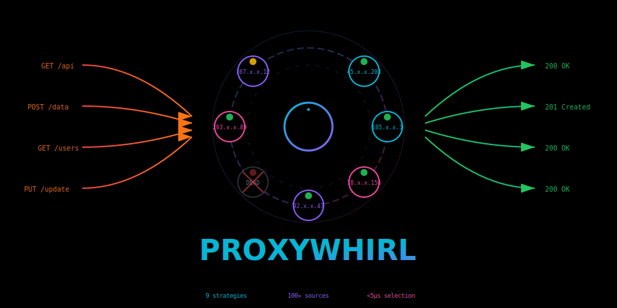
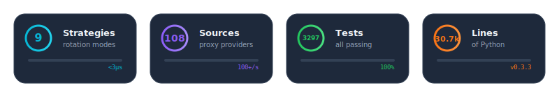

<div align="center">

<!-- Hero -->
<picture>
  <source media="(prefers-color-scheme: dark)" srcset="docs/assets/whirl.svg">
  <source media="(prefers-color-scheme: light)" srcset="docs/assets/whirl.svg">
  
</picture>

<br/><br/>

<!-- One-liner -->
<h3>🌀 Intelligent proxy rotation that just works</h3>

<br/>

<!-- Badges row 1: Key stats -->
[](https://pypi.org/project/proxywhirl/)
&nbsp;
[](https://pypi.org/project/proxywhirl/)
&nbsp;
[](https://python.org)

<!-- Live stats dashboard -->
<br/>

<br/><br/>

<!-- Navigation pills -->
[<kbd> <br> 📖 Docs <br> </kbd>](https://www.proxywhirl.com/docs/)&nbsp;&nbsp;
[<kbd> <br> 🚀 Examples <br> </kbd>](examples.ipynb)&nbsp;&nbsp;
[<kbd> <br> 💬 Discussions <br> </kbd>](https://github.com/wyattowalsh/proxywhirl/discussions)

</div>

<br/>

---

<br/>

## ⚡ 30-Second Setup

```bash
pip install proxywhirl
```

```python
from proxywhirl import ProxyWhirl

rotator = ProxyWhirl(proxies=["http://p1:8080", "http://p2:8080"])
response = rotator.get("https://api.example.com/data")
# Dead proxies auto-ejected ✓ | Slow ones deprioritized ✓ | Fast ones favored ✓
```

<br/>

---

<br/>

<div align="center">

## 🎯 Why ProxyWhirl?

<table>
<tr>
<td align="center" width="25%">
<br/>

<br/><br/>
<strong>9 Strategies</strong>
<br/>
<sub>Round-robin, weighted, geo-targeted, performance-based & more</sub>
<br/><br/>
</td>
<td align="center" width="25%">
<br/>

<br/><br/>
<strong>109 Sources</strong>
<br/>
<sub>Auto-fetch from built-in providers with validation</sub>
<br/><br/>
</td>
<td align="center" width="25%">
<br/>

<br/><br/>
<strong>Self-Healing</strong>
<br/>
<sub>Auto-eject dead proxies, circuit breakers, recovery</sub>
<br/><br/>
</td>
<td align="center" width="25%">
<br/>

<br/><br/>
<strong>Blazing Fast</strong>
<br/>
<sub>Async-first, &lt;3μs selection, zero blocking</sub>
<br/><br/>
</td>
</tr>
</table>

</div>

<br/>

---

<br/>

## 🔄 Rotation Strategies

```python
# Switch strategies on the fly
rotator = ProxyWhirl(strategy="performance-based")
rotator.set_strategy("geo-targeted", preferences={"US": [...], "EU": [...]})
```

| Strategy | Best For |
|:---------|:---------|
| `round-robin` | Even distribution |
| `random` | Unpredictable patterns |
| `weighted` | Favor reliable proxies |
| `least-used` | Even load balance |
| `performance-based` | Lowest latency |
| `geo-targeted` | Regional routing |
| `session-persistence` | Sticky sessions |
| `cost-aware` | Budget optimization |
| `composite` | Custom pipelines |

<br/>

---

<br/>

## 🎣 Auto-Fetch Proxies

```python
from proxywhirl import ProxyFetcher

# Grab 300+ validated proxies in seconds
proxies = await ProxyFetcher().fetch_all(validate=True)
```

<br/>

---

<br/>

## 🖥️ Multiple Interfaces

<table>
<tr>
<td width="33%">

**Python API**
```python
rotator.get(url)
rotator.post(url, json=data)
async with AsyncProxyWhirl() as async_rotator:
    await async_rotator.get(url)
```

</td>
<td width="33%">

**CLI**
```bash
proxywhirl fetch
proxywhirl pool list
proxywhirl health
```

</td>
<td width="33%">

**REST API**
```bash
docker-compose up -d
curl localhost:8000/api/v1/proxies
```

</td>
</tr>
</table>

<br/>

---

<br/>

<div align="center">

## 📚 Learn More

[<kbd> <br> &nbsp;&nbsp;📖 Full Documentation&nbsp;&nbsp; <br> </kbd>](https://www.proxywhirl.com/docs/)&nbsp;&nbsp;&nbsp;
[<kbd> <br> &nbsp;&nbsp;🎯 Strategy Guide&nbsp;&nbsp; <br> </kbd>](docs/source/guides/advanced-strategies.md)&nbsp;&nbsp;&nbsp;
[<kbd> <br> &nbsp;&nbsp;🤖 MCP Server&nbsp;&nbsp; <br> </kbd>](docs/source/guides/mcp-server.md)&nbsp;&nbsp;&nbsp;
[<kbd> <br> &nbsp;&nbsp;📓 Examples&nbsp;&nbsp; <br> </kbd>](examples.ipynb)

<br/><br/>

---

<br/>

[](https://star-history.com/#wyattowalsh/proxywhirl&Date)

<br/>

**[GitHub](https://github.com/wyattowalsh/proxywhirl)** · **[Issues](https://github.com/wyattowalsh/proxywhirl/issues)** · **[MIT License](LICENSE)**

<sub>Built with ❤️ for ethical web automation</sub>

</div>
