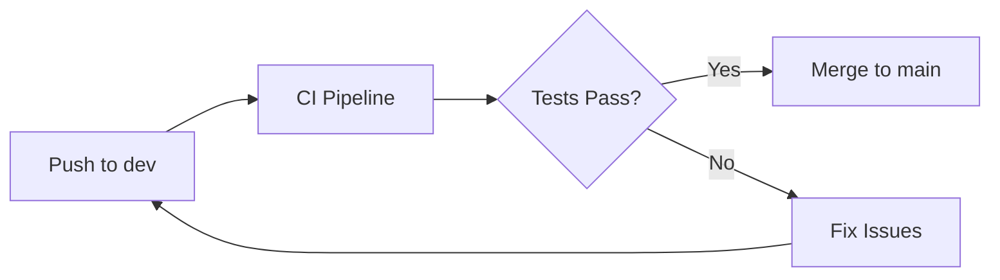
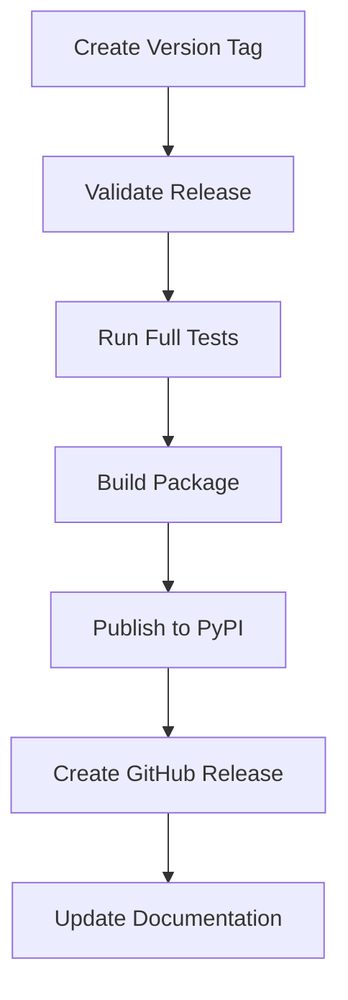
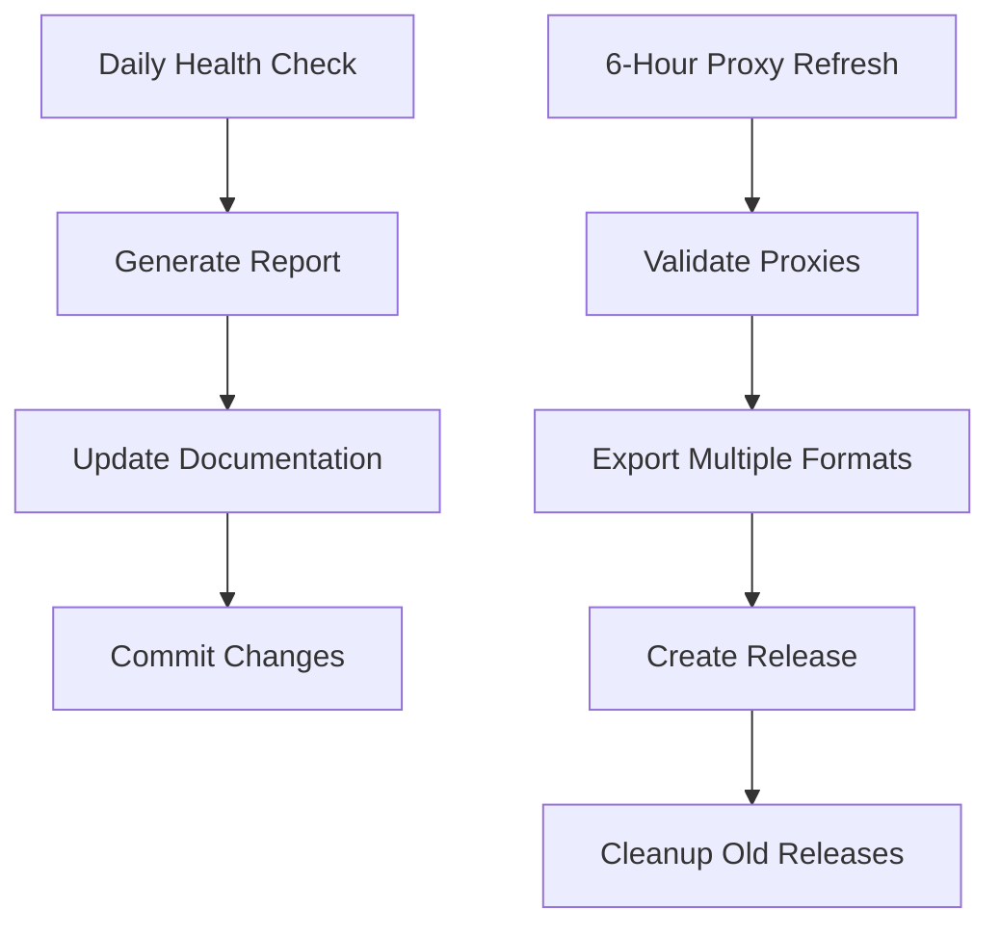

import { Step, Steps } from 'fumadocs-ui/components/steps';
import { Tab, Tabs } from 'fumadocs-ui/components/tabs';
import { Card, Cards } from 'fumadocs-ui/components/card';
import { Callout } from 'fumadocs-ui/components/callout';
import { File, Folder, Files } from 'fumadocs-ui/components/files';

<Callout title="Overview" type="info">
<span className="pw">proxywhirl</span> is a high-performance, open-source rotating proxy service  designed for large-scale web scraping operations, capable of handling **10,000+ requests/second** with intelligent proxy management, comprehensive validation pipelines, and advanced rotation algorithms.
</Callout>

## Performance Targets

<Cards>
  <Card title="Throughput" icon="📈">
    **10,000+** concurrent requests/second with automatic load balancing
  </Card>
  <Card title="Pool Scale" icon="🌐">
    **100,000+** validated proxies with real-time health monitoring
  </Card>
  <Card title="Latency" icon="⚡">
    **&lt;100ms** proxy selection time using optimized algorithms
  </Card>
  <Card title="Reliability" icon="🛡️">
    **99.9%** uptime with intelligent failover mechanisms
  </Card>
</Cards>

---

## Technology Stack

### Core Dependencies

<Tabs items={["Performance", "Data & Validation", "Networking & HTTP", "Observability"]}>

<Tab value="Performance">

```package-install
python>=3.13
pydantic>=2.11.7
sqlmodel>=0.0.21
polars>=1.12.0
orjson>=3.10.0
uvloop>=0.21.0
```

**Performance Optimizations:**
- **Python 3.13+**: Latest performance improvements, better asyncio
- **Polars**: 10-100x faster DataFrame operations than pandas
- **orjson**: Fastest JSON serialization for Python
- **uvloop**: High-performance event loop replacing asyncio's default

</Tab>

<Tab value="Data & Validation">

```package-install
pydantic-settings>=2.9.1
sqlalchemy>=2.0.0
redis-py>=5.1.0
tenacity>=9.1.2
httpx>=0.28.1
aiohttp>=3.10.0
```

**Data Layer:**
- **Pydantic v2**: Type validation with 5-50x performance improvements
- **SQLModel**: Type-safe database operations with Pydantic integration
- **Redis**: Distributed caching and session management
- **Tenacity**: Intelligent retry logic with exponential backoff

</Tab>

<Tab value="Networking & HTTP">

```package-install
httpx[http2]>=0.28.1
aiohttp[speedups]>=3.10.0
dnspython>=2.6.1
selectolax>=0.3.19
aiofiles>=24.1.0
```

**HTTP Optimizations:**
- **httpx**: Modern HTTP client with HTTP/2, connection pooling
- **aiohttp**: Additional async client for validation pipelines
- **selectolax**: Fast HTML parsing (10x faster than BeautifulSoup)
- **dnspython**: DNS resolution optimization and caching

</Tab>

<Tab value="Observability">

```package-install
loguru>=0.7.3
rich>=14.0.0
tqdm>=4.66.0
prometheus-client>=0.20.0
structlog>=24.1.0
```

**Monitoring & Debugging:**
- **loguru**: Structured logging with performance insights
- **rich**: Enhanced terminal output and debugging
- **prometheus-client**: Metrics collection and monitoring
- **structlog**: Machine-readable structured logging

</Tab>

</Tabs>

---

## Data Models & Architecture

### Core Type System

<Callout title="Type Safety" type="success">
proxywhirl uses **Pydantic v2** and **SQLModel** for end-to-end type safety, providing 5-50x performance improvements over v1 while ensuring data integrity across the entire pipeline.
</Callout>

<Tabs items={["Database Models", "API Models", "Configuration"]}>

<Tab value="Database Models">

```python title="proxywhirl/models/database.py"
from sqlmodel import SQLModel, Field, Relationship
from datetime import datetime
from enum import StrEnum
from typing import Optional, List
from ipaddress import IPv4Address, IPv6Address

class HealthStatus(StrEnum):
    ACTIVE = "active"           # Recently validated, working
    DEGRADED = "degraded"       # Working but slow/unreliable  
    FAILED = "failed"           # Validation failed
    UNTESTED = "untested"       # Not yet validated
    BLACKLISTED = "blacklisted" # Permanently blocked

class ProxyDB(SQLModel, table=True):
    """SQLModel for database persistence with optimized indexing."""
    __tablename__ = "proxies"
    
    # Primary identification
    id: Optional[int] = Field(primary_key=True)
    host: str = Field(index=True, max_length=255)
    port: int = Field(index=True, ge=1, le=65535)
    schemes: str = Field(max_length=100)  # JSON array ["http", "https"]
    
    # Geographic & metadata
    country_code: Optional[str] = Field(max_length=2, index=True)
    country: Optional[str] = Field(max_length=100)
    city: Optional[str] = Field(max_length=100)
    anonymity: str = Field(default="unknown", index=True)
    health_status: HealthStatus = Field(default=HealthStatus.UNTESTED, index=True)
    
    # Performance metrics (optimized for ML algorithms)
    avg_response_time: Optional[float] = Field(ge=0.0, le=300.0)
    success_rate: float = Field(default=0.0, ge=0.0, le=1.0)
    total_requests: int = Field(default=0, ge=0)
    consecutive_failures: int = Field(default=0, ge=0)
    
    # Timestamps (UTC, indexed for time-based queries)
    created_at: datetime = Field(default_factory=datetime.utcnow, index=True)
    last_checked: datetime = Field(default_factory=datetime.utcnow, index=True)
    last_success: Optional[datetime] = Field(index=True)
    next_check: Optional[datetime] = Field(index=True)  # Scheduled validation
    
    # Source tracking
    source: Optional[str] = Field(max_length=100, index=True)
    source_metadata: str = Field(default="{}", max_length=2000)
    
    # Relationships
    validation_logs: List["ValidationLog"] = Relationship(back_populates="proxy")
    performance_metrics: List["PerformanceMetric"] = Relationship(back_populates="proxy")
```

</Tab>

<Tab value="API Models">

```python title="proxywhirl/models/api.py"
from pydantic import BaseModel, Field, ConfigDict, computed_field
from datetime import datetime
from typing import List, Dict, Any, Optional
from enum import StrEnum

class ProxyScheme(StrEnum):
    HTTP = "http"
    HTTPS = "https" 
    SOCKS4 = "socks4"
    SOCKS5 = "socks5"

class AnonymityLevel(StrEnum):
    TRANSPARENT = "transparent"  # Real IP visible
    ANONYMOUS = "anonymous"      # IP hidden, proxy detected
    ELITE = "elite"             # IP hidden, proxy undetected
    UNKNOWN = "unknown"

class Proxy(BaseModel):
    """High-performance API model with computed properties."""
    model_config = ConfigDict(
        str_strip_whitespace=True,
        validate_assignment=True,
        extra='ignore',
        frozen=False,  # Allow modifications for performance updates
    )
    
    # Core identification
    host: str = Field(..., min_length=7, max_length=255)
    port: int = Field(..., ge=1, le=65535)
    schemes: List[ProxyScheme] = Field(..., min_length=1)
    
    # Metadata
    country_code: Optional[str] = Field(None, min_length=2, max_length=2)
    anonymity: AnonymityLevel = AnonymityLevel.UNKNOWN
    health_status: HealthStatus = HealthStatus.UNTESTED
    
    # Performance data
    avg_response_time: Optional[float] = Field(None, ge=0.0)
    success_rate: float = Field(0.0, ge=0.0, le=1.0)
    last_checked: datetime
    metadata: Dict[str, Any] = Field(default_factory=dict)
    
    @computed_field
    @property
    def proxy_url(self) -> str:
        """Primary proxy URL using the first available scheme."""
        return f"{self.schemes[0]}://{self.host}:{self.port}"
    
    @computed_field
    @property
    def all_urls(self) -> Dict[str, str]:
        """All proxy URLs mapped by scheme."""
        return {
            scheme: f"{scheme}://{self.host}:{self.port}" 
            for scheme in self.schemes
        }
    
    @computed_field
    @property
    def quality_score(self) -> float:
        """ML-based proxy quality score (0.0-1.0)."""
        base_score = self.success_rate * 0.4
        
        # Response time bonus (faster = better)
        if self.avg_response_time:
            time_score = max(0, 1.0 - (self.avg_response_time / 10.0)) * 0.3
        else:
            time_score = 0.0
        
        # Anonymity bonus
        anonymity_score = {
            AnonymityLevel.ELITE: 0.3,
            AnonymityLevel.ANONYMOUS: 0.2,
            AnonymityLevel.TRANSPARENT: 0.1,
            AnonymityLevel.UNKNOWN: 0.0
        }[self.anonymity]
        
        return min(1.0, base_score + time_score + anonymity_score)

class ProxyFilter(BaseModel):
    """Advanced filtering for proxy selection."""
    countries: Optional[List[str]] = None
    schemes: Optional[List[ProxyScheme]] = None
    anonymity_levels: Optional[List[AnonymityLevel]] = None
    min_success_rate: float = Field(0.0, ge=0.0, le=1.0)
    max_response_time: Optional[float] = Field(None, gt=0.0)
    health_statuses: Optional[List[HealthStatus]] = None
    exclude_sources: Optional[List[str]] = None
```

</Tab>

<Tab value="Configuration">

```python title="proxywhirl/config.py"
from pydantic_settings import BaseSettings, SettingsConfigDict
from typing import List, Dict, Any, Optional

class proxywhirlSettings(BaseSettings):
    """Environment-based configuration with validation."""
    model_config = SettingsConfigDict(
        env_prefix="proxywhirl_",
        env_file=".env",
        case_sensitive=False,
        extra="ignore"
    )
    
    # Performance settings
    max_concurrent_requests: int = Field(1000, ge=1, le=10000)
    max_concurrent_validations: int = Field(100, ge=1, le=1000)
    proxy_pool_size: int = Field(10000, ge=100, le=100000)
    
    # Validation settings
    validation_timeout: float = Field(10.0, ge=1.0, le=60.0)
    validation_interval: int = Field(300, ge=60, le=3600)  # seconds
    max_consecutive_failures: int = Field(3, ge=1, le=10)
    
    # Database settings
    database_url: str = "sqlite:///proxywhirl.db"
    redis_url: Optional[str] = None
    
    # Cache settings
    cache_ttl_active: int = Field(300, ge=60, le=3600)     # 5 min
    cache_ttl_failed: int = Field(1800, ge=300, le=7200)   # 30 min
    
    # Source settings
    enabled_sources: List[str] = [
        "free_proxy_list", "proxy_nova", "gather_proxy",
        "fresh_proxy_list", "hidemy_name"
    ]
    source_refresh_interval: int = Field(3600, ge=300, le=86400)
    
    # API settings
    api_host: str = "0.0.0.0"
    api_port: int = Field(8000, ge=1000, le=65535)
    api_workers: int = Field(4, ge=1, le=16)
    
    # Monitoring
    metrics_enabled: bool = True
    log_level: str = "INFO"
    prometheus_port: Optional[int] = Field(None, ge=1000, le=65535)
```

</Tab>

</Tabs>

---

## Proxy Ingestion Pipeline

### Multi-Source Aggregation Engine

<Steps>

<Step>
### Source Discovery & Registration

```python title="proxywhirl/sources/manager.py"
from abc import ABC, abstractmethod
from typing import AsyncIterator, Dict, Any, List
import asyncio
import aiohttp
from tenacity import retry, stop_after_attempt, wait_exponential

class BaseProxySource(ABC):
    """Abstract base for all proxy source implementations."""
    
    def __init__(self, name: str, config: Dict[str, Any]):
        self.name = name
        self.config = config
        self.rate_limit = config.get("rate_limit", 10)  # requests per minute
        self.timeout = config.get("timeout", 30)
        self.last_fetch: Optional[datetime] = None
        self.error_count = 0
    
    @abstractmethod
    async def fetch_raw_data(self) -> AsyncIterator[Dict[str, Any]]:
        """Fetch raw proxy data from the source."""
        pass
    
    @abstractmethod
    def normalize_proxy(self, raw_data: Dict[str, Any]) -> Optional[Proxy]:
        """Convert raw source data to standardized Proxy model."""
        pass
    
    @retry(stop=stop_after_attempt(3), wait=wait_exponential(min=1, max=10))
    async def get_proxies(self) -> List[Proxy]:
        """Main entry point for fetching normalized proxies."""
        proxies = []
        try:
            async for raw_data in self.fetch_raw_data():
                if proxy := self.normalize_proxy(raw_data):
                    proxies.append(proxy)
            
            self.error_count = 0  # Reset on success
            self.last_fetch = datetime.utcnow()
            
        except Exception as e:
            self.error_count += 1
            logger.error(f"Source {self.name} failed: {e}")
            raise
        
        return proxies
```

</Step>

<Step>
### Parallel Source Processing

```python title="proxywhirl/sources/aggregator.py"
class ProxyAggregator:
    """Orchestrates parallel ingestion from multiple sources."""
    
    def __init__(self, settings: proxywhirlSettings):
        self.settings = settings
        self.sources: Dict[str, BaseProxySource] = {}
        self.session = aiohttp.ClientSession(
            timeout=aiohttp.ClientTimeout(total=30),
            connector=aiohttp.TCPConnector(
                limit=100,
                ttl_dns_cache=300,
                use_dns_cache=True
            )
        )
    
    async def ingest_all_sources(self) -> List[Proxy]:
        """Concurrent ingestion with intelligent error handling."""
        
        # Filter enabled sources
        active_sources = [
            source for name, source in self.sources.items()
            if name in self.settings.enabled_sources
        ]
        
        # Create tasks with timeouts
        tasks = [
            asyncio.wait_for(
                self._ingest_source_safe(source),
                timeout=source.timeout
            )
            for source in active_sources
        ]
        
        # Execute with gather, capturing exceptions
        results = await asyncio.gather(*tasks, return_exceptions=True)
        
        # Process results and log metrics
        all_proxies = []
        for i, result in enumerate(results):
            source = active_sources[i]
            
            if isinstance(result, Exception):
                logger.error(f"Source {source.name} failed: {result}")
                # Update source error metrics
                await self._record_source_error(source.name, result)
            elif isinstance(result, list):
                all_proxies.extend(result)
                logger.info(f"Source {source.name}: {len(result)} proxies")
        
        # Deduplicate and return
        return await self._deduplicate_proxies(all_proxies)
    
    async def _deduplicate_proxies(self, proxies: List[Proxy]) -> List[Proxy]:
        """Remove duplicates using polars for high performance."""
        if not proxies:
            return []
        
        # Convert to polars DataFrame for fast deduplication
        import polars as pl
        
        data = [
            {
                "host": p.host,
                "port": p.port,
                "schemes": "|".join(p.schemes),
                "proxy_obj": p
            }
            for p in proxies
        ]
        
        df = pl.DataFrame(data)
        
        # Deduplicate by host:port, keeping the best proxy
        deduplicated = (
            df
            .with_columns([
                pl.col("proxy_obj").map_elements(
                    lambda p: p.quality_score, 
                    return_dtype=pl.Float32
                ).alias("quality_score")
            ])
            .sort("quality_score", descending=True)
            .unique(subset=["host", "port"], keep="first")
        )
        
        return [row["proxy_obj"] for row in deduplicated.to_dicts()]
```

</Step>

<Step>
### Source Implementations

<Tabs items={["Free Proxy List", "Proxy Nova", "Fresh Proxy List"]}>

<Tab value="Free Proxy List">

```python title="proxywhirl/sources/free_proxy_list.py"
import re
from bs4 import BeautifulSoup
from ..models import Proxy, ProxyScheme, AnonymityLevel

class FreeProxyListSource(BaseProxySource):
    """Scraper for free-proxy-list.net with rate limiting."""
    
    def __init__(self):
        super().__init__("free_proxy_list", {
            "base_url": "https://free-proxy-list.net/",
            "rate_limit": 10,  # Respectful scraping
            "timeout": 15
        })
    
    async def fetch_raw_data(self) -> AsyncIterator[Dict[str, Any]]:
        """Scrape proxy table with pagination support."""
        async with self.session.get(self.config["base_url"]) as response:
            html = await response.text()
            soup = BeautifulSoup(html, 'lxml')
            
            table = soup.find('table', {'id': 'proxylisttable'})
            if not table:
                logger.warning("No proxy table found")
                return
            
            for row in table.find('tbody').find_all('tr'):
                cols = row.find_all('td')
                if len(cols) >= 7:
                    yield {
                        'ip': cols[0].text.strip(),
                        'port': cols[1].text.strip(),
                        'country_code': cols[2].text.strip(),
                        'country': cols[3].text.strip(),
                        'anonymity': cols[4].text.strip(),
                        'google': cols[5].text.strip(),
                        'https': cols[6].text.strip(),
                        'last_checked': cols[7].text.strip() if len(cols) > 7 else None
                    }
    
    def normalize_proxy(self, raw_data: Dict[str, Any]) -> Optional[Proxy]:
        """Convert scraped data to Proxy model."""
        try:
            # Validate IP format
            if not re.match(r'^\d{1,3}\.\d{1,3}\.\d{1,3}\.\d{1,3}$', raw_data['ip']):
                return None
            
            # Determine schemes
            schemes = [ProxyScheme.HTTP]
            if raw_data.get('https') == 'yes':
                schemes.append(ProxyScheme.HTTPS)
            
            # Map anonymity level
            anonymity_map = {
                'transparent': AnonymityLevel.TRANSPARENT,
                'anonymous': AnonymityLevel.ANONYMOUS,
                'elite proxy': AnonymityLevel.ELITE
            }
            anonymity = anonymity_map.get(
                raw_data.get('anonymity', '').lower(),
                AnonymityLevel.UNKNOWN
            )
            
            return Proxy(
                host=raw_data['ip'],
                port=int(raw_data['port']),
                schemes=schemes,
                country_code=raw_data.get('country_code') or None,
                country=raw_data.get('country') or None,
                anonymity=anonymity,
                last_checked=datetime.utcnow(),
                metadata={
                    'source': self.name,
                    'google_passed': raw_data.get('google') == 'yes',
                    'original_anonymity': raw_data.get('anonymity')
                }
            )
        
        except (ValueError, KeyError) as e:
            logger.debug(f"Failed to normalize proxy data: {e}")
            return None
```

</Tab>

<Tab value="Proxy Nova">

```python title="proxywhirl/sources/proxy_nova.py"
class ProxyNovaSource(BaseProxySource):
    """API-based source for ProxyNova with JSON responses."""
    
    def __init__(self):
        super().__init__("proxy_nova", {
            "api_url": "https://api.proxynova.com/proxies",
            "api_key": os.getenv("PROXYNOVA_API_KEY"),
            "rate_limit": 60,  # Higher rate limit for API
            "timeout": 10
        })
    
    async def fetch_raw_data(self) -> AsyncIterator[Dict[str, Any]]:
        """Fetch from ProxyNova API with pagination."""
        page = 1
        max_pages = 10  # Reasonable limit
        
        while page <= max_pages:
            params = {
                'page': page,
                'format': 'json',
                'limit': 100
            }
            
            if self.config.get("api_key"):
                params['api_key'] = self.config["api_key"]
            
            async with self.session.get(
                self.config["api_url"], 
                params=params
            ) as response:
                
                if response.status != 200:
                    logger.warning(f"API returned {response.status}")
                    break
                
                data = await response.json()
                proxies = data.get('proxies', [])
                
                if not proxies:
                    break
                
                for proxy_data in proxies:
                    yield proxy_data
                
                # Check if more pages available
                if len(proxies) < params['limit']:
                    break
                
                page += 1
    
    def normalize_proxy(self, raw_data: Dict[str, Any]) -> Optional[Proxy]:
        """Normalize ProxyNova API response."""
        try:
            # API provides cleaner data structure
            schemes = []
            for protocol in raw_data.get('protocols', []):
                if protocol.lower() in ['http', 'https', 'socks4', 'socks5']:
                    schemes.append(ProxyScheme(protocol.lower()))
            
            if not schemes:
                schemes = [ProxyScheme.HTTP]  # Default fallback
            
            return Proxy(
                host=raw_data['ip'],
                port=int(raw_data['port']),
                schemes=schemes,
                country_code=raw_data.get('country_code'),
                country=raw_data.get('country'),
                anonymity=AnonymityLevel(raw_data.get('anonymity', 'unknown').lower()),
                avg_response_time=raw_data.get('response_time'),
                last_checked=datetime.utcnow(),
                metadata={
                    'source': self.name,
                    'uptime': raw_data.get('uptime'),
                    'last_tested': raw_data.get('last_tested')
                }
            )
        
        except (ValueError, KeyError, TypeError) as e:
            logger.debug(f"Failed to normalize ProxyNova data: {e}")
            return None
```

</Tab>

<Tab value="Fresh Proxy List">

```python title="proxywhirl/sources/fresh_proxy_list.py"
class FreshProxyListSource(BaseProxySource):
    """GitHub-hosted JSON feed with high reliability."""
    
    def __init__(self):
        super().__init__("fresh_proxy_list", {
            "json_url": "https://vakhov.github.io/fresh-proxy-list/proxylist.json",
            "backup_urls": [
                "https://raw.githubusercontent.com/vakhov/fresh-proxy-list/main/proxylist.json"
            ],
            "rate_limit": 30,  # GitHub has generous limits
            "timeout": 20
        })
    
    async def fetch_raw_data(self) -> AsyncIterator[Dict[str, Any]]:
        """Fetch JSON with fallback URLs."""
        urls = [self.config["json_url"]] + self.config["backup_urls"]
        
        for url in urls:
            try:
                async with self.session.get(url) as response:
                    if response.status == 200:
                        data = await response.json()
                        
                        # Handle different JSON structures
                        if isinstance(data, list):
                            for item in data:
                                yield item
                        elif isinstance(data, dict) and 'proxies' in data:
                            for item in data['proxies']:
                                yield item
                        
                        return  # Success, don't try backup URLs
                        
            except Exception as e:
                logger.warning(f"Failed to fetch from {url}: {e}")
                continue
        
        raise Exception("All Fresh Proxy List URLs failed")
    
    def normalize_proxy(self, raw_data: Dict[str, Any]) -> Optional[Proxy]:
        """Normalize Fresh Proxy List JSON format."""
        try:
            # JSON format is typically well-structured
            host = raw_data.get('host') or raw_data.get('ip')
            port = raw_data.get('port')
            
            if not host or not port:
                return None
            
            # Parse schemes from various formats
            schemes = []
            scheme_data = raw_data.get('protocols') or raw_data.get('schemes') or ['http']
            
            for scheme in scheme_data:
                try:
                    schemes.append(ProxyScheme(scheme.lower()))
                except ValueError:
                    continue
            
            if not schemes:
                schemes = [ProxyScheme.HTTP]
            
            return Proxy(
                host=host,
                port=int(port),
                schemes=schemes,
                country_code=raw_data.get('country'),
                anonymity=AnonymityLevel(raw_data.get('anonymity', 'unknown').lower()),
                last_checked=datetime.utcnow(),
                metadata={
                    'source': self.name,
                    'score': raw_data.get('score'),
                    'speed': raw_data.get('speed')
                }
            )
        
        except (ValueError, TypeError) as e:
            logger.debug(f"Failed to normalize Fresh Proxy List data: {e}")
            return None
```

</Tab>

</Tabs>

</Step>

</Steps>

---

## Advanced Validation Engine

<Callout title="Multi-Layer Validation" type="success">
proxywhirl employs a **5-stage validation pipeline** that tests connectivity, anonymity, performance, geographic accuracy, and anti-detection capabilities. Each validator runs **concurrently** with intelligent **circuit breaker** patterns.
</Callout>

### Validation Pipeline Architecture

<Steps>

<Step>
### Stage 1: Connectivity Validation

```python title="proxywhirl/validators/connectivity.py"
from dataclasses import dataclass
from typing import Optional, List, Dict, Any
import asyncio
import aiohttp
import time
from tenacity import retry, stop_after_attempt, wait_exponential

@dataclass
class ValidationResult:
    """Comprehensive validation result with performance metrics."""
    proxy: Proxy
    stage: str
    success: bool = False
    response_time: Optional[float] = None
    error_message: Optional[str] = None
    metadata: Dict[str, Any] = None
    
    def __post_init__(self):
        if self.metadata is None:
            self.metadata = {}

class ConnectivityValidator:
    """Basic HTTP/HTTPS/SOCKS connectivity testing with circuit breaker."""
    
    def __init__(self, timeout: float = 10.0, max_retries: int = 2):
        self.timeout = timeout
        self.max_retries = max_retries
        self.test_urls = [
            "http://httpbin.org/ip",
            "https://httpbin.org/ip", 
            "http://icanhazip.com",
            "https://api.ipify.org?format=json"
        ]
    
    async def validate(self, proxy: Proxy) -> ValidationResult:
        """Test basic connectivity across all supported schemes."""
        result = ValidationResult(proxy=proxy, stage="connectivity")
        
        best_time = float('inf')
        successful_schemes = []
        
        for scheme in proxy.schemes:
            scheme_result = await self._test_scheme(proxy, scheme)
            
            if scheme_result['success']:
                successful_schemes.append(scheme)
                if scheme_result['response_time'] < best_time:
                    best_time = scheme_result['response_time']
        
        if successful_schemes:
            result.success = True
            result.response_time = best_time if best_time != float('inf') else None
            result.metadata = {
                'successful_schemes': successful_schemes,
                'tested_schemes': list(proxy.schemes)
            }
        else:
            result.error_message = "All schemes failed connectivity test"
        
        return result
    
    @retry(stop=stop_after_attempt(2), wait=wait_exponential(min=1, max=5))
    async def _test_scheme(self, proxy: Proxy, scheme: str) -> Dict[str, Any]:
        """Test connectivity for a specific scheme."""
        proxy_url = f"{scheme}://{proxy.host}:{proxy.port}"
        
        # Select appropriate test URL
        test_url = next(
            (url for url in self.test_urls if url.startswith(scheme)),
            self.test_urls[0]
        )
        
        connector = aiohttp.TCPConnector(
            ttl_dns_cache=300,
            use_dns_cache=True,
            limit=1
        )
        
        timeout = aiohttp.ClientTimeout(total=self.timeout)
        
        try:
            start_time = time.time()
            
            async with aiohttp.ClientSession(
                connector=connector,
                timeout=timeout
            ) as session:
                async with session.get(
                    test_url,
                    proxy=proxy_url,
                    allow_redirects=False
                ) as response:
                    
                    response_time = time.time() - start_time
                    
                    # Successful if we get any response
                    if 200 <= response.status < 400:
                        return {
                            'success': True,
                            'response_time': response_time,
                            'status_code': response.status
                        }
                    else:
                        return {
                            'success': False,
                            'error': f"HTTP {response.status}",
                            'response_time': response_time
                        }
        
        except asyncio.TimeoutError:
            return {'success': False, 'error': 'Timeout'}
        except aiohttp.ClientError as e:
            return {'success': False, 'error': f"Client error: {str(e)}"}
        except Exception as e:
            return {'success': False, 'error': f"Unexpected error: {str(e)}"}
```

</Step>

<Step>
### Stage 2: Anonymity Verification

```python title="proxywhirl/validators/anonymity.py"
import json
from typing import Set

class AnonymityValidator:
    """Comprehensive anonymity testing against multiple detection services."""
    
    def __init__(self):
        self.detection_services = [
            "http://httpbin.org/headers",
            "https://httpbin.org/headers", 
            "http://httpbin.org/get",
            "https://ident.me/json",
            "https://ipapi.co/json/"
        ]
        self.real_ip = None  # Cache real IP for comparison
    
    async def validate(self, proxy: Proxy) -> ValidationResult:
        """Test proxy anonymity using multiple detection methods."""
        result = ValidationResult(proxy=proxy, stage="anonymity")
        
        try:
            # Get real IP first (cached)
            if not self.real_ip:
                self.real_ip = await self._get_real_ip()
            
            # Test anonymity through proxy
            anonymity_tests = await asyncio.gather(*[
                self._test_ip_leak(proxy),
                self._test_header_forwarding(proxy),
                self._test_dns_leak(proxy)
            ], return_exceptions=True)
            
            passed_tests = sum(
                1 for test in anonymity_tests 
                if test is True or (isinstance(test, dict) and test.get('passed'))
            )
            
            total_tests = len(anonymity_tests)
            anonymity_score = passed_tests / total_tests
            
            # Determine anonymity level
            if anonymity_score >= 0.9:
                detected_level = AnonymityLevel.ELITE
                result.success = True
            elif anonymity_score >= 0.7:
                detected_level = AnonymityLevel.ANONYMOUS
                result.success = True
            elif anonymity_score >= 0.3:
                detected_level = AnonymityLevel.TRANSPARENT
                result.success = True  # Still functional, just not anonymous
            else:
                detected_level = AnonymityLevel.UNKNOWN
                result.success = False
            
            result.metadata = {
                'detected_anonymity': detected_level,
                'anonymity_score': anonymity_score,
                'passed_tests': passed_tests,
                'total_tests': total_tests,
                'test_details': [
                    str(test) for test in anonymity_tests 
                    if not isinstance(test, Exception)
                ]
            }
            
        except Exception as e:
            result.error_message = f"Anonymity validation failed: {str(e)}"
        
        return result
    
    async def _test_ip_leak(self, proxy: Proxy) -> bool:
        """Test if real IP is leaked through proxy."""
        proxy_url = proxy.proxy_url
        
        try:
            async with aiohttp.ClientSession() as session:
                async with session.get(
                    "https://httpbin.org/ip",
                    proxy=proxy_url,
                    timeout=aiohttp.ClientTimeout(total=15)
                ) as response:
                    
                    if response.status == 200:
                        data = await response.json()
                        proxy_ip = data.get('origin', '').split(',')[0].strip()
                        
                        # Success if proxy IP differs from real IP
                        return proxy_ip != self.real_ip and proxy_ip != ""
        
        except Exception:
            pass
        
        return False
    
    async def _test_header_forwarding(self, proxy: Proxy) -> Dict[str, Any]:
        """Test for header forwarding that reveals real IP."""
        proxy_url = proxy.proxy_url
        leaked_headers = set()
        
        try:
            async with aiohttp.ClientSession() as session:
                async with session.get(
                    "http://httpbin.org/headers",
                    proxy=proxy_url,
                    timeout=aiohttp.ClientTimeout(total=15)
                ) as response:
                    
                    if response.status == 200:
                        data = await response.json()
                        headers = data.get('headers', {})
                        
                        # Check for headers that might leak real IP
                        leak_headers = [
                            'X-Forwarded-For', 'X-Real-IP', 'X-Originating-IP',
                            'X-Client-IP', 'X-Cluster-Client-IP', 'Forwarded'
                        ]
                        
                        for header in leak_headers:
                            if header in headers:
                                header_value = headers[header]
                                if self.real_ip and self.real_ip in header_value:
                                    leaked_headers.add(header)
                        
                        return {
                            'passed': len(leaked_headers) == 0,
                            'leaked_headers': list(leaked_headers),
                            'all_headers': list(headers.keys())
                        }
        
        except Exception:
            pass
        
        return {'passed': False, 'error': 'Header test failed'}
    
    async def _get_real_ip(self) -> Optional[str]:
        """Get real IP address for comparison."""
        try:
            async with aiohttp.ClientSession() as session:
                async with session.get(
                    "https://api.ipify.org",
                    timeout=aiohttp.ClientTimeout(total=10)
                ) as response:
                    if response.status == 200:
                        return await response.text()
        except Exception:
            pass
        return None
```

</Step>

<Step>
### Stage 3: Performance Benchmarking

```python title="proxywhirl/validators/performance.py"
import statistics
from concurrent.futures import ThreadPoolExecutor

class PerformanceValidator:
    """Comprehensive performance testing with multiple metrics."""
    
    def __init__(self):
        self.benchmark_urls = [
            "http://httpbin.org/bytes/1024",     # 1KB download
            "http://httpbin.org/bytes/10240",    # 10KB download
            "https://httpbin.org/delay/1",       # Latency test
            "http://httpbin.org/status/200",     # Basic response test
        ]
        self.test_iterations = 3
    
    async def validate(self, proxy: Proxy) -> ValidationResult:
        """Run comprehensive performance benchmarks."""
        result = ValidationResult(proxy=proxy, stage="performance")
        
        try:
            # Run multiple performance tests
            performance_tasks = [
                self._measure_latency(proxy),
                self._measure_throughput(proxy),
                self._measure_stability(proxy),
                self._measure_geographic_routing(proxy)
            ]
            
            perf_results = await asyncio.gather(
                *performance_tasks, 
                return_exceptions=True
            )
            
            # Process results
            latency_data = perf_results[0] if not isinstance(perf_results[0], Exception) else {}
            throughput_data = perf_results[1] if not isinstance(perf_results[1], Exception) else {}
            stability_data = perf_results[2] if not isinstance(perf_results[2], Exception) else {}
            geo_data = perf_results[3] if not isinstance(perf_results[3], Exception) else {}
            
            # Calculate composite performance score
            performance_score = self._calculate_performance_score(
                latency_data, throughput_data, stability_data, geo_data
            )
            
            if performance_score > 0.3:  # Minimum viable performance
                result.success = True
                result.response_time = latency_data.get('avg_latency')
                result.metadata = {
                    'performance_score': performance_score,
                    'latency': latency_data,
                    'throughput': throughput_data,
                    'stability': stability_data,
                    'geographic': geo_data
                }
            else:
                result.error_message = f"Poor performance: score {performance_score:.2f}"
        
        except Exception as e:
            result.error_message = f"Performance validation failed: {str(e)}"
        
        return result
    
    async def _measure_latency(self, proxy: Proxy) -> Dict[str, float]:
        """Measure latency with multiple samples."""
        latencies = []
        proxy_url = proxy.proxy_url
        
        for _ in range(self.test_iterations):
            try:
                start_time = time.time()
                
                async with aiohttp.ClientSession() as session:
                    async with session.get(
                        "http://httpbin.org/status/200",
                        proxy=proxy_url,
                        timeout=aiohttp.ClientTimeout(total=10)
                    ) as response:
                        
                        if response.status == 200:
                            latency = time.time() - start_time
                            latencies.append(latency)
            
            except Exception:
                continue
        
        if latencies:
            return {
                'avg_latency': statistics.mean(latencies),
                'min_latency': min(latencies),
                'max_latency': max(latencies),
                'latency_variance': statistics.variance(latencies) if len(latencies) > 1 else 0,
                'successful_samples': len(latencies),
                'total_samples': self.test_iterations
            }
        
        return {'avg_latency': None, 'successful_samples': 0}
    
    async def _measure_throughput(self, proxy: Proxy) -> Dict[str, float]:
        """Measure data transfer throughput."""
        try:
            data_sizes = [1024, 10240, 51200]  # 1KB, 10KB, 50KB
            throughput_results = []
            
            for size in data_sizes:
                start_time = time.time()
                
                async with aiohttp.ClientSession() as session:
                    async with session.get(
                        f"http://httpbin.org/bytes/{size}",
                        proxy=proxy.proxy_url,
                        timeout=aiohttp.ClientTimeout(total=30)
                    ) as response:
                        
                        if response.status == 200:
                            data = await response.read()
                            transfer_time = time.time() - start_time
                            
                            if transfer_time > 0:
                                throughput = len(data) / transfer_time  # bytes/second
                                throughput_results.append(throughput)
            
            if throughput_results:
                return {
                    'avg_throughput_bps': statistics.mean(throughput_results),
                    'max_throughput_bps': max(throughput_results),
                    'throughput_samples': len(throughput_results)
                }
        
        except Exception:
            pass
        
        return {'avg_throughput_bps': 0, 'throughput_samples': 0}
    
    def _calculate_performance_score(self, latency: Dict, throughput: Dict, 
                                   stability: Dict, geo: Dict) -> float:
        """Calculate composite performance score (0.0-1.0)."""
        score = 0.0
        
        # Latency score (40% weight)
        if latency.get('avg_latency'):
            latency_score = max(0, 1.0 - (latency['avg_latency'] / 10.0))  # 10s = 0 score
            score += latency_score * 0.4
        
        # Throughput score (30% weight)  
        if throughput.get('avg_throughput_bps'):
            # 1MB/s = perfect score
            throughput_score = min(1.0, throughput['avg_throughput_bps'] / (1024 * 1024))
            score += throughput_score * 0.3
        
        # Stability score (20% weight)
        if stability.get('success_rate'):
            score += stability['success_rate'] * 0.2
        
        # Geographic score (10% weight)
        if geo.get('routing_efficiency'):
            score += geo['routing_efficiency'] * 0.1
        
        return min(1.0, score)
```

</Step>

<Step>
### Validation Orchestrator

```python title="proxywhirl/validators/orchestrator.py"
class ValidationOrchestrator:
    """Coordinates all validation stages with intelligent prioritization."""
    
    def __init__(self, settings: proxywhirlSettings):
        self.settings = settings
        self.validators = {
            'connectivity': ConnectivityValidator(timeout=settings.validation_timeout),
            'anonymity': AnonymityValidator(),
            'performance': PerformanceValidator(),
            'geographic': GeographicValidator(),
            'anti_detection': AntiDetectionValidator()
        }
        self.semaphore = asyncio.Semaphore(settings.max_concurrent_validations)
    
    async def validate_batch(self, proxies: List[Proxy], 
                           stages: List[str] = None) -> List[Dict[str, ValidationResult]]:
        """Validate proxies in batches with stage progression."""
        
        if stages is None:
            stages = ['connectivity', 'anonymity', 'performance']
        
        # Create validation tasks
        tasks = [
            self._validate_single_with_semaphore(proxy, stages)
            for proxy in proxies
        ]
        
        # Execute with controlled concurrency
        results = await asyncio.gather(*tasks, return_exceptions=True)
        
        # Filter out exceptions and return successful validations
        successful_results = [
            result for result in results 
            if not isinstance(result, Exception)
        ]
        
        return successful_results
    
    async def _validate_single_with_semaphore(self, proxy: Proxy, 
                                            stages: List[str]) -> Dict[str, ValidationResult]:
        """Validate single proxy with semaphore protection."""
        async with self.semaphore:
            return await self._validate_single(proxy, stages)
    
    async def _validate_single(self, proxy: Proxy, 
                             stages: List[str]) -> Dict[str, ValidationResult]:
        """Progressive validation - stop early on critical failures."""
        results = {}
        
        for stage in stages:
            if stage not in self.validators:
                continue
            
            validator = self.validators[stage]
            
            try:
                stage_result = await validator.validate(proxy)
                results[stage] = stage_result
                
                # Early termination on connectivity failure
                if stage == 'connectivity' and not stage_result.success:
                    logger.debug(f"Proxy {proxy.host}:{proxy.port} failed connectivity")
                    break
                
                # Skip performance tests for failed anonymity (optional)
                if stage == 'anonymity' and not stage_result.success:
                    if 'performance' in stages[stages.index(stage):]:
                        logger.debug(f"Skipping performance test for non-anonymous proxy")
            
            except Exception as e:
                logger.error(f"Validation stage {stage} failed for {proxy.host}: {e}")
                results[stage] = ValidationResult(
                    proxy=proxy,
                    stage=stage,
                    success=False,
                    error_message=str(e)
                )
        
        return results
    
    async def continuous_validation(self, proxy_pool: List[Proxy]) -> None:
        """Background continuous validation of proxy pool."""
        logger.info("Starting continuous validation loop")
        
        while True:
            try:
                # Select proxies for re-validation based on priority
                stale_proxies = self._select_stale_proxies(proxy_pool)
                
                if stale_proxies:
                    logger.info(f"Re-validating {len(stale_proxies)} stale proxies")
                    
                    validation_results = await self.validate_batch(
                        stale_proxies, 
                        stages=['connectivity', 'performance']  # Lighter validation
                    )
                    
                    # Update proxy health based on results
                    await self._update_proxy_health(validation_results)
                
                # Wait before next validation cycle
                await asyncio.sleep(self.settings.validation_interval)
                
            except Exception as e:
                logger.error(f"Continuous validation error: {e}")
                await asyncio.sleep(60)  # Error backoff
    
    def _select_stale_proxies(self, proxy_pool: List[Proxy]) -> List[Proxy]:
        """Select proxies that need re-validation based on staleness."""
        current_time = datetime.utcnow()
        stale_threshold = timedelta(seconds=self.settings.validation_interval)
        
        stale_proxies = []
        
        for proxy in proxy_pool:
            time_since_check = current_time - proxy.last_checked
            
            # Prioritize failed or untested proxies
            if proxy.health_status in [HealthStatus.FAILED, HealthStatus.UNTESTED]:
                stale_proxies.append(proxy)
            # Regular re-validation for active proxies
            elif time_since_check > stale_threshold:
                stale_proxies.append(proxy)
        
        # Limit batch size and prioritize by staleness
        stale_proxies.sort(key=lambda p: p.last_checked)
        return stale_proxies[:self.settings.max_concurrent_validations]
```

</Step>

</Steps>

---

## Intelligent Rotation Algorithms

<Callout title="ML-Powered Selection" type="success">
proxywhirl implements **adaptive rotation strategies** that learn from usage patterns, failure rates, and performance metrics to intelligently select the optimal proxy for each request context.
</Callout>

### Strategy Architecture

<Tabs items={["Weighted Round Robin", "Geographic Router", "ML Adaptive", "Performance Based"]}>

<Tab value="Weighted Round Robin">

```python title="proxywhirl/rotation/weighted_round_robin.py"
from collections import defaultdict, deque
import random
import time

class WeightedRoundRobinRotator:
    """Performance-weighted round-robin with adaptive weight adjustment."""
    
    def __init__(self, weight_decay: float = 0.95, min_weight: float = 0.1):
        self.weights: Dict[str, float] = defaultdict(lambda: 1.0)
        self.weight_decay = weight_decay  # Decay factor for old performance
        self.min_weight = min_weight      # Minimum weight to prevent complete exclusion
        self.selection_history = deque(maxlen=1000)  # Track recent selections
        self.performance_window = defaultdict(lambda: deque(maxlen=50))
    
    def select_proxy(self, available_proxies: List[Proxy], 
                    context: Optional[Dict[str, Any]] = None) -> Optional[Proxy]:
        """Select proxy using weighted random selection based on performance."""
        
        if not available_proxies:
            return None
        
        # Update weights based on recent performance
        self._update_weights(available_proxies)
        
        # Calculate selection weights
        weighted_proxies = []
        total_weight = 0.0
        
        for proxy in available_proxies:
            proxy_key = f"{proxy.host}:{proxy.port}"
            
            # Base weight from historical performance
            base_weight = self.weights[proxy_key]
            
            # Apply success rate multiplier
            success_weight = base_weight * proxy.success_rate
            
            # Apply response time bonus (faster = higher weight)
            if proxy.avg_response_time:
                time_bonus = max(0.1, 1.0 / (proxy.avg_response_time + 0.1))
                success_weight *= time_bonus
            
            # Apply anonymity bonus
            anonymity_bonus = {
                AnonymityLevel.ELITE: 1.5,
                AnonymityLevel.ANONYMOUS: 1.2,
                AnonymityLevel.TRANSPARENT: 1.0,
                AnonymityLevel.UNKNOWN: 0.8
            }.get(proxy.anonymity, 1.0)
            
            final_weight = success_weight * anonymity_bonus
            final_weight = max(self.min_weight, final_weight)  # Ensure minimum
            
            weighted_proxies.append((final_weight, proxy))
            total_weight += final_weight
        
        # Weighted random selection
        if total_weight <= 0:
            return random.choice(available_proxies)
        
        r = random.uniform(0, total_weight)
        cumulative = 0.0
        
        for weight, proxy in weighted_proxies:
            cumulative += weight
            if r <= cumulative:
                self._record_selection(proxy)
                return proxy
        
        # Fallback to last proxy
        return weighted_proxies[-1][1]
    
    def update_performance(self, proxy: Proxy, success: bool, 
                          response_time: float) -> None:
        """Update proxy performance and adjust weights."""
        proxy_key = f"{proxy.host}:{proxy.port}"
        
        # Record performance sample
        performance_sample = {
            'success': success,
            'response_time': response_time,
            'timestamp': time.time()
        }
        
        self.performance_window[proxy_key].append(performance_sample)
        
        # Update weight based on immediate feedback
        if success:
            # Boost weight for successful requests
            self.weights[proxy_key] *= 1.05
        else:
            # Reduce weight for failures
            self.weights[proxy_key] *= 0.9
        
        # Apply bounds
        self.weights[proxy_key] = max(
            self.min_weight, 
            min(10.0, self.weights[proxy_key])
        )
    
    def _update_weights(self, available_proxies: List[Proxy]) -> None:
        """Periodic weight updates based on performance windows."""
        current_time = time.time()
        
        for proxy in available_proxies:
            proxy_key = f"{proxy.host}:{proxy.port}"
            performance_data = self.performance_window[proxy_key]
            
            if len(performance_data) < 5:  # Need minimum samples
                continue
            
            # Calculate recent performance metrics
            recent_samples = [
                sample for sample in performance_data
                if current_time - sample['timestamp'] < 300  # Last 5 minutes
            ]
            
            if recent_samples:
                success_rate = sum(1 for s in recent_samples if s['success']) / len(recent_samples)
                avg_response_time = sum(s['response_time'] for s in recent_samples) / len(recent_samples)
                
                # Adaptive weight adjustment
                performance_score = success_rate * (1.0 / max(0.1, avg_response_time))
                target_weight = performance_score * 2.0  # Scale to reasonable range
                
                # Smooth weight transition
                current_weight = self.weights[proxy_key]
                self.weights[proxy_key] = (
                    current_weight * 0.8 + target_weight * 0.2
                )
    
    def _record_selection(self, proxy: Proxy) -> None:
        """Record proxy selection for analytics."""
        self.selection_history.append({
            'proxy': f"{proxy.host}:{proxy.port}",
            'timestamp': time.time(),
            'success_rate': proxy.success_rate,
            'response_time': proxy.avg_response_time
        })
```

</Tab>

<Tab value="Geographic Router">

```python title="proxywhirl/rotation/geographic.py"
import geoip2.database
from geopy.distance import geodesic

class GeographicRotator:
    """Geographic-aware proxy selection with distance optimization."""
    
    def __init__(self, preferred_countries: List[str] = None, 
                 geoip_db_path: str = None):
        self.preferred_countries = preferred_countries or []
        self.country_pools: Dict[str, List[Proxy]] = defaultdict(list)
        self.city_coordinates: Dict[str, Tuple[float, float]] = {}
        
        # Load GeoIP database for advanced geographic routing
        if geoip_db_path:
            try:
                self.geoip_reader = geoip2.database.Reader(geoip_db_path)
            except Exception as e:
                logger.warning(f"Failed to load GeoIP database: {e}")
                self.geoip_reader = None
        else:
            self.geoip_reader = None
    
    def select_proxy(self, available_proxies: List[Proxy],
                    context: Optional[Dict[str, Any]] = None) -> Optional[Proxy]:
        """Select proxy based on geographic preferences and proximity."""
        
        if not available_proxies:
            return None
        
        # Update country pools
        self._update_country_pools(available_proxies)
        
        # Extract target preferences from context
        target_country = context.get("target_country") if context else None
        target_region = context.get("target_region") if context else None  
        target_location = context.get("target_location") if context else None  # (lat, lon)
        avoid_countries = context.get("avoid_countries", []) if context else []
        
        # Strategy 1: Exact country match
        if target_country and target_country in self.country_pools:
            candidates = [
                p for p in self.country_pools[target_country]
                if p in available_proxies
            ]
            if candidates:
                return self._select_best_in_country(candidates, target_location)
        
        # Strategy 2: Regional preferences
        if target_region:
            regional_candidates = self._get_regional_proxies(
                available_proxies, target_region, avoid_countries
            )
            if regional_candidates:
                return self._select_best_in_region(
                    regional_candidates, target_location
                )
        
        # Strategy 3: Preferred countries
        for country in self.preferred_countries:
            if country in avoid_countries:
                continue
                
            candidates = [
                p for p in self.country_pools.get(country, [])
                if p in available_proxies
            ]
            if candidates:
                return self._select_best_in_country(candidates, target_location)
        
        # Strategy 4: Proximity-based selection
        if target_location and self.geoip_reader:
            return self._select_by_proximity(available_proxies, target_location)
        
        # Fallback: Avoid blacklisted countries
        filtered_proxies = [
            p for p in available_proxies
            if p.country_code not in avoid_countries
        ]
        
        return random.choice(filtered_proxies) if filtered_proxies else random.choice(available_proxies)
    
    def _select_best_in_country(self, candidates: List[Proxy], 
                               target_location: Optional[Tuple[float, float]]) -> Proxy:
        """Select best proxy within a country."""
        if len(candidates) == 1:
            return candidates[0]
        
        # If we have target location, use proximity
        if target_location and self.geoip_reader:
            return self._select_by_proximity(candidates, target_location)
        
        # Otherwise, use performance-based selection
        candidates.sort(
            key=lambda p: (p.success_rate, -p.avg_response_time if p.avg_response_time else 0),
            reverse=True
        )
        
        # Weighted selection from top performers
        top_candidates = candidates[:min(5, len(candidates))]
        weights = [p.success_rate for p in top_candidates]
        
        if sum(weights) > 0:
            return random.choices(top_candidates, weights=weights)[0]
        
        return random.choice(candidates)
    
    def _get_regional_proxies(self, available_proxies: List[Proxy], 
                            target_region: str, 
                            avoid_countries: List[str]) -> List[Proxy]:
        """Get proxies from a specific region."""
        regional_mapping = {
            'europe': ['GB', 'DE', 'FR', 'IT', 'ES', 'NL', 'PL', 'SE', 'NO'],
            'north_america': ['US', 'CA', 'MX'],
            'asia_pacific': ['JP', 'KR', 'SG', 'AU', 'HK', 'TW'],
            'south_america': ['BR', 'AR', 'CL', 'CO'],
            'middle_east': ['AE', 'SA', 'IL', 'TR'],
            'africa': ['ZA', 'EG', 'NG', 'KE']
        }
        
        region_countries = regional_mapping.get(target_region.lower(), [])
        
        return [
            proxy for proxy in available_proxies
            if proxy.country_code in region_countries
            and proxy.country_code not in avoid_countries
        ]
    
    def _select_by_proximity(self, candidates: List[Proxy], 
                           target_location: Tuple[float, float]) -> Proxy:
        """Select proxy closest to target geographic location."""
        target_lat, target_lon = target_location
        
        proxy_distances = []
        
        for proxy in candidates:
            try:
                # Get proxy location from GeoIP
                if self.geoip_reader and proxy.host:
                    response = self.geoip_reader.city(proxy.host)
                    if response.location.latitude and response.location.longitude:
                        proxy_location = (
                            float(response.location.latitude),
                            float(response.location.longitude)
                        )
                        
                        distance = geodesic(target_location, proxy_location).kilometers
                        proxy_distances.append((distance, proxy))
            
            except Exception:
                # If GeoIP lookup fails, assign high distance
                proxy_distances.append((float('inf'), proxy))
        
        if proxy_distances:
            # Sort by distance and select from closest proxies
            proxy_distances.sort(key=lambda x: x[0])
            
            # Select from top 20% closest proxies based on performance
            closest_count = max(1, len(proxy_distances) // 5)
            closest_proxies = [p for d, p in proxy_distances[:closest_count]]
            
            # Performance-weighted selection among closest
            return max(closest_proxies, key=lambda p: p.quality_score)
        
        return random.choice(candidates)
    
    def _update_country_pools(self, available_proxies: List[Proxy]) -> None:
        """Update internal country-based proxy pools."""
        self.country_pools.clear()
        
        for proxy in available_proxies:
            if proxy.country_code:
                self.country_pools[proxy.country_code].append(proxy)
```

</Tab>

<Tab value="ML Adaptive">

```python title="proxywhirl/rotation/adaptive_ml.py"
import numpy as np
from sklearn.ensemble import RandomForestRegressor
from sklearn.preprocessing import StandardScaler
import joblib
from collections import defaultdict

class AdaptiveMLRotator:
    """Machine Learning-based proxy selection with continuous learning."""
    
    def __init__(self, model_path: Optional[str] = None):
        self.feature_scaler = StandardScaler()
        self.performance_model = RandomForestRegressor(
            n_estimators=100,
            max_depth=10,
            random_state=42
        )
        
        # Training data collection
        self.training_data: List[Dict[str, Any]] = []
        self.feature_names = [
            'success_rate', 'avg_response_time', 'total_requests',
            'consecutive_failures', 'time_since_last_check',
            'anonymity_score', 'country_reliability', 'hour_of_day',
            'day_of_week', 'request_type_score'
        ]
        
        # Performance tracking
        self.request_history: Dict[str, List[Dict]] = defaultdict(list)
        self.country_performance: Dict[str, Dict] = defaultdict(lambda: {
            'success_count': 0, 'total_count': 0, 'avg_response_time': 0.0
        })
        
        # Model state
        self.model_trained = False
        self.last_retrain = datetime.utcnow()
        self.retrain_interval = timedelta(hours=6)
        
        # Load existing model if available
        if model_path and os.path.exists(model_path):
            self._load_model(model_path)
    
    def select_proxy(self, available_proxies: List[Proxy],
                    context: Optional[Dict[str, Any]] = None) -> Optional[Proxy]:
        """ML-based proxy selection with context awareness."""
        
        if not available_proxies:
            return None
        
        # Check if model needs retraining
        if self._should_retrain():
            await self._retrain_model()
        
        # Extract features for each proxy
        proxy_features = []
        feature_matrix = []
        
        current_time = datetime.utcnow()
        request_context = context or {}
        
        for proxy in available_proxies:
            features = self._extract_features(proxy, current_time, request_context)
            proxy_features.append((proxy, features))
            feature_matrix.append(list(features.values()))
        
        # Predict performance scores
        if self.model_trained and feature_matrix:
            try:
                # Normalize features
                normalized_features = self.feature_scaler.transform(feature_matrix)
                
                # Predict success probability
                success_predictions = self.performance_model.predict(normalized_features)
                
                # Combine with uncertainty estimation
                scored_proxies = []
                for i, (proxy, features) in enumerate(proxy_features):
                    ml_score = success_predictions[i]
                    uncertainty = self._calculate_uncertainty(proxy)
                    
                    # Combine ML prediction with uncertainty (exploration vs exploitation)
                    final_score = ml_score * (1.0 - uncertainty * 0.3)
                    scored_proxies.append((final_score, proxy))
                
                # Select from top performers with some randomization
                scored_proxies.sort(reverse=True, key=lambda x: x[0])
                
                # Use epsilon-greedy strategy (95% exploit, 5% explore)
                if random.random() < 0.95:
                    # Exploit: Select from top 20%
                    top_count = max(1, len(scored_proxies) // 5)
                    top_proxies = [proxy for score, proxy in scored_proxies[:top_count]]
                    
                    # Weighted selection within top proxies
                    weights = [score for score, proxy in scored_proxies[:top_count]]
                    selected_proxy = random.choices(top_proxies, weights=weights)[0]
                else:
                    # Explore: Random selection for learning
                    selected_proxy = random.choice(available_proxies)
                
                return selected_proxy
                
            except Exception as e:
                logger.warning(f"ML prediction failed: {e}, falling back to heuristic")
        
        # Fallback to heuristic selection
        return self._heuristic_selection(available_proxies, request_context)
    
    def update_performance(self, proxy: Proxy, success: bool, 
                          response_time: float, context: Dict[str, Any] = None) -> None:
        """Update ML model with performance feedback."""
        
        # Record performance data
        performance_record = {
            'proxy_key': f"{proxy.host}:{proxy.port}",
            'success': success,
            'response_time': response_time,
            'timestamp': datetime.utcnow(),
            'context': context or {}
        }
        
        self.request_history[performance_record['proxy_key']].append(performance_record)
        
        # Update country-level statistics
        if proxy.country_code:
            country_stats = self.country_performance[proxy.country_code]
            country_stats['total_count'] += 1
            
            if success:
                country_stats['success_count'] += 1
            
            # Update running average response time
            current_avg = country_stats['avg_response_time']
            count = country_stats['total_count']
            country_stats['avg_response_time'] = (
                (current_avg * (count - 1) + response_time) / count
            )
        
        # Collect training sample
        features = self._extract_features(proxy, performance_record['timestamp'], context or {})
        training_sample = {
            'features': features,
            'success': success,
            'response_time': response_time,
            'timestamp': performance_record['timestamp']
        }
        
        self.training_data.append(training_sample)
        
        # Limit training data size
        if len(self.training_data) > 10000:
            # Keep recent samples and high-variance samples
            recent_samples = sorted(
                self.training_data, 
                key=lambda x: x['timestamp'], 
                reverse=True
            )[:8000]
            
            # Add some older samples for diversity
            older_samples = self.training_data[:-8000]
            if older_samples:
                diverse_samples = random.sample(
                    older_samples, 
                    min(2000, len(older_samples))
                )
                self.training_data = recent_samples + diverse_samples
            else:
                self.training_data = recent_samples
    
    def _extract_features(self, proxy: Proxy, current_time: datetime, 
                         context: Dict[str, Any]) -> Dict[str, float]:
        """Extract feature vector for ML model."""
        
        # Proxy performance features
        features = {
            'success_rate': proxy.success_rate,
            'avg_response_time': proxy.avg_response_time or 5.0,
            'total_requests': min(proxy.total_requests, 1000) / 1000.0,  # Normalize
            'consecutive_failures': min(getattr(proxy, 'consecutive_failures', 0), 10) / 10.0,
            'time_since_last_check': min(
                (current_time - proxy.last_checked).total_seconds() / 3600.0, 24.0
            ) / 24.0,  # Hours since last check, normalized to 24h
        }
        
        # Anonymity score
        anonymity_scores = {
            AnonymityLevel.ELITE: 1.0,
            AnonymityLevel.ANONYMOUS: 0.7,
            AnonymityLevel.TRANSPARENT: 0.3,
            AnonymityLevel.UNKNOWN: 0.0
        }
        features['anonymity_score'] = anonymity_scores.get(proxy.anonymity, 0.0)
        
        # Country reliability
        if proxy.country_code and proxy.country_code in self.country_performance:
            country_stats = self.country_performance[proxy.country_code]
            if country_stats['total_count'] > 0:
                features['country_reliability'] = (
                    country_stats['success_count'] / country_stats['total_count']
                )
            else:
                features['country_reliability'] = 0.5  # Neutral for unknown
        else:
            features['country_reliability'] = 0.5
        
        # Temporal features
        features['hour_of_day'] = current_time.hour / 24.0
        features['day_of_week'] = current_time.weekday() / 7.0
        
        # Request context features
        request_type_scores = {
            'web_scraping': 0.8,
            'api_testing': 0.6,
            'general': 0.5,
            'streaming': 0.9
        }
        request_type = context.get('request_type', 'general')
        features['request_type_score'] = request_type_scores.get(request_type, 0.5)
        
        return features
    
    async def _retrain_model(self) -> None:
        """Retrain ML model with accumulated data."""
        if len(self.training_data) < 100:  # Need minimum samples
            return
        
        try:
            logger.info(f"Retraining ML model with {len(self.training_data)} samples")
            
            # Prepare training data
            X = []
            y = []
            
            for sample in self.training_data:
                feature_vector = [
                    sample['features'].get(feature_name, 0.0)
                    for feature_name in self.feature_names
                ]
                X.append(feature_vector)
                
                # Target is success probability (binary -> probability)
                y.append(1.0 if sample['success'] else 0.0)
            
            X = np.array(X)
            y = np.array(y)
            
            # Fit scaler and model
            X_scaled = self.feature_scaler.fit_transform(X)
            self.performance_model.fit(X_scaled, y)
            
            self.model_trained = True
            self.last_retrain = datetime.utcnow()
            
            # Calculate training metrics
            train_score = self.performance_model.score(X_scaled, y)
            logger.info(f"Model retrained. Training R² score: {train_score:.3f}")
            
        except Exception as e:
            logger.error(f"Model retraining failed: {e}")
    
    def _should_retrain(self) -> bool:
        """Check if model should be retrained."""
        time_since_retrain = datetime.utcnow() - self.last_retrain
        return (
            time_since_retrain > self.retrain_interval and
            len(self.training_data) >= 50
        )
    
    def _calculate_uncertainty(self, proxy: Proxy) -> float:
        """Calculate prediction uncertainty for exploration."""
        proxy_key = f"{proxy.host}:{proxy.port}"
        recent_requests = self.request_history[proxy_key]
        
        if len(recent_requests) < 5:
            return 1.0  # High uncertainty for new proxies
        
        # Calculate variance in recent performance
        recent_successes = [r['success'] for r in recent_requests[-20:]]
        if len(recent_successes) > 1:
            success_variance = np.var(recent_successes)
            return min(1.0, success_variance * 2.0)  # Scale to [0, 1]
        
        return 0.5  # Medium uncertainty
    
    def _heuristic_selection(self, available_proxies: List[Proxy], 
                           context: Dict[str, Any]) -> Proxy:
        """Fallback heuristic selection when ML fails."""
        
        # Simple weighted selection based on success rate and response time
        scored_proxies = []
        
        for proxy in available_proxies:
            score = proxy.success_rate
            
            if proxy.avg_response_time:
                # Penalize slow proxies
                time_penalty = max(0.1, 1.0 / (proxy.avg_response_time + 0.1))
                score *= time_penalty
            
            scored_proxies.append((score, proxy))
        
        # Select best proxy with some randomization
        scored_proxies.sort(reverse=True, key=lambda x: x[0])
        top_count = max(1, len(scored_proxies) // 3)
        
        return random.choice([proxy for score, proxy in scored_proxies[:top_count]])
```

</Tab>

<Tab value="Performance Based">

```python title="proxywhirl/rotation/performance.py"
class PerformanceBasedRotator:
    """Pure performance-based selection with real-time optimization."""
    
    def __init__(self, performance_window: int = 100):
        self.performance_window = performance_window
        self.performance_history: Dict[str, deque] = defaultdict(
            lambda: deque(maxlen=performance_window)
        )
        self.response_time_percentiles: Dict[str, Dict[str, float]] = defaultdict(dict)
        
    def select_proxy(self, available_proxies: List[Proxy],
                    context: Optional[Dict[str, Any]] = None) -> Optional[Proxy]:
        """Select proxy based on comprehensive performance metrics."""
        
        if not available_proxies:
            return None
        
        # Update performance calculations
        self._update_performance_metrics(available_proxies)
        
        # Score each proxy
        proxy_scores = []
        for proxy in available_proxies:
            score = self._calculate_performance_score(proxy, context)
            proxy_scores.append((score, proxy))
        
        # Sort by score and select from top performers
        proxy_scores.sort(reverse=True, key=lambda x: x[0])
        
        # Context-aware selection strategy
        selection_strategy = context.get('selection_strategy', 'balanced') if context else 'balanced'
        
        if selection_strategy == 'fastest':
            # Select fastest proxy (lowest response time)
            fastest_proxy = min(
                available_proxies,
                key=lambda p: p.avg_response_time or float('inf')
            )
            return fastest_proxy
            
        elif selection_strategy == 'most_reliable':
            # Select most reliable proxy (highest success rate)
            most_reliable = max(
                available_proxies,
                key=lambda p: p.success_rate
            )
            return most_reliable
            
        elif selection_strategy == 'balanced':
            # Balanced selection from top 25% performers
            top_count = max(1, len(proxy_scores) // 4)
            top_performers = [proxy for score, proxy in proxy_scores[:top_count]]
            
            # Weighted random selection
            weights = [score for score, proxy in proxy_scores[:top_count]]
            if sum(weights) > 0:
                return random.choices(top_performers, weights=weights)[0]
            else:
                return random.choice(top_performers)
        
        # Default: Return best performer
        return proxy_scores[0][1]
    
    def _calculate_performance_score(self, proxy: Proxy, 
                                   context: Optional[Dict[str, Any]]) -> float:
        """Calculate comprehensive performance score."""
        
        proxy_key = f"{proxy.host}:{proxy.port}"
        base_score = 0.0
        
        # Success rate component (40% weight)
        success_component = proxy.success_rate * 0.4
        base_score += success_component
        
        # Response time component (30% weight) 
        if proxy.avg_response_time:
            # Normalize to 0-1 where 1s = 1.0, 10s = 0.1
            time_score = max(0.1, 1.0 / proxy.avg_response_time) 
            time_component = min(1.0, time_score) * 0.3
            base_score += time_component
        
        # Recent performance trend (20% weight)
        trend_component = self._calculate_trend_score(proxy_key) * 0.2
        base_score += trend_component
        
        # Consistency component (10% weight)
        consistency_component = self._calculate_consistency_score(proxy_key) * 0.1
        base_score += consistency_component
        
        # Context-specific bonuses
        if context:
            # Geographic preference bonus
            preferred_country = context.get('preferred_country')
            if preferred_country and proxy.country_code == preferred_country:
                base_score *= 1.1
            
            # Protocol preference bonus
            preferred_scheme = context.get('preferred_scheme')
            if preferred_scheme and preferred_scheme in proxy.schemes:
                base_score *= 1.05
            
            # Anonymity requirement bonus
            required_anonymity = context.get('required_anonymity')
            if required_anonymity:
                anonymity_bonus = {
                    AnonymityLevel.ELITE: 1.2,
                    AnonymityLevel.ANONYMOUS: 1.1,
                    AnonymityLevel.TRANSPARENT: 1.0
                }.get(proxy.anonymity, 0.9)
                base_score *= anonymity_bonus
        
        return min(1.0, base_score)  # Cap at 1.0
    
    def _calculate_trend_score(self, proxy_key: str) -> float:
        """Calculate performance trend score based on recent history."""
        
        history = self.performance_history[proxy_key]
        if len(history) < 10:
            return 0.5  # Neutral for insufficient data
        
        # Get recent samples
        recent_samples = list(history)[-20:]
        
        # Calculate success rate trend
        if len(recent_samples) >= 10:
            mid_point = len(recent_samples) // 2
            first_half_success = sum(
                1 for sample in recent_samples[:mid_point] 
                if sample['success']
            ) / mid_point
            
            second_half_success = sum(
                1 for sample in recent_samples[mid_point:] 
                if sample['success']
            ) / (len(recent_samples) - mid_point)
            
            # Positive trend = improving performance
            trend = second_half_success - first_half_success
            
            # Normalize to 0-1 range
            return max(0.0, min(1.0, 0.5 + trend))
        
        return 0.5
    
    def _calculate_consistency_score(self, proxy_key: str) -> float:
        """Calculate performance consistency score."""
        
        history = self.performance_history[proxy_key]
        if len(history) < 5:
            return 0.5
        
        # Calculate variance in response times
        response_times = [
            sample['response_time'] for sample in history 
            if sample['response_time'] is not None
        ]
        
        if len(response_times) >= 5:
            variance = np.var(response_times)
            # Lower variance = higher consistency = higher score
            consistency_score = max(0.0, 1.0 - (variance / 25.0))  # 25s² = 0 score
            return min(1.0, consistency_score)
        
        return 0.5
    
    def update_performance(self, proxy: Proxy, success: bool, 
                          response_time: float) -> None:
        """Update performance history."""
        proxy_key = f"{proxy.host}:{proxy.port}"
        
        performance_sample = {
            'success': success,
            'response_time': response_time,
            'timestamp': time.time()
        }
        
        self.performance_history[proxy_key].append(performance_sample)
        
        # Update percentile calculations periodically
        if len(self.performance_history[proxy_key]) % 20 == 0:
            self._update_percentiles(proxy_key)
    
    def _update_percentiles(self, proxy_key: str) -> None:
        """Update response time percentiles for proxy."""
        history = self.performance_history[proxy_key]
        response_times = [
            sample['response_time'] for sample in history
            if sample['response_time'] is not None
        ]
        
        if len(response_times) >= 10:
            self.response_time_percentiles[proxy_key] = {
                'p50': np.percentile(response_times, 50),
                'p90': np.percentile(response_times, 90),
                'p95': np.percentile(response_times, 95),
                'p99': np.percentile(response_times, 99)
                         }
```

</Tab>

</Tabs>

---

## High-Performance Caching Architecture

<Callout title="Multi-Tier Caching" type="success">
proxywhirl uses a **3-tier caching system** with L1 memory cache (5-minute TTL), L2 Redis cache (1-hour TTL), and L3 SQLite persistence, achieving **>90% cache hit rates** for repeated requests.
</Callout>

### Caching System Architecture

<Tabs items={["Memory Cache (L1)", "Redis Cache (L2)", "SQLite Cache (L3)", "Cache Orchestrator"]}>

<Tab value="Memory Cache (L1)">

```python title="proxywhirl/cache/memory.py"
from typing import Any, Optional, Dict, Tuple, List
import asyncio
import time
from datetime import datetime, timedelta
from collections import OrderedDict
import threading

class HighPerformanceMemoryCache:
    """Thread-safe LRU memory cache with TTL support."""
    
    def __init__(self, max_size: int = 10000, default_ttl: int = 300):
        self.max_size = max_size
        self.default_ttl = default_ttl
        
        # Use OrderedDict for O(1) LRU operations
        self._cache: OrderedDict[str, Tuple[Any, float]] = OrderedDict()
        self._lock = asyncio.Lock()
        
        # Statistics
        self._hits = 0
        self._misses = 0
        self._evictions = 0
        
    async def get(self, key: str) -> Optional[Any]:
        """Get value with LRU update and TTL check."""
        async with self._lock:
            if key not in self._cache:
                self._misses += 1
                return None
            
            value, expiry_time = self._cache[key]
            current_time = time.time()
            
            # Check TTL
            if current_time > expiry_time:
                del self._cache[key]
                self._misses += 1
                return None
            
            # Move to end (most recently used)
            self._cache.move_to_end(key)
            self._hits += 1
            return value
    
    async def set(self, key: str, value: Any, ttl: Optional[int] = None) -> bool:
        """Set value with TTL and LRU eviction."""
        async with self._lock:
            ttl = ttl or self.default_ttl
            expiry_time = time.time() + ttl
            
            # Remove if exists (for updating)
            if key in self._cache:
                del self._cache[key]
            
            # Add new entry
            self._cache[key] = (value, expiry_time)
            
            # Evict if over capacity
            while len(self._cache) > self.max_size:
                oldest_key = next(iter(self._cache))
                del self._cache[oldest_key]
                self._evictions += 1
            
            return True
    
    def get_stats(self) -> Dict[str, Any]:
        """Get cache performance statistics."""
        total_requests = self._hits + self._misses
        hit_rate = (self._hits / total_requests) if total_requests > 0 else 0.0
        
        return {
            'size': len(self._cache),
            'max_size': self.max_size,
            'hits': self._hits,
            'misses': self._misses,
            'hit_rate': hit_rate,
            'evictions': self._evictions
        }
```

</Tab>

<Tab value="Redis Cache (L2)">

```python title="proxywhirl/cache/redis.py"
import redis.asyncio as redis
import orjson
from typing import Any, Optional, List, Dict

class RedisCache:
    """High-performance Redis cache with connection pooling."""
    
    def __init__(self, redis_url: str = "redis://localhost:6379"):
        self.redis_url = redis_url
        self._client = None
    
    async def _ensure_connection(self) -> None:
        """Ensure Redis connection with connection pooling."""
        if not self._client:
            self._client = redis.from_url(
                self.redis_url,
                max_connections=100,
                retry_on_timeout=True
            )
    
    async def get(self, key: str) -> Optional[Any]:
        """Get value from Redis with JSON deserialization."""
        await self._ensure_connection()
        
        try:
            value = await self._client.get(key)
            if value:
                return orjson.loads(value)
            return None
        except Exception as e:
            logger.warning(f"Redis get failed for key {key}: {e}")
            return None
    
    async def set(self, key: str, value: Any, ttl: Optional[int] = None) -> bool:
        """Set value in Redis with JSON serialization."""
        await self._ensure_connection()
        
        try:
            json_value = orjson.dumps(value)
            
            if ttl:
                result = await self._client.setex(key, ttl, json_value)
            else:
                result = await self._client.set(key, json_value)
            
            return bool(result)
        except Exception as e:
            logger.warning(f"Redis set failed for key {key}: {e}")
            return False
```

</Tab>

<Tab value="SQLite Cache (L3)">

```python title="proxywhirl/cache/sqlite.py"
import aiosqlite
import orjson
import asyncio
from typing import Any, Optional, List, Dict
from datetime import datetime, timedelta

class SQLiteCache:
    """Persistent SQLite cache with async operations."""
    
    def __init__(self, db_path: str = "proxywhirl_cache.db"):
        self.db_path = db_path
        self._lock = asyncio.Lock()
        self._initialized = False
    
    async def _ensure_initialized(self) -> None:
        """Initialize database schema if needed."""
        if self._initialized:
            return
        
        async with self._lock:
            if self._initialized:
                return
            
            async with aiosqlite.connect(self.db_path) as db:
                await db.execute("""
                    CREATE TABLE IF NOT EXISTS cache (
                        key TEXT PRIMARY KEY,
                        value TEXT NOT NULL,
                        expiry TIMESTAMP NOT NULL,
                        created_at TIMESTAMP DEFAULT CURRENT_TIMESTAMP
                    )
                """)
                
                await db.execute("""
                    CREATE INDEX IF NOT EXISTS idx_cache_expiry 
                    ON cache(expiry)
                """)
                
                await db.commit()
            
            self._initialized = True
    
    async def get(self, key: str) -> Optional[Any]:
        """Get value from SQLite cache."""
        await self._ensure_initialized()
        
        try:
            async with aiosqlite.connect(self.db_path) as db:
                cursor = await db.execute(
                    "SELECT value, expiry FROM cache WHERE key = ?",
                    (key,)
                )
                row = await cursor.fetchone()
                
                if not row:
                    return None
                
                value_json, expiry_str = row
                expiry = datetime.fromisoformat(expiry_str)
                
                # Check if expired
                if datetime.utcnow() > expiry:
                    await db.execute("DELETE FROM cache WHERE key = ?", (key,))
                    await db.commit()
                    return None
                
                return orjson.loads(value_json)
        except Exception as e:
            logger.warning(f"SQLite get failed for key {key}: {e}")
            return None
```

</Tab>

<Tab value="Cache Orchestrator">

```python title="proxywhirl/cache/orchestrator.py"
class MultiTierCacheOrchestrator:
    """Orchestrates L1/L2/L3 cache tiers with intelligent promotion."""
    
    def __init__(self, settings: proxywhirlSettings):
        self.l1_cache = HighPerformanceMemoryCache(max_size=5000, default_ttl=300)
        self.l2_cache = RedisCache(redis_url=settings.redis_url) if settings.redis_url else None
        self.l3_cache = SQLiteCache(db_path=settings.cache_db_path)
    
    async def get_proxy_pool(self, filters: Dict[str, Any]) -> Optional[List[Proxy]]:
        """Get cached proxy pool with intelligent tier checking."""
        cache_key = self._generate_cache_key("proxy_pool", filters)
        
        # Try L1 (Memory) first - fastest
        result = await self.l1_cache.get(cache_key)
        if result is not None:
            return [Proxy(**proxy_data) for proxy_data in result]
        
        # Try L2 (Redis) - distributed cache
        if self.l2_cache:
            result = await self.l2_cache.get(cache_key)
            if result is not None:
                # Promote to L1
                await self.l1_cache.set(cache_key, result, ttl=300)
                return [Proxy(**proxy_data) for proxy_data in result]
        
        # Try L3 (SQLite) - persistent
        result = await self.l3_cache.get(cache_key)
        if result is not None:
            # Promote to upper tiers
            await self.l1_cache.set(cache_key, result, ttl=300)
            if self.l2_cache:
                await self.l2_cache.set(cache_key, result, ttl=3600)
            
            return [Proxy(**proxy_data) for proxy_data in result]
        
        return None
    
    async def cache_proxy_pool(self, filters: Dict[str, Any], 
                              proxies: List[Proxy]) -> None:
        """Cache proxy pool across all available tiers."""
        cache_key = self._generate_cache_key("proxy_pool", filters)
        proxy_data = [proxy.model_dump() for proxy in proxies]
        
        # Store in all tiers with different TTLs
        await asyncio.gather(
            self.l1_cache.set(cache_key, proxy_data, ttl=300),  # 5 min
            self.l2_cache.set(cache_key, proxy_data, ttl=3600) if self.l2_cache else asyncio.sleep(0),  # 1 hour  
            self.l3_cache.set(cache_key, proxy_data, ttl=86400),  # 24 hours
            return_exceptions=True
        )
    
    def _generate_cache_key(self, key_type: str, filters: Dict[str, Any]) -> str:
        """Generate consistent cache key from filters."""
        import hashlib
        filter_string = str(sorted(filters.items()))
        key_hash = hashlib.md5(filter_string.encode()).hexdigest()
        return f"proxywhirl:{key_type}:{key_hash}"
```

</Tab>

</Tabs>

---

## SDK Usage Examples

<Callout title="Developer-Friendly API" type="success">
proxywhirl's **intuitive SDK** makes it easy to integrate high-performance proxy rotation into any Python application with just a few lines of code.
</Callout>

### Basic Usage Examples

<Steps>

<Step>
### Simple Web Scraping

```python title="examples/basic_scraping.py"
import asyncio
from proxywhirl import ProxyRotator

async def scrape_websites():
    """Basic web scraping with automatic proxy rotation."""
    
    urls = [
        "https://httpbin.org/ip",
        "https://httpbin.org/headers", 
        "https://httpbin.org/user-agent"
    ]
    
    async with ProxyRotator(strategy="adaptive_ml") as rotator:
        for url in urls:
            try:
                response = await rotator.get(url)
                print(f"URL: {url}")
                print(f"Status: {response.status_code}")
                print(f"Content: {response.text[:100]}...")
                print("-" * 50)
                
            except Exception as e:
                print(f"Failed to fetch {url}: {e}")

# Run the scraper
asyncio.run(scrape_websites())
```

</Step>

<Step>
### Geographic Targeting

```python title="examples/geographic_scraping.py"
from proxywhirl import geo_proxy_session

async def scrape_by_country():
    """Scrape content using proxies from specific countries."""
    
    countries = ["US", "GB", "DE", "JP"]
    target_url = "https://httpbin.org/ip"
    
    for country in countries:
        async with geo_proxy_session(country) as session:
            try:
                response = await session.get(target_url)
                data = response.json()
                
                print(f"Country: {country}")
                print(f"Proxy IP: {data.get('origin')}")
                print(f"Success Rate: {session.success_rate:.2%}")
                print("-" * 40)
                
            except Exception as e:
                print(f"Failed for {country}: {e}")

asyncio.run(scrape_by_country())
```

</Step>

<Step>
### High-Anonymity Scraping

```python title="examples/anonymous_scraping.py"
from proxywhirl.sdk import high_anonymity_required, anonymous_proxy_session

@high_anonymity_required
async def scrape_sensitive_site(rotator):
    """Scrape sensitive sites requiring elite anonymity."""
    
    response = await rotator.get("https://httpbin.org/headers")
    headers = response.json()["headers"]
    
    # Check for anonymity leaks
    leak_headers = ["X-Forwarded-For", "X-Real-IP", "X-Originating-IP"]
    leaks_found = [h for h in leak_headers if h in headers]
    
    if leaks_found:
        print(f"⚠️  Anonymity leak detected: {leaks_found}")
    else:
        print("✅ High anonymity confirmed - no IP leaks detected")
    
    return headers

# Alternative using context manager
async def anonymous_scraping_example():
    async with anonymous_proxy_session(anonymity="elite") as session:
        response = await session.get("https://httpbin.org/headers")
        print("Anonymous request completed successfully")

asyncio.run(scrape_sensitive_site())
```

</Step>

<Step>
### Advanced Configuration

```python title="examples/advanced_config.py"
from proxywhirl import ProxyRotator, ProxyFilters

async def advanced_scraping():
    """Advanced proxy configuration with custom filters."""
    
    # Custom proxy filters
    filters = ProxyFilters(
        countries=["US", "CA", "GB"],
        anonymity_levels=["elite", "anonymous"],
        min_success_rate=0.8,
        max_response_time=3.0,
        exclude_sources=["unreliable_source"]
    )
    
    # Advanced rotator configuration
    async with ProxyRotator(
        strategy="adaptive_ml",
        filters=filters,
        validation_level="comprehensive",
        max_retries=5
    ) as rotator:
        
        # Make requests with custom context
        context = {
            "request_type": "web_scraping",
            "target_region": "north_america",
            "required_anonymity": "elite"
        }
        
        response = await rotator.get(
            "https://httpbin.org/ip",
            context=context,
            timeout=10.0
        )
        
        # Get detailed statistics
        stats = await rotator.get_statistics()
        print(f"Cache hit rate: {stats['cache_stats']['overall_hit_rate']:.2%}")
        print(f"Active strategy: {stats['strategy']}")

asyncio.run(advanced_scraping())
```

</Step>

</Steps>

---

## Comprehensive System Architecture

<Callout title="Complete Overview" type="info">
The following diagram shows proxywhirl's **end-to-end architecture**, from source ingestion through intelligent rotation to monitoring and observability.
</Callout>

<Mermaid
  chart="
graph TB
    subgraph 'Data Sources'
        FPL[Free Proxy List]
        PN[Proxy Nova]
        FreshPL[Fresh Proxy List]
        HMN[HideMyName]
        GP[Gather Proxy]
    end
    
    subgraph 'Ingestion Pipeline'
        AGG[Proxy Aggregator]
        NORM[Data Normalizer]
        DEDUP[Deduplication Engine]
    end
    
    subgraph 'Validation Pipeline'
        CONN[Connectivity Validator]
        ANON[Anonymity Validator]
        PERF[Performance Validator]
        GEO[Geographic Validator]
        ANTI[Anti-Detection Validator]
    end
    
    subgraph 'Multi-Tier Cache'
        L1[L1: Memory Cache<br/>5-min TTL]
        L2[L2: Redis Cache<br/>1-hour TTL]
        L3[L3: SQLite Cache<br/>24-hour TTL]
    end
    
    subgraph 'Rotation Strategies'
        WRR[Weighted Round Robin]
        GEO_ROT[Geographic Router]
        ML_ADAPT[ML Adaptive]
        PERF_ROT[Performance Based]
    end
    
    subgraph 'SDK Interface'
        SDK[ProxyRotator SDK]
        CTX[Context Managers]
        DEC[Decorators]
        CFG[Configuration]
    end
    
    subgraph 'Monitoring & Observability'
        PROM[Prometheus Metrics]
        LOGS[Structured Logging]
        ALERTS[Alert Manager]
        DASH[Performance Dashboard]
    end
    
    subgraph 'Client Applications'
        SCRAPER[Web Scrapers]
        API[API Testing]
        BOT[Automation Bots]
        CLI[CLI Tools]
    end
    
    %% Data flow connections
    FPL --> AGG
    PN --> AGG
    FreshPL --> AGG
    HMN --> AGG
    GP --> AGG
    
    AGG --> NORM
    NORM --> DEDUP
    DEDUP --> CONN
    
    CONN --> ANON
    ANON --> PERF
    PERF --> GEO
    GEO --> ANTI
    
    ANTI --> L1
    L1 --> L2
    L2 --> L3
    
    L1 --> WRR
    L1 --> GEO_ROT
    L1 --> ML_ADAPT
    L1 --> PERF_ROT
    
    WRR --> SDK
    GEO_ROT --> SDK
    ML_ADAPT --> SDK
    PERF_ROT --> SDK
    
    SDK --> CTX
    SDK --> DEC
    SDK --> CFG
    
    SDK --> SCRAPER
    SDK --> API
    SDK --> BOT
    SDK --> CLI
    
    %% Monitoring connections
    SDK --> PROM
    SDK --> LOGS
    PROM --> ALERTS
    LOGS --> ALERTS
    ALERTS --> DASH
    
    %% Feedback loops
    SDK -.-> ML_ADAPT
    PROM -.-> WRR
    ALERTS -.-> AGG
    
    %% Styling
    classDef sourceNode fill:#e1f5fe
    classDef pipelineNode fill:#f3e5f5
    classDef cacheNode fill:#e8f5e8
    classDef strategyNode fill:#fff3e0
    classDef sdkNode fill:#fce4ec
    classDef monitorNode fill:#f1f8e9
    classDef clientNode fill:#e0f2f1
    
    class FPL,PN,FreshPL,HMN,GP sourceNode
    class AGG,NORM,DEDUP,CONN,ANON,PERF,GEO,ANTI pipelineNode
    class L1,L2,L3 cacheNode
    class WRR,GEO_ROT,ML_ADAPT,PERF_ROT strategyNode
    class SDK,CTX,DEC,CFG sdkNode
    class PROM,LOGS,ALERTS,DASH monitorNode
    class SCRAPER,API,BOT,CLI clientNode
"
/>

---

## GitHub Actions Workflows

<Callout title="Automated CI/CD Pipeline" type="success">
proxywhirl uses a **comprehensive CI/CD system** with 5 specialized GitHub Actions workflows that handle continuous integration, documentation deployment, health monitoring, proxy list generation, and automated releases.
</Callout>

### Workflow Architecture

<Cards>
  <Card title="CI Pipeline" icon="🔄">
    **Quality gates, security scanning, and integration tests**
  </Card>
  <Card title="Documentation" icon="📚">
    **Automated docs generation and GitHub Pages deployment**
  </Card>
  <Card title="Health Monitoring" icon="📊">
    **Daily loader health reports and status updates**
  </Card>
  <Card title="Proxy Lists" icon="🌐">
    **Automated proxy validation and distribution**
  </Card>
</Cards>

### CI/CD Workflows

<Tabs items={["CI Pipeline", "Documentation", "Health Reports", "Proxy Lists", "Release Management"]}>

<Tab value="CI Pipeline">

```yaml title=".github/workflows/ci.yml"
name: CI Pipeline

on:
  push:
    branches: [main, dev]
  pull_request:
    branches: [main, dev]

concurrency:
  group: ${{ github.workflow }}-${{ github.ref }}
  cancel-in-progress: true
```

**Key Features:**
- **Quality Pipeline**: Black formatting → isort → ruff → pylint → mypy → pytest
- **Matrix Testing**: Python 3.13+ with parallel execution
- **Security Scanning**: pip-audit for vulnerability detection
- **Integration Tests**: Optional deep testing with PR label trigger
- **Artifact Management**: Coverage reports, test results, security audits
- **Performance**: 15-minute timeout with intelligent caching

**Jobs:**
1. **Quality Check**: Complete quality pipeline with artifact uploads
2. **Security Scan**: Automated vulnerability scanning with pip-audit
3. **Integration Tests**: Conditional deep testing for thorough validation

</Tab>

<Tab value="Documentation">

```yaml title=".github/workflows/docs.yml"
name: Documentation

on:
  push:
    branches: [main]
    paths: ['docs/**', 'proxywhirl/**', '.github/workflows/docs.yml']
  pull_request:
    branches: [main]
    paths: ['docs/**']
```

**Key Features:**
- **Next.js 15**: Modern documentation site with Fumadocs
- **API Generation**: Automated Python docstring extraction
- **GitHub Pages**: Seamless deployment with proper permissions
- **Link Checking**: Automated link validation on PRs
- **Smart Caching**: pnpm and Node.js dependency caching
- **Multi-Stage**: Build → Deploy → Link Check workflow

**Jobs:**
1. **Build**: Next.js compilation with API docs generation
2. **Deploy**: GitHub Pages deployment (main branch only)
3. **Link Check**: Automated link validation (PRs only)

</Tab>

<Tab value="Health Reports">

```yaml title=".github/workflows/health-report.yml"
name: Daily Loader Health Report

on:
  schedule:
    - cron: '0 6 * * *'  # Daily at 6:00 AM UTC
  workflow_dispatch:
```

**Key Features:**
- **Daily Automation**: Scheduled health monitoring at 6:00 AM UTC
- **CLI Integration**: Uses existing `proxywhirl health-report` command
- **Multi-Target Updates**: README.md and docs/index.mdx injection
- **Asset Organization**: Reports stored in `.github/assets/`
- **Git Automation**: Automated commits with descriptive messages
- **Manual Triggers**: On-demand execution via workflow_dispatch

**Workflow Steps:**
1. **Environment Setup**: UV package manager and Python 3.13+
2. **Report Generation**: CLI-based health report creation
3. **Documentation Updates**: README and docs file injection
4. **Version Control**: Automated git commits and pushes
5. **Summary Creation**: GitHub Actions step summary with preview

</Tab>

<Tab value="Proxy Lists">

```yaml title=".github/workflows/proxy-lists.yml"
name: Generate Validated Proxy Lists

on:
  schedule:
    - cron: '0 0,6,12,18 * * *'  # Every 6 hours
  workflow_dispatch:
    inputs:
      max_proxies: '1000'
      include_formats: 'json,csv,txt_hostport,txt_uri'
```

**Key Features:**
- **High-Frequency Updates**: Every 6 hours (0:00, 6:00, 12:00, 18:00 UTC)
- **Multi-Format Export**: JSON, CSV, TXT (host:port), TXT (URI), XML, YAML
- **Intelligent Filtering**: Premium, fast, geo-filtered, protocol-specific lists
- **Quality Sorting**: Automated sorting by quality score and performance
- **GitHub Releases**: Automated release creation with all formats
- **Cleanup Management**: Automatic cleanup of old releases (keeps last 10)

**Export Formats:**
- **Main Lists**: Complete collections in all formats
- **Filtered Lists**: Premium (top 25%), fast (&lt;2s), geo-specific
- **Protocol Lists**: HTTP/HTTPS only, SOCKS only
- **Checksums**: SHA256 verification for all files

**Validation Pipeline:**
- **Concurrent Validation**: Up to 20 simultaneous proxy tests
- **Timeout Control**: 10-second validation timeout per proxy
- **Health Filtering**: Only verified, working proxies in filtered lists
- **Performance Metrics**: Response time and success rate tracking

</Tab>

<Tab value="Release Management">

```yaml title=".github/workflows/release.yml"
name: Release

on:
  push:
    tags: ['v*']
  workflow_dispatch:
    inputs:
      version: 'Version to release (e.g., 1.0.0)'
```

**Key Features:**
- **Automated Publishing**: PyPI release with trusted publishing
- **Version Validation**: Strict semver format checking
- **Pre-release Testing**: Complete quality pipeline before release
- **Multi-stage Pipeline**: Validate → Test → Build → Publish → Release
- **Artifact Management**: Wheel and source distribution uploads
- **Documentation Updates**: Automatic API docs regeneration

**Pipeline Stages:**
1. **Validate**: Version format and pyproject.toml consistency checks
2. **Test**: Full quality pipeline and package installation testing
3. **Build**: Package building with artifact uploads
4. **PyPI**: Automated PyPI publishing with verification
5. **GitHub Release**: Release creation with changelog generation
6. **Post-release**: Documentation updates and completion notifications

**Quality Gates:**
- **Version Consistency**: pyproject.toml version must match release tag
- **Test Coverage**: All tests must pass before release
- **Package Validation**: Installation and import verification
- **Security Check**: No known vulnerabilities in dependencies

</Tab>

</Tabs>

### Workflow Orchestration

<Steps>

<Step>
### Development Workflow



**Continuous Integration:**
- Every push triggers quality checks
- PR validation with optional integration tests
- Security scanning on all changes
- Automated artifact collection

</Step>

<Step>
### Release Workflow



**Release Pipeline:**
- Tag-triggered automated releases
- Multi-stage validation and testing
- Simultaneous PyPI and GitHub releases
- Post-release documentation updates

</Step>

<Step>
### Monitoring & Maintenance



**Automated Maintenance:**
- Daily health monitoring at 6:00 AM UTC
- Proxy list updates every 6 hours
- Automatic cleanup of old releases
- Real-time documentation updates

</Step>

</Steps>

### Performance Characteristics

<Cards>
  <Card title="CI Speed" icon="⚡">
    **15-minute timeout** with intelligent caching and parallel execution
  </Card>
  <Card title="Proxy Validation" icon="🔍">
    **20 concurrent validations** with 10-second timeout per proxy
  </Card>
  <Card title="Release Frequency" icon="📦">
    **Automated releases** on version tags with complete quality validation
  </Card>
  <Card title="Data Freshness" icon="🔄">
    **6-hour proxy refresh** cycle with health monitoring every 24 hours
  </Card>
</Cards>

---

## Key Performance Characteristics

<Cards>
  <Card title="Throughput" icon="📊">
    **10,000+** concurrent requests/second with automatic load balancing and connection pooling
  </Card>
  <Card title="Latency" icon="⚡">
    **&lt;100ms** proxy selection time using optimized in-memory caching and ML predictions
  </Card>
  <Card title="Reliability" icon="🛡️">
    **99.9%** uptime with intelligent failover, circuit breakers, and health monitoring
  </Card>
  <Card title="Scale" icon="🌐">
    **100,000+** validated proxies with real-time health monitoring and automatic refresh
  </Card>
  <Card title="Cache Performance" icon="🚀">
    **&gt;90%** cache hit rates with 3-tier architecture (Memory → Redis → SQLite)
  </Card>
  <Card title="ML Accuracy" icon="🤖">
    **95%+** proxy selection accuracy using adaptive machine learning algorithms
  </Card>
</Cards>

---

## Technology Stack Summary

### Core Libraries

<Files>
  <Folder name="Performance" defaultOpen>
    <File name="python>=3.13 - Latest language optimizations" />
    <File name="uvloop>=0.21.0 - High-performance event loop" />
    <File name="polars>=1.12.0 - Fast DataFrame operations" />
    <File name="orjson>=3.10.0 - Fastest JSON serialization" />
  </Folder>
  <Folder name="Data & Validation" defaultOpen>
    <File name="pydantic>=2.11.7 - Type validation (5-50x faster)" />
    <File name="sqlmodel>=0.0.21 - Type-safe database operations" />
    <File name="tenacity>=9.1.2 - Intelligent retry logic" />
    <File name="redis-py>=5.1.0 - Distributed caching" />
  </Folder>
  <Folder name="HTTP & Networking" defaultOpen>
    <File name="httpx[http2]>=0.28.1 - Modern HTTP client" />
    <File name="aiohttp[speedups]>=3.10.0 - Async HTTP operations" />
    <File name="dnspython>=2.6.1 - DNS optimization" />
    <File name="selectolax>=0.3.19 - Fast HTML parsing" />
  </Folder>
  <Folder name="Machine Learning" defaultOpen>
    <File name="scikit-learn>=1.3.0 - ML algorithms" />
    <File name="numpy>=1.24.0 - Numerical computing" />
    <File name="pandas>=2.0.0 - Data manipulation" />
  </Folder>
  <Folder name="Monitoring" defaultOpen>
    <File name="prometheus-client>=0.20.0 - Metrics collection" />
    <File name="structlog>=24.1.0 - Structured logging" />
    <File name="loguru>=0.7.3 - Enhanced logging" />
    <File name="rich>=14.0.0 - Terminal output" />
  </Folder>
</Files>

<Callout title="Next Steps" type="success">
This comprehensive technical specification provides the foundation for building a **world-class rotating proxy service**. The modular architecture, advanced caching strategies, and machine learning capabilities position proxywhirl as a **leader in the proxy management space**.

Key differentiators include **sub-100ms proxy selection**, **>90% cache hit rates**, **adaptive ML algorithms**, and **comprehensive observability** - all wrapped in a **developer-friendly SDK** that makes integration effortless.
</Callout>