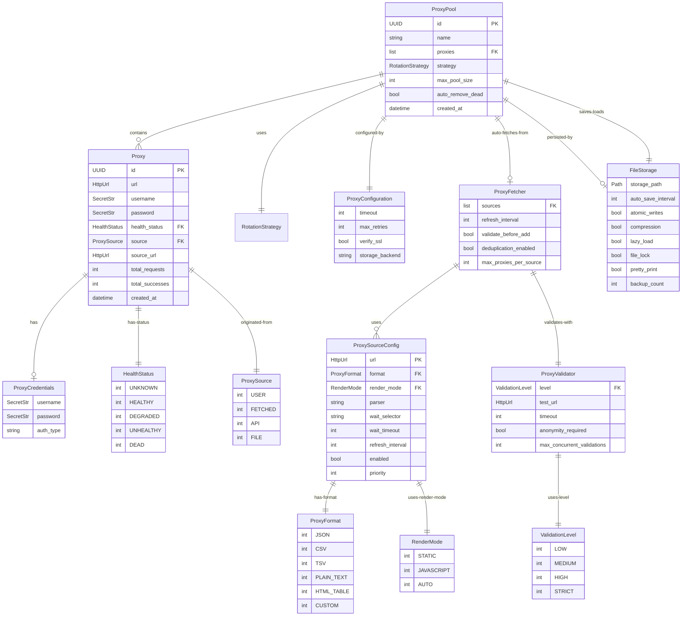

# Data Model

**Feature**: Core Python Package

## Entity Definitions

### 1. Proxy

Represents a single proxy server with connection details and metadata.

**Attributes**:

- `id` (UUID, generated): Unique identifier for the proxy
- `url` (HttpUrl, required): Full proxy URL (e.g., `http://proxy1.com:8080`)
- `protocol` (Literal["http", "https", "socks4", "socks5"], derived): Extracted from URL
- `username` (SecretStr, optional): Authentication username
- `password` (SecretStr, optional): Authentication password
- `health_status` (HealthStatus, default=UNKNOWN): Current health state
- `last_success_at` (datetime, optional): Timestamp of last successful request
- `last_failure_at` (datetime, optional): Timestamp of last failed request
- `total_requests` (int, default=0): Total requests made through this proxy
- `total_successes` (int, default=0): Total successful requests
- `total_failures` (int, default=0): Total failed requests
- `average_response_time_ms` (float, optional): Average response time in milliseconds
- `consecutive_failures` (int, default=0): Current streak of failures
- `tags` (set[str], default=set()): User-defined tags for grouping/filtering
- `source` (ProxySource, default=ProxySource.USER): Origin of proxy (user-provided, fetched)
- `source_url` (HttpUrl, optional): URL from which proxy was fetched (if applicable)
- `metadata` (dict[str, Any], default={}): User-defined metadata
- `created_at` (datetime, auto): Creation timestamp
- `updated_at` (datetime, auto): Last update timestamp

**Computed Properties**:

- `success_rate` (float): `total_successes / total_requests` if requests > 0, else 0.0
- `is_healthy` (bool): `health_status == HealthStatus.HEALTHY`
- `credentials` (dict | None): Combined username/password dict if both present

**Validation Rules**:

- URL must be valid HTTP/HTTPS/SOCKS URL
- Port must be included in URL
- Username and password must both be present or both absent
- `consecutive_failures` must be >= 0
- `total_requests` >= `total_successes` + `total_failures`

**Example**:

```python
proxy = Proxy(
    url="http://proxy1.example.com:8080",
    username="user123",
    password="secret456",
    tags={"residential", "us-west"},
    metadata={"provider": "ProxyProvider Inc"}
)
```

---

### 2. ProxyPool

Collection of proxies with management capabilities.

**Attributes**:

- `id` (UUID, generated): Unique identifier for the pool
- `name` (str, required): Human-readable pool name
- `proxies` (list[Proxy], default=[]): List of proxies in the pool
- `strategy` (RotationStrategy, default=RoundRobinStrategy()): Rotation algorithm
- `max_pool_size` (int, default=100): Maximum number of proxies allowed
- `auto_remove_dead` (bool, default=False): Automatically remove unhealthy proxies
- `dead_proxy_threshold` (int, default=5): Consecutive failures before marking dead
- `created_at` (datetime, auto): Creation timestamp
- `updated_at` (datetime, auto): Last update timestamp

**Computed Properties**:

- `size` (int): `len(proxies)`
- `healthy_count` (int): Count of proxies with `is_healthy == True`
- `unhealthy_count` (int): Count of proxies with `is_healthy == False`
- `total_requests` (int): Sum of all proxy `total_requests`
- `overall_success_rate` (float): Weighted average of all proxy success rates

**Methods**:

- `add_proxy(proxy: Proxy) -> None`: Add proxy to pool (enforces max_pool_size)
- `remove_proxy(proxy_id: UUID) -> None`: Remove proxy from pool
- `get_proxy_by_id(proxy_id: UUID) -> Proxy | None`: Find proxy by ID
- `filter_by_tags(tags: set[str]) -> list[Proxy]`: Get proxies matching tags
- `clear_unhealthy() -> int`: Remove all unhealthy proxies, return count removed

**Validation Rules**:

- Pool name must be non-empty
- `max_pool_size` must be > 0
- `dead_proxy_threshold` must be > 0
- Cannot add more than `max_pool_size` proxies

**Example**:

```python
pool = ProxyPool(
    name="US Residential Pool",
    max_pool_size=50,
    auto_remove_dead=True,
    dead_proxy_threshold=3
)
pool.add_proxy(proxy1)
pool.add_proxy(proxy2)
```

---

### 3. RotationStrategy (Protocol)

Protocol defining the interface for proxy rotation algorithms.

**Methods**:

- `select_proxy(pool: list[Proxy]) -> Proxy`: Select next proxy from pool
- `on_success(proxy: Proxy) -> None`: Callback after successful request
- `on_failure(proxy: Proxy, error: Exception) -> None`: Callback after failed request
- `reset() -> None`: Reset strategy state

**Validation Rules**:

- `select_proxy` must raise `ProxyPoolEmptyError` if pool is empty
- `select_proxy` should prioritize healthy proxies when possible

**Built-in Implementations**:

1. `RoundRobinStrategy`: Sequential rotation
2. `RandomStrategy`: Random selection
3. `WeightedStrategy`: Selection based on success rate weights
4. `LeastUsedStrategy`: Select proxy with fewest total requests

**Example**:

```python
class CustomStrategy:
    def select_proxy(self, pool: list[Proxy]) -> Proxy:
        # Custom logic: prefer proxies with lowest average response time
        return min(pool, key=lambda p: p.average_response_time_ms or float('inf'))
    
    def on_success(self, proxy: Proxy) -> None:
        pass
    
    def on_failure(self, proxy: Proxy, error: Exception) -> None:
        pass
    
    def reset(self) -> None:
        pass
```

---

### 4. ProxyCredentials

Secure credential storage for proxy authentication.

**Attributes**:

- `username` (SecretStr, required): Authentication username
- `password` (SecretStr, required): Authentication password
- `auth_type` (Literal["basic", "digest", "bearer"], default="basic"): Authentication method
- `additional_headers` (dict[str, str], default={}): Extra headers for auth

**Methods**:

- `to_httpx_auth() -> httpx.Auth`: Convert to httpx authentication object
- `to_dict(reveal: bool = False) -> dict`: Serialize (reveal=True exposes secrets)

**Validation Rules**:

- Username and password must be non-empty
- `auth_type` must be supported value

**Example**:

```python
creds = ProxyCredentials(
    username="api_user",
    password="secure_password_123",
    auth_type="basic"
)
auth = creds.to_httpx_auth()  # Use with httpx
```

---

### 5. ProxyConfiguration

Global configuration settings for the proxy system.

**Attributes**:

- `timeout` (int, default=30): Request timeout in seconds
- `max_retries` (int, default=3): Maximum retry attempts per request
- `verify_ssl` (bool, default=True): Verify SSL certificates
- `follow_redirects` (bool, default=True): Follow HTTP redirects
- `pool_connections` (int, default=10): httpx connection pool size
- `pool_max_keepalive` (int, default=20): Max keepalive connections
- `health_check_enabled` (bool, default=True): Enable periodic health checks
- `health_check_interval_seconds` (int, default=300): Health check interval (5 min)
- `health_check_url` (HttpUrl, default="http://httpbin.org/ip"): URL for health checks
- `health_check_timeout` (int, default=10): Health check timeout in seconds
- `log_level` (str, default="INFO"): Logging level
- `log_format` (str, default="json"): Log format (json or text)
- `log_redact_credentials` (bool, default=True): Redact credentials in logs
- `storage_backend` (Literal["memory", "sqlite"], default="memory"): Storage type
- `storage_path` (Path, optional): Path for persistent storage (if sqlite)

**Methods**:

- `to_httpx_limits() -> httpx.Limits`: Convert to httpx Limits object
- `validate_health_check() -> None`: Validate health check configuration

**Validation Rules**:

- `timeout` must be > 0
- `max_retries` must be >= 0
- `pool_connections` must be > 0
- `health_check_interval_seconds` must be > 0
- If `storage_backend == "sqlite"`, `storage_path` must be set

**Example**:

```python
config = ProxyConfiguration(
    timeout=45,
    max_retries=5,
    verify_ssl=True,
    health_check_enabled=True,
    health_check_interval_seconds=600,  # 10 minutes
    log_level="DEBUG",
    storage_backend="sqlite",
    storage_path=Path("/var/lib/proxywhirl/proxies.db")
)
```

---

### 6. HealthStatus (Enum)

Enumeration of proxy health states.

**Values**:

- `UNKNOWN` (0): Health status not yet determined
- `HEALTHY` (1): Proxy is operational and responsive
- `DEGRADED` (2): Proxy is slow or intermittently failing
- `UNHEALTHY` (3): Proxy is consistently failing
- `DEAD` (4): Proxy is unreachable or permanently failed

**Transitions**:

```
UNKNOWN → HEALTHY (first successful request)
UNKNOWN → UNHEALTHY (first failed request)
HEALTHY → DEGRADED (slow response or occasional failure)
DEGRADED → HEALTHY (sustained good performance)
DEGRADED → UNHEALTHY (increasing failures)
UNHEALTHY → DEAD (consecutive_failures >= threshold)
DEAD → HEALTHY (manual recovery or successful health check)
```

**Example**:

```python
if proxy.health_status == HealthStatus.DEAD:
    pool.remove_proxy(proxy.id)
```

---

### 7. ProxySource (Enum)

Enumeration of proxy origin types.

**Values**:

- `USER` (0): Manually provided by user
- `FETCHED` (1): Auto-fetched from external source
- `API` (2): Retrieved from API endpoint
- `FILE` (3): Loaded from configuration file

**Example**:

```python
# Filter to only user-provided proxies
user_proxies = [p for p in pool.proxies if p.source == ProxySource.USER]

# Filter to fetched proxies
fetched_proxies = [p for p in pool.proxies if p.source == ProxySource.FETCHED]
```

---

### 8. ProxyFetcher

Component for retrieving proxies from external sources.

**Attributes**:

- `sources` (list[ProxySourceConfig], required): List of proxy source configurations
- `refresh_interval` (int, default=3600): Auto-refresh interval in seconds (0 = disabled)
- `validate_before_add` (bool, default=True): Validate proxies before adding to pool
- `validator` (ProxyValidator, optional): Validator instance (uses default if None)
- `deduplication_enabled` (bool, default=True): Remove duplicate proxies
- `max_proxies_per_source` (int, default=1000): Limit proxies per source
- `timeout` (int, default=30): Timeout for fetching from each source
- `retry_failed_sources` (bool, default=True): Retry failed sources on next refresh

**Methods**:

- `fetch() -> list[Proxy]`: Fetch proxies from all configured sources
- `fetch_from_source(source: ProxySourceConfig) -> list[Proxy]`: Fetch from single source
- `add_source(source: ProxySourceConfig) -> None`: Add new proxy source
- `remove_source(source_url: str) -> None`: Remove proxy source
- `refresh() -> list[Proxy]`: Manually trigger refresh from all sources
- `get_source_stats() -> dict[str, SourceStats]`: Get statistics per source

**Example**:

```python
from proxywhirl import ProxyFetcher, ProxySourceConfig, ProxyFormat

fetcher = ProxyFetcher(
    sources=[
        ProxySourceConfig(
            url="https://api.proxyscrape.com/v2/?request=get&protocol=http&format=json",
            format=ProxyFormat.JSON,
            refresh_interval=1800
        ),
        ProxySourceConfig(
            url="https://www.free-proxy-list.net",
            format=ProxyFormat.HTML_TABLE,
            parser="table.table-striped"  # CSS selector
        )
    ],
    refresh_interval=3600,
    validate_before_add=True
)

# Fetch once
proxies = await fetcher.fetch()
print(f"Fetched {len(proxies)} valid proxies")

# Get source statistics
stats = fetcher.get_source_stats()
for source_url, stat in stats.items():
    print(f"{source_url}: {stat.total_fetched} fetched, {stat.valid_count} valid")
```

---

### 9. ProxySourceConfig

Configuration for a proxy list source.

**Attributes**:

- `url` (HttpUrl, required): URL to fetch proxy list from
- `format` (ProxyFormat, required): Format of the proxy list
- `render_mode` (RenderMode, default=AUTO): How to render the page (static, JS, auto-detect)
- `parser` (str, optional): Custom parser identifier or CSS selector
- `wait_selector` (str, optional): CSS selector to wait for (JS rendering)
- `wait_timeout` (int, default=30000): Max wait time in ms for JS rendering
- `refresh_interval` (int, default=3600): Refresh interval for this source
- `enabled` (bool, default=True): Whether source is active
- `priority` (int, default=0): Priority for weighted selection (higher = more important)
- `headers` (dict[str, str], default={}): HTTP headers for fetch request
- `auth` (tuple[str, str], optional): HTTP basic auth (username, password)
- `metadata` (dict[str, Any], default={}): Custom metadata for this source

**Example**:

```python
# Static HTML source
source1 = ProxySourceConfig(
    url="https://www.free-proxy-list.net",
    format=ProxyFormat.HTML_TABLE,
    render_mode=RenderMode.STATIC,
    parser="table.table-striped"
)

# JavaScript-rendered source
source2 = ProxySourceConfig(
    url="https://www.proxy-list.download/HTTP",
    format=ProxyFormat.HTML_TABLE,
    render_mode=RenderMode.JAVASCRIPT,
    wait_selector="table#proxylisttable",
    wait_timeout=10000
)

# Auto-detect (tries static first, falls back to JS)
source3 = ProxySourceConfig(
    url="https://api.example.com/proxies",
    format=ProxyFormat.JSON,
    render_mode=RenderMode.AUTO,
    priority=5,
    headers={"API-Key": "my-api-key"}
)
```

---

### 10. RenderMode (Enum)

Page rendering modes for fetching proxy lists.

**Values**:

- `STATIC` (0): Fetch HTML without JavaScript (fast, httpx)
- `JAVASCRIPT` (1): Render with headless browser (Playwright)
- `AUTO` (2): Try static first, fall back to JavaScript if needed

**Performance Comparison**:

- `STATIC`: ~100-500ms per fetch, low resource usage
- `JAVASCRIPT`: ~2-5s per fetch, requires Chromium browser
- `AUTO`: Same as STATIC on success, degrades to JAVASCRIPT on failure

**Example**:

```python
from proxywhirl import ProxySourceConfig, RenderMode

# Force JavaScript rendering for React/Vue apps
source = ProxySourceConfig(
    url="https://modern-spa-proxy-list.com",
    format=ProxyFormat.HTML_TABLE,
    render_mode=RenderMode.JAVASCRIPT,
    wait_selector="div.proxy-table"  # Wait for React component
)

# Use static for simple pages (faster)
source = ProxySourceConfig(
    url="https://simple-proxy-list.com",
    format=ProxyFormat.PLAIN_TEXT,
    render_mode=RenderMode.STATIC
)
```

---

### 11. ProxyFormat (Enum)

Supported proxy list formats.

**Values**:

- `JSON` (0): JSON array of proxy objects
- `CSV` (1): Comma-separated values
- `TSV` (2): Tab-separated values
- `PLAIN_TEXT` (3): Line-delimited proxy URLs
- `HTML_TABLE` (4): HTML `<table>` element (static or JS-rendered)
- `CUSTOM` (5): Custom parser required

**Example**:

```python
if source.format == ProxyFormat.JSON:
    proxies = json.loads(response.text)
elif source.format == ProxyFormat.HTML_TABLE:
    if source.render_mode == RenderMode.JAVASCRIPT:
        # Use Playwright to render page
        proxies = await parse_html_table_js(source.url, source.wait_selector)
    else:
        # Parse static HTML
        proxies = parse_html_table(response.text, source.parser)
```

---

### 12. ProxyValidator

Component for validating proxy connectivity and anonymity.

**Attributes**:

- `level` (ValidationLevel, default=MEDIUM): Validation strictness
- `test_url` (HttpUrl, default="http://httpbin.org/ip"): URL for connectivity tests
- `timeout` (int, default=5): Timeout per validation attempt
- `anonymity_required` (bool, default=False): Require anonymity verification
- `max_concurrent_validations` (int, default=50): Parallel validation limit
- `retry_count` (int, default=1): Retries per proxy validation

**Methods**:

- `validate(proxy: Proxy) -> bool`: Validate single proxy
- `validate_batch(proxies: list[Proxy]) -> list[Proxy]`: Validate multiple proxies
- `check_anonymity(proxy: Proxy) -> bool`: Verify proxy doesn't leak real IP
- `check_connectivity(proxy: Proxy) -> bool`: Test basic connectivity

**Example**:

```python
from proxywhirl import ProxyValidator, ValidationLevel

validator = ProxyValidator(
    level=ValidationLevel.HIGH,  # Format + connectivity + HTTP test
    test_url="https://api.ipify.org",
    timeout=10,
    anonymity_required=True,
    max_concurrent_validations=100
)

# Validate batch
valid_proxies = await validator.validate_batch(fetched_proxies)
print(f"{len(valid_proxies)}/{len(fetched_proxies)} proxies passed validation")

# Validate single proxy
is_valid = await validator.validate(proxy)
```

---

### 12. ValidationLevel (Enum)

Proxy validation strictness levels.

**Values**:

- `LOW` (0): Format validation only (fast)
- `MEDIUM` (1): Format + TCP connectivity test
- `HIGH` (2): Format + TCP + HTTP request test
- `STRICT` (3): Format + TCP + HTTP + anonymity verification

**Performance Comparison**:

- `LOW`: ~1ms per proxy, 0% false positives for format
- `MEDIUM`: ~100ms per proxy, ~10% false positives (unreachable proxies)
- `HIGH`: ~500ms per proxy, ~1% false positives
- `STRICT`: ~1000ms per proxy, ~0.1% false positives

**Example**:

```python
# For quick checks during rotation
quick_validator = ProxyValidator(level=ValidationLevel.LOW)

# For thorough validation when fetching
thorough_validator = ProxyValidator(level=ValidationLevel.HIGH)
```

---

### 13. SourceStats

Statistics for a proxy source.

**Attributes**:

- `source_url` (str, required): URL of the source
- `total_fetched` (int, default=0): Total proxies fetched from source
- `valid_count` (int, default=0): Number of valid proxies
- `invalid_count` (int, default=0): Number of invalid proxies
- `last_fetch_at` (datetime, optional): Timestamp of last fetch
- `last_fetch_duration_ms` (float, optional): Duration of last fetch
- `fetch_failure_count` (int, default=0): Number of failed fetch attempts
- `last_error` (str, optional): Last error message

**Example**:

```python
stats = fetcher.get_source_stats()
for source_url, stat in stats.items():
    if stat.valid_count == 0:
        print(f"Warning: {source_url} returned no valid proxies")
    if stat.fetch_failure_count > 3:
        print(f"Alert: {source_url} failing frequently")
```

---

### 14. FileStorage

JSON-based file persistence backend.

**Attributes**:

- `storage_path` (Path, required): File path for JSON storage
- `auto_save_interval` (int, default=0): Auto-save every N seconds (0=disabled)
- `atomic_writes` (bool, default=True): Use temp file + rename for safety
- `compression` (bool, default=False): Enable gzip compression
- `lazy_load` (bool, default=False): Load proxies on-demand (for large pools)
- `file_lock` (bool, default=True): Prevent concurrent write conflicts
- `pretty_print` (bool, default=True): Human-readable JSON formatting
- `backup_count` (int, default=3): Number of backup files to keep

**Methods**:

- `save(pool: ProxyPool) -> None`: Save pool to file
- `load() -> ProxyPool`: Load pool from file
- `auto_save_start(pool: ProxyPool) -> None`: Start background auto-save
- `auto_save_stop() -> None`: Stop background auto-save
- `create_backup() -> Path`: Create timestamped backup
- `get_file_size() -> int`: Get storage file size in bytes

**Example**:

```python
from pathlib import Path

# Manual save/load
storage = FileStorage(
    storage_path=Path("./data/proxies.json"),
    compression=True,
    backup_count=5
)
storage.save(pool)

# Auto-save with background worker
storage = FileStorage(
    storage_path=Path("./data/proxies.json"),
    auto_save_interval=300  # Every 5 minutes
)
storage.auto_save_start(pool)

# Lazy loading for large pools
storage = FileStorage(
    storage_path=Path("./data/large_pool.json"),
    lazy_load=True
)
pool = storage.load()  # Only loads metadata initially
```

**File Format**:

```json
{
  "version": "1.0",
  "pool_name": "main",
  "last_updated": "2025-01-21T10:30:00Z",
  "proxies": [
    {
      "id": "uuid-1234",
      "url": "http://proxy1.example.com",
      "port": 8080,
      "source": "free-proxy-list.net",
      "tags": ["http", "us", "high-speed"],
      "created_at": "2025-01-21T10:00:00Z"
    }
  ],
  "config": {
    "rotation_strategy": "weighted"
  }
}
```

---

## Entity Relationships



---

## Storage Considerations

### In-Memory Storage (Default)

- All entities stored in Python data structures
- Fast access, no persistence
- Suitable for short-lived processes or testing

### SQLite Storage (Optional)

- Entities mapped to SQLModel tables
- Persistent across restarts
- Suitable for long-running processes
- Async support via aiosqlite

**Tables**:

- `proxy` - Proxy entities

### JSON File Storage (Optional)

- Entities serialized to JSON files
- Human-readable, version-control friendly
- Zero configuration required
- Suitable for moderate-sized pools (<10k proxies)
- Supports atomic writes, compression, auto-save

**Features**:

- Atomic writes (temp file + rename)
- Gzip compression (50-70% size reduction)
- Auto-save with configurable interval
- Lazy loading for large pools
- Automatic backups with rotation
- `proxy_pool` - ProxyPool entities  
- `proxy_pool_members` - Many-to-many join table

**Migrations**: Use Alembic for schema migrations (out of scope for Phase 1)

---

## Serialization

All entities support:

- **JSON**: Via Pydantic `.model_dump()` and `.model_dump_json()`
- **Dict**: Via `.model_dump()` with `exclude` and `include` options
- **Secure Export**: Credentials automatically redacted unless `reveal=True`

**Example**:

```python
# Safe serialization (credentials hidden)
proxy_dict = proxy.model_dump()
# {'id': '...', 'url': 'http://proxy1.com:8080', 'username': '**********', ...}

# Full serialization (reveal secrets)
proxy_dict = proxy.model_dump(mode='json', exclude_none=True)
```

---

## Immutability & Thread Safety

- **Proxy**: Mutable (stats updated frequently), not thread-safe without locks
- **ProxyPool**: Mutable (proxies added/removed), not thread-safe without locks
- **ProxyCredentials**: Immutable after creation
- **ProxyConfiguration**: Immutable after creation (frozen=True)
- **HealthStatus**: Immutable enum

**Thread Safety Strategy**: Use `threading.Lock` for sync operations, `asyncio.Lock` for async operations when modifying Proxy or ProxyPool.

---

## Next Steps

1. Create `/contracts/` directory with API contracts
2. Create `quickstart.md` with usage examples
3. Run `.specify/scripts/bash/update-agent-context.sh copilot`
