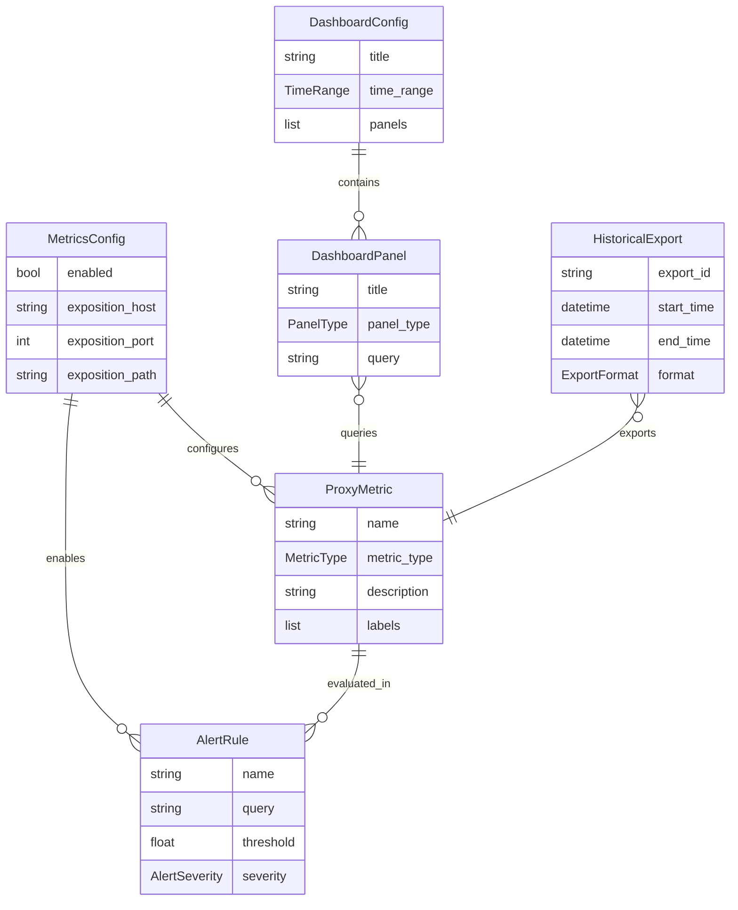

# Data Model: Metrics Observability & Performance

**Feature**: 008-metrics-observability-performance  
**Date**: 2025-11-01  
**Phase**: Phase 1 - Design & Contracts

## Overview

This document defines the core entities, their fields, relationships, validation rules, and state transitions for the metrics observability and performance monitoring system.

---

## Entity: MetricsConfig

**Description**: Configuration for metrics collection and exposition.

**Purpose**: Centralized settings for enabling/disabling metrics, configuring scrape endpoints, and defining metric retention policies.

**Lifecycle**: Loaded at application startup, hot-reloadable without restart.

### Fields

| Field | Type | Required | Default | Validation | Description |
|-------|------|----------|---------|------------|-------------|
| `enabled` | `bool` | Yes | `True` | - | Enable/disable metrics collection globally |
| `exposition_host` | `str` | Yes | `"0.0.0.0"` | Must be valid IP or hostname | Host for /metrics endpoint |
| `exposition_port` | `int` | Yes | `9090` | Must be 1024-65535 | Port for /metrics endpoint |
| `exposition_path` | `str` | Yes | `"/metrics"` | Must start with `/` | HTTP path for metrics endpoint |
| `scrape_interval_seconds` | `int` | Yes | `60` | Must be 1-3600 | Expected Prometheus scrape interval |
| `enable_process_metrics` | `bool` | Yes | `True` | - | Include Python process metrics (CPU, memory) |
| `enable_pool_metrics` | `bool` | Yes | `True` | - | Include proxy pool size/health metrics |
| `enable_request_metrics` | `bool` | Yes | `True` | - | Include request count/latency metrics |
| `histogram_buckets` | `List[float]` | Yes | `[0.1, 0.5, 1.0, 2.0, 5.0, 10.0]` | Must be ascending | Latency histogram bucket boundaries (seconds) |
| `label_cardinality_limit` | `int` | Yes | `1000` | Must be 100-10000 | Max unique label combinations to prevent cardinality explosion |
| `basic_auth_username` | `Optional[str]` | No | `None` | Min length 3 if provided | Username for /metrics basic auth |
| `basic_auth_password` | `Optional[SecretStr]` | No | `None` | Min length 8 if provided | Password for /metrics basic auth |

### Validation Rules

- If `basic_auth_username` is set, `basic_auth_password` must also be set (and vice versa)
- `histogram_buckets` must contain at least 2 values and be strictly ascending
- `exposition_port` must not conflict with FastAPI main port (default 8000)

### Example

```python
from proxywhirl.metrics import MetricsConfig
from pydantic import SecretStr

config = MetricsConfig(
    enabled=True,
    exposition_host="127.0.0.1",
    exposition_port=9090,
    exposition_path="/metrics",
    scrape_interval_seconds=60,
    histogram_buckets=[0.1, 0.5, 1.0, 2.0, 5.0],
    basic_auth_username="prometheus",
    basic_auth_password=SecretStr("secure_password")
)
```

---

## Entity: ProxyMetric

**Description**: Runtime representation of a single Prometheus metric.

**Purpose**: Wrapper around prometheus-client metric objects with metadata.

**Lifecycle**: Created at application startup, updated during proxy operations, scraped by Prometheus.

### Fields

| Field | Type | Required | Default | Validation | Description |
|-------|------|----------|---------|------------|-------------|
| `name` | `str` | Yes | - | Must match `^[a-zA-Z_:][a-zA-Z0-9_:]*$` | Metric name (Prometheus naming convention) |
| `metric_type` | `MetricType` | Yes | - | Must be enum value | Type: COUNTER, GAUGE, HISTOGRAM, SUMMARY |
| `description` | `str` | Yes | - | Min length 10 | Human-readable metric description |
| `labels` | `List[str]` | Yes | `[]` | Each label must match `^[a-zA-Z_][a-zA-Z0-9_]*$` | Label names for this metric |
| `prometheus_metric` | `Any` | Yes | - | Must be prometheus-client object | Underlying Prometheus metric instance |
| `created_at` | `datetime` | Yes | `datetime.now(timezone.utc)` | - | Timestamp when metric was registered |

### Metric Types (Enum)

```python
from enum import Enum

class MetricType(str, Enum):
    COUNTER = "counter"      # Monotonically increasing (e.g., request count)
    GAUGE = "gauge"          # Point-in-time value (e.g., pool size)
    HISTOGRAM = "histogram"  # Distribution (e.g., latency)
    SUMMARY = "summary"      # Similar to histogram, with quantiles
```

### Example

```python
from prometheus_client import Counter
from proxywhirl.metrics import ProxyMetric, MetricType

metric = ProxyMetric(
    name="proxywhirl_requests_total",
    metric_type=MetricType.COUNTER,
    description="Total number of proxy requests",
    labels=["pool", "region", "status"],
    prometheus_metric=Counter(
        "proxywhirl_requests_total",
        "Total number of proxy requests",
        ["pool", "region", "status"]
    )
)
```

---

## Entity: AlertRule

**Description**: Configuration for automated performance degradation alerts.

**Purpose**: Define thresholds, notification channels, and alert behavior.

**Lifecycle**: Loaded from YAML configuration, evaluated by Prometheus AlertManager.

### Fields

| Field | Type | Required | Default | Validation | Description |
|-------|------|----------|---------|------------|-------------|
| `name` | `str` | Yes | - | Must be unique, alphanumeric + underscores | Alert rule identifier |
| `query` | `str` | Yes | - | Must be valid PromQL expression | Prometheus query expression |
| `threshold` | `float` | Yes | - | Must be > 0 | Threshold value for alert firing |
| `comparison` | `ComparisonOperator` | Yes | - | Must be enum value | Comparison operator (GT, LT, EQ) |
| `duration` | `str` | Yes | `"5m"` | Must be valid Prometheus duration | How long condition must be true before firing |
| `severity` | `AlertSeverity` | Yes | - | Must be enum value | Alert severity level |
| `summary` | `str` | Yes | - | Min length 10 | Short alert description |
| `description` | `str` | Yes | - | Min length 20 | Detailed alert description with context |
| `annotations` | `Dict[str, str]` | No | `{}` | Keys must be alphanumeric | Additional alert metadata |
| `notification_channels` | `List[str]` | Yes | `[]` | Min 1 channel, max 10 channels | Notification destinations (email, Slack, etc) |
| `suppression_enabled` | `bool` | Yes | `False` | - | Enable alert suppression during maintenance |
| `suppression_schedule` | `Optional[str]` | No | `None` | Must be cron expression if provided | Cron schedule for auto-suppression |

### Comparison Operators (Enum)

```python
class ComparisonOperator(str, Enum):
    GT = "greater_than"        # >
    LT = "less_than"           # <
    EQ = "equal"               # ==
    GTE = "greater_than_equal" # >=
    LTE = "less_than_equal"    # <=
```

### Alert Severity (Enum)

```python
class AlertSeverity(str, Enum):
    INFO = "info"           # Informational, no action required
    WARNING = "warning"     # Attention needed, not urgent
    CRITICAL = "critical"   # Immediate action required
```

### Validation Rules

- `query` must be a valid PromQL expression (syntax validation at load time)
- `duration` must match Prometheus duration format: `\d+[smhd]` (e.g., "5m", "1h")
- `notification_channels` must reference configured channels (validated against AlertManager config)
- If `suppression_schedule` is set, `suppression_enabled` must be `True`

### State Transitions

```
[Inactive] --[Threshold Exceeded]--> [Pending]
[Pending] --[Duration Met]--> [Firing]
[Firing] --[Threshold No Longer Met]--> [Resolved]
[Pending] --[Threshold No Longer Met]--> [Inactive]
[Firing] --[Suppression Enabled]--> [Suppressed]
[Suppressed] --[Suppression Disabled]--> [Firing]
```

### Example

```python
from proxywhirl.metrics import AlertRule, AlertSeverity, ComparisonOperator

rule = AlertRule(
    name="proxy_pool_high_error_rate",
    query='rate(proxywhirl_requests_total{status="error"}[5m])',
    threshold=0.05,  # 5% error rate
    comparison=ComparisonOperator.GT,
    duration="5m",
    severity=AlertSeverity.WARNING,
    summary="High error rate in proxy pool {{ $labels.pool }}",
    description="Error rate is {{ $value | humanizePercentage }} over 5 minutes",
    annotations={
        "runbook": "https://wiki.company.com/runbooks/proxy-errors",
        "dashboard": "https://grafana.company.com/d/proxywhirl"
    },
    notification_channels=["slack-ops", "pagerduty-oncall"],
    suppression_enabled=False
)
```

---

## Entity: DashboardConfig

**Description**: Configuration for Grafana dashboard generation.

**Purpose**: Define dashboard layout, panels, queries, and refresh intervals.

**Lifecycle**: Used to generate Grafana JSON dashboard templates.

### Fields

| Field | Type | Required | Default | Validation | Description |
|-------|------|----------|---------|------------|-------------|
| `title` | `str` | Yes | - | Min length 3 | Dashboard title |
| `description` | `str` | No | `""` | - | Dashboard description |
| `time_range` | `TimeRange` | Yes | - | - | Default time range for panels |
| `refresh_interval` | `str` | Yes | `"30s"` | Must be valid Grafana interval | Auto-refresh interval |
| `panels` | `List[DashboardPanel]` | Yes | `[]` | Min 1 panel, max 50 panels | Dashboard panel definitions |
| `variables` | `List[DashboardVariable]` | No | `[]` | Max 20 variables | Template variables (dropdowns) |
| `tags` | `List[str]` | No | `[]` | Max 10 tags | Dashboard tags for organization |

### Time Range (Nested Model)

| Field | Type | Required | Default | Description |
|-------|------|----------|---------|-------------|
| `from_time` | `str` | Yes | `"now-6h"` | Grafana time expression (e.g., "now-6h", "now-1d") |
| `to_time` | `str` | Yes | `"now"` | Grafana time expression |

### Dashboard Panel (Nested Model)

| Field | Type | Required | Default | Description |
|-------|------|----------|---------|-------------|
| `title` | `str` | Yes | - | Panel title |
| `panel_type` | `PanelType` | Yes | - | Panel visualization type |
| `query` | `str` | Yes | - | PromQL query expression |
| `legend` | `str` | No | `"{{ label }}"` | Legend template |
| `unit` | `str` | No | `"short"` | Y-axis unit (e.g., "short", "percent", "ms") |
| `thresholds` | `List[Threshold]` | No | `[]` | Visual thresholds (colors) |

### Panel Type (Enum)

```python
class PanelType(str, Enum):
    GRAPH = "graph"            # Time-series line chart
    STAT = "stat"              # Single stat panel
    TABLE = "table"            # Tabular data
    HEATMAP = "heatmap"        # Heatmap visualization
    GAUGE = "gauge"            # Gauge/dial visualization
```

### Example

```python
from proxywhirl.metrics import DashboardConfig, TimeRange, DashboardPanel, PanelType

config = DashboardConfig(
    title="ProxyWhirl Performance Dashboard",
    description="Real-time proxy pool monitoring",
    time_range=TimeRange(from_time="now-6h", to_time="now"),
    refresh_interval="30s",
    panels=[
        DashboardPanel(
            title="Request Success Rate",
            panel_type=PanelType.GRAPH,
            query='rate(proxywhirl_requests_total{status="success"}[5m]) / rate(proxywhirl_requests_total[5m])',
            unit="percentunit",  # Grafana percent format (0-1)
            legend="{{ pool }}"
        ),
        DashboardPanel(
            title="P95 Latency",
            panel_type=PanelType.GRAPH,
            query='histogram_quantile(0.95, rate(proxywhirl_request_duration_seconds_bucket[5m]))',
            unit="s",
            legend="{{ pool }}"
        )
    ],
    tags=["proxywhirl", "performance", "monitoring"]
)
```

---

## Entity: HistoricalExport

**Description**: Metadata for historical metrics export requests.

**Purpose**: Track export jobs, file locations, and time ranges for auditing.

**Lifecycle**: Created when user requests export, persisted for audit trail.

### Fields

| Field | Type | Required | Default | Validation | Description |
|-------|------|----------|---------|------------|-------------|
| `export_id` | `str` | Yes | Auto-generated UUID | Must be valid UUID | Unique export identifier |
| `requested_at` | `datetime` | Yes | `datetime.now(timezone.utc)` | - | Timestamp when export was requested |
| `requested_by` | `str` | Yes | - | Min length 3 | User/system that requested export |
| `metric_names` | `List[str]` | Yes | `[]` | Min 1 metric, max 50 metrics | List of metrics to export |
| `start_time` | `datetime` | Yes | - | Must be before end_time | Export time range start |
| `end_time` | `datetime` | Yes | - | Must be after start_time | Export time range end |
| `format` | `ExportFormat` | Yes | - | Must be enum value | Export file format |
| `filters` | `Dict[str, str]` | No | `{}` | Max 10 filters | Label filters (e.g., {"pool": "us-east"}) |
| `output_path` | `str` | Yes | - | Must be valid file path | File system path for exported data |
| `status` | `ExportStatus` | Yes | `ExportStatus.PENDING` | Must be enum value | Export job status |
| `completed_at` | `Optional[datetime]` | No | `None` | - | Timestamp when export completed |
| `error_message` | `Optional[str]` | No | `None` | - | Error details if export failed |
| `file_size_bytes` | `Optional[int]` | No | `None` | Must be >= 0 | Size of exported file |

### Export Format (Enum)

```python
class ExportFormat(str, Enum):
    CSV = "csv"
    JSON = "json"
    PARQUET = "parquet"  # Future: columnar format for large exports
```

### Export Status (Enum)

```python
class ExportStatus(str, Enum):
    PENDING = "pending"      # Export queued, not started
    IN_PROGRESS = "in_progress"  # Export running
    COMPLETED = "completed"  # Export successful
    FAILED = "failed"        # Export failed with error
```

### State Transitions

```
[Pending] --[Export Started]--> [In Progress]
[In Progress] --[Export Successful]--> [Completed]
[In Progress] --[Export Failed]--> [Failed]
[Pending] --[Timeout]--> [Failed]
```

### Validation Rules

- `end_time - start_time` must be <= 365 days (prevent excessive queries)
- `filters` keys must be valid Prometheus label names
- `output_path` must be writable by the application

### Example

```python
from datetime import datetime, timezone, timedelta
from proxywhirl.metrics import HistoricalExport, ExportFormat, ExportStatus

export = HistoricalExport(
    export_id="550e8400-e29b-41d4-a716-446655440000",
    requested_at=datetime.now(timezone.utc),
    requested_by="analyst@company.com",
    metric_names=["proxywhirl_requests_total", "proxywhirl_request_duration_seconds"],
    start_time=datetime.now(timezone.utc) - timedelta(days=90),
    end_time=datetime.now(timezone.utc),
    format=ExportFormat.CSV,
    filters={"pool": "us-east-1"},
    output_path="/exports/proxywhirl_metrics_90days.csv",
    status=ExportStatus.PENDING
)
```

---

## Relationships



---

## Validation Summary

### Cross-Entity Validation

1. **Alert Rules must reference existing metrics**: `AlertRule.query` must use metric names defined in `ProxyMetric`
2. **Dashboard panels must reference existing metrics**: `DashboardPanel.query` must use metric names defined in `ProxyMetric`
3. **Historical exports must reference existing metrics**: `HistoricalExport.metric_names` must match `ProxyMetric.name`
4. **Label cardinality enforcement**: Total unique label combinations across all `ProxyMetric` instances must not exceed `MetricsConfig.label_cardinality_limit`

### Runtime Validation

- Prometheus query syntax validation at configuration load time (fail fast)
- Metric name collision detection (prevent duplicate registrations)
- Label name validation against Prometheus naming rules
- Alert notification channel existence validation

---

## Security Considerations

### Sensitive Data Handling

- `MetricsConfig.basic_auth_password` uses Pydantic `SecretStr` (never logged)
- No proxy credentials or IP addresses in metric labels (per constitution)
- Alert descriptions must not include sensitive data (sanitization required)

### Access Control

- `/metrics` endpoint can be protected with HTTP basic auth
- Dashboard access controlled by Grafana authentication (not ProxyWhirl's responsibility)
- Historical export files should have restrictive file permissions (0600)

---

## Next Steps

With data model defined, proceed to:
1. **contracts/**: Generate OpenAPI spec for /metrics endpoint
2. **contracts/**: Generate Prometheus scrape config examples
3. **contracts/**: Generate AlertManager rule templates
4. **quickstart.md**: User guide for setup and configuration
